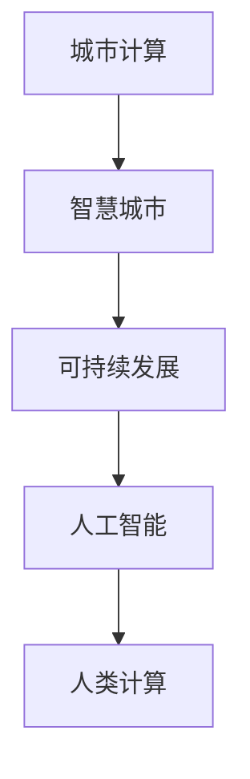

                 

# AI与人类计算：打造可持续发展的城市环境管理

> 关键词：城市计算,智慧城市,可持续发展,环境管理,人工智能

## 1. 背景介绍

### 1.1 问题由来
随着全球人口的不断增长和城市化的加速，城市环境问题变得日益严峻，如交通拥堵、空气污染、水资源短缺、垃圾处理等。这些问题不仅影响城市居民的生活质量，还关系到国家的社会稳定和经济发展。如何利用先进技术手段，构建智慧城市，实现城市的可持续发展，成为了全球各国面临的重要课题。

### 1.2 问题核心关键点
智慧城市建设的关键在于通过数据收集、分析和应用，实现对城市运行状态的实时监控和优化。AI与人类计算的结合，正是在这样的背景下应运而生。利用AI技术进行城市环境管理的各个环节，如数据分析、决策支持、预测预警等，可以大幅提升城市管理效率和质量，实现城市的可持续发展。

## 2. 核心概念与联系

### 2.1 核心概念概述

为更好地理解AI与人类计算在城市环境管理中的应用，本节将介绍几个关键概念：

- 城市计算(Urban Computing)：利用信息技术手段，对城市中的各种数据进行采集、分析和应用，以支持城市管理和公共服务，提升城市运行效率和居民生活质量。

- 智慧城市(Smart City)：通过信息技术与城市规划的深度融合，实现城市功能的智能化、服务的人性化和管理的精细化，推动城市可持续发展。

- 可持续发展(Sustainable Development)：在满足当代人需求的同时，不损害后代人满足其需求的能力，强调环境保护与经济社会发展的平衡。

- 人工智能(Artificial Intelligence, AI)：通过模拟人类智能行为，实现信息处理、模式识别、决策支持等任务，具有高度的自主学习与适应能力。

- 人类计算(Human-in-the-Loop, HiT)：将人类专家的知识和决策融入到AI系统中，使AI在处理复杂问题时能够结合人类的直觉和经验，提升AI的决策水平和系统可靠性。

这些核心概念之间的逻辑关系可以通过以下Mermaid流程图来展示：



这个流程图展示了一个从城市计算到智慧城市，再到可持续发展，最终应用到人工智能和人类计算的逻辑链条：

1. 城市计算提供对城市数据全面采集和分析的支持。
2. 智慧城市利用城市计算的数据，实现城市功能的智能化和精细化管理。
3. 可持续发展是智慧城市建设的目标，即在技术应用中注重环境保护和社会效益。
4. 人工智能与人类计算相结合，实现高效的决策支持和问题解决，提升智慧城市的管理质量。

## 3. 核心算法原理 & 具体操作步骤
### 3.1 算法原理概述

城市环境管理涉及海量数据采集和分析，AI与人类计算的结合可以极大地提升城市管理的智能化和精细化水平。AI算法在城市环境管理中主要应用于数据挖掘、模式识别、预测分析等任务，而人类计算则通过专家知识库、用户反馈等辅助AI系统进行优化决策。

基于城市环境管理的AI算法，主要包括以下几个方面：

- 数据挖掘：从城市数据中提取有用信息，如交通流量、水质监测、垃圾处理等。
- 模式识别：通过图像识别、语音识别等技术，对城市环境中的各种现象进行自动识别和分类。
- 预测分析：利用历史数据和机器学习模型，对城市环境中的未来变化进行预测，如交通拥堵预测、污染源追踪等。
- 决策支持：结合人类专家的知识和经验，辅助城市管理者进行决策。

### 3.2 算法步骤详解

基于AI与人类计算的城市环境管理主要包括以下几个步骤：

**Step 1: 数据采集与预处理**
- 利用传感器、摄像头、GPS等设备，收集城市中的各种数据，如交通流量、空气质量、水质监测等。
- 对采集到的原始数据进行清洗和预处理，包括去噪、归一化、缺失值处理等。

**Step 2: 数据建模与分析**
- 将处理后的数据输入到AI算法中进行建模和分析。常用的AI算法包括决策树、随机森林、神经网络、深度学习等。
- 通过算法模型提取城市环境中的关键特征和模式，如交通拥堵的规律、污染源的分布等。

**Step 3: 预测与决策支持**
- 利用预测模型对未来城市环境变化进行预测，如预测交通拥堵、污染扩散等。
- 结合专家知识和用户反馈，进行决策支持，如优化交通信号灯、调整污水处理策略等。

**Step 4: 系统集成与部署**
- 将AI算法和专家知识库进行系统集成，实现城市管理系统的智能化。
- 将系统部署到城市管理控制中心，实现对城市运行的实时监控和优化。

### 3.3 算法优缺点

基于AI与人类计算的城市环境管理方法具有以下优点：

- 高效准确：AI算法在处理大量数据时具有高效性和准确性，可以快速分析城市运行状况，提供可靠的决策支持。
- 精细管理：结合人类计算，AI系统能够结合专家的知识和经验，实现更精细化的城市管理。
- 适应性强：AI系统具备自适应学习能力，能够根据城市运行状态的变化进行调整。

但该方法也存在以下局限性：

- 依赖数据：AI系统的有效性依赖于数据的完整性和质量，数据采集和预处理环节复杂且成本高。
- 黑箱问题：AI算法的决策过程复杂，缺乏可解释性，难以满足高风险应用的需求。
- 安全风险：AI系统的决策可能受到数据偏差和算法漏洞的影响，存在安全风险。

尽管存在这些局限性，但基于AI与人类计算的城市环境管理方法仍然是当前智慧城市建设的重要手段，通过不断的技术创新和优化，未来必将为城市管理带来更大的价值。

### 3.4 算法应用领域

基于AI与人类计算的城市环境管理方法已经在多个领域得到了应用，包括但不限于：

- 交通管理：通过AI系统实时监控交通流量，优化信号灯控制，减少交通拥堵。
- 环境监测：利用传感器网络监测空气质量、水质等环境指标，预警环境污染。
- 公共安全：利用图像识别、语音识别技术，实时监控和预警城市中的各种安全事件。
- 能源管理：通过智能电网和智能建筑管理系统，实现能源的优化配置和使用。
- 应急响应：结合AI和专家知识库，快速响应城市中的突发事件，如火灾、地震等。

## 4. 数学模型和公式 & 详细讲解 & 举例说明
### 4.1 数学模型构建

本节将使用数学语言对基于AI与人类计算的城市环境管理过程进行更加严格的刻画。

假设城市环境管理的数据集为 $D=\{x_i, y_i\}_{i=1}^N$，其中 $x_i$ 为输入数据，如交通流量、空气质量等，$y_i$ 为输出数据，如预测结果、决策指令等。

定义数据集的经验风险为：

$$
\mathcal{L}(\theta) = \frac{1}{N}\sum_{i=1}^N \ell(y_i, f(x_i; \theta))
$$

其中，$\ell$ 为损失函数，$f(x; \theta)$ 为模型预测函数，$\theta$ 为模型参数。

微调的目标是最小化经验风险，即找到最优参数：

$$
\theta^* = \mathop{\arg\min}_{\theta} \mathcal{L}(\theta)
$$

在实践中，我们通常使用基于梯度的优化算法（如SGD、Adam等）来近似求解上述最优化问题。设 $\eta$ 为学习率，$\lambda$ 为正则化系数，则参数的更新公式为：

$$
\theta \leftarrow \theta - \eta \nabla_{\theta}\mathcal{L}(\theta) - \eta\lambda\theta
$$

其中 $\nabla_{\theta}\mathcal{L}(\theta)$ 为损失函数对参数 $\theta$ 的梯度，可通过反向传播算法高效计算。

### 4.2 公式推导过程

以下我们以交通流量预测为例，推导最小二乘法回归模型的损失函数及其梯度计算公式。

假设模型的预测结果为 $f(x; \theta) = \theta_0 + \sum_{i=1}^n \theta_i x_i$，真实值为 $y_i$。则最小二乘法回归模型的损失函数为：

$$
\ell(y_i, f(x_i; \theta)) = \frac{1}{2}(y_i - f(x_i; \theta))^2
$$

将其代入经验风险公式，得：

$$
\mathcal{L}(\theta) = \frac{1}{2N}\sum_{i=1}^N (y_i - f(x_i; \theta))^2
$$

根据链式法则，损失函数对参数 $\theta_k$ 的梯度为：

$$
\frac{\partial \mathcal{L}(\theta)}{\partial \theta_k} = \frac{1}{N}\sum_{i=1}^N (y_i - f(x_i; \theta))(x_i)_k
$$

其中 $(x_i)_k$ 为数据 $x_i$ 的第 $k$ 个特征值。

在得到损失函数的梯度后，即可带入参数更新公式，完成模型的迭代优化。重复上述过程直至收敛，最终得到适应城市环境管理的最优模型参数 $\theta^*$。

## 5. 项目实践：代码实例和详细解释说明
### 5.1 开发环境搭建

在进行城市环境管理AI系统的开发前，我们需要准备好开发环境。以下是使用Python进行PyTorch开发的环境配置流程：

1. 安装Anaconda：从官网下载并安装Anaconda，用于创建独立的Python环境。

2. 创建并激活虚拟环境：
```bash
conda create -n ai-env python=3.8 
conda activate ai-env
```

3. 安装PyTorch：根据CUDA版本，从官网获取对应的安装命令。例如：
```bash
conda install pytorch torchvision torchaudio cudatoolkit=11.1 -c pytorch -c conda-forge
```

4. 安装各类工具包：
```bash
pip install numpy pandas scikit-learn matplotlib tqdm jupyter notebook ipython
```

完成上述步骤后，即可在`ai-env`环境中开始AI系统的开发。

### 5.2 源代码详细实现

下面我以交通流量预测为例，给出使用PyTorch进行AI模型开发的PyTorch代码实现。

首先，定义交通流量预测任务的模型类：

```python
import torch
import torch.nn as nn
import torch.optim as optim

class TrafficFlowPredictor(nn.Module):
    def __init__(self, input_dim, output_dim, hidden_dim):
        super(TrafficFlowPredictor, self).__init__()
        self.linear1 = nn.Linear(input_dim, hidden_dim)
        self.linear2 = nn.Linear(hidden_dim, output_dim)
    
    def forward(self, x):
        x = torch.relu(self.linear1(x))
        x = self.linear2(x)
        return x
```

然后，定义模型训练函数：

```python
def train_model(model, train_loader, optimizer, criterion):
    model.train()
    for batch in train_loader:
        inputs, labels = batch
        optimizer.zero_grad()
        outputs = model(inputs)
        loss = criterion(outputs, labels)
        loss.backward()
        optimizer.step()
    return loss.item()
```

接着，定义模型评估函数：

```python
def evaluate_model(model, test_loader, criterion):
    model.eval()
    total_loss = 0
    with torch.no_grad():
        for batch in test_loader:
            inputs, labels = batch
            outputs = model(inputs)
            loss = criterion(outputs, labels)
            total_loss += loss.item()
    return total_loss / len(test_loader)
```

最后，启动训练流程并在测试集上评估：

```python
epochs = 100
batch_size = 32

model = TrafficFlowPredictor(input_dim=5, output_dim=1, hidden_dim=10)
optimizer = optim.Adam(model.parameters(), lr=0.001)
criterion = nn.MSELoss()

train_loader = torch.utils.data.DataLoader(train_dataset, batch_size=batch_size, shuffle=True)
test_loader = torch.utils.data.DataLoader(test_dataset, batch_size=batch_size, shuffle=False)

for epoch in range(epochs):
    train_loss = train_model(model, train_loader, optimizer, criterion)
    test_loss = evaluate_model(model, test_loader, criterion)
    print(f"Epoch {epoch+1}, train loss: {train_loss:.3f}, test loss: {test_loss:.3f}")
```

以上就是使用PyTorch对交通流量预测模型进行训练的完整代码实现。可以看到，得益于PyTorch的强大封装，我们可以用相对简洁的代码完成模型训练和评估。

### 5.3 代码解读与分析

让我们再详细解读一下关键代码的实现细节：

**TrafficFlowPredictor类**：
- `__init__`方法：定义模型的结构，包括输入层、隐藏层和输出层。
- `forward`方法：前向传播计算模型的输出。

**train_model和evaluate_model函数**：
- 分别用于训练和评估模型的性能。训练时，对每个批次的数据进行前向传播和反向传播，更新模型参数；评估时，只进行前向传播，计算模型在测试集上的损失。

**训练流程**：
- 定义总的epoch数和batch size，开始循环迭代
- 每个epoch内，先训练模型，然后评估模型在测试集上的性能
- 重复上述步骤直至满足预设的迭代轮数

可以看到，PyTorch配合TensorFlow等深度学习框架使得AI系统的开发和训练变得简洁高效。开发者可以将更多精力放在数据处理、模型改进等高层逻辑上，而不必过多关注底层的实现细节。

当然，工业级的系统实现还需考虑更多因素，如模型的保存和部署、超参数的自动搜索、更灵活的模型结构等。但核心的AI算法原理基本与此类似。

## 6. 实际应用场景
### 6.1 智能交通管理系统

基于AI与人类计算的智能交通管理系统，能够实时监控和优化城市交通流量，提升交通管理的智能化水平。具体应用包括：

- 交通流量预测：利用AI模型预测未来交通流量变化，优化交通信号灯控制，减少交通拥堵。
- 实时监控：通过摄像头、传感器等设备实时采集交通数据，监控交通运行状态，预警突发事件。
- 路径规划：根据交通状况，提供最优路径推荐，提升出行效率。

### 6.2 智能能源管理系统

智能能源管理系统通过AI与人类计算的结合，实现对城市能源的优化配置和使用，减少能源浪费，提升能源利用效率。具体应用包括：

- 能源需求预测：利用AI模型预测城市能源需求变化，优化能源供应和分配策略。
- 能效优化：通过智能建筑管理系统，优化建筑能耗，降低碳排放。
- 智能电网：结合AI技术，优化电网运行，提高电力供应的稳定性。

### 6.3 智能环境监测系统

智能环境监测系统利用AI与人类计算的结合，实现对城市环境的实时监控和预警，保障城市环境安全。具体应用包括：

- 空气质量监测：通过传感器网络监测城市空气质量，预警污染事件。
- 水质监测：利用物联网设备实时采集水质数据，预警水质异常。
- 噪音监测：通过声音传感器监测城市噪音水平，预警噪音污染。

### 6.4 未来应用展望

随着AI与人类计算技术的不断发展，基于AI与人类计算的城市环境管理将呈现以下几个发展趋势：

1. 数据驱动的决策：AI系统将更加依赖数据驱动决策，通过大数据分析提升城市管理的智能化水平。
2. 多模态融合：未来的城市环境管理将实现多模态数据的融合，如交通数据、环境数据、气象数据等的协同优化。
3. 自适应学习：AI系统将具备更强的自适应学习能力，根据城市运行状态的变化进行调整，提升系统的适应性和鲁棒性。
4. 协同优化：AI系统将与城市管理系统、公共服务系统等进行深度融合，实现城市功能的协同优化。
5. 安全保障：未来的城市环境管理将更加注重系统的安全性和可靠性，保障城市环境管理的安全性和稳定性。

这些趋势凸显了AI与人类计算在城市环境管理中的应用前景，通过不断的技术创新和优化，必将为城市的可持续发展提供更强大的技术支持。

## 7. 工具和资源推荐
### 7.1 学习资源推荐

为了帮助开发者系统掌握AI与人类计算的理论基础和实践技巧，这里推荐一些优质的学习资源：

1. 《AI与城市计算》系列博文：由大模型技术专家撰写，深入浅出地介绍了AI与城市计算的原理和应用。

2. 《智慧城市》课程：斯坦福大学开设的智慧城市相关课程，涵盖智慧城市的定义、框架、技术应用等内容。

3. 《城市计算导论》书籍：全面介绍了城市计算的基本概念、技术和应用，适合初学者入门。

4. CS224N《深度学习自然语言处理》课程：斯坦福大学开设的NLP明星课程，有Lecture视频和配套作业，带你入门AI和自然语言处理领域。

5. 《智能城市》书籍：介绍智能城市的基本概念、技术架构和实际应用案例，适合行业从业者参考。

通过对这些资源的学习实践，相信你一定能够快速掌握AI与人类计算的精髓，并用于解决实际的城市环境管理问题。

### 7.2 开发工具推荐

高效的开发离不开优秀的工具支持。以下是几款用于AI系统开发的工具：

1. PyTorch：基于Python的开源深度学习框架，灵活动态的计算图，适合快速迭代研究。

2. TensorFlow：由Google主导开发的开源深度学习框架，生产部署方便，适合大规模工程应用。

3. TensorBoard：TensorFlow配套的可视化工具，可实时监测模型训练状态，提供丰富的图表呈现方式。

4. Weights & Biases：模型训练的实验跟踪工具，可以记录和可视化模型训练过程中的各项指标，方便对比和调优。

5. Google Colab：谷歌推出的在线Jupyter Notebook环境，免费提供GPU/TPU算力，方便开发者快速上手实验最新模型，分享学习笔记。

合理利用这些工具，可以显著提升AI系统的开发效率，加快创新迭代的步伐。

### 7.3 相关论文推荐

AI与人类计算的发展源于学界的持续研究。以下是几篇奠基性的相关论文，推荐阅读：

1. "Adaptive Urban Computing: A Survey"：介绍城市计算的基本概念和应用，强调AI在城市管理中的重要性。

2. "Towards a Smart City: Challenges and Opportunities"：探讨智慧城市建设的关键技术和应用方向，强调数据驱动和协同优化的重要性。

3. "Integrating Artificial Intelligence and Human Computing for Urban Management"：介绍AI与人类计算在城市管理中的应用，强调AI和人类计算的协同作用。

4. "AI-based Smart Energy Management"：介绍AI在智能能源管理中的应用，强调数据驱动和自适应学习的重要性。

5. "AI for Smart Environmental Monitoring"：介绍AI在智能环境监测中的应用，强调多模态数据融合和实时预警的重要性。

这些论文代表了大模型与人类计算技术的发展脉络，通过学习这些前沿成果，可以帮助研究者把握学科前进方向，激发更多的创新灵感。

## 8. 总结：未来发展趋势与挑战
### 8.1 总结

本文对基于AI与人类计算的城市环境管理方法进行了全面系统的介绍。首先阐述了AI与人类计算在城市环境管理中的应用背景和意义，明确了其在推动智慧城市建设、实现城市可持续发展中的独特价值。其次，从原理到实践，详细讲解了AI与人类计算的数学模型和核心算法，给出了系统开发的完整代码实现。同时，本文还广泛探讨了AI与人类计算在智能交通、智能能源、智能环境监测等多个领域的应用前景，展示了其广阔的应用潜力。此外，本文精选了AI与人类计算的学习资源和工具推荐，力求为开发者提供全方位的技术指引。

通过本文的系统梳理，可以看到，基于AI与人类计算的城市环境管理方法正在成为智慧城市建设的重要手段，极大地提升城市管理的智能化和精细化水平，实现城市的可持续发展。未来，伴随AI与人类计算技术的不断进步，必将为城市的可持续发展提供更强大的技术支持，带来更美好的生活环境和更高的生活质量。

### 8.2 未来发展趋势

展望未来，基于AI与人类计算的城市环境管理技术将呈现以下几个发展趋势：

1. 数据驱动的决策：AI系统将更加依赖数据驱动决策，通过大数据分析提升城市管理的智能化水平。
2. 多模态融合：未来的城市环境管理将实现多模态数据的融合，如交通数据、环境数据、气象数据等的协同优化。
3. 自适应学习：AI系统将具备更强的自适应学习能力，根据城市运行状态的变化进行调整，提升系统的适应性和鲁棒性。
4. 协同优化：AI系统将与城市管理系统、公共服务系统等进行深度融合，实现城市功能的协同优化。
5. 安全保障：未来的城市环境管理将更加注重系统的安全性和可靠性，保障城市环境管理的安全性和稳定性。

这些趋势凸显了AI与人类计算在城市环境管理中的应用前景，通过不断的技术创新和优化，必将为城市的可持续发展提供更强大的技术支持。

### 8.3 面临的挑战

尽管基于AI与人类计算的城市环境管理技术已经取得了瞩目成就，但在迈向更加智能化、普适化应用的过程中，它仍面临诸多挑战：

1. 数据采集和预处理的复杂性：AI系统依赖于大量高质量的数据，但数据采集和预处理环节复杂且成本高。
2. 模型的可解释性和安全性：AI系统的决策过程复杂，缺乏可解释性，存在安全风险。
3. 跨领域数据融合的难度：多模态数据的融合需要跨学科的知识和技术，实现难度较大。
4. 系统集成和部署的复杂性：AI系统需要与多种系统和设备进行集成和部署，协调难度较大。
5. 智能系统的普及性：AI技术需要大规模普及，提升普通用户的使用体验和技术接受度。

尽管存在这些挑战，但基于AI与人类计算的城市环境管理技术正处于快速发展阶段，通过不断的技术创新和优化，必将在未来的城市管理中发挥更大的作用。

### 8.4 研究展望

面对基于AI与人类计算的城市环境管理所面临的种种挑战，未来的研究需要在以下几个方面寻求新的突破：

1. 探索无监督和半监督学习：摆脱对大规模标注数据的依赖，利用自监督学习、主动学习等无监督和半监督范式，最大限度利用非结构化数据，实现更加灵活高效的AI系统。
2. 研究参数高效和计算高效的AI算法：开发更加参数高效的AI算法，在固定大部分预训练参数的同时，只更新极少量的任务相关参数。同时优化AI算法的计算图，减少前向传播和反向传播的资源消耗，实现更加轻量级、实时性的部署。
3. 融合因果分析和博弈论工具：将因果分析方法引入AI系统，识别出系统决策的关键特征，增强输出解释的因果性和逻辑性。借助博弈论工具刻画人机交互过程，主动探索并规避系统的脆弱点，提高系统稳定性。
4. 引入更多先验知识：将符号化的先验知识，如知识图谱、逻辑规则等，与AI系统进行巧妙融合，引导AI系统学习更准确、合理的语言模型。同时加强不同模态数据的整合，实现视觉、语音等多模态信息与文本信息的协同建模。
5. 结合因果分析和博弈论工具：将因果分析方法引入AI系统，识别出系统决策的关键特征，增强输出解释的因果性和逻辑性。借助博弈论工具刻画人机交互过程，主动探索并规避系统的脆弱点，提高系统稳定性。
6. 纳入伦理道德约束：在AI系统训练目标中引入伦理导向的评估指标，过滤和惩罚有偏见、有害的输出倾向。同时加强人工干预和审核，建立AI系统的监管机制，确保系统的决策符合伦理道德规范。

这些研究方向的探索，必将引领基于AI与人类计算的城市环境管理技术迈向更高的台阶，为城市的可持续发展提供更强大的技术支持。面向未来，AI与人类计算需要与其他人工智能技术进行更深入的融合，如知识表示、因果推理、强化学习等，多路径协同发力，共同推动城市环境管理的进步。只有勇于创新、敢于突破，才能不断拓展AI系统的边界，让智能技术更好地造福城市环境管理。

## 9. 附录：常见问题与解答

**Q1：城市计算和智慧城市有什么区别？**

A: 城市计算（Urban Computing）强调通过数据和技术手段对城市进行全面、深入的分析和理解，从而实现对城市运行状态的实时监控和优化。而智慧城市（Smart City）则是在城市计算的基础上，利用信息技术和智能技术，实现城市功能的智能化、服务的人性化和管理的精细化，推动城市的可持续发展。城市计算是智慧城市的基础和前提，智慧城市是城市计算的高级形态。

**Q2：AI与人类计算相结合的意义是什么？**

A: AI与人类计算的结合，将AI系统的智能与人类专家的经验相结合，可以提升AI系统的决策水平和系统可靠性。人类专家可以通过设定规则、提供反馈等方式，指导AI系统的决策过程，弥补AI系统在可解释性和安全性方面的不足。AI系统则可以处理大规模数据，实现高效、自动化的决策支持，辅助人类专家进行更精细化的城市管理。

**Q3：基于AI与人类计算的城市环境管理有哪些挑战？**

A: 基于AI与人类计算的城市环境管理面临着数据采集和预处理复杂、模型可解释性不足、跨领域数据融合难度大、系统集成和部署复杂、智能系统普及性低等挑战。这些问题需要通过不断的技术创新和优化，才能得以解决，推动AI技术在城市环境管理中的广泛应用。

**Q4：未来AI与人类计算技术有哪些突破方向？**

A: 未来的AI与人类计算技术将向数据驱动决策、多模态融合、自适应学习、协同优化、安全保障等方向突破。通过引入因果分析、博弈论工具、先验知识等，提升AI系统的决策能力和系统稳定性，推动城市环境管理的智能化和精细化发展。

---

作者：禅与计算机程序设计艺术 / Zen and the Art of Computer Programming

