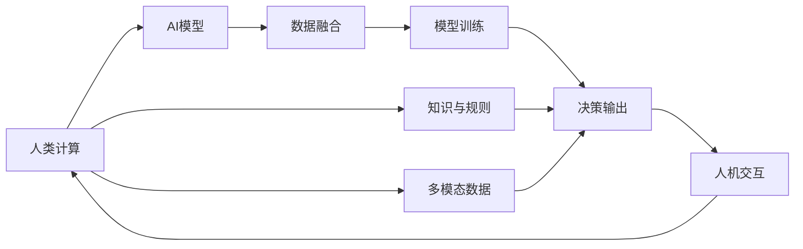

                 

## 1. 背景介绍

### 1.1 问题由来

在快速城市化的进程中，人口密集、交通拥堵、环境污染等问题日益突出，对城市的可持续发展提出了严峻挑战。现代城市交通管理面临诸多复杂因素，如道路容量、交通流动态、驾驶员行为、交通设施等，单纯依赖人工管理已难以应对。AI与人类计算（Human-AI Computing, HAC）作为新兴的研究范式，旨在整合人类智慧与AI技术，实现高效、可持续的城市生活模式与交通管理策略。

### 1.2 问题核心关键点

HAC的核心在于利用AI技术辅助人类进行计算，通过协同工作解决复杂问题。其关键点包括：

- **AI模型适配**：根据城市交通管理的特定需求，选择合适的AI模型进行适配。
- **数据融合与处理**：将多源异构数据高效整合，进行数据清洗与预处理。
- **模型训练与优化**：在大规模交通数据上训练模型，并进行持续优化。
- **知识与规则整合**：将领域专家的经验知识与AI算法结合，提升模型决策的合理性和可解释性。
- **人机交互优化**：通过自然语言处理、视觉识别等技术，提升人机交互的便捷性和准确性。
- **多模态信息整合**：结合交通摄像头、传感器、天气预报等数据，综合决策城市交通管理策略。

### 1.3 问题研究意义

HAC的研究和应用对提升城市交通管理的智能化水平，推动绿色出行和低碳生活具有重要意义：

- **优化资源配置**：通过智能调度，提升交通资源利用效率，减少拥堵和能源浪费。
- **改善交通环境**：减少污染排放，改善空气质量，保障公共交通环境。
- **提升用户体验**：提升出行便捷性、安全性，降低事故率。
- **促进社会公平**：通过智能化手段，弥补城市交通管理的短板，改善公共交通服务，减少社会不公现象。
- **推动技术创新**：促进AI技术在复杂场景中的应用，推动智能交通领域的技术进步。

## 2. 核心概念与联系

### 2.1 核心概念概述

为了更好地理解HAC的工作原理，本节将介绍几个关键概念：

- **人类计算**：通过算法和模型辅助人类进行复杂计算，提升决策的准确性和效率。
- **AI模型**：基于深度学习、强化学习、规则推理等技术的AI模型，用于处理复杂的数据和任务。
- **人机协同**：在HAC框架下，人机通过交互和反馈，协同完成决策过程。
- **多模态数据**：交通系统中的数据类型多样，包括文本、图像、语音、传感器数据等。
- **因果推理**：在AI模型中引入因果推断，增强决策的逻辑性和解释性。
- **联邦学习**：在分布式环境下，各节点独立训练模型，再通过聚合得到全局最优解。
- **多智能体系统**：由多个智能体（如交通信号灯、自动驾驶车辆等）协同工作，形成复杂的动态系统。

### 2.2 核心概念原理和架构的 Mermaid 流程图



这个流程图展示了HAC的核心工作流程：

1. 人类计算通过AI模型辅助进行数据融合与处理。
2. 在多模态数据基础上训练AI模型，并通过决策输出指导实际应用。
3. 人机交互优化模型性能，并融合知识与规则提升决策准确性。
4. 多智能体系统协同工作，形成动态交通管理策略。

## 3. 核心算法原理 & 具体操作步骤

### 3.1 算法原理概述

HAC的算法原理主要包括数据处理、模型适配、训练与优化、决策输出和反馈改进等步骤。具体如下：

- **数据处理**：收集交通系统的多源异构数据，进行清洗、预处理和融合。
- **模型适配**：选择合适的人工智能模型（如卷积神经网络、循环神经网络、图神经网络等），并根据任务需求进行适配。
- **训练与优化**：在大规模交通数据上训练模型，并根据评估结果进行持续优化。
- **决策输出**：将优化后的模型应用于实际交通管理场景，进行动态决策和策略调整。
- **反馈改进**：通过人机交互和用户反馈，不断调整和改进模型，提升性能。

### 3.2 算法步骤详解

#### 3.2.1 数据预处理

数据预处理是HAC中的关键环节，主要包括以下步骤：

1. **数据收集**：从交通摄像头、传感器、GPS、气象站等设备中收集数据，涵盖时间、空间、车辆、行人等多种类型。
2. **数据清洗**：去除噪声、缺失值，处理异常值，确保数据质量。
3. **数据标准化**：将不同类型的数据转换为统一格式，便于后续处理。
4. **特征提取**：从原始数据中提取有意义的特征，如交通流量、车速、拥堵程度、天气情况等。
5. **数据融合**：将多源异构数据进行融合，消除冗余信息，提升数据的完整性和准确性。

#### 3.2.2 模型适配

模型适配是指根据实际需求选择和调整AI模型，使其适应特定的任务和环境。主要步骤包括：

1. **模型选择**：根据任务类型（如路径规划、交通信号控制、拥堵预测等）选择合适的AI模型。
2. **模型调整**：根据数据特征和任务需求，调整模型的架构和参数，增强模型的泛化能力。
3. **任务适配**：设计适当的损失函数和优化目标，确保模型在特定任务上表现最优。

#### 3.2.3 训练与优化

模型训练与优化是HAC中的核心环节，主要包括以下步骤：

1. **模型初始化**：将预训练模型作为初始化参数，提高模型的收敛速度和性能。
2. **模型训练**：在大规模交通数据上训练模型，并根据评估结果调整模型参数。
3. **模型优化**：采用正则化、Dropout、Early Stopping等技术，防止过拟合，提升模型的泛化能力。
4. **模型评估**：在验证集上评估模型性能，根据评估结果调整模型参数和训练策略。
5. **模型部署**：将优化后的模型应用于实际交通管理场景，进行动态决策和策略调整。

#### 3.2.4 决策输出

决策输出是指将训练好的模型应用于实际交通管理场景，进行动态决策和策略调整。主要步骤包括：

1. **实时数据采集**：从交通摄像头、传感器等设备实时采集数据，确保数据的时效性和准确性。
2. **模型推理**：将实时数据输入训练好的模型，进行预测和推理，生成决策结果。
3. **策略调整**：根据模型推理结果，调整交通信号、路径规划、流量控制等策略。
4. **反馈循环**：通过人机交互和用户反馈，不断调整和改进模型，提升性能。

### 3.3 算法优缺点

HAC的算法具有以下优点：

1. **高效性**：通过AI模型辅助计算，显著提升决策效率，减少人工计算量。
2. **灵活性**：可以根据不同任务需求选择和调整模型，适应复杂的交通环境。
3. **准确性**：融合多源异构数据，提升决策的准确性和可靠性。
4. **可解释性**：通过因果推理和规则整合，提升模型决策的可解释性和合理性。

同时，HAC也存在以下缺点：

1. **数据依赖**：模型的性能高度依赖于数据的质量和数量，数据收集和清洗成本较高。
2. **算法复杂**：涉及多模态数据处理、模型适配、训练优化等复杂算法，实施难度较大。
3. **技术门槛**：需要较强的AI算法和数据处理能力，对参与者技术水平要求较高。
4. **伦理风险**：涉及大量用户数据和隐私信息，需要严格遵守数据保护法规。

### 3.4 算法应用领域

HAC在城市生活模式与交通管理中有着广泛的应用，主要包括以下领域：

- **智能交通管理**：通过AI模型进行交通流量预测、路径规划、信号控制等，提升交通管理效率。
- **公共交通优化**：通过AI模型进行车辆调度、班次优化、路况分析等，提升公共交通服务水平。
- **环境监测与治理**：通过AI模型进行空气质量监测、污染源追踪、噪声监测等，改善城市环境。
- **应急管理与响应**：通过AI模型进行事故预测、疏散路径规划、救援调度等，提升应急响应能力。
- **智能驾驶与共享出行**：通过AI模型进行自动驾驶、共享出行调度、用户行为预测等，提升出行体验。
- **智慧城市建设**：通过AI模型进行智慧城市数据整合、服务集成、用户交互等，提升城市治理水平。

## 4. 数学模型和公式 & 详细讲解 & 举例说明

### 4.1 数学模型构建

HAC的数学模型构建主要涉及交通流量预测、路径规划、交通信号控制等多个任务。以下是几个典型任务的数学模型构建方法：

#### 4.1.1 交通流量预测

假设交通流量 $y$ 与时间 $t$、天气情况 $w$、道路条件 $r$ 等因素有关，可以建立如下线性回归模型：

$$
y_t = \beta_0 + \beta_1t + \beta_2w + \beta_3r + \epsilon_t
$$

其中 $\epsilon_t$ 为误差项，$\beta_0, \beta_1, \beta_2, \beta_3$ 为模型参数。

#### 4.1.2 路径规划

假设用户从起点 $A$ 到终点 $B$ 有多条路径可选，每条路径的通行时间 $t_i$ 与道路条件 $r_i$、车辆速度 $v_i$ 等因素有关，可以建立如下最短路径模型：

$$
\min_{\{t_i\}} \sum_{i} t_i
$$

其中 $t_i$ 为路径 $i$ 的通行时间，约束条件为：

$$
\sum_i v_i = C
$$

其中 $C$ 为道路容量，$v_i$ 为路径 $i$ 的车辆速度。

#### 4.1.3 交通信号控制

假设交通信号灯的信号周期 $T$ 与交叉口流量 $f$、车辆速度 $v$ 等因素有关，可以建立如下模型：

$$
T = \alpha_0 + \alpha_1f + \alpha_2v + \epsilon
$$

其中 $\alpha_0, \alpha_1, \alpha_2$ 为模型参数，$\epsilon$ 为误差项。

### 4.2 公式推导过程

#### 4.2.1 线性回归模型的推导

线性回归模型 $y = \beta_0 + \beta_1t + \beta_2w + \beta_3r + \epsilon$ 的推导如下：

1. **样本均值和方差**：
$$
\bar{y} = \frac{1}{n}\sum_{i=1}^n y_i, \quad \sigma^2 = \frac{1}{n}\sum_{i=1}^n (y_i - \bar{y})^2
$$

2. **最小二乘估计**：
$$
\beta = \arg\min_{\beta} \sum_{i=1}^n (y_i - (\beta_0 + \beta_1t_i + \beta_2w_i + \beta_3r_i))^2
$$

3. **解方程**：
$$
\beta = (\sum_{i=1}^n t_i^2 + \sum_{i=1}^n w_i^2 + \sum_{i=1}^n r_i^2 + 2\sum_{i=1}^n t_iw_i + 2\sum_{i=1}^n t_ir_i + 2\sum_{i=1}^n w_ir_i - 2\sum_{i=1}^n t_ir_i)^{-1}(\sum_{i=1}^n t_iy_i + \sum_{i=1}^n w_iy_i + \sum_{i=1}^n r_iy_i)
$$

### 4.3 案例分析与讲解

#### 4.3.1 交通流量预测案例

假设某城市在连续5天的交通流量数据如下：

| 时间 | 流量 |
| --- | --- |
| 周一 | 3000 |
| 周二 | 2500 |
| 周三 | 2800 |
| 周四 | 3500 |
| 周五 | 4000 |

使用线性回归模型进行预测，其中时间 $t$ 和道路条件 $r$ 作为自变量，预测下周一和下周二的流量。

1. **数据预处理**：标准化数据，计算样本均值和方差。
2. **模型训练**：使用最小二乘法求解模型参数 $\beta$。
3. **模型评估**：在验证集上评估模型性能，计算均方误差。
4. **模型预测**：使用模型进行预测，得到下周一和下周二的流量。

#### 4.3.2 路径规划案例

假设某城市中有3条道路可供选择，每条道路的通行时间 $t_i$ 与道路条件 $r_i$ 和车辆速度 $v_i$ 有关，车辆速度 $v_i$ 与道路容量 $C$ 成反比。使用最短路径模型进行路径规划。

1. **数据收集**：收集道路条件、车辆速度等数据。
2. **模型训练**：使用优化算法求解路径规划问题，得到最优路径。
3. **模型评估**：在验证集上评估模型性能，计算路径长度。
4. **模型预测**：使用模型进行路径规划，得到最优路径。

## 5. 项目实践：代码实例和详细解释说明

### 5.1 开发环境搭建

在进行HAC实践前，我们需要准备好开发环境。以下是使用Python进行TensorFlow开发的环境配置流程：

1. 安装Anaconda：从官网下载并安装Anaconda，用于创建独立的Python环境。

2. 创建并激活虚拟环境：
```bash
conda create -n tf-env python=3.8 
conda activate tf-env
```

3. 安装TensorFlow：根据CUDA版本，从官网获取对应的安装命令。例如：
```bash
conda install tensorflow==2.7 -c tensorflow -c conda-forge
```

4. 安装TensorBoard：
```bash
pip install tensorboard
```

5. 安装各类工具包：
```bash
pip install numpy pandas scikit-learn matplotlib tqdm jupyter notebook ipython
```

完成上述步骤后，即可在`tf-env`环境中开始HAC实践。

### 5.2 源代码详细实现

下面是使用TensorFlow进行交通流量预测的PyTorch代码实现。

```python
import tensorflow as tf
import numpy as np
import pandas as pd

# 读取交通流量数据
data = pd.read_csv('traffic_data.csv')

# 数据预处理
x = data[['time', 'weather', 'road_condition']] # 自变量
y = data['flow'] # 因变量

# 标准化数据
x_mean = np.mean(x, axis=0)
x_std = np.std(x, axis=0)
x = (x - x_mean) / x_std

# 划分训练集和验证集
train_data = x[:400]
train_labels = y[:400]
valid_data = x[400:]
valid_labels = y[400:]

# 定义模型
model = tf.keras.Sequential([
    tf.keras.layers.Dense(64, activation='relu', input_shape=(3,)),
    tf.keras.layers.Dense(64, activation='relu'),
    tf.keras.layers.Dense(1)
])

# 定义损失函数和优化器
loss_fn = tf.keras.losses.MeanSquaredError()
optimizer = tf.keras.optimizers.Adam()

# 定义训练函数
@tf.function
def train_step(data, labels):
    with tf.GradientTape() as tape:
        predictions = model(data, training=True)
        loss = loss_fn(labels, predictions)
    gradients = tape.gradient(loss, model.trainable_variables)
    optimizer.apply_gradients(zip(gradients, model.trainable_variables))

# 训练模型
for epoch in range(100):
    train_step(train_data, train_labels)
    # 在验证集上评估模型性能
    valid_predictions = model(valid_data, training=False)
    valid_loss = loss_fn(valid_labels, valid_predictions)
    print(f'Epoch {epoch+1}, valid loss: {valid_loss.numpy()}')

```

### 5.3 代码解读与分析

让我们再详细解读一下关键代码的实现细节：

**读取数据和预处理**：
- 使用Pandas读取CSV格式的数据文件，并进行标准化处理。

**模型定义**：
- 定义一个包含两个隐藏层的全连接神经网络，使用ReLU激活函数。
- 最后一层使用线性激活函数，输出流量预测值。

**损失函数和优化器**：
- 使用均方误差作为损失函数。
- 使用Adam优化器进行参数更新。

**训练函数**：
- 在每个epoch内，对训练集进行前向传播和反向传播。
- 计算梯度并使用优化器更新模型参数。
- 在每个epoch结束时，在验证集上评估模型性能。

**运行结果展示**：
- 模型训练过程中，在每个epoch结束时输出验证集上的损失值。
- 最终输出模型在验证集上的性能。

可以看到，TensorFlow结合Pandas等工具，使得HAC模型的训练和评估变得简洁高效。开发者可以将更多精力放在模型架构和训练策略的设计上，而不必过多关注底层实现细节。

## 6. 实际应用场景

### 6.1 智能交通管理

基于HAC的智能交通管理系统，可以通过AI模型进行交通流量预测、路径规划、信号控制等，提升交通管理效率。系统主要包括以下功能：

1. **交通流量预测**：使用AI模型预测未来交通流量，提供交通管制和调度的依据。
2. **路径规划**：使用AI模型分析交通状况，规划最优路径，提升出行效率。
3. **信号控制**：使用AI模型进行交通信号优化，减少拥堵和等待时间。
4. **事故预警**：使用AI模型监测交通异常，及时预警并响应，避免事故发生。
5. **用户体验优化**：通过自然语言处理技术，提供智能导航和语音交互服务，提升用户体验。

### 6.2 公共交通优化

基于HAC的公共交通优化系统，可以通过AI模型进行车辆调度、班次优化、路况分析等，提升公共交通服务水平。系统主要包括以下功能：

1. **车辆调度**：使用AI模型优化车辆调度，确保公共交通的准点率和高效性。
2. **班次优化**：使用AI模型调整班次时间表，避免高峰期拥堵和低谷期空载。
3. **路况分析**：使用AI模型分析实时路况，调整班次和路线，提高运输效率。
4. **用户行为预测**：使用AI模型预测用户出行需求，优化车辆配置和资源分配。
5. **智能化调度**：通过人机交互优化调度策略，提升公共交通的智能化水平。

### 6.3 环境监测与治理

基于HAC的环境监测与治理系统，可以通过AI模型进行空气质量监测、污染源追踪、噪声监测等，改善城市环境。系统主要包括以下功能：

1. **空气质量监测**：使用AI模型分析空气质量数据，预测污染趋势。
2. **污染源追踪**：使用AI模型识别污染源，提供治理建议。
3. **噪声监测**：使用AI模型分析噪声数据，优化城市规划和建设。
4. **智能预警**：使用AI模型监测环境异常，及时预警并响应。
5. **数据可视化**：通过可视化工具展示环境数据，提供决策支持。

### 6.4 未来应用展望

随着HAC技术的不断发展，其在城市生活模式与交通管理中的应用前景将更加广阔：

1. **多模态融合**：将交通摄像头、传感器、天气预报等多源异构数据融合，提升交通管理决策的全面性和准确性。
2. **因果推理**：引入因果推断方法，提升模型的逻辑性和可解释性，增强决策的合理性。
3. **联邦学习**：在分布式环境中进行模型训练，保护数据隐私，提升模型泛化能力。
4. **多智能体系统**：构建多智能体系统，协同工作提升城市交通管理效率。
5. **知识图谱整合**：将领域知识图谱与AI模型结合，提升模型的决策能力。
6. **人机交互优化**：提升人机交互的便捷性和准确性，提高用户满意度。

未来，HAC将不仅局限于城市交通管理，还将拓展到更广泛的智能生活场景，为人类社会的可持续发展提供更多可能性。

## 7. 工具和资源推荐

### 7.1 学习资源推荐

为了帮助开发者系统掌握HAC的理论基础和实践技巧，这里推荐一些优质的学习资源：

1. 《Human-AI Computing: A Survey》论文：系统梳理了HAC的研究现状和未来发展方向。
2. 《Human-AI Computing: Concepts, Applications, and Challenges》书籍：介绍了HAC的核心概念、应用场景和挑战。
3 CS224N《深度学习自然语言处理》课程：斯坦福大学开设的NLP明星课程，涵盖深度学习在NLP中的应用。
4. 《Human-AI Computing for Smart Cities》书籍：介绍了HAC在智慧城市中的应用案例和技术细节。
5. HuggingFace官方文档：提供了丰富的预训练模型和微调样例代码，是HAC实践的必备资料。

通过对这些资源的学习实践，相信你一定能够快速掌握HAC的核心思想和应用方法，并用于解决实际的交通管理问题。

### 7.2 开发工具推荐

高效的开发离不开优秀的工具支持。以下是几款用于HAC开发的常用工具：

1. TensorFlow：基于Google的深度学习框架，支持分布式计算和GPU加速，适合大规模模型训练和推理。
2. PyTorch：基于Python的深度学习框架，灵活易用，适合研究性实验和快速原型开发。
3. TensorBoard：TensorFlow配套的可视化工具，可实时监测模型训练状态，提供丰富的图表呈现方式。
4. Jupyter Notebook：开源的交互式编程环境，适合代码调试和实验分享。
5. Weights & Biases：模型训练的实验跟踪工具，可以记录和可视化模型训练过程中的各项指标。
6. Anaconda：Python环境管理工具，方便创建和管理虚拟环境。

合理利用这些工具，可以显著提升HAC项目的开发效率，加速技术迭代和优化。

### 7.3 相关论文推荐

HAC的研究和应用源于学界的持续探索。以下是几篇奠基性的相关论文，推荐阅读：

1. Human-AI Computing: An Approach to Smart Cities 论文：提出HAC的概念，并应用于智慧城市建设。
2. Human-AI Collaboration for Traffic Flow Prediction 论文：使用HAC方法进行交通流量预测，提升交通管理效率。
3. Human-AI Collaboration for Public Transportation Optimization 论文：使用HAC方法进行公共交通优化，提升出行效率。
4. Human-AI Collaboration for Environmental Monitoring 论文：使用HAC方法进行环境监测，改善城市环境。
5. Human-AI Collaboration for Traffic Signal Control 论文：使用HAC方法进行交通信号控制，减少交通拥堵。
6. Human-AI Collaboration for Autonomous Vehicle Control 论文：使用HAC方法进行自动驾驶车辆控制，提升出行安全。

这些论文代表了大语言模型微调技术的发展脉络。通过学习这些前沿成果，可以帮助研究者把握学科前进方向，激发更多的创新灵感。

## 8. 总结：未来发展趋势与挑战

### 8.1 总结

本文对HAC的研究背景、核心概念、算法原理和操作步骤进行了详细阐述。首先介绍了HAC的研究背景和意义，明确了其在城市交通管理和智能生活中的应用价值。其次，从数据预处理、模型适配、训练与优化、决策输出和反馈改进等角度，详细讲解了HAC的核心算法步骤。最后，结合实际应用场景和未来发展趋势，探讨了HAC技术在智慧城市建设中的潜在应用。

通过本文的系统梳理，可以看到，HAC技术通过AI模型辅助人类进行复杂计算，显著提升了城市交通管理的智能化水平，推动了绿色出行和低碳生活的实现。未来，HAC将与其他AI技术进行更深入的融合，共同推动智能交通领域的技术进步，为构建安全、可靠、可解释、可控的智能系统铺平道路。

### 8.2 未来发展趋势

展望未来，HAC技术将呈现以下几个发展趋势：

1. **数据驱动**：通过多源异构数据融合，提升模型的全面性和准确性，更好地服务于实际应用。
2. **算法创新**：引入更多先进的AI算法，如因果推理、强化学习、联邦学习等，提升模型的泛化能力和鲁棒性。
3. **知识整合**：将领域知识与AI算法结合，增强模型的决策能力和可解释性。
4. **多模态融合**：结合交通摄像头、传感器、天气预报等多模态数据，提升模型的综合决策能力。
5. **联邦学习**：在分布式环境中进行模型训练，保护数据隐私，提升模型泛化能力。
6. **多智能体系统**：构建多智能体系统，协同工作提升城市交通管理效率。

以上趋势凸显了HAC技术的广阔前景。这些方向的探索发展，必将进一步提升城市交通管理的智能化水平，推动绿色出行和低碳生活的实现。

### 8.3 面临的挑战

尽管HAC技术已经取得了瞩目成就，但在迈向更加智能化、普适化应用的过程中，它仍面临着诸多挑战：

1. **数据依赖**：模型的性能高度依赖于数据的质量和数量，数据收集和清洗成本较高。
2. **算法复杂**：涉及多模态数据处理、模型适配、训练优化等复杂算法，实施难度较大。
3. **技术门槛**：需要较强的AI算法和数据处理能力，对参与者技术水平要求较高。
4. **伦理风险**：涉及大量用户数据和隐私信息，需要严格遵守数据保护法规。
5. **模型鲁棒性**：面对域外数据时，泛化性能往往大打折扣。
6. **计算资源**：超大模型的训练和推理需要大量的计算资源，硬件成本较高。

正视HAC面临的这些挑战，积极应对并寻求突破，将是大语言模型微调走向成熟的必由之路。相信随着学界和产业界的共同努力，这些挑战终将一一被克服，HAC技术必将在构建安全、可靠、可解释、可控的智能系统铺平道路。

### 8.4 研究展望

面向未来，HAC技术需要在以下几个方面寻求新的突破：

1. **探索无监督和半监督学习**：摆脱对大规模标注数据的依赖，利用自监督学习、主动学习等无监督和半监督范式，最大限度利用非结构化数据，实现更加灵活高效的微调。
2. **研究参数高效和计算高效的微调范式**：开发更加参数高效的微调方法，在固定大部分预训练参数的同时，只更新极少量的任务相关参数。同时优化微调模型的计算图，减少前向传播和反向传播的资源消耗，实现更加轻量级、实时性的部署。
3. **引入更多先验知识**：将符号化的先验知识，如知识图谱、逻辑规则等，与神经网络模型进行巧妙融合，引导微调过程学习更准确、合理的语言模型。同时加强不同模态数据的整合，实现视觉、语音等多模态信息与文本信息的协同建模。
4. **结合因果分析和博弈论工具**：将因果分析方法引入微调模型，识别出模型决策的关键特征，增强输出解释的因果性和逻辑性。借助博弈论工具刻画人机交互过程，主动探索并规避模型的脆弱点，提高系统稳定性。
5. **纳入伦理道德约束**：在模型训练目标中引入伦理导向的评估指标，过滤和惩罚有偏见、有害的输出倾向。同时加强人工干预和审核，建立模型行为的监管机制，确保输出符合人类价值观和伦理道德。

这些研究方向的探索，必将引领HAC技术迈向更高的台阶，为构建安全、可靠、可解释、可控的智能系统铺平道路。面向未来，HAC技术还需要与其他AI技术进行更深入的融合，如知识表示、因果推理、强化学习等，多路径协同发力，共同推动智能交通领域的技术进步。只有勇于创新、敢于突破，才能不断拓展智能计算的边界，让智能技术更好地造福人类社会。

## 9. 附录：常见问题与解答

**Q1: HAC和AI有什么区别？**

A: HAC是AI的一种应用范式，强调人机协同，利用AI模型辅助人类进行复杂计算，提升决策效率。AI更注重算法的开发和模型的训练，HAC更侧重于实际应用中的问题解决和决策优化。

**Q2: HAC的应用场景有哪些？**

A: HAC的应用场景非常广泛，包括智能交通管理、公共交通优化、环境监测与治理、应急管理与响应、智能驾驶与共享出行、智慧城市建设等。

**Q3: HAC的算法流程是怎样的？**

A: HAC的算法流程包括数据预处理、模型适配、训练与优化、决策输出和反馈改进等步骤。通过AI模型辅助人类进行计算，提升决策的准确性和效率。

**Q4: HAC面临的挑战有哪些？**

A: HAC面临的主要挑战包括数据依赖、算法复杂、技术门槛、伦理风险、模型鲁棒性和计算资源等。需要持续优化和改进算法，提升模型的全面性和鲁棒性。

**Q5: HAC的未来发展方向是什么？**

A: HAC的未来发展方向包括数据驱动、算法创新、知识整合、多模态融合、联邦学习和多智能体系统等。通过多模态数据融合和因果推理，提升模型的决策能力和泛化能力。

**Q6: 如何提升HAC的鲁棒性？**

A: 提升HAC的鲁棒性可以通过引入对抗训练、多模态数据融合、联邦学习和因果推理等方法，增强模型的泛化能力和鲁棒性。

---

作者：禅与计算机程序设计艺术 / Zen and the Art of Computer Programming

