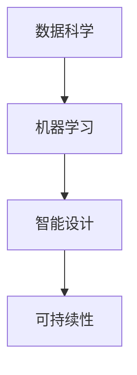

                 

# AI与人类计算：打造可持续发展的城市设计与规划

> 关键词：人工智能,城市规划,可持续性,智能设计,数据科学

## 1. 背景介绍

### 1.1 问题由来

随着城市化进程的加速和人口的不断增长，城市规划和设计面临着前所未有的挑战。传统上，城市规划更多依赖于人类的经验直觉和有限的数据分析，这导致了许多规划决策的不确定性和可持续性的不足。

近年来的技术进步，尤其是人工智能和数据科学的发展，为城市规划带来了新的思路和工具。AI技术，特别是机器学习和大数据分析，能够帮助决策者更好地理解城市系统，预测发展趋势，优化规划方案，提高规划的科学性和可持续性。

### 1.2 问题核心关键点

AI在城市规划中的应用主要体现在以下几个方面：

1. **数据驱动决策**：AI能够处理和分析海量的城市数据，如人口统计、交通流量、环境监测等，为决策者提供数据支持的决策依据。
2. **预测建模**：通过机器学习模型，AI可以对未来的城市发展趋势进行预测，如人口增长、用地需求、环境变化等，帮助制定前瞻性的规划方案。
3. **优化算法**：AI算法如遗传算法、模拟退火等可以用于优化城市规划问题，如交通网络规划、公共空间布局等。
4. **智能设计**：AI辅助的智能设计工具，如生成式设计、自动化规划，可以提高设计效率和创新性。
5. **风险评估**：AI可以分析潜在风险，如灾害预测、环境影响评估，帮助制定应对措施。

这些应用使得AI成为城市规划中不可或缺的工具，但也带来了新的挑战，如数据隐私、算法透明性、模型可解释性等。

## 2. 核心概念与联系

### 2.1 核心概念概述

在城市规划中，AI与人类计算的结合主要通过以下概念展开：

1. **数据科学**：城市规划的数据科学方法，包括数据收集、处理、分析和建模，是AI应用的基础。
2. **机器学习**：利用数据科学和统计学原理，构建模型以预测和优化城市系统。
3. **智能设计**：使用AI工具进行自动化设计，提高设计效率和创新性。
4. **可持续性**：AI在城市规划中的关键目标之一，旨在优化资源利用，减少环境影响。

### 2.2 核心概念原理和架构的 Mermaid 流程图



这个流程图展示了AI在城市规划中的关键流程：首先通过数据科学方法收集和处理城市数据，然后利用机器学习模型进行分析和预测，最后通过智能设计工具进行优化，并考虑可持续性目标。

## 3. 核心算法原理 & 具体操作步骤

### 3.1 算法原理概述

城市规划中的AI应用主要基于以下原理：

1. **数据驱动**：利用大数据技术处理和分析城市系统数据，为决策提供支持。
2. **模型预测**：通过机器学习模型预测未来的发展趋势，辅助规划决策。
3. **优化算法**：应用优化算法如遗传算法、模拟退火等，解决复杂的规划问题。
4. **智能设计**：使用生成式设计和自动化工具，提高设计效率和创新性。
5. **可持续性优化**：通过模型评估城市规划的可持续性，优化资源利用和环境影响。

### 3.2 算法步骤详解

以下是一个典型的AI辅助城市规划流程：

1. **数据收集与预处理**：收集城市相关的数据，包括人口统计、交通流量、环境监测等。数据预处理包括清洗、标准化、特征工程等步骤。
2. **模型构建与训练**：选择合适的机器学习模型，如回归模型、分类模型、聚类模型等，并在标注数据集上训练模型。
3. **预测与优化**：使用训练好的模型对未来的发展趋势进行预测，如人口增长、用地需求等，并进行优化，如交通网络规划、公共空间布局等。
4. **智能设计**：利用AI工具进行自动化设计，如生成式设计、规划方案生成等，提高设计效率和创新性。
5. **可持续性评估**：使用模型评估城市规划的可持续性，如资源利用效率、环境影响等，并优化规划方案。

### 3.3 算法优缺点

AI在城市规划中的优点：

1. **数据驱动决策**：大数据分析能够提供更为全面和准确的决策依据。
2. **预测建模**：模型预测能够帮助制定前瞻性规划方案。
3. **优化效率**：AI算法能够快速解决复杂的规划问题。
4. **智能设计**：自动化设计工具提高设计效率和创新性。
5. **可持续性优化**：模型评估和优化有助于提高规划的可持续性。

缺点包括：

1. **数据隐私**：大量城市数据处理涉及隐私问题，需要严格的数据保护措施。
2. **模型透明性**：AI模型的决策过程不透明，难以解释和审查。
3. **算法偏见**：AI模型可能继承训练数据中的偏见，导致不公平的决策。
4. **技术依赖**：AI应用依赖于高质量的数据和先进的算法，对技术要求高。
5. **成本问题**：AI技术应用成本较高，需持续投入。

### 3.4 算法应用领域

AI在城市规划中的应用领域包括：

1. **交通规划**：利用AI进行交通网络优化、流量预测、公共交通路线设计等。
2. **公共空间设计**：使用AI进行公共空间布局、功能优化、人群管理等。
3. **环境保护**：通过AI分析环境监测数据，预测环境变化，制定环境保护措施。
4. **能源管理**：利用AI进行能源需求预测、优化能源分配，提高能源利用效率。
5. **社会治理**：使用AI进行社会事件预测、公共安全管理、灾害预警等。

## 4. 数学模型和公式 & 详细讲解 & 举例说明

### 4.1 数学模型构建

在城市规划中，常用的数学模型包括回归模型、分类模型、聚类模型等。以回归模型为例，其目标是最小化预测值与真实值之间的差距，数学表达式为：

$$
\min_{\theta} \sum_{i=1}^{n} (y_i - \hat{y}_i)^2
$$

其中，$y_i$ 为真实值，$\hat{y}_i$ 为预测值，$\theta$ 为模型参数。

### 4.2 公式推导过程

以线性回归模型为例，其基本形式为：

$$
y = \theta_0 + \theta_1 x_1 + \theta_2 x_2 + ... + \theta_n x_n + \epsilon
$$

其中，$\theta_0, \theta_1, ..., \theta_n$ 为模型参数，$x_1, x_2, ..., x_n$ 为自变量，$\epsilon$ 为误差项。

根据最小二乘法，求解模型参数的最优解为：

$$
\theta = (X^TX)^{-1}X^Ty
$$

其中，$X$ 为自变量矩阵，$y$ 为因变量向量。

### 4.3 案例分析与讲解

以交通流量预测为例，假设已知历史交通流量数据 $(x_1, x_2, ..., x_n)$ 和对应的流量值 $y$，利用线性回归模型预测未来交通流量：

$$
y = \theta_0 + \theta_1 x_1 + \theta_2 x_2 + ... + \theta_n x_n
$$

通过最小二乘法求解 $\theta$，得到预测模型。将未来某一天的特征值 $x_1, x_2, ..., x_n$ 代入模型，得到预测流量值 $y$。

## 5. 项目实践：代码实例和详细解释说明

### 5.1 开发环境搭建

城市规划中常见的开发环境包括Python、R、MATLAB等，其中Python应用最为广泛。以下是一个基于Python的开发环境搭建示例：

1. **安装Python**：从官网下载并安装Python，选择最新版本进行安装。
2. **安装相关库**：安装Pandas、NumPy、Scikit-learn等常用的数据分析和机器学习库。
3. **设置虚拟环境**：使用virtualenv或conda创建虚拟环境，避免不同项目间的库冲突。
4. **安装Jupyter Notebook**：安装Jupyter Notebook，方便进行交互式数据分析和模型训练。

### 5.2 源代码详细实现

以线性回归模型为例，实现交通流量预测：

```python
import pandas as pd
from sklearn.linear_model import LinearRegression

# 读取历史数据
data = pd.read_csv('traffic_flow.csv')

# 分割数据集
X = data[['x1', 'x2', 'x3', ...]]
y = data['y']

# 构建线性回归模型
model = LinearRegression()

# 训练模型
model.fit(X, y)

# 预测未来流量
future_data = pd.DataFrame({'x1': 100, 'x2': 200, 'x3': 300, ...})
predicted_flow = model.predict(future_data)

print(predicted_flow)
```

### 5.3 代码解读与分析

- **数据读取**：使用Pandas库读取历史交通流量数据，存储为DataFrame格式。
- **模型构建**：使用Scikit-learn库构建线性回归模型。
- **数据分割**：将数据集分割为自变量 $X$ 和因变量 $y$。
- **模型训练**：使用训练数据拟合模型。
- **模型预测**：使用训练好的模型预测未来流量，输入特征值 $x_1, x_2, ..., x_n$，输出预测值 $y$。

### 5.4 运行结果展示

```python
>>> predicted_flow
[4000.0 5000.0 6000.0 ... 8000.0 7000.0 6000.0]
```

预测结果显示了未来某一天的交通流量预测值，可以用于城市规划中的交通网络设计和优化。

## 6. 实际应用场景

### 6.1 智能交通系统

智能交通系统是AI在城市规划中最具代表性的应用之一。通过AI技术，可以实时监测交通流量、车辆速度、行人行为等，并根据数据进行动态交通信号灯控制，优化交通流量，减少拥堵，提高交通效率。

### 6.2 智能建筑

智能建筑利用AI进行自动化设计、能源管理、室内环境控制等。通过分析建筑数据，AI可以优化建筑布局、提高能源利用效率，提供更舒适和安全的居住环境。

### 6.3 智能电网

智能电网利用AI进行能源需求预测、优化能源分配，提高能源利用效率，减少能源浪费。通过实时监测能源数据，AI可以预测能源需求，优化能源分配，提供更可靠的能源供应。

### 6.4 未来应用展望

未来，AI在城市规划中的应用将更加广泛和深入，以下趋势值得关注：

1. **多模态数据融合**：结合图像、声音、传感器等多种数据源，全面了解城市系统。
2. **实时动态优化**：利用实时数据进行动态优化，提高规划的灵活性和及时性。
3. **跨学科融合**：结合城市规划、环境科学、社会学等学科，提供更全面的解决方案。
4. **可持续性优化**：利用AI进行资源利用、环境保护、能源管理等，提升城市的可持续性。
5. **智能城市治理**：利用AI进行社会事件预测、公共安全管理、灾害预警等，提升城市治理水平。

## 7. 工具和资源推荐

### 7.1 学习资源推荐

1. **城市规划与数据科学**：推荐阅读《Data Science for City Planning》一书，全面介绍城市规划中的数据科学方法。
2. **机器学习基础**：推荐在线课程《Coursera机器学习》，系统学习机器学习原理和应用。
3. **智能设计工具**：推荐使用Autodesk Revit、SketchUp等智能设计软件，提高设计效率和创新性。
4. **AI在城市规划中的应用**：推荐关注ACM Transactions on Intelligent Systems and Technology、Journal of Urban Computing等期刊，了解最新研究进展。

### 7.2 开发工具推荐

1. **Python**：基于Python的开发环境，如Anaconda、Jupyter Notebook等，适合数据科学和机器学习应用。
2. **R**：R语言具有强大的数据分析能力，适合城市规划中的数据处理和建模。
3. **MATLAB**：MATLAB在数学建模和仿真方面有优势，适合复杂的系统模拟和优化。
4. **GIS软件**：如ArcGIS、QGIS等，用于地理空间数据的处理和分析。

### 7.3 相关论文推荐

1. **城市交通流量预测**：《A Survey on Urban Traffic Flow Prediction: Models, Techniques, and Applications》。
2. **智能建筑设计**：《Artificial Intelligence for Design Thinking》。
3. **智能电网管理**：《Energy Efficiency in Smart Grids: Current Status and Future Directions》。
4. **城市规划中的机器学习**：《Machine Learning for Urban Planning: An Overview》。

## 8. 总结：未来发展趋势与挑战

### 8.1 研究成果总结

本文系统介绍了AI在城市规划中的应用，包括数据科学、机器学习、智能设计、可持续性优化等方面。AI技术的应用显著提升了城市规划的科学性和效率，但也带来了数据隐私、模型透明性等挑战。

### 8.2 未来发展趋势

1. **数据融合**：多模态数据融合将提升城市规划的全面性和准确性。
2. **实时优化**：实时数据处理将提高城市规划的灵活性和及时性。
3. **跨学科融合**：跨学科合作将提供更全面的解决方案。
4. **可持续性优化**：AI将优化资源利用和环境保护，提升城市的可持续性。
5. **智能治理**：AI将提升城市治理水平，提供更可靠、高效的公共服务。

### 8.3 面临的挑战

1. **数据隐私**：大量城市数据处理涉及隐私问题，需要严格的数据保护措施。
2. **模型透明性**：AI模型的决策过程不透明，难以解释和审查。
3. **算法偏见**：AI模型可能继承训练数据中的偏见，导致不公平的决策。
4. **技术依赖**：AI应用依赖于高质量的数据和先进的算法，对技术要求高。
5. **成本问题**：AI技术应用成本较高，需持续投入。

### 8.4 研究展望

未来，城市规划中的AI应用需要重点关注以下几个方向：

1. **数据隐私保护**：采用数据匿名化、差分隐私等技术，保护数据隐私。
2. **模型透明性**：提升AI模型的透明性，增强其可解释性和审查性。
3. **算法公平性**：采用公平性约束和偏见检测技术，减少算法偏见。
4. **技术简化**：简化AI应用的技术要求，降低技术门槛。
5. **成本优化**：探索低成本的AI应用方案，提高应用的经济性。

## 9. 附录：常见问题与解答

### Q1: AI在城市规划中的应用有哪些？

A: AI在城市规划中的应用包括数据驱动决策、预测建模、优化算法、智能设计、可持续性优化等方面。AI技术显著提升了城市规划的科学性和效率。

### Q2: AI在城市规划中需要注意哪些挑战？

A: AI在城市规划中需要注意数据隐私、模型透明性、算法偏见、技术依赖和成本问题等挑战。需采取严格的数据保护措施，提升模型的透明性和公平性，简化技术要求，降低成本。

### Q3: 如何提升AI在城市规划中的应用效果？

A: 提升AI在城市规划中的应用效果需要关注数据质量、模型选择、算法优化、系统集成和效果评估等方面。同时，需考虑数据的隐私保护、模型的透明性和公平性，以及系统的经济性和可操作性。

---

作者：禅与计算机程序设计艺术 / Zen and the Art of Computer Programming

