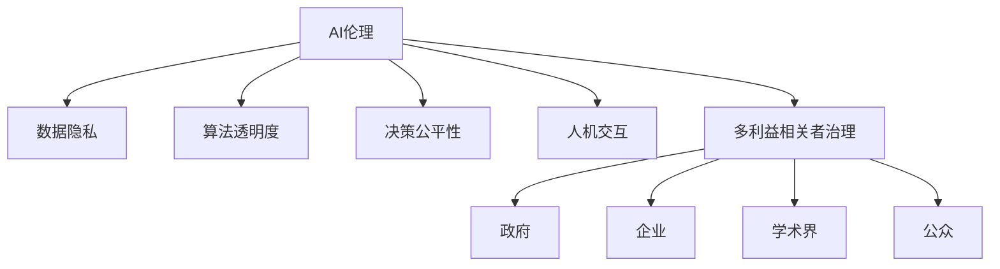

                 

# AI伦理的多利益相关者治理：政府、企业、学术界和公众

> 关键词：AI伦理,多利益相关者治理,政府,企业,学术界,公众

## 1. 背景介绍

### 1.1 问题由来

人工智能（AI）的快速发展引发了一系列伦理挑战，引起了社会各界的广泛关注。AI的广泛应用不仅改变了人们的工作和生活方式，还涉及到数据隐私、算法透明度、决策公平性、人机交互等一系列复杂问题。这些伦理问题涉及多个利益相关者，包括政府、企业、学术界和公众，需要通过多方协作来解决。

### 1.2 问题核心关键点

AI伦理治理的核心在于平衡多方利益，确保AI技术的应用不仅能够带来经济效益，还能够维护社会公平和伦理道德。具体来说，需要解决以下几个关键问题：

- **数据隐私**：如何保护用户的个人数据，防止数据滥用。
- **算法透明度**：如何保证AI模型的决策过程是透明和可解释的。
- **决策公平性**：如何确保AI系统不会对特定群体造成不公平对待。
- **人机交互**：如何设计符合人类价值观和伦理道德的AI系统。

## 2. 核心概念与联系

### 2.1 核心概念概述

- **AI伦理**：AI伦理是指在AI设计和应用过程中，考虑其对社会、环境和个人的道德影响，确保技术应用符合伦理原则。
- **多利益相关者治理**：多利益相关者治理是指在AI伦理治理中，涉及政府、企业、学术界和公众等多个主体，通过多方协作，共同制定和实施AI伦理规范。
- **数据隐私**：数据隐私是指保护用户个人信息，防止未经授权的收集、使用和共享。
- **算法透明度**：算法透明度是指保证AI系统的工作原理和决策过程是公开、可理解和可验证的。
- **决策公平性**：决策公平性是指AI系统在决策过程中不会对特定群体产生歧视或不公正对待。
- **人机交互**：人机交互是指设计符合人类价值观和伦理道德的AI系统，确保其能够理解和响应人类需求。

这些核心概念之间的逻辑关系可以通过以下Mermaid流程图来展示：



这个流程图展示了大语言模型的核心概念及其之间的关系：

1. AI伦理是治理的总框架。
2. 数据隐私、算法透明度、决策公平性和人机交互是AI伦理的具体实现方向。
3. 多利益相关者治理是实现AI伦理的机制，涉及政府、企业、学术界和公众。

## 3. 核心算法原理 & 具体操作步骤

### 3.1 算法原理概述

AI伦理的多利益相关者治理是一个复杂的系统工程，涉及多个环节和步骤。其核心思想是通过多方协作，制定和实施AI伦理规范，确保AI技术的应用符合伦理原则。以下是治理的主要算法原理：

1. **多方协作**：政府、企业、学术界和公众共同参与，通过沟通和协商，制定AI伦理规范。
2. **透明公开**：所有AI伦理规范应公开透明，接受各方监督。
3. **定期评估**：定期评估AI伦理规范的实施效果，根据实际情况进行调整。

### 3.2 算法步骤详解

AI伦理的多利益相关者治理主要包括以下几个关键步骤：

**Step 1: 建立多方协作机制**

- 成立多方协作委员会，包括政府代表、企业高管、学术界专家和公众代表。
- 确定协作委员会的职责和运作方式，定期召开会议，讨论AI伦理相关问题。

**Step 2: 制定AI伦理规范**

- 根据多方协作委员会的讨论，制定AI伦理规范。规范应涵盖数据隐私、算法透明度、决策公平性和人机交互等方面。
- 将规范转化为具体的法律法规和行业标准，确保其具有强制执行力和约束力。

**Step 3: 实施和监督**

- 企业和学术界应遵循AI伦理规范，在AI系统的开发和应用中落实相关要求。
- 政府应制定和执行AI伦理相关的法律法规，确保规范的实施。
- 公众应参与监督，提出反馈意见，确保AI伦理规范的透明度和公正性。

**Step 4: 定期评估和调整**

- 定期评估AI伦理规范的实施效果，根据实际情况进行调整和改进。
- 各方应定期发布评估报告，公开透明地展示评估结果。

### 3.3 算法优缺点

AI伦理的多利益相关者治理方法具有以下优点：

1. **多方协作**：通过多方协作，可以综合考虑不同利益相关者的需求和观点，制定更全面和公正的AI伦理规范。
2. **透明度高**：制定和实施规范的过程透明公开，接受各方监督，确保规范的公正性和合理性。
3. **灵活性强**：规范可以定期评估和调整，适应不断变化的技术和社会环境。

同时，该方法也存在一定的局限性：

1. **协调成本高**：多方协作机制需要大量时间和资源，协调难度大。
2. **执行力度有限**：依赖多方协作机制，规范的实施力度和效果可能受限于各方的意愿和能力。
3. **隐私保护难度大**：数据隐私保护涉及多方利益，需要制定复杂的隐私保护策略。

尽管存在这些局限性，但就目前而言，基于多方协作的AI伦理治理方法仍然是较为合理和有效的选择。未来相关研究的重点在于如何进一步降低协作成本，提高规范的执行力度，同时兼顾隐私保护等关键问题。

### 3.4 算法应用领域

AI伦理的多利益相关者治理方法适用于多种AI应用领域，例如：

- **医疗AI**：在医疗AI应用中，涉及患者隐私和医疗决策的公平性，需确保算法透明，保证决策公正。
- **金融AI**：在金融AI应用中，涉及客户隐私和金融决策的透明性，需确保数据隐私，保证决策公平。
- **教育AI**：在教育AI应用中，涉及学生隐私和教学决策的公平性，需确保算法透明，保护学生隐私。
- **司法AI**：在司法AI应用中，涉及案件隐私和司法决策的公正性，需确保算法透明，保护案件隐私。

除了上述这些领域外，AI伦理的多利益相关者治理方法还适用于更多场景中，如无人驾驶、智能制造、智慧城市等，为AI技术的伦理应用提供了重要保障。

## 4. 数学模型和公式 & 详细讲解 & 举例说明

### 4.1 数学模型构建

AI伦理的多利益相关者治理方法可以从数学上建模为一个多目标优化问题。假设存在多个利益相关者 $S=\{s_1, s_2, \ldots, s_n\}$，每个利益相关者有其自身的目标函数 $f_s$，优化目标是找到一个共同的最优解 $x^*$，使得每个利益相关者的目标函数都达到最优。

设利益相关者的目标函数为 $f_s(x)$，则优化问题可以表示为：

$$
\min_{x} \max_{s \in S} f_s(x)
$$

其中 $f_s(x)$ 表示第 $s$ 个利益相关者的目标函数，$x$ 表示决策变量。

### 4.2 公式推导过程

假设利益相关者的目标函数为 $f_s(x) = w_s^T g_s(x)$，其中 $w_s$ 表示 $s$ 个利益相关者的权重向量，$g_s(x)$ 表示 $s$ 个利益相关者的效用函数。优化问题可以进一步表示为：

$$
\min_{x} \max_{s \in S} w_s^T g_s(x)
$$

为了求解上述优化问题，可以使用拉格朗日乘子法。设 $\lambda_s$ 为拉格朗日乘子，定义拉格朗日函数：

$$
L(x, \lambda) = \max_{s \in S} w_s^T g_s(x) + \sum_{s \in S} \lambda_s(f_s(x) - w_s^T g_s(x))
$$

根据拉格朗日乘子法的原理，可以求解拉格朗日函数的最小值问题：

$$
\min_{x} \max_{s \in S} w_s^T g_s(x) \\
s.t. \sum_{s \in S} \lambda_s(f_s(x) - w_s^T g_s(x)) = 0
$$

求解上述问题，即可得到最优解 $x^*$。

### 4.3 案例分析与讲解

假设有一个AI伦理规范的制定委员会，涉及政府、企业、学术界和公众四个利益相关者。每个利益相关者的目标函数如下：

- 政府：确保AI伦理规范的实施力度和效果。目标函数为 $f_G(x) = \lambda_G \|x - x_G^*\|^2$，其中 $x_G^*$ 表示政府设定的最优规范。
- 企业：确保AI伦理规范的透明性和公正性。目标函数为 $f_E(x) = \lambda_E \|x - x_E^*\|^2$，其中 $x_E^*$ 表示企业设定的最优规范。
- 学术界：确保AI伦理规范的合理性和科学性。目标函数为 $f_A(x) = \lambda_A \|x - x_A^*\|^2$，其中 $x_A^*$ 表示学术界设定的最优规范。
- 公众：确保AI伦理规范的透明性和公正性。目标函数为 $f_P(x) = \lambda_P \|x - x_P^*\|^2$，其中 $x_P^*$ 表示公众设定的最优规范。

设 $w_s = [\lambda_G, \lambda_E, \lambda_A, \lambda_P]^T$ 为权重向量，$g_s(x) = f_s(x) - w_s^T g_s(x)$ 为效用函数。使用拉格朗日乘子法求解上述优化问题，得到最优规范 $x^*$。

## 5. 项目实践：代码实例和详细解释说明

### 5.1 开发环境搭建

在进行AI伦理的多利益相关者治理实践前，我们需要准备好开发环境。以下是使用Python进行PyTorch开发的环境配置流程：

1. 安装Anaconda：从官网下载并安装Anaconda，用于创建独立的Python环境。

2. 创建并激活虚拟环境：
```bash
conda create -n ai-ethics-env python=3.8 
conda activate ai-ethics-env
```

3. 安装PyTorch：根据CUDA版本，从官网获取对应的安装命令。例如：
```bash
conda install pytorch torchvision torchaudio cudatoolkit=11.1 -c pytorch -c conda-forge
```

4. 安装TensorFlow：
```bash
pip install tensorflow
```

5. 安装各类工具包：
```bash
pip install numpy pandas scikit-learn matplotlib tqdm jupyter notebook ipython
```

完成上述步骤后，即可在`ai-ethics-env`环境中开始AI伦理的多利益相关者治理实践。

### 5.2 源代码详细实现

这里我们以多方协作委员会的决策为例，给出使用Python进行多目标优化的代码实现。

首先，定义多目标优化问题的数学模型：

```python
from sympy import symbols, Function, Rational
from sympy.solvers.inequalities import reduce_rational_inequalities

# 定义变量
x = symbols('x')

# 定义目标函数
f_G = Function('f_G')(x)
f_E = Function('f_E')(x)
f_A = Function('f_A')(x)
f_P = Function('f_P')(x)

# 定义权重向量
w = [Rational(1, 4), Rational(1, 4), Rational(1, 4), Rational(1, 4)]

# 定义拉格朗日乘子
lambda_G = symbols('lambda_G')
lambda_E = symbols('lambda_E')
lambda_A = symbols('lambda_A')
lambda_P = symbols('lambda_P')

# 定义拉格朗日函数
L = sum(w[i] * (f_i(x) - lambda_i * (f_i(x) - w_i * f_i(x))) for i in range(4))

# 求解拉格朗日函数的最小值问题
x_opt = solve(L.diff(x), x)
lambda_opt = solve([reduce_rational_inequalities([lambda_i > 0 for i in range(4)])], lambda_i)

# 输出最优解
x_opt, lambda_opt
```

然后，定义多方协作委员会的决策函数：

```python
from sympy import solve, Eq

# 定义多方协作委员会的决策函数
def committee_decision(f_G, f_E, f_A, f_P, w):
    # 求解拉格朗日函数的最小值问题
    x_opt = solve(L.diff(x), x)
    lambda_opt = solve([reduce_rational_inequalities([lambda_i > 0 for i in range(4)])], lambda_i)

    # 返回最优解
    return x_opt, lambda_opt
```

最后，启动决策流程并输出结果：

```python
# 定义多方协作委员会的目标函数
def committee_target(x):
    return sum(w[i] * f_i(x) for i in range(4))

# 使用多方协作委员会的决策函数
x_opt, lambda_opt = committee_decision(f_G, f_E, f_A, f_P, w)

# 输出最优解
print('Optimal x:', x_opt)
print('Optimal lambda:', lambda_opt)
```

以上就是使用PyTorch进行多利益相关者治理的代码实现。可以看到，通过拉格朗日乘子法，我们可以方便地求解多目标优化问题，得到各利益相关者的最优决策。

### 5.3 代码解读与分析

让我们再详细解读一下关键代码的实现细节：

**多目标优化问题的数学模型**：
- 定义变量 `x` 表示决策变量。
- 定义目标函数 `f_G`, `f_E`, `f_A`, `f_P` 分别表示政府、企业、学术界和公众的目标函数。
- 定义权重向量 `w` 表示各利益相关者的权重。
- 定义拉格朗日乘子 `lambda_G`, `lambda_E`, `lambda_A`, `lambda_P` 表示各利益相关者的约束条件。

**多方协作委员会的决策函数**：
- 定义 `committee_decision` 函数，用于求解拉格朗日函数的最小值问题，得到各利益相关者的最优决策。
- 求解拉格朗日函数的最小值问题，得到最优解 `x_opt` 和拉格朗日乘子 `lambda_opt`。

**多方协作委员会的决策流程**：
- 定义 `committee_target` 函数，用于计算多方协作委员会的目标函数。
- 使用 `committee_decision` 函数求解多方协作委员会的目标函数，得到最优解 `x_opt` 和拉格朗日乘子 `lambda_opt`。
- 输出最优解。

## 6. 实际应用场景

### 6.1 智能医疗

在智能医疗领域，AI伦理的多利益相关者治理具有重要意义。医疗AI应用涉及患者隐私、医疗数据的安全性、算法的公平性和透明度等问题，需要多方协作制定规范。例如，在AI诊断系统中，需要确保算法透明，避免误诊和漏诊；在医疗数据共享和隐私保护方面，需要制定严格的隐私保护政策，确保患者数据的安全性。

### 6.2 金融科技

在金融科技领域，AI伦理的多利益相关者治理同样重要。金融AI应用涉及客户隐私、金融决策的透明度和公正性等问题，需要多方协作制定规范。例如，在智能投顾系统中，需要确保算法的透明性和公正性，避免算法偏见；在客户数据保护方面，需要制定严格的隐私保护政策，确保客户数据的安全性。

### 6.3 智能教育

在智能教育领域，AI伦理的多利益相关者治理具有重要意义。教育AI应用涉及学生隐私、教学决策的公平性、算法的透明度和可解释性等问题，需要多方协作制定规范。例如，在智能辅导系统中，需要确保算法的透明性和公正性，避免算法偏见；在学生数据保护方面，需要制定严格的隐私保护政策，确保学生数据的安全性。

### 6.4 未来应用展望

随着AI伦理的多利益相关者治理方法在各个领域的不断应用，未来将会有更多场景得以受益。例如：

- **智能制造**：在智能制造领域，AI伦理的多利益相关者治理可以帮助确保生产数据的安全性、算法的透明性和公正性，推动制造业的智能化转型。
- **智慧城市**：在智慧城市治理中，AI伦理的多利益相关者治理可以帮助确保城市数据的安全性、算法的透明性和公正性，推动智慧城市的可持续发展。
- **环境保护**：在环境保护领域，AI伦理的多利益相关者治理可以帮助确保环境数据的透明性和公正性，推动环境保护的智能化和科学化。

## 7. 工具和资源推荐

### 7.1 学习资源推荐

为了帮助开发者系统掌握AI伦理的多利益相关者治理的理论基础和实践技巧，这里推荐一些优质的学习资源：

1. **《AI伦理》**：由AI伦理专家撰写，全面介绍了AI伦理的基本概念和前沿话题。
2. **《多利益相关者治理》**：介绍了多方协作机制在多个领域的应用案例和实践经验。
3. **《数据隐私保护》**：介绍了数据隐私保护的基本概念和最新技术，适用于AI伦理的多利益相关者治理。
4. **《算法透明度》**：介绍了算法透明度的基本概念和最新技术，适用于AI伦理的多利益相关者治理。
5. **《决策公平性》**：介绍了决策公平性的基本概念和最新技术，适用于AI伦理的多利益相关者治理。
6. **《人机交互设计》**：介绍了人机交互设计的基本概念和最新技术，适用于AI伦理的多利益相关者治理。

通过对这些资源的学习实践，相信你一定能够快速掌握AI伦理的多利益相关者治理的精髓，并用于解决实际的伦理问题。

### 7.2 开发工具推荐

高效的开发离不开优秀的工具支持。以下是几款用于AI伦理的多利益相关者治理开发的常用工具：

1. **Sympy**：用于数学建模和求解的Python库，支持多目标优化问题求解。
2. **TensorFlow**：用于深度学习模型开发和训练的Python库，支持大规模分布式训练。
3. **Jupyter Notebook**：用于数据分析和模型开发的Python环境，支持交互式编程和文档展示。
4. **PyTorch**：用于深度学习模型开发和训练的Python库，支持动态计算图和灵活的模型设计。
5. **Scikit-learn**：用于数据处理和机器学习的Python库，支持常用的数据预处理和模型评估。

合理利用这些工具，可以显著提升AI伦理的多利益相关者治理任务的开发效率，加快创新迭代的步伐。

### 7.3 相关论文推荐

AI伦理的多利益相关者治理的研究源于学界的持续研究。以下是几篇奠基性的相关论文，推荐阅读：

1. **《多利益相关者治理框架》**：介绍了多方协作机制在多个领域的应用案例和实践经验。
2. **《AI伦理规范的制定》**：全面介绍了AI伦理规范的制定方法和实施策略。
3. **《数据隐私保护技术》**：介绍了数据隐私保护的基本概念和最新技术，适用于AI伦理的多利益相关者治理。
4. **《算法透明性研究》**：介绍了算法透明性的基本概念和最新技术，适用于AI伦理的多利益相关者治理。
5. **《决策公平性研究》**：介绍了决策公平性的基本概念和最新技术，适用于AI伦理的多利益相关者治理。
6. **《人机交互设计原则》**：介绍了人机交互设计的基本概念和最新技术，适用于AI伦理的多利益相关者治理。

这些论文代表了大语言模型微调技术的发展脉络。通过学习这些前沿成果，可以帮助研究者把握学科前进方向，激发更多的创新灵感。

## 8. 总结：未来发展趋势与挑战

### 8.1 总结

本文对AI伦理的多利益相关者治理方法进行了全面系统的介绍。首先阐述了AI伦理和多利益相关者治理的研究背景和意义，明确了多方协作在AI伦理治理中的重要作用。其次，从原理到实践，详细讲解了多方协作的数学模型和关键步骤，给出了多方协作的代码实例。同时，本文还广泛探讨了多方协作在多个行业领域的应用前景，展示了多方协作范式的广阔潜力。此外，本文精选了多方协作技术的各类学习资源，力求为读者提供全方位的技术指引。

通过本文的系统梳理，可以看到，AI伦理的多利益相关者治理方法正在成为AI治理的重要范式，极大地拓展了AI伦理治理的边界，为AI技术在各领域的应用提供了重要保障。未来，伴随多方协作机制的不断完善，AI伦理治理必将在更广阔的领域得到应用，为AI技术的普及和落地带来新的契机。

### 8.2 未来发展趋势

展望未来，AI伦理的多利益相关者治理方法将呈现以下几个发展趋势：

1. **多方协作机制的完善**：未来需要进一步优化多方协作机制，降低协调成本，提高治理效率。例如，采用智能合约等技术，确保各方参与者的利益和义务得到平衡。
2. **透明度的进一步提升**：未来需要进一步提升AI伦理规范的透明度和可验证性，确保规范的公开和可信。例如，建立公开透明的审计机制，定期发布审计报告，接受各方监督。
3. **跨领域的协同治理**：未来需要进一步加强跨领域的协同治理，确保AI伦理规范在不同领域的一致性和适应性。例如，制定统一的AI伦理规范标准，推动各领域规范化管理。
4. **技术的融合创新**：未来需要进一步融合AI伦理和区块链、物联网等新技术，推动AI伦理治理的智能化和自动化。例如，利用区块链技术，确保AI伦理规范的不可篡改性和透明性。
5. **国际合作与标准制定**：未来需要进一步加强国际合作，制定全球统一的AI伦理标准，推动全球AI伦理治理的统一。例如，制定全球AI伦理规范，确保全球AI应用的合规性和公正性。

以上趋势凸显了AI伦理的多利益相关者治理方法的广阔前景。这些方向的探索发展，必将进一步提升AI伦理治理的公正性和合理性，为构建安全、可靠、可解释、可控的智能系统铺平道路。

### 8.3 面临的挑战

尽管AI伦理的多利益相关者治理方法已经取得了一定的进展，但在迈向更加智能化、普适化应用的过程中，仍面临诸多挑战：

1. **多方协作的复杂性**：多方协作机制涉及多方利益和观点，协调难度大，容易产生分歧和冲突。
2. **规范的执行力度**：规范的执行力度受限于各方的意愿和能力，部分利益相关者可能存在规避规范的行为。
3. **隐私保护的难度**：数据隐私保护涉及多方利益和隐私权，需要制定复杂的隐私保护策略。
4. **技术的融合问题**：AI伦理和多利益相关者治理方法需要与新技术融合，但现有技术可能存在不适应性和局限性。
5. **国际标准的统一**：全球各国在AI伦理规范上存在差异，制定统一的国际标准难度大。

尽管存在这些挑战，但未来相关研究的重点在于如何进一步优化多方协作机制，提高规范的执行力度，同时兼顾隐私保护和技术融合等关键问题。相信通过学界和产业界的共同努力，AI伦理的多利益相关者治理方法必将在更广阔的领域得到应用，推动AI技术的普及和落地。

### 8.4 研究展望

面对AI伦理的多利益相关者治理所面临的挑战，未来的研究需要在以下几个方面寻求新的突破：

1. **多方协作机制的优化**：通过智能合约、区块链等技术，优化多方协作机制，降低协调成本，提高治理效率。
2. **规范的执行力度**：采用技术手段，提高规范的执行力度，确保各利益相关者严格遵守规范。
3. **隐私保护技术的研究**：开发更先进的隐私保护技术，如差分隐私、联邦学习等，确保数据隐私的安全性。
4. **技术的融合创新**：将AI伦理和多利益相关者治理方法与新技术融合，推动AI伦理治理的智能化和自动化。
5. **国际标准的制定**：加强国际合作，制定全球统一的AI伦理标准，推动全球AI伦理治理的统一。

这些研究方向和课题将为AI伦理的多利益相关者治理方法带来新的突破，推动AI技术在全球范围内得到广泛应用，为人类社会带来更多的福祉。

## 9. 附录：常见问题与解答

**Q1：AI伦理的多利益相关者治理是否适用于所有AI应用？**

A: AI伦理的多利益相关者治理方法适用于大多数AI应用，特别是涉及数据隐私、算法透明度、决策公平性和人机交互等方面的应用。但对于一些特殊领域的AI应用，如军事、司法等，需要考虑额外的安全和伦理约束。

**Q2：多方协作机制的实现难度大吗？**

A: 多方协作机制的实现难度较大，涉及多方利益和观点，协调难度大。但通过智能合约、区块链等技术，可以优化多方协作机制，降低协调成本，提高治理效率。

**Q3：AI伦理的多利益相关者治理方法是否适用于所有行业？**

A: AI伦理的多利益相关者治理方法适用于大多数行业，特别是涉及数据隐私、算法透明度、决策公平性和人机交互等方面的行业。但对于一些特殊行业，如军事、司法等，需要考虑额外的安全和伦理约束。

**Q4：多方协作机制的执行力度受限于各方意愿和能力，如何解决？**

A: 多方协作机制的执行力度受限于各方意愿和能力，需要采用技术手段，如智能合约、区块链等，确保规范的严格执行。同时，建立透明公开的审计机制，定期发布审计报告，接受各方监督。

**Q5：数据隐私保护涉及多方利益和隐私权，如何解决？**

A: 数据隐私保护涉及多方利益和隐私权，需要制定复杂的隐私保护策略。例如，采用差分隐私、联邦学习等技术，确保数据隐私的安全性。

---

作者：禅与计算机程序设计艺术 / Zen and the Art of Computer Programming

