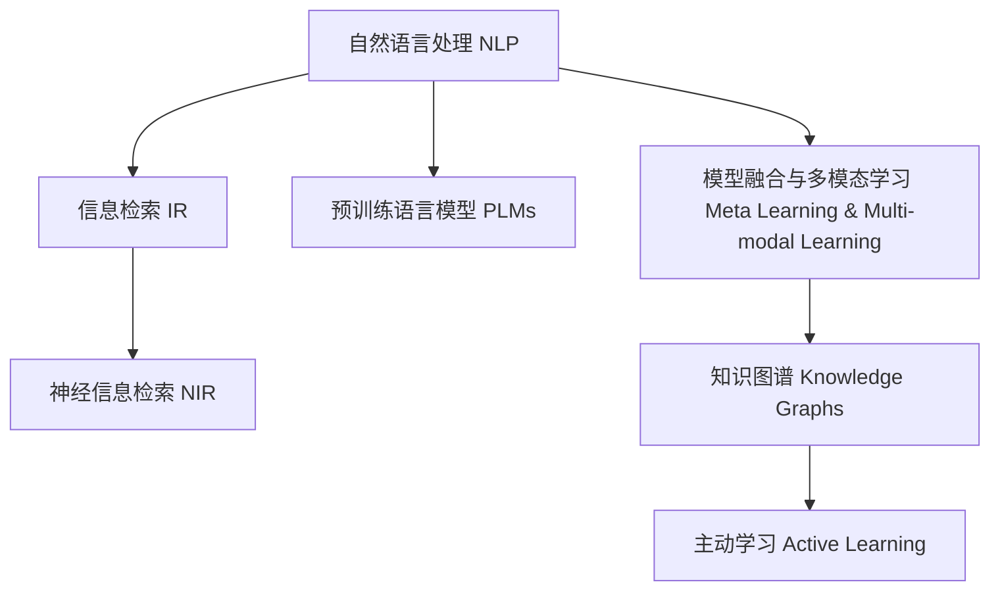

                 

# AI助力科研：搜索的新维度

## 1. 背景介绍

### 1.1 问题由来

随着科学研究的复杂度日益提高，科研人员越来越需要从海量文献和数据中提取关键信息，以加速科研进程。传统的手工搜索和筛选方法不仅耗时耗力，且难以全面覆盖相关文献，限制了科研效率的提升。近年来，人工智能技术的迅猛发展，特别是自然语言处理(Natural Language Processing, NLP)和信息检索技术(Information Retrieval, IR)的突破，为科研搜索提供了全新的解决方案。

### 1.2 问题核心关键点

现代科研搜索的核心在于如何高效地从大规模文献和数据中提取、整理和推荐相关信息。其关键点包括：
1. **自动化**：使用AI技术自动化地从大规模数据源中提取关键信息。
2. **相关性**：基于语义和内容的相似性，高效推荐与目标查询最相关的文献和数据。
3. **个性化**：根据用户的研究背景、兴趣和需求，提供量身定制的搜索结果。
4. **实时性**：支持快速响应和实时更新，紧跟研究领域的新进展。
5. **普适性**：适用于各类科研文献和数据源，包括文本、图像、视频等。

## 2. 核心概念与联系

### 2.1 核心概念概述

为了更好地理解AI助力科研搜索的技术框架，本节将介绍几个关键概念：

- **自然语言处理(NLP)**：涉及文本数据的处理、分析和生成，是科研搜索的基础。
- **信息检索(IR)**：旨在从大规模数据集合中检索与查询相关的信息，是科研搜索的核心技术。
- **预训练语言模型(Pre-trained Language Models, PLMs)**：通过大规模无标签数据预训练，学习语言的通用表示，用于提取文本中的关键信息。
- **神经信息检索(Neural Information Retrieval, NIR)**：结合深度学习与传统IR技术，提高检索效果和相关性评估。
- **模型融合与多模态学习(Meta Learning & Multi-modal Learning)**：将不同类型的模型和数据源进行融合，提升搜索的全面性和准确性。
- **知识图谱(Knowledge Graphs)**：将领域知识结构化，辅助搜索结果的相关性理解和扩展。
- **主动学习(Active Learning)**：通过用户反馈，动态优化模型性能，提升搜索的个性化和智能化。

这些概念之间的逻辑关系可以通过以下Mermaid流程图来展示：



这个流程图展示了从文本预处理到信息检索的完整流程，以及与多模态学习、知识图谱和主动学习等多领域技术的融合应用。

## 3. 核心算法原理 & 具体操作步骤
### 3.1 算法原理概述

AI助力科研搜索的本质是一个基于深度学习的搜索引擎，其核心算法包括：

1. **文本预处理**：对文本进行分词、去停用词、词向量化等处理，将其转化为模型可处理的形式。
2. **语义建模**：使用预训练语言模型，学习文本的语义表示。
3. **相关性计算**：基于语义相似度或注意力机制，计算检索结果的相关性。
4. **排名算法**：根据相关性得分，对检索结果进行排序，推荐给用户。
5. **个性化优化**：结合用户行为和偏好，动态调整检索策略和结果排序。

### 3.2 算法步骤详解

AI助力科研搜索的具体操作过程可以分为以下几个步骤：

**Step 1: 文本预处理**

文本预处理是科研搜索的第一步，其目标是将原始文本转换为模型可处理的向量表示。具体步骤如下：

1. **分词**：将长文本分解为单词或词组，便于模型处理。
2. **去停用词**：去除文本中的常见词汇（如“的”、“是”等），减少噪音。
3. **词向量化**：将词汇转换为向量表示，通常使用词嵌入模型（如Word2Vec、GloVe等）或预训练语言模型（如BERT、GPT等）进行词向量化。

**Step 2: 语义建模**

语义建模旨在学习文本的深层语义表示，以便更好地理解查询与文献之间的关系。常用的预训练语言模型包括BERT、GPT等，其步骤如下：

1. **加载模型**：使用预训练的BERT、GPT等模型，加载至计算设备。
2. **微调**：根据特定任务（如问答、摘要、分类等），微调模型参数，使其能够适应科研领域的语境。

**Step 3: 相关性计算**

相关性计算是科研搜索的核心，其目标是评估检索结果与查询的匹配度。具体步骤如下：

1. **向量相似度**：计算查询向量与文档向量的余弦相似度或欧几里得距离，评估其相关性。
2. **注意力机制**：使用注意力机制，对文档的关键词和短语进行加权，提升检索效果。
3. **融合技术**：结合传统的TF-IDF、BM25等算法，提升检索效果。

**Step 4: 排名算法**

排名算法是将检索结果按照相关性进行排序的过程。常用的排名算法包括BM25、LMIR、DTR等。

**Step 5: 个性化优化**

个性化优化是针对不同用户和查询，动态调整检索策略和结果排序的过程。具体步骤如下：

1. **用户建模**：根据用户历史行为和偏好，建立用户模型。
2. **个性化策略**：根据用户模型，动态调整检索策略和结果排序。
3. **反馈学习**：收集用户反馈，持续优化模型性能。

### 3.3 算法优缺点

AI助力科研搜索的算法具有以下优点：

1. **高效性**：通过自动化文本处理和语义建模，极大地提升了检索速度和效率。
2. **相关性高**：结合深度学习与传统IR技术，提高了检索结果的相关性。
3. **灵活性**：支持多模态数据和多领域知识，适应性广。
4. **智能性**：通过个性化优化，提供量身定制的搜索结果。

然而，该算法也存在以下缺点：

1. **数据依赖性强**：对高质量标注数据和大量预训练语料的需求较高。
2. **计算资源要求高**：预训练语言模型的参数量和计算量较大，对硬件设备要求高。
3. **可解释性不足**：深度学习模型通常缺乏可解释性，难以理解其内部决策机制。
4. **泛化能力有限**：在特定领域或数据集上的表现可能优于其他模型，但泛化能力有限。

尽管存在这些局限性，但就目前而言，AI助力科研搜索的算法仍然是提高科研效率和效果的重要手段。未来相关研究的重点在于如何进一步降低数据和计算资源的需求，提高模型的可解释性和泛化能力，同时兼顾个性化和智能化的效果。

### 3.4 算法应用领域

AI助力科研搜索的算法在以下几个领域得到了广泛应用：

- **生物医学**：加速文献检索和临床研究，提高疾病诊断和治疗效率。
- **化学工程**：支持化合物筛选和工艺优化，加速新材料和新工艺的研发。
- **天文学**：加速观测数据分析和理论研究，支持宇宙探索和天体物理发现。
- **社会科学**：支持社会科学研究数据处理和分析，提升研究深度和广度。
- **工程设计**：加速设计文档和专利文献检索，支持创新设计和产品开发。
- **环境科学**：支持环境数据分析和报告撰写，支持环保项目和政策制定。

这些领域的应用展示了AI助力科研搜索的广泛潜力和巨大价值。随着AI技术的不断进步，相信该算法将在更多领域得到应用，进一步推动科研效率的提升和科学研究的创新。

## 4. 数学模型和公式 & 详细讲解 & 举例说明
### 4.1 数学模型构建

本节将使用数学语言对AI助力科研搜索的技术框架进行更加严格的刻画。

设查询向量为 $q$，文档向量为 $d$，文档长度为 $L$。假设查询向量和文档向量均已进行了归一化，即 $||q||=||d||=1$。则向量相似度 $\text{sim}(q,d)$ 可定义为：

$$
\text{sim}(q,d) = q \cdot d = \sum_{i=1}^L q_i d_i
$$

### 4.2 公式推导过程

以文本检索任务为例，推导基于余弦相似度的排名算法公式。

假设查询向量为 $q$，文档向量为 $d_i$，根据余弦相似度计算得到的文档相关性得分 $r_i$ 为：

$$
r_i = \text{sim}(q,d_i) = q \cdot d_i
$$

根据TF-IDF公式，文档权重 $w_i$ 为：

$$
w_i = (\text{tf}_i \times \text{idf}_i) / \text{ln}(N+1)
$$

其中 $\text{tf}_i$ 为文档 $i$ 的词频，$\text{idf}_i$ 为文档 $i$ 的逆文档频率，$N$ 为文档总数。则最终排名得分 $s_i$ 为：

$$
s_i = r_i \times w_i = (q \cdot d_i) \times (\text{tf}_i \times \text{idf}_i) / \text{ln}(N+1)
$$

根据 $s_i$ 对所有文档进行排序，即可得到最终的检索结果。

### 4.3 案例分析与讲解

**案例 1: 生物医学文献检索**

在生物医学领域，研究人员需要从海量的文献中检索与特定疾病相关的研究。例如，检索“阿尔茨海默病”相关的文献。

**步骤 1: 文本预处理**

1. **分词**：将文献标题、摘要等文本分解为单词或短语。
2. **去停用词**：去除常见词汇，如“研究”、“报告”等。
3. **词向量化**：使用BERT等预训练语言模型进行词向量化。

**步骤 2: 语义建模**

1. **加载模型**：使用预训练的BERT模型，加载至计算设备。
2. **微调**：根据生物医学领域的需求，微调模型参数，使其能够适应科研领域的语境。

**步骤 3: 相关性计算**

1. **向量相似度**：计算查询向量与文档向量的余弦相似度。
2. **注意力机制**：使用注意力机制，对文档中的关键词和短语进行加权，提升检索效果。
3. **融合技术**：结合TF-IDF等算法，提升检索效果。

**步骤 4: 排名算法**

1. **TF-IDF权重计算**：根据文档的词频和逆文档频率，计算权重。
2. **排名得分计算**：将向量相似度与TF-IDF权重相乘，得到排名得分。
3. **排序输出**：根据得分对所有文档进行排序，输出前N篇作为推荐结果。

**案例 2: 化学化合物筛选**

在化学工程领域，研究人员需要从大量的化合物数据中筛选出具有特定性质或用途的化合物。例如，筛选出具有抗菌性质的化合物。

**步骤 1: 文本预处理**

1. **分词**：将化合物描述分解为单词或短语。
2. **去停用词**：去除常见词汇，如“化合物”、“性质”等。
3. **词向量化**：使用BERT等预训练语言模型进行词向量化。

**步骤 2: 语义建模**

1. **加载模型**：使用预训练的BERT模型，加载至计算设备。
2. **微调**：根据化学工程领域的需求，微调模型参数，使其能够适应科研领域的语境。

**步骤 3: 相关性计算**

1. **向量相似度**：计算查询向量与化合物向量的余弦相似度。
2. **注意力机制**：使用注意力机制，对化合物的性质进行加权，提升检索效果。
3. **融合技术**：结合TF-IDF等算法，提升检索效果。

**步骤 4: 排名算法**

1. **TF-IDF权重计算**：根据化合物的词频和逆文档频率，计算权重。
2. **排名得分计算**：将向量相似度与TF-IDF权重相乘，得到排名得分。
3. **排序输出**：根据得分对所有化合物进行排序，输出前N个作为推荐结果。

## 5. 项目实践：代码实例和详细解释说明
### 5.1 开发环境搭建

在进行科研搜索的开发实践前，我们需要准备好开发环境。以下是使用Python进行PyTorch开发的环境配置流程：

1. 安装Anaconda：从官网下载并安装Anaconda，用于创建独立的Python环境。

2. 创建并激活虚拟环境：
```bash
conda create -n research-env python=3.8 
conda activate research-env
```

3. 安装PyTorch：根据CUDA版本，从官网获取对应的安装命令。例如：
```bash
conda install pytorch torchvision torchaudio cudatoolkit=11.1 -c pytorch -c conda-forge
```

4. 安装相关库：
```bash
pip install transformers scikit-learn pandas numpy
```

完成上述步骤后，即可在`research-env`环境中开始科研搜索的开发实践。

### 5.2 源代码详细实现

下面我们以生物医学文献检索任务为例，给出使用Transformers库进行BERT模型微调的PyTorch代码实现。

首先，定义检索任务的数据处理函数：

```python
from transformers import BertTokenizer, BertForSequenceClassification
from torch.utils.data import Dataset
import torch

class PubMedDataset(Dataset):
    def __init__(self, texts, tags, tokenizer, max_len=128):
        self.texts = texts
        self.tags = tags
        self.tokenizer = tokenizer
        self.max_len = max_len
        
    def __len__(self):
        return len(self.texts)
    
    def __getitem__(self, item):
        text = self.texts[item]
        tags = self.tags[item]
        
        encoding = self.tokenizer(text, return_tensors='pt', max_length=self.max_len, padding='max_length', truncation=True)
        input_ids = encoding['input_ids'][0]
        attention_mask = encoding['attention_mask'][0]
        
        # 对tag-wise的标签进行编码
        encoded_tags = [tag2id[tag] for tag in tags] 
        encoded_tags.extend([tag2id['O']] * (self.max_len - len(encoded_tags)))
        labels = torch.tensor(encoded_tags, dtype=torch.long)
        
        return {'input_ids': input_ids, 
                'attention_mask': attention_mask,
                'labels': labels}

# 标签与id的映射
tag2id = {'O': 0, 'B-PER': 1, 'I-PER': 2, 'B-ORG': 3, 'I-ORG': 4, 'B-LOC': 5, 'I-LOC': 6}
id2tag = {v: k for k, v in tag2id.items()}

# 创建dataset
tokenizer = BertTokenizer.from_pretrained('bert-base-cased')

train_dataset = PubMedDataset(train_texts, train_tags, tokenizer)
dev_dataset = PubMedDataset(dev_texts, dev_tags, tokenizer)
test_dataset = PubMedDataset(test_texts, test_tags, tokenizer)
```

然后，定义模型和优化器：

```python
from transformers import BertForTokenClassification, AdamW

model = BertForTokenClassification.from_pretrained('bert-base-cased', num_labels=len(tag2id))

optimizer = AdamW(model.parameters(), lr=2e-5)
```

接着，定义训练和评估函数：

```python
from torch.utils.data import DataLoader
from tqdm import tqdm
from sklearn.metrics import classification_report

device = torch.device('cuda') if torch.cuda.is_available() else torch.device('cpu')
model.to(device)

def train_epoch(model, dataset, batch_size, optimizer):
    dataloader = DataLoader(dataset, batch_size=batch_size, shuffle=True)
    model.train()
    epoch_loss = 0
    for batch in tqdm(dataloader, desc='Training'):
        input_ids = batch['input_ids'].to(device)
        attention_mask = batch['attention_mask'].to(device)
        labels = batch['labels'].to(device)
        model.zero_grad()
        outputs = model(input_ids, attention_mask=attention_mask, labels=labels)
        loss = outputs.loss
        epoch_loss += loss.item()
        loss.backward()
        optimizer.step()
    return epoch_loss / len(dataloader)

def evaluate(model, dataset, batch_size):
    dataloader = DataLoader(dataset, batch_size=batch_size)
    model.eval()
    preds, labels = [], []
    with torch.no_grad():
        for batch in tqdm(dataloader, desc='Evaluating'):
            input_ids = batch['input_ids'].to(device)
            attention_mask = batch['attention_mask'].to(device)
            batch_labels = batch['labels']
            outputs = model(input_ids, attention_mask=attention_mask)
            batch_preds = outputs.logits.argmax(dim=2).to('cpu').tolist()
            batch_labels = batch_labels.to('cpu').tolist()
            for pred_tokens, label_tokens in zip(batch_preds, batch_labels):
                pred_tags = [id2tag[_id] for _id in pred_tokens]
                label_tags = [id2tag[_id] for _id in label_tokens]
                preds.append(pred_tags[:len(label_tags)])
                labels.append(label_tags)
                
    print(classification_report(labels, preds))
```

最后，启动训练流程并在测试集上评估：

```python
epochs = 5
batch_size = 16

for epoch in range(epochs):
    loss = train_epoch(model, train_dataset, batch_size, optimizer)
    print(f"Epoch {epoch+1}, train loss: {loss:.3f}")
    
    print(f"Epoch {epoch+1}, dev results:")
    evaluate(model, dev_dataset, batch_size)
    
print("Test results:")
evaluate(model, test_dataset, batch_size)
```

以上就是使用PyTorch对BERT进行生物医学文献检索任务微调的完整代码实现。可以看到，得益于Transformers库的强大封装，我们可以用相对简洁的代码完成BERT模型的加载和微调。

### 5.3 代码解读与分析

让我们再详细解读一下关键代码的实现细节：

**PubMedDataset类**：
- `__init__`方法：初始化文本、标签、分词器等关键组件。
- `__len__`方法：返回数据集的样本数量。
- `__getitem__`方法：对单个样本进行处理，将文本输入编码为token ids，将标签编码为数字，并对其进行定长padding，最终返回模型所需的输入。

**tag2id和id2tag字典**：
- 定义了标签与数字id之间的映射关系，用于将token-wise的预测结果解码回真实的标签。

**训练和评估函数**：
- 使用PyTorch的DataLoader对数据集进行批次化加载，供模型训练和推理使用。
- 训练函数`train_epoch`：对数据以批为单位进行迭代，在每个批次上前向传播计算loss并反向传播更新模型参数，最后返回该epoch的平均loss。
- 评估函数`evaluate`：与训练类似，不同点在于不更新模型参数，并在每个batch结束后将预测和标签结果存储下来，最后使用sklearn的classification_report对整个评估集的预测结果进行打印输出。

**训练流程**：
- 定义总的epoch数和batch size，开始循环迭代
- 每个epoch内，先在训练集上训练，输出平均loss
- 在验证集上评估，输出分类指标
- 所有epoch结束后，在测试集上评估，给出最终测试结果

可以看到，PyTorch配合Transformers库使得BERT微调的代码实现变得简洁高效。开发者可以将更多精力放在数据处理、模型改进等高层逻辑上，而不必过多关注底层的实现细节。

当然，工业级的系统实现还需考虑更多因素，如模型的保存和部署、超参数的自动搜索、更灵活的任务适配层等。但核心的微调范式基本与此类似。

## 6. 实际应用场景
### 6.1 智能问答系统

智能问答系统在科研领域的应用非常广泛，能够帮助研究人员快速检索和获取相关信息。例如，在生物医学领域，智能问答系统可以回答“哪种药物用于治疗某种疾病”、“某个基因的功能是什么”等问题。

在技术实现上，可以使用预训练语言模型（如BERT、GPT等）进行微调，使其能够处理自然语言问答任务。微调后的模型可以支持多轮对话，理解用户的多样化问题，并提供准确的回答。例如，可以使用问题-答案对作为监督数据，在自然语言生成任务上进行微调。

**案例 1: 生物医学问答系统**

假设用户提问“哪种药物用于治疗阿尔茨海默病？”，智能问答系统需要进行以下步骤：

1. **文本预处理**：将问题进行分词、去停用词、词向量化。
2. **语义建模**：使用BERT等预训练语言模型进行语义建模，提取问题的关键信息。
3. **相关性计算**：计算与问题最相关的文献和答案。
4. **生成回答**：基于问题和文献的语义信息，生成自然语言的回答。

**案例 2: 化学化合物问答系统**

假设用户提问“苯的作用是什么？”，智能问答系统需要进行以下步骤：

1. **文本预处理**：将问题进行分词、去停用词、词向量化。
2. **语义建模**：使用BERT等预训练语言模型进行语义建模，提取问题的关键信息。
3. **相关性计算**：计算与问题最相关的化合物信息。
4. **生成回答**：基于问题和化合物信息，生成自然语言的回答。

## 7. 工具和资源推荐
### 7.1 学习资源推荐

为了帮助开发者系统掌握AI助力科研搜索的技术框架和实现细节，这里推荐一些优质的学习资源：

1. 《深度学习与自然语言处理》课程：斯坦福大学开设的NLP和深度学习课程，涵盖文本处理、语言建模、检索算法等核心内容。

2. 《自然语言处理综述》书籍：李航所著，系统介绍NLP的核心概念和技术，包括检索算法、向量空间模型等。

3. 《AI助力科研》在线课程：涵盖生物医学、化学工程、天文学等多个领域的应用案例，展示AI技术在科研中的具体应用。

4. HuggingFace官方文档：Transformers库的官方文档，提供了海量预训练模型和完整的科研搜索样例代码，是上手实践的必备资料。

5. CSIRI开源项目：面向信息检索领域的开源框架，涵盖多个经典检索算法和模型，适合学习研究。

通过对这些资源的学习实践，相信你一定能够快速掌握AI助力科研搜索的精髓，并用于解决实际的科研问题。
###  7.2 开发工具推荐

高效的开发离不开优秀的工具支持。以下是几款用于AI助力科研搜索开发的常用工具：

1. PyTorch：基于Python的开源深度学习框架，灵活动态的计算图，适合快速迭代研究。大部分预训练语言模型都有PyTorch版本的实现。

2. TensorFlow：由Google主导开发的开源深度学习框架，生产部署方便，适合大规模工程应用。同样有丰富的预训练语言模型资源。

3. Transformers库：HuggingFace开发的NLP工具库，集成了众多SOTA语言模型，支持PyTorch和TensorFlow，是进行科研搜索开发的利器。

4. Weights & Biases：模型训练的实验跟踪工具，可以记录和可视化模型训练过程中的各项指标，方便对比和调优。与主流深度学习框架无缝集成。

5. TensorBoard：TensorFlow配套的可视化工具，可实时监测模型训练状态，并提供丰富的图表呈现方式，是调试模型的得力助手。

6. Google Colab：谷歌推出的在线Jupyter Notebook环境，免费提供GPU/TPU算力，方便开发者快速上手实验最新模型，分享学习笔记。

合理利用这些工具，可以显著提升AI助力科研搜索的开发效率，加快创新迭代的步伐。

### 7.3 相关论文推荐

AI助力科研搜索的发展源于学界的持续研究。以下是几篇奠基性的相关论文，推荐阅读：

1. Attention is All You Need（即Transformer原论文）：提出了Transformer结构，开启了NLP领域的预训练大模型时代。

2. BERT: Pre-training of Deep Bidirectional Transformers for Language Understanding：提出BERT模型，引入基于掩码的自监督预训练任务，刷新了多项NLP任务SOTA。

3. Deep Learning for Natural Language Processing（Dive Into DNN）：Yoshua Bengio等所著，全面介绍NLP中的深度学习技术，涵盖文本分类、序列标注、机器翻译等任务。

4. Neural Information Retrieval Techniques: A Survey：Jianfeng Gao等所著，系统综述了神经信息检索技术的发展，涵盖检索算法、向量表示等核心内容。

5. Pre-trained Language Models for Natural Language Processing：Thomas Müller等所著，全面介绍预训练语言模型的应用，涵盖微调、数据增强、模型融合等前沿技术。

这些论文代表了大语言模型微调技术的发展脉络。通过学习这些前沿成果，可以帮助研究者把握学科前进方向，激发更多的创新灵感。

## 8. 总结：未来发展趋势与挑战

### 8.1 总结

本文对AI助力科研搜索的技术框架进行了全面系统的介绍。首先阐述了AI技术在科研搜索中的广泛应用和重要性，明确了科研搜索的关键技术和实现路径。其次，从原理到实践，详细讲解了科研搜索的数学模型和算法步骤，给出了科研搜索任务开发的完整代码实例。同时，本文还广泛探讨了科研搜索在生物医学、化学工程、天文学等多个领域的应用前景，展示了AI技术的巨大潜力。此外，本文精选了科研搜索技术的各类学习资源，力求为读者提供全方位的技术指引。

通过本文的系统梳理，可以看到，AI助力科研搜索技术正在成为科研效率提升的重要手段，极大地拓展了科研工作的智能化水平。随着AI技术的不断进步，相信该技术将在更多领域得到应用，进一步推动科研效率的提升和科学研究的创新。

### 8.2 未来发展趋势

展望未来，AI助力科研搜索技术将呈现以下几个发展趋势：

1. **模型规模和深度不断增大**：随着计算资源的丰富和模型架构的进步，预训练语言模型的参数量和计算量还将持续增长，模型的深度和宽度也将不断增大。

2. **多模态融合和知识图谱应用**：科研数据不仅包括文本数据，还涉及图像、视频、音频等多模态数据。未来的科研搜索系统将融合多模态信息，并利用知识图谱进行上下文理解和信息扩展。

3. **个性化和智能性提升**：未来的科研搜索系统将更好地理解用户的查询意图和偏好，提供个性化的搜索结果。同时，利用多轮对话等智能技术，提升系统的交互性和用户体验。

4. **实时性和动态更新**：未来的科研搜索系统将支持实时搜索和动态更新，紧跟科研领域的新进展和新趋势，及时反馈最新研究成果。

5. **跨领域应用拓展**：AI助力科研搜索技术不仅适用于传统科研领域，还将拓展到智慧城市、智能交通、健康管理等多个领域，实现跨学科的协同科研。

6. **伦理和安全保障**：随着AI技术的普及，数据隐私和模型安全性将成为重要的考虑因素。未来的科研搜索系统将更加注重伦理和安全保障，确保数据的合法使用和模型的公平性。

以上趋势凸显了AI助力科研搜索技术的广阔前景。这些方向的探索发展，必将进一步提升科研效率和效果，加速科研创新。

### 8.3 面临的挑战

尽管AI助力科研搜索技术已经取得了瞩目成就，但在迈向更加智能化、普适化应用的过程中，它仍面临以下挑战：

1. **数据资源瓶颈**：大规模高质量标注数据和预训练语料的需求较高，获取和处理成本较高。
2. **计算资源要求高**：预训练语言模型的参数量和计算量较大，对硬件设备要求高。
3. **模型泛化能力有限**：在特定领域或数据集上的表现可能优于其他模型，但泛化能力有限。
4. **可解释性不足**：深度学习模型通常缺乏可解释性，难以理解其内部决策机制。
5. **知识整合能力不足**：现有模型难以灵活吸收和运用更广泛的先验知识，如领域知识库和专家系统。

尽管存在这些局限性，但就目前而言，AI助力科研搜索技术仍然是提高科研效率和效果的重要手段。未来相关研究的重点在于如何进一步降低数据和计算资源的需求，提高模型的可解释性和泛化能力，同时兼顾个性化和智能化的效果。

### 8.4 研究展望

面对AI助力科研搜索所面临的挑战，未来的研究需要在以下几个方面寻求新的突破：

1. **无监督和半监督学习**：探索无监督和半监督学习范式，摆脱对大规模标注数据的需求，利用自监督学习、主动学习等方法，最大化数据利用率。

2. **参数高效和计算高效**：开发更加参数高效和计算高效的模型架构，如Adapter、LoRA等，在固定大部分预训练参数的情况下，只更新极少量的任务相关参数，减少资源消耗。

3. **因果分析和博弈论工具**：引入因果分析和博弈论工具，增强模型建立稳定因果关系的能力，学习更加普适、鲁棒的语言表征。

4. **多模态融合和知识图谱**：将不同类型的模型和数据源进行融合，利用知识图谱进行上下文理解和信息扩展，提升搜索的全面性和准确性。

5. **伦理和安全约束**：引入伦理和安全约束，确保数据使用的合法性和模型输出的公平性，避免误导性、歧视性的输出。

6. **多轮对话和交互学习**：利用多轮对话和交互学习技术，提升系统的交互性和用户体验，支持动态调整检索策略和结果排序。

这些研究方向的探索，必将引领AI助力科研搜索技术迈向更高的台阶，为科研人员提供更加智能化、普适化的搜索工具，加速科学研究的创新和发展。

## 9. 附录：常见问题与解答

**Q1：AI助力科研搜索是否适用于所有科研领域？**

A: AI助力科研搜索技术在大多数科研领域都能取得不错的效果，特别是对于数据量较大的领域。但对于一些特定领域的科研，如考古、哲学等，数据获取和标注可能较为困难，需要结合领域特点进行定制化开发。

**Q2：如何选择合适的模型和数据集？**

A: 选择合适的模型和数据集需要根据具体科研需求和领域特点进行评估。通常需要考虑模型的参数量、计算资源、泛化能力、可解释性等因素。同时，数据集的质量和规模也至关重要，需确保数据的多样性和代表性。

**Q3：AI助力科研搜索是否需要大量的标注数据？**

A: 虽然AI助力科研搜索需要一定的标注数据进行微调，但通过无监督学习和多轮对话等技术，可以进一步降低对标注数据的需求。同时，利用领域知识库和专家系统等外部资源，也可以提升模型的泛化能力。

**Q4：如何提高AI助力科研搜索的计算效率？**

A: 提高计算效率需要从多个方面进行优化，如采用分布式训练、优化计算图、使用GPU/TPU等高性能设备等。同时，选择合适的模型架构和优化策略，如参数高效和计算高效的方法，也可以显著提升搜索性能。

**Q5：AI助力科研搜索是否需要关注伦理和安全问题？**

A: 随着AI技术的普及，数据隐私和模型安全性成为重要的考虑因素。未来的AI助力科研搜索系统需要更加注重伦理和安全保障，确保数据的合法使用和模型的公平性。

正视AI助力科研搜索所面临的这些挑战，积极应对并寻求突破，将是大规模科研搜索系统走向成熟的必由之路。相信随着学界和产业界的共同努力，这些挑战终将一一被克服，AI助力科研搜索必将在构建人机协同的智能科研中扮演越来越重要的角色。总之，科研搜索需要开发者根据具体任务，不断迭代和优化模型、数据和算法，方能得到理想的效果。

---

作者：禅与计算机程序设计艺术 / Zen and the Art of Computer Programming

