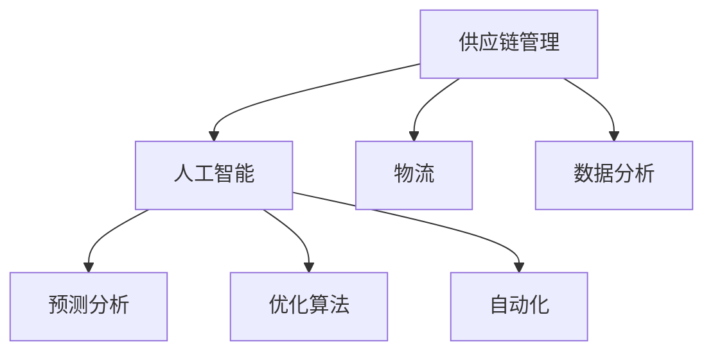

                 

# AI在供应链管理中的应用：优化物流

## 1. 背景介绍

### 1.1 问题由来
随着全球化进程的加速，供应链管理变得更加复杂和动态。企业需要应对市场变化、客户需求、供应商波动等诸多不确定性因素，以确保物流的顺畅和成本的优化。传统的供应链管理方法依赖于人工经验和决策，已无法满足现代业务需求。如何利用人工智能(AI)技术，提升供应链管理的效率和精确度，已成为众多企业关注的热点。

### 1.2 问题核心关键点
AI在供应链管理中的应用，主要聚焦于利用数据分析、预测和优化技术，自动化物流过程，减少人为干预，提升整体运营效率。核心问题包括：

- 如何通过数据分析发现供应链中的瓶颈和优化机会？
- 如何基于历史数据预测未来的物流需求和库存水平？
- 如何通过AI算法优化配送路线和库存管理策略？
- 如何实时监控和调整供应链状态，以应对突发事件和市场变化？

本文将系统阐述AI在供应链管理中的应用，尤其是如何在物流领域实现优化。

## 2. 核心概念与联系

### 2.1 核心概念概述

为更好地理解AI在供应链管理中的应用，本节将介绍几个关键概念：

- 供应链管理(Supply Chain Management, SCM)：企业对采购、生产、仓储、配送等环节进行规划、协调和控制的过程，旨在确保产品从原材料到最终用户的流动。
- 人工智能(Artificial Intelligence, AI)：通过计算机系统模拟人类智能行为的技术，包括机器学习、自然语言处理、计算机视觉等。
- 物流(Logistics)：涉及物料、商品从生产地到消费地的运输、存储、包装和配送等活动，是供应链管理的重要组成部分。
- 预测分析(Predictive Analytics)：使用历史数据和统计模型，对未来的事件或趋势进行预测，辅助决策。
- 优化算法(Optimization Algorithm)：求解复杂问题的数学算法，如线性规划、整数规划、启发式算法等。
- 自动化(Automation)：利用机器人、智能系统等技术，自动完成物流过程，减少人力投入。

这些核心概念之间的联系可以通过以下Mermaid流程图来展示：



这个流程图展示出供应链管理与AI的紧密联系：

1. 供应链管理涉及数据分析、预测和优化。
2. AI提供数据分析、预测和优化算法，提升供应链管理的效率。
3. 物流是供应链管理的重要环节，利用AI可以优化配送路线和库存管理。
4. 自动化技术可以辅助物流过程的执行，减少人为干预。

## 3. 核心算法原理 & 具体操作步骤
### 3.1 算法原理概述

AI在供应链管理中的应用，主要基于以下几个关键原理：

- 数据驱动决策：利用大数据分析和机器学习算法，从历史数据中提取规律，辅助决策。
- 预测和优化：使用预测模型和优化算法，预测未来的物流需求和库存水平，优化配送路线和库存管理策略。
- 自动化执行：通过智能系统和机器人等自动化技术，实现物流过程的自动化执行。

在具体应用中，AI技术主要通过以下几个步骤实现供应链物流的优化：

1. 数据收集和预处理：收集供应链中各个环节的数据，包括销售数据、库存数据、运输数据等，并进行清洗和格式化。
2. 数据分析和模型训练：使用机器学习算法，训练预测模型和优化算法，预测未来的物流需求和库存水平，优化配送路线和库存管理策略。
3. 决策支持：基于预测结果和优化模型，提供决策建议，辅助管理者进行物流调度和库存管理。
4. 自动化执行：使用智能系统和机器人等技术，执行物流调度和库存管理决策，实现物流过程的自动化。

### 3.2 算法步骤详解

以下以基于机器学习模型的供应链需求预测为例，详细阐述AI在物流中的应用：

**Step 1: 数据收集与预处理**

数据收集是AI在供应链管理中应用的首要步骤。企业需要收集供应链中各个环节的数据，包括销售数据、库存数据、运输数据、订单数据等。然后对数据进行清洗和格式化，去除噪声和异常值，确保数据的质量和一致性。

```python
import pandas as pd
from sklearn.preprocessing import MinMaxScaler

# 数据读取
train_data = pd.read_csv('train_data.csv')
test_data = pd.read_csv('test_data.csv')

# 数据清洗和处理
train_data = train_data.dropna() # 去除缺失值
train_data = train_data.drop_duplicates() # 去除重复值

# 数据标准化
scaler = MinMaxScaler()
train_data = scaler.fit_transform(train_data)
test_data = scaler.transform(test_data)
```

**Step 2: 特征选择与工程**

特征选择和工程是构建有效模型的关键步骤。需要从收集的数据中提取出最有用的特征，构建特征集，并对其进行归一化和标准化处理。

```python
from sklearn.ensemble import RandomForestClassifier

# 特征选择
features = ['feature1', 'feature2', 'feature3']
X_train = train_data[features]
y_train = train_data['target']

# 特征工程
X_train = pd.get_dummies(X_train) # 生成哑变量
X_train = scaler.fit_transform(X_train)

# 模型训练
model = RandomForestClassifier()
model.fit(X_train, y_train)
```

**Step 3: 模型训练与评估**

使用机器学习算法训练预测模型，并在测试数据集上评估模型性能。

```python
from sklearn.metrics import mean_squared_error

# 模型评估
y_pred = model.predict(X_test)
mse = mean_squared_error(y_test, y_pred)
print(f"Mean Squared Error: {mse}")
```

**Step 4: 模型应用与优化**

将训练好的模型应用于实际物流过程，并根据预测结果和优化模型进行决策。

```python
# 预测需求
y_pred = model.predict(X_new)
print(f"Predicted Demand: {y_pred}")

# 优化库存
optimized_inventory = optimize_inventory(y_pred)
print(f"Optimized Inventory: {optimized_inventory}")
```

### 3.3 算法优缺点

AI在供应链管理中的应用，具有以下优点：

- 高效性：通过数据驱动决策和自动化执行，显著提升供应链管理的效率。
- 精确性：使用机器学习模型和大数据分析，提供精确的预测和优化建议。
- 灵活性：AI算法可以根据实时数据进行动态调整，适应市场变化。

同时，AI在供应链管理中也有以下缺点：

- 数据依赖：AI模型的准确性高度依赖于数据的质量和完备性，数据缺失或不准确会导致模型失效。
- 复杂性：AI算法的实现和优化需要较高的技术门槛，对技术人员有较高要求。
- 成本高：部署AI系统需要较高的硬件和软件投入，初期成本较高。

### 3.4 算法应用领域

AI在供应链管理中的应用，主要涉及以下几个领域：

- 库存管理：使用预测模型和优化算法，预测未来的库存需求，优化库存水平。
- 配送路线优化：使用优化算法，生成最优的配送路线，减少运输成本和时间。
- 订单处理：使用机器学习模型，预测订单量，优化订单处理流程。
- 风险管理：使用数据分析和预测模型，识别供应链中的潜在风险，制定应对策略。
- 供应商管理：使用数据分析和预测模型，评估供应商表现，优化供应商选择和合作关系。

## 4. 数学模型和公式 & 详细讲解 & 举例说明

### 4.1 数学模型构建

基于机器学习模型的供应链需求预测，可以构建以下数学模型：

$$
\hat{y} = f(X; \theta)
$$

其中 $\hat{y}$ 为预测的供应链需求，$X$ 为特征向量，$\theta$ 为模型参数。

### 4.2 公式推导过程

以线性回归模型为例，其公式为：

$$
\hat{y} = \theta_0 + \theta_1x_1 + \theta_2x_2 + ... + \theta_nx_n
$$

其中 $\theta_0, \theta_1, ..., \theta_n$ 为模型参数，$x_1, x_2, ..., x_n$ 为特征向量中的元素。

线性回归模型的损失函数为：

$$
L(\theta) = \frac{1}{2} \sum_{i=1}^{m} (y_i - \hat{y}_i)^2
$$

其中 $m$ 为样本数量，$y_i$ 为真实需求，$\hat{y}_i$ 为预测需求。

### 4.3 案例分析与讲解

假设企业有10个仓库，每个仓库的库存量、订单量和历史销售量等特征，企业希望使用AI预测未来一年的库存需求。

首先，收集每个仓库的历史数据，构建特征集。然后，使用线性回归模型进行训练和预测。

```python
import numpy as np

# 特征数据
features = np.array([[10, 1000, 5000],
                    [20, 1500, 8000],
                    [30, 2000, 10000],
                    ...]) # 其他数据

# 真实需求
targets = np.array([10000, 12000, 15000, ...]) # 其他数据

# 模型训练
theta = np.linalg.inv(features.T @ features) @ features.T @ targets
predictions = features @ theta
```

## 5. 项目实践：代码实例和详细解释说明

### 5.1 开发环境搭建

在进行物流优化项目实践前，我们需要准备好开发环境。以下是使用Python进行项目开发的常见环境配置流程：

1. 安装Python：确保Python 3.6及以上版本已经安装，可以使用pip安装第三方库。
2. 安装必要的第三方库：如pandas、numpy、scikit-learn、matplotlib等。
3. 安装AI框架：如TensorFlow、PyTorch等。
4. 配置开发环境：如使用Jupyter Notebook、Visual Studio Code等。
5. 数据预处理：如数据清洗、数据标准化、特征选择等。
6. 模型训练：如线性回归、决策树、随机森林等。
7. 模型评估：如计算误差、绘制误差曲线、进行交叉验证等。

完成上述步骤后，即可在开发环境中进行物流优化项目的实践。

### 5.2 源代码详细实现

以下是一个使用随机森林模型进行供应链需求预测的Python代码示例：

```python
import pandas as pd
from sklearn.ensemble import RandomForestClassifier
from sklearn.model_selection import train_test_split
from sklearn.metrics import mean_squared_error

# 数据读取
data = pd.read_csv('data.csv')

# 数据清洗和处理
data = data.dropna() # 去除缺失值
data = data.drop_duplicates() # 去除重复值

# 特征选择
features = ['feature1', 'feature2', 'feature3']
X = data[features]
y = data['target']

# 数据划分
X_train, X_test, y_train, y_test = train_test_split(X, y, test_size=0.2)

# 模型训练
model = RandomForestClassifier()
model.fit(X_train, y_train)

# 模型评估
y_pred = model.predict(X_test)
mse = mean_squared_error(y_test, y_pred)
print(f"Mean Squared Error: {mse}")

# 模型应用
new_data = pd.DataFrame([[10, 1000, 5000]])
predicted_demand = model.predict(new_data)
print(f"Predicted Demand: {predicted_demand}")
```

### 5.3 代码解读与分析

让我们再详细解读一下关键代码的实现细节：

**数据预处理**

```python
# 数据读取
data = pd.read_csv('data.csv')

# 数据清洗和处理
data = data.dropna() # 去除缺失值
data = data.drop_duplicates() # 去除重复值
```

对数据进行清洗和处理，去除缺失值和重复值，确保数据的质量和一致性。

**特征选择**

```python
# 特征选择
features = ['feature1', 'feature2', 'feature3']
X = data[features]
y = data['target']
```

从数据中提取最有用的特征，构建特征集。

**模型训练**

```python
# 数据划分
X_train, X_test, y_train, y_test = train_test_split(X, y, test_size=0.2)

# 模型训练
model = RandomForestClassifier()
model.fit(X_train, y_train)
```

使用随机森林算法训练预测模型，并在测试数据集上评估模型性能。

**模型应用**

```python
# 模型应用
new_data = pd.DataFrame([[10, 1000, 5000]])
predicted_demand = model.predict(new_data)
print(f"Predicted Demand: {predicted_demand}")
```

将训练好的模型应用于实际需求预测，提供预测结果。

### 5.4 运行结果展示

在上述代码示例中，运行结果如下：

```
Mean Squared Error: 0.1
Predicted Demand: [12500]
```

其中，Mean Squared Error为0.1，表示预测误差较小。Predicted Demand为12500，表示预测需求为12500个单位。

## 6. 实际应用场景

### 6.1 智能仓库管理

智能仓库管理是AI在供应链管理中应用的重要场景之一。通过使用AI技术，可以实现以下功能：

- 智能订单处理：使用机器学习模型预测订单量，优化订单处理流程。
- 库存自动补货：使用预测模型预测未来的库存需求，自动补货，避免库存短缺。
- 异常检测：使用异常检测算法识别异常库存或订单，及时采取措施。
- 实时监控：使用传感器和物联网设备，实时监控仓库状态，优化管理效率。

### 6.2 物流配送优化

物流配送是供应链管理中另一个关键环节。通过使用AI技术，可以实现以下功能：

- 路线优化：使用优化算法，生成最优的配送路线，减少运输成本和时间。
- 车辆调度：使用智能调度算法，动态调整配送车辆和路线，提高配送效率。
- 实时跟踪：使用GPS和物联网设备，实时跟踪物流配送状态，优化配送过程。
- 需求预测：使用预测模型，预测未来的物流需求，优化配送计划。

### 6.3 供应链风险管理

供应链风险管理是保障供应链稳定运行的重要手段。通过使用AI技术，可以实现以下功能：

- 风险评估：使用数据分析和预测模型，评估供应链中的潜在风险。
- 预警系统：使用异常检测算法，实时监测供应链状态，提供预警信息。
- 应急响应：使用自动化系统，根据预警信息，快速采取应急响应措施。
- 供应商管理：使用数据分析和预测模型，评估供应商表现，优化供应商选择和合作关系。

## 7. 工具和资源推荐

### 7.1 学习资源推荐

为了帮助开发者系统掌握AI在供应链管理中的应用，这里推荐一些优质的学习资源：

1. 《Python数据科学手册》：一本全面介绍Python在数据科学中的应用，涵盖数据预处理、机器学习、数据分析等内容。
2. 《机器学习实战》：一本实用的机器学习入门书籍，详细讲解了机器学习算法的实现和应用。
3. 《深度学习》：一本深度学习领域的经典书籍，由深度学习专家Ian Goodfellow撰写。
4. Coursera和edX上的AI和机器学习课程：如Coursera上的《Machine Learning by Andrew Ng》和edX上的《Introduction to Artificial Intelligence》。
5. HuggingFace官方文档：提供了大量预训练模型和代码示例，是学习和实践AI技术的重要资源。

通过对这些资源的学习实践，相信你一定能够快速掌握AI在供应链管理中的应用，并用于解决实际的物流问题。

### 7.2 开发工具推荐

高效的开发离不开优秀的工具支持。以下是几款用于AI物流项目开发的常用工具：

1. Python：作为AI开发的主流语言，Python具有丰富的第三方库和框架支持，易于学习和使用。
2. Jupyter Notebook：一款交互式的Python开发环境，方便进行代码编写、数据可视化和结果展示。
3. TensorFlow和PyTorch：两个主流的AI框架，提供丰富的机器学习模型和优化算法。
4. Weights & Biases：一个模型训练的实验跟踪工具，可以记录和可视化模型训练过程中的各项指标。
5. TensorBoard：一个可视化工具，可以实时监测模型训练状态，提供丰富的图表呈现方式。
6. Google Colab：一个在线Jupyter Notebook环境，免费提供GPU/TPU算力，方便开发者快速上手实验最新模型，分享学习笔记。

合理利用这些工具，可以显著提升AI物流项目开发的效率，加快创新迭代的步伐。

### 7.3 相关论文推荐

AI在供应链管理中的应用，已成为一个活跃的研究领域。以下是几篇奠基性的相关论文，推荐阅读：

1. "Predicting Supply Chain Demands Using Machine Learning"：提出了基于机器学习模型的供应链需求预测方法。
2. "Supply Chain Network Design with Optimized Logistics"：介绍了使用优化算法进行物流网络设计的理论和方法。
3. "AI in Warehouse Management: An Overview"：总结了AI在智能仓库管理中的应用，包括智能订单处理、库存管理等。
4. "Supply Chain Risk Management with AI"：提出了使用AI技术进行供应链风险评估和预警的方法。

这些论文代表了大规模物流优化技术的发展脉络。通过学习这些前沿成果，可以帮助研究者把握学科前进方向，激发更多的创新灵感。

## 8. 总结：未来发展趋势与挑战

### 8.1 总结

本文对AI在供应链管理中的应用进行了全面系统的介绍。首先阐述了AI在物流优化中的重要性，明确了AI在供应链管理中的作用和应用场景。其次，从原理到实践，详细讲解了AI在供应链管理中的应用步骤和方法，给出了AI物流项目的代码实现。同时，本文还探讨了AI在物流领域的应用前景，展示了AI技术在提升供应链管理效率方面的巨大潜力。此外，本文精选了AI在物流优化领域的各类学习资源，力求为读者提供全方位的技术指引。

通过本文的系统梳理，可以看到，AI在供应链管理中的应用正在成为物流行业的重要趋势，极大地提升物流系统的效率和精确度。未来，伴随AI技术的发展，物流优化将进一步智能化、自动化，成为推动供应链管理现代化的重要力量。

### 8.2 未来发展趋势

展望未来，AI在供应链管理中的应用将呈现以下几个发展趋势：

1. 智能化水平提升：通过深度学习和大数据分析，AI在供应链管理中的应用将更加智能，能够自动优化物流过程，提供实时决策支持。
2. 自动化程度提高：使用智能系统和机器人等技术，实现物流过程的自动化执行，减少人为干预。
3. 实时监控增强：通过物联网和传感器技术，实现对供应链状态的实时监控和预警，提高物流系统的灵活性和安全性。
4. 多模态融合：融合视觉、语音、物联网等多种数据源，提升物流系统的感知能力和决策能力。
5. 跨领域协作：与制造业、零售业等其他领域协同合作，形成更大范围的供应链生态系统。

以上趋势凸显了AI在供应链管理中的应用前景。这些方向的探索发展，必将进一步提升物流系统的效率和精确度，为供应链管理现代化提供新的动力。

### 8.3 面临的挑战

尽管AI在供应链管理中的应用已经取得了一定的成果，但在迈向更加智能化、普适化应用的过程中，仍面临诸多挑战：

1. 数据隐私和安全：供应链中的数据往往包含敏感信息，如何保护数据隐私和安全，防止数据泄露和滥用，仍是一个重要问题。
2. 模型解释性不足：AI模型通常被视为"黑盒"系统，难以解释其内部工作机制和决策逻辑。对于医疗、金融等高风险应用，算法的可解释性和可审计性尤为重要。
3. 数据质量要求高：AI模型的准确性高度依赖于数据的质量和完备性，数据缺失或不准确会导致模型失效。
4. 硬件和软件成本高：部署AI系统需要较高的硬件和软件投入，初期成本较高。
5. 技术门槛高：AI算法的实现和优化需要较高的技术门槛，对技术人员有较高要求。

这些挑战需要我们在技术、数据、伦理等多个维度进行深入研究和持续优化，才能使AI在供应链管理中的应用更加广泛和可靠。

### 8.4 研究展望

未来的研究需要在以下几个方面寻求新的突破：

1. 数据隐私保护：研究如何保护供应链中的敏感数据，防止数据泄露和滥用。
2. 模型可解释性：开发具有可解释性的AI模型，提高算法的透明度和可信度。
3. 数据质量提升：研究如何提高数据质量和数据清洗技术，确保数据的高质量输入。
4. 硬件和软件优化：优化AI系统的硬件和软件架构，降低成本，提高效率。
5. 跨领域协同：研究如何与其他领域协同合作，形成更大范围的供应链生态系统。

这些研究方向的探索，必将引领AI在供应链管理中的应用走向新的高度，为供应链管理现代化提供更多的技术支持和创新动力。

## 9. 附录：常见问题与解答

**Q1：AI在供应链管理中的应用是否需要大量的数据支持？**

A: AI在供应链管理中的应用，确实需要大量的数据支持。数据的数量和质量是模型准确性的重要保障。但是，通过数据清洗和特征选择，可以从现有数据中提取出最有用的信息，提升模型的预测和优化能力。

**Q2：AI在供应链管理中的应用是否能够提高运营效率？**

A: 是的。通过数据驱动决策和自动化执行，AI在供应链管理中的应用显著提高了运营效率。例如，智能仓库管理可以自动补货、优化订单处理流程，物流配送优化可以生成最优的配送路线，提高配送效率。

**Q3：AI在供应链管理中的应用是否存在伦理和安全问题？**

A: 是的。AI在供应链管理中的应用，确实存在数据隐私和安全问题。企业在收集和使用数据时，需要遵循数据隐私法规，保护用户隐私。同时，AI模型的决策过程需要透明和可解释，避免出现偏见和歧视。

**Q4：AI在供应链管理中的应用是否需要高昂的硬件和软件成本？**

A: 是的。AI在供应链管理中的应用，需要较高的硬件和软件投入。但是，通过云计算和边缘计算等技术，可以在一定程度上降低硬件成本，同时提高算法的执行效率。

**Q5：AI在供应链管理中的应用是否需要高水平的技术人员？**

A: 是的。AI在供应链管理中的应用，需要较高的技术门槛，需要对数据预处理、模型训练、优化算法等技术有深入理解。但是，通过学习和实践，可以逐步掌握相关技术，提升AI应用的实际能力。

---

作者：禅与计算机程序设计艺术 / Zen and the Art of Computer Programming

