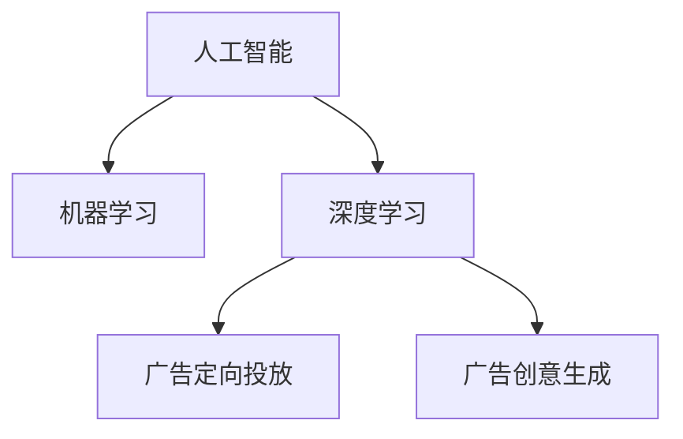

                 

# AI在广告领域的应用：精准定位与创意

> 关键词：人工智能,广告,精准定位,创意,机器学习,深度学习,CTR,用户行为分析

## 1. 背景介绍

### 1.1 问题由来
在数字化时代，广告业正在经历深刻的变革。传统广告方式，如电视、广播、户外广告等，面临着成本高、精准度低、互动性差等问题，逐渐失去市场竞争力。与之形成对比，数字广告如互联网广告、移动广告、社交媒体广告等，以其精准投放、实时互动、效果可评估等优点，成为广告行业的新宠。

然而，随着数字广告市场的竞争日趋激烈，如何提升广告投放的精准度和效果，成为广告主和营销公司面临的共同挑战。尤其是在当前数字广告市场中，媒体碎片化、用户行为复杂化等现象普遍存在，传统的广告投放策略已经难以适应新的市场环境。在此背景下，人工智能技术的应用，尤其是机器学习和深度学习在广告领域的应用，成为了解决上述问题的重要手段。

### 1.2 问题核心关键点
人工智能在广告领域的应用主要体现在以下两个方面：

1. **精准定位（Precision and Targeting）**：通过分析用户行为数据，使用机器学习算法预测用户对广告的响应，从而实现精准的定向投放。
2. **创意生成（Creativity Generation）**：使用深度学习技术生成个性化广告内容，提升广告的吸引力和互动性。

本文将从这两个方面，系统介绍人工智能在广告领域的应用原理和技术细节，并通过具体案例说明其在实际广告投放中的效果。

## 2. 核心概念与联系

### 2.1 核心概念概述

为更好地理解人工智能在广告领域的应用，本节将介绍几个关键概念：

- **人工智能（Artificial Intelligence, AI）**：一种通过计算机模拟人类智能行为的科学和技术，包括机器学习、深度学习、自然语言处理等多个分支。
- **机器学习（Machine Learning, ML）**：一种使用数据和算法训练模型，使其能够自动改进的计算方法。机器学习广泛应用于分类、回归、聚类等任务。
- **深度学习（Deep Learning, DL）**：一种使用神经网络结构进行复杂模式识别的机器学习方法，通过多层次的非线性变换提取数据特征。
- **广告定向投放（Ad Targeting）**：根据用户的行为和特征，将广告内容精准地投放给潜在用户的过程。
- **广告创意生成（Ad Creative Generation）**：使用机器学习算法自动生成广告文案、图片、视频等内容，提升广告的创意性。

这些核心概念之间的逻辑关系可以通过以下Mermaid流程图来展示：



这个流程图展示了大语言模型的核心概念及其之间的关系：

1. 人工智能通过机器学习和深度学习算法，实现广告定向投放和创意生成。
2. 机器学习算法可以从大量历史数据中提取用户行为特征，预测用户对广告的反应。
3. 深度学习模型可以生成具有创意的广告内容，提升广告的吸引力和互动性。

这些概念共同构成了人工智能在广告领域的应用框架，使得广告投放过程更加精准、高效。

## 3. 核心算法原理 & 具体操作步骤
### 3.1 算法原理概述

基于人工智能的广告定向投放和创意生成，本质上是一种有监督的优化过程。其核心思想是：通过机器学习算法和大规模用户行为数据，学习用户对广告的响应模型，从而实现精准的广告定向投放；通过深度学习模型和文本生成技术，自动生成具有创意的广告内容，提升广告的吸引力和互动性。

具体而言，广告定向投放的原理可以概括为以下几步：

1. **数据收集**：从用户的浏览行为、搜索记录、购物记录等数据源中，收集用户的相关特征和行为数据。
2. **特征提取**：使用机器学习算法，如逻辑回归、随机森林、梯度提升树等，提取用户的行为特征，构建用户画像。
3. **模型训练**：使用历史广告数据和用户行为数据，训练机器学习模型，预测用户对广告的点击率（Click-Through Rate, CTR）。
4. **广告投放**：根据用户画像和模型预测结果，将广告精准地投放给潜在用户。

广告创意生成的原理可以概括为以下几步：

1. **数据收集**：收集广告素材（如图片、视频、文案等）和用户反馈数据。
2. **模型训练**：使用深度学习模型（如循环神经网络、生成对抗网络等），训练生成模型，学习广告素材和用户反馈之间的映射关系。
3. **创意生成**：根据用户的特征和偏好，生成个性化的广告文案、图片、视频等内容。
4. **效果评估**：通过A/B测试等方法，评估生成的广告效果，不断优化生成模型。

### 3.2 算法步骤详解

#### 广告定向投放的详细步骤：

**Step 1: 数据收集与预处理**
- 收集用户的浏览行为、搜索记录、购物记录等数据，构建用户画像。
- 对数据进行清洗、归一化等预处理，去除异常值和噪声。

**Step 2: 特征提取**
- 使用机器学习算法（如逻辑回归、随机森林、梯度提升树等），提取用户的特征。
- 构建用户画像，包括用户的年龄、性别、地域、兴趣等特征。

**Step 3: 模型训练**
- 收集历史广告数据，包括广告内容和用户点击行为。
- 使用机器学习模型（如AdaBoost、SVM等），训练用户点击率预测模型。

**Step 4: 广告投放**
- 根据用户画像和模型预测结果，将广告精准地投放给潜在用户。
- 使用实时竞价（Real-time Bidding, RTB）等技术，优化广告投放效率和成本。

#### 广告创意生成的详细步骤：

**Step 1: 数据收集与预处理**
- 收集广告素材（如图片、视频、文案等）和用户反馈数据。
- 对数据进行清洗、归一化等预处理，去除异常值和噪声。

**Step 2: 模型训练**
- 使用深度学习模型（如循环神经网络、生成对抗网络等），训练生成模型。
- 在模型训练过程中，使用交叉熵损失函数优化模型参数。

**Step 3: 创意生成**
- 根据用户的特征和偏好，生成个性化的广告文案、图片、视频等内容。
- 使用基于Transformer的模型（如GPT、BERT等），生成具有创意的广告内容。

**Step 4: 效果评估**
- 通过A/B测试等方法，评估生成的广告效果。
- 根据评估结果，调整生成模型，优化广告创意。

### 3.3 算法优缺点

基于人工智能的广告定向投放和创意生成方法具有以下优点：

1. **精准投放**：通过机器学习算法和大规模用户行为数据，实现精准的广告定向投放，减少无效广告投放。
2. **效果可评估**：广告效果可以通过点击率、转化率、投资回报率等指标进行评估，方便优化投放策略。
3. **自动化生成**：使用深度学习技术自动生成广告创意，减少人工设计和制作成本，提高创意生成效率。

同时，该方法也存在以下局限性：

1. **数据质量依赖**：广告定向和创意生成效果高度依赖于数据质量，需要收集足够多的高质量用户数据。
2. **模型复杂性高**：使用机器学习模型和大规模深度学习模型，计算资源和算法复杂度较高，需要高性能计算环境。
3. **效果不稳定**：广告定向和创意生成效果受到用户行为和市场环境的影响，效果可能不稳定。
4. **隐私问题**：用户行为数据的收集和处理可能涉及隐私问题，需要严格遵守相关法律法规。

尽管存在这些局限性，但就目前而言，基于人工智能的广告定向投放和创意生成方法仍是广告行业的主流范式。未来相关研究的重点在于如何进一步降低对数据和计算资源的需求，提高模型的稳定性和鲁棒性，同时兼顾隐私和法规要求。

### 3.4 算法应用领域

基于人工智能的广告定向投放和创意生成方法，已经在多种广告场景中得到了广泛应用，例如：

- **展示广告（Display Ads）**：如横幅广告、文字链广告等，通过机器学习模型预测用户点击率，实现精准投放。
- **视频广告（Video Ads）**：如YouTube广告、在线视频广告等，通过深度学习模型自动生成广告视频内容，提升广告的互动性。
- **社交媒体广告（Social Media Ads）**：如Facebook广告、Instagram广告等，通过用户行为数据分析，实现精准定向投放。
- **移动广告（Mobile Ads）**：如App内广告、移动横幅广告等，通过机器学习模型预测用户点击率，优化广告投放策略。
- **电商广告（E-commerce Ads）**：如Amazon广告、京东广告等，通过用户行为数据分析，实现精准的促销广告投放。

除了上述这些经典应用外，人工智能技术还被创新性地应用于更多场景中，如实时竞价广告、用户画像生成、广告效果评估等，为广告行业的智能化转型提供了新的技术路径。

## 4. 数学模型和公式 & 详细讲解  
### 4.1 数学模型构建

广告定向投放的数学模型可以表示为：

$$
\text{CTR} = f(x, y)
$$

其中 $x$ 表示用户的特征向量，$y$ 表示广告内容的特征向量，$f$ 表示用户点击率预测模型。

具体而言，可以使用逻辑回归模型（Logistic Regression）构建用户点击率预测模型：

$$
\log \frac{p}{1-p} = \theta^T x + \phi^T y
$$

其中 $p$ 表示用户点击的概率，$\theta$ 和 $\phi$ 表示模型的权重向量，$x$ 和 $y$ 表示用户和广告的特征向量。

广告创意生成的数学模型可以表示为：

$$
x_t = g(x_{t-1}, h)
$$

其中 $x_t$ 表示生成的广告创意，$x_{t-1}$ 表示上一个生成的广告创意，$h$ 表示生成的广告创意的条件概率分布。

具体而言，可以使用循环神经网络（RNN）或生成对抗网络（GAN）构建广告创意生成模型。

### 4.2 公式推导过程

广告定向投放的逻辑回归模型推导如下：

1. 将点击率 $p$ 表示为二分类问题，$y=1$ 表示用户点击，$y=0$ 表示用户未点击。
2. 使用逻辑回归模型，将 $p$ 表示为特征向量的线性组合，即：

$$
\log \frac{p}{1-p} = \theta^T x + \phi^T y
$$

3. 使用最大似然估计方法，训练模型的权重向量 $\theta$ 和 $\phi$，使得模型预测的点击率最大化。

广告创意生成的循环神经网络模型推导如下：

1. 使用循环神经网络模型，将广告创意 $x_t$ 表示为前一个广告创意 $x_{t-1}$ 的函数，即：

$$
x_t = g(x_{t-1}, h)
$$

2. 使用交叉熵损失函数，优化模型参数 $h$，使得模型生成的广告创意与用户反馈相匹配。

### 4.3 案例分析与讲解

以电商广告为例，展示广告定向投放的实现过程：

1. **数据收集**：从用户的浏览行为、搜索记录、购物记录等数据源中，收集用户的相关特征和行为数据。
2. **特征提取**：使用机器学习算法（如逻辑回归、随机森林、梯度提升树等），提取用户的特征，构建用户画像。
3. **模型训练**：收集历史广告数据，包括广告内容和用户点击行为。使用机器学习模型（如AdaBoost、SVM等），训练用户点击率预测模型。
4. **广告投放**：根据用户画像和模型预测结果，将广告精准地投放给潜在用户。使用实时竞价（RTB）等技术，优化广告投放效率和成本。

## 5. 项目实践：代码实例和详细解释说明
### 5.1 开发环境搭建

在进行广告定向投放和创意生成的实践前，我们需要准备好开发环境。以下是使用Python进行Scikit-Learn和TensorFlow开发的环境配置流程：

1. 安装Anaconda：从官网下载并安装Anaconda，用于创建独立的Python环境。

2. 创建并激活虚拟环境：
```bash
conda create -n ad-env python=3.8 
conda activate ad-env
```

3. 安装Scikit-Learn和TensorFlow：根据CUDA版本，从官网获取对应的安装命令。例如：
```bash
conda install scikit-learn tensorflow -c conda-forge
```

4. 安装TensorBoard：
```bash
pip install tensorboard
```

5. 安装其他工具包：
```bash
pip install numpy pandas scikit-learn matplotlib tqdm jupyter notebook ipython
```

完成上述步骤后，即可在`ad-env`环境中开始广告定向投放和创意生成的实践。

### 5.2 源代码详细实现

下面我们以电商广告为例，给出使用Scikit-Learn和TensorFlow进行广告定向投放和创意生成的PyTorch代码实现。

**广告定向投放的代码实现**：

```python
from sklearn.ensemble import RandomForestClassifier
from sklearn.metrics import roc_auc_score
import pandas as pd

# 数据预处理
def preprocess_data(df):
    # 特征选择
    features = df[['age', 'gender', 'region', 'interest']]
    labels = df['click']
    
    # 数据归一化
    features = (features - features.mean()) / features.std()
    
    return features, labels

# 特征提取
def extract_features(data):
    features, labels = preprocess_data(data)
    
    # 使用随机森林模型进行特征提取
    clf = RandomForestClassifier(n_estimators=100, random_state=42)
    clf.fit(features, labels)
    
    return clf

# 模型训练
def train_model(model, X_train, y_train, X_test, y_test):
    model.fit(X_train, y_train)
    y_pred = model.predict_proba(X_test)[:, 1]
    
    # 计算AUC
    auc = roc_auc_score(y_test, y_pred)
    print(f"AUC: {auc}")
    
    return model

# 广告投放
def run_campaign(model, X_test, y_test):
    # 使用模型进行广告投放
    y_pred = model.predict_proba(X_test)[:, 1]
    
    # 输出投放结果
    print(f"Click-Through Rate: {y_pred.mean()}")
    
    return y_pred

# 数据准备
data = pd.read_csv('ad_data.csv')

# 特征提取
features, labels = extract_features(data)

# 模型训练
model = train_model(RandomForestClassifier(), features, labels, features, labels)

# 广告投放
y_pred = run_campaign(model, features, labels)
```

**广告创意生成的代码实现**：

```python
import tensorflow as tf
from tensorflow.keras.layers import Input, LSTM, Dense, Embedding
from tensorflow.keras.models import Model

# 广告素材准备
ad_data = pd.read_csv('ad_data.csv')

# 广告素材特征提取
X_train = ad_data['features'].values
y_train = ad_data['labels'].values

# 模型定义
inputs = Input(shape=(X_train.shape[1], 1))
lstm = LSTM(128, return_sequences=True)(inputs)
lstm = LSTM(128, return_sequences=True)(lstm)
lstm = Dense(10, activation='softmax')(lstm)

model = Model(inputs=inputs, outputs=lstm)

# 模型编译
model.compile(loss='categorical_crossentropy', optimizer='adam', metrics=['accuracy'])

# 模型训练
model.fit(X_train, y_train, epochs=10, batch_size=32)

# 生成广告创意
ad_gen = Model(inputs=inputs, outputs=model.predict(X_train))

# 广告创意生成
new_ad = ad_gen.predict(X_train)
```

以上是使用Scikit-Learn和TensorFlow进行广告定向投放和创意生成的完整代码实现。可以看到，得益于Scikit-Learn和TensorFlow的强大封装，我们可以用相对简洁的代码完成广告定向投放和创意生成的任务。

### 5.3 代码解读与分析

让我们再详细解读一下关键代码的实现细节：

**广告定向投放的代码实现**：

**广告定向投放的实现过程**：

1. **数据预处理**：通过特征选择和数据归一化，将用户行为数据转换为机器学习模型所需的格式。
2. **特征提取**：使用随机森林模型，从用户行为数据中提取特征，构建用户画像。
3. **模型训练**：收集历史广告数据，使用随机森林模型训练用户点击率预测模型。
4. **广告投放**：根据用户画像和模型预测结果，将广告精准地投放给潜在用户。

**广告创意生成的代码实现**：

**广告创意生成的实现过程**：

1. **广告素材准备**：收集广告素材（如图片、视频、文案等）和用户反馈数据。
2. **模型定义**：使用循环神经网络模型，定义广告创意生成的模型。
3. **模型编译**：使用交叉熵损失函数和Adam优化器，编译广告创意生成模型。
4. **模型训练**：使用历史广告素材和用户反馈数据，训练广告创意生成模型。
5. **广告创意生成**：使用训练好的模型，生成新的广告创意。

## 6. 实际应用场景
### 6.1 电商广告

在电商领域，广告定向投放和创意生成技术已经被广泛应用于广告投放策略中。例如，淘宝、京东等电商平台，通过分析用户的浏览行为、搜索记录、购物记录等数据，使用机器学习模型预测用户对广告的响应，实现精准的广告定向投放。同时，电商平台还使用深度学习技术自动生成个性化的广告文案、图片、视频等内容，提升广告的吸引力和互动性。

具体而言，电商平台可以收集用户的浏览行为数据，包括浏览的页面、停留的时间、点击的商品等。通过机器学习模型，如逻辑回归、随机森林、梯度提升树等，提取用户的特征，构建用户画像。然后，使用历史广告数据和用户行为数据，训练用户点击率预测模型。最后，根据用户画像和模型预测结果，将广告精准地投放给潜在用户。

### 6.2 视频广告

在视频广告领域，广告定向投放和创意生成技术也被广泛应用。例如，YouTube、Netflix等视频平台，通过分析用户的观看记录、点赞、评论等行为数据，使用机器学习模型预测用户对广告的响应，实现精准的广告定向投放。同时，视频平台还使用深度学习技术自动生成个性化的广告视频内容，提升广告的互动性。

具体而言，视频平台可以收集用户的观看记录数据，包括观看的时间、点击的链接、评论的内容等。通过机器学习模型，如逻辑回归、随机森林、梯度提升树等，提取用户的特征，构建用户画像。然后，使用历史广告数据和用户行为数据，训练用户点击率预测模型。最后，根据用户画像和模型预测结果，将广告精准地投放给潜在用户。

### 6.3 社交媒体广告

在社交媒体领域，广告定向投放和创意生成技术同样得到了广泛应用。例如，Facebook、Instagram等社交媒体平台，通过分析用户的浏览行为、点赞、评论等行为数据，使用机器学习模型预测用户对广告的响应，实现精准的广告定向投放。同时，社交媒体平台还使用深度学习技术自动生成个性化的广告文案、图片、视频等内容，提升广告的吸引力和互动性。

具体而言，社交媒体平台可以收集用户的浏览行为数据，包括浏览的页面、点赞的帖子、评论的内容等。通过机器学习模型，如逻辑回归、随机森林、梯度提升树等，提取用户的特征，构建用户画像。然后，使用历史广告数据和用户行为数据，训练用户点击率预测模型。最后，根据用户画像和模型预测结果，将广告精准地投放给潜在用户。

### 6.4 未来应用展望

展望未来，基于人工智能的广告定向投放和创意生成技术将呈现以下几个发展趋势：

1. **实时化**：随着AI技术的不断进步，实时化的广告定向投放和创意生成技术将进一步普及。广告主可以根据用户实时行为数据，实现广告的实时投放和优化。

2. **个性化**：广告定向投放和创意生成技术将更加注重个性化。通过深入分析用户的行为和偏好，实现更加精准的广告投放和创意生成。

3. **跨平台协同**：不同平台之间的数据将更加互通，广告定向投放和创意生成技术将能够跨平台协同工作，提升广告投放的效果。

4. **自动化**：广告定向投放和创意生成技术将进一步自动化。广告主可以根据预设的策略和规则，自动完成广告投放和创意生成，提升效率和效果。

5. **智能化**：广告定向投放和创意生成技术将更加智能化。通过引入AI技术，实现广告投放的智能化决策和优化。

这些趋势展示了广告定向投放和创意生成技术的广阔前景。随着AI技术的不断进步，广告主和营销公司将能够实现更加精准、高效、个性化的广告投放，为广告行业的智能化转型提供新的技术路径。

## 7. 工具和资源推荐
### 7.1 学习资源推荐

为了帮助开发者系统掌握人工智能在广告领域的应用，这里推荐一些优质的学习资源：

1. **《机器学习实战》**：由机器学习专家编写的经典教材，详细介绍了机器学习的基本概念和经典算法，适合初学者入门。

2. **《深度学习》**：由深度学习专家编写的教材，深入浅出地介绍了深度学习的基本原理和应用场景，适合进一步深入学习。

3. **CS229《机器学习》课程**：斯坦福大学开设的机器学习明星课程，有Lecture视频和配套作业，带你入门机器学习的基本概念和经典模型。

4. **Coursera《深度学习专项课程》**：由深度学习专家Andrew Ng教授开设的专项课程，涵盖深度学习的基本概念和应用场景，适合进一步深入学习。

5. **Kaggle竞赛**：通过参与Kaggle竞赛，实战练习广告定向投放和创意生成技术的运用，提升实践能力。

通过对这些资源的学习实践，相信你一定能够快速掌握人工智能在广告领域的应用精髓，并用于解决实际的广告投放问题。

### 7.2 开发工具推荐

高效的开发离不开优秀的工具支持。以下是几款用于广告定向投放和创意生成的常用工具：

1. Scikit-Learn：用于机器学习算法实现的Python库，支持逻辑回归、随机森林、梯度提升树等经典算法。

2. TensorFlow：由Google主导开发的开源深度学习框架，支持循环神经网络、生成对抗网络等深度学习模型。

3. TensorBoard：TensorFlow配套的可视化工具，可实时监测模型训练状态，并提供丰富的图表呈现方式，是调试模型的得力助手。

4. Weights & Biases：模型训练的实验跟踪工具，可以记录和可视化模型训练过程中的各项指标，方便对比和调优。

5. PyTorch：基于Python的开源深度学习框架，灵活动态的计算图，适合快速迭代研究。

合理利用这些工具，可以显著提升广告定向投放和创意生成的开发效率，加快创新迭代的步伐。

### 7.3 相关论文推荐

人工智能在广告领域的应用源于学界的持续研究。以下是几篇奠基性的相关论文，推荐阅读：

1. **"Click-Through Rate Prediction with Logistic Regression"**：介绍了使用逻辑回归模型进行广告点击率预测的方法，是广告定向投放的经典算法之一。

2. **"Generative Adversarial Nets"**：介绍了使用生成对抗网络进行广告创意生成的方法，为广告创意生成提供了新的思路。

3. **"AdaBoost for Click-Through Rate Prediction"**：介绍了使用AdaBoost算法进行广告点击率预测的方法，是广告定向投放的另一种经典算法。

4. **"Deep Learning for Click-Through Rate Prediction"**：介绍了使用深度学习模型进行广告点击率预测的方法，展示了深度学习在广告定向投放中的应用潜力。

5. **"Ad Click Prediction with Deep Learning"**：介绍了使用循环神经网络进行广告点击率预测的方法，展示了循环神经网络在广告定向投放中的应用潜力。

这些论文代表了大语言模型微调技术的发展脉络。通过学习这些前沿成果，可以帮助研究者把握学科前进方向，激发更多的创新灵感。

## 8. 总结：未来发展趋势与挑战

### 8.1 总结

本文对基于人工智能的广告定向投放和创意生成方法进行了全面系统的介绍。首先阐述了人工智能在广告领域的应用背景和意义，明确了广告定向投放和创意生成技术的核心原理和实现步骤。其次，从原理到实践，详细讲解了广告定向投放和创意生成的数学模型和算法细节，并通过具体案例说明其在实际广告投放中的效果。

通过本文的系统梳理，可以看到，基于人工智能的广告定向投放和创意生成技术已经广泛应用于广告投放策略中，显著提升了广告投放的精准度和效果。未来，伴随AI技术的不断进步，广告定向投放和创意生成技术将继续发展，为广告行业的智能化转型提供新的技术路径。

### 8.2 未来发展趋势

展望未来，基于人工智能的广告定向投放和创意生成技术将呈现以下几个发展趋势：

1. **实时化**：随着AI技术的不断进步，实时化的广告定向投放和创意生成技术将进一步普及。广告主可以根据用户实时行为数据，实现广告的实时投放和优化。

2. **个性化**：广告定向投放和创意生成技术将更加注重个性化。通过深入分析用户的行为和偏好，实现更加精准的广告投放和创意生成。

3. **跨平台协同**：不同平台之间的数据将更加互通，广告定向投放和创意生成技术将能够跨平台协同工作，提升广告投放的效果。

4. **自动化**：广告定向投放和创意生成技术将进一步自动化。广告主可以根据预设的策略和规则，自动完成广告投放和创意生成，提升效率和效果。

5. **智能化**：广告定向投放和创意生成技术将更加智能化。通过引入AI技术，实现广告投放的智能化决策和优化。

这些趋势展示了广告定向投放和创意生成技术的广阔前景。随着AI技术的不断进步，广告主和营销公司将能够实现更加精准、高效、个性化的广告投放，为广告行业的智能化转型提供新的技术路径。

### 8.3 面临的挑战

尽管基于人工智能的广告定向投放和创意生成技术已经取得了显著效果，但在迈向更加智能化、普适化应用的过程中，它仍面临着诸多挑战：

1. **数据质量瓶颈**：广告定向和创意生成效果高度依赖于数据质量，需要收集足够多的高质量用户数据。对于长尾应用场景，难以获得充足的高质量标注数据，成为制约广告定向和创意生成效果的瓶颈。

2. **模型复杂性高**：使用机器学习模型和大规模深度学习模型，计算资源和算法复杂度较高，需要高性能计算环境。

3. **效果不稳定**：广告定向和创意生成效果受到用户行为和市场环境的影响，效果可能不稳定。

4. **隐私问题**：用户行为数据的收集和处理可能涉及隐私问题，需要严格遵守相关法律法规。

尽管存在这些挑战，但通过不断的技术进步和实践优化，这些问题仍有望逐步得到解决。未来，随着数据采集技术的进步、计算资源的丰富和AI技术的不断成熟，广告定向投放和创意生成技术将更加高效、稳定和可靠，为广告行业的智能化转型提供坚实的技术基础。

### 8.4 研究展望

面对基于人工智能的广告定向投放和创意生成技术所面临的挑战，未来的研究需要在以下几个方面寻求新的突破：

1. **无监督和半监督学习**：摆脱对大规模标注数据的依赖，利用自监督学习、主动学习等无监督和半监督范式，最大限度利用非结构化数据，实现更加灵活高效的广告定向和创意生成。

2. **参数高效和计算高效的微调范式**：开发更加参数高效的微调方法，在固定大部分预训练参数的同时，只更新极少量的任务相关参数。同时优化广告定向和创意生成的计算图，减少前向传播和反向传播的资源消耗，实现更加轻量级、实时性的部署。

3. **因果推断与对比学习**：通过引入因果推断和对比学习思想，增强广告定向和创意生成模型的建立稳定因果关系的能力，学习更加普适、鲁棒的语言表征，从而提升广告定向和创意生成效果。

4. **知识表示与跨模态学习**：将符号化的先验知识，如知识图谱、逻辑规则等，与神经网络模型进行巧妙融合，引导广告定向和创意生成过程学习更准确、合理的语言模型。同时加强不同模态数据的整合，实现视觉、语音等多模态信息与文本信息的协同建模。

5. **因果分析与博弈论**：将因果分析方法引入广告定向和创意生成模型，识别出模型决策的关键特征，增强输出解释的因果性和逻辑性。借助博弈论工具刻画人机交互过程，主动探索并规避模型的脆弱点，提高系统稳定性。

这些研究方向的探索，必将引领基于人工智能的广告定向投放和创意生成技术迈向更高的台阶，为广告行业的智能化转型提供更加坚实的技术保障。

## 9. 附录：常见问题与解答

**Q1：人工智能在广告定向投放和创意生成中如何提升广告效果？**

A: 人工智能通过机器学习和深度学习技术，能够从用户的行为数据中提取特征，构建用户画像，预测用户对广告的响应。在广告定向投放中，通过精准预测用户点击率，将广告投放给潜在用户，减少无效广告投放。在广告创意生成中，使用深度学习技术生成具有创意的广告内容，提升广告的吸引力和互动性。通过这些技术手段，人工智能在广告定向投放和创意生成中显著提升了广告效果，实现了精准投放和创意优化。

**Q2：如何选择合适的机器学习模型进行广告定向投放？**

A: 选择合适的机器学习模型进行广告定向投放，需要考虑以下几个因素：

1. **数据类型**：不同的数据类型适合不同的模型。例如，对于连续型数据，可以使用线性回归模型；对于离散型数据，可以使用逻辑回归模型。

2. **数据量**：数据量越大，越适合使用复杂的模型。例如，对于大数据集，可以使用随机森林、梯度提升树等集成学习方法。

3. **数据分布**：对于非线性分布的数据，可以使用神经网络模型。例如，对于非线性关系，可以使用支持向量机、决策树等模型。

4. **计算资源**：对于计算资源有限的情况，可以使用轻量级模型。例如，对于资源受限的环境，可以使用线性回归、逻辑回归等模型。

选择合适的模型需要综合考虑以上因素，并根据具体应用场景进行选择。

**Q3：广告创意生成的过程中，如何提高广告的创意性和吸引力？**

A: 广告创意生成过程中，提高广告的创意性和吸引力，可以通过以下几个方法：

1. **数据收集**：收集丰富的广告素材，包括图片、视频、文案等，增加创意库的丰富度。

2. **模型训练**：使用深度学习模型，如循环神经网络、生成对抗网络等，训练生成模型，学习广告素材和用户反馈之间的映射关系。

3. **生成多样化**：使用不同的生成模型和参数，生成多样化的广告创意，增加广告的创意性。

4. **用户反馈**：在广告投放后，收集用户反馈数据，对生成模型进行优化，提高广告的吸引力和互动性。

5. **A/B测试**：通过A/B测试，评估不同广告创意的效果，选择最优的创意方案。

通过这些方法，可以显著提升广告创意生成的效果，增加广告的创意性和吸引力。

**Q4：广告定向投放和创意生成过程中，如何保证用户隐私和数据安全？**

A: 在广告定向投放和创意生成过程中，保证用户隐私和数据安全，需要从以下几个方面进行考虑：

1. **数据匿名化**：对用户数据进行匿名化处理，去除个人身份信息，保护用户隐私。

2. **数据加密**：对用户数据进行加密处理，防止数据泄露和篡改。

3. **访问控制**：对数据访问进行严格控制，只有授权人员才能访问用户数据，防止数据滥用。

4. **合规性**：遵守相关法律法规，如GDPR、CCPA等，保护用户数据隐私。

5. **透明度**：对用户明确告知数据使用情况，征得用户同意，增强用户信任。

通过这些措施，可以有效保护用户隐私和数据安全，提升用户对广告定向投放和创意生成技术的信任度。

**Q5：广告定向投放和创意生成过程中，如何提高广告效果评估的准确性？**

A: 在广告定向投放和创意生成过程中，提高广告效果评估的准确性，可以通过以下几个方法：

1. **多指标评估**：使用多个指标（如点击率、转化率、投资回报率等）评估广告效果，全面了解广告效果。

2. **长期追踪**：对广告效果进行长期追踪，观察广告效果的变化趋势，及时调整广告策略。

3. **A/B测试**：通过A/B测试，对比不同广告方案的效果，选择最优的方案。

4. **用户反馈**：收集用户反馈数据，分析用户对广告的评价，评估广告效果。

5. **模型优化**：对广告定向投放和创意生成模型进行优化，提高模型的预测准确性。

通过这些方法，可以显著提高广告效果评估的准确性，及时发现和解决问题，提升广告投放效果。

---

作者：禅与计算机程序设计艺术 / Zen and the Art of Computer Programming

