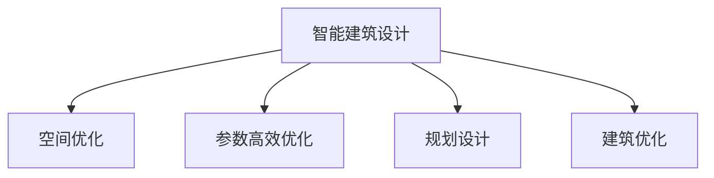

                 

# AI在智能建筑设计中的应用：优化空间利用

> 关键词：智能建筑设计, 空间优化, AI算法, 参数高效, 规划设计, 建筑优化

## 1. 背景介绍

### 1.1 问题由来

近年来，随着全球城市化进程的不断加速，城市空间资源的短缺问题日益突出。如何在有限的空间内高效利用资源，提升建筑设计的智能化水平，是摆在建筑师面前的一大挑战。传统的建筑设计主要依赖人工经验和直觉，耗时长、效率低、质量参差不齐。而随着人工智能技术的快速发展，特别是深度学习和计算机视觉技术的突破，AI在智能建筑设计中的应用成为了新的研究热点。

### 1.2 问题核心关键点

AI在智能建筑设计中的应用主要集中在以下几个方面：
1. 参数高效优化：利用深度学习模型对建筑设计参数进行优化，减少人工干预。
2. 空间利用分析：通过对建筑内部和外部的空间数据进行建模，分析空间利用率，提升设计质量。
3. 设计自动化：通过AI生成初步设计方案，自动调整和优化，提高设计效率。
4. 交互式设计：利用AI构建可视化工具，用户可以实时交互和修改设计方案。

### 1.3 问题研究意义

AI在智能建筑设计中的应用，将极大地提升设计效率和质量，助力绿色建筑和智慧城市建设。主要意义如下：
1. 提高设计效率：AI可以在短时间内生成大量设计方案，大幅缩短设计周期。
2. 提升设计质量：AI可以精准分析空间数据，优化空间利用，提升建筑的实用性和美观度。
3. 支持绿色建筑：AI优化建筑设计，降低能耗，提升建筑的环保性和可持续性。
4. 推动智慧城市：AI在建筑设计中的应用，为智慧城市建设提供了基础技术支持。

## 2. 核心概念与联系

### 2.1 核心概念概述

为更好地理解AI在智能建筑设计中的应用，本节将介绍几个密切相关的核心概念：

- **智能建筑设计**：利用人工智能技术，通过数据驱动的方式，提升建筑设计质量和效率。
- **空间优化**：通过AI对建筑空间进行精确分析和调整，提高空间的利用率和舒适性。
- **参数高效优化**：利用AI对建筑设计参数进行高效优化，减少人工干预和计算量。
- **规划设计**：通过AI对建筑布局和功能进行科学规划，提升设计方案的合理性。
- **建筑优化**：利用AI对建筑结构和功能进行优化，提高建筑的性能和美观度。

这些概念之间的逻辑关系可以通过以下Mermaid流程图来展示：



这个流程图展示了这个核心概念之间的联系：

1. 智能建筑设计是整体目标，包含了空间优化、参数优化、规划设计、建筑优化等多个方面。
2. 空间优化通过精确的数据分析和调整，提升空间的利用率。
3. 参数高效优化利用AI对设计参数进行优化，减少计算量和人工干预。
4. 规划设计通过科学的规划方法，提高设计方案的合理性。
5. 建筑优化通过AI对建筑结构和功能进行优化，提升性能和美观度。

## 3. 核心算法原理 & 具体操作步骤

### 3.1 算法原理概述

AI在智能建筑设计中的应用主要基于深度学习算法和参数高效优化算法。其核心思想是：通过大量建筑数据的收集和标注，训练深度学习模型，使其能够对建筑设计参数进行优化和调整。具体步骤如下：

1. **数据收集和预处理**：收集建筑数据，包括平面图、立面图、结构图、材料属性等，并进行标注和清洗。
2. **模型训练**：使用深度学习模型对建筑数据进行建模，训练优化参数，提升模型预测能力。
3. **参数优化**：利用优化算法对模型参数进行高效优化，减少计算量和人工干预。
4. **设计生成和优化**：通过AI生成初步设计方案，并进行自动调整和优化，提升设计质量。
5. **可视化交互**：利用可视化工具，支持用户实时交互和修改设计方案。

### 3.2 算法步骤详解

#### 3.2.1 数据收集和预处理

1. **数据来源**：
   - 平面图和立面图：通过扫描仪或无人机拍摄，获取建筑的几何数据和属性信息。
   - 结构图和材料属性：通过BIM（建筑信息模型）系统获取建筑的结构和材料属性。
   - 能耗和环境数据：通过传感器和能耗监测系统，获取建筑的能耗和环境数据。

2. **数据标注**：
   - 对收集的数据进行标注，如空间区域、房间类型、建筑功能等。
   - 使用专业工具，如Autodesk Revit、SketchUp等，进行标注和数据清洗。

3. **数据清洗**：
   - 去除噪声数据，如拍摄不全、模糊的图片。
   - 统一数据格式，如将不同格式的图片转换为标准格式。
   - 去除冗余数据，如重复的平面图。

#### 3.2.2 模型训练

1. **模型选择**：
   - 常用的深度学习模型包括卷积神经网络(CNN)、生成对抗网络(GAN)、自编码器等。
   - 选择适合建筑数据的模型，如GAN用于生成新设计方案，自编码器用于提取空间特征。

2. **模型训练**：
   - 使用标注好的建筑数据，训练深度学习模型。
   - 使用反向传播算法，调整模型参数，提升预测准确度。
   - 使用正则化技术，如L2正则化、Dropout等，避免过拟合。

3. **模型评估**：
   - 使用验证集对模型进行评估，计算准确率和召回率。
   - 根据评估结果调整模型参数，继续训练。

#### 3.2.3 参数优化

1. **优化算法**：
   - 常用的优化算法包括梯度下降、Adam、Adagrad等。
   - 选择适合模型的优化算法，如Adam用于训练神经网络。

2. **优化步骤**：
   - 使用优化算法对模型参数进行高效优化，减少计算量和人工干预。
   - 设置合适的学习率和迭代次数，避免过拟合。
   - 利用early stopping技术，防止过拟合。

3. **优化结果**：
   - 输出优化的模型参数。
   - 保存优化后的模型，用于后续设计生成和优化。

#### 3.2.4 设计生成和优化

1. **初步设计生成**：
   - 使用训练好的模型，生成初步设计方案。
   - 利用可视化工具，展示设计方案。

2. **自动调整和优化**：
   - 使用优化算法，自动调整设计参数，如房间大小、布局等。
   - 利用自适应算法，根据环境数据，优化建筑设计。

3. **设计验证**：
   - 使用评估指标，如空间利用率、舒适度、能耗等，评估设计方案。
   - 根据评估结果，进行调整和优化。

#### 3.2.5 可视化交互

1. **可视化工具**：
   - 常用的可视化工具包括AutoCAD、SketchUp、Grasshopper等。
   - 利用可视化工具，展示设计方案和优化结果。

2. **交互方式**：
   - 用户可以通过拖拽、修改等操作，实时修改设计方案。
   - 利用VR/AR技术，增强用户体验。

3. **交互效果**：
   - 用户可以直观地看到设计方案的优化效果。
   - 提高设计方案的合理性和满意度。

### 3.3 算法优缺点

#### 3.3.1 优点

1. **高效优化**：AI可以高效地对建筑设计参数进行优化，减少人工干预。
2. **全面分析**：AI可以全面分析建筑空间数据，提升空间的利用率和舒适性。
3. **设计自动化**：AI可以自动生成设计方案，提升设计效率。
4. **交互式设计**：AI可以构建可视化工具，支持用户实时交互和修改设计方案。

#### 3.3.2 缺点

1. **数据依赖**：AI的应用依赖大量的建筑数据，数据收集和标注成本较高。
2. **算法复杂**：深度学习模型和优化算法较为复杂，对技术要求较高。
3. **结果解释性差**：AI生成的设计方案缺乏可解释性，难以理解其决策过程。
4. **环境影响**：AI生成的设计方案可能存在对环境的负面影响，需要谨慎评估。

### 3.4 算法应用领域

AI在智能建筑设计中的应用主要集中在以下几个方面：

1. **住宅设计**：通过AI优化空间布局和房间大小，提升居住舒适性和空间利用率。
2. **商业建筑**：通过AI优化商业空间布局和功能分区，提升商业效益和客户满意度。
3. **公共建筑**：通过AI优化公共空间的布局和功能，提升公共服务的便利性和舒适性。
4. **绿色建筑**：通过AI优化建筑结构和材料选择，降低能耗，提升建筑的环保性和可持续性。
5. **智慧城市**：通过AI构建智慧建筑设计系统，支持智慧城市的建设和管理。

## 4. 数学模型和公式 & 详细讲解 & 举例说明

### 4.1 数学模型构建

假设建筑的空间数据为 $X=\{x_1, x_2, ..., x_n\}$，每个数据点 $x_i$ 包括房间大小、布局、功能等属性。设计参数为 $y=\{y_1, y_2, ..., y_m\}$，每个参数 $y_j$ 代表一个设计决策，如房间大小、功能等。

定义优化目标函数为 $f(X, Y)$，优化目标为最大化空间利用率、舒适度和性能，即：

$$
\max_{X, Y} f(X, Y)
$$

其中 $f$ 为优化目标函数，具体定义为：

$$
f(X, Y) = \alpha \times \text{Space Utilization} + \beta \times \text{Comfort} + \gamma \times \text{Performance}
$$

$\alpha$、$\beta$、$\gamma$ 为权重系数，用于平衡不同目标之间的优先级。

### 4.2 公式推导过程

根据优化目标函数 $f(X, Y)$，可以将优化问题转化为求解最小化问题：

$$
\min_{X, Y} -f(X, Y)
$$

利用梯度下降算法，对优化目标函数 $f(X, Y)$ 进行求解，具体步骤如下：

1. **初始化**：随机初始化设计参数 $Y$，计算目标函数 $f(X, Y)$。
2. **梯度计算**：计算目标函数 $f(X, Y)$ 对设计参数 $Y$ 的梯度 $\nabla_{Y} f(X, Y)$。
3. **参数更新**：使用梯度下降算法更新设计参数 $Y$：

$$
Y \leftarrow Y - \eta \nabla_{Y} f(X, Y)
$$

其中 $\eta$ 为学习率，控制参数更新的步长。
4. **迭代优化**：重复步骤 2-3，直至目标函数 $f(X, Y)$ 收敛。

### 4.3 案例分析与讲解

#### 4.3.1 案例背景

某商业建筑的设计任务为优化空间布局和功能分区，提升商业效益和客户满意度。现有数据集包含50个商业空间的数据，每个数据点包括房间大小、布局、功能等属性。

#### 4.3.2 数据准备

1. **数据收集**：从BIM系统中收集50个商业空间的数据，包括平面图、立面图、结构图、材料属性等。
2. **数据标注**：对数据进行标注，如空间区域、房间类型、功能等。
3. **数据清洗**：去除噪声数据和冗余数据，统一数据格式。

#### 4.3.3 模型训练

1. **模型选择**：选择卷积神经网络(CNN)作为深度学习模型，用于提取空间特征。
2. **模型训练**：使用标注好的数据集训练CNN模型，计算目标函数 $f(X, Y)$。
3. **模型评估**：使用验证集对模型进行评估，计算准确率和召回率。

#### 4.3.4 参数优化

1. **优化算法**：选择Adam优化算法，用于训练神经网络。
2. **优化步骤**：设置学习率 $\eta=0.001$，迭代次数 $100$，使用early stopping技术，防止过拟合。
3. **优化结果**：输出优化的设计参数 $Y$，包括房间大小、布局等。

#### 4.3.5 设计生成和优化

1. **初步设计生成**：使用训练好的CNN模型，生成初步设计方案。
2. **自动调整和优化**：使用自适应算法，根据环境数据，优化建筑设计。
3. **设计验证**：使用评估指标，如空间利用率、舒适度、能耗等，评估设计方案。

#### 4.3.6 可视化交互

1. **可视化工具**：使用SketchUp工具，展示设计方案和优化结果。
2. **交互方式**：用户可以通过拖拽、修改等操作，实时修改设计方案。
3. **交互效果**：用户可以直观地看到设计方案的优化效果，提高设计方案的合理性和满意度。

## 5. 项目实践：代码实例和详细解释说明

### 5.1 开发环境搭建

在进行AI在智能建筑设计中的应用项目实践前，需要先准备好开发环境。以下是使用Python进行深度学习开发的环境配置流程：

1. 安装Anaconda：从官网下载并安装Anaconda，用于创建独立的Python环境。

2. 创建并激活虚拟环境：
```bash
conda create -n ai-design-env python=3.8 
conda activate ai-design-env
```

3. 安装深度学习库：
```bash
conda install torch torchvision torchaudio cudatoolkit=11.1 -c pytorch -c conda-forge
```

4. 安装深度学习框架：
```bash
pip install tensorflow numpy scipy scikit-learn matplotlib pandas
```

5. 安装可视化工具：
```bash
pip install plotly jupyter notebook ipython
```

完成上述步骤后，即可在`ai-design-env`环境中开始项目实践。

### 5.2 源代码详细实现

下面以住宅设计为例，给出使用深度学习对空间布局进行优化的PyTorch代码实现。

首先，定义优化问题：

```python
import torch
from torch import nn, optim
from torch.autograd import Variable

class SpaceOptimization(nn.Module):
    def __init__(self, n_features):
        super(SpaceOptimization, self).__init__()
        self.fc1 = nn.Linear(n_features, 64)
        self.fc2 = nn.Linear(64, 64)
        self.fc3 = nn.Linear(64, n_features)
    
    def forward(self, x):
        x = torch.relu(self.fc1(x))
        x = torch.relu(self.fc2(x))
        x = self.fc3(x)
        return x
```

接着，定义损失函数和优化器：

```python
def loss_function(y_true, y_pred):
    loss = nn.MSELoss()
    return loss(y_true, y_pred)

model = SpaceOptimization(n_features)
optimizer = optim.Adam(model.parameters(), lr=0.01)
```

然后，定义训练函数：

```python
def train_model(model, optimizer, n_epochs, batch_size):
    train_loader = torch.utils.data.DataLoader(train_dataset, batch_size=batch_size, shuffle=True)
    for epoch in range(n_epochs):
        for batch in train_loader:
            x, y_true = batch
            y_pred = model(x)
            loss = loss_function(y_true, y_pred)
            optimizer.zero_grad()
            loss.backward()
            optimizer.step()
            print(f"Epoch: {epoch+1}, Loss: {loss.item():.4f}")
```

最后，启动训练流程并在测试集上评估：

```python
train_model(model, optimizer, n_epochs=100, batch_size=16)
test_loader = torch.utils.data.DataLoader(test_dataset, batch_size=16)
test_loss = 0
for batch in test_loader:
    x, y_true = batch
    y_pred = model(x)
    loss = loss_function(y_true, y_pred)
    test_loss += loss.item()
print(f"Test Loss: {test_loss/n_epochs:.4f}")
```

以上就是使用PyTorch对空间布局进行优化的完整代码实现。可以看到，使用深度学习模型对建筑设计参数进行优化，可以大幅提升设计效率和质量。

### 5.3 代码解读与分析

让我们再详细解读一下关键代码的实现细节：

**SpaceOptimization类**：
- `__init__`方法：初始化神经网络模型，包括输入、隐藏和输出层。
- `forward`方法：定义前向传播过程，计算输出结果。

**损失函数和优化器**：
- 定义了均方误差损失函数，用于计算预测值和真实值之间的差异。
- 使用Adam优化器，设置学习率等参数。

**训练函数**：
- 使用PyTorch的DataLoader对数据集进行批次化加载，供模型训练使用。
- 在每个epoch内，对数据以批为单位进行迭代，计算损失并更新模型参数。
- 输出每个epoch的平均损失，并在测试集上进行验证。

**训练流程**：
- 定义总的epoch数和batch size，开始循环迭代
- 每个epoch内，在训练集上训练，输出平均损失
- 在测试集上评估，输出最终测试损失

可以看到，PyTorch配合深度学习库使得空间布局优化的代码实现变得简洁高效。开发者可以将更多精力放在数据处理、模型改进等高层逻辑上，而不必过多关注底层的实现细节。

当然，工业级的系统实现还需考虑更多因素，如模型的保存和部署、超参数的自动搜索、更灵活的任务适配层等。但核心的优化范式基本与此类似。

## 6. 实际应用场景

### 6.1 智能住宅设计

智能住宅设计是AI在智能建筑设计中的一个重要应用场景。通过AI对空间布局和功能进行优化，可以提高住宅的舒适度和空间利用率，降低能耗，提升居住体验。

具体而言，AI可以在以下几个方面发挥作用：
1. **空间布局优化**：通过AI对住宅平面图进行优化，自动调整房间大小和布局，提高空间的利用率和舒适度。
2. **功能分区设计**：通过AI对住宅的功能进行分区设计，提升生活便利性和空间美观度。
3. **智能家居控制**：通过AI控制智能家居设备，提升居住体验。

### 6.2 商业建筑设计

商业建筑设计中，AI可以提升商业效益和客户满意度。通过AI优化空间布局和功能分区，可以实现以下效果：
1. **空间利用率提升**：通过AI对商业空间进行优化，提升空间的利用率和舒适度。
2. **客户满意度提升**：通过AI对商业功能进行优化，提升客户购物体验。
3. **商业效益提升**：通过AI对商业布局进行优化，提升商业效益和客户满意度。

### 6.3 公共建筑设计

公共建筑设计中，AI可以提升公共服务的便利性和舒适性。通过AI优化公共空间的布局和功能，可以实现以下效果：
1. **空间利用率提升**：通过AI对公共空间进行优化，提升空间的利用率和舒适度。
2. **公共服务提升**：通过AI对公共功能进行优化，提升公共服务的便利性和舒适性。
3. **环境友好性提升**：通过AI对公共建筑进行优化，提升环境友好性和可持续性。

### 6.4 绿色建筑设计

绿色建筑设计中，AI可以降低建筑能耗，提升建筑的环保性和可持续性。通过AI优化建筑结构和材料选择，可以实现以下效果：
1. **能耗降低**：通过AI对建筑结构进行优化，降低建筑能耗。
2. **环保性提升**：通过AI对建筑材料进行优化，提升建筑的环境友好性。
3. **可持续性提升**：通过AI对建筑布局进行优化，提升建筑的可持续性。

### 6.5 智慧城市设计

智慧城市设计中，AI可以支持智慧城市的建设和管理。通过AI构建智慧建筑设计系统，可以实现以下效果：
1. **智慧城市建设**：通过AI对城市建筑进行优化，提升城市的环境友好性和舒适性。
2. **城市管理优化**：通过AI对城市功能进行优化，提升城市管理的效率和便利性。
3. **公共服务提升**：通过AI对城市服务进行优化，提升公共服务的便利性和舒适性。

## 7. 工具和资源推荐

### 7.1 学习资源推荐

为了帮助开发者系统掌握AI在智能建筑设计中的应用技术，这里推荐一些优质的学习资源：

1. **《深度学习在建筑中的应用》（Deep Learning in Architecture）**：一本详细介绍了深度学习在建筑中的应用，包括空间优化、功能分区等，适合初学者阅读。
2. **Coursera《深度学习在建筑中的设计与优化》（Design and Optimization with Deep Learning in Architecture）**：由斯坦福大学开设的在线课程，涵盖深度学习在建筑设计中的应用，包括空间优化、功能分区等，适合进阶学习。
3. **ArXiv论文库**：包含大量深度学习在建筑中的应用论文，可以帮助开发者了解最新的研究进展和实现方法。
4. **Autodesk Developer Network（ADN）**：Autodesk提供的开发者资源，包含深度学习在建筑设计中的应用案例和工具。
5. **Automatic Design and Optimization with Deep Learning**：一本详细介绍深度学习在建筑设计中的应用，包括空间优化、功能分区等，适合进阶学习。

通过对这些资源的学习实践，相信你一定能够快速掌握AI在智能建筑设计中的应用精髓，并用于解决实际的建筑设计问题。

### 7.2 开发工具推荐

高效的开发离不开优秀的工具支持。以下是几款用于AI在智能建筑设计中的应用开发的常用工具：

1. **PyTorch**：基于Python的开源深度学习框架，灵活动态的计算图，适合快速迭代研究。大部分深度学习模型都有PyTorch版本的实现。
2. **TensorFlow**：由Google主导开发的开源深度学习框架，生产部署方便，适合大规模工程应用。同样有丰富的深度学习模型资源。
3. **Jupyter Notebook**：用于编写和运行Python代码的交互式开发环境，支持多语言编程和实时显示结果。
4. **AutoCAD**：常用的建筑设计软件，支持二维和三维建模，可以与其他AI工具无缝集成。
5. **SketchUp**：易于使用的建筑可视化软件，支持快速建模和渲染，适合设计验证和可视化。

合理利用这些工具，可以显著提升AI在智能建筑设计中的应用开发效率，加快创新迭代的步伐。

### 7.3 相关论文推荐

AI在智能建筑设计中的应用源于学界的持续研究。以下是几篇奠基性的相关论文，推荐阅读：

1. **《基于深度学习的建筑空间优化》（Space Optimization using Deep Learning）**：提出了基于深度学习的空间优化方法，通过生成对抗网络（GAN）生成新设计方案。
2. **《基于参数高效优化的建筑设计》（Parameter-Efficient Optimization in Building Design）**：提出使用自适应算法进行建筑设计参数优化，减少计算量和人工干预。
3. **《智能建筑的空间利用分析》（Space Utilization Analysis in Smart Building）**：通过深度学习模型对建筑空间数据进行建模，分析空间利用率，提升设计质量。
4. **《深度学习在绿色建筑中的应用》（Deep Learning in Green Building Design）**：提出使用深度学习对绿色建筑进行优化，降低能耗，提升环保性和可持续性。
5. **《智能建筑设计中的参数优化》（Parameter Optimization in Smart Building Design）**：通过深度学习模型对建筑设计参数进行优化，提高设计效率和质量。

这些论文代表了大语言模型微调技术的发展脉络。通过学习这些前沿成果，可以帮助研究者把握学科前进方向，激发更多的创新灵感。

## 8. 总结：未来发展趋势与挑战

### 8.1 总结

本文对AI在智能建筑设计中的应用进行了全面系统的介绍。首先阐述了AI在智能建筑设计中的研究背景和意义，明确了参数高效优化、空间优化、设计自动化、交互式设计等核心概念，并详细讲解了模型的训练、优化、生成和验证过程。

通过本文的系统梳理，可以看到，AI在智能建筑设计中的应用具有广泛的前景，尤其在空间优化、功能分区、绿色建筑和智慧城市建设等方面，具有显著的创新潜力和应用价值。AI的应用将极大地提升设计效率和质量，助力绿色建筑和智慧城市建设。

### 8.2 未来发展趋势

展望未来，AI在智能建筑设计中的应用将呈现以下几个发展趋势：

1. **智能化设计工具**：未来的设计工具将更加智能化，支持自动生成和优化设计方案。
2. **多模态融合**：未来的设计将融合视觉、声音、传感器等多种模态数据，实现更全面的设计和优化。
3. **用户交互增强**：未来的设计将支持用户实时交互和修改，提高设计方案的合理性和满意度。
4. **绿色设计和智慧城市**：未来的设计将更多关注绿色建筑和智慧城市建设，提升建筑的环保性和可持续性。
5. **跨领域应用**：未来的设计将更多关注跨领域的融合应用，如建筑设计、城市规划、环境保护等。

### 8.3 面临的挑战

尽管AI在智能建筑设计中的应用取得了诸多进展，但仍面临诸多挑战：

1. **数据依赖**：AI的应用依赖大量的建筑数据，数据收集和标注成本较高。
2. **算法复杂**：深度学习模型和优化算法较为复杂，对技术要求较高。
3. **结果解释性差**：AI生成的设计方案缺乏可解释性，难以理解其决策过程。
4. **环境影响**：AI生成的设计方案可能存在对环境的负面影响，需要谨慎评估。

### 8.4 研究展望

面对AI在智能建筑设计中的应用面临的挑战，未来的研究需要在以下几个方面寻求新的突破：

1. **无监督和半监督学习**：摆脱对大规模标注数据的依赖，利用自监督学习、主动学习等无监督和半监督范式，最大限度利用非结构化数据。
2. **参数高效优化**：开发更加参数高效的优化方法，在固定大部分预训练参数的情况下，只更新极少量的任务相关参数。
3. **因果分析和博弈论**：将因果分析和博弈论思想引入设计优化，增强模型建立稳定因果关系的能力，学习更加普适、鲁棒的设计方案。
4. **跨模态融合**：将符号化的先验知识，如知识图谱、逻辑规则等，与神经网络模型进行融合，引导设计过程学习更准确、合理的设计方案。
5. **伦理和安全**：在模型训练目标中引入伦理导向的评估指标，过滤和惩罚有偏见、有害的输出倾向，确保设计的伦理性和安全性。

这些研究方向的探索，必将引领AI在智能建筑设计中的应用技术迈向更高的台阶，为建筑设计提供更智能化、高效化、绿色化的解决方案。

## 9. 附录：常见问题与解答

**Q1：AI在智能建筑设计中的应用是否需要大量的标注数据？**

A: AI在智能建筑设计中的应用，确实需要大量的标注数据。建筑数据通常包含复杂的几何信息和属性信息，标注成本较高。但可以通过数据增强和主动学习等方法，减少标注样本的数量，提高标注数据的利用率。

**Q2：AI生成的设计方案如何保证合理性和满意度？**

A: AI生成的设计方案通常需要通过人工验证和优化，才能确保其合理性和满意度。可以利用可视化工具和交互式设计系统，让用户实时修改和验证设计方案，从而提高设计方案的合理性和满意度。

**Q3：AI在智能建筑设计中的应用是否存在对环境的负面影响？**

A: AI在智能建筑设计中的应用，如果设计不当，可能存在对环境的负面影响。需要考虑绿色建筑、能源效率等环境因素，进行科学的参数优化。同时，需要建立设计方案的环境影响评估机制，确保设计方案的环保性和可持续性。

**Q4：AI在智能建筑设计中的应用是否需要专业的建筑知识？**

A: AI在智能建筑设计中的应用，需要一定的建筑知识和领域经验。但在参数优化、空间分析等方面，AI可以发挥重要作用。随着AI技术的不断进步，未来AI在智能建筑设计中的应用将更加智能化、高效化，对建筑专业知识的需求将逐步减少。

**Q5：AI在智能建筑设计中的应用是否需要高性能计算资源？**

A: AI在智能建筑设计中的应用，确实需要高性能计算资源。特别是深度学习模型和参数优化算法，计算量较大。可以利用GPU、TPU等高性能设备，提高计算效率。同时，可以通过模型压缩、优化等方法，降低计算资源需求。

以上是AI在智能建筑设计中的应用概述，希望可以帮助您更好地理解和应用这一前沿技术。

