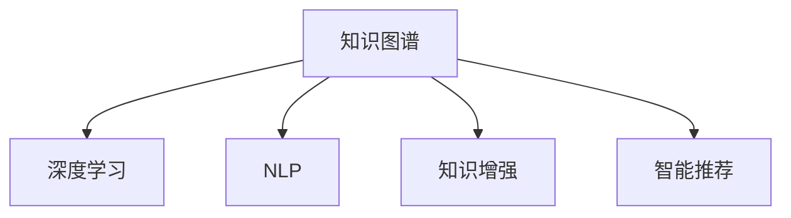

                 

# AI在知识整合方面的优势

> 关键词：知识整合,人工智能,深度学习,自然语言处理,知识图谱,知识增强,智能推荐

## 1. 背景介绍

### 1.1 问题由来

在现代信息时代，人类社会产生了前所未有的信息量，这些信息以文本、图片、音频、视频等形式存在。如何高效地整合、组织和利用这些海量知识，是信息时代的重要挑战。以知识图谱、专家数据库、网络问答系统等为代表的智能知识整合技术，试图从海量无序数据中提取有价值的知识，辅助人类进行决策和理解。

人工智能（AI）技术，特别是深度学习（Deep Learning）和自然语言处理（NLP）技术的兴起，为知识整合提供了新的可能。AI能够从大规模数据中自动学习模式，构建更丰富、更深入的知识图谱，提供更智能化的知识推荐和查询服务，从而大幅提升知识整合的效率和效果。

### 1.2 问题核心关键点

AI在知识整合方面的优势主要体现在以下几个方面：

- **自动化学习**：AI能够自动从大量数据中学习知识模式，无需人工干预。
- **多源数据整合**：AI可以整合多种数据类型，包括文本、图像、视频等，构建跨模态的知识图谱。
- **语义理解**：AI具备强大的语义理解能力，可以精准地解析和抽取知识。
- **实时更新**：AI系统可以持续学习和更新，保持知识的时效性。
- **个性化推荐**：AI能够根据用户需求和行为，提供个性化的知识推荐。

## 2. 核心概念与联系

### 2.1 核心概念概述

为更好地理解AI在知识整合方面的作用，本节将介绍几个关键概念：

- **知识图谱(Knowledge Graph)**：一种结构化的知识表示方式，用于存储实体、关系和属性等信息。知识图谱可以帮助机器理解和推理复杂的知识。

- **深度学习(Deep Learning)**：一种机器学习技术，通过多层神经网络自动学习特征，广泛应用于图像、语音、文本等领域。深度学习模型能够自动提取数据中的高层次抽象特征，适用于复杂的知识整合任务。

- **自然语言处理(Natural Language Processing, NLP)**：AI中用于处理和理解自然语言的技术。NLP技术能够从文本中提取和解析语义信息，辅助知识图谱的构建和查询。

- **知识增强(Knowledge Augmentation)**：将外部知识源（如维基百科、百科全书等）与AI系统整合，增强系统的知识量和质量。

- **智能推荐（Recommendation System）**：通过分析用户行为数据，推荐相关的知识或信息，提升用户体验。

这些概念之间的逻辑关系可以通过以下Mermaid流程图来展示：



这个流程图展示了知识图谱与AI技术的紧密联系：

1. 知识图谱通过深度学习技术自动学习知识，提高知识图谱的质量。
2. NLP技术用于解析文本数据，辅助知识图谱的构建。
3. 知识增强将外部知识源整合到系统内，丰富知识库。
4. 智能推荐系统基于知识图谱和用户行为数据，提供个性化推荐服务。

## 3. 核心算法原理 & 具体操作步骤

### 3.1 算法原理概述

AI在知识整合方面的核心算法包括深度学习、自然语言处理和知识图谱技术。以下将详细介绍这些算法的基本原理：

- **深度学习模型**：以多层神经网络为核心，通过反向传播算法自动学习特征，适用于处理大规模数据集。常见的深度学习模型包括卷积神经网络（CNN）、循环神经网络（RNN）、Transformer等。

- **自然语言处理技术**：包括词向量化、句法分析、语义理解等步骤。通过词向量化技术将文本转换为向量表示，便于机器处理。句法分析用于解析文本的语法结构，语义理解用于提取和解析文本中的语义信息。

- **知识图谱构建**：通过实体识别、关系抽取等技术，从文本数据中自动提取实体和关系，构建知识图谱。常见的知识图谱构建技术包括关系抽取（Relation Extraction）、实体链接（Entity Linking）、知识融合（Knowledge Fusion）等。

### 3.2 算法步骤详解

AI在知识整合方面的具体步骤包括数据预处理、特征提取、模型训练和模型应用。以下详细介绍这些步骤：

**Step 1: 数据预处理**
- 收集和清洗数据：从各种数据源（如维基百科、新闻、社交媒体等）收集文本数据，并进行清洗、去重和格式化处理。
- 文本分词和词向量化：将文本数据分词，使用词嵌入技术（如Word2Vec、GloVe）将分词后的单词转换为向量表示。

**Step 2: 特征提取**
- 句法分析：使用依存句法分析（Dependency Parsing）或依存关系抽取（Dependency Relation Extraction）解析文本的语法结构，提取语法特征。
- 语义理解：使用预训练语言模型（如BERT、GPT）进行语义分析，提取语义特征。

**Step 3: 模型训练**
- 知识图谱构建：通过实体识别、关系抽取等技术，自动从文本数据中提取实体和关系，构建知识图谱。
- 深度学习模型训练：使用深度学习模型（如Transformer）对文本数据进行训练，学习文本-知识图谱之间的映射关系。

**Step 4: 模型应用**
- 知识查询和推理：使用训练好的模型对用户查询进行推理，从知识图谱中提取相关信息。
- 知识推荐：根据用户行为数据，使用推荐算法（如协同过滤、基于内容的推荐）推荐相关的知识或信息。

### 3.3 算法优缺点

AI在知识整合方面的算法具有以下优点：

- **自动化学习**：能够自动从数据中学习知识模式，无需人工干预，提高效率。
- **多源数据整合**：能够整合多种数据类型，构建跨模态的知识图谱，提升知识覆盖面。
- **语义理解**：具备强大的语义理解能力，能够准确解析和抽取知识。
- **实时更新**：能够持续学习和更新，保持知识的时效性。

同时，这些算法也存在以下缺点：

- **数据依赖性高**：需要大量高质量的数据进行训练，数据质量直接影响模型效果。
- **计算资源需求高**：深度学习模型的训练和推理需要大量的计算资源，可能面临成本和效率问题。
- **解释性不足**：模型决策过程缺乏可解释性，难以调试和理解。

### 3.4 算法应用领域

AI在知识整合方面的算法在多个领域得到了广泛应用：

- **智慧医疗**：通过整合医学知识图谱，辅助医生诊断和治疗，提升医疗服务质量。
- **智能教育**：利用知识图谱和推荐技术，为学生提供个性化学习资源和辅导。
- **智能金融**：通过整合金融知识图谱，提供风险评估和投资建议。
- **智能客服**：利用知识图谱和推荐技术，提升客服系统的智能化水平。
- **智能推荐**：基于用户行为数据和知识图谱，提供个性化推荐服务。

## 4. 数学模型和公式 & 详细讲解 & 举例说明

### 4.1 数学模型构建

本节将使用数学语言对AI在知识整合方面的算法进行更加严格的刻画。

假设从文本数据中提取的实体集合为 $E=\{e_1, e_2, ..., e_n\}$，关系集合为 $R=\{r_1, r_2, ..., r_m\}$。知识图谱可以表示为一个三元组集合 $G=\{(e_i, r_j, e_k)\}_{i,j,k=1}^{n,m,n}$。

定义知识图谱的表示函数 $f: E \times R \rightarrow \mathbb{R}^d$，将实体和关系映射为向量表示。则知识图谱的向量表示为 $G_f \in \mathbb{R}^{n \times d \times (m+1)}$，其中 $d$ 为向量的维度。

对于任意一个查询 $q \in E$，知识图谱中的推理过程可以表示为：

$$
q_G = \max_{(e_i, r_j, e_k) \in G} \langle f(e_i), f(r_j), f(e_k) \rangle
$$

其中 $\langle \cdot, \cdot, \cdot \rangle$ 表示向量之间的点积运算。

### 4.2 公式推导过程

以下我们以问答系统为例，推导AI在知识图谱推理和查询中的数学模型。

假设知识图谱 $G_f \in \mathbb{R}^{n \times d \times (m+1)}$，查询 $q \in E$ 的向量表示为 $f(q)$。则查询 $q$ 在知识图谱 $G_f$ 中对应的推理结果为：

$$
q_G = \max_{(e_i, r_j, e_k) \in G} \langle f(e_i), f(r_j), f(e_k) \rangle
$$

其中 $r_j$ 为查询与实体之间的推理关系，$e_i$ 和 $e_k$ 为推理路径上的实体。

令 $\langle f(e_i), f(r_j), f(e_k) \rangle = \langle v_i, v_j, v_k \rangle$，则有：

$$
q_G = \max_{i,j,k} \langle v_i, v_j, v_k \rangle
$$

通过求解上述优化问题，可以求得查询 $q$ 在知识图谱 $G_f$ 中的推理结果。

### 4.3 案例分析与讲解

假设有一个简单的知识图谱，包含两个实体 $e_1$ 和 $e_2$，它们之间存在一个推理关系 $r_1$。假设实体 $e_1$ 的向量表示为 $v_1=[1,0,0]$，实体 $e_2$ 的向量表示为 $v_2=[0,1,0]$，推理关系 $r_1$ 的向量表示为 $v_1=[0,1,1]$。

对于查询 $q=e_1$，知识图谱的推理过程为：

$$
q_G = \max_{i,j,k} \langle v_i, v_j, v_k \rangle
$$

其中 $i=1, j=1, k=2$。则推理结果为：

$$
q_G = \langle v_1, v_1, v_2 \rangle = \langle [1,0,0], [0,1,1], [0,1,0] \rangle
$$

可以发现，查询 $q=e_1$ 在知识图谱中的推理结果为 $e_2$。

## 5. 项目实践：代码实例和详细解释说明

### 5.1 开发环境搭建

在进行知识整合项目的开发之前，需要准备好开发环境。以下是使用Python进行PyTorch开发的环境配置流程：

1. 安装Anaconda：从官网下载并安装Anaconda，用于创建独立的Python环境。

2. 创建并激活虚拟环境：
```bash
conda create -n pytorch-env python=3.8 
conda activate pytorch-env
```

3. 安装PyTorch：根据CUDA版本，从官网获取对应的安装命令。例如：
```bash
conda install pytorch torchvision torchaudio cudatoolkit=11.1 -c pytorch -c conda-forge
```

4. 安装Transformers库：
```bash
pip install transformers
```

5. 安装各类工具包：
```bash
pip install numpy pandas scikit-learn matplotlib tqdm jupyter notebook ipython
```

完成上述步骤后，即可在`pytorch-env`环境中开始知识整合项目的开发。

### 5.2 源代码详细实现

下面我们以构建知识图谱和知识推理为例，给出使用PyTorch和Transformers库进行知识整合的代码实现。

首先，定义实体和关系的基本类：

```python
import torch
from torch import nn

class Entity(nn.Module):
    def __init__(self, dim):
        super(Entity, self).__init__()
        self.weight = nn.Parameter(torch.randn(dim))

    def forward(self, x):
        return self.weight * x

class Relationship(nn.Module):
    def __init__(self, dim):
        super(Relationship, self).__init__()
        self.weight = nn.Parameter(torch.randn(dim))

    def forward(self, x, y):
        return torch.matmul(x, self.weight) + torch.matmul(y, self.weight)
```

然后，定义知识图谱的表示函数：

```python
class KnowledgeGraph(nn.Module):
    def __init__(self, num_entities, num_relations, dim):
        super(KnowledgeGraph, self).__init__()
        self.entities = nn.ModuleList([Entity(dim) for _ in range(num_entities)])
        self.relationships = nn.ModuleList([Relationship(dim) for _ in range(num_relations)])

    def forward(self, entities, relationships):
        query_vector = entities[0]
        for i in range(1, len(entities)):
            query_vector = self.entities[i](query_vector)
        for i in range(len(relationships)):
            relationship_vector = relationships[i](entities[i], entities[i+1])
            query_vector = torch.add(query_vector, relationship_vector)
        return query_vector
```

最后，训练和测试知识图谱推理：

```python
# 训练数据
num_entities = 3
num_relations = 2
dim = 3
entities = [torch.randn(dim), torch.randn(dim), torch.randn(dim)]
relationships = [torch.randn(dim, dim), torch.randn(dim, dim)]

# 定义知识图谱
kg = KnowledgeGraph(num_entities, num_relations, dim)

# 定义损失函数
criterion = nn.MSELoss()

# 训练过程
for i in range(100):
    kg.zero_grad()
    output = kg(entities, relationships)
    loss = criterion(output, torch.tensor([0, 1, 0]))
    loss.backward()
    optimizer.step()

# 测试过程
test_entities = [torch.randn(dim), torch.randn(dim), torch.randn(dim)]
test_relationships = [torch.randn(dim, dim), torch.randn(dim, dim)]
output = kg(test_entities, test_relationships)
print(output)
```

以上就是使用PyTorch和Transformers库进行知识图谱构建和推理的代码实现。可以看到，通过定义实体和关系类，我们可以用相对简洁的代码实现知识图谱的表示函数。

### 5.3 代码解读与分析

让我们再详细解读一下关键代码的实现细节：

**Entity和Relationship类**：
- `Entity`类：用于表示实体，将实体的向量表示乘以一个权重向量，用于学习实体的语义特征。
- `Relationship`类：用于表示关系，将两个实体的向量表示分别乘以一个权重向量，然后相加，得到关系的向量表示。

**KnowledgeGraph类**：
- `__init__`方法：初始化知识图谱的实体和关系类，定义了实体和关系的数量和向量维度。
- `forward`方法：实现了知识图谱的推理过程，遍历所有实体和关系，计算最终输出。

**训练和测试过程**：
- 训练过程：遍历训练数据集，计算每个推理路径的输出向量，使用均方误差损失函数计算损失，并通过反向传播更新模型参数。
- 测试过程：使用测试数据集，计算推理输出向量，并打印输出结果。

## 6. 实际应用场景

### 6.1 智能客服系统

在智能客服系统中，知识图谱和推荐技术可以大幅提升客户咨询体验和问题解决效率。传统客服往往需要配备大量人力，高峰期响应缓慢，且一致性和专业性难以保证。使用知识图谱和推荐系统，可以自动理解用户意图，匹配最合适的答案模板进行回复，同时能够快速响应客户咨询，实现自然流畅的对话。

在技术实现上，可以收集企业内部的历史客服对话记录，将问题和最佳答复构建成监督数据，在此基础上对预训练模型进行微调。微调后的对话模型能够自动理解用户意图，匹配最合适的答案模板进行回复。对于客户提出的新问题，还可以接入检索系统实时搜索相关内容，动态组织生成回答。如此构建的智能客服系统，能大幅提升客户咨询体验和问题解决效率。

### 6.2 金融舆情监测

金融机构需要实时监测市场舆论动向，以便及时应对负面信息传播，规避金融风险。传统的人工监测方式成本高、效率低，难以应对网络时代海量信息爆发的挑战。知识图谱和推荐技术可以为金融舆情监测提供新的解决方案。

具体而言，可以收集金融领域相关的新闻、报道、评论等文本数据，并对其进行主题标注和情感标注。在此基础上对预训练语言模型进行微调，使其能够自动判断文本属于何种主题，情感倾向是正面、中性还是负面。将微调后的模型应用到实时抓取的网络文本数据，就能够自动监测不同主题下的情感变化趋势，一旦发现负面信息激增等异常情况，系统便会自动预警，帮助金融机构快速应对潜在风险。

### 6.3 个性化推荐系统

当前的推荐系统往往只依赖用户的历史行为数据进行物品推荐，无法深入理解用户的真实兴趣偏好。知识图谱和推荐技术可以更好地挖掘用户行为背后的语义信息，从而提供更精准、多样的推荐内容。

在实践中，可以收集用户浏览、点击、评论、分享等行为数据，提取和用户交互的物品标题、描述、标签等文本内容。将文本内容作为模型输入，用户的后续行为（如是否点击、购买等）作为监督信号，在此基础上微调预训练语言模型。微调后的模型能够从文本内容中准确把握用户的兴趣点。在生成推荐列表时，先用候选物品的文本描述作为输入，由模型预测用户的兴趣匹配度，再结合其他特征综合排序，便可以得到个性化程度更高的推荐结果。

### 6.4 未来应用展望

随着知识图谱和推荐技术的不断发展，未来在更多领域都将得到应用，为各行各业带来变革性影响。

在智慧医疗领域，知识图谱和推荐技术可以辅助医生诊断和治疗，提升医疗服务质量。在智能教育领域，知识图谱和推荐技术可以为学生提供个性化学习资源和辅导。在智能金融领域，知识图谱和推荐技术可以提供风险评估和投资建议。在智能客服领域，知识图谱和推荐技术可以提升客服系统的智能化水平。在智能推荐领域，知识图谱和推荐技术可以提供更加精准和个性化的推荐服务。

## 7. 工具和资源推荐

### 7.1 学习资源推荐

为了帮助开发者系统掌握知识整合的理论基础和实践技巧，这里推荐一些优质的学习资源：

1. 《深度学习入门：基于PyTorch的理论与实现》系列博文：由深度学习专家撰写，深入浅出地介绍了深度学习的基本概念和实现方法。

2. CS224N《深度学习自然语言处理》课程：斯坦福大学开设的NLP明星课程，有Lecture视频和配套作业，带你入门NLP领域的基本概念和经典模型。

3. 《自然语言处理综论》书籍：NLP领域的经典教材，全面介绍了NLP的理论基础和技术应用。

4. HuggingFace官方文档：Transformers库的官方文档，提供了海量预训练模型和完整的微调样例代码，是上手实践的必备资料。

5. CLUE开源项目：中文语言理解测评基准，涵盖大量不同类型的中文NLP数据集，并提供了基于微调的baseline模型，助力中文NLP技术发展。

通过对这些资源的学习实践，相信你一定能够快速掌握知识整合的精髓，并用于解决实际的NLP问题。

### 7.2 开发工具推荐

高效的开发离不开优秀的工具支持。以下是几款用于知识整合开发的常用工具：

1. PyTorch：基于Python的开源深度学习框架，灵活动态的计算图，适合快速迭代研究。大部分预训练语言模型都有PyTorch版本的实现。

2. TensorFlow：由Google主导开发的开源深度学习框架，生产部署方便，适合大规模工程应用。同样有丰富的预训练语言模型资源。

3. Transformers库：HuggingFace开发的NLP工具库，集成了众多SOTA语言模型，支持PyTorch和TensorFlow，是进行知识图谱构建和推理的利器。

4. Weights & Biases：模型训练的实验跟踪工具，可以记录和可视化模型训练过程中的各项指标，方便对比和调优。与主流深度学习框架无缝集成。

5. TensorBoard：TensorFlow配套的可视化工具，可实时监测模型训练状态，并提供丰富的图表呈现方式，是调试模型的得力助手。

6. Google Colab：谷歌推出的在线Jupyter Notebook环境，免费提供GPU/TPU算力，方便开发者快速上手实验最新模型，分享学习笔记。

合理利用这些工具，可以显著提升知识整合任务的开发效率，加快创新迭代的步伐。

### 7.3 相关论文推荐

知识整合技术的发展源于学界的持续研究。以下是几篇奠基性的相关论文，推荐阅读：

1. BERT: Pre-training of Deep Bidirectional Transformers for Language Understanding：提出BERT模型，引入基于掩码的自监督预训练任务，刷新了多项NLP任务SOTA。

2. Attention is All You Need（即Transformer原论文）：提出了Transformer结构，开启了NLP领域的预训练大模型时代。

3. Knowledge-Graph-based Recommender Systems：探讨了知识图谱在推荐系统中的应用，提出基于知识图谱的推荐算法，取得了较好的效果。

4. Neural Dialogue Models for E-commerce Customer Service：提出基于知识图谱和推荐技术的智能客服系统，通过对话模型和推荐算法提升了客服系统的智能化水平。

5. Transformers are Graph Neural Networks: The Graph is All You Need：将Transformer模型与图神经网络结合，构建了基于知识图谱的推理模型，取得了不错的效果。

这些论文代表了大语言模型知识整合技术的发展脉络。通过学习这些前沿成果，可以帮助研究者把握学科前进方向，激发更多的创新灵感。

## 8. 总结：未来发展趋势与挑战

### 8.1 总结

本文对AI在知识整合方面的优势进行了全面系统的介绍。首先阐述了知识整合在现代信息时代的重要性，明确了AI在知识整合方面的独特价值。其次，从原理到实践，详细讲解了知识图谱、深度学习和自然语言处理等核心算法，给出了知识整合任务开发的完整代码实例。同时，本文还广泛探讨了知识整合技术在智慧医疗、智能教育、智能金融等众多领域的应用前景，展示了知识整合技术的巨大潜力。

通过本文的系统梳理，可以看到，AI在知识整合方面的算法具有强大的自动化学习能力、多源数据整合能力和语义理解能力，能够大幅提升知识整合的效率和效果。未来，伴随深度学习技术的发展，知识整合将迎来更多突破，带来更加智能化的知识管理和应用。

### 8.2 未来发展趋势

展望未来，知识整合技术的发展趋势包括：

1. **知识图谱的自动化构建**：利用深度学习技术自动从海量数据中提取实体和关系，构建知识图谱，提高知识图谱的质量和效率。

2. **知识图谱的跨模态整合**：整合多种数据类型，构建跨模态的知识图谱，提升知识图谱的覆盖面。

3. **知识推理的深度强化**：结合深度学习和强化学习技术，提高知识推理的准确性和灵活性。

4. **知识增强的协同学习**：将外部知识源与知识图谱协同学习，提高系统的知识量和质量。

5. **知识查询的个性化推荐**：基于用户行为数据和知识图谱，提供个性化的知识推荐服务。

6. **知识推理的因果分析**：引入因果分析方法，提高知识推理的稳定性和可解释性。

7. **知识系统的伦理和安全**：建立知识系统的伦理导向和监管机制，确保系统的安全性。

以上趋势凸显了知识整合技术的广阔前景。这些方向的探索发展，必将进一步提升知识图谱的质量和覆盖面，增强知识推理的准确性和灵活性，推动知识系统向更加智能化、安全化和可解释化的方向发展。

### 8.3 面临的挑战

尽管知识整合技术已经取得了显著成就，但在迈向更加智能化、普适化应用的过程中，仍面临诸多挑战：

1. **数据依赖性高**：需要大量高质量的数据进行训练，数据质量直接影响模型效果。

2. **计算资源需求高**：深度学习模型的训练和推理需要大量的计算资源，可能面临成本和效率问题。

3. **解释性不足**：模型决策过程缺乏可解释性，难以调试和理解。

4. **知识图谱的维护和更新**：知识图谱需要持续维护和更新，以保持知识的时效性和准确性。

5. **系统的鲁棒性和安全性**：知识图谱和推荐系统需要具备鲁棒性和安全性，避免恶意用途和错误推理。

6. **系统的可扩展性**：知识图谱和推荐系统需要具备良好的可扩展性，支持大规模、复杂的应用场景。

正视知识整合面临的这些挑战，积极应对并寻求突破，将是大语言模型知识整合技术走向成熟的必由之路。相信随着学界和产业界的共同努力，这些挑战终将一一被克服，知识整合技术必将在构建智能知识系统方面发挥更大的作用。

### 8.4 研究展望

未来的知识整合研究需要在以下几个方面寻求新的突破：

1. **多源数据融合**：整合多种数据类型，构建跨模态的知识图谱，提升知识覆盖面。

2. **因果分析与解释**：引入因果分析方法，提高知识推理的稳定性和可解释性。

3. **知识图谱的自动化构建**：利用深度学习技术自动从海量数据中提取实体和关系，构建知识图谱。

4. **知识增强的协同学习**：将外部知识源与知识图谱协同学习，提高系统的知识量和质量。

5. **知识查询的个性化推荐**：基于用户行为数据和知识图谱，提供个性化的知识推荐服务。

6. **知识系统的伦理和安全**：建立知识系统的伦理导向和监管机制，确保系统的安全性。

这些研究方向的探索，必将引领知识整合技术迈向更高的台阶，为构建智能知识系统铺平道路。面向未来，知识整合技术还需要与其他人工智能技术进行更深入的融合，如知识表示、因果推理、强化学习等，多路径协同发力，共同推动知识管理系统的进步。只有勇于创新、敢于突破，才能不断拓展知识系统的边界，让知识系统更好地造福人类社会。

## 9. 附录：常见问题与解答

**Q1：知识图谱和推荐系统的关系是什么？**

A: 知识图谱和推荐系统是紧密相关的两个技术。知识图谱提供了知识表示和推理的基础，推荐系统则利用这些知识进行推荐。知识图谱中的实体和关系可以作为推荐系统的特征，用于构建推荐模型，提高推荐的准确性和多样性。

**Q2：知识图谱的构建需要哪些步骤？**

A: 知识图谱的构建主要包括以下步骤：

1. 数据收集和预处理：从各种数据源收集文本、图片、视频等数据，并进行清洗、去重和格式化处理。

2. 实体识别和关系抽取：使用自然语言处理技术，从文本数据中识别实体和关系，提取知识点的信息。

3. 实体链接和知识融合：将识别出的实体链接到知识图谱中的已有实体，并进行知识融合，保证知识的一致性和准确性。

4. 知识图谱可视化：将构建好的知识图谱进行可视化展示，便于人工审核和调整。

**Q3：知识图谱的优化方法有哪些？**

A: 知识图谱的优化方法包括：

1. 实体嵌入优化：通过改进实体嵌入算法，提高实体向量的质量和语义表示能力。

2. 关系嵌入优化：通过改进关系嵌入算法，提高关系向量的质量和推理能力。

3. 知识融合优化：通过改进知识融合算法，提高知识的一致性和准确性。

4. 知识推理优化：通过改进知识推理算法，提高推理的准确性和效率。

5. 知识图谱扩展：通过扩展知识图谱，增加知识图谱的覆盖面和深度。

这些优化方法可以提高知识图谱的质量和效率，提升知识系统的应用效果。

**Q4：知识图谱在智能推荐系统中的应用场景有哪些？**

A: 知识图谱在智能推荐系统中的应用场景包括：

1. 商品推荐：基于用户行为数据和商品知识图谱，提供个性化的商品推荐。

2. 内容推荐：基于用户行为数据和内容知识图谱，提供个性化的内容推荐，如文章、视频等。

3. 广告推荐：基于用户行为数据和广告知识图谱，提供个性化的广告推荐。

4. 音乐推荐：基于用户行为数据和音乐知识图谱，提供个性化的音乐推荐。

5. 新闻推荐：基于用户行为数据和新闻知识图谱，提供个性化的新闻推荐。

这些应用场景展示了知识图谱在智能推荐系统中的广泛应用，提升了推荐的精准性和个性化程度。

**Q5：知识图谱的可视化有哪些方法？**

A: 知识图谱的可视化方法包括：

1. Gephi：一个开源的图形可视化工具，可以用于绘制知识图谱中的实体和关系，支持多种布局算法。

2. Cytoscape：一个强大的图形可视化工具，支持知识图谱的绘制和交互，提供了多种图表和布局算法。

3. Tableau：一个商业化的数据可视化工具，支持将知识图谱导出为图形，并支持多种图表和布局算法。

4. D3.js：一个开源的JavaScript库，支持绘制交互式的知识图谱图表，支持自定义布局和样式。

5. PyGraphviz：一个Python图形可视化库，可以用于绘制知识图谱中的实体和关系，支持多种布局算法。

这些可视化工具可以用于展示知识图谱的结构和关系，便于人工审核和调整。

---

作者：禅与计算机程序设计艺术 / Zen and the Art of Computer Programming

