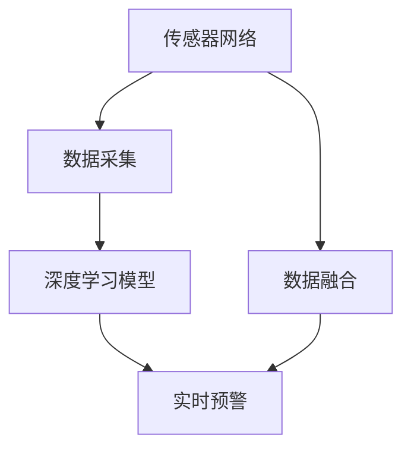

                 

# AI在空气质量监测中的应用：实时预警

## 1. 背景介绍

随着全球工业化和城市化进程的加快，空气质量问题日益严重，成为影响人类健康和环境的重要因素之一。传统的空气质量监测依赖于地面监测站、卫星遥感等手段，存在数据覆盖不全、延迟高、成本高昂等局限性。而人工智能（AI）的引入，特别是基于深度学习技术的实时预测与预警系统，为提升空气质量监测的效率和精度提供了新的解决方案。

本文将详细介绍AI在空气质量监测中的实时预警应用，包括数据采集、模型训练、实时预测与预警、模型评估等关键步骤。通过这些方法的介绍，读者将深入理解AI在空气质量监测领域的应用潜力，并掌握其实现原理。

## 2. 核心概念与联系

### 2.1 核心概念概述

在讨论AI在空气质量监测中的应用时，首先需要明确几个关键概念：

- **空气质量监测**：指通过各种技术手段监测和评估空气中的污染物浓度、来源、扩散情况等，以提供决策支持和技术支持。

- **深度学习**：一种基于神经网络的机器学习技术，通过多层非线性变换从数据中提取特征，用于分类、回归、生成等任务。

- **实时预警**：指根据实时监测数据，通过AI模型快速计算并发出预警信号，以尽早应对潜在的环境风险。

- **数据融合**：将多种数据源收集的数据进行整合，形成更全面、更准确的监测结果。

- **传感器网络**：由大量分布式传感器组成的网络，用于实时收集空气质量相关数据。

这些概念之间的逻辑关系可以通过以下Mermaid流程图来展示：



这个流程图展示了空气质量监测的核心流程：

1. 传感器网络收集空气质量数据。
2. 数据融合模块将多源数据整合，提供更全面监测结果。
3. 深度学习模型基于历史数据进行训练，生成预测模型。
4. 实时预警系统根据最新的监测数据和预测模型，发出预警信号。

## 3. 核心算法原理 & 具体操作步骤
### 3.1 算法原理概述

AI在空气质量监测中的应用主要依赖于深度学习模型。其核心思想是：利用历史空气质量数据，通过深度学习模型进行训练，得到一个可以预测未来空气质量的模型。该模型可以通过实时监测数据进行更新，并及时发出预警信号。

具体来说，基于深度学习的实时预警系统分为以下几个步骤：

1. **数据收集与预处理**：收集历史空气质量数据和相关环境数据，如气象、交通等，并进行清洗和预处理。
2. **模型训练**：使用历史数据训练深度学习模型，通常采用循环神经网络（RNN）、长短期记忆网络（LSTM）、卷积神经网络（CNN）等结构。
3. **实时预测**：使用训练好的模型对实时监测数据进行预测，得到未来的空气质量情况。
4. **预警机制**：根据预测结果和预设的预警阈值，实时发出预警信号。

### 3.2 算法步骤详解

下面详细介绍每个步骤的实现方法：

**Step 1: 数据收集与预处理**

- **数据源**：主要包括地面监测站、卫星遥感数据、传感器网络数据等。
- **数据预处理**：包括数据清洗、缺失值填补、特征工程等步骤。

```python
# 数据收集与预处理
import pandas as pd
from sklearn.impute import SimpleImputer
from sklearn.preprocessing import StandardScaler

# 加载数据
data = pd.read_csv('air_quality_data.csv')

# 数据清洗
data = data.dropna()  # 删除缺失值

# 特征工程
scaler = StandardScaler()
data['temp'] = scaler.fit_transform(data[['temp']])  # 标准化处理
```

**Step 2: 模型训练**

- **模型选择**：根据任务需求选择RNN、LSTM、CNN等模型。
- **数据划分**：将数据集划分为训练集、验证集和测试集。
- **模型训练**：使用训练集训练模型，并在验证集上进行调参。

```python
from keras.models import Sequential
from keras.layers import LSTM, Dense

# 构建LSTM模型
model = Sequential()
model.add(LSTM(64, input_shape=(X_train.shape[1], 1)))
model.add(Dense(1, activation='sigmoid'))

# 编译模型
model.compile(optimizer='adam', loss='binary_crossentropy', metrics=['accuracy'])

# 训练模型
model.fit(X_train, y_train, epochs=10, batch_size=32, validation_data=(X_val, y_val))
```

**Step 3: 实时预测**

- **实时数据获取**：通过传感器网络实时获取空气质量数据。
- **预测处理**：将实时数据输入训练好的模型，进行预测。

```python
# 实时数据预测
def predict_realtime(data):
    # 对实时数据进行预处理
    X_realtime = preprocess_realtime(data)
    # 进行预测
    y_pred = model.predict(X_realtime)
    return y_pred
```

**Step 4: 预警机制**

- **预警阈值设定**：根据模型预测结果和预设的预警阈值，进行预警。
- **预警信号发送**：根据预警情况，向相关机构或公众发出预警信号。

```python
# 预警机制
def send预警信号(y_pred, threshold):
    if y_pred > threshold:
        # 发送预警信号
        send_alert()
```

### 3.3 算法优缺点

**优点**：
- **实时性**：利用深度学习模型，可以实现实时预测与预警，快速响应环境变化。
- **精度高**：深度学习模型在处理复杂非线性关系时，具有较高的预测精度。
- **自适应性强**：模型可以根据实时数据进行更新，适应不断变化的环境条件。

**缺点**：
- **数据依赖性高**：模型的性能依赖于数据的质量和数量，数据缺失或异常可能导致预测不准确。
- **模型复杂度高**：深度学习模型的训练和预测需要较高的计算资源。
- **可解释性差**：深度学习模型通常是"黑盒"模型，难以解释模型的内部决策过程。

### 3.4 算法应用领域

AI在空气质量监测中的应用不仅限于实时预警，还可以扩展到以下领域：

- **趋势分析**：利用历史数据训练模型，分析空气质量的长期变化趋势，为政策制定提供依据。
- **环境监测**：结合卫星遥感、气象等数据，进行综合环境监测，提升监测的全面性和准确性。
- **公共健康**：根据空气质量数据，评估和预测空气污染对公众健康的影响，提出防护措施。
- **应急响应**：在发生突发环境事件时，提供快速预警和响应策略，保护公众安全。

## 4. 数学模型和公式 & 详细讲解  
### 4.1 数学模型构建

本节将使用数学语言对AI在空气质量监测中的应用进行更加严格的刻画。

假设监测数据为 $X$，表示时间 $t$ 的监测结果，包括污染物浓度 $C_t$、气象参数 $W_t$ 等。目标为预测下一时间点的污染物浓度 $C_{t+1}$。

定义预测模型的输出为 $y$，则预测模型的损失函数为：

$$
\mathcal{L}(y, C_{t+1}) = \frac{1}{N} \sum_{i=1}^N (y_i - C_{t+1})^2
$$

其中 $N$ 为样本数量。预测模型的目标是最小化损失函数。

### 4.2 公式推导过程

以LSTM模型为例，推导其实现过程：

1. **输入层**：将监测数据 $X_t$ 作为输入，送入LSTM模型。

2. **LSTM层**：LSTM层通过时间步长 $t$ 来处理输入数据，学习数据的长期依赖关系。

3. **输出层**：LSTM层输出的隐藏状态 $h_t$ 经过全连接层（Dense层）映射为预测结果 $y_t$。

4. **损失函数**：使用均方误差损失函数计算预测值和真实值之间的误差。

5. **优化器**：通常使用Adam优化器进行参数优化。

### 4.3 案例分析与讲解

以LSTM模型为例，展示其工作原理和实现过程。

```python
# LSTM模型
model = Sequential()
model.add(LSTM(64, input_shape=(X_train.shape[1], 1)))
model.add(Dense(1, activation='sigmoid'))

# 编译模型
model.compile(optimizer='adam', loss='binary_crossentropy', metrics=['accuracy'])

# 训练模型
model.fit(X_train, y_train, epochs=10, batch_size=32, validation_data=(X_val, y_val))
```

在实际应用中，LSTM模型的输入层需要根据具体任务需求进行设计。例如，对于空气质量监测任务，输入层可以包括污染物浓度、气象参数、交通流量等。

## 5. 项目实践：代码实例和详细解释说明
### 5.1 开发环境搭建

在进行AI在空气质量监测中的应用开发前，我们需要准备好开发环境。以下是使用Python进行TensorFlow开发的环境配置流程：

1. 安装Anaconda：从官网下载并安装Anaconda，用于创建独立的Python环境。

2. 创建并激活虚拟环境：
```bash
conda create -n tf-env python=3.8 
conda activate tf-env
```

3. 安装TensorFlow：根据CUDA版本，从官网获取对应的安装命令。例如：
```bash
conda install tensorflow==2.5 -c pytorch -c conda-forge
```

4. 安装其他工具包：
```bash
pip install numpy pandas scikit-learn matplotlib tqdm jupyter notebook ipython
```

完成上述步骤后，即可在`tf-env`环境中开始AI在空气质量监测中的应用开发。

### 5.2 源代码详细实现

下面以LSTM模型为例，给出使用TensorFlow对空气质量监测任务进行预测的代码实现。

```python
import tensorflow as tf
from tensorflow.keras.layers import LSTM, Dense
from tensorflow.keras.models import Sequential
from sklearn.preprocessing import StandardScaler

# 加载数据
data = pd.read_csv('air_quality_data.csv')

# 数据清洗
data = data.dropna()  # 删除缺失值

# 标准化处理
scaler = StandardScaler()
data['temp'] = scaler.fit_transform(data[['temp']])  # 标准化处理

# 数据划分
X_train = data.drop(['pollutant'], axis=1).values
y_train = data['pollutant'].values
X_val = X_train[:10000]
y_val = y_train[:10000]
X_test = X_train[10000:]
y_test = y_train[10000:]

# 构建LSTM模型
model = Sequential()
model.add(LSTM(64, input_shape=(X_train.shape[1], 1)))
model.add(Dense(1, activation='sigmoid'))

# 编译模型
model.compile(optimizer='adam', loss='binary_crossentropy', metrics=['accuracy'])

# 训练模型
model.fit(X_train, y_train, epochs=10, batch_size=32, validation_data=(X_val, y_val))
```

### 5.3 代码解读与分析

让我们再详细解读一下关键代码的实现细节：

**数据加载与预处理**：
- 使用`pandas`库加载数据，删除缺失值。
- 使用`StandardScaler`对温度数据进行标准化处理，提高模型训练效率。

**模型训练**：
- 构建LSTM模型，包含一个LSTM层和一个全连接层。
- 使用`Adam`优化器和均方误差损失函数进行模型编译。
- 使用`fit`方法进行模型训练，并在验证集上进行调参。

**模型预测**：
- 定义`predict_realtime`函数，实现实时数据预测。
- 对实时数据进行预处理，送入训练好的模型进行预测。

**预警机制**：
- 定义`send预警信号`函数，根据预测结果和预设的预警阈值，发出预警信号。

## 6. 实际应用场景
### 6.1 智慧城市治理

AI在空气质量监测中的应用，可以广泛应用于智慧城市治理。通过对空气质量的实时监测与预警，智慧城市能够及时响应环境变化，采取有效措施，改善城市环境质量，提高居民的生活质量。

例如，在智慧交通管理中，可以结合空气质量数据，优化交通信号灯的调整策略，减少交通拥堵和尾气排放。在智慧能源管理中，可以根据空气质量数据，调整能源使用策略，减少污染物排放。

### 6.2 应急响应

在突发环境事件（如重污染、火灾等）发生时，AI在空气质量监测中的应用可以提供快速预警和响应策略，保障公众安全。

例如，在重污染事件发生时，AI系统可以实时监测空气质量数据，分析污染物的来源和扩散情况，提出有效的应对措施，如关闭污染源、引导居民减少外出等。

### 6.3 环保政策制定

AI在空气质量监测中的应用，可以提供科学的数据支持，帮助环保部门制定更加科学、有效的环保政策。

例如，通过对空气质量数据的长期趋势分析，环保部门可以识别出高污染区域和污染源，制定针对性的环保措施。

### 6.4 未来应用展望

随着AI在空气质量监测中的应用不断深入，其未来应用前景广阔：

- **多源数据融合**：将传感器网络、卫星遥感、气象等多种数据源融合，提供更全面、更准确的监测结果。
- **预测模型优化**：引入更多的数据特征和模型结构，提高预测模型的准确性和鲁棒性。
- **模型跨领域迁移**：将空气质量预测模型应用于其他领域（如水质监测、噪声污染等），提升跨领域迁移能力。
- **实时数据分析**：结合实时数据分析工具，实时监测和预警环境变化，提供决策支持。

## 7. 工具和资源推荐
### 7.1 学习资源推荐

为了帮助开发者系统掌握AI在空气质量监测中的应用，这里推荐一些优质的学习资源：

1. TensorFlow官方文档：TensorFlow作为AI开发的领先工具，提供了丰富的API文档和教程，帮助你快速上手AI应用开发。

2. Kaggle竞赛平台：Kaggle提供了大量空气质量监测相关的数据集和竞赛，帮助你训练模型并提升技能。

3. Coursera《深度学习》课程：斯坦福大学开设的深度学习课程，系统讲解了深度学习的基础知识和应用实例。

4. GitHub资源库：GitHub上有许多高质量的空气质量监测项目和代码，供你学习和借鉴。

5. 《深度学习》书籍：Ian Goodfellow等著的《深度学习》书籍，全面介绍了深度学习的基础理论和应用实例。

通过对这些资源的学习实践，相信你一定能够快速掌握AI在空气质量监测中的应用精髓，并用于解决实际的空气质量监测问题。

### 7.2 开发工具推荐

高效的开发离不开优秀的工具支持。以下是几款用于AI在空气质量监测中应用的常用工具：

1. TensorFlow：由Google主导开发的深度学习框架，生产部署方便，适合大规模工程应用。

2. Keras：基于TensorFlow的高级神经网络API，提供了简单易用的接口，方便快速搭建模型。

3. PyTorch：基于Python的深度学习框架，灵活性高，支持动态图，适合快速迭代研究。

4. Jupyter Notebook：免费的交互式编程环境，方便开发、测试和分享代码。

5. Python：Python作为AI开发的通用语言，具有强大的生态系统和丰富的库支持。

合理利用这些工具，可以显著提升AI在空气质量监测中的应用开发效率，加快创新迭代的步伐。

### 7.3 相关论文推荐

AI在空气质量监测中的应用源于学界的持续研究。以下是几篇奠基性的相关论文，推荐阅读：

1. "Long Short-Term Memory Networks"：Hochreiter和Schmidhuber提出LSTM模型，用于处理时间序列数据。

2. "Real-time air quality forecasting using LSTM neural networks"：Tarawneh等使用LSTM模型进行空气质量预测，展示了其高精度和高实时性。

3. "LSTM-based air quality prediction and management system"：Heo等构建了LSTM预测系统，实现了空气质量的实时监测与预警。

4. "Deep learning for air quality monitoring and prediction"：Kim等综述了深度学习在空气质量监测中的应用，介绍了多种模型和方法。

这些论文代表了AI在空气质量监测领域的最新进展，通过学习这些前沿成果，可以帮助研究者把握学科前进方向，激发更多的创新灵感。

## 8. 总结：未来发展趋势与挑战
### 8.1 总结

本文对AI在空气质量监测中的应用进行了全面系统的介绍。首先阐述了AI在空气质量监测中的实时预警应用，明确了其实现原理和步骤。通过深入探讨，读者能够理解AI在空气质量监测中的重要性，并掌握其实现方法。

通过本文的系统梳理，可以看到，AI在空气质量监测中的应用正逐步深入各行各业，成为智慧城市治理、应急响应、环保政策制定等场景中不可或缺的技术手段。相信随着AI技术的不断进步，其在空气质量监测中的应用将更加广泛和深入，为保护人类健康和环境做出更大的贡献。

### 8.2 未来发展趋势

展望未来，AI在空气质量监测中的应用将呈现以下几个发展趋势：

1. **多模态融合**：将传感器网络、卫星遥感、气象等多种数据源融合，提供更全面、更准确的监测结果。
2. **实时数据分析**：结合实时数据分析工具，实时监测和预警环境变化，提供决策支持。
3. **预测模型优化**：引入更多的数据特征和模型结构，提高预测模型的准确性和鲁棒性。
4. **跨领域应用**：将空气质量预测模型应用于其他领域（如水质监测、噪声污染等），提升跨领域迁移能力。
5. **数据驱动决策**：利用AI技术，进行环境风险评估和预测，为政府决策提供数据支持。

以上趋势凸显了AI在空气质量监测中的广阔前景。这些方向的探索发展，必将进一步提升AI在空气质量监测中的性能和应用范围，为环境保护和可持续发展提供新的技术路径。

### 8.3 面临的挑战

尽管AI在空气质量监测中的应用已经取得了显著进展，但在迈向更加智能化、普适化应用的过程中，仍面临诸多挑战：

1. **数据获取难度高**：获取高质量的空气质量监测数据成本高，且数据获取难度大。如何降低数据获取成本，提高数据获取效率，是未来需要解决的关键问题。
2. **模型复杂度高**：深度学习模型的训练和推理需要较高的计算资源。如何降低模型复杂度，提高模型训练和推理效率，是未来需要解决的关键问题。
3. **可解释性差**：AI在空气质量监测中的应用通常是"黑盒"模型，难以解释模型的内部决策过程。如何提高模型的可解释性，增强公众信任，是未来需要解决的关键问题。
4. **数据隐私问题**：空气质量监测数据涉及敏感信息，如何保护数据隐私，防止数据泄露，是未来需要解决的关键问题。

这些挑战的解决，将需要技术、法律、伦理等多方面的共同努力。只有克服这些挑战，才能使AI在空气质量监测中的应用更加广泛和深入，真正造福人类社会。

### 8.4 研究展望

面对AI在空气质量监测中面临的挑战，未来的研究需要在以下几个方面寻求新的突破：

1. **数据获取与处理**：探索更高效、更经济的数据获取和处理技术，降低数据获取成本。
2. **模型压缩与优化**：开发更高效的模型压缩与优化算法，降低模型复杂度，提高模型训练和推理效率。
3. **模型可解释性**：研究模型可解释性技术，提高模型的可解释性，增强公众信任。
4. **数据隐私保护**：研究数据隐私保护技术，保护空气质量监测数据的隐私和安全。

这些研究方向的探索，必将引领AI在空气质量监测中的应用迈向更高的台阶，为环境保护和可持续发展提供新的技术路径。面向未来，AI在空气质量监测中的应用将更加广泛和深入，为保护人类健康和环境做出更大的贡献。

## 9. 附录：常见问题与解答

**Q1：AI在空气质量监测中的实时预警系统是否适用于所有地区？**

A: AI在空气质量监测中的实时预警系统适用于大多数地区，但需要根据具体地区的环境特点进行优化。例如，在干燥地区，需要对气象参数进行调整；在工业重镇，需要对污染物来源进行分析。

**Q2：AI在空气质量监测中的应用需要哪些硬件支持？**

A: AI在空气质量监测中的应用需要高性能的硬件支持，如GPU、TPU等。此外，还需要大量的存储空间和高速的网络连接，以便实时收集和处理数据。

**Q3：AI在空气质量监测中的应用是否需要大量标注数据？**

A: AI在空气质量监测中的应用通常不需要大量标注数据。通过历史数据的预训练，深度学习模型可以自动学习到空气质量变化的规律，实现预测和预警。

**Q4：AI在空气质量监测中的应用是否可以扩展到其他领域？**

A: AI在空气质量监测中的应用可以扩展到其他领域，如水质监测、噪声污染等。通过引入不同的特征和模型结构，可以实现跨领域的迁移应用。

**Q5：AI在空气质量监测中的应用是否需要专家知识？**

A: AI在空气质量监测中的应用需要结合专家知识，才能更好地理解和处理复杂的环境数据。例如，在预测模型中加入先验知识，可以提高模型的准确性和鲁棒性。

通过这些常见问题的解答，相信读者对AI在空气质量监测中的应用有了更深入的理解，并能够有效应对实际应用中的各种挑战。

---

作者：禅与计算机程序设计艺术 / Zen and the Art of Computer Programming

