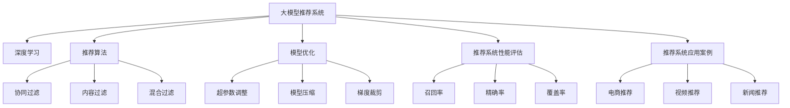

                 

# 面向不同推荐场景的大模型应用部署拆解与优化

> 关键词：大模型推荐系统，推荐算法，深度学习，模型优化，推荐系统性能评估，推荐系统应用案例，推荐系统部署架构

## 1. 背景介绍

在当今数据驱动的互联网时代，推荐系统已经成为各大电商、视频、音乐、社交平台的核心功能之一。推荐系统不仅能够为用户提供个性化的内容推荐，还能显著提升平台的转化率和用户留存率。然而，随着用户行为和数据特征的多样化，传统的推荐算法逐渐暴露出性能瓶颈，难以满足日益复杂的推荐需求。

为应对这一挑战，近年来，基于大模型的推荐系统引起了广泛关注。其核心思想是利用预训练语言模型对用户行为进行编码，再通过微调学习用户偏好，从而生成个性化推荐。这种基于大模型的推荐方法，具有更强的泛化能力和适应性，能快速适应新的推荐场景，同时具有更好的稳定性和可解释性。

本文将从实际应用的角度，详细剖析面向不同推荐场景的大模型应用部署，并探讨优化策略，以期为推荐系统的开发者和实践者提供全面的指导。

## 2. 核心概念与联系

### 2.1 核心概念概述

为更好地理解面向不同推荐场景的大模型应用，本节将介绍几个密切相关的核心概念：

- 大模型推荐系统：利用预训练语言模型对用户行为进行编码，通过微调学习用户偏好，从而生成个性化推荐的方法。相较于传统推荐算法，大模型推荐系统具有更强的泛化能力和适应性，能够处理更加复杂和多样化的推荐任务。

- 推荐算法：指用于计算用户和物品之间相似性或关系，从而生成推荐结果的算法。常见的推荐算法包括基于协同过滤、内容过滤、混合过滤等方法。

- 深度学习：利用多层神经网络进行特征学习和模式识别，解决推荐系统中的推荐问题。深度学习在大模型推荐系统中得到了广泛应用，通过利用海量的用户行为数据，学习复杂的用户-物品交互关系。

- 模型优化：指对大模型推荐系统中的关键参数进行微调，以提升模型性能和推荐效果的过程。优化的方法包括超参数调整、模型压缩、梯度裁剪等。

- 推荐系统性能评估：指通过一系列指标评估推荐系统的效果和性能，如召回率、精确率、覆盖率等。性能评估是优化推荐系统的重要手段，帮助开发者发现问题并进行改进。

- 推荐系统应用案例：具体应用场景中推荐系统的实现与优化，如电商推荐、视频推荐、新闻推荐等。

这些核心概念之间的逻辑关系可以通过以下Mermaid流程图来展示：



这个流程图展示了大模型推荐系统的核心概念及其之间的关系：

1. 大模型推荐系统通过深度学习模型对用户行为进行编码，再通过微调学习用户偏好。
2. 深度学习包括协同过滤、内容过滤、混合过滤等多种推荐算法。
3. 模型优化包括超参数调整、模型压缩、梯度裁剪等手段，以提升模型性能。
4. 推荐系统性能评估通过召回率、精确率、覆盖率等指标进行评估。
5. 实际应用中，推荐系统可以应用于电商推荐、视频推荐、新闻推荐等多种场景。

这些核心概念共同构成了大模型推荐系统的学习和应用框架，使其能够在各种场景下发挥强大的推荐能力。通过理解这些核心概念，我们可以更好地把握大模型推荐系统的工作原理和优化方向。

## 3. 核心算法原理 & 具体操作步骤

### 3.1 算法原理概述

面向不同推荐场景的大模型推荐系统，其核心思想是利用预训练语言模型对用户行为进行编码，再通过微调学习用户偏好，从而生成个性化推荐。具体而言，包括以下几个步骤：

1. 预训练：利用大规模无标签数据对语言模型进行预训练，学习丰富的语言知识和用户行为模式。
2. 微调：针对具体推荐任务，收集少量标注数据，对预训练模型进行微调，学习用户对特定物品的偏好。
3. 生成推荐：根据微调后的模型，对用户输入的查询生成个性化推荐列表。

形式化地，设推荐系统输入为 $x$，输出为 $y$，其中 $x$ 为用户的查询或行为数据，$y$ 为系统生成的推荐结果。大模型推荐系统的目标是最小化预测值 $y$ 与真实值 $y'$ 的差异，即：

$$
\min_{\theta} \mathcal{L}(\theta) = \frac{1}{N} \sum_{i=1}^N \ell(y_i, y'_i)
$$

其中 $\ell$ 为损失函数，$\theta$ 为模型参数。常用的损失函数包括均方误差、交叉熵等。

### 3.2 算法步骤详解

面向不同推荐场景的大模型推荐系统主要包括以下几个关键步骤：

**Step 1: 准备预训练模型和数据集**
- 选择合适的预训练语言模型 $M_{\theta}$，如BERT、GPT等。
- 准备推荐任务的数据集 $D=\{(x_i, y_i)\}_{i=1}^N$，划分为训练集、验证集和测试集。一般要求标注数据与预训练数据的分布不要差异过大。

**Step 2: 添加任务适配层**
- 根据推荐任务类型，在预训练模型顶层设计合适的输出层和损失函数。
- 对于评分任务，通常在顶层添加线性分类器和交叉熵损失函数。
- 对于排序任务，通常使用排序损失函数，如Pairwise Loss、Triplet Loss等。

**Step 3: 设置微调超参数**
- 选择合适的优化算法及其参数，如 AdamW、SGD 等，设置学习率、批大小、迭代轮数等。
- 设置正则化技术及强度，包括权重衰减、Dropout、Early Stopping 等。
- 确定冻结预训练参数的策略，如仅微调顶层，或全部参数都参与微调。

**Step 4: 执行梯度训练**
- 将训练集数据分批次输入模型，前向传播计算损失函数。
- 反向传播计算参数梯度，根据设定的优化算法和学习率更新模型参数。
- 周期性在验证集上评估模型性能，根据性能指标决定是否触发 Early Stopping。
- 重复上述步骤直到满足预设的迭代轮数或 Early Stopping 条件。

**Step 5: 测试和部署**
- 在测试集上评估微调后模型 $M_{\hat{\theta}}$ 的性能，对比微调前后的效果提升。
- 使用微调后的模型对新样本进行推理预测，集成到实际的应用系统中。
- 持续收集新的数据，定期重新微调模型，以适应数据分布的变化。

以上是面向不同推荐场景的大模型推荐系统的一般流程。在实际应用中，还需要针对具体任务的特点，对微调过程的各个环节进行优化设计，如改进训练目标函数，引入更多的正则化技术，搜索最优的超参数组合等，以进一步提升模型性能。

### 3.3 算法优缺点

面向不同推荐场景的大模型推荐系统具有以下优点：
1. 泛化能力强。基于预训练语言模型的推荐系统能够处理更加复杂和多样化的推荐任务。
2. 适应性强。模型可以通过微调快速适应新的推荐场景，同时具有更好的稳定性和可解释性。
3. 预测准确度高。深度学习模型能够学习到丰富的用户行为模式，生成更加准确的推荐结果。
4. 可解释性好。模型通过可解释的特征向量表示用户行为，使得推荐过程更加透明。

同时，该方法也存在一些局限性：
1. 数据依赖性强。微调效果很大程度上取决于标注数据的质量和数量，获取高质量标注数据的成本较高。
2. 计算资源消耗大。预训练语言模型参数量巨大，需要高性能硬件设备支持。
3. 过拟合风险高。在标注数据不足的情况下，模型容易出现过拟合。
4. 推理速度慢。大规模语言模型推理速度较慢，难以实时满足推荐需求。

尽管存在这些局限性，但就目前而言，面向不同推荐场景的大模型推荐系统仍是最主流和有效的推荐方法之一。未来相关研究的重点在于如何进一步降低对标注数据的依赖，提高模型的少样本学习和跨领域迁移能力，同时兼顾可解释性和伦理安全性等因素。

### 3.4 算法应用领域

面向不同推荐场景的大模型推荐系统已经在电商、视频、音乐、新闻等多个领域得到广泛应用，具体如下：

- **电商推荐**：推荐系统中，商品推荐是核心功能之一。基于大模型的电商推荐系统，可以通过用户浏览、购买、评论等行为数据，生成个性化的商品推荐。
- **视频推荐**：视频推荐系统能够根据用户观看历史、评分等数据，生成个性化视频推荐。大模型推荐系统能够学习到更加复杂的用户兴趣模式，提高推荐的精准度。
- **音乐推荐**：音乐推荐系统需要根据用户听歌历史、评分等数据，生成个性化音乐推荐。大模型推荐系统能够更好地捕捉用户的多样化音乐偏好。
- **新闻推荐**：新闻推荐系统需要根据用户浏览历史、点击量等数据，生成个性化新闻推荐。大模型推荐系统能够学习到用户对不同类型新闻的偏好，提高推荐效果。
- **社交推荐**：社交推荐系统需要根据用户关注、互动等数据，生成个性化社交推荐。大模型推荐系统能够学习到用户之间的社交关系，提高推荐的相关性和多样性。

除了上述这些经典任务外，大模型推荐系统还在广告推荐、商品搭配推荐、个性化视频等场景中发挥重要作用，为推荐系统的开发者和实践者带来了新的突破。

## 4. 数学模型和公式 & 详细讲解

### 4.1 数学模型构建

本节将使用数学语言对面向不同推荐场景的大模型推荐系统进行更加严格的刻画。

设推荐系统输入为 $x$，输出为 $y$，其中 $x$ 为用户的查询或行为数据，$y$ 为系统生成的推荐结果。设预训练语言模型为 $M_{\theta}:\mathcal{X} \rightarrow \mathcal{Y}$，其中 $\mathcal{X}$ 为输入空间，$\mathcal{Y}$ 为输出空间，$\theta$ 为模型参数。假设微调任务的训练集为 $D=\{(x_i,y_i)\}_{i=1}^N, x_i \in \mathcal{X}, y_i \in \mathcal{Y}$。

定义模型 $M_{\theta}$ 在数据样本 $(x,y)$ 上的损失函数为 $\ell(M_{\theta}(x),y)$，则在数据集 $D$ 上的经验风险为：

$$
\mathcal{L}(\theta) = \frac{1}{N} \sum_{i=1}^N \ell(M_{\theta}(x_i),y_i)
$$

微调的优化目标是最小化经验风险，即找到最优参数：

$$
\theta^* = \mathop{\arg\min}_{\theta} \mathcal{L}(\theta)
$$

在实践中，我们通常使用基于梯度的优化算法（如SGD、Adam等）来近似求解上述最优化问题。设 $\eta$ 为学习率，$\lambda$ 为正则化系数，则参数的更新公式为：

$$
\theta \leftarrow \theta - \eta \nabla_{\theta}\mathcal{L}(\theta) - \eta\lambda\theta
$$

其中 $\nabla_{\theta}\mathcal{L}(\theta)$ 为损失函数对参数 $\theta$ 的梯度，可通过反向传播算法高效计算。

### 4.2 公式推导过程

以下我们以评分推荐任务为例，推导交叉熵损失函数及其梯度的计算公式。

假设模型 $M_{\theta}$ 在输入 $x$ 上的输出为 $\hat{y}=M_{\theta}(x) \in [0,1]$，表示样本属于正类的概率。真实评分 $y \in [1,5]$，表示用户对物品的评分。则评分任务的交叉熵损失函数定义为：

$$
\ell(M_{\theta}(x),y) = -y\log \hat{y} - (5-y)\log (1-\hat{y})
$$

将其代入经验风险公式，得：

$$
\mathcal{L}(\theta) = -\frac{1}{N}\sum_{i=1}^N [y_i\log M_{\theta}(x_i)+(5-y_i)\log(1-M_{\theta}(x_i))]
$$

根据链式法则，损失函数对参数 $\theta_k$ 的梯度为：

$$
\frac{\partial \mathcal{L}(\theta)}{\partial \theta_k} = -\frac{1}{N}\sum_{i=1}^N (\frac{y_i}{M_{\theta}(x_i)}-\frac{5-y_i}{1-M_{\theta}(x_i)}) \frac{\partial M_{\theta}(x_i)}{\partial \theta_k}
$$

其中 $\frac{\partial M_{\theta}(x_i)}{\partial \theta_k}$ 可进一步递归展开，利用自动微分技术完成计算。

在得到损失函数的梯度后，即可带入参数更新公式，完成模型的迭代优化。重复上述过程直至收敛，最终得到适应下游任务的最优模型参数 $\theta^*$。

## 5. 项目实践：代码实例和详细解释说明

### 5.1 开发环境搭建

在进行推荐系统开发前，我们需要准备好开发环境。以下是使用Python进行PyTorch开发的环境配置流程：

1. 安装Anaconda：从官网下载并安装Anaconda，用于创建独立的Python环境。

2. 创建并激活虚拟环境：
```bash
conda create -n pytorch-env python=3.8 
conda activate pytorch-env
```

3. 安装PyTorch：根据CUDA版本，从官网获取对应的安装命令。例如：
```bash
conda install pytorch torchvision torchaudio cudatoolkit=11.1 -c pytorch -c conda-forge
```

4. 安装Transformers库：
```bash
pip install transformers
```

5. 安装各类工具包：
```bash
pip install numpy pandas scikit-learn matplotlib tqdm jupyter notebook ipython
```

完成上述步骤后，即可在`pytorch-env`环境中开始推荐系统开发。

### 5.2 源代码详细实现

下面我们以电商推荐系统为例，给出使用Transformers库对BERT模型进行评分推荐微调的PyTorch代码实现。

首先，定义评分推荐任务的数据处理函数：

```python
from transformers import BertTokenizer
from torch.utils.data import Dataset
import torch

class RatingDataset(Dataset):
    def __init__(self, texts, ratings, tokenizer, max_len=128):
        self.texts = texts
        self.ratings = ratings
        self.tokenizer = tokenizer
        self.max_len = max_len
        
    def __len__(self):
        return len(self.texts)
    
    def __getitem__(self, item):
        text = self.texts[item]
        rating = self.ratings[item]
        
        encoding = self.tokenizer(text, return_tensors='pt', max_length=self.max_len, padding='max_length', truncation=True)
        input_ids = encoding['input_ids'][0]
        attention_mask = encoding['attention_mask'][0]
        
        # 将评分转换为数值型标签
        rating = int(rating)
        labels = torch.tensor(rating, dtype=torch.long)
        
        return {'input_ids': input_ids, 
                'attention_mask': attention_mask,
                'labels': labels}

# 创建dataset
tokenizer = BertTokenizer.from_pretrained('bert-base-cased')

train_dataset = RatingDataset(train_texts, train_ratings, tokenizer)
dev_dataset = RatingDataset(dev_texts, dev_ratings, tokenizer)
test_dataset = RatingDataset(test_texts, test_ratings, tokenizer)
```

然后，定义模型和优化器：

```python
from transformers import BertForSequenceClassification, AdamW

model = BertForSequenceClassification.from_pretrained('bert-base-cased', num_labels=5)

optimizer = AdamW(model.parameters(), lr=2e-5)
```

接着，定义训练和评估函数：

```python
from torch.utils.data import DataLoader
from tqdm import tqdm
from sklearn.metrics import mean_squared_error

device = torch.device('cuda') if torch.cuda.is_available() else torch.device('cpu')
model.to(device)

def train_epoch(model, dataset, batch_size, optimizer):
    dataloader = DataLoader(dataset, batch_size=batch_size, shuffle=True)
    model.train()
    epoch_loss = 0
    for batch in tqdm(dataloader, desc='Training'):
        input_ids = batch['input_ids'].to(device)
        attention_mask = batch['attention_mask'].to(device)
        labels = batch['labels'].to(device)
        model.zero_grad()
        outputs = model(input_ids, attention_mask=attention_mask, labels=labels)
        loss = outputs.loss
        epoch_loss += loss.item()
        loss.backward()
        optimizer.step()
    return epoch_loss / len(dataloader)

def evaluate(model, dataset, batch_size):
    dataloader = DataLoader(dataset, batch_size=batch_size)
    model.eval()
    predictions = []
    targets = []
    with torch.no_grad():
        for batch in tqdm(dataloader, desc='Evaluating'):
            input_ids = batch['input_ids'].to(device)
            attention_mask = batch['attention_mask'].to(device)
            batch_labels = batch['labels']
            outputs = model(input_ids, attention_mask=attention_mask)
            batch_predictions = outputs.logits.argmax(dim=1).to('cpu').tolist()
            batch_labels = batch_labels.to('cpu').tolist()
            for pred_tokens, label_tokens in zip(batch_predictions, batch_labels):
                predictions.append(pred_tokens)
                targets.append(label_tokens)
                
    return mean_squared_error(predictions, targets)
```

最后，启动训练流程并在测试集上评估：

```python
epochs = 5
batch_size = 16

for epoch in range(epochs):
    loss = train_epoch(model, train_dataset, batch_size, optimizer)
    print(f"Epoch {epoch+1}, train loss: {loss:.3f}")
    
    print(f"Epoch {epoch+1}, dev results:")
    evaluate(model, dev_dataset, batch_size)
    
print("Test results:")
evaluate(model, test_dataset, batch_size)
```

以上就是使用PyTorch对BERT进行评分推荐任务微调的完整代码实现。可以看到，得益于Transformers库的强大封装，我们可以用相对简洁的代码完成BERT模型的加载和微调。

### 5.3 代码解读与分析

让我们再详细解读一下关键代码的实现细节：

**RatingDataset类**：
- `__init__`方法：初始化文本、评分、分词器等关键组件。
- `__len__`方法：返回数据集的样本数量。
- `__getitem__`方法：对单个样本进行处理，将文本输入编码为token ids，将评分转换为数值型标签，并对其进行定长padding，最终返回模型所需的输入。

**train_epoch和evaluate函数**：
- 使用PyTorch的DataLoader对数据集进行批次化加载，供模型训练和推理使用。
- 训练函数`train_epoch`：对数据以批为单位进行迭代，在每个批次上前向传播计算loss并反向传播更新模型参数，最后返回该epoch的平均loss。
- 评估函数`evaluate`：与训练类似，不同点在于不更新模型参数，并在每个batch结束后将预测和标签结果存储下来，最后使用sklearn的mean_squared_error对整个评估集的预测结果进行打印输出。

**训练流程**：
- 定义总的epoch数和batch size，开始循环迭代
- 每个epoch内，先在训练集上训练，输出平均loss
- 在验证集上评估，输出预测评分与真实评分的均方误差
- 所有epoch结束后，在测试集上评估，给出最终测试结果

可以看到，PyTorch配合Transformers库使得BERT微调的代码实现变得简洁高效。开发者可以将更多精力放在数据处理、模型改进等高层逻辑上，而不必过多关注底层的实现细节。

当然，工业级的系统实现还需考虑更多因素，如模型的保存和部署、超参数的自动搜索、更灵活的任务适配层等。但核心的微调范式基本与此类似。

## 6. 实际应用场景

### 6.1 电商推荐

电商推荐系统是推荐系统的重要应用之一。传统电商推荐往往依赖用户的浏览、购买等行为数据，难以捕捉用户长尾需求和个性化偏好。基于大模型的电商推荐系统，能够更好地理解用户的多样化需求，生成更加个性化和精准的推荐结果。

在技术实现上，可以收集电商平台的商品信息、用户行为数据等，构建评分推荐任务的数据集。将用户对商品进行评分的行为数据作为标注数据，训练模型学习用户对商品的真实评分。在生成推荐结果时，输入用户的查询和浏览记录，使用模型预测推荐商品的评分，并按评分排序生成推荐列表。

### 6.2 视频推荐

视频推荐系统需要根据用户观看历史、评分等数据，生成个性化视频推荐。大模型推荐系统能够学习到更加复杂的用户兴趣模式，提高推荐的精准度。

在技术实现上，可以收集视频平台的用户行为数据，构建评分推荐任务的数据集。将用户对视频的评分数据作为标注数据，训练模型学习用户对视频内容的真实评分。在生成推荐结果时，输入用户的观看历史，使用模型预测推荐视频的评分，并按评分排序生成推荐列表。

### 6.3 音乐推荐

音乐推荐系统需要根据用户听歌历史、评分等数据，生成个性化音乐推荐。大模型推荐系统能够更好地捕捉用户的多样化音乐偏好。

在技术实现上，可以收集音乐平台的用户行为数据，构建评分推荐任务的数据集。将用户对音乐的评分数据作为标注数据，训练模型学习用户对音乐内容的真实评分。在生成推荐结果时，输入用户的听歌历史，使用模型预测推荐音乐的评分，并按评分排序生成推荐列表。

### 6.4 新闻推荐

新闻推荐系统需要根据用户浏览历史、点击量等数据，生成个性化新闻推荐。大模型推荐系统能够学习到用户对不同类型新闻的偏好，提高推荐效果。

在技术实现上，可以收集新闻平台的用户行为数据，构建评分推荐任务的数据集。将用户对新闻的评分数据作为标注数据，训练模型学习用户对新闻内容的真实评分。在生成推荐结果时，输入用户的浏览历史，使用模型预测推荐新闻的评分，并按评分排序生成推荐列表。

### 6.5 社交推荐

社交推荐系统需要根据用户关注、互动等数据，生成个性化社交推荐。大模型推荐系统能够学习到用户之间的社交关系，提高推荐的相关性和多样性。

在技术实现上，可以收集社交平台的用户行为数据，构建评分推荐任务的数据集。将用户对社交内容的评分数据作为标注数据，训练模型学习用户对社交内容的真实评分。在生成推荐结果时，输入用户的社交互动记录，使用模型预测推荐社交内容的评分，并按评分排序生成推荐列表。

### 6.6 未来应用展望

随着大模型推荐系统的不断发展，基于微调范式将在更多领域得到应用，为推荐系统的开发者和实践者带来新的突破。

在智慧医疗领域，基于大模型的医疗推荐系统，可以推荐合适的药物、检查和治疗方案，提升医疗服务的个性化和精准度。

在智能教育领域，大模型推荐系统可以推荐适合学生的学习内容、资源和路径，促进教育公平和效率。

在智慧城市治理中，推荐系统可以推荐合适的公共设施、服务资源和活动安排，提高城市管理和居民生活质量。

此外，在企业生产、社会治理、文娱传媒等众多领域，基于大模型的推荐系统也将不断涌现，为推荐系统的开发者和实践者带来新的挑战和机遇。相信随着技术的日益成熟，大模型推荐系统必将在构建人机协同的智能时代中扮演越来越重要的角色。

## 7. 工具和资源推荐
### 7.1 学习资源推荐

为了帮助开发者系统掌握大模型推荐系统的理论基础和实践技巧，这里推荐一些优质的学习资源：

1. 《Recommender Systems: The Textbook》书籍：详细介绍推荐系统的理论基础、算法设计和应用实践，是推荐系统学习者的必读书籍。
2. 《Introduction to Recommendation Systems》课程：斯坦福大学开设的推荐系统课程，涵盖推荐系统的理论、算法和实践，内容系统全面。
3. KDD、ICML等顶级会议的推荐系统论文：推荐系统领域顶级会议的论文是学习最新进展和技术思路的重要资源。
4. GitHub上的开源推荐系统项目：如RecSys、LightFM等，提供了丰富的推荐系统实现和示例代码，值得深入研究。

通过对这些资源的学习实践，相信你一定能够快速掌握大模型推荐系统的精髓，并用于解决实际的推荐问题。

### 7.2 开发工具推荐

高效的开发离不开优秀的工具支持。以下是几款用于大模型推荐系统开发的常用工具：

1. PyTorch：基于Python的开源深度学习框架，灵活动态的计算图，适合快速迭代研究。大部分预训练语言模型都有PyTorch版本的实现。

2. TensorFlow：由Google主导开发的开源深度学习框架，生产部署方便，适合大规模工程应用。同样有丰富的预训练语言模型资源。

3. Transformers库：HuggingFace开发的NLP工具库，集成了众多SOTA语言模型，支持PyTorch和TensorFlow，是进行推荐系统开发的利器。

4. Weights & Biases：模型训练的实验跟踪工具，可以记录和可视化模型训练过程中的各项指标，方便对比和调优。与主流深度学习框架无缝集成。

5. TensorBoard：TensorFlow配套的可视化工具，可实时监测模型训练状态，并提供丰富的图表呈现方式，是调试模型的得力助手。

6. Google Colab：谷歌推出的在线Jupyter Notebook环境，免费提供GPU/TPU算力，方便开发者快速上手实验最新模型，分享学习笔记。

合理利用这些工具，可以显著提升大模型推荐系统的开发效率，加快创新迭代的步伐。

### 7.3 相关论文推荐

大模型推荐系统的发展源于学界的持续研究。以下是几篇奠基性的相关论文，推荐阅读：

1. Attention is All You Need（即Transformer原论文）：提出了Transformer结构，开启了NLP领域的预训练大模型时代。

2. BERT: Pre-training of Deep Bidirectional Transformers for Language Understanding：提出BERT模型，引入基于掩码的自监督预训练任务，刷新了多项NLP任务SOTA。

3. Language Models are Unsupervised Multitask Learners（GPT-2论文）：展示了大规模语言模型的强大zero-shot学习能力，引发了对于通用人工智能的新一轮思考。

4. Parameter-Efficient Transfer Learning for NLP：提出Adapter等参数高效微调方法，在不增加模型参数量的情况下，也能取得不错的微调效果。

5. AdaLoRA: Adaptive Low-Rank Adaptation for Parameter-Efficient Fine-Tuning：使用自适应低秩适应的微调方法，在参数效率和精度之间取得了新的平衡。

6. Self-Attention for Recommendation Systems：提出使用自注意力机制进行推荐系统建模，提升推荐效果。

这些论文代表了大模型推荐系统的发展脉络。通过学习这些前沿成果，可以帮助研究者把握学科前进方向，激发更多的创新灵感。

## 8. 总结：未来发展趋势与挑战

### 8.1 总结

本文对面向不同推荐场景的大模型推荐系统进行了全面系统的介绍。首先阐述了大模型推荐系统的研究背景和意义，明确了微调在拓展预训练模型应用、提升推荐效果方面的独特价值。其次，从原理到实践，详细讲解了推荐系统的数学原理和关键步骤，给出了推荐系统开发的完整代码实例。同时，本文还广泛探讨了推荐系统在电商、视频、音乐、新闻等多个领域的应用前景，展示了微调范式的巨大潜力。此外，本文精选了推荐系统的各类学习资源，力求为开发者和实践者提供全方位的技术指引。

通过本文的系统梳理，可以看到，基于大模型的推荐系统正在成为推荐系统的主流范式，极大地拓展了预训练语言模型的应用边界，催生了更多的落地场景。得益于大规模语料的预训练，推荐系统在用户行为编码和模型微调方面具备更强的泛化能力和适应性，能够处理更加复杂和多样化的推荐任务。未来，伴随预训练语言模型和微调方法的持续演进，相信推荐系统必将在更广阔的应用领域大放异彩，深刻影响用户的购物、娱乐、学习等行为。

### 8.2 未来发展趋势

展望未来，大模型推荐系统的发展趋势如下：

1. 模型规模持续增大。随着算力成本的下降和数据规模的扩张，预训练语言模型参数量还将持续增长。超大规模语言模型蕴含的丰富语言知识，有望支撑更加复杂多变的推荐任务。

2. 推荐方法日趋多样。除了传统的评分推荐、排序推荐等方法，未来会涌现更多基于大模型的推荐方法，如协同过滤、内容过滤、混合过滤等。

3. 推荐系统性能评估体系不断完善。未来会引入更多推荐系统性能评估指标，如多任务学习、多目标优化等，以全面评估推荐系统的表现。

4. 推荐系统应用领域不断扩展。除了电商、视频、音乐、新闻等传统领域，大模型推荐系统将在更多场景中得到应用，如智慧医疗、智能教育、智慧城市等。

5. 推荐系统协同优化技术发展。未来会结合用户画像、社交网络、时间序列等多维数据，综合优化推荐系统的效果和性能。

6. 推荐系统部署架构不断优化。未来会引入模型压缩、联邦学习、边缘计算等技术，提高推荐系统的实时性和灵活性。

7. 推荐系统用户体验不断提升。未来会结合交互设计、个性化推荐、推荐反馈等手段，提升推荐系统的人机交互体验。

以上趋势凸显了大模型推荐系统的广阔前景。这些方向的探索发展，必将进一步提升推荐系统的性能和应用范围，为推荐系统的开发者和实践者带来新的突破。

### 8.3 面临的挑战

尽管大模型推荐系统已经取得了瞩目成就，但在迈向更加智能化、普适化应用的过程中，它仍面临着诸多挑战：

1. 数据依赖性强。微调效果很大程度上取决于标注数据的质量和数量，获取高质量标注数据的成本较高。如何进一步降低微调对标注数据的依赖，将是一大难题。

2. 计算资源消耗大。预训练语言模型参数量巨大，需要高性能硬件设备支持。如何在有限的计算资源下高效训练模型，是推荐系统面临的挑战。

3. 推荐结果偏差大。基于大模型的推荐系统可能受到训练数据偏差的影响，产生不符合用户期望的推荐结果。如何提高推荐结果的公正性和公平性，仍需进一步研究。

4. 推荐系统可解释性不足。当前推荐系统更像一个黑盒系统，难以解释其内部工作机制和决策逻辑。如何赋予推荐系统更强的可解释性，将是亟待攻克的难题。

5. 推荐系统安全性有待保障。大模型推荐系统可能学习到有偏见、有害的信息，产生误导性、歧视性的推荐结果。如何从数据和算法层面消除模型偏见，避免恶意用途，确保输出的安全性，也将是重要的研究课题。

6. 推荐系统用户体验不够理想。尽管推荐系统已经取得了显著效果，但在实时性、个性化、多样性等方面仍需不断优化，以提升用户体验。

正视推荐系统面临的这些挑战，积极应对并寻求突破，将是大模型推荐系统迈向成熟的必由之路。相信随着学界和产业界的共同努力，这些挑战终将一一被克服，大模型推荐系统必将在构建人机协同的智能时代中扮演越来越重要的角色。

### 8.4 研究展望

面对大模型推荐系统所面临的种种挑战，未来的研究需要在以下几个方面寻求新的突破：

1. 探索无监督和半监督推荐方法。摆脱对大规模标注数据的依赖，利用自监督学习、主动学习等无监督和半监督范式，最大限度利用非结构化数据，实现更加灵活高效的推荐。

2. 研究推荐系统协同优化方法。结合用户画像、社交网络、时间序列等多维数据，综合优化推荐系统的效果和性能。

3. 引入更多先验知识。将符号化的先验知识，如知识图谱、逻辑规则等，与神经网络模型进行巧妙融合，引导推荐过程学习更准确、合理的用户-物品关系。

4. 结合因果分析和博弈论工具。将因果分析方法引入推荐系统，识别出推荐结果的关键特征，增强推荐过程的因果性和逻辑性。借助博弈论工具刻画人机交互过程，主动探索并规避推荐的脆弱点，提高系统稳定性。

5. 纳入伦理道德约束。在推荐系统设计目标中引入伦理导向的评估指标，过滤和惩罚有偏见、有害的推荐结果。同时加强人工干预和审核，建立推荐行为的监管机制，确保推荐内容符合人类价值观和伦理道德。

6. 结合增强学习技术。通过增强学习技术，训练推荐模型在动态环境中做出最优决策，提升推荐系统的实时性和灵活性。

这些研究方向的探索，必将引领大模型推荐系统走向更高的台阶，为推荐系统的开发者和实践者带来新的突破。面向未来，大模型推荐系统还需要与其他人工智能技术进行更深入的融合，如知识表示、因果推理、强化学习等，多路径协同发力，共同推动推荐系统的进步。只有勇于创新、敢于突破，才能不断拓展推荐系统的边界，让推荐系统更好地造福人类社会。

## 9. 附录：常见问题与解答

**Q1：大模型推荐系统是否适用于所有推荐任务？**

A: 大模型推荐系统在大多数推荐任务上都能取得不错的效果，特别是对于数据量较小的任务。但对于一些特定领域的任务，如医学、法律等，仅仅依靠通用语料预训练的模型可能难以很好地适应。此时需要在特定领域语料上进一步预训练，再进行微调，才能获得理想效果。此外，对于一些需要时效性、个性化很强的任务，如对话、推荐等，微调方法也需要针对性的改进优化。

**Q2：如何选择合适的推荐算法？**

A: 选择合适的推荐算法需要综合考虑任务类型、数据规模、资源限制等多个因素。一般来说，对于数据量较大的评分推荐任务，可以使用协同过滤或内容过滤等基于矩阵分解的算法。对于数据量较小或动态变化的推荐任务，可以使用基于深度学习的评分推荐或排序推荐算法。此外，对于一些多目标优化任务，可以使用混合过滤算法，结合多种推荐方法的优势。

**Q3：推荐系统如何优化模型性能？**

A: 推荐系统的模型优化可以通过以下手段：
1. 超参数调整：通过调参确定最优的模型参数，如学习率、批大小等。
2. 模型压缩：通过剪枝、量化等方法，减小模型尺寸，加快推理速度。
3. 梯度裁剪：通过限制梯度的范数，避免梯度爆炸或消失。
4. 正则化：通过L1、L2正则化等方法，防止模型过拟合。
5. 特征选择：通过特征选择方法，去除冗余特征，提高模型泛化能力。
6. 对抗训练：通过加入对抗样本，提高模型的鲁棒性。

这些优化手段需要根据具体任务和数据特点进行灵活组合，才能最大限度地提高推荐系统的效果。

**Q4：推荐系统如何提高推荐结果的公正性和公平性？**

A: 提高推荐结果的公正性和公平性需要从数据和算法两个层面进行改进：
1. 数据层面：收集更加多样化的数据，避免数据偏见。
2. 算法层面：引入公平性约束，如消除偏差、权重调整等方法，确保推荐结果对所有用户和物品都是公平的。

此外，还可以结合用户反馈，动态调整推荐策略，提升推荐系统的公平性和公正性。

**Q5：推荐系统如何提高推荐结果的可解释性？**

A: 提高推荐结果的可解释性需要从模型设计和解释方法两个层面进行改进：
1. 模型设计：设计可解释性较强的模型，如基于规则的推荐系统、基于符号化的推荐模型等。
2. 解释方法：使用解释技术，如特征重要性分析、模型可视化等方法，帮助用户理解推荐结果的来源。

这些手段需要结合具体的推荐任务进行灵活选择，才能提高推荐系统的可解释性。

**Q6：推荐系统如何提高推荐结果的实时性？**

A: 提高推荐结果的实时性需要从模型架构和部署架构两个层面进行改进：
1. 模型架构：设计轻量级、高效的模型，如使用参数高效微调、模型压缩等方法，减小模型尺寸，加快推理速度。
2. 部署架构：使用分布式训练、联邦学习等技术，提高推荐系统的实时性和灵活性。

这些改进手段需要根据具体的推荐场景进行灵活选择，才能实现高效、实时的推荐。

