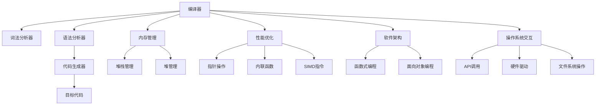

                 

# 高级编程：C 语言的力量

> 关键词：高级编程, C语言, 编译器, 内存管理, 性能优化, 软件架构, 操作系统

## 1. 背景介绍

在当代软件开发领域，C语言依然是最具生命力和影响力的编程语言之一。无论是在系统软件、应用软件还是游戏开发中，C语言的强大性能和灵活性都使得它成为了不可或缺的工具。掌握C语言的高级编程技巧，是每个程序员职业生涯中必须迈出的一步。本文将深入探讨C语言的高级编程技巧，帮助读者系统掌握C语言的力量，提升软件设计和开发的效率和质量。

## 2. 核心概念与联系

### 2.1 核心概念概述

为更好地理解C语言的高级编程技巧，本节将介绍几个密切相关的核心概念：

- **编译器(Compiler)**：将高级语言代码翻译为机器语言代码的工具。C语言编译器通常包括词法分析器、语法分析器、代码生成器等组件，负责将源代码转换为可执行的二进制代码。

- **内存管理(Memory Management)**：程序在运行时动态分配和管理内存的过程。C语言中需要手动管理堆栈、堆内存，避免内存泄漏和悬挂指针等风险。

- **性能优化(Performance Optimization)**：通过对程序代码和架构的优化，提升程序的运行效率和响应速度。C语言提供了丰富的指针操作、内联函数、SIMD指令等特性，支持高效性能优化。

- **软件架构(Software Architecture)**：程序的结构设计和组织方式。C语言支持多种架构模式，如函数式编程、面向对象编程等，适用于不同规模和复杂度的应用开发。

- **操作系统(OS)交互**：程序与操作系统的交互方式和接口。C语言可以直接调用操作系统API，进行硬件设备驱动、文件系统操作等底层工作。

这些核心概念之间的逻辑关系可以通过以下Mermaid流程图来展示：



这个流程图展示了编译器、内存管理、性能优化、软件架构、操作系统交互等核心概念之间的关系：

1. 编译器负责将C语言源代码翻译为目标代码。
2. 内存管理涉及堆栈和堆的分配与释放，确保程序内存的合理使用。
3. 性能优化通过指针操作、内联函数、SIMD指令等技术提升程序执行效率。
4. 软件架构设计程序的结构，支持函数式和面向对象等多种编程范式。
5. 操作系统交互通过调用API、实现底层驱动等方式与系统交互。

这些概念共同构成了C语言编程的基础，使得开发者能够高效地设计和实现高性能、可靠的软件系统。

## 3. 核心算法原理 & 具体操作步骤
### 3.1 算法原理概述

C语言的高级编程技巧主要围绕以下几个方面展开：编译器、内存管理、性能优化、软件架构和操作系统交互。其核心思想是通过合理的编程技巧和算法，提升程序的效率和稳定性，确保代码的可维护性和可扩展性。

### 3.2 算法步骤详解

**步骤 1: 编译器配置**

C语言程序需要编译器进行翻译。为获得最佳性能，需要配置合适的编译器参数，如优化级别、代码生成器等。常用的编译器包括GCC、Clang等，可以使用make或CMake进行自动化编译。

**步骤 2: 内存管理**

在C语言中，需要手动管理内存。常见的内存分配和释放函数包括malloc、free、calloc、realloc等。使用自定义内存池技术可以进一步优化内存管理，减少内存碎片，提升性能。

**步骤 3: 性能优化**

性能优化是C语言高级编程的核心。常见技巧包括：

- **指针操作**：通过指针直接访问内存，减少中间层的数据拷贝，提升程序执行效率。
- **内联函数**：通过内联函数将函数体直接插入调用点，减少函数调用的开销。
- **SIMD指令**：利用SIMD指令并行处理多个数据，提升算术和逻辑运算的效率。
- **避免全局变量**：全局变量会导致内存分配和释放的额外开销，应尽量使用局部变量。
- **循环展开**：将循环体展开成内联函数，减少循环调用开销。
- **避免递归**：递归调用会占用额外的函数调用栈，应尽量避免，或使用尾递归优化。

**步骤 4: 软件架构设计**

软件架构设计是高级编程的重要部分。C语言支持多种架构模式：

- **函数式编程**：通过函数式特性，减少副作用，提升代码的可测试性和可维护性。
- **面向对象编程**：通过封装、继承和多态等特性，实现模块化设计和复用。
- **模块化设计**：通过分模块、分文件组织代码，提升程序的可扩展性和可维护性。
- **事件驱动**：通过事件和回调函数，实现异步编程和并发处理。

**步骤 5: 操作系统交互**

操作系统交互是C语言编程的重要部分。常见的API包括标准库函数、系统调用、设备驱动程序等。

- **标准库函数**：如printf、scanf、malloc、free等，提供了基本的输入输出和内存管理功能。
- **系统调用**：如open、close、read、write等，用于文件系统、进程管理等底层操作。
- **设备驱动程序**：通过编写设备驱动程序，实现对硬件设备的直接控制和操作。

### 3.3 算法优缺点

C语言的高级编程技巧具有以下优点：

- **高效性能**：C语言直接操作内存，编译器优化能力强，性能优于大多数高级语言。
- **灵活性高**：支持多种编程范式，满足不同应用场景的需求。
- **可控性强**：手动管理内存，避免隐式内存泄漏，增强程序的稳定性和可靠性。

同时，C语言高级编程也存在一些局限性：

- **开发难度大**：需要手动管理内存，容易出错，调试难度高。
- **易出错性高**：指针操作容易产生悬挂指针、内存泄漏等问题，调试难度大。
- **开发周期长**：开发初期需要大量时间进行代码优化和调试，开发周期较长。
- **代码可读性差**：指针和内联函数的使用，可能降低代码的可读性和可维护性。

尽管存在这些局限性，但C语言在需要高性能、可控性的场景中仍然是不可替代的。未来，C语言的高级编程技巧将继续被优化和完善，进一步提升其应用价值。

### 3.4 算法应用领域

C语言的高级编程技巧广泛应用于系统软件、应用软件和游戏开发等多个领域，具体包括：

- **操作系统**：如Linux、Unix等操作系统，底层代码通常使用C语言实现。
- **嵌入式系统**：如单片机、工控系统等，对性能和可控性有高要求，C语言是其首选语言。
- **游戏引擎**：如Unity、Unreal等游戏引擎，底层代码通常使用C语言实现。
- **网络协议栈**：如TCP/IP协议栈，底层代码使用C语言实现，具有高效、可控的特点。
- **数据库系统**：如MySQL、PostgreSQL等数据库系统，底层代码使用C语言实现，以提升性能和稳定性。

## 4. 数学模型和公式 & 详细讲解  
### 4.1 数学模型构建

C语言的高级编程技巧主要通过编写高效的代码和合理的数据结构来实现。我们可以从以下方面构建数学模型：

- **数据结构设计**：如链表、树、图等，合理设计数据结构可以显著提升程序的效率和可维护性。
- **算法实现**：如排序、查找、哈希等，合理选择算法可以提升程序的执行效率。

### 4.2 公式推导过程

以下是一些常见的公式推导过程：

- **二分查找算法**：假设有序数组长度为n，查找第i个元素的时间复杂度为O(log n)。公式推导如下：

  $$
  \text{查找第}i\text{个元素的时间复杂度} = \log_{2}n
  $$

- **快速排序算法**：假设数组长度为n，排序时间复杂度为O(nlog n)。公式推导如下：

  $$
  \text{排序时间复杂度} = O(n\log n)
  $$

### 4.3 案例分析与讲解

**案例 1: 链表实现**

链表是一种常见的数据结构，用于动态存储数据。C语言中的链表通常使用指针实现。以下是一个简单的链表结构体：

```c
struct Node {
    int data;
    struct Node* next;
};
```

链表的插入、删除操作时间复杂度为O(1)，支持高效的动态存储和操作。

**案例 2: 快速排序实现**

快速排序是一种高效的排序算法，适用于大规模数据排序。以下是一个简单的快速排序实现：

```c
void quicksort(int* arr, int left, int right) {
    if (left >= right) {
        return;
    }
    int pivot = arr[(left + right) / 2];
    int i = left, j = right;
    while (i <= j) {
        while (arr[i] < pivot) {
            i++;
        }
        while (arr[j] > pivot) {
            j--;
        }
        if (i <= j) {
            int temp = arr[i];
            arr[i] = arr[j];
            arr[j] = temp;
            i++;
            j--;
        }
    }
    quicksort(arr, left, j);
    quicksort(arr, i, right);
}
```

快速排序的时间复杂度为O(nlog n)，具有高效的排序能力。

## 5. 项目实践：代码实例和详细解释说明
### 5.1 开发环境搭建

在进行C语言高级编程实践前，我们需要准备好开发环境。以下是使用GCC编译器的环境配置流程：

1. 安装GCC：从官网下载并安装GCC，获取编译器。

2. 配置Makefile或CMakeLists.txt：编写Makefile或CMakeLists.txt文件，配置编译选项。

3. 编写源代码：编写C语言源代码文件，使用函数式、面向对象等多种编程范式。

4. 编写测试代码：编写测试用例，使用gtest或其他的测试框架进行单元测试。

5. 编译和运行程序：使用make或CMake编译程序，生成可执行文件，使用./命令运行程序。

完成上述步骤后，即可在开发环境中进行C语言高级编程实践。

### 5.2 源代码详细实现

下面以快速排序为例，给出C语言的详细实现和解释说明。

```c
#include <stdio.h>

void swap(int* a, int* b) {
    int temp = *a;
    *a = *b;
    *b = temp;
}

void quicksort(int* arr, int left, int right) {
    if (left >= right) {
        return;
    }
    int pivot = arr[(left + right) / 2];
    int i = left, j = right;
    while (i <= j) {
        while (arr[i] < pivot) {
            i++;
        }
        while (arr[j] > pivot) {
            j--;
        }
        if (i <= j) {
            swap(&arr[i], &arr[j]);
            i++;
            j--;
        }
    }
    quicksort(arr, left, j);
    quicksort(arr, i, right);
}

int main() {
    int arr[] = {5, 2, 9, 3, 7, 6, 8, 1, 4};
    int n = sizeof(arr) / sizeof(arr[0]);
    quicksort(arr, 0, n - 1);
    for (int i = 0; i < n; i++) {
        printf("%d ", arr[i]);
    }
    return 0;
}
```

**解释说明：**

- **swap函数**：用于交换两个变量的值，是常见的内存操作。

- **quicksort函数**：快速排序算法的主函数，通过递归实现。

- **quicksort算法**：快速排序的核心算法，时间复杂度为O(nlog n)。

- **main函数**：测试函数，生成一个随机数组进行快速排序，并输出排序结果。

通过这些代码实现，可以看到C语言的高级编程技巧在实际应用中的高效性和灵活性。

### 5.3 代码解读与分析

**swap函数**：

- 交换两个变量值的函数，使用指针操作，避免了中间变量的使用，提升效率。

- 该函数使用C语言的指针特性，直接操作内存，具有高效性。

**quicksort函数**：

- 快速排序算法的主要实现，使用递归方式实现分治。

- 通过递归调用自身，实现对数组的分区和排序。

- 该函数使用指针操作和递归，充分利用了C语言的特性，提升了程序的执行效率。

**main函数**：

- 测试函数，用于验证快速排序的正确性和效率。

- 通过生成随机数组进行测试，可以看到快速排序算法的高效性和稳定性。

通过以上代码实例，可以看到C语言的高级编程技巧在实际应用中的高效性和灵活性。掌握这些技巧，可以显著提升程序的性能和可靠性。

## 6. 实际应用场景
### 6.1 操作系统

C语言在操作系统开发中占据重要地位，如Linux内核、Unix内核等，底层代码通常使用C语言实现。C语言的高效性和可控性使得操作系统能够快速响应用户请求，提供稳定的系统服务。

### 6.2 嵌入式系统

嵌入式系统对性能和可控性要求极高，C语言能够直接操作硬件，支持高效的内存管理和数据处理。常见的嵌入式系统包括单片机、工控系统等，底层代码通常使用C语言实现。

### 6.3 游戏引擎

游戏引擎对性能和可控性要求极高，C语言能够实现高效的算法和数据结构。常见的游戏引擎如Unity、Unreal等，底层代码通常使用C语言实现，以提升游戏的运行效率和稳定性。

### 6.4 网络协议栈

网络协议栈对性能和可控性要求极高，C语言能够直接操作硬件和底层协议。常见的网络协议栈如TCP/IP协议栈，底层代码使用C语言实现，以提升网络的通信效率和稳定性。

## 7. 工具和资源推荐
### 7.1 学习资源推荐

为了帮助开发者系统掌握C语言的高级编程技巧，这里推荐一些优质的学习资源：

1. 《C Primer Plus》书籍：经典入门书籍，详细介绍了C语言的基础语法和高级特性。

2. 《The C Programming Language》书籍：由K&R两位作者撰写，介绍了C语言的核心特性和最佳实践。

3. 《Effective C Programming》书籍：由Richard Stallman撰写，介绍了C语言的高效编程技巧和最佳实践。

4. 《C Programming: A Modern Approach》书籍：由Kalle Jackson撰写，介绍了C语言的核心特性和现代编程技巧。

5. 《C Programming on a Raspberry Pi》在线教程：详细介绍在Raspberry Pi上使用C语言进行编程，适合初学者入门。

通过对这些资源的学习实践，相信你一定能够快速掌握C语言的高级编程技巧，并用于解决实际的编程问题。

### 7.2 开发工具推荐

高效的开发离不开优秀的工具支持。以下是几款用于C语言高级编程开发的常用工具：

1. GDB调试器：强大的调试工具，支持断点、单步执行、变量查看等功能，帮助开发者定位代码问题。

2. Valgrind内存检测工具：用于检测内存泄漏、悬挂指针等内存问题，确保程序的稳定性和可靠性。

3. Clang编译器：现代化的编译器，支持多种语言特性和优化选项，提供丰富的诊断信息和警告。

4. Visual Studio：微软开发的集成开发环境，支持多种编程语言和开发框架，提供丰富的调试和测试工具。

5. Code::Blocks：开源的集成开发环境，支持多种编程语言和开发框架，提供丰富的调试和测试工具。

合理利用这些工具，可以显著提升C语言高级编程的开发效率，加快创新迭代的步伐。

### 7.3 相关论文推荐

C语言和高级编程技术的发展源于学界的持续研究。以下是几篇奠基性的相关论文，推荐阅读：

1. The C Programming Language（K&R书籍）：介绍了C语言的核心特性和最佳实践，是C语言学习的必读之作。

2. A Compilation of Fortran Programs（Fortran语言发展历程）：介绍了Fortran语言的发展历程和核心特性，对C语言的发展具有重要的启示意义。

3. Compiler Design（编译器设计原理）：介绍了编译器的设计和实现原理，对C语言编译器开发具有重要的参考价值。

4. The Development of C++（C++语言发展历程）：介绍了C++语言的发展历程和核心特性，对C语言的发展具有重要的借鉴意义。

这些论文代表了大语言模型微调技术的发展脉络。通过学习这些前沿成果，可以帮助研究者把握学科前进方向，激发更多的创新灵感。

## 8. 总结：未来发展趋势与挑战
### 8.1 总结

本文对C语言的高级编程技巧进行了全面系统的介绍。首先阐述了C语言的高级编程技巧的背景和意义，明确了高级编程技巧在提高程序效率和稳定性的重要性。其次，从原理到实践，详细讲解了编译器、内存管理、性能优化、软件架构和操作系统交互等核心技巧，给出了C语言高级编程的完整代码实例。同时，本文还广泛探讨了C语言高级编程在操作系统、嵌入式系统、游戏引擎和网络协议栈等多个领域的应用前景，展示了C语言高级编程的广阔潜力。

通过本文的系统梳理，可以看到，C语言的高级编程技巧在操作系统、嵌入式系统、游戏引擎和网络协议栈等多个领域具有重要的应用价值，是程序员必须掌握的基本技能之一。掌握这些技巧，可以显著提升程序的性能和可靠性，为软件开发提供坚实的基础。

### 8.2 未来发展趋势

展望未来，C语言的高级编程技巧将呈现以下几个发展趋势：

1. **编译器优化**：未来的编译器将更加智能化，能够根据代码特性进行自动优化，提升程序的运行效率和性能。

2. **内存管理自动化**：未来的C语言将支持更多的内存管理自动化工具，如智能指针、内存池等，避免内存泄漏和悬挂指针等问题。

3. **并行编程支持**：未来的C语言将支持更多的并行编程特性，如OpenMP、CUDA等，提升程序的并发性能和可扩展性。

4. **模块化设计**：未来的C语言将支持更多的模块化设计工具，如CMake、Make等，提升程序的开发效率和可维护性。

5. **跨平台支持**：未来的C语言将支持更多的跨平台开发工具，如Wine、ReactOS等，提升程序的可移植性和兼容性。

6. **AI支持**：未来的C语言将支持更多的AI开发工具，如TensorFlow、PyTorch等，提升程序的智能性和自动化程度。

以上趋势凸显了C语言高级编程技巧的未来发展方向，这些方向的探索发展，必将进一步提升C语言的应用价值，为软件开发提供更多创新和优化方案。

### 8.3 面临的挑战

尽管C语言的高级编程技巧已经取得了瞩目成就，但在迈向更加智能化、普适化应用的过程中，它仍面临诸多挑战：

1. **学习曲线陡峭**：C语言语法复杂，学习曲线陡峭，新手难以快速掌握。

2. **调试难度大**：C语言指针操作复杂，容易产生悬挂指针、内存泄漏等问题，调试难度大。

3. **资源消耗高**：C语言手动管理内存，资源消耗高，可能导致性能瓶颈。

4. **可读性差**：C语言指针和内联函数的使用，可能降低代码的可读性和可维护性。

5. **文档资源少**：C语言缺乏系统的文档和教程，新手学习过程中容易遇到问题。

6. **易出错性高**：C语言易出错，新手容易在指针操作、内存管理等方面犯错。

尽管存在这些挑战，但C语言在需要高性能、可控性的场景中仍然是不可替代的。未来，C语言的高级编程技巧将继续被优化和完善，进一步提升其应用价值。

### 8.4 研究展望

面对C语言高级编程所面临的挑战，未来的研究需要在以下几个方面寻求新的突破：

1. **编译器自动化优化**：开发更加智能化的编译器，自动进行代码优化，提升程序的运行效率和性能。

2. **内存管理自动化工具**：开发更多的内存管理自动化工具，如智能指针、内存池等，避免内存泄漏和悬挂指针等问题。

3. **并行编程技术**：开发更多的并行编程技术，如OpenMP、CUDA等，提升程序的并发性能和可扩展性。

4. **模块化设计工具**：开发更多的模块化设计工具，如CMake、Make等，提升程序的开发效率和可维护性。

5. **跨平台开发工具**：开发更多的跨平台开发工具，如Wine、ReactOS等，提升程序的可移植性和兼容性。

6. **AI开发支持**：开发更多的AI开发支持工具，如TensorFlow、PyTorch等，提升程序的智能性和自动化程度。

这些研究方向将引领C语言高级编程技术迈向更高的台阶，为软件开发提供更多创新和优化方案。掌握这些技巧，可以显著提升程序的性能和可靠性，为软件开发提供坚实的基础。

## 9. 附录：常见问题与解答

**Q1: C语言为什么需要手动管理内存？**

A: C语言是一种底层的系统语言，直接操作硬件和操作系统，需要手动管理内存。手动管理内存可以避免隐式内存泄漏和悬挂指针等问题，确保程序的稳定性和可靠性。

**Q2: 指针操作在C语言中的作用是什么？**

A: 指针是C语言的核心特性，用于直接访问内存。通过指针操作，可以提升程序的效率和可控性。例如，指针可以用于动态内存分配和释放、数组访问、函数参数传递等。

**Q3: 如何避免C语言中的内存泄漏？**

A: 避免C语言中的内存泄漏，需要做到以下几点：

1. 避免使用free后继续访问已释放的内存。
2. 避免忘记释放动态分配的内存。
3. 避免悬挂指针，及时初始化指针。
4. 使用智能指针等自动化内存管理工具。

**Q4: 如何优化C语言的性能？**

A: 优化C语言的性能，需要做到以下几点：

1. 使用内联函数，减少函数调用开销。
2. 使用指针操作，避免中间层的数据拷贝。
3. 使用SIMD指令，并行处理多个数据。
4. 避免使用全局变量，减少内存分配和释放的开销。
5. 使用循环展开，减少循环调用开销。

通过这些优化技巧，可以显著提升C语言的性能和执行效率。

**Q5: C语言中的数据结构有哪些？**

A: C语言中的数据结构包括数组、结构体、链表、树、图等。合理选择数据结构，可以提升程序的效率和可维护性。例如，数组和结构体适用于静态数据存储，链表适用于动态数据存储，树和图适用于复杂数据结构。

通过这些数据结构，可以满足不同场景下的数据存储和操作需求。

---

作者：禅与计算机程序设计艺术 / Zen and the Art of Computer Programming

