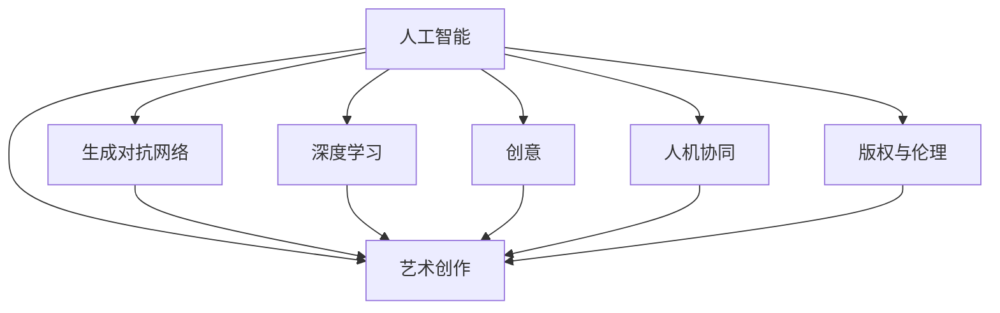

                 

# AI在艺术创作中的角色：工具还是合作者

> 关键词：人工智能,艺术创作,工具与合作,创意与算力,人机协同,生成对抗网络,GAN,深度学习,艺术生成,案例分析

## 1. 背景介绍

### 1.1 问题由来

人工智能(AI)的迅猛发展，对艺术创作领域产生了深刻影响。从传统绘画到数字艺术，再到生成艺术，AI已成为艺术创作中不可或缺的工具。AI不仅在艺术创作中提供技术支持，还通过与艺术家的合作，推动了艺术形式的革新与变革。然而，AI在艺术创作中的角色究竟是工具还是合作者，学术界和业界一直存在争议。

### 1.2 问题核心关键点

AI在艺术创作中的角色，主要涉及以下几个核心关键点：
- 技术支持：AI提供诸如深度学习、生成对抗网络(GAN)等技术工具，辅助艺术家进行创作。
- 创意与算力结合：AI与艺术家的合作，如何实现创作过程中的"智慧"与"算法"的深度融合。
- 人机协同：AI与艺术家如何通过协同创新，创造出更具艺术价值和科技含量的作品。
- 作品归属与版权问题：AI生成作品的版权归属，是否涉及原作者和AI本身。
- 伦理与审美：AI生成艺术作品的伦理标准和审美观念，是否与人类一致。

### 1.3 问题研究意义

研究AI在艺术创作中的角色，对于推动艺术与科技的融合，促进跨学科的创新，具有重要意义：
- 技术革新：AI技术的不断发展，为艺术创作提供了新的工具和方法，推动艺术创作方式的进步。
- 跨界合作：AI与艺术家的合作，催生了新的艺术形式和表现手法，拓展了艺术创作的边界。
- 版权与伦理：AI生成艺术作品的版权归属和伦理问题，关系到知识产权保护和艺术道德的维护。
- 市场与影响力：AI生成艺术作品的市场接受度和影响力，对艺术市场和艺术消费群体有重要影响。

## 2. 核心概念与联系

### 2.1 核心概念概述

为更好地理解AI在艺术创作中的角色，本节将介绍几个核心概念及其相互关系：

- **人工智能(Artificial Intelligence, AI)**：通过算法和计算，模拟人类智能过程的技术。
- **艺术创作(Artistic Creation)**：艺术家通过想象力、技巧和情感表达，创作出具有独特价值的作品。
- **生成对抗网络(Generative Adversarial Networks, GANs)**：一种深度学习模型，通过生成器和判别器两者的对抗训练，生成高质量的生成图像。
- **人机协同(Human-AI Collaboration)**：AI与人类共同完成某一任务的过程，强调双方的互动和互补。
- **深度学习(Deep Learning)**：一种基于神经网络的机器学习方法，通过多层次的非线性变换，实现复杂模式的识别和学习。
- **创意(Creativity)**：结合知识、技巧和情感，创造出新颖独特、具有独立价值的作品。
- **版权与伦理(Copyright and Ethics)**：涉及作品的归属权和使用权，以及对创作过程中的伦理道德要求。

这些概念之间的逻辑关系可以通过以下Mermaid流程图来展示：



这个流程图展示了一系列与AI在艺术创作中的角色密切相关的核心概念及其关系：

1. 人工智能提供生成对抗网络、深度学习和创意支持。
2. 生成对抗网络通过生成高质量图像，参与艺术创作。
3. 深度学习通过强大的模式识别能力，辅助艺术创作。
4. 创意与算力结合，实现人机协同创新。
5. 版权与伦理问题，影响AI生成艺术作品的合法性和道德性。
6. 艺术创作最终输出具有独立价值的作品。

## 3. 核心算法原理 & 具体操作步骤

### 3.1 算法原理概述

AI在艺术创作中的核心算法原理，主要包括生成对抗网络(GANs)和深度学习等技术。这些算法通过模拟人类的创意过程，生成具有艺术价值的图像或声音，辅助艺术家进行创作。

生成对抗网络由两个神经网络构成，一个生成器(Generator)和一个判别器(Discriminator)，通过对抗训练来提升生成器的生成能力。生成器通过学习数据分布，生成假图像，判别器则对生成的图像进行判断，分辨真假。两者相互对抗，不断调整参数，最终生成高逼真度的图像。

深度学习通过多层神经网络的非线性变换，捕捉和表达复杂模式。在艺术创作中，深度学习可以用于图像分类、风格迁移、超分辨率等任务，辅助艺术家进行作品创作。

### 3.2 算法步骤详解

AI在艺术创作中的具体操作步骤如下：

1. **数据准备**：
   - 收集高质量的艺术作品数据集，如绘画、雕塑、音乐等。
   - 对数据进行预处理，如归一化、扩充样本等。

2. **模型训练**：
   - 构建生成对抗网络或深度学习模型，并进行参数初始化。
   - 训练生成器，使其生成高质量的图像或声音。
   - 训练判别器，使其能够准确区分真实数据和生成的假数据。
   - 通过对抗训练，不断优化生成器和判别器。

3. **生成艺术作品**：
   - 将训练好的生成器应用于艺术创作中，生成具有艺术价值的图像或声音。
   - 艺术家可以参与设计生成器的输入参数，引导生成特定风格的艺术作品。

4. **作品输出与评价**：
   - 将生成的艺术作品输出，进行评估和修改。
   - 艺术家与AI进行互动，不断迭代优化生成结果。

### 3.3 算法优缺点

AI在艺术创作中的算法，具有以下优点：
- 自动化生成：大幅提高艺术创作的速度和效率。
- 多样性：生成大量风格各异的作品，提供创作灵感。
- 高逼真度：生成的图像或声音质量高，逼真度强。
- 持续创新：AI算法不断进化，提供新的创作方式和艺术形式。

同时，也存在以下缺点：
- 缺乏情感：AI生成的作品缺乏人类情感和个性，可能显得机械和单调。
- 技术门槛：生成高质量作品需要高水平的算法和技术支持，对开发者要求较高。
- 伦理问题：生成作品版权归属、伦理标准等问题尚未明确，存在争议。

### 3.4 算法应用领域

AI在艺术创作中的应用领域广泛，主要包括：

- **数字艺术**：使用GANs生成数字图像和动画，应用于广告、游戏、电影等领域。
- **音乐创作**：通过深度学习生成音乐作品，如旋律、和声、节奏等。
- **绘画与雕塑**：生成逼真图像和3D模型，辅助艺术家进行创作。
- **动画与视频**：生成具有高度逼真度的动画，应用于影视制作。
- **艺术展示**：通过AI算法，生成艺术作品，用于展览和销售。

## 4. 数学模型和公式 & 详细讲解 & 举例说明

### 4.1 数学模型构建

AI在艺术创作中的数学模型主要基于生成对抗网络(GANs)和深度学习。以下以GAN为例，描述其数学模型的构建：

**生成器(Generator)**：
- 输入为随机噪声$z$，输出为图像$x$。
- 生成器由多层神经网络构成，每层包括线性变换和激活函数。

**判别器(Discriminator)**：
- 输入为图像$x$，输出为真实图像的概率$y$。
- 判别器同样由多层神经网络构成，每层包括线性变换和激活函数。

**目标函数**：
- 生成器和判别器的目标函数分别为：
  - $L_G = -\mathbb{E}_{z \sim p(z)} [\log D(G(z))]$
  - $L_D = -\mathbb{E}_{x \sim p(x)} [\log D(x)] - \mathbb{E}_{z \sim p(z)} [\log (1 - D(G(z)))]$

### 4.2 公式推导过程

**生成器函数**：
$$G(z) = \mathcal{G}(z) = \begin{cases}
    \mathcal{G}_1(z) & \text{if } \mathcal{G}_1(z) \in X\\
    \mathcal{G}_2(\mathcal{G}_1(z)) & \text{if } \mathcal{G}_1(z) \notin X\\
\end{cases}$$
其中，$X$为图像空间。

**判别器函数**：
$$D(x) = \mathcal{D}(x) = \begin{cases}
    1 & \text{if } x \in X\\
    0 & \text{if } x \notin X\\
\end{cases}$$

**损失函数**：
$$L_G = -\mathbb{E}_{z \sim p(z)} [\log D(G(z))]$$
$$L_D = -\mathbb{E}_{x \sim p(x)} [\log D(x)] - \mathbb{E}_{z \sim p(z)} [\log (1 - D(G(z)))]$$

其中，$L_G$和$L_D$分别为生成器和判别器的损失函数。

### 4.3 案例分析与讲解

以GANs在数字艺术中的应用为例：
1. **数据准备**：收集高质量的绘画作品，进行预处理和扩充。
2. **模型构建**：构建一个包含多个卷积层和全连接层的生成器和判别器。
3. **训练过程**：通过对抗训练，不断优化生成器和判别器。
4. **生成艺术作品**：使用训练好的生成器，生成具有艺术价值的高质量图像。

## 5. 项目实践：代码实例和详细解释说明

### 5.1 开发环境搭建

进行AI在艺术创作中的应用开发，需要准备好Python开发环境，并安装必要的深度学习库，如TensorFlow、PyTorch等。同时，还需要安装数据处理库和图形库，如NumPy、Pandas、Matplotlib等。

### 5.2 源代码详细实现

以下是使用PyTorch实现的GANs代码示例：

```python
import torch
import torch.nn as nn
import torch.optim as optim
from torch.utils.data import DataLoader
from torchvision import datasets, transforms

class Generator(nn.Module):
    def __init__(self):
        super(Generator, self).__init__()
        self.fc1 = nn.Linear(100, 256)
        self.fc2 = nn.Linear(256, 512)
        self.fc3 = nn.Linear(512, 28 * 28)
        self.fc4 = nn.Linear(28 * 28, 784)
        self.conv1 = nn.ConvTranspose2d(100, 256, 4, 1, 0, bias=False)
        self.conv2 = nn.ConvTranspose2d(256, 128, 4, 2, 1, bias=False)
        self.conv3 = nn.ConvTranspose2d(128, 64, 4, 2, 1, bias=False)
        self.conv4 = nn.ConvTranspose2d(64, 1, 4, 2, 1, bias=False)
    
    def forward(self, x):
        x = self.fc1(x)
        x = nn.LeakyReLU(x)
        x = self.fc2(x)
        x = nn.LeakyReLU(x)
        x = self.fc3(x)
        x = nn.LeakyReLU(x)
        x = self.fc4(x)
        x = nn.Sigmoid(x)
        x = x.view(x.size(0), 1, 28, 28)
        return x

class Discriminator(nn.Module):
    def __init__(self):
        super(Discriminator, self).__init__()
        self.conv1 = nn.Conv2d(1, 64, 4, 2, 1, bias=False)
        self.conv2 = nn.Conv2d(64, 128, 4, 2, 1, bias=False)
        self.conv3 = nn.Conv2d(128, 256, 4, 2, 1, bias=False)
        self.fc1 = nn.Linear(256 * 7 * 7, 1)
    
    def forward(self, x):
        x = self.conv1(x)
        x = nn.LeakyReLU(x)
        x = self.conv2(x)
        x = nn.LeakyReLU(x)
        x = self.conv3(x)
        x = nn.LeakyReLU(x)
        x = x.view(x.size(0), -1)
        x = self.fc1(x)
        x = nn.Sigmoid(x)
        return x

# 数据准备
mnist = datasets.MNIST('MNIST_data', train=True, transform=transforms.ToTensor(), download=True)
mnist_dataset = DataLoader(mnist, batch_size=64, shuffle=True)

# 模型构建
g = Generator()
d = Discriminator()

# 训练过程
g_optimizer = optim.Adam(g.parameters(), lr=0.0002, betas=(0.5, 0.999))
d_optimizer = optim.Adam(d.parameters(), lr=0.0002, betas=(0.5, 0.999))
criterion = nn.BCELoss()

for epoch in range(100):
    for batch_idx, (data, target) in enumerate(mnist_dataset):
        real_images = data.view(data.size(0), 1, 28, 28)
        real_labels = target.view(-1, 1)
        noise = torch.randn(64, 100)
        fake_images = g(noise)
        fake_labels = torch.zeros(64, 1)
        
        real_images = real_images.to(device)
        fake_images = fake_images.to(device)
        real_labels = real_labels.to(device)
        fake_labels = fake_labels.to(device)
        
        d_optimizer.zero_grad()
        real_outputs = d(real_images)
        fake_outputs = d(fake_images)
        real_loss = criterion(real_outputs, real_labels)
        fake_loss = criterion(fake_outputs, fake_labels)
        d_loss = real_loss + fake_loss
        
        d_loss.backward()
        d_optimizer.step()
        
        g_optimizer.zero_grad()
        fake_outputs = d(fake_images)
        g_loss = criterion(fake_outputs, real_labels)
        g_loss.backward()
        g_optimizer.step()
        
        if (batch_idx+1) % 100 == 0:
            print(f"Epoch {epoch+1}, Batch {batch_idx+1}, d_loss: {d_loss.item():.4f}, g_loss: {g_loss.item():.4f}")
```

### 5.3 代码解读与分析

上述代码实现了使用PyTorch构建生成对抗网络(GANs)的过程，主要包括：

- **数据准备**：使用MNIST数据集，并进行预处理。
- **模型构建**：定义生成器和判别器的结构。
- **训练过程**：通过对抗训练，不断优化生成器和判别器。
- **结果展示**：在训练过程中，输出生成器和判别器的损失，并不断迭代优化。

## 6. 实际应用场景

### 6.1 智能艺术创作

智能艺术创作是AI在艺术创作中应用的典型场景之一。通过深度学习算法，AI可以生成高质量的艺术作品，如数字绘画、音乐和电影。这些作品不仅具有高度逼真度，还具备一定的艺术价值。

以音乐创作为例，AI可以通过分析大量音乐作品，学习其结构和风格，生成新的旋律和和声。艺术家可以利用这些AI生成的音乐片段，进行二次创作，生成具有个人风格的作品。

### 6.2 艺术风格迁移

艺术风格迁移是AI在艺术创作中应用的另一重要场景。通过深度学习算法，AI可以将一幅艺术作品的风格转换为另一种风格，创造出风格独特的作品。

例如，将梵高的画风应用到一位现代艺术家的作品中，或将毕加索的画风应用到一张普通照片上，生成具有独特风格的艺术作品。这种风格迁移技术，不仅拓展了艺术创作的边界，还为艺术家提供了新的创作灵感。

### 6.3 艺术展示与交互

AI在艺术展示与交互中也发挥了重要作用。通过深度学习算法，AI可以生成高质量的图像和视频，用于展览和虚拟现实(VR)体验。观众可以通过VR设备，沉浸式体验艺术作品，获得更加逼真和沉浸的体验。

例如，在艺术博物馆中，AI生成的虚拟场景可以展示名画和雕塑，为观众提供互动和沉浸式体验。这种技术，不仅拓展了艺术展示的形式，还为博物馆的展览带来了新的创意和形式。

## 7. 工具和资源推荐

### 7.1 学习资源推荐

为了帮助开发者掌握AI在艺术创作中的应用，以下推荐一些优质的学习资源：

1. **《生成对抗网络：理论、算法与应用》**：斯坦福大学教授Ian Goodfellow所著，详细介绍了GANs的理论基础和实践方法，是了解AI在艺术创作中应用的必读之作。

2. **DeepArt**：DeepArt网站，提供了大量的艺术风格迁移示例，通过简单易用的工具，让普通用户也能体验AI在艺术创作中的魅力。

3. **DeepArt for Python**：DeepArt的Python API，提供了丰富的功能，方便开发者进行自定义应用。

4. **Art with AI**：一个介绍AI在艺术创作中应用的博客，提供了大量的案例和代码示例，适合初学者学习和实践。

### 7.2 开发工具推荐

进行AI在艺术创作的应用开发，需要以下工具的支持：

1. **PyTorch**：深度学习框架，提供了丰富的算法和模型库，适合进行GANs等深度学习应用开发。

2. **TensorFlow**：另一个流行的深度学习框架，支持GPU加速，适合大规模计算和高性能应用。

3. **Jupyter Notebook**：交互式编程工具，方便开发者进行代码调试和展示。

4. **Matplotlib**：数据可视化库，用于展示和分析生成的艺术作品。

5. **Scikit-Image**：图像处理库，提供丰富的图像处理功能，方便进行数据预处理和增强。

### 7.3 相关论文推荐

AI在艺术创作中的应用研究，涉及多个学科和领域。以下推荐几篇重要的论文，供深入阅读：

1. **《Image-to-Image Translation with Conditional Adversarial Networks》**：提出条件对抗网络，用于图像风格迁移，为AI在艺术创作中的应用奠定了基础。

2. **《ArtGAN: A General-Purpose Generative Adversarial Network for Artistic Style Transfer》**：提出ArtGAN模型，用于艺术风格迁移，展示了AI在艺术创作中的广泛应用。

3. **《DeepArt: Auto-generating Art》**：介绍了DeepArt网站，展示了AI在艺术创作中的应用，为技术落地提供了实践案例。

## 8. 总结：未来发展趋势与挑战

### 8.1 总结

本文对AI在艺术创作中的角色进行了全面系统的介绍。首先阐述了AI在艺术创作中的技术支持、创意与算力结合、人机协同和作品归属与版权等问题。通过理论分析和实际案例，展示了AI在艺术创作中的应用和潜力。

通过本文的系统梳理，可以看到，AI在艺术创作中已经展现出强大的技术优势和创新能力。AI与艺术家的合作，正在推动艺术创作方式的进步，拓展艺术创作的形式和边界。未来，随着技术的不断发展，AI在艺术创作中的角色将更加多样化和深远。

### 8.2 未来发展趋势

展望未来，AI在艺术创作中的发展趋势如下：

1. **技术融合**：AI与更多领域的交叉融合，如建筑、设计、音乐等，创造出更多创新的艺术形式。
2. **个性化创作**：AI可以根据用户偏好和风格，生成个性化的艺术作品，实现定制化创作。
3. **自动化创作**：AI能够自动化生成艺术作品，提高创作效率，降低人力成本。
4. **跨文化创作**：AI能够理解和生成多种语言和文化背景下的艺术作品，推动全球文化交流和融合。
5. **伦理与法律**：AI在艺术创作中的伦理问题将更加受到关注，逐步形成规范和标准。

### 8.3 面临的挑战

尽管AI在艺术创作中的应用前景广阔，但也面临诸多挑战：

1. **技术复杂度**：AI生成高质量作品需要复杂的算法和技术支持，对开发者要求较高。
2. **艺术价值与真实性**：AI生成的作品是否具有真实艺术价值，仍存在争议。
3. **版权与伦理问题**：AI生成作品的版权归属、伦理标准等问题，尚未明确。
4. **技术滥用**：AI技术可能被滥用，生成不适当或有害的艺术作品，带来伦理和道德风险。

### 8.4 研究展望

未来的研究需要在以下几个方面寻求新的突破：

1. **技术优化**：提高AI生成作品的质量和逼真度，降低技术门槛。
2. **伦理规范**：制定AI在艺术创作中的伦理规范和标准，保护版权和道德底线。
3. **跨学科融合**：推动AI与更多领域的交叉融合，实现跨学科创新。
4. **个性化定制**：研究AI个性化创作技术，满足不同用户的创作需求。
5. **自动化创作**：研究自动化生成技术，提高创作效率和降低成本。

这些研究方向的探索，将进一步推动AI在艺术创作中的创新和发展，为艺术创作带来新的创意和形式。

## 9. 附录：常见问题与解答

**Q1：AI生成的艺术作品是否具有版权？**

A: AI生成的艺术作品，其版权归属问题仍存在争议。一些观点认为，AI创作的作品属于"智慧创作"，应归属于开发者或艺术家；另一些观点认为，AI生成的作品应视为"数据产物"，其版权应归属于数据来源方。

**Q2：AI生成作品的艺术价值如何评价？**

A: AI生成作品的艺术价值，主要通过艺术批评家和公众的评价来判断。一些AI生成的作品已经获得艺术界的认可，并展出在博物馆和画廊中。然而，评价标准仍需要进一步明确，避免"技术至上"的倾向。

**Q3：AI在艺术创作中的伦理问题如何应对？**

A: AI在艺术创作中的伦理问题，需要通过多方面的努力来解决：
1. 制定伦理规范：制定AI在艺术创作中的伦理规范，避免技术滥用。
2. 保护版权：明确AI生成作品的版权归属，保护艺术家的合法权益。
3. 公众监督：通过公众监督和社会舆论，对AI生成的作品进行评价和反馈。

通过多方协同努力，可以更好地应对AI在艺术创作中的伦理问题，保障艺术创作的健康发展。

**Q4：AI在艺术创作中的技术门槛如何降低？**

A: 降低AI在艺术创作中的技术门槛，需要从以下几个方面入手：
1. 简化算法：简化生成对抗网络等算法的复杂度，使其易于理解和实现。
2. 开放平台：开发易于使用的AI生成工具，降低技术门槛。
3. 教育培训：加强AI艺术创作的教育和培训，培养更多的AI艺术家。
4. 社区支持：建立AI艺术创作社区，提供技术支持和交流平台。

通过这些措施，可以逐步降低AI在艺术创作中的技术门槛，推动AI艺术的普及和创新。

---

作者：禅与计算机程序设计艺术 / Zen and the Art of Computer Programming

