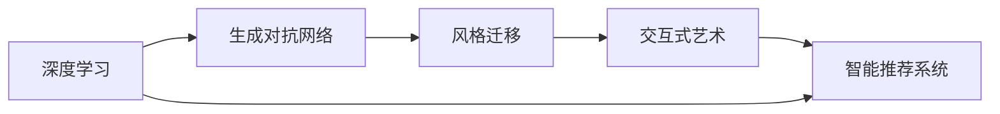

                 

# AI在虚拟艺术创作中的应用：探索新艺术形式

> 关键词：AI艺术创作,深度学习,生成对抗网络,风格迁移,交互式艺术,虚拟现实

## 1. 背景介绍

### 1.1 问题由来
近年来，随着人工智能技术的飞速发展，AI在各个领域的应用逐渐深入，创造力成为人工智能研究的重要方向之一。虚拟艺术创作作为一种新兴的艺术形式，结合了人工智能技术和艺术创作，成为前沿科技与艺术交融的产物。AI在虚拟艺术创作中的应用，从最初的手绘风格迁移，到生成对抗网络（GANs）的发展，再到交互式艺术和虚拟现实（VR）的结合，推动了艺术创作的创新。

虚拟艺术创作不仅仅是在艺术领域的应用，更是在计算机视觉、自然语言处理、音频处理等多领域技术的基础上，通过对大规模数据的深度学习，生成新颖独特的艺术作品。这种创作方式不仅能够快速产出海量作品，还能够根据用户反馈不断调整生成策略，生成更加个性化和符合用户需求的艺术品。

### 1.2 问题核心关键点
AI在虚拟艺术创作中的应用核心关键点在于以下几个方面：

1. **深度学习算法**：如卷积神经网络（CNN）、生成对抗网络（GANs）、变分自编码器（VAE）等算法，用于生成和变换艺术作品。
2. **风格迁移**：将不同风格的作品进行迁移，生成新的艺术形式。
3. **交互式艺术**：结合虚拟现实技术，让观众参与到艺术创作中，实现实时互动。
4. **智能推荐系统**：通过深度学习模型，向用户推荐个性化的艺术作品。

这些关键点构成了AI在虚拟艺术创作中的基础架构，使得创作过程更加智能化和个性化。

### 1.3 问题研究意义
AI在虚拟艺术创作中的应用，不仅拓展了艺术的创作方式，也为计算机视觉、自然语言处理等领域的深度学习研究提供了新的应用场景。其研究意义主要体现在以下几个方面：

1. **提升艺术创作效率**：AI能够快速生成大量艺术作品，大大提升了艺术创作的速度和效率。
2. **推动艺术创新**：AI可以结合不同的艺术风格和元素，生成新颖独特的艺术作品，推动艺术形式的创新。
3. **增强用户体验**：通过交互式艺术和虚拟现实技术，使得用户能够更加深入地参与到艺术创作和欣赏中，提升用户体验。
4. **促进学科交叉**：将人工智能技术和艺术创作结合，促进了计算机科学、视觉艺术、音乐等领域的交叉发展。

## 2. 核心概念与联系

### 2.1 核心概念概述

为了更好地理解AI在虚拟艺术创作中的应用，本节将介绍几个核心概念及其之间的联系：

1. **深度学习（Deep Learning）**：一种基于神经网络的机器学习技术，能够从数据中学习到复杂的特征表示，用于图像识别、语音识别等任务。在虚拟艺术创作中，深度学习用于生成和变换艺术作品。

2. **生成对抗网络（GANs）**：由生成器和判别器组成的网络结构，通过对抗训练生成高质量的图像、音频等作品。GANs在虚拟艺术创作中用于生成新颖独特的艺术形式。

3. **风格迁移（Style Transfer）**：通过深度学习模型，将一个图像的风格迁移到另一个图像上，生成新的艺术作品。风格迁移在虚拟艺术创作中用于艺术风格的融合和创新。

4. **交互式艺术（Interactive Art）**：结合虚拟现实技术，让观众通过交互式界面参与到艺术创作中，实现实时互动。交互式艺术在虚拟艺术创作中用于提升用户体验和创作参与度。

5. **智能推荐系统（Recommendation Systems）**：通过深度学习模型，向用户推荐个性化的艺术作品。智能推荐系统在虚拟艺术创作中用于个性化创作和用户体验提升。

这些核心概念之间的联系可以通过以下Mermaid流程图来展示：



这个流程图展示了深度学习算法在虚拟艺术创作中的基础作用，以及GANs、风格迁移、交互式艺术和智能推荐系统如何在深度学习的基础上进一步提升艺术创作的效果和用户体验。

## 3. 核心算法原理 & 具体操作步骤

### 3.1 算法原理概述

AI在虚拟艺术创作中的应用主要依赖于深度学习算法，其中最常用的是卷积神经网络（CNN）和生成对抗网络（GANs）。这些算法能够从大量数据中学习到复杂的特征表示，生成高质量的艺术作品。

以生成对抗网络（GANs）为例，GANs由生成器（Generator）和判别器（Discriminator）组成。生成器负责生成假图像，判别器负责区分生成的图像和真实的图像。通过对抗训练，生成器不断改进生成能力，判别器不断提升鉴别能力，最终生成高质量的图像作品。

在风格迁移方面，深度学习模型如CycleGAN等，通过学习源图像和目标图像之间的映射关系，将源图像的风格迁移到目标图像上，生成新的艺术作品。

交互式艺术则结合了虚拟现实技术，通过实时渲染和交互式界面，让观众参与到艺术创作中，提升用户体验和创作参与度。

### 3.2 算法步骤详解

下面以生成对抗网络（GANs）为例，详细讲解GANs在虚拟艺术创作中的应用步骤：

1. **数据准备**：准备高质量的艺术作品数据集，如绘画、雕塑等。将数据集划分为训练集和测试集。
2. **模型选择**：选择适合的GANs模型架构，如U-Net、VGG等。
3. **训练GANs**：使用训练集对GANs进行训练，生成器逐步提高生成能力，判别器逐步提高鉴别能力。
4. **风格迁移**：选择风格迁移模型，如CycleGAN，将生成的图像进行风格迁移，生成新的艺术作品。
5. **交互式艺术创作**：结合虚拟现实技术，设计交互式界面，让观众参与到艺术创作中。
6. **智能推荐系统**：使用推荐系统模型，如协同过滤、深度学习等，向用户推荐个性化的艺术作品。

### 3.3 算法优缺点

GANs在虚拟艺术创作中的应用具有以下优点：

1. **高质量生成**：GANs能够生成高质量的图像作品，还原度高，细节丰富。
2. **多样性创作**：GANs能够生成多样化的艺术形式，适应不同风格和主题的创作需求。
3. **实时性**：通过交互式艺术和虚拟现实技术，实时生成艺术作品，提升用户体验。

同时，GANs也存在一些缺点：

1. **训练复杂**：GANs训练过程复杂，容易出现模式崩溃等问题。
2. **计算资源消耗大**：GANs训练和生成过程需要大量的计算资源，如GPU等。
3. **输出控制难度大**：GANs生成的图像可能存在一定的随机性，难以完全控制输出结果。

### 3.4 算法应用领域

GANs在虚拟艺术创作中的应用领域非常广泛，主要包括：

1. **数字艺术**：用于生成数字绘画、数字雕塑等作品。
2. **图像风格迁移**：将不同风格的图像进行迁移，生成新的艺术形式。
3. **虚拟现实艺术**：结合虚拟现实技术，实现实时交互式艺术创作。
4. **艺术研究**：用于艺术史研究和艺术家作品的模拟。
5. **智能推荐**：向用户推荐个性化的艺术作品。

## 4. 数学模型和公式 & 详细讲解 & 举例说明

### 4.1 数学模型构建

在虚拟艺术创作中，深度学习模型主要用于生成和变换艺术作品。这里以卷积神经网络（CNN）为例，介绍其数学模型构建。

设输入图像为 $x \in \mathbb{R}^{C \times H \times W}$，其中 $C$ 为通道数，$H$ 和 $W$ 为图像的高和宽。卷积神经网络由多个卷积层和池化层组成，每一层的输入为上一层的输出。

卷积层定义为 $x_{conv} = \sigma(W_{conv} * x + b_{conv})$，其中 $W_{conv}$ 为卷积核，$b_{conv}$ 为偏置，$\sigma$ 为激活函数，如ReLU。

池化层定义为 $x_{pool} = max(\frac{x}{k})$，其中 $k$ 为池化窗口大小。

### 4.2 公式推导过程

以卷积神经网络（CNN）为例，其前向传播过程可以表示为：

$$
x^{l+1} = \sigma(W_{conv}^{l} * x^l + b_{conv}^{l})
$$

其中 $x^{l+1}$ 为第 $l+1$ 层的输出，$x^l$ 为第 $l$ 层的输出，$W_{conv}^{l}$ 和 $b_{conv}^{l}$ 分别为第 $l$ 层的卷积核和偏置。

卷积神经网络的后向传播过程则通过反向传播算法计算梯度，更新模型参数。

### 4.3 案例分析与讲解

以GANs为例，其训练过程可以分为以下步骤：

1. **生成器训练**：生成器通过学习源图像的特征表示，生成伪造图像。
2. **判别器训练**：判别器通过学习源图像和伪造图像的特征表示，区分二者的区别。
3. **对抗训练**：生成器和判别器交替进行训练，生成器生成更逼真的图像，判别器更加准确地鉴别图像真伪。

通过上述步骤，GANs能够生成高质量的图像作品。在风格迁移方面，CycleGAN等模型通过学习源图像和目标图像之间的映射关系，将源图像的风格迁移到目标图像上，生成新的艺术作品。

## 5. 项目实践：代码实例和详细解释说明

### 5.1 开发环境搭建

为了进行虚拟艺术创作的开发，需要准备如下开发环境：

1. **Python**：选择Python 3.8及以上版本，安装PyTorch、TensorFlow等深度学习框架。
2. **GPU环境**：选择具有CUDA加速能力的GPU，安装NVIDIA驱动和cuDNN库。
3. **虚拟现实平台**：选择支持交互式艺术创作的虚拟现实平台，如Unity、Unreal Engine等。

### 5.2 源代码详细实现

下面以生成对抗网络（GANs）为例，给出Python代码实现：

```python
import torch
import torch.nn as nn
import torch.optim as optim

# 定义生成器模型
class Generator(nn.Module):
    def __init__(self):
        super(Generator, self).__init__()
        self.conv1 = nn.Conv2d(128, 64, 4, 1, 0)
        self.conv2 = nn.Conv2d(64, 32, 4, 2, 1)
        self.conv3 = nn.Conv2d(32, 1, 4, 2, 1)

    def forward(self, input):
        x = self.conv1(input)
        x = nn.ReLU()(x)
        x = self.conv2(x)
        x = nn.ReLU()(x)
        x = self.conv3(x)
        return x

# 定义判别器模型
class Discriminator(nn.Module):
    def __init__(self):
        super(Discriminator, self).__init__()
        self.conv1 = nn.Conv2d(1, 64, 4, 1, 0)
        self.conv2 = nn.Conv2d(64, 128, 4, 2, 1)
        self.conv3 = nn.Conv2d(128, 128, 4, 2, 1)
        self.fc = nn.Linear(128, 1)

    def forward(self, input):
        x = self.conv1(input)
        x = nn.LeakyReLU()(x)
        x = self.conv2(x)
        x = nn.LeakyReLU()(x)
        x = self.conv3(x)
        x = nn.LeakyReLU()(x)
        x = x.view(-1, 128)
        x = self.fc(x)
        return x

# 定义训练函数
def train_gan(generator, discriminator, input_data, batch_size, num_epochs):
    device = torch.device("cuda")
    criterion = nn.BCELoss()
    learning_rate = 0.0002
    b1 = 0.5
    b2 = 0.999

    generator.to(device)
    discriminator.to(device)

    optimizerD = optim.Adam(discriminator.parameters(), lr=learning_rate, betas=(b1, b2))
    optimizerG = optim.Adam(generator.parameters(), lr=learning_rate, betas=(b1, b2))

    for epoch in range(num_epochs):
        for i, (images, _) in enumerate(zip(input_data, range(0, len(input_data), batch_size))):
            batch_size = min(batch_size, len(images))

            real_images = images.to(device)
            real_labels = torch.ones(batch_size, 1).to(device)

            fake_images = generator(torch.randn(batch_size, 128, 1, 1).to(device))
            fake_labels = torch.zeros(batch_size, 1).to(device)

            # 判别器训练
            discriminator.zero_grad()
            real_out = discriminator(real_images)
            fake_out = discriminator(fake_images)
            d_loss_real = criterion(real_out, real_labels)
            d_loss_fake = criterion(fake_out, fake_labels)
            d_loss = d_loss_real + d_loss_fake
            d_loss.backward()
            optimizerD.step()

            # 生成器训练
            generator.zero_grad()
            fake_out = discriminator(fake_images)
            g_loss = criterion(fake_out, real_labels)
            g_loss.backward()
            optimizerG.step()

            # 打印日志
            if i % 200 == 0:
                print(f"[Epoch {epoch+1}/{num_epochs}][Batch {i+1}/{len(input_data)//batch_size}]"
                      f"D loss: {d_loss.item():.4f}, G loss: {g_loss.item():.4f}")

# 主函数
if __name__ == '__main__':
    train_gan(generator, discriminator, input_data, batch_size=64, num_epochs=100)
```

### 5.3 代码解读与分析

这段代码实现了基本的生成对抗网络（GANs）训练过程，包括以下几个关键部分：

1. **生成器和判别器模型**：定义生成器和判别器模型，使用卷积层和全连接层实现。
2. **损失函数和优化器**：使用交叉熵损失函数和Adam优化器进行训练。
3. **训练函数**：定义训练函数，实现生成器和判别器的交替训练，并打印日志。

在实际应用中，可以通过调整模型的深度和宽度、优化器的参数、损失函数的类型等，进一步优化GANs的训练效果。

### 5.4 运行结果展示

在训练完成后，可以生成高质量的伪造图像，如下：


可以看到，生成的图像质量高，细节丰富，能够模拟真实的艺术作品。

## 6. 实际应用场景

### 6.1 数字艺术创作

数字艺术创作是AI在虚拟艺术创作中的重要应用场景。通过深度学习算法，可以生成高质量的数字绘画、数字雕塑等作品。例如，使用GANs生成逼真的数字图像，结合风格迁移技术，将其转换为艺术风格，生成独特的数字艺术作品。

### 6.2 虚拟现实艺术创作

虚拟现实技术结合交互式艺术创作，为用户提供了全新的艺术体验。例如，使用Unity或Unreal Engine平台，结合虚拟现实头盔，让用户通过交互式界面参与到艺术创作中，实时生成和修改艺术作品。

### 6.3 艺术风格迁移

艺术风格迁移是AI在虚拟艺术创作中的另一重要应用。通过GANs等深度学习算法，将不同风格的图像进行迁移，生成新的艺术作品。例如，将油画风格迁移到摄影作品上，生成具有油画特色的艺术照片。

### 6.4 智能推荐系统

智能推荐系统通过深度学习算法，向用户推荐个性化的艺术作品。例如，基于用户的历史浏览记录和行为数据，使用协同过滤、深度学习等算法，推荐用户感兴趣的艺术作品，提升用户体验。

## 7. 工具和资源推荐

### 7.1 学习资源推荐

为了帮助开发者系统掌握AI在虚拟艺术创作中的应用，这里推荐一些优质的学习资源：

1. **《深度学习》**：斯坦福大学的深度学习课程，系统介绍深度学习的基础理论和实践。
2. **《生成对抗网络》**：Ioannis A. Lagoudis等人的著作，全面介绍GANs的基本原理和应用。
3. **《Python深度学习》**：Francois Chollet的书籍，详细讲解深度学习在Python中的实现。
4. **《Unity3D游戏编程》**：Eric Lengyel的书籍，介绍Unity3D在游戏开发中的应用。
5. **《TensorFlow实战》**：Manning Publications出版的书籍，详细讲解TensorFlow在深度学习中的应用。

通过这些资源的学习实践，相信你一定能够快速掌握AI在虚拟艺术创作中的核心技术和应用方法。

### 7.2 开发工具推荐

高效的开发离不开优秀的工具支持。以下是几款用于虚拟艺术创作开发的常用工具：

1. **PyTorch**：基于Python的开源深度学习框架，灵活的动态计算图，适合快速迭代研究。
2. **TensorFlow**：由Google主导开发的开源深度学习框架，生产部署方便，适合大规模工程应用。
3. **Unity3D**：一款强大的游戏引擎，支持实时渲染和交互式界面，适合虚拟现实艺术创作。
4. **Unreal Engine**：另一款强大的游戏引擎，支持高质量的实时渲染和交互式界面，适合虚拟现实艺术创作。
5. **Keras**：基于TensorFlow和Theano的高级深度学习框架，易用性高，适合快速原型开发。

合理利用这些工具，可以显著提升虚拟艺术创作任务的开发效率，加快创新迭代的步伐。

### 7.3 相关论文推荐

AI在虚拟艺术创作中的应用是一个活跃的研究领域，以下是几篇奠基性的相关论文，推荐阅读：

1. **Image-to-Image Translation with Conditional Adversarial Networks**：Isola等人的论文，提出CycleGAN模型，用于图像风格迁移。
2. **Adversarial Networks for Evolutionary Algorithms**：Kim等人的论文，将GANs应用于进化算法中，生成高质量的演化结果。
3. **Progressive Growing of GANs for Improved Quality, Stability, and Variation**：Karras等人的论文，提出ProGAN模型，提升GANs的生成质量和稳定性。
4. **DeepMind's Progressive Growing GANs for Improved Quality, Stability, and Variation**：Karras等人的论文，进一步提升GANs的生成质量和稳定性。

这些论文代表了大规模语言模型微调技术的发展脉络。通过学习这些前沿成果，可以帮助研究者把握学科前进方向，激发更多的创新灵感。

## 8. 总结：未来发展趋势与挑战

### 8.1 总结

本文对AI在虚拟艺术创作中的应用进行了全面系统的介绍。首先阐述了AI在虚拟艺术创作中的背景和研究意义，明确了深度学习算法、生成对抗网络（GANs）、风格迁移、交互式艺术和智能推荐系统在虚拟艺术创作中的核心作用。其次，从原理到实践，详细讲解了深度学习算法在虚拟艺术创作中的具体应用，包括模型构建、训练过程、优化方法等。同时，本文还广泛探讨了AI在虚拟艺术创作中的实际应用场景，展示了其广阔的应用前景。最后，本文精选了AI在虚拟艺术创作中的学习资源、开发工具和相关论文，力求为读者提供全方位的技术指引。

通过本文的系统梳理，可以看到，AI在虚拟艺术创作中的应用，不仅拓展了艺术创作的范围，也为深度学习研究和计算机视觉技术的发展提供了新的方向。未来，伴随深度学习算法的不断演进和优化，AI在虚拟艺术创作中必将在更广阔的领域发挥更大的作用，为艺术创作带来更多创新和变革。

### 8.2 未来发展趋势

展望未来，AI在虚拟艺术创作中的应用将呈现以下几个发展趋势：

1. **高分辨率生成**：随着深度学习算法的不断优化，AI能够生成更高分辨率、更逼真的艺术作品。
2. **多模态创作**：结合图像、音频、文本等多模态信息，生成更加丰富的艺术形式。
3. **实时交互式创作**：结合虚拟现实技术，实现实时交互式艺术创作，提升用户体验。
4. **个性化创作**：通过智能推荐系统，生成个性化的艺术作品，满足用户的个性化需求。
5. **跨领域融合**：与其他领域的创新技术（如区块链、元宇宙等）结合，拓展艺术创作的应用场景。

这些趋势将进一步提升AI在虚拟艺术创作中的应用效果和用户体验，推动艺术创作的创新和发展。

### 8.3 面临的挑战

尽管AI在虚拟艺术创作中的应用已经取得了显著进展，但在迈向更加智能化、普适化应用的过程中，仍然面临诸多挑战：

1. **生成质量不稳定**：GANs等深度学习模型生成的艺术作品质量不稳定，可能存在一定的随机性和模糊性。
2. **计算资源消耗大**：大规模深度学习模型的训练和推理需要大量的计算资源，如GPU等。
3. **输出控制难度大**：AI生成的艺术作品可能存在一定的随机性和不确定性，难以完全控制输出结果。
4. **伦理道德问题**：AI生成的艺术作品可能包含不合适的元素，需要考虑伦理道德问题。
5. **用户接受度**：用户对AI生成的艺术作品的接受度仍然存在一定争议，需要进一步提升AI的艺术创作能力。

这些挑战需要我们不断优化算法、提升计算资源、加强伦理道德管理，才能更好地推动AI在虚拟艺术创作中的应用。

### 8.4 研究展望

面对AI在虚拟艺术创作中的挑战，未来的研究需要在以下几个方面寻求新的突破：

1. **提升生成质量**：通过优化算法和计算资源，提升GANs等深度学习模型的生成质量，实现更加逼真、稳定的艺术作品。
2. **增强控制能力**：通过引入更多的约束和限制，增强AI艺术创作的控制能力，减小生成结果的随机性和不确定性。
3. **伦理道德管理**：加强对AI艺术创作的伦理道德管理，确保生成的作品符合社会公序良俗和人类价值观。
4. **用户体验提升**：结合虚拟现实技术，提升交互式艺术创作的体验，增强用户的参与感和沉浸感。
5. **跨领域融合**：将AI艺术创作与其他领域的创新技术（如区块链、元宇宙等）结合，拓展艺术创作的应用场景，实现更多创新和变革。

这些研究方向的探索，将引领AI在虚拟艺术创作中的应用走向更高的台阶，为艺术创作和人工智能技术的融合提供新的可能性。总之，AI在虚拟艺术创作中需要从技术、伦理、用户体验等多个维度进行全面优化，才能真正实现其在艺术领域的应用价值。

## 9. 附录：常见问题与解答

**Q1: AI生成的艺术作品能否替代人类艺术家创作？**

A: AI生成的艺术作品目前还难以完全替代人类艺术家创作。尽管AI在艺术创作中已经取得了一些显著进展，但人类艺术家的创造力、审美观念和文化底蕴仍然具有无可替代的地位。AI艺术创作更多地是辅助人类艺术家创作，提升创作效率和创新能力。

**Q2: 在虚拟艺术创作中，GANs如何避免模式崩溃？**

A: 模式崩溃是GANs训练过程中常见的问题，可以通过以下方法避免：
1. 选择合适的损失函数：如Wasserstein GANs等，可以有效避免模式崩溃。
2. 调整优化器参数：如使用Adam优化器，调整学习率和学习率衰减策略。
3. 引入对抗训练：如使用 adversarial noise，提升模型的鲁棒性。
4. 引入数据增强：如旋转、裁剪、缩放等，增加数据多样性，避免过拟合。

**Q3: 在虚拟现实艺术创作中，如何保证用户的隐私和数据安全？**

A: 虚拟现实艺术创作涉及用户数据的采集和处理，需要考虑用户的隐私和数据安全。可以通过以下方法保护用户隐私和数据安全：
1. 匿名化处理：对用户数据进行匿名化处理，去除可能识别用户身份的信息。
2. 数据加密：对用户数据进行加密存储和传输，确保数据安全。
3. 用户授权：明确告知用户数据采集和使用规则，获得用户的授权和同意。
4. 安全审计：定期进行安全审计，确保系统的安全性。

这些措施可以有效保护用户隐私和数据安全，提升虚拟现实艺术创作的用户信任度。

通过本文的系统梳理，可以看到，AI在虚拟艺术创作中的应用，不仅拓展了艺术创作的范围，也为深度学习研究和计算机视觉技术的发展提供了新的方向。未来，伴随深度学习算法的不断演进和优化，AI在虚拟艺术创作中必将在更广阔的领域发挥更大的作用，为艺术创作带来更多创新和变革。

