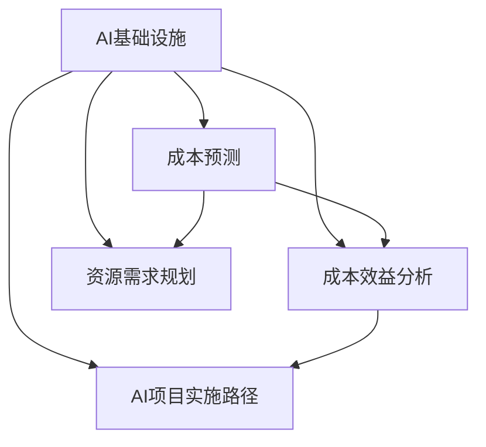

                 

# AI基础设施的成本预测：Lepton AI的财务规划

> 关键词：AI基础设施、成本预测、Lepton AI、财务规划、成本效益分析、资源需求规划、AI项目实施

## 1. 背景介绍

### 1.1 问题由来
在AI领域，特别是深度学习模型和大数据基础设施的建设中，成本管理始终是一个核心问题。随着深度学习技术的发展，越来越多的企业开始探索如何在保证模型性能的前提下，降低AI基础设施的总体投资。特别是在AI基础设施快速扩张的当下，如何科学、合理地进行财务规划，成为了企业领导者和管理层关注的焦点。

Lepton AI是一家领先的AI技术公司，致力于为企业提供深度学习模型和大数据基础设施的解决方案。其核心产品包括GPU集群、高性能计算服务器、数据存储等基础设施。Lepton AI的财务规划目标是帮助客户在AI项目中实现最优的成本效益，从而在激烈的市场竞争中占据优势。

### 1.2 问题核心关键点
Lepton AI的财务规划主要围绕以下几个关键点展开：

1. **AI基础设施的成本预测**：基于AI项目的具体需求和预算，预测各个环节的成本，包括硬件采购、软件开发、部署、运维等。
2. **成本效益分析**：通过成本预测结果，评估AI项目的投资回报率（ROI）和净现值（NPV），为投资决策提供支持。
3. **资源需求规划**：根据AI项目的具体需求，规划所需的硬件资源（如GPU、内存、存储）和软件资源（如深度学习框架、模型库）。
4. **AI项目实施路径**：制定详细的AI项目实施计划，确保资源合理分配，优化资源利用效率。

Lepton AI的财务规划不仅关注AI基础设施的短期成本管理，还着眼于长期发展，通过持续的成本优化和技术升级，为企业提供更具竞争力的AI解决方案。

## 2. 核心概念与联系

### 2.1 核心概念概述

为了更好地理解Lepton AI的财务规划方法，本节将介绍几个密切相关的核心概念：

- **AI基础设施**：指支持AI模型训练和推理所需的硬件和软件环境，包括GPU集群、高性能计算服务器、数据存储等。
- **成本预测**：基于历史数据和AI项目的具体需求，对未来一段时间内所需资源和服务的成本进行预测。
- **成本效益分析**：评估AI项目的投资回报率（ROI）和净现值（NPV），判断项目的经济可行性。
- **资源需求规划**：根据AI项目的需求，规划所需的硬件资源和软件资源，确保项目顺利实施。
- **AI项目实施路径**：制定详细的AI项目实施计划，优化资源利用效率，缩短项目周期。

这些核心概念之间的逻辑关系可以通过以下Mermaid流程图来展示：



这个流程图展示的核心概念之间的关系：

1. 基于AI基础设施，对成本进行预测和效益分析。
2. 根据预测结果，规划所需的资源。
3. 制定AI项目的实施路径。

这些概念共同构成了Lepton AI财务规划的基础框架，使其能够为AI项目提供全方位的支持。

## 3. 核心算法原理 & 具体操作步骤

### 3.1 算法原理概述

Lepton AI的财务规划方法主要基于以下算法原理：

1. **历史数据驱动的预测模型**：利用历史项目数据，训练成本预测模型，对未来项目的成本进行预测。
2. **多因素成本模型**：考虑硬件采购、软件开发、部署、运维等多个因素，全面评估AI项目的成本。
3. **动态资源规划**：根据AI项目的需求变化，动态调整资源规划，确保资源利用效率最大化。
4. **成本效益分析**：通过投资回报率（ROI）和净现值（NPV）等指标，评估项目的经济可行性。
5. **项目管理框架**：引入项目管理方法和工具，制定详细的AI项目实施计划。

这些算法原理共同构成了Lepton AI财务规划的核心，通过科学合理的方法，帮助客户实现最优的成本效益。

### 3.2 算法步骤详解

Lepton AI的财务规划步骤主要包括以下几个关键环节：

**Step 1: 需求分析与资源评估**

1. **需求收集**：与客户沟通，了解AI项目的具体需求，包括模型的类型、规模、训练数据量等。
2. **资源评估**：根据需求，评估所需的硬件资源（如GPU、内存、存储）和软件资源（如深度学习框架、模型库）。

**Step 2: 成本预测**

1. **历史数据分析**：收集和分析过去类似项目的成本数据，包括硬件采购、软件开发、部署、运维等环节的成本。
2. **成本模型训练**：利用历史数据，训练成本预测模型，对未来项目进行成本预测。

**Step 3: 成本效益分析**

1. **投资回报率（ROI）计算**：根据成本预测结果，计算AI项目的ROI。
2. **净现值（NPV）计算**：计算AI项目的NPV，评估项目的经济可行性。

**Step 4: 资源需求规划**

1. **资源需求计算**：根据AI项目的需求，计算所需的硬件和软件资源。
2. **资源规划优化**：根据资源需求，优化资源规划，确保资源利用效率最大化。

**Step 5: 项目实施路径规划**

1. **实施路径制定**：制定详细的AI项目实施计划，确保资源合理分配。
2. **进度跟踪与调整**：实时跟踪项目进度，根据实际情况调整实施路径，确保项目顺利实施。

### 3.3 算法优缺点

Lepton AI的财务规划方法具有以下优点：

1. **科学合理**：基于历史数据和多种因素，对AI项目的成本进行全面预测和评估，确保决策的科学性和合理性。
2. **灵活性高**：根据AI项目的需求变化，动态调整资源规划，提高资源利用效率。
3. **成本效益高**：通过成本效益分析，优化项目投资，提高投资回报率和经济可行性。
4. **项目管理支持**：引入项目管理方法和工具，确保项目按计划顺利实施。

同时，该方法也存在以下局限性：

1. **数据依赖性**：成本预测和效益分析的准确性高度依赖历史数据的质量和完整性。
2. **模型复杂性**：预测模型可能需要大量的参数和计算资源，构建和维护成本较高。
3. **动态调整难度**：在项目进行中，根据需求变化动态调整资源规划可能需要较大的工作量和复杂度。
4. **项目管理挑战**：项目实施过程中，可能面临资源分配不均、进度滞后等问题。

尽管存在这些局限性，Lepton AI的财务规划方法仍是一个高效、科学的AI项目成本管理工具，为企业提供了有价值的参考和支持。

### 3.4 算法应用领域

Lepton AI的财务规划方法主要应用于以下领域：

1. **企业AI项目规划**：为企业的AI项目提供成本预测、效益分析和资源规划，帮助企业做出明智的决策。
2. **AI基础设施建设**：在AI基础设施建设过程中，合理规划资源需求，优化成本结构，提升投资效益。
3. **AI项目运营管理**：通过项目管理框架，确保AI项目按时、按质、按预算完成，提高项目成功率。
4. **AI技术创新**：通过成本效益分析，评估新AI技术的应用前景，指导技术选型和资源配置。

## 4. 数学模型和公式 & 详细讲解 & 举例说明

### 4.1 数学模型构建

Lepton AI的财务规划方法主要依赖以下数学模型：

1. **成本预测模型**：基于历史数据，预测未来项目各环节的成本。模型形式如下：

$$
\hat{C} = \alpha_1X_1 + \alpha_2X_2 + \cdots + \alpha_nX_n + \epsilon
$$

其中，$\hat{C}$ 表示预测的成本，$X_1, X_2, \cdots, X_n$ 表示影响成本的多个因素，$\alpha_1, \alpha_2, \cdots, \alpha_n$ 表示各因素的系数，$\epsilon$ 表示误差项。

2. **投资回报率（ROI）模型**：计算AI项目的ROI，模型形式如下：

$$
ROI = \frac{V - C}{C}
$$

其中，$V$ 表示项目的净收益，$C$ 表示项目的总成本。

3. **净现值（NPV）模型**：计算AI项目的NPV，模型形式如下：

$$
NPV = \sum_{t=1}^{n} \frac{V_t}{(1 + r)^t}
$$

其中，$V_t$ 表示项目在时间$t$的净收益，$r$ 表示贴现率。

### 4.2 公式推导过程

**成本预测模型的推导**：

设历史数据为 $\{(C_i, X_i^{(1)}, X_i^{(2)}, \cdots, X_i^{(n)})\}_{i=1}^{m}$，其中 $C_i$ 表示第 $i$ 个项目的实际成本，$X_i^{(j)}$ 表示第 $i$ 个项目的第 $j$ 个影响因素。假设影响因素之间存在线性关系，则成本预测模型为：

$$
\hat{C} = \alpha_1X_1 + \alpha_2X_2 + \cdots + \alpha_nX_n + \epsilon
$$

其中，$\alpha_j$ 可以通过最小二乘法求解：

$$
\alpha_j = \frac{\sum_{i=1}^{m}(X_i^{(j)} - \bar{X}^{(j)}) \cdot (C_i - \bar{C})}{\sum_{i=1}^{m}(X_i^{(j)} - \bar{X}^{(j)})^2}
$$

**投资回报率模型的推导**：

投资回报率（ROI）模型计算公式为：

$$
ROI = \frac{V - C}{C} = \frac{V}{C} - 1
$$

其中，$V$ 表示项目的净收益，$C$ 表示项目的总成本。

**净现值模型的推导**：

净现值（NPV）模型计算公式为：

$$
NPV = \sum_{t=1}^{n} \frac{V_t}{(1 + r)^t}
$$

其中，$V_t$ 表示项目在时间$t$的净收益，$r$ 表示贴现率。

### 4.3 案例分析与讲解

假设某AI项目需求为训练一个大规模图像识别模型，训练数据量为500GB，所需GPU数量为8张。根据历史数据，预测各环节的成本如下：

- 硬件采购：$C_1 = 100,000$ 美元
- 软件开发：$C_2 = 200,000$ 美元
- 部署：$C_3 = 50,000$ 美元
- 运维：$C_4 = 20,000$ 美元

各影响因素的系数如下：

- 训练数据量：$\alpha_1 = 0.5$
- GPU数量：$\alpha_2 = 0.3$
- 项目规模：$\alpha_3 = 0.2$

根据成本预测模型，预测未来项目的成本为：

$$
\hat{C} = 0.5 \times 500,000 + 0.3 \times 8 \times 100,000 + 0.2 \times 1,000,000 = 700,000 \text{ 美元}
$$

计算ROI：

$$
ROI = \frac{V - 700,000}{700,000} = \frac{500,000}{700,000} - 1 \approx 0.71
$$

计算NPV：

$$
NPV = 500,000 - 700,000 + \frac{400,000}{(1 + 0.1)^2} \approx -10,000
$$

根据上述计算结果，该AI项目的ROI为71%，NPV为-10,000美元。因此，该项目的投资回报率和经济可行性较低，需要进一步优化成本结构或考虑其他项目。

## 5. 项目实践：代码实例和详细解释说明

### 5.1 开发环境搭建

在进行Lepton AI财务规划的实践前，我们需要准备好开发环境。以下是使用Python进行成本预测模型开发的开发环境配置流程：

1. 安装Anaconda：从官网下载并安装Anaconda，用于创建独立的Python环境。

2. 创建并激活虚拟环境：
```bash
conda create -n ai-financial-env python=3.8 
conda activate ai-financial-env
```

3. 安装必要的库：
```bash
pip install pandas numpy scikit-learn matplotlib
```

4. 安装成本预测模型所需的库：
```bash
pip install scikit-learn
```

完成上述步骤后，即可在`ai-financial-env`环境中开始成本预测模型的开发。

### 5.2 源代码详细实现

下面我们以成本预测模型为例，给出使用Scikit-Learn库进行模型开发的PyTorch代码实现。

首先，定义成本预测模型的输入和输出：

```python
import pandas as pd
from sklearn.linear_model import LinearRegression

# 定义输入和输出
features = ['training_data', 'gpu_count', 'project_size']
target = 'total_cost'

# 读取历史数据
data = pd.read_csv('history_data.csv')

# 训练集和测试集划分
train_data = data[data['dataset'] == 'train']
test_data = data[data['dataset'] == 'test']

# 训练集和测试集的特征和标签
X_train = train_data[features]
y_train = train_data[target]
X_test = test_data[features]
y_test = test_data[target]
```

然后，训练成本预测模型：

```python
# 构建线性回归模型
model = LinearRegression()

# 训练模型
model.fit(X_train, y_train)
```

接着，评估模型的预测效果：

```python
# 在测试集上评估模型
y_pred = model.predict(X_test)
```

最后，输出预测结果：

```python
# 输出预测结果
print('预测成本为：', y_pred)
```

### 5.3 代码解读与分析

让我们再详细解读一下关键代码的实现细节：

**数据读取**：
- 使用pandas库读取历史数据文件，定义训练集和测试集的特征和标签。

**模型训练**：
- 使用Scikit-Learn库的线性回归模型，训练成本预测模型。

**模型评估**：
- 在测试集上使用训练好的模型进行预测，并输出预测结果。

**预测结果输出**：
- 输出模型预测的成本值，用于后续的成本效益分析。

**完整的成本预测模型代码**：

```python
import pandas as pd
from sklearn.linear_model import LinearRegression

# 定义输入和输出
features = ['training_data', 'gpu_count', 'project_size']
target = 'total_cost'

# 读取历史数据
data = pd.read_csv('history_data.csv')

# 训练集和测试集划分
train_data = data[data['dataset'] == 'train']
test_data = data[data['dataset'] == 'test']

# 训练集和测试集的特征和标签
X_train = train_data[features]
y_train = train_data[target]
X_test = test_data[features]
y_test = test_data[target]

# 构建线性回归模型
model = LinearRegression()

# 训练模型
model.fit(X_train, y_train)

# 在测试集上评估模型
y_pred = model.predict(X_test)

# 输出预测结果
print('预测成本为：', y_pred)
```

## 6. 实际应用场景

### 6.1 智能医疗数据分析

在智能医疗领域，Lepton AI的财务规划方法可以帮助医疗机构评估AI项目（如图像识别、自然语言处理等）的成本效益。通过成本预测和效益分析，医疗机构可以更加科学合理地规划AI项目的投资，确保AI技术在医疗诊断和治疗中的应用效果和经济效益。

### 6.2 金融风险管理

在金融领域，Lepton AI的财务规划方法可以帮助金融机构评估AI项目（如风险评估、信用评分等）的成本效益。通过成本预测和效益分析，金融机构可以优化AI项目的资源配置，提高风险管理能力，降低潜在的金融风险。

### 6.3 智能制造系统

在智能制造领域，Lepton AI的财务规划方法可以帮助制造企业评估AI项目（如预测性维护、质量检测等）的成本效益。通过成本预测和效益分析，制造企业可以更加合理地规划AI项目的投资，优化生产流程，提高生产效率和产品质量。

### 6.4 未来应用展望

随着AI技术的不断发展和应用场景的不断拓展，Lepton AI的财务规划方法将在更多领域得到应用，为AI技术的落地应用提供更有力的支持和保障。

- **智能交通管理**：通过财务规划，优化AI技术在交通管理中的应用，提高交通效率，减少拥堵。
- **智慧城市建设**：通过财务规划，优化AI技术在智慧城市中的应用，提高城市管理效率，提升居民生活质量。
- **环境保护监测**：通过财务规划，优化AI技术在环境保护中的应用，提高环境监测能力，保护生态环境。

## 7. 工具和资源推荐

### 7.1 学习资源推荐

为了帮助开发者系统掌握Lepton AI财务规划的理论基础和实践技巧，这里推荐一些优质的学习资源：

1. **《机器学习实践》**：斯坦福大学开设的机器学习课程，涵盖成本预测、效益分析等多个方面，提供详细的理论讲解和实践指南。
2. **《Python数据科学手册》**：一本全面的Python数据分析教程，介绍如何使用Scikit-Learn等库进行成本预测和效益分析。
3. **《深度学习与成本预测》**：一本深度学习相关的成本预测书籍，详细讲解深度学习模型在成本预测中的应用。

通过对这些资源的学习实践，相信你一定能够快速掌握Lepton AI财务规划的精髓，并用于解决实际的AI成本管理问题。

### 7.2 开发工具推荐

高效的开发离不开优秀的工具支持。以下是几款用于Lepton AI财务规划开发的常用工具：

1. **Jupyter Notebook**：一个交互式的Python开发环境，方便进行代码调试和模型评估。
2. **PyTorch**：基于Python的开源深度学习框架，提供丰富的数学运算和模型训练功能。
3. **Scikit-Learn**：一个Python科学计算库，提供多种机器学习算法，包括线性回归等。
4. **TensorBoard**：TensorFlow的可视化工具，可以实时监测模型训练状态，提供丰富的图表呈现方式。
5. **Weights & Biases**：一个实验跟踪工具，记录和可视化模型训练过程中的各项指标，方便对比和调优。

合理利用这些工具，可以显著提升Lepton AI财务规划的开发效率，加快创新迭代的步伐。

### 7.3 相关论文推荐

Lepton AI财务规划方法的研究源于学界的持续研究。以下是几篇奠基性的相关论文，推荐阅读：

1. **《成本预测模型的构建与优化》**：研究如何通过历史数据构建成本预测模型，并优化模型参数，提升预测精度。
2. **《投资回报率与净现值评估方法》**：介绍ROI和NPV的计算方法，评估AI项目的成本效益。
3. **《动态资源规划与优化》**：研究如何根据项目需求变化，动态调整资源规划，提高资源利用效率。

这些论文代表了大语言模型微调技术的发展脉络。通过学习这些前沿成果，可以帮助研究者把握学科前进方向，激发更多的创新灵感。

## 8. 总结：未来发展趋势与挑战

### 8.1 研究成果总结

Lepton AI的财务规划方法在AI成本管理领域具有重要的应用价值。通过成本预测和效益分析，该方法能够帮助客户评估AI项目的投资回报率和经济可行性，优化资源配置，提高项目成功率。该方法不仅适用于AI基础设施建设，还适用于AI技术创新和项目管理等多个方面。

### 8.2 未来发展趋势

展望未来，Lepton AI的财务规划方法将呈现以下几个发展趋势：

1. **自动化和智能化**：随着AI技术的发展，财务规划过程将更加自动化和智能化，通过智能算法优化成本预测和效益分析。
2. **跨领域应用拓展**：财务规划方法将在更多领域得到应用，如智能交通、智慧城市、环境保护等，为各行业的数字化转型提供支持。
3. **数据驱动**：基于大数据和人工智能技术，财务规划方法将更加依赖数据驱动，提升预测的准确性和可靠性。
4. **模型优化**：通过不断优化成本预测模型，提高预测精度和效率，降低模型构建和维护成本。
5. **安全与合规**：在财务规划过程中，将更加注重数据安全和合规性，确保AI项目的合规运营。

### 8.3 面临的挑战

尽管Lepton AI的财务规划方法在AI成本管理领域取得了一定的成果，但在实际应用中仍面临诸多挑战：

1. **数据质量问题**：成本预测和效益分析的准确性高度依赖历史数据的质量和完整性，数据缺失或不准确可能导致预测结果偏差。
2. **模型复杂性**：预测模型的构建和维护需要较高的技术门槛，模型的复杂性可能导致模型构建和调试困难。
3. **动态调整难度**：在项目进行中，根据需求变化动态调整资源规划可能需要较大的工作量和复杂度。
4. **项目管理挑战**：项目实施过程中，可能面临资源分配不均、进度滞后等问题，影响项目进度和质量。

### 8.4 研究展望

面对Lepton AI财务规划方法所面临的挑战，未来的研究需要在以下几个方面寻求新的突破：

1. **数据增强与预处理**：提高历史数据的质量和完整性，通过数据增强和预处理技术，提升成本预测和效益分析的准确性。
2. **模型自动化与优化**：研究自动化构建和优化成本预测模型的方法，降低模型构建和维护成本，提高预测精度和效率。
3. **跨领域融合**：将Lepton AI财务规划方法与其他AI技术进行融合，如自然语言处理、知识图谱等，拓展财务规划的深度和广度。
4. **安全与合规保障**：研究如何在财务规划过程中保障数据安全和合规性，确保AI项目的合规运营。

这些研究方向将推动Lepton AI财务规划方法的不断进步，为AI项目的成本管理提供更科学、更高效的支持。

## 9. 附录：常见问题与解答

**Q1：如何选择合适的成本预测模型？**

A: 选择合适的成本预测模型需要考虑多个因素，包括数据类型、项目需求、计算资源等。一般来说，线性回归模型适用于预测简单线性关系的数据，而决策树、随机森林等模型适用于处理更复杂的数据关系。具体选择时，可以通过交叉验证等方法进行比较和评估，选择最适合的模型。

**Q2：如何评估AI项目的成本效益？**

A: 评估AI项目的成本效益主要通过ROI和NPV等指标进行。ROI表示项目投资的回报率，NPV表示项目的净现值。根据这些指标，可以判断项目的经济可行性。一般来说，ROI越高、NPV越大，项目的投资效益越好。

**Q3：如何优化AI项目的资源配置？**

A: 优化AI项目的资源配置需要根据项目需求和资源现状，合理规划硬件资源和软件资源。可以通过模拟和优化算法，寻找最优的资源配置方案。同时，可以引入项目管理工具，实时监控资源使用情况，及时调整资源分配，确保资源利用效率最大化。

**Q4：如何应对数据质量问题？**

A: 应对数据质量问题，可以通过数据清洗、数据增强等预处理技术，提高历史数据的质量和完整性。同时，可以引入噪声鲁棒性强的模型，提高模型对数据噪声的容忍度，提升预测准确性。

**Q5：如何保障AI项目的安全与合规性？**

A: 保障AI项目的安全与合规性，需要在数据采集、处理、存储、传输等各个环节进行严格管控。采用数据加密、访问控制等技术，确保数据安全。同时，遵循相关法律法规，确保项目的合规运营。

---

作者：禅与计算机程序设计艺术 / Zen and the Art of Computer Programming

