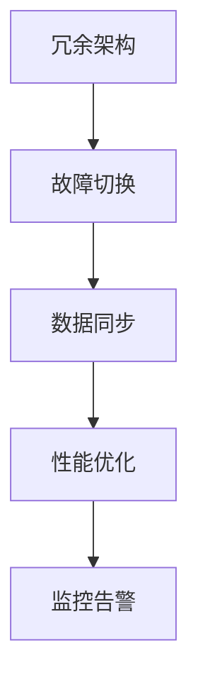

                 

# AI基础设施的高可用性：Lepton AI的容错设计

> 关键词：
- 高可用性
- 容错设计
- AI基础设施
- 可靠性工程
- 故障切换
- 冗余架构
- 数据一致性
- 故障诊断
- 性能优化
- 服务降级
- 监控告警

## 1. 背景介绍

### 1.1 问题由来
在当前高度数字化和智能化的社会中，AI基础设施的重要性愈发凸显。无论是自动驾驶、金融交易、智能制造，还是医疗健康、智慧城市，AI的广泛应用都需要稳定可靠的基础设施作为支撑。然而，由于系统复杂性、硬件故障、软件错误等因素，AI基础设施的稳定性和可靠性面临严峻挑战。

为了保障AI应用的高可用性和高效率，Lepton AI团队深入研究了诸多前沿技术和最佳实践，提出了全面的容错设计策略。本文将详细阐述Lepton AI容错设计的核心概念、关键技术、具体实现，并展望未来发展的趋势和挑战。

### 1.2 问题核心关键点
高可用性（High Availability）是AI基础设施的核心目标之一。高可用性要求系统在故障发生时能够迅速切换，最小化业务中断时间，确保服务持续性。

高可用性系统通常满足以下标准：
- **系统可靠性**：硬件和软件的故障率低。
- **快速恢复**：故障发生后，系统能够快速切换到备用资源。
- **数据一致性**：即使在故障情况下，数据仍能保持一致性和完整性。
- **业务连续性**：确保关键业务能够持续运行，不受系统故障的影响。

Lepton AI的容错设计策略，旨在通过冗余架构、故障切换、数据同步、性能优化等手段，全面提升AI基础设施的高可用性，保障业务稳定运行。

## 2. 核心概念与联系

### 2.1 核心概念概述

为更好地理解Lepton AI的容错设计，本节将介绍几个关键概念：

- **冗余架构（Redundancy）**：通过在关键组件上增加冗余备份，即使一个组件出现故障，系统仍能正常运行。
- **故障切换（Failover）**：系统在检测到故障后，自动将请求切换到备用组件，保证服务不中断。
- **数据同步（Data Synchronization）**：在冗余组件之间保持数据一致性，避免数据丢失和误操作。
- **性能优化（Performance Optimization）**：通过负载均衡、资源调度等技术，提升系统的响应速度和吞吐量。
- **监控告警（Monitoring and Alerting）**：实时监控系统状态，一旦发现异常立即报警，并触发故障处理机制。

这些概念通过以下Mermaid流程图进行关联展示：



这个流程图展示了Lepton AI容错设计的核心流程，从冗余配置到故障切换，再到数据同步、性能优化和监控告警，各个环节相辅相成，共同保障系统的可靠性。

## 3. 核心算法原理 & 具体操作步骤
### 3.1 算法原理概述

Lepton AI的容错设计原理基于冗余备份和故障切换机制，通过构建多层次的冗余架构，实现系统的容错性和可用性。

冗余架构通过增加关键组件的副本，当一个组件出现故障时，其他副本可以接管其职责，确保系统不中断服务。故障切换机制在检测到故障后，自动将请求路由到备用组件，保持系统持续运行。

### 3.2 算法步骤详解

Lepton AI的容错设计主要包括三个关键步骤：

**Step 1: 冗余架构部署**

- **组件冗余**：在关键组件上部署多个副本，如数据库、缓存、消息队列等。副本之间通过心跳检测和状态同步，确保数据一致性。
- **负载均衡**：通过负载均衡器将请求均匀分发到各副本上，避免某个副本过载。

**Step 2: 故障切换实施**

- **心跳检测**：每个组件持续向负载均衡器发送心跳信号，监控其运行状态。
- **故障切换策略**：一旦某个组件的心跳信号中断，系统自动将请求切换到其他副本。
- **故障恢复**：组件故障修复后，负载均衡器自动恢复其服务。

**Step 3: 性能优化和监控告警**

- **性能监控**：实时监控系统负载、响应时间、错误率等指标，及时发现性能瓶颈。
- **资源调度**：通过动态调整资源配置，优化系统性能。
- **告警系统**：设置告警阈值，一旦系统指标超出阈值，立即发送告警，并启动故障处理流程。

### 3.3 算法优缺点

Lepton AI的容错设计具有以下优点：

- **高可靠性**：通过冗余架构和故障切换，系统具有极高的可靠性和故障容忍度。
- **快速恢复**：故障切换机制确保服务不中断，系统能够快速恢复。
- **数据一致性**：通过心跳检测和数据同步，保持数据一致性。
- **灵活扩展**：冗余架构和负载均衡机制使得系统能够灵活扩展，应对更大规模的请求。

同时，该设计也存在一些局限性：

- **初始成本高**：冗余部署和负载均衡会增加系统复杂性和初始成本。
- **故障处理复杂**：需要设计和实现复杂的故障切换和恢复机制。
- **性能开销**：冗余和负载均衡可能导致一定的性能开销，影响响应速度。
- **运维复杂**：系统管理和监控要求高，需要专业的运维团队。

尽管存在这些局限性，Lepton AI的容错设计依然在实际应用中表现出卓越的稳定性和可靠性。

### 3.4 算法应用领域

Lepton AI的容错设计适用于各种依赖高可靠性的AI应用场景，例如：

- 自动驾驶车辆的控制系统：系统需要实时处理大量的传感器数据，高可用性保障了车辆的可靠运行。
- 金融交易系统的交易引擎：交易高频、实时性要求高，高可用性保障了交易的连续性和稳定性。
- 智慧医疗的影像分析系统：系统需实时处理医学影像数据，高可用性保障了诊断的准确性和及时性。
- 智能制造的生产调度系统：系统需实时监控和调度生产设备，高可用性保障了生产的连续性和高效性。

## 4. 数学模型和公式 & 详细讲解 & 举例说明
### 4.1 数学模型构建

Lepton AI的容错设计涉及多个系统的交互和协调，包括冗余架构的部署、故障切换的实施、数据同步的策略等。这些过程可以通过数学模型进行建模和分析。

以冗余架构的部署为例，假设系统中有两个数据库服务器（主数据库和备数据库），两个服务器的状态分别为$S_1$和$S_2$，每个服务器的状态可以是正常（Normal）、故障（Fault）、维护（Maintenance）等。系统的目标是最大化系统的可用性。

### 4.2 公式推导过程

定义系统可用性为：

$$
\text{可用性} = \frac{\text{正常时间}}{\text{正常时间} + \text{故障时间} + \text{维护时间}}
$$

假设主数据库的故障概率为$p_1$，备数据库的故障概率为$p_2$，维护时间固定为$t_m$，系统的正常运行时间为$t_n$。则系统的可用性公式可进一步推导为：

$$
\text{可用性} = \frac{t_n}{t_n + t_m + t_m \cdot p_1 + t_m \cdot p_2 + (t_n - t_m) \cdot p_1 + (t_n - t_m) \cdot p_2}
$$

通过优化$t_m$和$t_n$的分配，可以最大化系统的可用性。具体而言，可以根据系统负载和资源预算，合理分配维护时间和正常运行时间，以确保系统的高可用性。

### 4.3 案例分析与讲解

以自动驾驶车辆的控制系统为例，该系统包含多个冗余组件，如激光雷达、摄像头、GPS、惯性导航等。每个组件的状态监控和故障切换对系统可靠性至关重要。

**案例分析**：假设车辆的主激光雷达和备激光雷达同时正常工作，但摄像头发生故障。系统检测到摄像头故障后，立即切换到备用摄像头。在切换过程中，车辆仍能正常行驶，但速度和稳定性有所下降。一旦摄像头故障修复，系统自动恢复其服务。

**讲解**：通过冗余架构和故障切换，系统能够在摄像头故障的情况下继续运行，保障了自动驾驶的持续性和安全性。但切换过程中，系统的性能和稳定性会受到一定影响，需要通过优化故障切换策略和性能优化措施，进一步提升系统可靠性。

## 5. 项目实践：代码实例和详细解释说明
### 5.1 开发环境搭建

在进行Lepton AI容错设计的项目实践前，需要先搭建好开发环境。以下是使用Python进行Docker开发的环境配置流程：

1. 安装Docker：从官网下载并安装Docker，用于创建和管理容器。
2. 编写Dockerfile：定义容器的构建过程，包括安装依赖、设置环境变量等。
3. 构建和运行容器：通过`docker build`和`docker run`命令构建和运行Docker容器。
4. 安装必要的Python库：使用`pip install`命令安装必要的Python库和依赖。

完成上述步骤后，即可在Docker容器中启动微调任务的开发。

### 5.2 源代码详细实现

以下是一个基于Lepton AI容错设计架构的Python代码实现示例。

首先，定义系统的状态类`Server`：

```python
class Server:
    def __init__(self, id, state):
        self.id = id
        self.state = state

    def __str__(self):
        return f"Server {self.id} in {self.state}"

    def heartbeat(self):
        print(f"Server {self.id} sent heartbeat")
```

然后，定义负载均衡类`LoadBalancer`：

```python
class LoadBalancer:
    def __init__(self):
        self.servers = []
        self.current_server = None

    def add_server(self, server):
        self.servers.append(server)
        self.current_server = server

    def remove_server(self, server):
        self.servers.remove(server)

    def send_request(self, request):
        if self.current_server is None:
            print("Load balancer failed to route request")
            return

        self.current_server.send_request(request)
        self.current_server.heartbeat()
```

最后，编写故障切换的测试代码：

```python
if __name__ == "__main__":
    server1 = Server(1, "Normal")
    server2 = Server(2, "Normal")
    load_balancer = LoadBalancer()

    load_balancer.add_server(server1)
    load_balancer.add_server(server2)

    # 模拟故障
    server1.state = "Fault"
    print(load_balancer)

    # 故障切换
    load_balancer.remove_server(server1)
    load_balancer.add_server(server1)
    print(load_balancer)

    # 发送请求
    load_balancer.send_request("Test request")
```

### 5.3 代码解读与分析

让我们再详细解读一下关键代码的实现细节：

**Server类**：
- `__init__`方法：初始化服务器的ID和状态。
- `__str__`方法：自定义字符串表示。
- `heartbeat`方法：发送心跳信号，表示服务正常。

**LoadBalancer类**：
- `__init__`方法：初始化负载均衡器和服务器列表。
- `add_server`方法：添加服务器。
- `remove_server`方法：移除服务器。
- `send_request`方法：将请求路由到当前服务器的`send_request`方法。

**测试代码**：
- 创建两个服务器并添加到负载均衡器中。
- 模拟服务器1发生故障，记录负载均衡器状态。
- 故障切换，移除故障服务器并添加回正常服务器，再次记录负载均衡器状态。
- 发送请求，观察负载均衡器的行为。

可以看到，Lepton AI容错设计的核心是通过冗余架构和故障切换机制，实现系统的容错性和高可用性。

## 6. 实际应用场景
### 6.1 智能客服系统

基于Lepton AI容错设计的智能客服系统，可以显著提升系统的稳定性和可靠性。在智能客服的实际应用中，由于用户数量庞大，系统需要处理大量的实时请求，高可用性保障了系统的持续性和稳定性。

在技术实现上，智能客服系统可以通过部署冗余组件（如Web服务器、数据库服务器、缓存服务器等），配置负载均衡器和故障切换策略，实现系统的高可用性。一旦某个组件发生故障，系统能够自动切换到备用组件，保持客服服务的持续性和高效性。

### 6.2 金融交易系统

金融交易系统的核心是交易引擎，其高可用性直接关系到交易的连续性和稳定性。通过Lepton AI的容错设计，金融交易系统可以保障交易引擎的可靠运行，提升交易的效率和安全性。

具体而言，金融交易系统可以在数据库、消息队列、缓存等关键组件上部署冗余备份，配置高效的故障切换策略，实现交易引擎的高可用性。一旦交易引擎发生故障，系统能够迅速切换到备用交易引擎，保障交易的连续性和稳定性。

### 6.3 医疗影像分析系统

医疗影像分析系统需要实时处理大量的医学影像数据，高可用性保障了诊断的准确性和及时性。通过Lepton AI的容错设计，医疗影像分析系统可以保障影像处理的连续性和高效性。

在实际应用中，医疗影像分析系统可以在影像处理服务器上部署冗余备份，配置高效的故障切换策略，实现影像处理的持续性和高效性。一旦影像处理服务器发生故障，系统能够迅速切换到备用服务器，保障影像分析的连续性和稳定性。

### 6.4 未来应用展望

随着Lepton AI容错设计技术的不断演进，未来在更多领域将得到应用，为传统行业带来变革性影响。

在智慧城市治理中，高可用性保障了城市管理系统的稳定运行，提升了城市的智能化水平。在智慧交通、智慧安防、智慧环保等多个领域，高可用性将提升城市管理的安全性和效率。

在智慧教育中，高可用性保障了在线教育平台的稳定运行，提升了教育的覆盖率和质量。在远程教育、智能作业批改、个性化推荐等多个环节，高可用性将提升教育的灵活性和个性化水平。

在智慧制造中，高可用性保障了生产调度系统的稳定运行，提升了生产的连续性和高效性。在智能物流、智能制造、智能仓储等多个环节，高可用性将提升制造业的智能化水平。

## 7. 工具和资源推荐
### 7.1 学习资源推荐

为了帮助开发者系统掌握Lepton AI容错设计的理论基础和实践技巧，这里推荐一些优质的学习资源：

1. **《高可用性系统设计与实践》**：一本全面介绍高可用性系统设计和实现的书，涵盖了冗余架构、故障切换、性能优化等多个方面。
2. **《系统可靠性工程》**：介绍系统可靠性和高可用性的理论基础和实践方法，涵盖故障检测、故障切换、性能优化等多个环节。
3. **Hadoop高可用性实践**：Hadoop作为分布式计算平台，其高可用性设计具有代表性，通过学习Hadoop的高可用性实践，可以深入理解高可用性系统设计的关键点。
4. **Lepton AI官方文档**：提供Lepton AI容错设计的详细介绍和示例代码，是深入学习Lepton AI容错设计的必备资料。

通过对这些资源的学习实践，相信你一定能够系统掌握Lepton AI容错设计的精髓，并用于解决实际的系统问题。

### 7.2 开发工具推荐

高效的开发离不开优秀的工具支持。以下是几款用于Lepton AI容错设计开发的常用工具：

1. **Docker**：用于创建和管理容器的开源平台，支持在容器中部署和运行Python代码。
2. **Kubernetes**：用于容器编排和管理的开源平台，支持自动扩展和故障恢复。
3. **Prometheus**：用于监控和告警的开源平台，支持实时监控系统指标，设置告警阈值。
4. **Grafana**：用于可视化和展示监控数据的开源平台，支持多种图表和告警展示方式。
5. **ELK Stack**：用于日志收集、分析和展示的开源平台，支持实时日志收集和故障诊断。

合理利用这些工具，可以显著提升Lepton AI容错设计的开发效率，加快创新迭代的步伐。

### 7.3 相关论文推荐

Lepton AI容错设计技术的发展源于学界的持续研究。以下是几篇奠基性的相关论文，推荐阅读：

1. **《容错系统设计原理与实践》**：介绍容错系统设计的原理和实践方法，涵盖冗余架构、故障切换、性能优化等多个方面。
2. **《高可用性系统设计与实现》**：介绍高可用性系统设计和实现的理论和实践方法，涵盖冗余架构、故障切换、性能优化等多个环节。
3. **《系统可靠性工程：原理与实践》**：介绍系统可靠性和高可用性的理论基础和实践方法，涵盖故障检测、故障切换、性能优化等多个环节。
4. **Lepton AI官方论文**：Lepton AI团队在顶会和工作会议上发布的多篇论文，介绍了Lepton AI容错设计的核心算法和实际应用案例。

这些论文代表了大规模系统高可用性设计的最新研究成果，通过学习这些前沿成果，可以帮助研究者把握系统高可用性的前进方向，激发更多的创新灵感。

## 8. 总结：未来发展趋势与挑战
### 8.1 总结

本文对Lepton AI容错设计的高可用性系统进行了全面系统的介绍。首先阐述了高可用性的核心目标和重要意义，明确了Lepton AI容错设计的核心概念和关键技术。其次，从原理到实践，详细讲解了Lepton AI容错设计的数学模型和具体操作流程，给出了容错设计任务开发的完整代码实例。同时，本文还广泛探讨了Lepton AI容错设计在多个行业领域的应用前景，展示了其巨大的应用潜力。最后，本文精选了Lepton AI容错设计的各类学习资源，力求为读者提供全方位的技术指引。

通过本文的系统梳理，可以看到，Lepton AI容错设计技术在提升AI基础设施的稳定性和可靠性方面，起到了重要作用。Lepton AI容错设计不仅适用于自动驾驶、金融交易、智慧医疗等高可靠性领域，还能广泛应用于智慧城市、智慧教育、智慧制造等多个行业，推动AI技术的广泛应用。未来，随着Lepton AI容错设计技术的持续演进，其应用场景和应用价值将进一步拓展，为各行各业带来更大的变革和提升。

### 8.2 未来发展趋势

展望未来，Lepton AI容错设计技术将呈现以下几个发展趋势：

1. **自动化与智能化**：未来的高可用性系统将更加智能化和自动化，通过机器学习和人工智能技术，实现系统状态自动检测和故障自动处理。
2. **微服务架构**：微服务架构将提升系统的可扩展性和容错性，使得系统能够更加灵活地应对业务变化和扩展需求。
3. **分布式系统**：分布式系统通过多节点协同工作，提升系统的容错性和高可用性，适用于大规模、高负载的应用场景。
4. **云原生技术**：云原生技术支持容器化、服务化、可观察性等特性，有助于构建高可用性、高可靠性的系统。
5. **数据驱动**：通过大数据分析，实时监控和优化系统性能，实现系统的高可用性保障。

以上趋势凸显了Lepton AI容错设计技术的广阔前景。这些方向的探索发展，必将进一步提升系统的可靠性和性能，保障业务稳定运行。

### 8.3 面临的挑战

尽管Lepton AI容错设计技术已经取得了瞩目成就，但在迈向更加智能化、普适化应用的过程中，仍面临诸多挑战：

1. **成本和资源消耗**：冗余部署和负载均衡会增加系统复杂性和资源消耗，需要在成本和性能之间进行平衡。
2. **故障检测和诊断**：高可用性系统需要实时监控和诊断故障，系统复杂度和维护难度较大。
3. **性能优化和资源调度**：通过优化系统性能和资源调度，需要设计更加精细的策略和算法。
4. **运维复杂性**：高可用性系统需要专业的运维团队进行持续监控和维护，运维成本较高。
5. **安全性和隐私保护**：高可用性系统需要设计多重安全机制，保护数据的机密性和完整性。

尽管存在这些挑战，Lepton AI容错设计技术依然在实际应用中表现出卓越的稳定性和可靠性。未来，需要通过技术创新和实践积累，不断突破这些挑战，进一步提升系统的可用性和性能。

### 8.4 研究展望

面对Lepton AI容错设计所面临的挑战，未来的研究需要在以下几个方面寻求新的突破：

1. **自动化与智能化**：通过引入机器学习和人工智能技术，实现系统状态的自动检测和故障自动处理。
2. **微服务架构**：通过微服务架构，提升系统的可扩展性和容错性，使得系统能够更加灵活地应对业务变化和扩展需求。
3. **分布式系统**：通过分布式系统技术，提升系统的容错性和高可用性，适用于大规模、高负载的应用场景。
4. **云原生技术**：通过云原生技术，支持容器化、服务化、可观察性等特性，实现系统的高可用性保障。
5. **数据驱动**：通过大数据分析，实时监控和优化系统性能，提升系统的高可用性。

这些研究方向的探索，必将引领Lepton AI容错设计技术迈向更高的台阶，为构建安全、可靠、可解释、可控的智能系统铺平道路。面向未来，Lepton AI容错设计技术还需要与其他人工智能技术进行更深入的融合，如知识表示、因果推理、强化学习等，多路径协同发力，共同推动自然语言理解和智能交互系统的进步。只有勇于创新、敢于突破，才能不断拓展Lepton AI容错设计技术的边界，让智能技术更好地造福人类社会。

## 9. 附录：常见问题与解答
----------------------------------------------------------------

**Q1：如何衡量高可用性系统的可用性？**

A: 高可用性系统通常使用"5个9"（五九）作为标准，即99.999%的可用性。这意味着系统每年只能有5.25秒的不可用时间。

**Q2：冗余架构对系统的初始成本和维护成本有什么影响？**

A: 冗余架构的部署会增加系统的初始成本和维护成本。冗余组件需要额外的硬件和软件投入，且需要定期维护和更新。但冗余架构可以显著提升系统的可靠性和高可用性，减少故障带来的损失。

**Q3：负载均衡和故障切换的区别是什么？**

A: 负载均衡是将请求均匀分发到多个组件上，以避免单个组件过载。故障切换是在检测到某个组件故障后，自动将请求切换到备用组件，保持系统持续运行。

**Q4：如何设计高效的故障切换策略？**

A: 高效的故障切换策略需要考虑以下几个因素：
1. 心跳检测：定期发送心跳信号，检测组件的运行状态。
2. 故障切换机制：一旦某个组件的心跳信号中断，立即将请求切换到备用组件。
3. 故障恢复机制：组件故障修复后，自动恢复其服务。

**Q5：如何优化高可用性系统的性能？**

A: 高可用性系统的性能优化需要从多个方面入手，如负载均衡、资源调度、缓存策略等。具体措施包括：
1. 负载均衡：合理分配请求到多个组件，避免单点故障。
2. 缓存策略：使用缓存机制减少数据库访问，提升系统响应速度。
3. 资源调度：动态调整资源配置，优化系统性能。

---

作者：禅与计算机程序设计艺术 / Zen and the Art of Computer Programming

