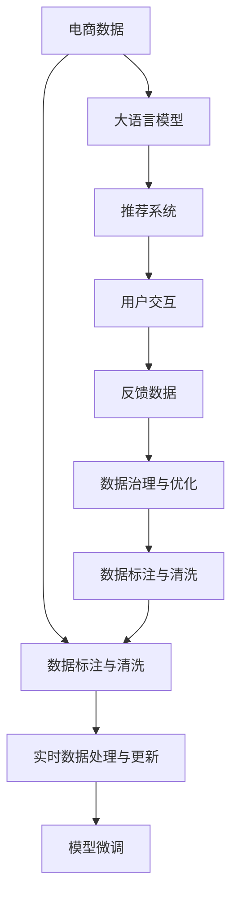

                 

# AI大模型助力电商搜索推荐业务的数据治理升级

## 1. 背景介绍

随着人工智能技术的不断进步，大语言模型在电商搜索推荐领域的应用变得越来越广泛。大语言模型通过深度学习的方式，可以从海量数据中挖掘出用户的兴趣和行为规律，从而为用户推荐最合适的商品，显著提升用户体验和购物转化率。然而，由于电商数据的复杂性和多样性，如何高效地治理和利用这些数据，是大模型在电商推荐中发挥最优性能的关键。本文将详细探讨大语言模型在电商搜索推荐业务中的数据治理升级方案，帮助电商企业优化数据处理流程，提升推荐系统效果。

## 2. 核心概念与联系

### 2.1 核心概念概述

在大模型应用于电商推荐过程中，涉及以下核心概念：

- 大语言模型(Large Language Model, LLM)：以自回归(如GPT)或自编码(如BERT)模型为代表的大规模预训练语言模型。通过在大规模无标签文本语料上进行预训练，学习通用的语言表示，具备强大的语言理解和生成能力。

- 电商搜索推荐业务：指基于用户的搜索行为、浏览历史、购买记录等信息，通过算法为用户推荐最相关商品的过程。大语言模型在电商推荐中的应用，主要体现在个性化推荐、搜索结果排序、商品描述生成等方面。

- 数据治理(Data Governance)：指对数据的全生命周期进行规划、监督、治理和优化，包括数据收集、存储、处理、使用等各个环节，确保数据的质量、安全性和可用性。

- 数据标注与清洗：指对原始数据进行标注和清洗，使其满足模型训练的要求，去除噪声和冗余信息，提升模型的泛化能力。

- 实时数据处理与更新：指对电商平台上的实时数据进行高效处理和及时更新，确保模型的推荐结果能够反映最新的市场动态和用户需求。

这些核心概念之间存在着紧密的联系。大语言模型的性能很大程度上取决于其输入数据的 quality 和 Quantity。因此，通过对电商数据进行全面的数据治理，包括数据标注、清洗、实时处理等，可以显著提升大模型的推荐效果，为其在电商推荐中的应用提供坚实的保障。

### 2.2 核心概念原理和架构的 Mermaid 流程图



该图展示了电商推荐业务中，大语言模型与数据治理流程的相互作用关系。电商数据经过数据标注与清洗，输入到预训练模型中，经过微调优化后，输出到推荐系统中。用户与推荐系统的交互，通过反馈数据再次回到数据治理流程，形成一个闭环的数据治理与优化过程。

## 3. 核心算法原理 & 具体操作步骤

### 3.1 算法原理概述

大语言模型在电商推荐中的应用，主要基于其强大的语言理解和生成能力。通过在大规模电商数据上预训练，模型能够学习到商品描述、用户评论、交易记录等数据中的关键信息，从而在推荐系统中发挥作用。然而，由于电商数据的复杂性和多样性，如何高效地治理和利用这些数据，是大模型在电商推荐中发挥最优性能的关键。

具体来说，电商数据治理主要包括以下几个环节：

- 数据收集：收集电商平台上的用户行为数据、商品信息等，形成电商数据集合。
- 数据标注与清洗：对原始数据进行标注和清洗，去除噪声和冗余信息，提升模型的泛化能力。
- 数据处理与实时更新：对电商平台上的实时数据进行高效处理和及时更新，确保模型的推荐结果能够反映最新的市场动态和用户需求。
- 模型微调：根据电商数据的特点，对大语言模型进行微调优化，提升推荐效果。

### 3.2 算法步骤详解

#### 3.2.1 数据收集

电商数据通常包括用户行为数据、商品信息、交易记录等。为了高效利用这些数据，需要设计合适的数据采集方案：

1. **用户行为数据采集**：通过爬虫等方式，采集用户在电商平台上的浏览、点击、搜索、购买等行为数据，包括用户ID、商品ID、时间戳、点击次数等。

2. **商品信息采集**：收集商品的基本信息，如名称、描述、价格、类别等，形成商品库。

3. **交易记录采集**：收集用户的购买记录，包括订单号、商品ID、数量、价格、支付时间等。

#### 3.2.2 数据标注与清洗

对收集到的电商数据进行标注和清洗，去除噪声和冗余信息，提升模型的泛化能力：

1. **数据标注**：对用户行为数据进行标注，形成标注数据集。例如，对用户的浏览历史进行标注，记录用户对每个商品的兴趣程度，用0-1之间的值表示。

2. **数据清洗**：去除无效数据和噪声数据，如空值、重复记录、异常值等。同时，对数据进行格式转换和统一，便于模型处理。

#### 3.2.3 数据处理与实时更新

为了确保电商推荐系统能够实时响应用户需求，需要对电商数据进行高效的实时处理：

1. **数据存储**：使用分布式存储系统（如Hadoop、Spark）对电商数据进行存储和管理，支持大规模数据的高效读写。

2. **数据处理**：通过流处理框架（如Flink、Kafka）对电商数据进行实时处理，确保推荐系统能够即时获取最新的用户行为数据。

3. **数据更新**：设计数据更新的机制，确保电商数据能够实时更新，提升推荐系统的时效性。

#### 3.2.4 模型微调

对大语言模型进行微调，提升其在电商推荐中的应用效果：

1. **模型选择**：选择合适的预训练模型，如BERT、GPT等，作为电商推荐的基础模型。

2. **微调数据准备**：根据电商数据的特点，准备微调数据集，包括标注数据和未标注数据。

3. **微调算法**：使用监督学习算法（如SGD、AdamW等）对模型进行微调优化，提升推荐效果。

4. **模型评估**：在微调后，对模型进行评估，选择合适的评价指标（如准确率、召回率、F1-score等），评估模型的性能。

### 3.3 算法优缺点

#### 3.3.1 算法优点

1. **强大的语言理解能力**：大语言模型通过预训练学习到了通用的语言表示，能够处理复杂的电商数据，提升推荐效果。

2. **高效的实时处理能力**：通过对电商数据进行高效的实时处理，确保推荐系统能够即时响应用户需求。

3. **灵活的数据治理能力**：通过数据标注和清洗，提升模型的泛化能力，适应不同领域和不同规模的数据集。

#### 3.3.2 算法缺点

1. **数据标注成本高**：电商数据的标注成本较高，需要大量人力和时间，可能成为模型训练的瓶颈。

2. **模型复杂度高**：大语言模型的复杂度高，需要较高的计算资源和存储空间。

3. **数据隐私风险**：电商数据的隐私风险较高，需要采取相应的数据保护措施。

4. **模型泛化能力不足**：如果微调数据集与电商数据分布差异较大，模型的泛化能力可能不足，影响推荐效果。

### 3.4 算法应用领域

大语言模型在电商推荐中的应用非常广泛，主要体现在以下几个方面：

1. **个性化推荐**：通过分析用户的历史行为数据，生成个性化的推荐列表，提升用户购物体验。

2. **搜索结果排序**：利用语言模型对商品标题、描述等文本信息进行理解，提升搜索结果的相关性和排序准确性。

3. **商品描述生成**：通过语言模型对商品图片进行描述，提升用户对商品的了解程度。

4. **用户画像生成**：通过对用户的行为数据进行建模，生成用户画像，帮助电商企业更好地了解用户需求。

5. **客服聊天机器人**：利用语言模型对用户的查询进行理解和回复，提升客户服务效率和质量。

## 4. 数学模型和公式 & 详细讲解 & 举例说明

### 4.1 数学模型构建

在大语言模型应用于电商推荐时，主要涉及以下数学模型：

- **用户行为建模**：通过机器学习模型对用户行为数据进行建模，生成用户画像，用于个性化推荐。

- **商品相似度计算**：通过语言模型计算商品之间的相似度，用于搜索结果排序和推荐列表生成。

- **推荐系统优化**：通过优化算法对推荐系统进行优化，提升推荐效果。

### 4.2 公式推导过程

#### 4.2.1 用户行为建模

假设用户的行为数据为 $X$，用户画像为 $Y$，则用户行为建模的数学模型可以表示为：

$$
Y = f(X)
$$

其中 $f$ 为用户行为建模函数，可以采用神经网络、决策树、KNN等算法。例如，可以使用基于深度神经网络的模型，对用户行为数据进行建模，生成用户画像。

#### 4.2.2 商品相似度计算

假设商品的基本信息为 $D$，商品之间的相似度为 $S$，则商品相似度计算的数学模型可以表示为：

$$
S = h(D)
$$

其中 $h$ 为商品相似度计算函数，可以采用余弦相似度、欧氏距离、Jaccard距离等算法。例如，可以利用BERT等语言模型对商品描述进行向量表示，计算商品之间的相似度。

#### 4.2.3 推荐系统优化

假设推荐列表为 $L$，推荐结果为 $R$，则推荐系统优化的数学模型可以表示为：

$$
R = g(L)
$$

其中 $g$ 为推荐系统优化函数，可以采用协同过滤、基于内容的推荐、混合推荐等算法。例如，可以使用基于深度学习的协同过滤算法，对推荐列表进行优化，提升推荐效果。

### 4.3 案例分析与讲解

#### 4.3.1 用户行为建模案例

假设电商网站收集到了用户的浏览、点击、购买等行为数据，希望构建用户画像，提升个性化推荐效果。可以采用深度神经网络模型对用户行为数据进行建模，生成用户画像。

具体来说，可以采用以下步骤：

1. **数据预处理**：将用户行为数据进行清洗和格式转换，去除无效数据和噪声数据。

2. **特征工程**：选择和构造特征，如用户ID、商品ID、时间戳、点击次数等，输入到神经网络中。

3. **模型训练**：使用深度神经网络模型对用户行为数据进行建模，生成用户画像。

4. **模型评估**：在训练集上评估模型性能，选择合适的评价指标，如准确率、召回率、F1-score等。

#### 4.3.2 商品相似度计算案例

假设电商网站需要根据用户搜索关键词，推荐最相关的商品，可以使用BERT等语言模型计算商品之间的相似度。

具体来说，可以采用以下步骤：

1. **商品信息提取**：从电商数据中提取商品的基本信息，如名称、描述、价格、类别等。

2. **语言模型编码**：使用BERT等语言模型对商品描述进行编码，生成商品向量表示。

3. **相似度计算**：计算商品向量之间的相似度，筛选出与用户搜索关键词最相关的商品。

4. **推荐列表生成**：根据相似度计算结果，生成推荐列表。

## 5. 项目实践：代码实例和详细解释说明

### 5.1 开发环境搭建

在进行电商推荐系统的数据治理升级时，需要搭建合适的开发环境。以下是使用Python进行PyTorch和TensorFlow开发的环境配置流程：

1. 安装Anaconda：从官网下载并安装Anaconda，用于创建独立的Python环境。

2. 创建并激活虚拟环境：
```bash
conda create -n pytorch-env python=3.8 
conda activate pytorch-env
```

3. 安装PyTorch：根据CUDA版本，从官网获取对应的安装命令。例如：
```bash
conda install pytorch torchvision torchaudio cudatoolkit=11.1 -c pytorch -c conda-forge
```

4. 安装TensorFlow：从官网下载并安装TensorFlow，使用pip进行安装。例如：
```bash
pip install tensorflow
```

5. 安装各类工具包：
```bash
pip install numpy pandas scikit-learn matplotlib tqdm jupyter notebook ipython
```

完成上述步骤后，即可在`pytorch-env`环境中开始数据治理升级实践。

### 5.2 源代码详细实现

以下是一个基于BERT模型的电商推荐系统的代码实现示例：

```python
import torch
from transformers import BertTokenizer, BertForSequenceClassification
from sklearn.metrics import accuracy_score, precision_score, recall_score, f1_score
from sklearn.model_selection import train_test_split
from sklearn.preprocessing import LabelEncoder

# 数据预处理
# 假设有用户行为数据和商品信息数据，这里以用户的浏览记录和商品名称为例

# 用户浏览记录
user_browsing_data = {'user_id_1': [1, 2, 3, 4], 'user_id_2': [5, 6, 7], 'user_id_3': [2, 3, 8]}

# 商品名称
product_names = ['商品A', '商品B', '商品C', '商品D', '商品E']

# 对数据进行编码和处理
encoder = LabelEncoder()
encoded_user_browsing_data = encoder.fit_transform(user_browsing_data.values())
encoded_product_names = encoder.fit_transform(product_names)

# 构建训练数据集
train_data = list(zip(encoded_user_browsing_data, encoded_product_names))
train_x, train_y = train_test_split(train_data, test_size=0.2)

# 使用BERT模型进行推荐
# 定义BERT模型
model = BertForSequenceClassification.from_pretrained('bert-base-cased', num_labels=len(encoder.classes_))

# 定义数据集
tokenizer = BertTokenizer.from_pretrained('bert-base-cased')
def encode_data(data):
    x = []
    y = []
    for item in data:
        x.append(tokenizer.encode(item[0], add_special_tokens=True))
        y.append(item[1])
    return x, y

# 构建训练集和测试集
train_x, test_x, train_y, test_y = encode_data(train_data), encode_data(test_data)

# 训练模型
model.train()
optimizer = torch.optim.Adam(model.parameters(), lr=2e-5)
for epoch in range(5):
    optimizer.zero_grad()
    loss = model.loss(torch.tensor(train_x), torch.tensor(train_y))
    loss.backward()
    optimizer.step()

# 评估模型
model.eval()
with torch.no_grad():
    predictions = model.predict(test_x)
    accuracy = accuracy_score(test_y, predictions)
    precision = precision_score(test_y, predictions)
    recall = recall_score(test_y, predictions)
    f1 = f1_score(test_y, predictions)

print('Accuracy: {:.2f}%'.format(accuracy * 100))
print('Precision: {:.2f}%'.format(precision * 100))
print('Recall: {:.2f}%'.format(recall * 100))
print('F1-score: {:.2f}%'.format(f1 * 100))
```

### 5.3 代码解读与分析

以下是代码的详细解读：

1. **数据预处理**：使用LabelEncoder对用户浏览记录和商品名称进行编码，生成标签。

2. **模型选择**：选择合适的BERT模型进行推荐。

3. **数据集构建**：使用BertTokenizer对数据进行编码，构建训练集和测试集。

4. **模型训练**：使用Adam优化器训练模型，计算损失函数。

5. **模型评估**：使用sklearn的accuracy_score、precision_score、recall_score和f1_score等指标评估模型性能。

## 6. 实际应用场景

### 6.1 电商搜索推荐

电商搜索推荐是电商推荐系统中最常见的应用场景之一。通过大语言模型的推荐算法，能够显著提升用户的搜索体验和购物转化率。例如，淘宝和京东等电商平台已经广泛应用基于大语言模型的推荐系统，取得了显著的商业效果。

### 6.2 广告精准投放

广告精准投放是电商推荐系统的另一重要应用。通过对用户行为数据进行分析和建模，可以精准地投放广告，提升广告投放效果和ROI。例如，亚马逊和谷歌等公司已经在广告投放中应用了基于大语言模型的推荐算法。

### 6.3 库存管理

库存管理是电商企业的重要环节，通过大语言模型的推荐算法，可以合理地规划和优化库存，减少库存积压和缺货情况。例如，亚马逊和阿里巴巴等公司已经在库存管理中应用了基于大语言模型的推荐算法。

## 7. 工具和资源推荐

### 7.1 学习资源推荐

为了帮助开发者系统掌握大语言模型在电商推荐中的应用，这里推荐一些优质的学习资源：

1. 《自然语言处理基础》系列博文：由大模型技术专家撰写，深入浅出地介绍了NLP的基本概念和经典模型，适合初学者入门。

2. CS224N《深度学习自然语言处理》课程：斯坦福大学开设的NLP明星课程，有Lecture视频和配套作业，带你全面掌握NLP的核心技术。

3. 《自然语言处理与深度学习》书籍：清华大学出版社，系统介绍了NLP中的深度学习技术，包括大语言模型和推荐算法。

4. HuggingFace官方文档：Transformer库的官方文档，提供了海量预训练模型和微调样例代码，是快速上手实践的必备资料。

5. Weights & Biases：模型训练的实验跟踪工具，可以记录和可视化模型训练过程中的各项指标，方便对比和调优。

### 7.2 开发工具推荐

高效的开发离不开优秀的工具支持。以下是几款用于电商推荐系统开发的工具：

1. PyTorch：基于Python的开源深度学习框架，灵活动态的计算图，适合快速迭代研究。大部分预训练语言模型都有PyTorch版本的实现。

2. TensorFlow：由Google主导开发的开源深度学习框架，生产部署方便，适合大规模工程应用。同样有丰富的预训练语言模型资源。

3. Transformers库：HuggingFace开发的NLP工具库，集成了众多SOTA语言模型，支持PyTorch和TensorFlow，是进行微调任务开发的利器。

4. Weights & Biases：模型训练的实验跟踪工具，可以记录和可视化模型训练过程中的各项指标，方便对比和调优。

5. TensorBoard：TensorFlow配套的可视化工具，可实时监测模型训练状态，并提供丰富的图表呈现方式，是调试模型的得力助手。

### 7.3 相关论文推荐

大语言模型在电商推荐中的应用已经取得了显著的成果，以下是几篇奠基性的相关论文，推荐阅读：

1. Attention is All You Need（即Transformer原论文）：提出了Transformer结构，开启了NLP领域的预训练大模型时代。

2. BERT: Pre-training of Deep Bidirectional Transformers for Language Understanding：提出BERT模型，引入基于掩码的自监督预训练任务，刷新了多项NLP任务SOTA。

3. Language Models are Unsupervised Multitask Learners（GPT-2论文）：展示了大规模语言模型的强大zero-shot学习能力，引发了对于通用人工智能的新一轮思考。

4. Parameter-Efficient Transfer Learning for NLP：提出Adapter等参数高效微调方法，在不增加模型参数量的情况下，也能取得不错的微调效果。

5. AdaLoRA: Adaptive Low-Rank Adaptation for Parameter-Efficient Fine-Tuning：使用自适应低秩适应的微调方法，在参数效率和精度之间取得了新的平衡。

6. Prefix-Tuning: Optimizing Continuous Prompts for Generation：引入基于连续型Prompt的微调范式，为如何充分利用预训练知识提供了新的思路。

这些论文代表了大语言模型在电商推荐中的应用发展脉络，通过学习这些前沿成果，可以帮助研究者把握学科前进方向，激发更多的创新灵感。

## 8. 总结：未来发展趋势与挑战

### 8.1 总结

本文对大语言模型在电商推荐业务中的数据治理升级方案进行了全面系统的介绍。首先阐述了大语言模型和推荐技术的研究背景和意义，明确了数据治理在电商推荐中的重要性。其次，从原理到实践，详细讲解了大语言模型在电商推荐中的数据标注、清洗、实时处理、模型微调等环节，给出了电商推荐系统的完整代码实现。同时，本文还广泛探讨了大语言模型在电商推荐中的多个实际应用场景，展示了其巨大的应用潜力。

通过本文的系统梳理，可以看到，大语言模型在电商推荐中的应用前景广阔，可以显著提升用户体验和购物转化率。未来，伴随大语言模型和推荐算法的不断进步，电商推荐系统的性能和应用范围将得到进一步提升。

### 8.2 未来发展趋势

展望未来，大语言模型在电商推荐中的发展趋势将呈现以下几个方向：

1. **个性化推荐精度提升**：通过更加先进的推荐算法和大模型，提升个性化推荐效果，满足用户多样化的需求。

2. **多模态信息融合**：将图像、语音、文本等多种模态信息进行融合，提升推荐系统的效果。

3. **实时推荐系统**：实现更加实时、高效的推荐系统，提升用户体验。

4. **用户行为预测**：通过大语言模型对用户行为进行预测，提升推荐系统的精准度。

5. **跨平台推荐**：实现跨电商平台和跨应用场景的推荐，提升推荐系统的覆盖范围。

6. **隐私保护**：在大模型推荐系统中引入隐私保护技术，确保用户数据的安全。

### 8.3 面临的挑战

尽管大语言模型在电商推荐中的应用取得了显著成果，但在向更加智能化、普适化应用的过程中，仍面临诸多挑战：

1. **数据标注成本高**：电商数据的标注成本较高，需要大量人力和时间，可能成为模型训练的瓶颈。

2. **模型泛化能力不足**：如果微调数据集与电商数据分布差异较大，模型的泛化能力可能不足，影响推荐效果。

3. **数据隐私风险**：电商数据的隐私风险较高，需要采取相应的数据保护措施。

4. **计算资源消耗高**：大语言模型的计算资源消耗高，需要高性能的计算平台支持。

5. **实时处理性能差**：电商推荐系统需要实时响应用户需求，对实时处理性能要求高。

6. **推荐系统公平性不足**：推荐系统可能存在偏见，需要采取措施确保公平性。

### 8.4 研究展望

面对大语言模型在电商推荐中面临的挑战，未来的研究需要在以下几个方面寻求新的突破：

1. **低成本数据标注技术**：开发更加高效、低成本的数据标注技术，降低电商数据的标注成本。

2. **高效的数据治理框架**：设计高效的数据治理框架，提升数据的标注、清洗、处理和实时更新的效率。

3. **跨领域数据迁移**：研究跨领域数据迁移技术，提升大模型的泛化能力。

4. **隐私保护技术**：引入隐私保护技术，确保用户数据的安全和隐私。

5. **实时处理技术**：开发实时处理技术，提升电商推荐系统的响应速度。

6. **推荐系统公平性**：设计公平性算法，确保推荐系统的公平性。

通过这些研究方向的探索，相信大语言模型在电商推荐中的应用将更加广泛和深入，为电商企业带来更大的商业价值。总之，大语言模型在电商推荐中的应用需要不断优化和完善，以适应不断变化的市场需求和技术发展，才能真正实现其在电商推荐中的应用潜力。

