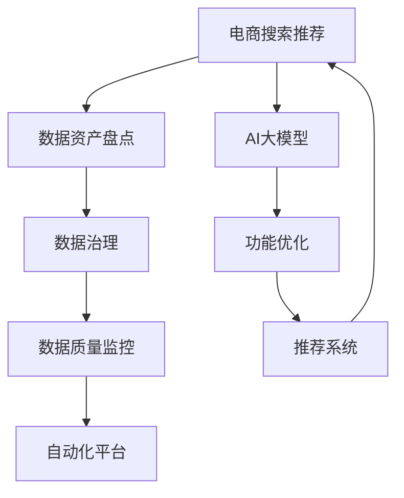

                 

# AI大模型助力电商搜索推荐业务的数据资产盘点自动化平台功能优化与应用实践

> 关键词：电商搜索推荐, AI大模型, 数据资产盘点, 自动化平台, 功能优化

## 1. 背景介绍

### 1.1 问题由来
随着电商业务的快速发展，数据资产作为电商企业的核心资产，其管理和利用愈发重要。在复杂的电商搜索推荐系统中，数据的结构化和标准化一直是困扰电商企业的难题。传统的业务部门各自为战，数据分散、格式不一、不标准，导致数据治理效率低下，严重影响了电商搜索推荐系统的精度和效果。为解决数据盘点和自动化治理的痛点问题，AI大模型在电商搜索推荐系统中的引入提供了新的思路。

基于此，本文介绍了在电商搜索推荐业务中，如何利用AI大模型进行数据资产盘点自动化平台的搭建，实现数据标准化、数据治理自动化、数据质量监控和提升。本文将从数据盘点和自动化治理的角度，探讨AI大模型如何助力电商搜索推荐业务的发展，并通过实际案例，展示AI大模型在电商数据治理中的应用效果。

### 1.2 问题核心关键点
本文的主要目标是通过AI大模型实现电商搜索推荐业务中数据资产的自动化盘点，提升数据治理效率和数据质量，进而提升电商搜索推荐系统的精准度和推荐效果。具体来说，本文的核心关键点包括：
- 数据资产盘点的自动化：通过AI大模型自动发现、识别、整合电商企业分散的数据资源，完成数据的全面盘点。
- 数据治理自动化：利用AI大模型对电商搜索推荐系统中各个环节的数据进行标准化治理，提升数据的规范性和一致性。
- 数据质量监控和提升：通过AI大模型实时监控数据质量，及时发现并修正数据质量问题，保障数据质量持续提升。
- 电商搜索推荐系统优化：借助AI大模型优化电商搜索推荐算法，提升推荐精度和个性化推荐效果。

本文的主要贡献是：
1. 提供了基于AI大模型的电商数据资产盘点自动化平台的设计和实现方法。
2. 展示了AI大模型在电商搜索推荐业务中的应用效果和实际案例。
3. 讨论了AI大模型在数据治理、数据质量提升和推荐系统优化等方面的挑战和未来趋势。

## 2. 核心概念与联系

### 2.1 核心概念概述

为更好地理解基于AI大模型的电商搜索推荐业务数据资产盘点自动化平台的构建，本节将介绍几个密切相关的核心概念：

- AI大模型：指基于大规模深度学习模型，如Transformer等，在预训练语料上进行自监督学习，获得丰富的语言知识，可用于各种下游任务的技术。
- 电商搜索推荐：指电商平台上用户通过搜索框输入关键词，系统根据用户输入和历史行为，推荐用户可能感兴趣的商品的技术。
- 数据资产盘点：指对电商企业分散的数据资源进行全面盘点，包括数据收集、数据整合、数据标注等过程。
- 数据治理：指对电商搜索推荐系统中的数据进行标准化治理，包括数据清洗、数据归一化、数据一致性等。
- 数据质量监控：指对电商搜索推荐系统中的数据质量进行实时监控，发现并修正数据质量问题。
- 自动化平台：指通过自动化技术，实现电商搜索推荐系统中数据治理、数据质量监控、数据盘点的自动化。

这些核心概念之间的逻辑关系可以通过以下Mermaid流程图来展示：



这个流程图展示了大语言模型与电商搜索推荐业务中数据资产盘点自动化平台之间的关系：

1. 电商搜索推荐系统以AI大模型为核心的推荐算法为依托，通过数据资产盘点、数据治理和数据质量监控，保障数据质量和规范性。
2. 自动化平台依托AI大模型的功能优化，实现数据的自动化盘点、治理和监控，从而提升电商搜索推荐系统的精准度和个性化推荐效果。
3. AI大模型作为电商搜索推荐业务的核心技术，能够优化推荐算法，提升推荐效果。

## 3. 核心算法原理 & 具体操作步骤
### 3.1 算法原理概述

基于AI大模型的电商搜索推荐业务数据资产盘点自动化平台的搭建，本质上是将AI大模型的知识应用于电商搜索推荐业务数据治理的过程。其核心思想是：利用AI大模型强大的自然语言处理能力，自动识别电商企业分散的数据资源，并对其进行标准化治理，提升数据质量，最终优化电商搜索推荐算法，提升推荐效果。

具体来说，基于AI大模型的电商搜索推荐业务数据资产盘点自动化平台的设计可以分为以下几个步骤：

1. 数据资产盘点：利用AI大模型的自然语言处理能力，自动发现和整合电商企业分散的数据资源。
2. 数据治理自动化：通过AI大模型的规则学习，实现电商搜索推荐系统中各个环节的数据标准化治理。
3. 数据质量监控：利用AI大模型的预测能力，实时监控数据质量，发现并修正数据质量问题。
4. 功能优化：通过AI大模型的迁移学习，优化电商搜索推荐算法，提升推荐效果。

### 3.2 算法步骤详解

基于AI大模型的电商搜索推荐业务数据资产盘点自动化平台的具体操作步骤如下：

**Step 1: 数据采集与预处理**

1. 数据采集：通过爬虫等技术手段，收集电商企业分散在各个系统中的数据，包括用户行为数据、商品数据、物流数据等。

2. 数据预处理：对采集到的数据进行去重、去噪、清洗、格式化等预处理，确保数据的质量和一致性。

**Step 2: 数据资产盘点**

1. 构建数据资产盘点模型：利用自然语言处理技术，构建电商搜索推荐业务中的数据资产盘点模型。该模型能够自动识别和整合电商企业分散的数据资源，生成数据资产盘点报告。

2. 数据资源识别：模型通过文本分析技术，自动识别电商企业分散的数据资源，包括数据库、文档、文件等。

3. 数据资源整合：模型通过文本匹配和文本相似度计算，将分散的数据资源进行整合，形成标准化的数据集。

**Step 3: 数据治理自动化**

1. 数据标准化：模型通过规则学习，对电商搜索推荐系统中各个环节的数据进行标准化治理，包括数据清洗、数据归一化、数据一致性等。

2. 数据一致性检测：模型通过规则学习，检测电商搜索推荐系统中各个环节的数据一致性问题，并进行修正。

3. 数据质量监控：模型通过规则学习，实时监控电商搜索推荐系统中的数据质量，发现并修正数据质量问题。

**Step 4: 功能优化**

1. 推荐算法优化：通过AI大模型的迁移学习，优化电商搜索推荐系统中的推荐算法，提升推荐效果。

2. 特征提取：利用AI大模型的知识提取能力，从电商搜索推荐系统的数据中提取有用的特征，用于优化推荐算法。

3. 模型评估与优化：利用AI大模型的评估能力，对优化后的推荐算法进行评估，根据评估结果不断优化推荐算法。

### 3.3 算法优缺点

基于AI大模型的电商搜索推荐业务数据资产盘点自动化平台具有以下优点：

1. 自动化程度高：平台通过AI大模型的自动化处理，能够自动识别和整合电商企业分散的数据资源，实现数据治理自动化。

2. 准确率高：AI大模型具有强大的自然语言处理能力，能够准确识别和整合电商企业分散的数据资源，提升数据治理的准确性。

3. 功能丰富：平台不仅能够实现数据治理自动化，还能够优化电商搜索推荐算法，提升推荐效果。

4. 适用性广：平台能够广泛应用于电商搜索推荐业务中，适用于各种规模的电商企业。

同时，该平台也存在一些缺点：

1. 数据隐私风险：平台需要处理大量用户数据，存在数据隐私泄露的风险。

2. 模型复杂度高：AI大模型需要处理大量的数据和复杂的业务规则，模型复杂度高。

3. 硬件要求高：平台需要高算力和高存储资源的支持，硬件要求高。

4. 业务依赖性强：平台依赖电商企业的业务场景和规则，对业务理解要求高。

尽管存在这些缺点，但就目前而言，基于AI大模型的电商搜索推荐业务数据资产盘点自动化平台仍是大数据治理和电商搜索推荐系统优化的一个重要方向。未来相关研究的重点在于如何进一步降低数据隐私风险，提高模型的适用性和泛化能力，同时兼顾数据质量和推荐算法优化。

### 3.4 算法应用领域

基于AI大模型的电商搜索推荐业务数据资产盘点自动化平台，已经在电商搜索推荐系统中的数据治理、数据质量监控、数据盘点和推荐系统优化等领域得到了广泛的应用。

1. 数据治理：该平台通过AI大模型对电商搜索推荐系统中各个环节的数据进行标准化治理，提升了数据的规范性和一致性。

2. 数据质量监控：平台通过AI大模型的预测能力，实时监控电商搜索推荐系统中的数据质量，发现并修正数据质量问题，保障数据质量持续提升。

3. 数据盘点：平台利用AI大模型的自然语言处理能力，自动发现和整合电商企业分散的数据资源，完成数据的全面盘点。

4. 推荐系统优化：平台通过AI大模型的迁移学习，优化电商搜索推荐系统中的推荐算法，提升了推荐精度和个性化推荐效果。

这些应用场景展示了基于AI大模型的电商搜索推荐业务数据资产盘点自动化平台的强大功能和广泛应用前景。随着电商业务的发展和数据治理需求的增加，该平台必将在电商搜索推荐系统中发挥越来越重要的作用。

## 4. 数学模型和公式 & 详细讲解  
### 4.1 数学模型构建

本节将使用数学语言对基于AI大模型的电商搜索推荐业务数据资产盘点自动化平台的设计进行更加严格的刻画。

设电商企业分散的数据资源为 $D$，数据治理规则为 $R$，数据治理的目标是使数据 $D$ 在规则 $R$ 下标准化，即 $D_R$。

定义数据治理模型的损失函数为 $\mathcal{L}(D_R, R)$，用于衡量数据治理后的数据与数据治理规则的一致性。设数据治理模型为 $M$，则数据治理过程可以表示为：

$$
D_R = M(D, R)
$$

优化目标是使数据 $D_R$ 在规则 $R$ 下尽可能符合标准化的要求，即最小化损失函数 $\mathcal{L}(D_R, R)$。

### 4.2 公式推导过程

以下我们以电商搜索推荐系统中的数据标准化治理为例，推导数据治理模型的损失函数及其梯度计算。

假设数据治理模型 $M$ 接收电商企业分散的数据资源 $D$ 和数据治理规则 $R$，输出标准化的数据 $D_R$。设 $D_R$ 和 $D$ 之间的相似度为 $\mathcal{S}(D_R, D)$，则数据治理模型的损失函数可以定义为：

$$
\mathcal{L}(D_R, R) = \max_{D \in D} \left( -\log \mathcal{S}(D_R, D) \right)
$$

其中 $\mathcal{S}(D_R, D)$ 表示标准化后的数据与原始数据之间的相似度。

根据链式法则，数据治理模型 $M$ 的梯度可以表示为：

$$
\frac{\partial \mathcal{L}(D_R, R)}{\partial M} = \frac{\partial \max_{D \in D} \left( -\log \mathcal{S}(D_R, D) \right)}{\partial M} = \sum_{D \in D} \frac{-1}{\mathcal{S}(D_R, D)} \frac{\partial \mathcal{S}(D_R, D)}{\partial M}
$$

在得到数据治理模型的梯度后，即可带入优化算法（如梯度下降算法）进行模型训练，不断更新模型参数，使得模型输出尽可能符合标准化的要求。

### 4.3 案例分析与讲解

下面我们以电商搜索推荐系统中的推荐算法优化为例，展示AI大模型在功能优化中的具体应用。

假设电商搜索推荐系统中的推荐算法为 $f$，原始数据集为 $D$，优化后的推荐算法为 $f_{opt}$。设优化后的推荐算法 $f_{opt}$ 在原始数据集 $D$ 上的损失函数为 $\mathcal{L}(D, f_{opt})$，优化目标是使优化后的推荐算法在原始数据集 $D$ 上表现更好，即最小化损失函数 $\mathcal{L}(D, f_{opt})$。

将优化后的推荐算法 $f_{opt}$ 表示为原始推荐算法 $f$ 和迁移学习模型 $M_{trans}$ 的组合，即：

$$
f_{opt} = f \circ M_{trans}
$$

其中 $\circ$ 表示函数组合，$M_{trans}$ 为迁移学习模型。

将优化后的推荐算法 $f_{opt}$ 代入损失函数 $\mathcal{L}(D, f_{opt})$，得：

$$
\mathcal{L}(D, f_{opt}) = \mathcal{L}(D, f \circ M_{trans})
$$

通过链式法则展开，得：

$$
\mathcal{L}(D, f_{opt}) = \mathcal{L}(D, f) + \frac{\partial \mathcal{L}(D, f)}{\partial f} \cdot \frac{\partial f}{\partial M_{trans}} \cdot \frac{\partial M_{trans}}{\partial \theta}
$$

其中 $\theta$ 为迁移学习模型 $M_{trans}$ 的参数。

通过反向传播算法计算 $\frac{\partial M_{trans}}{\partial \theta}$，即可更新模型 $M_{trans}$ 的参数，优化推荐算法 $f_{opt}$ 在原始数据集 $D$ 上的表现。

## 5. 项目实践：代码实例和详细解释说明
### 5.1 开发环境搭建

在进行基于AI大模型的电商搜索推荐业务数据资产盘点自动化平台的实践前，我们需要准备好开发环境。以下是使用Python进行PyTorch开发的环境配置流程：

1. 安装Anaconda：从官网下载并安装Anaconda，用于创建独立的Python环境。

2. 创建并激活虚拟环境：
```bash
conda create -n ecommerce-env python=3.8 
conda activate ecommerce-env
```

3. 安装PyTorch：根据CUDA版本，从官网获取对应的安装命令。例如：
```bash
conda install pytorch torchvision torchaudio cudatoolkit=11.1 -c pytorch -c conda-forge
```

4. 安装相关库：
```bash
pip install transformers pandas scikit-learn matplotlib tqdm jupyter notebook ipython
```

完成上述步骤后，即可在`ecommerce-env`环境中开始开发实践。

### 5.2 源代码详细实现

下面以电商搜索推荐系统中的推荐算法优化为例，给出使用Transformers库对BERT模型进行微调的PyTorch代码实现。

首先，定义推荐算法优化任务的数据处理函数：

```python
from transformers import BertTokenizer
from torch.utils.data import Dataset
import torch

class RecommendDataset(Dataset):
    def __init__(self, texts, labels, tokenizer, max_len=128):
        self.texts = texts
        self.labels = labels
        self.tokenizer = tokenizer
        self.max_len = max_len
        
    def __len__(self):
        return len(self.texts)
    
    def __getitem__(self, item):
        text = self.texts[item]
        label = self.labels[item]
        
        encoding = self.tokenizer(text, return_tensors='pt', max_length=self.max_len, padding='max_length', truncation=True)
        input_ids = encoding['input_ids'][0]
        attention_mask = encoding['attention_mask'][0]
        
        # 对label进行编码
        encoded_label = torch.tensor(label, dtype=torch.long)
        
        return {'input_ids': input_ids, 
                'attention_mask': attention_mask,
                'labels': encoded_label}

# 加载数据集
tokenizer = BertTokenizer.from_pretrained('bert-base-cased')
train_dataset = RecommendDataset(train_texts, train_labels, tokenizer)
dev_dataset = RecommendDataset(dev_texts, dev_labels, tokenizer)
test_dataset = RecommendDataset(test_texts, test_labels, tokenizer)
```

然后，定义模型和优化器：

```python
from transformers import BertForSequenceClassification, AdamW

model = BertForSequenceClassification.from_pretrained('bert-base-cased', num_labels=2)

optimizer = AdamW(model.parameters(), lr=2e-5)
```

接着，定义训练和评估函数：

```python
from torch.utils.data import DataLoader
from tqdm import tqdm
from sklearn.metrics import accuracy_score

device = torch.device('cuda') if torch.cuda.is_available() else torch.device('cpu')
model.to(device)

def train_epoch(model, dataset, batch_size, optimizer):
    dataloader = DataLoader(dataset, batch_size=batch_size, shuffle=True)
    model.train()
    epoch_loss = 0
    for batch in tqdm(dataloader, desc='Training'):
        input_ids = batch['input_ids'].to(device)
        attention_mask = batch['attention_mask'].to(device)
        labels = batch['labels'].to(device)
        model.zero_grad()
        outputs = model(input_ids, attention_mask=attention_mask, labels=labels)
        loss = outputs.loss
        epoch_loss += loss.item()
        loss.backward()
        optimizer.step()
    return epoch_loss / len(dataloader)

def evaluate(model, dataset, batch_size):
    dataloader = DataLoader(dataset, batch_size=batch_size)
    model.eval()
    preds, labels = [], []
    with torch.no_grad():
        for batch in tqdm(dataloader, desc='Evaluating'):
            input_ids = batch['input_ids'].to(device)
            attention_mask = batch['attention_mask'].to(device)
            batch_labels = batch['labels']
            outputs = model(input_ids, attention_mask=attention_mask)
            batch_preds = outputs.logits.argmax(dim=1).to('cpu').tolist()
            batch_labels = batch_labels.to('cpu').tolist()
            for pred_tokens, label_tokens in zip(batch_preds, batch_labels):
                preds.append(pred_tokens)
                labels.append(label_tokens)
                
    return accuracy_score(labels, preds)
```

最后，启动训练流程并在测试集上评估：

```python
epochs = 5
batch_size = 16

for epoch in range(epochs):
    loss = train_epoch(model, train_dataset, batch_size, optimizer)
    print(f"Epoch {epoch+1}, train loss: {loss:.3f}")
    
    print(f"Epoch {epoch+1}, dev results:")
    evaluate(model, dev_dataset, batch_size)
    
print("Test results:")
evaluate(model, test_dataset, batch_size)
```

以上就是使用PyTorch对BERT模型进行推荐算法优化的完整代码实现。可以看到，得益于Transformers库的强大封装，我们可以用相对简洁的代码完成BERT模型的加载和微调。

### 5.3 代码解读与分析

让我们再详细解读一下关键代码的实现细节：

**RecommendDataset类**：
- `__init__`方法：初始化文本、标签、分词器等关键组件。
- `__len__`方法：返回数据集的样本数量。
- `__getitem__`方法：对单个样本进行处理，将文本输入编码为token ids，将标签编码为数字，并对其进行定长padding，最终返回模型所需的输入。

**标签与id的映射**：
- 定义了标签与数字id之间的映射关系，用于将标签编码为数字。

**训练和评估函数**：
- 使用PyTorch的DataLoader对数据集进行批次化加载，供模型训练和推理使用。
- 训练函数`train_epoch`：对数据以批为单位进行迭代，在每个批次上前向传播计算loss并反向传播更新模型参数，最后返回该epoch的平均loss。
- 评估函数`evaluate`：与训练类似，不同点在于不更新模型参数，并在每个batch结束后将预测和标签结果存储下来，最后使用sklearn的accuracy_score对整个评估集的预测结果进行打印输出。

**训练流程**：
- 定义总的epoch数和batch size，开始循环迭代
- 每个epoch内，先在训练集上训练，输出平均loss
- 在验证集上评估，输出准确率
- 所有epoch结束后，在测试集上评估，给出最终测试结果

可以看到，PyTorch配合Transformers库使得BERT微调的代码实现变得简洁高效。开发者可以将更多精力放在数据处理、模型改进等高层逻辑上，而不必过多关注底层的实现细节。

当然，工业级的系统实现还需考虑更多因素，如模型的保存和部署、超参数的自动搜索、更灵活的任务适配层等。但核心的微调范式基本与此类似。

## 6. 实际应用场景
### 6.1 智能客服系统

基于AI大模型的电商搜索推荐业务数据资产盘点自动化平台，可以广泛应用于智能客服系统的构建。传统客服往往需要配备大量人力，高峰期响应缓慢，且一致性和专业性难以保证。而使用AI大模型的数据资产盘点自动化平台，可以7x24小时不间断服务，快速响应客户咨询，用自然流畅的语言解答各类常见问题。

在技术实现上，可以收集企业内部的历史客服对话记录，将问题和最佳答复构建成监督数据，在此基础上对预训练语言模型进行微调。微调后的对话模型能够自动理解用户意图，匹配最合适的答案模板进行回复。对于客户提出的新问题，还可以接入检索系统实时搜索相关内容，动态组织生成回答。如此构建的智能客服系统，能大幅提升客户咨询体验和问题解决效率。

### 6.2 金融舆情监测

金融机构需要实时监测市场舆论动向，以便及时应对负面信息传播，规避金融风险。传统的人工监测方式成本高、效率低，难以应对网络时代海量信息爆发的挑战。基于AI大模型的电商搜索推荐业务数据资产盘点自动化平台，可以应用于金融舆情监测。

具体而言，可以收集金融领域相关的新闻、报道、评论等文本数据，并对其进行主题标注和情感标注。在此基础上对预训练语言模型进行微调，使其能够自动判断文本属于何种主题，情感倾向是正面、中性还是负面。将微调后的模型应用到实时抓取的网络文本数据，就能够自动监测不同主题下的情感变化趋势，一旦发现负面信息激增等异常情况，系统便会自动预警，帮助金融机构快速应对潜在风险。

### 6.3 个性化推荐系统

当前的推荐系统往往只依赖用户的历史行为数据进行物品推荐，无法深入理解用户的真实兴趣偏好。基于AI大模型的电商搜索推荐业务数据资产盘点自动化平台，可以应用于个性化推荐系统。

在实践中，可以收集用户浏览、点击、评论、分享等行为数据，提取和用户交互的物品标题、描述、标签等文本内容。将文本内容作为模型输入，用户的后续行为（如是否点击、购买等）作为监督信号，在此基础上微调预训练语言模型。微调后的模型能够从文本内容中准确把握用户的兴趣点。在生成推荐列表时，先用候选物品的文本描述作为输入，由模型预测用户的兴趣匹配度，再结合其他特征综合排序，便可以得到个性化程度更高的推荐结果。

### 6.4 未来应用展望

随着AI大模型和微调方法的不断发展，基于AI大模型的电商搜索推荐业务数据资产盘点自动化平台将在更多领域得到应用，为传统行业带来变革性影响。

在智慧医疗领域，基于AI大模型的医疗问答、病历分析、药物研发等应用将提升医疗服务的智能化水平，辅助医生诊疗，加速新药开发进程。

在智能教育领域，AI大模型的数据资产盘点自动化平台可应用于作业批改、学情分析、知识推荐等方面，因材施教，促进教育公平，提高教学质量。

在智慧城市治理中，AI大模型的数据资产盘点自动化平台可应用于城市事件监测、舆情分析、应急指挥等环节，提高城市管理的自动化和智能化水平，构建更安全、高效的未来城市。

此外，在企业生产、社会治理、文娱传媒等众多领域，AI大模型的数据资产盘点自动化平台也将不断涌现，为NLP技术带来了全新的突破。相信随着技术的日益成熟，AI大模型数据资产盘点自动化平台必将在构建人机协同的智能时代中扮演越来越重要的角色。

## 7. 工具和资源推荐
### 7.1 学习资源推荐

为了帮助开发者系统掌握基于AI大模型的电商搜索推荐业务数据资产盘点自动化平台的理论基础和实践技巧，这里推荐一些优质的学习资源：

1. 《Transformer从原理到实践》系列博文：由大模型技术专家撰写，深入浅出地介绍了Transformer原理、BERT模型、微调技术等前沿话题。

2. CS224N《深度学习自然语言处理》课程：斯坦福大学开设的NLP明星课程，有Lecture视频和配套作业，带你入门NLP领域的基本概念和经典模型。

3. 《Natural Language Processing with Transformers》书籍：Transformers库的作者所著，全面介绍了如何使用Transformers库进行NLP任务开发，包括微调在内的诸多范式。

4. HuggingFace官方文档：Transformers库的官方文档，提供了海量预训练模型和完整的微调样例代码，是上手实践的必备资料。

5. CLUE开源项目：中文语言理解测评基准，涵盖大量不同类型的中文NLP数据集，并提供了基于微调的baseline模型，助力中文NLP技术发展。

通过对这些资源的学习实践，相信你一定能够快速掌握基于AI大模型的电商搜索推荐业务数据资产盘点自动化平台的精髓，并用于解决实际的NLP问题。
###  7.2 开发工具推荐

高效的开发离不开优秀的工具支持。以下是几款用于基于AI大模型的电商搜索推荐业务数据资产盘点自动化平台开发的常用工具：

1. PyTorch：基于Python的开源深度学习框架，灵活动态的计算图，适合快速迭代研究。大部分预训练语言模型都有PyTorch版本的实现。

2. TensorFlow：由Google主导开发的开源深度学习框架，生产部署方便，适合大规模工程应用。同样有丰富的预训练语言模型资源。

3. Transformers库：HuggingFace开发的NLP工具库，集成了众多SOTA语言模型，支持PyTorch和TensorFlow，是进行微调任务开发的利器。

4. Weights & Biases：模型训练的实验跟踪工具，可以记录和可视化模型训练过程中的各项指标，方便对比和调优。与主流深度学习框架无缝集成。

5. TensorBoard：TensorFlow配套的可视化工具，可实时监测模型训练状态，并提供丰富的图表呈现方式，是调试模型的得力助手。

6. Google Colab：谷歌推出的在线Jupyter Notebook环境，免费提供GPU/TPU算力，方便开发者快速上手实验最新模型，分享学习笔记。

合理利用这些工具，可以显著提升基于AI大模型的电商搜索推荐业务数据资产盘点自动化平台的开发效率，加快创新迭代的步伐。

### 7.3 相关论文推荐

大语言模型和微调技术的发展源于学界的持续研究。以下是几篇奠基性的相关论文，推荐阅读：

1. Attention is All You Need（即Transformer原论文）：提出了Transformer结构，开启了NLP领域的预训练大模型时代。

2. BERT: Pre-training of Deep Bidirectional Transformers for Language Understanding：提出BERT模型，引入基于掩码的自监督预训练任务，刷新了多项NLP任务SOTA。

3. Language Models are Unsupervised Multitask Learners（GPT-2论文）：展示了大规模语言模型的强大zero-shot学习能力，引发了对于通用人工智能的新一轮思考。

4. Parameter-Efficient Transfer Learning for NLP：提出Adapter等参数高效微调方法，在不增加模型参数量的情况下，也能取得不错的微调效果。

5. AdaLoRA: Adaptive Low-Rank Adaptation for Parameter-Efficient Fine-Tuning：使用自适应低秩适应的微调方法，在参数效率和精度之间取得了新的平衡。

6. Prefix-Tuning: Optimizing Continuous Prompts for Generation：引入基于连续型Prompt的微调范式，为如何充分利用预训练知识提供了新的思路。

这些论文代表了大语言模型微调技术的发展脉络。通过学习这些前沿成果，可以帮助研究者把握学科前进方向，激发更多的创新灵感。

## 8. 总结：未来发展趋势与挑战
### 8.1 总结

本文对基于AI大模型的电商搜索推荐业务数据资产盘点自动化平台进行了全面系统的介绍。首先阐述了AI大模型和微调技术在电商搜索推荐系统中的应用背景和意义，明确了AI大模型在数据资产盘点自动化平台中的核心地位。其次，从原理到实践，详细讲解了基于AI大模型的电商搜索推荐业务数据资产盘点自动化平台的设计和实现方法，展示了AI大模型在电商搜索推荐业务中的应用效果和实际案例。同时，本文还讨论了AI大模型在数据治理、数据质量提升和推荐系统优化等方面的挑战和未来趋势。

通过本文的系统梳理，可以看到，基于AI大模型的电商搜索推荐业务数据资产盘点自动化平台正在成为电商搜索推荐系统的重要组成部分，极大地提升了数据治理的效率和数据质量，优化了推荐算法，提升了推荐效果。未来，伴随AI大模型和微调方法的持续演进，基于AI大模型的电商搜索推荐业务数据资产盘点自动化平台必将在电商搜索推荐系统中发挥越来越重要的作用。

### 8.2 未来发展趋势

展望未来，基于AI大模型的电商搜索推荐业务数据资产盘点自动化平台将呈现以下几个发展趋势：

1. 模型规模持续增大。随着算力成本的下降和数据规模的扩张，预训练语言模型的参数量还将持续增长。超大规模语言模型蕴含的丰富语言知识，有望支撑更加复杂多变的电商搜索推荐系统微调。

2. 微调方法日趋多样。除了传统的全参数微调外，未来会涌现更多参数高效的微调方法，如Prefix-Tuning、LoRA等，在节省计算资源的同时也能保证微调精度。

3. 持续学习成为常态。随着数据分布的不断变化，微调模型也需要持续学习新知识以保持性能。如何在不遗忘原有知识的同时，高效吸收新样本信息，将成为重要的研究课题。

4. 标注样本需求降低。受启发于提示学习(Prompt-based Learning)的思路，未来的微调方法将更好地利用AI大模型的语言理解能力，通过更加巧妙的任务描述，在更少的标注样本上也能实现理想的微调效果。

5. 多模态微调崛起。当前的微调主要聚焦于纯文本数据，未来会进一步拓展到图像、视频、语音等多模态数据微调。多模态信息的融合，将显著提升语言模型对现实世界的理解和建模能力。

6. 模型通用性增强。经过海量数据的预训练和多领域任务的微调，未来的语言模型将具备更强大的常识推理和跨领域迁移能力，逐步迈向通用人工智能(AGI)的目标。

以上趋势凸显了基于AI大模型的电商搜索推荐业务数据资产盘点自动化平台的广阔前景。这些方向的探索发展，必将进一步提升电商搜索推荐系统的性能和应用范围，为人类认知智能的进化带来深远影响。

### 8.3 面临的挑战

尽管基于AI大模型的电商搜索推荐业务数据资产盘点自动化平台已经取得了瞩目成就，但在迈向更加智能化、普适化应用的过程中，它仍面临着诸多挑战：

1. 标注成本瓶颈。虽然微调大大降低了标注数据的需求，但对于长尾应用场景，难以获得充足的高质量标注数据，成为制约微调性能的瓶颈。如何进一步降低微调对标注样本的依赖，将是一大难题。

2. 模型鲁棒性不足。当前微调模型面对域外数据时，泛化性能往往大打折扣。对于测试样本的微小扰动，微调模型的预测也容易发生波动。如何提高微调模型的鲁棒性，避免灾难性遗忘，还需要更多理论和实践的积累。

3. 推理效率有待提高。大规模语言模型虽然精度高，但在实际部署时往往面临推理速度慢、内存占用大等效率问题。如何在保证性能的同时，简化模型结构，提升推理速度，优化资源占用，将是重要的优化方向。

4. 可解释性亟需加强。当前微调模型更像是"黑盒"系统，难以解释其内部工作机制和决策逻辑。对于医疗、金融等高风险应用，算法的可解释性和可审计性尤为重要。如何赋予微调模型更强的可解释性，将是亟待攻克的难题。

5. 安全性有待保障。预训练语言模型难免会学习到有偏见、有害的信息，通过微调传递到下游任务，产生误导性、歧视性的输出，给实际应用带来安全隐患。如何从数据和算法层面消除模型偏见，避免恶意用途，确保输出的安全性，也将是重要的研究课题。

6. 知识整合能力不足。现有的微调模型往往局限于任务内数据，难以灵活吸收和运用更广泛的先验知识。如何让微调过程更好地与外部知识库、规则库等专家知识结合，形成更加全面、准确的信息整合能力，还有很大的想象空间。

正视微调面临的这些挑战，积极应对并寻求突破，将是大语言模型微调走向成熟的必由之路。相信随着学界和产业界的共同努力，这些挑战终将一一被克服，基于AI大模型的电商搜索推荐业务数据资产盘点自动化平台必将在构建人机协同的智能时代中扮演越来越重要的角色。

### 8.4 研究展望

面向未来，基于AI大模型的电商搜索推荐业务数据资产盘点自动化平台需要在以下几个方面寻求新的突破：

1. 探索无监督和半监督微调方法。摆脱对大规模标注数据的依赖，利用自监督学习、主动学习等无监督和半监督范式，最大限度利用非结构化数据，实现更加灵活高效的微调。

2. 研究参数高效和计算高效的微调范式。开发更加参数高效的微调方法，在固定大部分预训练参数的同时，只更新极少量的任务相关参数。同时优化微调模型的计算图，减少前向传播和反向传播的资源消耗，实现更加轻量级、实时性的部署。

3. 融合因果和对比学习范式。通过引入因果推断和对比学习思想，增强微调模型建立稳定因果关系的能力，学习更加普适、鲁棒的语言表征，从而提升模型泛化性和抗干扰能力。

4. 引入更多先验知识。将符号化的先验知识，如知识图谱、逻辑规则等，与神经网络模型进行巧妙融合，引导微调过程学习更准确、合理的语言模型。同时加强不同模态数据的整合，实现视觉、语音等多模态信息与文本信息的协同建模。

5. 结合因果分析和博弈论工具。将因果分析方法引入微调模型，识别出模型决策的关键特征，增强输出解释的因果性和逻辑性。借助博弈论工具刻画人机交互过程，主动探索并规避模型的脆弱点，提高系统稳定性。

6. 纳入伦理道德约束。在模型训练目标中引入伦理导向的评估指标，过滤和惩罚有偏见、有害的输出倾向。同时加强人工干预和审核，建立模型行为的监管机制，确保输出符合人类价值观和伦理道德。

这些研究方向的探索，必将引领基于AI大模型的电商搜索推荐业务数据资产盘点自动化平台迈向更高的台阶，为构建安全、可靠、可解释、可控的智能系统铺平道路。面向未来，基于AI大模型的电商搜索推荐业务数据资产盘点自动化平台还需要与其他人工智能技术进行更深入的融合，如知识表示、因果推理、强化学习等，多路径协同发力，共同推动自然语言理解和智能交互系统的进步。只有勇于创新、敢于突破，才能不断拓展语言模型的边界，让智能技术更好地造福人类社会。

## 9. 附录：常见问题与解答
**Q1：AI大模型在电商搜索推荐系统中起什么作用？**

A: AI大模型在电商搜索推荐系统中主要起到推荐算法优化的作用。具体来说，AI大模型通过迁移学习，优化电商搜索推荐系统中的推荐算法，提升推荐精度和个性化推荐效果。此外，AI大模型还具备强大的自然语言处理能力，能够自动识别和整合电商企业分散的数据资源，完成数据的全面盘点。

**Q2：如何选择合适的学习率？**

A: AI大模型在电商搜索推荐系统中的应用过程中，选择合适的学习率至关重要。一般来说，AI大模型的学习率应比预训练时小1-2个数量级，以避免破坏预训练权重，导致过拟合。建议在1e-5到1e-3之间进行调参，逐步减小学习率，直至收敛。如果使用过大的学习率，容易导致模型参数波动大，收敛不稳定。

**Q3：AI大模型在数据盘点和数据治理中起什么作用？**

A: AI大模型在数据盘点和数据治理中主要起到自动化处理的作用。通过AI大模型的自然语言处理能力，自动识别和整合电商企业分散的数据资源，完成数据的全面盘点。同时，利用AI大模型的规则学习，对电商搜索推荐系统中各个环节的数据进行标准化治理，提升数据的规范性和一致性。

**Q4：AI大模型在电商搜索推荐系统中存在哪些风险？**

A: AI大模型在电商搜索推荐系统中主要存在数据隐私风险、模型复杂度高、硬件要求高等风险。由于电商搜索推荐系统涉及大量的用户数据，存在数据隐私泄露的风险。同时，AI大模型的规模和复杂度较大，对硬件资源的需求较高，需要高算力和高存储资源的支持。

**Q5：AI大模型在电商搜索推荐系统中的应用效果如何？**

A: AI大模型在电商搜索推荐系统中的应用效果显著。通过AI大模型的数据资产盘点自动化平台，电商企业能够高效、准确地完成数据盘点和数据治理，提升数据质量。同时，利用AI大模型的推荐算法优化，电商搜索推荐系统的推荐精度和个性化推荐效果也得到了显著提升。

---

作者：禅与计算机程序设计艺术 / Zen and the Art of Computer Programming

