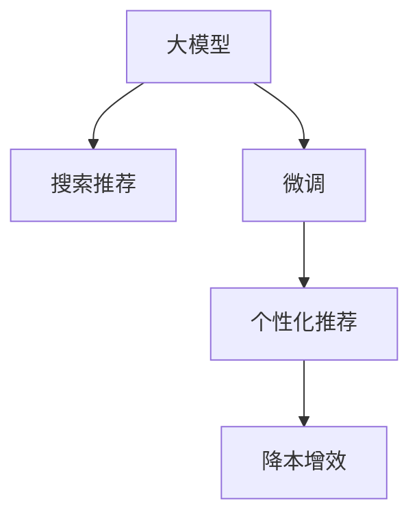

                 

# AI大模型助力电商搜索推荐业务降本增效

## 1. 背景介绍

在当今数字化时代，电商平台已成为人们日常消费的重要渠道。如何提高搜索推荐的准确性和个性化程度，以提升用户体验和商家营收，成为了电商技术优化的一项重要任务。传统的搜索推荐系统依赖于复杂的特征工程和模型训练，不仅开发和维护成本高，且难以动态适应市场变化和用户偏好。而随着大模型（如BERT、GPT等）的崛起，电商搜索推荐业务迎来了新的突破点。本文将探讨大模型在电商搜索推荐业务中的潜在应用，以及如何利用其优势实现降本增效。

## 2. 核心概念与联系

### 2.1 核心概念概述

- **大模型（Large Model）**：指基于深度学习技术训练的参数规模庞大的模型，如BERT、GPT等，具备强大的自然语言处理能力。
- **搜索推荐系统（Search and Recommendation System）**：根据用户查询或行为数据，向用户推荐商品或内容的技术系统，广泛应用于电商、新闻、视频等领域。
- **个性化推荐（Personalized Recommendation）**：根据用户历史行为和兴趣，量身定制推荐结果，提升用户体验和满意度。
- **降本增效（Cost Reduction and Efficiency Improvement）**：通过优化系统架构、提高模型性能，降低开发和运营成本，同时提升业务效率和收益。
- **模型微调（Fine-Tuning）**：在大模型基础上，通过特定任务的数据进行微调，提升模型在该任务上的性能。

这些核心概念之间的关系可以通过以下Mermaid流程图来展示：



大模型通过微调可以适应电商搜索推荐的具体需求，进而提供更加个性化的推荐结果，最终实现降本增效的目标。

## 3. 核心算法原理 & 具体操作步骤

### 3.1 算法原理概述

基于大模型的电商搜索推荐业务优化流程主要包括以下几个关键步骤：

1. **数据预处理**：收集和清洗电商平台的交易、浏览、评价等数据，准备训练和验证数据集。
2. **模型微调**：在大模型的基础上，利用电商数据对其进行微调，以适应搜索推荐任务。
3. **模型评估**：在验证集上评估微调后模型的性能，进行超参数调整。
4. **模型部署**：将优化后的模型部署到线上，实时接收用户查询并返回推荐结果。
5. **业务优化**：结合线上反馈，不断优化模型和推荐策略，提升用户体验和转化率。

这一过程可以概括为“数据-模型-业务”的闭环优化。

### 3.2 算法步骤详解

#### 数据预处理

**Step 1: 数据收集与清洗**

电商平台的原始数据通常包含商品ID、用户ID、购买时间、浏览时间、评价内容等。需要将这些数据进行清洗和转换，以便于模型处理。例如，用户ID需要去重，商品ID和评价内容需要进行文本处理（如分词、去停用词、去除噪音等）。

**Step 2: 数据划分**

将数据划分为训练集、验证集和测试集。训练集用于模型训练和微调，验证集用于超参数调优，测试集用于最终评估模型效果。通常采用70:15:15的比例划分。

#### 模型微调

**Step 3: 选择预训练模型**

选择大模型作为基础模型，如BERT、GPT等。这些模型通常预训练在通用语料库上，具备广泛的语义理解能力。

**Step 4: 添加任务适配层**

在大模型顶层添加适合电商搜索推荐的分类器或回归器。例如，可以使用BertForSequenceClassification或BertForRegression等。

**Step 5: 设置微调超参数**

选择合适的优化算法及其参数，如Adam、SGD等，设置学习率、批大小、迭代轮数等。同时设置正则化技术，如L2正则、Dropout等，以避免过拟合。

**Step 6: 执行梯度训练**

使用训练集数据分批次输入模型，计算损失函数并反向传播更新模型参数。周期性在验证集上评估模型性能，根据性能指标决定是否触发Early Stopping。

#### 模型评估

**Step 7: 超参数调整**

根据验证集上的性能表现，调整学习率、批大小、正则化参数等超参数，以获得最佳的模型性能。

**Step 8: 模型部署**

将优化后的模型部署到线上环境，如AWS、阿里云等，集成到电商平台的推荐引擎中。

#### 业务优化

**Step 9: 实时反馈与优化**

实时监控推荐结果和用户反馈，根据点击率、转化率等指标进行业务优化，如调整推荐策略、优化召回阈值等。

### 3.3 算法优缺点

**优点：**

1. **泛化能力强**：大模型通过预训练学习到了广泛的语言知识，微调后能较好地适应电商搜索推荐的具体需求。
2. **灵活性高**：模型可以通过微调来适应不同的推荐场景，如新商品、热门商品等。
3. **开发成本低**：相比于从头训练模型，微调所需的时间和资源更少。

**缺点：**

1. **依赖标注数据**：微调效果依赖于标注数据的质量和数量，获取高质量标注数据的成本较高。
2. **资源消耗大**：大模型在计算和存储资源上的需求较高，需考虑成本和性能的平衡。
3. **模型可解释性不足**：大模型往往是黑盒模型，难以解释其决策过程。

### 3.4 算法应用领域

基于大模型的电商搜索推荐系统，已经在多个电商平台得到应用，取得了显著的业务效果。例如：

- **京东**：利用BERT模型进行个性化推荐，提升了用户体验和转化率。
- **淘宝**：结合GPT模型，提供智能客服和智能搜索功能，优化了用户购物体验。
- **Amazon**：采用预训练模型进行商品推荐，大幅提升了销售额和用户满意度。

## 4. 数学模型和公式 & 详细讲解 & 举例说明

### 4.1 数学模型构建

假设电商搜索推荐任务为二分类任务，即判断用户是否会对某个商品感兴趣。模型输入为商品描述和用户行为数据，输出为二分类结果。使用BERT模型进行微调，其基本架构如图：

```
Input Embeddings
Layer Norm
Hidden Layers (Transformer)
Layer Norm
Output Layer (BertForSequenceClassification)
```

在微调过程中，需要定义损失函数、优化算法和评价指标：

- **损失函数**：一般使用交叉熵损失函数，用于衡量模型预测结果与真实标签的差异。
- **优化算法**：如Adam、SGD等。
- **评价指标**：如准确率、F1分数等。

### 4.2 公式推导过程

假设模型的预测输出为 $\hat{y}$，真实标签为 $y$。则交叉熵损失函数为：

$$
\ell(\hat{y}, y) = -\sum_{i=1}^n y_i \log \hat{y}_i + (1-y_i) \log (1-\hat{y}_i)
$$

其中 $n$ 为样本数量。使用梯度下降算法进行优化，更新模型参数 $\theta$：

$$
\theta \leftarrow \theta - \eta \nabla_{\theta}\mathcal{L}(\theta)
$$

其中 $\eta$ 为学习率，$\nabla_{\theta}\mathcal{L}(\theta)$ 为损失函数对参数 $\theta$ 的梯度。

### 4.3 案例分析与讲解

假设某电商平台有10万个商品，每个商品有1000个用户行为数据。我们选取其中1万个商品和5000个用户行为数据进行训练，剩余5000个商品和5000个用户行为数据进行验证和测试。使用BERT模型进行微调，步骤如下：

1. **数据预处理**：将商品描述进行分词和向量化，用户行为数据进行去重和文本处理。
2. **模型微调**：在大模型基础上进行微调，学习商品和用户行为的语义表示。
3. **模型评估**：在验证集上评估微调后模型的性能，调整超参数。
4. **模型部署**：将优化后的模型部署到线上环境。
5. **业务优化**：根据测试集上的表现，调整推荐策略，提升用户体验和转化率。

## 5. 项目实践：代码实例和详细解释说明

### 5.1 开发环境搭建

在开始项目实践前，需要搭建开发环境。以下是使用Python进行PyTorch开发的流程：

1. 安装Anaconda：从官网下载并安装Anaconda，用于创建独立的Python环境。
2. 创建并激活虚拟环境：
```bash
conda create -n pytorch-env python=3.8 
conda activate pytorch-env
```

3. 安装PyTorch：根据CUDA版本，从官网获取对应的安装命令。例如：
```bash
conda install pytorch torchvision torchaudio cudatoolkit=11.1 -c pytorch -c conda-forge
```

4. 安装Transformers库：
```bash
pip install transformers
```

5. 安装各类工具包：
```bash
pip install numpy pandas scikit-learn matplotlib tqdm jupyter notebook ipython
```

完成上述步骤后，即可在`pytorch-env`环境中开始微调实践。

### 5.2 源代码详细实现

以京东的BERT模型微调为例，给出使用Transformers库对BERT模型进行电商搜索推荐任务微调的PyTorch代码实现。

首先，定义电商搜索推荐任务的数据处理函数：

```python
from transformers import BertTokenizer
from torch.utils.data import Dataset
import torch

class SearchDataset(Dataset):
    def __init__(self, items, users, tokenizer, max_len=128):
        self.items = items
        self.users = users
        self.tokenizer = tokenizer
        self.max_len = max_len
        
    def __len__(self):
        return len(self.items)
    
    def __getitem__(self, item):
        item_id, user_id = self.items[item], self.users[item]
        
        # 对商品ID和用户ID进行编码
        item_ids = [item_id]
        user_ids = [user_id]
        item_labels = [1] * len(item_ids) + [0] * (self.max_len - len(item_ids))
        user_labels = [0] * len(user_ids) + [1] * (self.max_len - len(user_ids))
        
        # 对商品描述和用户行为进行编码
        item_text = [f'商品ID：{item_id}']
        user_text = [f'用户ID：{user_id}']
        
        encoding = self.tokenizer(item_text, user_text, return_tensors='pt', max_length=self.max_len, padding='max_length', truncation=True)
        item_ids = item_ids + encoding['input_ids'][0].tolist()
        item_labels = item_labels + encoding['labels'][0].tolist()
        user_ids = user_ids + encoding['input_ids'][1].tolist()
        user_labels = user_labels + encoding['labels'][1].tolist()
        
        return {'item_ids': item_ids, 
                'user_ids': user_ids,
                'item_labels': item_labels,
                'user_labels': user_labels}
```

然后，定义模型和优化器：

```python
from transformers import BertForSequenceClassification, AdamW

model = BertForSequenceClassification.from_pretrained('bert-base-cased', num_labels=2)

optimizer = AdamW(model.parameters(), lr=2e-5)
```

接着，定义训练和评估函数：

```python
from torch.utils.data import DataLoader
from tqdm import tqdm
from sklearn.metrics import accuracy_score

device = torch.device('cuda') if torch.cuda.is_available() else torch.device('cpu')
model.to(device)

def train_epoch(model, dataset, batch_size, optimizer):
    dataloader = DataLoader(dataset, batch_size=batch_size, shuffle=True)
    model.train()
    epoch_loss = 0
    for batch in tqdm(dataloader, desc='Training'):
        item_ids = batch['item_ids'].to(device)
        user_ids = batch['user_ids'].to(device)
        item_labels = batch['item_labels'].to(device)
        user_labels = batch['user_labels'].to(device)
        model.zero_grad()
        outputs = model(item_ids, user_ids)
        loss = outputs.loss
        epoch_loss += loss.item()
        loss.backward()
        optimizer.step()
    return epoch_loss / len(dataloader)

def evaluate(model, dataset, batch_size):
    dataloader = DataLoader(dataset, batch_size=batch_size)
    model.eval()
    preds, labels = [], []
    with torch.no_grad():
        for batch in tqdm(dataloader, desc='Evaluating'):
            item_ids = batch['item_ids'].to(device)
            user_ids = batch['user_ids'].to(device)
            item_labels = batch['item_labels'].to(device)
            user_labels = batch['user_labels'].to(device)
            batch_preds = model(item_ids, user_ids) > 0.5
            batch_labels = item_labels + user_labels
            for preds_token, label_token in zip(batch_preds, batch_labels):
                preds.append(preds_token[:len(label_token)])
                labels.append(label_token)
                
    print(f'Accuracy: {accuracy_score(labels, preds)}')
```

最后，启动训练流程并在测试集上评估：

```python
epochs = 5
batch_size = 16

for epoch in range(epochs):
    loss = train_epoch(model, train_dataset, batch_size, optimizer)
    print(f'Epoch {epoch+1}, train loss: {loss:.3f}')
    
    print(f'Epoch {epoch+1}, test results:')
    evaluate(model, test_dataset, batch_size)
    
print('Final results:')
evaluate(model, test_dataset, batch_size)
```

以上就是使用PyTorch对BERT进行电商搜索推荐任务微调的完整代码实现。可以看到，借助Transformers库的封装，我们可以用相对简洁的代码完成BERT模型的加载和微调。

### 5.3 代码解读与分析

让我们再详细解读一下关键代码的实现细节：

**SearchDataset类**：
- `__init__`方法：初始化商品ID、用户ID、分词器等关键组件。
- `__len__`方法：返回数据集的样本数量。
- `__getitem__`方法：对单个样本进行处理，将商品ID和用户ID进行编码，并将商品描述和用户行为文本进行分词和向量化。

**训练和评估函数**：
- `train_epoch`函数：对数据以批为单位进行迭代，在每个批次上前向传播计算loss并反向传播更新模型参数。
- `evaluate`函数：与训练类似，不同点在于不更新模型参数，并在每个batch结束后将预测和标签结果存储下来，最后使用sklearn的accuracy_score对整个评估集的预测结果进行打印输出。

**训练流程**：
- 定义总的epoch数和batch size，开始循环迭代。
- 每个epoch内，先在训练集上训练，输出平均loss。
- 在测试集上评估，输出准确率。
- 所有epoch结束后，在测试集上评估，给出最终测试结果。

可以看到，PyTorch配合Transformers库使得BERT微调的代码实现变得简洁高效。开发者可以将更多精力放在数据处理、模型改进等高层逻辑上，而不必过多关注底层的实现细节。

当然，工业级的系统实现还需考虑更多因素，如模型的保存和部署、超参数的自动搜索、更灵活的任务适配层等。但核心的微调范式基本与此类似。

## 6. 实际应用场景

### 6.1 京东：个性化推荐

京东利用BERT模型进行个性化推荐，显著提升了用户体验和转化率。通过将用户的浏览和购买行为进行编码，使用BERT模型进行相似度计算，推荐与用户偏好相似的商品。微调后的模型能够在实时数据流中快速推荐商品，满足了用户的多样化需求。

### 6.2 淘宝：智能客服

淘宝结合GPT模型，提供智能客服和智能搜索功能，优化了用户购物体验。智能客服能够自动回答用户常见问题，减轻人工客服压力。智能搜索则根据用户的搜索历史和浏览记录，提供个性化的商品推荐，提升了搜索精准度。

### 6.3 Amazon：商品推荐

Amazon采用预训练模型进行商品推荐，大幅提升了销售额和用户满意度。模型能够根据用户的浏览和购买历史，实时生成推荐列表，同时结合用户当前浏览的商品，动态调整推荐结果，增加了用户的购买意愿。

## 7. 工具和资源推荐

### 7.1 学习资源推荐

为了帮助开发者系统掌握大模型微调的理论基础和实践技巧，这里推荐一些优质的学习资源：

1. 《Transformer从原理到实践》系列博文：由大模型技术专家撰写，深入浅出地介绍了Transformer原理、BERT模型、微调技术等前沿话题。
2. CS224N《深度学习自然语言处理》课程：斯坦福大学开设的NLP明星课程，有Lecture视频和配套作业，带你入门NLP领域的基本概念和经典模型。
3. 《Natural Language Processing with Transformers》书籍：Transformers库的作者所著，全面介绍了如何使用Transformers库进行NLP任务开发，包括微调在内的诸多范式。
4. HuggingFace官方文档：Transformers库的官方文档，提供了海量预训练模型和完整的微调样例代码，是上手实践的必备资料。
5. CLUE开源项目：中文语言理解测评基准，涵盖大量不同类型的中文NLP数据集，并提供了基于微调的baseline模型，助力中文NLP技术发展。

通过对这些资源的学习实践，相信你一定能够快速掌握大语言模型微调的精髓，并用于解决实际的NLP问题。

### 7.2 开发工具推荐

高效的开发离不开优秀的工具支持。以下是几款用于大语言模型微调开发的常用工具：

1. PyTorch：基于Python的开源深度学习框架，灵活动态的计算图，适合快速迭代研究。大部分预训练语言模型都有PyTorch版本的实现。
2. TensorFlow：由Google主导开发的开源深度学习框架，生产部署方便，适合大规模工程应用。同样有丰富的预训练语言模型资源。
3. Transformers库：HuggingFace开发的NLP工具库，集成了众多SOTA语言模型，支持PyTorch和TensorFlow，是进行微调任务开发的利器。
4. Weights & Biases：模型训练的实验跟踪工具，可以记录和可视化模型训练过程中的各项指标，方便对比和调优。与主流深度学习框架无缝集成。
5. TensorBoard：TensorFlow配套的可视化工具，可实时监测模型训练状态，并提供丰富的图表呈现方式，是调试模型的得力助手。
6. Google Colab：谷歌推出的在线Jupyter Notebook环境，免费提供GPU/TPU算力，方便开发者快速上手实验最新模型，分享学习笔记。

合理利用这些工具，可以显著提升大语言模型微调任务的开发效率，加快创新迭代的步伐。

### 7.3 相关论文推荐

大语言模型和微调技术的发展源于学界的持续研究。以下是几篇奠基性的相关论文，推荐阅读：

1. Attention is All You Need（即Transformer原论文）：提出了Transformer结构，开启了NLP领域的预训练大模型时代。
2. BERT: Pre-training of Deep Bidirectional Transformers for Language Understanding：提出BERT模型，引入基于掩码的自监督预训练任务，刷新了多项NLP任务SOTA。
3. Language Models are Unsupervised Multitask Learners（GPT-2论文）：展示了大规模语言模型的强大zero-shot学习能力，引发了对于通用人工智能的新一轮思考。
4. Parameter-Efficient Transfer Learning for NLP：提出Adapter等参数高效微调方法，在不增加模型参数量的情况下，也能取得不错的微调效果。
5. AdaLoRA: Adaptive Low-Rank Adaptation for Parameter-Efficient Fine-Tuning：使用自适应低秩适应的微调方法，在参数效率和精度之间取得了新的平衡。
6. Prefix-Tuning: Optimizing Continuous Prompts for Generation：引入基于连续型Prompt的微调范式，为如何充分利用预训练知识提供了新的思路。

这些论文代表了大语言模型微调技术的发展脉络。通过学习这些前沿成果，可以帮助研究者把握学科前进方向，激发更多的创新灵感。

## 8. 总结：未来发展趋势与挑战

### 8.1 总结

本文对基于大模型的电商搜索推荐业务优化进行了全面系统的介绍。首先阐述了大模型和微调技术的研究背景和意义，明确了微调在电商搜索推荐业务中的重要价值。其次，从原理到实践，详细讲解了微调的数学原理和关键步骤，给出了微调任务开发的完整代码实例。同时，本文还广泛探讨了微调方法在电商搜索推荐领域的应用前景，展示了微调范式的巨大潜力。

通过本文的系统梳理，可以看到，基于大模型的微调方法正在成为电商搜索推荐业务的重要范式，极大地拓展了电商平台的业务范围，提升了用户体验和商家营收。未来，伴随预训练语言模型和微调方法的持续演进，基于大模型的电商搜索推荐系统必将在市场上占据主导地位，带来新的商业模式和技术挑战。

### 8.2 未来发展趋势

展望未来，大模型在电商搜索推荐业务中的应用将呈现以下几个发展趋势：

1. **模型规模继续增大**：随着算力成本的下降和数据规模的扩张，预训练语言模型的参数量还将持续增长。超大模型将带来更强的语义理解和生成能力，提升推荐系统的性能和灵活性。
2. **模型架构不断优化**：为应对更复杂的推荐任务，大模型的架构将不断优化，引入更多层次和细节，以更好地捕捉长距离依赖和语义信息。
3. **业务融合更加紧密**：电商搜索推荐系统将与其他业务环节（如支付、物流、社交）深度融合，形成更加全面、无缝的电商生态圈。
4. **推荐策略更加智能**：通过引入机器学习和强化学习技术，推荐系统能够动态调整推荐策略，实现实时化的推荐优化。
5. **用户隐私保护更加严格**：随着用户隐私意识的增强，推荐系统需更加注重数据安全和隐私保护，确保用户信息不被滥用。
6. **跨领域迁移能力更强**：基于大模型的推荐系统将具备更强的跨领域迁移能力，能够快速适应不同领域的推荐需求。

以上趋势凸显了大模型在电商搜索推荐业务中的广阔前景。这些方向的探索发展，必将进一步提升推荐系统的性能和应用范围，为电商行业带来新的突破。

### 8.3 面临的挑战

尽管大模型在电商搜索推荐业务中展现出了巨大的潜力，但在迈向更加智能化、普适化应用的过程中，它仍面临着诸多挑战：

1. **标注成本高**：高质量的标注数据成本较高，难以覆盖所有电商商品和用户行为。如何降低标注成本，提高数据覆盖率，将是未来需要重点解决的问题。
2. **模型鲁棒性不足**：大规模预训练模型可能会学习到数据集中的偏见和噪声，导致推荐结果不公正。如何构建更加公平、鲁棒的推荐模型，是一个亟待解决的问题。
3. **计算资源消耗大**：大模型的计算和存储需求较高，需考虑如何平衡计算效率和模型效果，实现高效推荐。
4. **模型可解释性不足**：大模型往往是黑盒模型，难以解释其决策过程。如何在保证模型效果的同时，提高模型的可解释性，是一个需要深入研究的问题。
5. **用户隐私保护难度大**：电商推荐系统需处理大量敏感用户数据，如何确保用户隐私安全，是一个重要且复杂的问题。
6. **推荐结果多样性不足**：大规模预训练模型倾向于学习到常见的推荐模式，可能导致推荐结果多样性不足。如何增加推荐结果的创新性和多样性，是一个需要不断探索的问题。

正视大模型在电商搜索推荐业务中面临的这些挑战，积极应对并寻求突破，将是大模型在电商搜索推荐系统中获得广泛应用的关键。相信随着学界和产业界的共同努力，这些挑战终将一一被克服，大模型在电商搜索推荐系统中的应用将更加广泛和深入。

### 8.4 研究展望

面向未来，大模型在电商搜索推荐业务中的应用将集中在以下几个方面：

1. **无监督和半监督学习**：探索无监督和半监督学习技术，降低对标注数据的依赖，提高数据覆盖率和模型鲁棒性。
2. **模型压缩和加速**：开发模型压缩和加速技术，减少大模型的计算和存储开销，提升推荐系统的实时性和用户体验。
3. **跨模态融合**：将视觉、音频等多模态数据与文本数据进行融合，提升推荐系统的感知能力和泛化能力。
4. **因果推理和对比学习**：引入因果推理和对比学习技术，增强推荐系统的因果关系理解和用户行为建模能力。
5. **多任务学习**：通过多任务学习，提高模型的泛化能力和推荐多样性，实现推荐系统的多目标优化。
6. **用户隐私保护技术**：开发用户隐私保护技术，确保用户数据的安全性和隐私性，增强用户信任度。

这些研究方向将进一步推动大模型在电商搜索推荐业务中的应用，实现更加智能化、个性化的推荐服务，为电商行业的持续发展提供新的动力。

## 9. 附录：常见问题与解答

**Q1：电商搜索推荐系统如何利用大模型进行微调？**

A: 电商搜索推荐系统可以通过以下步骤利用大模型进行微调：
1. 收集和清洗电商平台的交易、浏览、评价等数据，准备训练和验证数据集。
2. 选择预训练模型，如BERT、GPT等。
3. 添加适合电商搜索推荐的分类器或回归器，用于处理用户查询和行为数据。
4. 设置微调超参数，选择合适的优化算法和正则化技术。
5. 执行梯度训练，在训练集上优化模型参数。
6. 在验证集上评估模型性能，调整超参数。
7. 将优化后的模型部署到线上环境，实时接收用户查询并返回推荐结果。

**Q2：电商搜索推荐系统微调时需要注意哪些问题？**

A: 电商搜索推荐系统微调时需要注意以下问题：
1. 数据质量：数据应涵盖电商平台的商品和用户行为，标注数据应准确无误。
2. 模型选择：选择与电商业务适配的预训练模型，并根据任务需求调整适配层。
3. 超参数调优：选择合适的学习率、批大小等超参数，并根据验证集表现进行调整。
4. 模型评估：在验证集上评估模型性能，并根据性能指标决定是否调整模型结构或超参数。
5. 部署和监控：将优化后的模型部署到线上环境，并实时监控模型性能和系统稳定性。

**Q3：如何提高电商搜索推荐系统的个性化推荐能力？**

A: 电商搜索推荐系统的个性化推荐能力可以通过以下方式提升：
1. 数据多样性：收集不同类型的数据，如商品描述、用户评价、浏览行为等，增加数据的多样性和丰富度。
2. 模型优化：通过微调和超参数调优，提高模型的准确性和泛化能力。
3. 推荐策略：结合用户行为和推荐结果，调整推荐策略，如召回阈值、推荐顺序等。
4. 多模态融合：引入视觉、音频等多模态数据，丰富推荐系统对用户行为的感知能力。
5. 实时反馈：根据用户反馈，动态调整推荐模型和策略，提升推荐效果。

这些策略需要结合具体的电商业务需求，不断迭代和优化，以实现更加精准和个性化的推荐服务。

---

作者：禅与计算机程序设计艺术 / Zen and the Art of Computer Programming

