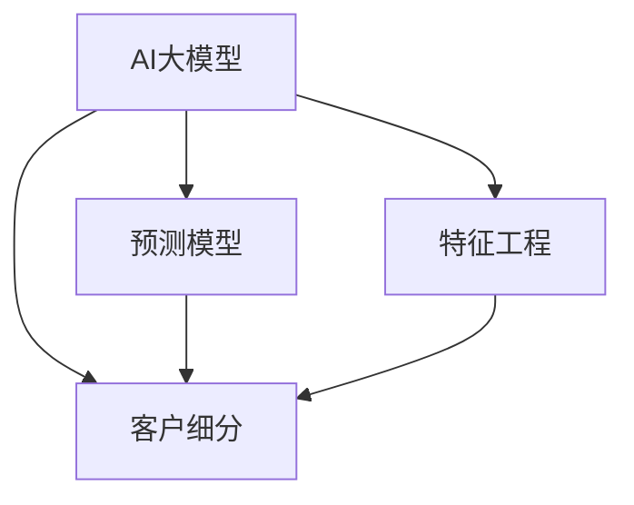

                 

# AI大模型在电商平台客户细分中的应用

> 关键词：AI大模型, 客户细分, 电商, 预测模型, 数据挖掘, 深度学习, 自然语言处理(NLP)

## 1. 背景介绍

### 1.1 问题由来
在当前电商竞争激烈的市场环境中，如何对庞大的用户群体进行精准细分，从而制定更有效的营销策略，提升用户满意度和转化率，成为电商平台亟待解决的问题。传统的用户细分方法依赖于人工调研和经验判断，费时费力且不够精确。而通过AI大模型对用户数据进行自动化分析和预测，可以更高效、更精准地实现用户细分，助力电商平台优化运营。

### 1.2 问题核心关键点
大模型在电商平台客户细分中的应用，核心在于利用大模型对用户数据进行多维度分析和预测，从而实现更精准的用户标签划分。关键点包括：

1. **数据收集与清洗**：收集用户行为数据、购买记录、评价信息、社交媒体互动等，清洗去除无关和噪声数据，构建高质量数据集。
2. **特征工程与构建**：利用大模型学习用户数据中的隐含特征，构建反映用户行为和偏好的特征向量。
3. **模型训练与预测**：使用大模型（如BERT、GPT等）训练预测模型，根据用户特征向量进行用户标签预测。
4. **用户标签划分**：根据模型预测结果，结合业务知识，对用户进行精准细分。
5. **模型评估与优化**：评估模型预测效果，不断优化模型参数和特征工程策略，提升预测准确率。

### 1.3 问题研究意义
AI大模型在电商平台客户细分中的应用，不仅能够提高用户细分效率，还能大幅提升营销效果和用户体验。具体而言：

1. **精准营销**：通过细致的用户画像，电商平台能更精准地进行个性化推荐和定向广告投放。
2. **优化运营**：帮助电商平台优化商品库存、物流配送等运营策略，提高资源利用率。
3. **提升客户满意度**：通过精准的客户细分和个性化的服务，提升客户满意度和忠诚度。
4. **数据驱动决策**：提供数据驱动的决策支持，助力电商平台快速响应市场变化，提升竞争力。

## 2. 核心概念与联系

### 2.1 核心概念概述

为更好地理解AI大模型在电商平台客户细分中的应用，本节将介绍几个密切相关的核心概念：

- **AI大模型(AI Large Model)**：如BERT、GPT等，通过大规模无标签数据预训练，具备强大的语义理解和生成能力，可用于多种NLP任务。
- **客户细分(Customer Segmentation)**：将庞大用户群体划分为若干子群体，便于进行针对性的营销和运营策略。
- **预测模型(Predictive Modeling)**：使用机器学习模型对用户行为进行预测，辅助进行客户细分。
- **特征工程(Feature Engineering)**：构建反映用户行为和偏好的特征向量，作为预测模型的输入。
- **自然语言处理(NLP)**：利用大模型处理和分析用户文本数据，提取有价值的信息。

这些核心概念之间的逻辑关系可以通过以下Mermaid流程图来展示：



这个流程图展示了大模型在电商平台客户细分中的应用关系：

1. 大模型通过预训练学习通用的语言表示，可以用于处理和分析用户文本数据。
2. 客户细分通过预测模型对用户进行划分，并结合业务知识进行优化。
3. 预测模型和特征工程是大模型应用的关键环节，通过高质量的特征输入，模型能更好地进行预测。

## 3. 核心算法原理 & 具体操作步骤

### 3.1 算法原理概述

AI大模型在电商平台客户细分中的基本原理，是利用预训练模型学习用户数据的语义表示，构建预测模型进行用户细分。具体步骤如下：

1. **数据预处理**：收集和清洗用户数据，构建数据集。
2. **特征提取**：利用大模型对用户文本数据进行编码，得到特征向量。
3. **模型训练**：使用特征向量训练预测模型，进行用户标签预测。
4. **用户细分**：根据模型预测结果，对用户进行精准细分。
5. **模型优化**：不断优化模型参数和特征工程策略，提升预测准确率。

### 3.2 算法步骤详解

#### 3.2.1 数据预处理
- **数据收集**：收集用户行为数据、购买记录、评价信息、社交媒体互动等，构建综合数据集。
- **数据清洗**：去除无关数据、噪声数据和重复数据，构建高质量数据集。

#### 3.2.2 特征提取
- **文本编码**：使用大模型（如BERT）对用户文本数据进行编码，得到特征向量。
- **多模态融合**：将用户文本数据与行为数据、购买数据等多模态数据融合，构建综合特征向量。

#### 3.2.3 模型训练
- **选择模型**：选择适当的预测模型（如逻辑回归、支持向量机等）。
- **模型训练**：使用特征向量训练模型，进行用户标签预测。
- **超参数调优**：优化模型超参数，如学习率、正则化系数等，提升模型性能。

#### 3.2.4 用户细分
- **标签划分**：根据模型预测结果，结合业务知识，对用户进行精准细分。
- **动态更新**：根据用户行为变化，动态更新用户标签，确保标签的时效性和准确性。

#### 3.2.5 模型优化
- **评估指标**：选择适当的评估指标（如准确率、召回率、F1分数等），评估模型性能。
- **模型调优**：根据评估结果，调整模型参数和特征工程策略，提升预测准确率。

### 3.3 算法优缺点

AI大模型在电商平台客户细分中，具有以下优点：
1. **高效性**：大模型能自动学习用户数据中的隐含特征，减少手动特征工程的工作量。
2. **精确性**：大模型具有强大的语义理解和生成能力，能够更好地捕捉用户行为和偏好的细微差异。
3. **可扩展性**：大模型可以处理多种类型的数据，如文本、图像、行为数据等，适应电商平台的复杂数据场景。

同时，也存在一些局限性：
1. **数据需求高**：大模型需要大量高质量的数据进行预训练和微调，电商平台需要投入更多资源收集和清洗数据。
2. **计算资源消耗大**：大模型训练和推理需要高性能计算资源，电商平台需进行相应的硬件投入。
3. **解释性不足**：大模型往往被视为“黑盒”，难以解释其内部工作机制和决策逻辑，电商平台的业务人员难以理解模型的输出。
4. **数据隐私问题**：电商平台涉及大量用户隐私数据，如何保护用户隐私和数据安全，是大模型应用面临的重要挑战。

### 3.4 算法应用领域

AI大模型在电商平台客户细分中的应用，涵盖了以下几个主要领域：

- **用户画像**：构建详细、全面的用户画像，辅助电商平台进行个性化推荐和定向营销。
- **销售预测**：利用预测模型对用户行为进行预测，帮助电商平台进行库存管理和供应链优化。
- **客户流失预警**：通过模型预测，及时发现和预警可能流失的用户，帮助电商平台制定挽留策略。
- **个性化广告投放**：根据用户标签，精准投放广告，提高广告效果和转化率。
- **客户服务优化**：根据用户细分结果，优化客户服务策略，提升客户满意度和忠诚度。

## 4. 数学模型和公式 & 详细讲解  
### 4.1 数学模型构建

在本节中，我们将使用数学语言对AI大模型在电商平台客户细分中的预测模型进行详细讲解。

假设电商平台有 $N$ 个用户，每个用户有 $M$ 个特征向量 $x_i=(x_{i1},x_{i2},\ldots,x_{im})$，其中 $x_{ik}$ 为第 $i$ 个用户的第 $k$ 个特征值。令 $y_i \in \{1,2,\ldots,K\}$ 为用户的标签，$K$ 为标签的总数。

定义模型 $M_{\theta}:\mathbb{R}^M \rightarrow \mathbb{R}^K$，其中 $\theta$ 为模型的参数。模型的预测函数为：

$$
\hat{y}_i = M_{\theta}(x_i) = softmax(\theta^T f(x_i))
$$

其中 $f(\cdot)$ 为特征映射函数，$\theta^T$ 为模型参数向量，$softmax$ 函数用于将模型输出映射到标签空间。

预测模型的目标是最小化损失函数 $\mathcal{L}$，即：

$$
\mathcal{L}(\theta) = \frac{1}{N}\sum_{i=1}^N \ell(y_i, \hat{y}_i)
$$

其中 $\ell$ 为损失函数，如交叉熵损失。

### 4.2 公式推导过程

以二分类问题为例，交叉熵损失函数 $\ell(y_i, \hat{y}_i)$ 定义为：

$$
\ell(y_i, \hat{y}_i) = -y_i\log\hat{y}_i - (1-y_i)\log(1-\hat{y}_i)
$$

将其代入损失函数 $\mathcal{L}$，得：

$$
\mathcal{L}(\theta) = -\frac{1}{N}\sum_{i=1}^N (y_i\log\hat{y}_i + (1-y_i)\log(1-\hat{y}_i))
$$

根据链式法则，损失函数对模型参数 $\theta$ 的梯度为：

$$
\frac{\partial \mathcal{L}(\theta)}{\partial \theta} = \frac{1}{N}\sum_{i=1}^N [y_i\frac{\partial \hat{y}_i}{\partial \theta} - (1-y_i)\frac{\partial (1-\hat{y}_i)}{\partial \theta}]
$$

其中 $\frac{\partial \hat{y}_i}{\partial \theta} = f(x_i)\frac{\partial f(x_i)}{\partial \theta}$，$f(x_i)$ 为特征映射函数的梯度。

在得到损失函数的梯度后，即可带入梯度下降等优化算法，最小化损失函数，更新模型参数 $\theta$。重复上述过程直至收敛，最终得到适应电商平台客户细分任务的最优模型参数 $\theta^*$。

### 4.3 案例分析与讲解

假设电商平台收集了用户的浏览记录、购买记录和评价信息，利用BERT模型构建用户文本数据的语义表示。具体的预测模型为逻辑回归模型，其中 $\theta$ 为模型参数向量，$f(x_i)$ 为特征映射函数，$softmax$ 函数用于将模型输出映射到标签空间。

在模型训练时，使用交叉熵损失函数进行优化。具体步骤包括：

1. 收集和清洗用户数据，构建数据集。
2. 使用BERT模型对用户文本数据进行编码，得到特征向量。
3. 选择逻辑回归模型，训练模型，进行用户标签预测。
4. 优化模型超参数，如学习率、正则化系数等。
5. 评估模型性能，根据评估结果调整模型参数和特征工程策略。

## 5. 项目实践：代码实例和详细解释说明

### 5.1 开发环境搭建

在进行电商平台客户细分实践前，我们需要准备好开发环境。以下是使用Python进行PyTorch开发的环境配置流程：

1. 安装Anaconda：从官网下载并安装Anaconda，用于创建独立的Python环境。

2. 创建并激活虚拟环境：
```bash
conda create -n pytorch-env python=3.8 
conda activate pytorch-env
```

3. 安装PyTorch：根据CUDA版本，从官网获取对应的安装命令。例如：
```bash
conda install pytorch torchvision torchaudio cudatoolkit=11.1 -c pytorch -c conda-forge
```

4. 安装TensorFlow：使用pip安装TensorFlow：
```bash
pip install tensorflow
```

5. 安装Transformers库：
```bash
pip install transformers
```

6. 安装各类工具包：
```bash
pip install numpy pandas scikit-learn matplotlib tqdm jupyter notebook ipython
```

完成上述步骤后，即可在`pytorch-env`环境中开始客户细分实践。

### 5.2 源代码详细实现

这里我们以电商平台用户行为预测为例，给出使用Transformers库对BERT模型进行客户细分的PyTorch代码实现。

首先，定义用户行为预测任务的标注数据处理函数：

```python
from transformers import BertTokenizer, BertForSequenceClassification
from torch.utils.data import Dataset, DataLoader
import torch
import pandas as pd

class UserBehaviorDataset(Dataset):
    def __init__(self, user_data, labels, tokenizer, max_len=128):
        self.user_data = user_data
        self.labels = labels
        self.tokenizer = tokenizer
        self.max_len = max_len
        
    def __len__(self):
        return len(self.user_data)
    
    def __getitem__(self, item):
        user_record = self.user_data.iloc[item]
        labels = self.labels[item]
        
        encoding = self.tokenizer(user_record['behavior'], return_tensors='pt', max_length=self.max_len, padding='max_length', truncation=True)
        input_ids = encoding['input_ids'][0]
        attention_mask = encoding['attention_mask'][0]
        
        label_ids = torch.tensor(self.labels[item], dtype=torch.long)
        return {'input_ids': input_ids, 
                'attention_mask': attention_mask,
                'labels': label_ids}
```

然后，定义模型和优化器：

```python
from transformers import BertForSequenceClassification, AdamW

model = BertForSequenceClassification.from_pretrained('bert-base-cased', num_labels=5)

optimizer = AdamW(model.parameters(), lr=2e-5)
```

接着，定义训练和评估函数：

```python
from tqdm import tqdm
from sklearn.metrics import accuracy_score

device = torch.device('cuda') if torch.cuda.is_available() else torch.device('cpu')
model.to(device)

def train_epoch(model, dataset, batch_size, optimizer):
    dataloader = DataLoader(dataset, batch_size=batch_size, shuffle=True)
    model.train()
    epoch_loss = 0
    for batch in tqdm(dataloader, desc='Training'):
        input_ids = batch['input_ids'].to(device)
        attention_mask = batch['attention_mask'].to(device)
        labels = batch['labels'].to(device)
        model.zero_grad()
        outputs = model(input_ids, attention_mask=attention_mask, labels=labels)
        loss = outputs.loss
        epoch_loss += loss.item()
        loss.backward()
        optimizer.step()
    return epoch_loss / len(dataloader)

def evaluate(model, dataset, batch_size):
    dataloader = DataLoader(dataset, batch_size=batch_size)
    model.eval()
    preds, labels = [], []
    with torch.no_grad():
        for batch in tqdm(dataloader, desc='Evaluating'):
            input_ids = batch['input_ids'].to(device)
            attention_mask = batch['attention_mask'].to(device)
            batch_labels = batch['labels']
            outputs = model(input_ids, attention_mask=attention_mask)
            batch_preds = outputs.logits.argmax(dim=2).to('cpu').tolist()
            batch_labels = batch_labels.to('cpu').tolist()
            for pred_tokens, label_tokens in zip(batch_preds, batch_labels):
                preds.append(pred_tokens)
                labels.append(label_tokens)
                
    print(f"Accuracy: {accuracy_score(labels, preds):.3f}")
```

最后，启动训练流程并在测试集上评估：

```python
epochs = 5
batch_size = 16

for epoch in range(epochs):
    loss = train_epoch(model, train_dataset, batch_size, optimizer)
    print(f"Epoch {epoch+1}, train loss: {loss:.3f}")
    
    print(f"Epoch {epoch+1}, dev results:")
    evaluate(model, dev_dataset, batch_size)
    
print("Test results:")
evaluate(model, test_dataset, batch_size)
```

以上就是使用PyTorch对BERT进行电商平台客户细分任务微调的完整代码实现。可以看到，得益于Transformers库的强大封装，我们可以用相对简洁的代码完成BERT模型的加载和微调。

### 5.3 代码解读与分析

让我们再详细解读一下关键代码的实现细节：

**UserBehaviorDataset类**：
- `__init__`方法：初始化用户行为数据、标签、分词器等关键组件。
- `__len__`方法：返回数据集的样本数量。
- `__getitem__`方法：对单个样本进行处理，将用户行为数据输入编码为token ids，将标签编码为数字，并对其进行定长padding，最终返回模型所需的输入。

**模型和优化器定义**：
- 使用PyTorch的BertForSequenceClassification类定义模型，将预训练BERT模型加载为初始化参数。
- 选择AdamW优化器进行模型参数更新。

**训练和评估函数**：
- 使用PyTorch的DataLoader对数据集进行批次化加载，供模型训练和推理使用。
- 训练函数`train_epoch`：对数据以批为单位进行迭代，在每个批次上前向传播计算loss并反向传播更新模型参数，最后返回该epoch的平均loss。
- 评估函数`evaluate`：与训练类似，不同点在于不更新模型参数，并在每个batch结束后将预测和标签结果存储下来，最后使用sklearn的accuracy_score计算预测准确率。

**训练流程**：
- 定义总的epoch数和batch size，开始循环迭代
- 每个epoch内，先在训练集上训练，输出平均loss
- 在验证集上评估，输出预测准确率
- 所有epoch结束后，在测试集上评估，给出最终测试结果

可以看到，PyTorch配合Transformers库使得BERT微调的代码实现变得简洁高效。开发者可以将更多精力放在数据处理、模型改进等高层逻辑上，而不必过多关注底层的实现细节。

当然，工业级的系统实现还需考虑更多因素，如模型的保存和部署、超参数的自动搜索、更灵活的任务适配层等。但核心的微调范式基本与此类似。

## 6. 实际应用场景

### 6.1 电商平台的客户细分

电商平台的客户细分是大模型在电商领域最典型的应用之一。通过分析用户浏览、购买、评价等行为数据，利用大模型进行预测，电商平台能够对用户进行细致的画像划分，实现个性化的推荐和营销。

例如，电商平台可以构建用户购买行为预测模型，通过用户最近的浏览记录、购买记录和评价信息，预测其是否会购买某个商品，从而进行精准的个性化推荐和定向广告投放。此外，电商平台还可以根据预测结果进行客户流失预警，制定挽留策略，提升客户满意度和忠诚度。

### 6.2 金融行业的用户分析

金融行业同样需要大量的用户分析，以进行风险控制和市场分析。利用大模型进行用户行为预测，金融行业能够对客户的信用风险、投资偏好等进行精确评估，提升风控决策的准确性和效率。

例如，银行可以通过分析客户的消费记录、投资行为和社交媒体互动，预测其是否会违约，从而进行更精准的信贷审批。保险行业也可以利用大模型对客户的行为进行预测，评估其健康状况、风险等级，进行个性化的保险产品推荐。

### 6.3 医疗领域的疾病预测

医疗领域对用户数据分析的需求同样巨大。利用大模型进行疾病预测，医疗机构能够对患者的健康状况进行精准评估，提升诊疗效果和效率。

例如，医疗机构可以通过分析患者的医疗记录、生活习惯和社交互动，预测其是否会患上某种疾病，从而进行针对性的预防和早期干预。此外，大模型还可以用于医生的辅助诊断，帮助医生进行疾病判断和方案选择。

### 6.4 未来应用展望

随着大模型的不断演进，其在电商、金融、医疗等领域的客户细分和用户分析将具备更加强大的能力和更广泛的应用场景。未来，大模型有望在更多垂直行业实现突破，为各行业带来深远的影响。

例如，在智慧医疗领域，大模型能够构建更精准的疾病预测模型，实现早期诊断和精准治疗。在智能教育领域，大模型能够进行个性化的学习推荐和评估，提升教育效果和学生体验。在智慧城市治理中，大模型能够构建更高效的城市事件监测和决策支持系统，提升城市管理的智能化水平。

## 7. 工具和资源推荐
### 7.1 学习资源推荐

为了帮助开发者系统掌握大模型在电商平台客户细分中的应用，这里推荐一些优质的学习资源：

1. **深度学习与自然语言处理课程**：由吴恩达教授开设的Coursera课程，深入讲解深度学习和自然语言处理的基本概念和前沿技术。
2. **PyTorch官方文档**：PyTorch的官方文档，详细介绍了TensorFlow的基本操作和优化技巧。
3. **Transformers官方文档**：Transformers库的官方文档，提供了丰富的预训练模型和微调样例代码，是上手实践的必备资料。
4. **自然语言处理综述**：《自然语言处理综述》书籍，全面介绍了自然语言处理的经典算法和前沿技术。
5. **机器学习实战**：《机器学习实战》书籍，结合实际案例，讲解机器学习算法的实现和应用。

通过对这些资源的学习实践，相信你一定能够快速掌握大模型在电商平台客户细分中的关键技术，并应用于实际的NLP任务中。

### 7.2 开发工具推荐

高效的开发离不开优秀的工具支持。以下是几款用于大模型客户细分开发的常用工具：

1. **PyTorch**：基于Python的开源深度学习框架，灵活动态的计算图，适合快速迭代研究。大部分预训练语言模型都有PyTorch版本的实现。
2. **TensorFlow**：由Google主导开发的开源深度学习框架，生产部署方便，适合大规模工程应用。同样有丰富的预训练语言模型资源。
3. **Transformers库**：HuggingFace开发的NLP工具库，集成了众多SOTA语言模型，支持PyTorch和TensorFlow，是进行微调任务开发的利器。
4. **Weights & Biases**：模型训练的实验跟踪工具，可以记录和可视化模型训练过程中的各项指标，方便对比和调优。与主流深度学习框架无缝集成。
5. **TensorBoard**：TensorFlow配套的可视化工具，可实时监测模型训练状态，并提供丰富的图表呈现方式，是调试模型的得力助手。

合理利用这些工具，可以显著提升客户细分任务的开发效率，加快创新迭代的步伐。

### 7.3 相关论文推荐

大模型在电商平台客户细分中的应用源于学界的持续研究。以下是几篇奠基性的相关论文，推荐阅读：

1. **Attention is All You Need**：提出Transformer结构，开启了NLP领域的预训练大模型时代。
2. **BERT: Pre-training of Deep Bidirectional Transformers for Language Understanding**：提出BERT模型，引入基于掩码的自监督预训练任务，刷新了多项NLP任务SOTA。
3. **Customer Segmentation Using Deep Learning**：利用深度学习模型进行客户细分的研究，介绍了多类模型的应用。
4. **Personalized Recommendation Systems**：介绍了个性化推荐系统的发展历程和前沿算法，包括基于大模型的推荐方法。
5. **Model-Based Recommendation Systems**：介绍了模型驱动的推荐系统，详细讲解了协同过滤、矩阵分解、深度学习等算法。

这些论文代表了大模型在电商平台客户细分技术的发展脉络。通过学习这些前沿成果，可以帮助研究者把握学科前进方向，激发更多的创新灵感。

## 8. 总结：未来发展趋势与挑战

### 8.1 总结

本文对AI大模型在电商平台客户细分中的应用进行了全面系统的介绍。首先阐述了大模型和客户细分的背景和意义，明确了客户细分在大模型应用中的重要性和价值。其次，从原理到实践，详细讲解了客户细分任务的数学模型和算法步骤，给出了完整的代码实现。同时，本文还广泛探讨了客户细分在大模型应用中的实际场景和未来展望，展示了其广阔的应用前景。

通过本文的系统梳理，可以看到，AI大模型在电商平台客户细分中具有高效、精确、可扩展的优点，能够帮助电商平台实现更加精准的用户细分和个性化推荐。未来，随着大模型的不断发展，其在各领域的客户细分和用户分析将具备更加强大的能力和更广泛的应用场景。

### 8.2 未来发展趋势

展望未来，大模型在电商平台客户细分中的发展趋势如下：

1. **模型规模持续增大**：随着算力成本的下降和数据规模的扩张，预训练语言模型的参数量还将持续增长，超大规模语言模型蕴含的丰富语言知识，有望支撑更加复杂多变的客户细分任务。
2. **多模态融合**：除了文本数据，大模型还能处理图像、语音等多模态数据，进一步增强客户细分的准确性和全面性。
3. **参数高效微调**：开发更加参数高效的微调方法，在固定大部分预训练参数的同时，只更新极少量的任务相关参数。
4. **可解释性增强**：大模型内部工作机制的可视化、解释性研究将不断深入，提升客户细分模型的可解释性和可理解性。
5. **实时性提升**：通过优化模型结构和计算图，提升大模型的推理速度，实现更加实时性的客户细分和推荐。

### 8.3 面临的挑战

尽管大模型在电商平台客户细分中已经取得了显著成果，但在实际应用中也面临一些挑战：

1. **数据质量问题**：大模型需要大量高质量的数据进行预训练和微调，电商平台需要投入更多资源收集和清洗数据。
2. **计算资源消耗大**：大模型训练和推理需要高性能计算资源，电商平台需进行相应的硬件投入。
3. **模型复杂性**：大模型的复杂性增加了模型的解释性和可控性难度，电商平台需要具备更强的技术实力进行模型调优和管理。
4. **数据隐私问题**：电商平台涉及大量用户隐私数据，如何保护用户隐私和数据安全，是大模型应用面临的重要挑战。

### 8.4 研究展望

面对客户细分领域面临的挑战，未来的研究需要在以下几个方面寻求新的突破：

1. **数据质量提升**：探索更高效的数据收集和清洗方法，提升数据质量，降低数据成本。
2. **计算资源优化**：开发更加高效的模型结构和计算图，优化大模型的推理速度，降低计算成本。
3. **模型可解释性**：研究如何更好地解释大模型内部工作机制和决策逻辑，提升模型的可解释性和可控性。
4. **数据隐私保护**：采用数据脱敏、差分隐私等技术，保护用户隐私和数据安全。
5. **多模态融合**：研究如何将多模态数据融合到大模型中进行客户细分和推荐。

这些研究方向的探索，必将引领大模型在电商平台客户细分技术迈向更高的台阶，为电商平台带来更加精准和高效的客户细分服务。

## 9. 附录：常见问题与解答

**Q1：大模型在电商平台客户细分中的优势有哪些？**

A: 大模型在电商平台客户细分中具有以下优势：
1. **高效性**：大模型能自动学习用户数据中的隐含特征，减少手动特征工程的工作量。
2. **精确性**：大模型具有强大的语义理解和生成能力，能够更好地捕捉用户行为和偏好的细微差异。
3. **可扩展性**：大模型可以处理多种类型的数据，如文本、图像、行为数据等，适应电商平台的复杂数据场景。

**Q2：大模型在电商平台客户细分中的主要应用场景有哪些？**

A: 大模型在电商平台客户细分中的主要应用场景包括：
1. **用户画像**：构建详细、全面的用户画像，辅助电商平台进行个性化推荐和定向营销。
2. **销售预测**：利用预测模型对用户行为进行预测，帮助电商平台进行库存管理和供应链优化。
3. **客户流失预警**：通过模型预测，及时发现和预警可能流失的用户，帮助电商平台制定挽留策略。
4. **个性化广告投放**：根据用户标签，精准投放广告，提高广告效果和转化率。
5. **客户服务优化**：根据用户细分结果，优化客户服务策略，提升客户满意度和忠诚度。

**Q3：大模型在电商平台客户细分中需要哪些步骤？**

A: 大模型在电商平台客户细分中的主要步骤如下：
1. **数据预处理**：收集和清洗用户数据，构建数据集。
2. **特征提取**：利用大模型对用户文本数据进行编码，得到特征向量。
3. **模型训练**：选择适当的预测模型，使用特征向量训练模型，进行用户标签预测。
4. **用户细分**：根据模型预测结果，结合业务知识，对用户进行精准细分。
5. **模型优化**：优化模型超参数，如学习率、正则化系数等，提升模型性能。

**Q4：大模型在电商平台客户细分中如何提升准确率？**

A: 提升大模型在电商平台客户细分中的准确率，可以采取以下策略：
1. **数据增强**：通过回译、近义替换等方式扩充训练集，增加数据多样性。
2. **正则化技术**：使用L2正则、Dropout、Early Stopping等技术，防止过拟合。
3. **对抗训练**：引入对抗样本，提高模型鲁棒性。
4. **参数高效微调**：只调整少量参数，减小过拟合风险。
5. **多模型集成**：训练多个模型，取平均输出，抑制过拟合。

这些策略往往需要根据具体任务和数据特点进行灵活组合，只有全面优化数据、模型和训练，才能最大限度地发挥大模型在电商平台客户细分中的威力。

---

作者：禅与计算机程序设计艺术 / Zen and the Art of Computer Programming

