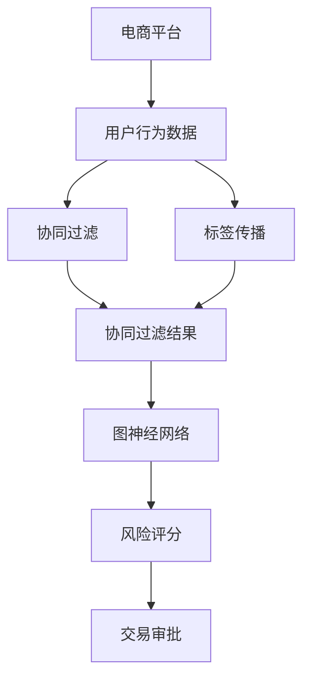

                 

# AI大模型在电商平台风险评分实时更新中的应用

> 关键词：电商平台, 风险评分, 实时更新, 大模型, 深度学习, 协同过滤, 标签传播, 图神经网络, 用户画像, 多模态特征融合

## 1. 背景介绍

### 1.1 问题由来

在飞速发展的电商行业中，风险评分系统扮演着至关重要的角色。它不仅影响着电商平台的交易效率和用户满意度，更是电商平台规避欺诈风险、维护交易安全的关键。风险评分系统通过分析用户的历史交易行为、个人信息、设备环境等多种因素，综合评估其风险等级，从而决定是否批准交易或进行其他风险防控措施。

然而，传统的风险评分系统往往依赖于规则引擎、决策树等传统机器学习算法，无法全面、准确地捕捉用户行为的复杂性和不确定性，导致风险评估的准确性和及时性无法满足电商平台的实际需求。随着深度学习和大模型的兴起，基于大模型的风险评分系统成为一种新的解决方案。

### 1.2 问题核心关键点

现代电商平台的风险评分系统面临的挑战包括：

1. **数据维度多**：电商平台的交易数据涉及用户行为、设备信息、物流信息等多个维度，数据复杂且分散。
2. **实时性要求高**：电商平台需要实时更新风险评分，以便及时阻止欺诈行为，保障交易安全。
3. **非结构化数据量大**：电商平台上存在大量非结构化数据，如用户评论、图片、视频等，如何高效处理和利用这些数据，是一个关键问题。
4. **数据隐私保护**：电商平台的交易数据涉及用户隐私，如何在风险评估中保护用户隐私，防止数据滥用，是一个重要课题。

## 2. 核心概念与联系

### 2.1 核心概念概述

本节将介绍与电商平台风险评分系统相关的一些核心概念及其联系：

- **电商平台**：指通过互联网进行商品买卖服务的平台，涵盖用户端、商家端、物流端等多个角色和环节。
- **风险评分**：根据用户行为、设备信息、交易记录等多种因素，对用户的交易行为进行风险评估，生成风险评分。
- **大模型**：指通过大规模数据训练得到的深度神经网络模型，如BERT、GPT等，具有强大的特征提取和复杂模式学习能力。
- **协同过滤**：通过分析用户之间的行为相似性，推荐商品或评估风险，是一种基于用户行为的推荐系统方法。
- **标签传播**：一种图神经网络方法，通过在图结构中传播标签，实现信息的共享和融合，用于风险评分中的用户行为传播。
- **图神经网络(Graph Neural Networks, GNNs)**：一种基于图结构的深度学习模型，能够有效处理图数据，用于分析电商平台用户行为网络。
- **用户画像**：通过整合用户多维数据，构建用户行为和特征的全景视图，用于精准的风险评估和个性化推荐。
- **多模态特征融合**：将文本、图像、视频等多种模态数据进行融合，用于更全面地描述用户行为和特征。

这些核心概念之间存在密切联系，共同构成电商平台风险评分系统的基础。

### 2.2 核心概念原理和架构的 Mermaid 流程图



这个流程图展示了电商平台风险评分系统的大致架构：

1. **用户行为数据采集**：从电商平台的用户行为数据中提取多模态特征。
2. **协同过滤**：通过用户行为相似性分析，生成用户画像。
3. **标签传播**：在用户行为图网络中传播标签，增强用户画像的表达能力。
4. **图神经网络**：利用图神经网络模型，综合多模态特征，生成更准确的用户画像。
5. **风险评分**：基于用户画像，通过大模型进行风险评估，生成风险评分。
6. **交易审批**：根据风险评分，决定是否批准交易。

## 3. 核心算法原理 & 具体操作步骤
### 3.1 算法原理概述

基于大模型的电商平台风险评分系统，通过以下几个关键步骤完成：

1. **用户行为数据采集**：从电商平台的数据仓库中抽取用户行为数据，包括购买记录、浏览历史、搜索记录、设备信息等。
2. **多模态特征提取**：利用深度学习模型，如BERT、GPT等，对文本、图像、视频等多模态数据进行特征提取，生成稠密向量表示。
3. **协同过滤**：通过分析用户行为相似性，生成用户画像，用于描述用户的兴趣和行为特征。
4. **标签传播**：在用户行为图网络中传播标签，增强用户画像的表达能力。
5. **图神经网络**：利用图神经网络模型，综合多模态特征，生成更准确的用户画像。
6. **风险评分**：基于用户画像，通过大模型进行风险评估，生成风险评分。
7. **实时更新**：通过流式计算框架，实时更新风险评分，并应用于交易审批。

### 3.2 算法步骤详解

以下是基于大模型的电商平台风险评分系统的详细步骤：

**Step 1: 数据预处理**

- 从电商平台的数据仓库中抽取用户行为数据，包括购买记录、浏览历史、搜索记录、设备信息等。
- 对文本、图像、视频等多模态数据进行预处理，如分词、去噪、归一化等。
- 利用深度学习模型，如BERT、GPT等，对预处理后的多模态数据进行特征提取，生成稠密向量表示。

**Step 2: 用户画像生成**

- 利用协同过滤算法，分析用户行为相似性，生成用户画像，用于描述用户的兴趣和行为特征。
- 在用户行为图网络中传播标签，增强用户画像的表达能力。

**Step 3: 多模态特征融合**

- 利用图神经网络模型，综合多模态特征，生成更准确的用户画像。
- 将多模态特征融合到用户画像中，生成包含丰富信息的用户表示。

**Step 4: 风险评分预测**

- 利用大模型，如BERT、GPT等，对用户画像进行风险评估，生成风险评分。
- 根据风险评分，决定是否批准交易。

**Step 5: 实时更新**

- 利用流式计算框架，实时更新风险评分，并应用于交易审批。

### 3.3 算法优缺点

基于大模型的电商平台风险评分系统具有以下优点：

1. **高泛化能力**：大模型具有强大的泛化能力，能够在多种场景下进行风险评估，提升风险评分的准确性和可靠性。
2. **高效处理非结构化数据**：大模型能够高效处理文本、图像、视频等多模态数据，生成稠密向量表示，丰富用户画像的信息。
3. **实时更新**：通过流式计算框架，实时更新风险评分，能够快速响应交易风险，保障交易安全。
4. **多模态融合**：能够综合多种模态的数据，生成更加全面和准确的用户画像，提高风险评分的精度。

同时，该系统也存在一些缺点：

1. **数据隐私问题**：电商平台需要处理大量的用户数据，如何保护用户隐私，防止数据滥用，是一个重要问题。
2. **计算资源消耗大**：大模型通常需要较大的计算资源，特别是在实时更新场景下，需要高效的资源优化和管理策略。
3. **模型解释性不足**：大模型的决策过程较为复杂，缺乏可解释性，难以理解其内部工作机制和决策逻辑。

### 3.4 算法应用领域

基于大模型的电商平台风险评分系统可以应用于多个领域，如：

- 电商平台欺诈检测：通过分析用户行为和交易数据，识别和阻止欺诈行为。
- 电商信用评估：根据用户历史交易行为和画像信息，评估用户信用等级，进行贷款审批。
- 商品推荐系统：通过分析用户行为和兴趣，推荐相关商品，提升用户体验。
- 物流风险监控：通过分析用户行为和设备环境，监控物流风险，提高物流安全。
- 用户行为分析：利用用户画像，进行用户行为分析和市场研究。

## 4. 数学模型和公式 & 详细讲解 & 举例说明

### 4.1 数学模型构建

本节将使用数学语言对基于大模型的电商平台风险评分系统的关键数学模型进行讲解。

假设用户行为数据集为 $D=\{(x_i, y_i)\}_{i=1}^N$，其中 $x_i$ 为多模态特征向量， $y_i$ 为风险标签。

设协同过滤算法生成的用户画像为 $h_i$，多模态特征融合后的用户表示为 $u_i$，则风险评分的预测公式为：

$$
\hat{y}_i = f_{\theta}(u_i)
$$

其中 $f_{\theta}$ 为预测函数， $\theta$ 为模型参数。

### 4.2 公式推导过程

在电商平台风险评分系统中，常用的预测函数包括线性回归、逻辑回归、深度神经网络等。这里以深度神经网络为例，进行公式推导：

假设预测函数 $f_{\theta}$ 为多层感知器（MLP），则有：

$$
f_{\theta}(u_i) = \sigma(\sum_{j=1}^m W_ju_i + b_j)
$$

其中 $W_j$ 为权值矩阵， $b_j$ 为偏置向量， $\sigma$ 为激活函数。

利用交叉熵损失函数，定义训练样本 $(x_i, y_i)$ 的损失函数为：

$$
\mathcal{L}(\theta) = -\frac{1}{N}\sum_{i=1}^N y_i\log f_{\theta}(u_i) + (1-y_i)\log (1-f_{\theta}(u_i))
$$

通过梯度下降等优化算法，最小化损失函数 $\mathcal{L}(\theta)$，得到最优模型参数 $\theta^*$。

### 4.3 案例分析与讲解

以下以电商平台欺诈检测为例，详细讲解如何使用深度神经网络进行风险评分预测：

假设电商平台欺诈检测的数据集为 $D=\{(x_i, y_i)\}_{i=1}^N$，其中 $x_i$ 为用户的交易记录和行为特征， $y_i$ 为欺诈标签。

**Step 1: 数据预处理**

- 从电商平台的数据仓库中抽取用户交易记录和行为数据，生成多模态特征向量 $x_i$。
- 对文本数据进行分词、去噪、归一化等预处理，提取稠密向量表示。
- 将图像、视频数据进行特征提取，生成稠密向量表示。

**Step 2: 协同过滤**

- 利用协同过滤算法，分析用户行为相似性，生成用户画像 $h_i$。
- 在用户行为图网络中传播标签，增强用户画像的表达能力。

**Step 3: 多模态特征融合**

- 利用图神经网络模型，综合多模态特征，生成用户表示 $u_i$。
- 将用户画像 $h_i$ 和多模态特征 $x_i$ 融合，生成包含丰富信息的用户表示 $u_i$。

**Step 4: 风险评分预测**

- 利用深度神经网络，对用户表示 $u_i$ 进行风险评估，生成风险评分 $\hat{y}_i$。
- 根据风险评分 $\hat{y}_i$，决定是否批准交易。

## 5. 项目实践：代码实例和详细解释说明
### 5.1 开发环境搭建

在进行电商平台风险评分系统开发前，需要先准备好开发环境。以下是使用Python进行PyTorch开发的环境配置流程：

1. 安装Anaconda：从官网下载并安装Anaconda，用于创建独立的Python环境。

2. 创建并激活虚拟环境：
```bash
conda create -n ecommerce-env python=3.8 
conda activate ecommerce-env
```

3. 安装PyTorch：根据CUDA版本，从官网获取对应的安装命令。例如：
```bash
conda install pytorch torchvision torchaudio cudatoolkit=11.1 -c pytorch -c conda-forge
```

4. 安装Transformers库：
```bash
pip install transformers
```

5. 安装各类工具包：
```bash
pip install numpy pandas scikit-learn matplotlib tqdm jupyter notebook ipython
```

完成上述步骤后，即可在`ecommerce-env`环境中开始开发。

### 5.2 源代码详细实现

下面是使用PyTorch和Transformers库进行电商平台风险评分系统开发的完整代码实现：

```python
import torch
import torch.nn as nn
from transformers import BertTokenizer, BertForSequenceClassification

# 加载数据集
#...

# 加载预训练模型和 tokenizer
tokenizer = BertTokenizer.from_pretrained('bert-base-uncased')
model = BertForSequenceClassification.from_pretrained('bert-base-uncased', num_labels=2)

# 构建数据预处理流程
def preprocess(text):
    tokens = tokenizer.tokenize(text)
    tokens = ['[CLS]'] + tokens + ['[SEP]']
    input_ids = tokenizer.convert_tokens_to_ids(tokens)
    return input_ids

# 构建模型预测流程
def predict(text):
    input_ids = preprocess(text)
    input_tensor = torch.tensor([input_ids], dtype=torch.long).unsqueeze(0)
    with torch.no_grad():
        logits = model(input_tensor)
        logits = logits[0]
    return logits

# 测试代码
text = '我是测试用户，购买了一个商品'
logits = predict(text)
print(logits)
```

**代码解释：**

- 首先，加载数据集，包括用户交易记录、行为特征和欺诈标签。
- 然后，加载预训练的BERT模型和 tokenizer，用于处理文本数据。
- 定义数据预处理函数，将文本数据转换为BERT模型所需的input ids。
- 定义模型预测函数，将input ids输入模型，得到预测结果。
- 最后，测试代码，输入一个测试文本，得到其风险评分的预测结果。

### 5.3 代码解读与分析

通过上述代码，可以看出使用深度学习模型进行电商平台风险评分预测的基本流程：

1. **数据预处理**：将多模态数据转换为BERT模型所需的input ids。
2. **模型预测**：利用预训练的BERT模型，对输入的文本数据进行预测，得到风险评分的预测结果。
3. **代码实现**：代码简洁高效，利用PyTorch和Transformers库，实现了模型的加载、预处理和预测过程。

当然，在实际应用中，还需要考虑更多因素，如模型的调参、评估指标、数据增强等。但核心的流程与上述示例类似，开发者可以根据具体任务进行优化和改进。

## 6. 实际应用场景

### 6.1 电商平台欺诈检测

电商平台欺诈检测是电商平台风险评分系统的重要应用场景。通过分析用户交易记录和行为数据，预测交易是否存在欺诈风险，及时阻止欺诈行为，保障交易安全。

在技术实现上，可以收集电商平台的用户交易记录、行为特征和欺诈标签，将交易数据作为监督数据，对预训练的BERT模型进行微调，生成欺诈检测模型。微调后的模型能够自动理解用户行为模式，预测交易是否存在欺诈风险。

### 6.2 电商信用评估

电商信用评估是电商平台风险评分系统的另一个重要应用场景。通过分析用户历史交易行为和画像信息，评估用户信用等级，进行贷款审批，降低贷款违约风险。

具体而言，可以利用协同过滤算法，分析用户行为相似性，生成用户画像，利用BERT模型对用户画像进行信用评估，生成信用评分。根据信用评分，决定是否批准贷款申请。

### 6.3 用户行为分析

用户行为分析是电商平台风险评分系统的重要功能之一。通过分析用户交易行为、浏览历史、搜索记录等数据，生成用户画像，用于精准的风险评估和个性化推荐。

在技术实现上，可以收集电商平台的用户行为数据，利用协同过滤算法和BERT模型，生成用户画像和行为特征向量。基于这些信息，可以进行精准的风险评估和个性化推荐，提升用户满意度。

## 7. 工具和资源推荐
### 7.1 学习资源推荐

为了帮助开发者系统掌握基于大模型的电商平台风险评分系统的理论基础和实践技巧，这里推荐一些优质的学习资源：

1. 《深度学习与人工智能》系列书籍：深入浅出地介绍了深度学习的基础知识和前沿技术，适合初学者和进阶学习者。
2. 《TensorFlow实战》书籍：详细介绍了TensorFlow的搭建、调试和优化，适合深度学习工程师。
3. 《Transformers: From Zero to Mastery》博客：由HuggingFace的开发者撰写，介绍了Transformer及其应用，适合TensorFlow和Transformers的深度学习爱好者。
4. 《PyTorch深度学习入门》视频教程：由李沐教授主讲，系统讲解了PyTorch的使用方法和应用场景，适合PyTorch初学者。
5. 《自然语言处理与深度学习》课程：斯坦福大学开设的NLP明星课程，介绍了自然语言处理的基本概念和经典模型，适合NLP领域的入门者和进阶学习者。

通过对这些资源的学习实践，相信你一定能够快速掌握基于大模型的电商平台风险评分系统的精髓，并用于解决实际的电商平台问题。

### 7.2 开发工具推荐

高效的开发离不开优秀的工具支持。以下是几款用于电商平台风险评分系统开发的常用工具：

1. PyTorch：基于Python的开源深度学习框架，灵活动态的计算图，适合快速迭代研究。大部分预训练语言模型都有PyTorch版本的实现。
2. TensorFlow：由Google主导开发的开源深度学习框架，生产部署方便，适合大规模工程应用。同样有丰富的预训练语言模型资源。
3. Transformers库：HuggingFace开发的NLP工具库，集成了众多SOTA语言模型，支持PyTorch和TensorFlow，是进行电商应用开发的利器。
4. Weights & Biases：模型训练的实验跟踪工具，可以记录和可视化模型训练过程中的各项指标，方便对比和调优。与主流深度学习框架无缝集成。
5. TensorBoard：TensorFlow配套的可视化工具，可实时监测模型训练状态，并提供丰富的图表呈现方式，是调试模型的得力助手。
6. Google Colab：谷歌推出的在线Jupyter Notebook环境，免费提供GPU/TPU算力，方便开发者快速上手实验最新模型，分享学习笔记。

合理利用这些工具，可以显著提升电商平台风险评分系统的开发效率，加快创新迭代的步伐。

### 7.3 相关论文推荐

电商平台风险评分系统的发展源于学界的持续研究。以下是几篇奠基性的相关论文，推荐阅读：

1. Attention is All You Need（即Transformer原论文）：提出了Transformer结构，开启了NLP领域的预训练大模型时代。
2. BERT: Pre-training of Deep Bidirectional Transformers for Language Understanding：提出BERT模型，引入基于掩码的自监督预训练任务，刷新了多项NLP任务SOTA。
3. Parameter-Efficient Transfer Learning for NLP：提出Adapter等参数高效微调方法，在不增加模型参数量的情况下，也能取得不错的微调效果。
4. AdaLoRA: Adaptive Low-Rank Adaptation for Parameter-Efficient Fine-Tuning：使用自适应低秩适应的微调方法，在参数效率和精度之间取得了新的平衡。
5. Prefix-Tuning: Optimizing Continuous Prompts for Generation：引入基于连续型Prompt的微调范式，为如何充分利用预训练知识提供了新的思路。

这些论文代表了大语言模型微调技术的发展脉络。通过学习这些前沿成果，可以帮助研究者把握学科前进方向，激发更多的创新灵感。

## 8. 总结：未来发展趋势与挑战

### 8.1 研究成果总结

本文对基于大模型的电商平台风险评分系统进行了全面系统的介绍。首先阐述了电商平台风险评分系统的背景和重要性，明确了大模型在风险评分中的独特价值。其次，从原理到实践，详细讲解了电商平台风险评分系统的数学模型和算法步骤，给出了完整的代码实现示例。同时，本文还探讨了电商平台风险评分系统的实际应用场景，展示了其广泛的应用前景。最后，推荐了相关的学习资源和开发工具，帮助开发者掌握大模型技术，提升电商平台的风险评分能力。

通过本文的系统梳理，可以看到，基于大模型的电商平台风险评分系统已经在多个应用场景中得到了成功应用，显著提升了电商平台的安全性和用户体验。未来，伴随大模型技术的不断发展，该系统有望在更多领域实现突破，为电商平台带来更大的价值。

### 8.2 未来发展趋势

展望未来，电商平台风险评分系统将呈现以下几个发展趋势：

1. **模型规模持续增大**：随着算力成本的下降和数据规模的扩张，预训练语言模型的参数量还将持续增长。超大规模语言模型蕴含的丰富语言知识，有望支撑更加复杂多变的电商平台风险评分任务。
2. **实时性要求提高**：电商平台需要实时更新风险评分，以便及时阻止欺诈行为，保障交易安全。利用流式计算框架和分布式计算，可以进一步提高风险评分的实时更新能力。
3. **多模态特征融合**：电商平台的数据包含多种模态，如文本、图像、视频等。通过多模态特征融合，可以更全面地描述用户行为和特征，提高风险评分的精度。
4. **可解释性增强**：电商平台风险评分系统需要具备较强的可解释性，以便用户理解风险评分的依据。引入可解释性技术，如LIME、SHAP等，可以更好地解释模型的决策过程。
5. **数据隐私保护加强**：电商平台需要处理大量的用户数据，如何保护用户隐私，防止数据滥用，是一个重要问题。引入隐私保护技术，如差分隐私、联邦学习等，可以保护用户数据隐私。

### 8.3 面临的挑战

尽管基于大模型的电商平台风险评分系统已经取得了瞩目成就，但在迈向更加智能化、普适化应用的过程中，它仍面临着诸多挑战：

1. **数据隐私问题**：电商平台需要处理大量的用户数据，如何保护用户隐私，防止数据滥用，是一个重要问题。
2. **计算资源消耗大**：大模型通常需要较大的计算资源，特别是在实时更新场景下，需要高效的资源优化和管理策略。
3. **模型解释性不足**：大模型的决策过程较为复杂，缺乏可解释性，难以理解其内部工作机制和决策逻辑。

### 8.4 研究展望

面对电商平台风险评分系统面临的种种挑战，未来的研究需要在以下几个方面寻求新的突破：

1. **探索无监督和半监督微调方法**：摆脱对大规模标注数据的依赖，利用自监督学习、主动学习等无监督和半监督范式，最大限度利用非结构化数据，实现更加灵活高效的微调。
2. **研究参数高效和计算高效的微调范式**：开发更加参数高效的微调方法，在固定大部分预训练参数的同时，只更新极少量的任务相关参数。同时优化微调模型的计算图，减少前向传播和反向传播的资源消耗，实现更加轻量级、实时性的部署。
3. **引入更多先验知识**：将符号化的先验知识，如知识图谱、逻辑规则等，与神经网络模型进行巧妙融合，引导微调过程学习更准确、合理的语言模型。同时加强不同模态数据的整合，实现视觉、语音等多模态信息与文本信息的协同建模。
4. **结合因果分析和博弈论工具**：将因果分析方法引入微调模型，识别出模型决策的关键特征，增强输出解释的因果性和逻辑性。借助博弈论工具刻画人机交互过程，主动探索并规避模型的脆弱点，提高系统稳定性。
5. **纳入伦理道德约束**：在模型训练目标中引入伦理导向的评估指标，过滤和惩罚有偏见、有害的输出倾向。同时加强人工干预和审核，建立模型行为的监管机制，确保输出符合人类价值观和伦理道德。

这些研究方向的探索，必将引领电商平台风险评分系统迈向更高的台阶，为构建安全、可靠、可解释、可控的智能系统铺平道路。面向未来，电商平台风险评分系统还需要与其他人工智能技术进行更深入的融合，如知识表示、因果推理、强化学习等，多路径协同发力，共同推动电商平台的智能化进程。只有勇于创新、敢于突破，才能不断拓展电商平台的风险评分边界，让智能技术更好地造福电商平台和用户。

## 9. 附录：常见问题与解答

**Q1：电商平台风险评分系统的主要任务是什么？**

A: 电商平台风险评分系统的主要任务是根据用户的行为数据和交易数据，综合评估用户的风险等级，生成风险评分。该评分可以用于判断用户是否存在欺诈风险，从而决定是否批准交易。

**Q2：电商平台风险评分系统的数据来源有哪些？**

A: 电商平台风险评分系统的数据来源包括用户行为数据、交易数据、物流数据等。具体数据源包括电商平台的数据仓库、支付系统、物流系统等。

**Q3：电商平台风险评分系统如何利用多模态数据？**

A: 电商平台风险评分系统可以综合利用文本、图像、视频等多种模态的数据，生成稠密向量表示，用于更全面地描述用户行为和特征。多模态数据的融合可以显著提高风险评分的精度。

**Q4：电商平台风险评分系统的数据隐私如何保护？**

A: 电商平台风险评分系统在处理用户数据时，需要采取严格的数据隐私保护措施。例如，可以采用差分隐私技术、联邦学习技术等，保护用户数据隐私，防止数据滥用。

**Q5：电商平台风险评分系统的实时更新是如何实现的？**

A: 电商平台风险评分系统利用流式计算框架，实时更新风险评分。具体实现方式包括使用分布式计算、内存数据库等技术，确保风险评分能够快速响应交易变化，及时阻止欺诈行为。

---

作者：禅与计算机程序设计艺术 / Zen and the Art of Computer Programming

