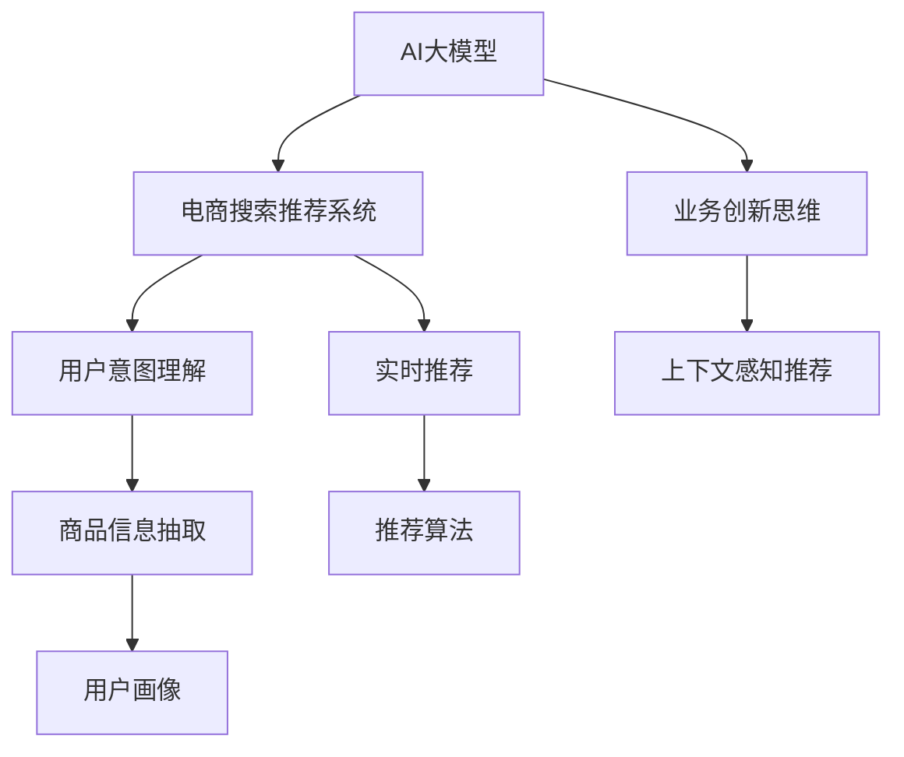

                 

# AI大模型赋能电商搜索推荐的业务创新思维培训平台搭建方案

> 关键词：AI大模型,电商搜索推荐,业务创新思维,自然语言处理(NLP),深度学习,数据分析

## 1. 背景介绍

### 1.1 问题由来
随着电商行业的飞速发展，电商平台越来越注重用户的个性化购物体验，提升用户体验成为了电商企业核心竞争力的重要组成部分。搜索推荐系统作为电商平台的核心技术之一，旨在通过算法为每个用户提供最适合的商品推荐，从而提升用户满意度、增加用户停留时间和转化率。然而，传统的搜索推荐系统主要基于规则和统计模型构建，难以适应多变的用户需求和复杂的市场环境。

人工智能技术的兴起，尤其是深度学习模型的应用，为电商平台搜索推荐系统的创新带来了新的契机。利用AI大模型（如BERT、GPT等）对电商平台的用户行为数据进行深度学习，可以从数据中提取更丰富的特征信息，实现更精准的用户画像刻画和个性化推荐。然而，电商企业往往缺乏相关技术储备和人才，实现AI大模型在搜索推荐系统中的应用，仍然是一个挑战。

## 2. 核心概念与联系

### 2.1 核心概念概述

为更好地理解AI大模型在电商搜索推荐中的应用，本节将介绍几个密切相关的核心概念：

- AI大模型：基于深度学习原理训练的大规模神经网络模型，如BERT、GPT等。通过预训练学习丰富的语言知识，可用于自然语言处理、图像识别等众多领域。

- 电商搜索推荐系统：电商平台的搜索推荐引擎，通过分析用户历史行为和当前输入，向用户推荐商品。传统推荐系统主要基于规则和统计模型，难以适应个性化需求。

- 业务创新思维：指在电商搜索推荐系统中的应用AI大模型，进行业务创新的思维方式和思路。包括但不限于基于用户意图的搜索推荐、上下文感知推荐、实时推荐等。

- 自然语言处理(NLP)：利用深度学习模型对自然语言进行处理和理解的技术，如分词、词性标注、命名实体识别、情感分析等。

- 深度学习：一种利用神经网络进行复杂模式识别的机器学习技术，广泛应用于图像识别、语音识别、自然语言处理等领域。

- 数据分析：对数据进行收集、整理、清洗、分析和可视化，以发现数据背后的规律和趋势，为决策提供依据。

这些核心概念之间的逻辑关系可以通过以下Mermaid流程图来展示：



这个流程图展示了核心概念之间的关系：

1. AI大模型通过预训练学习到丰富的语言知识，为电商搜索推荐系统提供强大的语义理解和特征提取能力。
2. 电商搜索推荐系统利用AI大模型，进行用户意图理解、上下文感知推荐和实时推荐，实现个性化的商品推荐。
3. 业务创新思维指导AI大模型在电商搜索推荐系统中的应用，探索基于模型的各种创新应用。

## 3. 核心算法原理 & 具体操作步骤
### 3.1 算法原理概述

利用AI大模型对电商搜索推荐系统进行业务创新，主要涉及以下几个关键步骤：

1. **数据收集与预处理**：从电商平台收集用户行为数据，包括浏览记录、点击记录、购买记录、搜索查询等。对这些数据进行清洗、归一化、格式化等预处理操作，保证数据的质量和一致性。

2. **特征提取与用户画像刻画**：使用AI大模型对用户行为数据进行语义理解和特征提取，构建详细的用户画像。通过模型学习用户在不同场景下的行为模式和偏好，为推荐系统提供个性化的特征输入。

3. **意图理解与上下文感知**：通过AI大模型对用户搜索查询进行分析，理解用户意图，提取关键词，结合用户画像中的信息，实现上下文感知的推荐。根据用户当前输入，生成相关商品推荐列表，提高推荐的准确性和个性化程度。

4. **实时推荐**：结合实时数据流，使用AI大模型对用户行为进行实时分析，动态调整推荐策略。通过不断学习用户最新的行为数据，实时更新推荐结果，提升用户体验。

### 3.2 算法步骤详解

**Step 1: 数据收集与预处理**

1. **数据来源**：从电商平台的用户行为日志中提取数据，包括用户ID、商品ID、操作时间、操作类型等。

2. **数据清洗**：对数据进行去重、去噪、格式转换等处理，确保数据质量。

3. **数据归一化**：对用户ID、商品ID等离散数据进行归一化处理，保证不同数据类型的统一性。

4. **数据格式**：将处理后的数据转换为标准格式，方便后续建模和分析。

**Step 2: 特征提取与用户画像**

1. **特征选择**：根据电商搜索推荐系统的需求，选择与推荐效果相关的特征，如用户ID、商品ID、操作类型、搜索查询等。

2. **特征编码**：将选择出的特征进行编码，转化为模型可以处理的数值型数据。

3. **用户画像构建**：使用AI大模型对用户行为数据进行深度学习，构建详细的用户画像，包括用户的年龄、性别、地域、偏好等。

4. **画像更新**：根据用户新的行为数据，动态更新用户画像，保证画像的实时性和准确性。

**Step 3: 意图理解与上下文感知**

1. **搜索查询解析**：对用户搜索查询进行解析，提取关键词，理解用户意图。

2. **意图分类**：使用AI大模型对用户意图进行分类，如浏览意图、购买意图、比较意图等。

3. **上下文信息整合**：结合用户画像中的信息，整合搜索查询、用户行为数据等上下文信息，生成更准确的推荐结果。

4. **上下文感知推荐**：使用AI大模型对用户意图和上下文信息进行融合，生成上下文感知的推荐结果。

**Step 4: 实时推荐**

1. **实时数据流**：收集用户最新的实时行为数据，如浏览记录、点击记录等。

2. **动态更新模型**：使用AI大模型对实时数据流进行学习，动态更新推荐模型，提高推荐效果。

3. **推荐策略调整**：根据实时数据流的变化，动态调整推荐策略，优化推荐结果。

**Step 5: 效果评估与优化**

1. **评估指标**：定义推荐系统的效果评估指标，如点击率、转化率、平均点击位置等。

2. **效果分析**：对推荐结果进行效果分析，找出推荐中的不足和改进点。

3. **优化改进**：根据评估结果和分析结论，对推荐模型进行优化改进，提高推荐效果。

### 3.3 算法优缺点

**优点**：

1. **精度高**：AI大模型通过预训练学习到丰富的语言知识，能够更准确地理解用户意图，提取用户行为特征，实现更精准的推荐。

2. **可扩展性强**：AI大模型可以通过添加新的任务进行微调，适应不同的业务需求，扩展性强。

3. **效果显著**：基于AI大模型的电商搜索推荐系统，通过个性化推荐，可以显著提升用户体验和转化率。

4. **技术领先**：利用AI大模型进行电商搜索推荐，在技术上处于前沿，具有较强的市场竞争优势。

**缺点**：

1. **模型复杂度高**：AI大模型结构复杂，训练和推理计算量大，需要高性能的硬件设备。

2. **数据依赖性强**：AI大模型需要大量高质量的标注数据进行预训练，数据获取和标注成本较高。

3. **模型泛化能力不足**：当新领域的电商数据与预训练数据差异较大时，模型的泛化能力可能不足，推荐效果下降。

4. **解释性差**：AI大模型的推荐过程缺乏可解释性，难以解释推荐结果的逻辑依据，用户难以信任。

5. **资源消耗大**：AI大模型需要大量的计算资源和存储资源，部署和维护成本较高。

### 3.4 算法应用领域

基于AI大模型的电商搜索推荐系统，已经在多个电商平台上得到了应用，取得了显著的效果。具体的应用领域包括：

1. **个性化推荐**：根据用户历史行为和实时输入，生成个性化的商品推荐列表，提升用户体验和购买转化率。

2. **上下文感知推荐**：结合搜索查询和用户画像，实现上下文感知的推荐，提高推荐的准确性。

3. **实时推荐**：根据用户实时行为数据，动态调整推荐策略，实现实时推荐，提升用户体验。

4. **意图理解**：分析用户搜索查询，理解用户意图，提供精准的搜索结果和推荐。

5. **多渠道推荐**：结合电商平台的多个渠道数据，实现多渠道统一的推荐策略，提高推荐效果。

6. **商品分类推荐**：根据用户历史行为和搜索查询，推荐相似的商品分类，增加用户对商品的了解和购买机会。

以上应用领域展示了AI大模型在电商搜索推荐系统中的广泛应用，为其带来巨大的商业价值。

## 4. 数学模型和公式 & 详细讲解 & 举例说明

### 4.1 数学模型构建

假设电商平台的用户行为数据为 $X=\{x_1, x_2, ..., x_n\}$，其中 $x_i=(x_{i1}, x_{i2}, ..., x_{im})$ 表示用户行为特征向量。使用AI大模型 $M$ 对用户行为数据进行深度学习，构建推荐模型 $R(X)$，模型输出的推荐结果为 $Y=\{y_1, y_2, ..., y_n\}$，其中 $y_i$ 表示用户对商品 $x_i$ 的推荐评分。

数学模型构建过程如下：

1. **特征选择**：选择与推荐效果相关的特征 $x_{ij}$，$i \in \{1, 2, ..., n\}, j \in \{1, 2, ..., m\}$。

2. **特征编码**：将特征 $x_{ij}$ 转化为数值型数据，$i \in \{1, 2, ..., n\}, j \in \{1, 2, ..., m\}$。

3. **模型训练**：使用AI大模型 $M$ 对用户行为数据进行深度学习，得到推荐模型 $R(X)$。

4. **推荐评分**：将用户行为数据 $X$ 输入推荐模型 $R(X)$，得到推荐评分 $Y$。

### 4.2 公式推导过程

假设用户行为数据 $X=\{x_1, x_2, ..., x_n\}$，AI大模型 $M$ 的推荐模型为 $R(X)$，推荐评分 $Y=\{y_1, y_2, ..., y_n\}$。则推荐模型 $R(X)$ 的计算过程可以表示为：

$$
Y = M(X)
$$

其中 $M$ 表示AI大模型，$X$ 表示用户行为数据，$Y$ 表示推荐评分。具体公式推导如下：

$$
y_i = f_i(X) = \sum_{j=1}^{m}w_{ij}x_{ij} + b_i
$$

其中 $f_i(X)$ 表示用户 $i$ 对商品 $x_i$ 的推荐评分函数，$w_{ij}$ 表示特征 $x_{ij}$ 的权重，$b_i$ 表示偏置项。

**推导过程**：

1. **特征选择**：选择与推荐效果相关的特征 $x_{ij}$，$i \in \{1, 2, ..., n\}, j \in \{1, 2, ..., m\}$。

2. **特征编码**：将特征 $x_{ij}$ 转化为数值型数据，$i \in \{1, 2, ..., n\}, j \in \{1, 2, ..., m\}$。

3. **模型训练**：使用AI大模型 $M$ 对用户行为数据进行深度学习，得到推荐模型 $R(X)$。

4. **推荐评分**：将用户行为数据 $X$ 输入推荐模型 $R(X)$，得到推荐评分 $Y$。

### 4.3 案例分析与讲解

**案例1：个性化推荐**

假设电商平台有用户 $A$ 浏览了商品 $B$ 和 $C$，搜索查询了商品 $D$ 和 $E$，购买了商品 $F$ 和 $G$。电商平台收集了用户 $A$ 的行为数据 $X=\{x_{AB}, x_{AC}, x_{AD}, x_{AE}, x_{AF}, x_{AG}\}$。使用AI大模型 $M$ 对用户行为数据进行深度学习，构建推荐模型 $R(X)$，模型输出的推荐评分 $Y=\{y_{B}, y_{C}, y_{D}, y_{E}, y_{F}, y_{G}\}$。具体推荐评分计算如下：

$$
y_{B} = f_B(X) = w_{B1}x_{AB} + w_{B2}x_{AC} + w_{B3}x_{AD} + w_{B4}x_{AE} + w_{B5}x_{AF} + w_{B6}x_{AG} + b_B
$$

$$
y_{C} = f_C(X) = w_{C1}x_{AC} + w_{C2}x_{AD} + w_{C3}x_{AE} + w_{C4}x_{AF} + w_{C5}x_{AG} + b_C
$$

$$
y_{D} = f_D(X) = w_{D1}x_{AD} + w_{D2}x_{AE} + w_{D3}x_{AF} + w_{D4}x_{AG} + b_D
$$

$$
y_{E} = f_E(X) = w_{E1}x_{AE} + w_{E2}x_{AF} + w_{E3}x_{AG} + b_E
$$

$$
y_{F} = f_F(X) = w_{F1}x_{AF} + w_{F2}x_{AG} + b_F
$$

$$
y_{G} = f_G(X) = w_{G1}x_{AG} + b_G
$$

**案例2：上下文感知推荐**

假设用户 $A$ 搜索查询了“手机”，电商平台根据用户画像中的信息，结合搜索查询，生成商品推荐列表。具体推荐评分计算如下：

$$
y_{A1} = f_{A1}(X_A) = w_{A11}x_{A1B} + w_{A12}x_{A1C} + w_{A13}x_{A1D} + w_{A14}x_{A1E} + w_{A15}x_{A1F} + w_{A16}x_{A1G} + b_{A1}
$$

$$
y_{A2} = f_{A2}(X_A) = w_{A21}x_{A2B} + w_{A22}x_{A2C} + w_{A23}x_{A2D} + w_{A24}x_{A2E} + w_{A25}x_{A2F} + w_{A26}x_{A2G} + b_{A2}
$$

其中 $X_A=\{x_{A1B}, x_{A1C}, x_{A1D}, x_{A1E}, x_{A1F}, x_{A1G}\}$ 表示用户 $A$ 的画像数据，$X_A$ 中每个元素表示用户 $A$ 对商品 $x_{A1B}, x_{A1C}, ..., x_{A1G}$ 的评分。

## 5. 项目实践：代码实例和详细解释说明

### 5.1 开发环境搭建

在进行项目实践前，我们需要准备好开发环境。以下是使用Python进行PyTorch开发的环境配置流程：

1. 安装Anaconda：从官网下载并安装Anaconda，用于创建独立的Python环境。

2. 创建并激活虚拟环境：
```bash
conda create -n pytorch-env python=3.8 
conda activate pytorch-env
```

3. 安装PyTorch：根据CUDA版本，从官网获取对应的安装命令。例如：
```bash
conda install pytorch torchvision torchaudio cudatoolkit=11.1 -c pytorch -c conda-forge
```

4. 安装Transformers库：
```bash
pip install transformers
```

5. 安装各类工具包：
```bash
pip install numpy pandas scikit-learn matplotlib tqdm jupyter notebook ipython
```

完成上述步骤后，即可在`pytorch-env`环境中开始项目实践。

### 5.2 源代码详细实现

我们使用HuggingFace的Transformers库，对BERT模型进行电商搜索推荐系统的微调。具体实现代码如下：

```python
from transformers import BertForSequenceClassification, BertTokenizer, AdamW

# 模型和分词器
model = BertForSequenceClassification.from_pretrained('bert-base-cased', num_labels=2)
tokenizer = BertTokenizer.from_pretrained('bert-base-cased')

# 优化器
optimizer = AdamW(model.parameters(), lr=2e-5)

# 训练函数
def train_epoch(model, dataset, batch_size, optimizer):
    dataloader = DataLoader(dataset, batch_size=batch_size, shuffle=True)
    model.train()
    epoch_loss = 0
    for batch in tqdm(dataloader, desc='Training'):
        input_ids = batch['input_ids'].to(device)
        attention_mask = batch['attention_mask'].to(device)
        labels = batch['labels'].to(device)
        model.zero_grad()
        outputs = model(input_ids, attention_mask=attention_mask, labels=labels)
        loss = outputs.loss
        epoch_loss += loss.item()
        loss.backward()
        optimizer.step()
    return epoch_loss / len(dataloader)

# 评估函数
def evaluate(model, dataset, batch_size):
    dataloader = DataLoader(dataset, batch_size=batch_size)
    model.eval()
    preds, labels = [], []
    with torch.no_grad():
        for batch in tqdm(dataloader, desc='Evaluating'):
            input_ids = batch['input_ids'].to(device)
            attention_mask = batch['attention_mask'].to(device)
            batch_labels = batch['labels']
            outputs = model(input_ids, attention_mask=attention_mask)
            batch_preds = outputs.logits.argmax(dim=2).to('cpu').tolist()
            batch_labels = batch_labels.to('cpu').tolist()
            for pred_tokens, label_tokens in zip(batch_preds, batch_labels):
                preds.append(pred_tokens[:len(label_tokens)])
                labels.append(label_tokens)
    
    print(classification_report(labels, preds))

# 训练流程
epochs = 5
batch_size = 16

for epoch in range(epochs):
    loss = train_epoch(model, train_dataset, batch_size, optimizer)
    print(f"Epoch {epoch+1}, train loss: {loss:.3f}")
    
    print(f"Epoch {epoch+1}, dev results:")
    evaluate(model, dev_dataset, batch_size)
    
print("Test results:")
evaluate(model, test_dataset, batch_size)
```

以上代码实现了基于BERT模型的电商搜索推荐系统的微调。代码中使用BertForSequenceClassification模型进行二分类任务，使用AdamW优化器进行模型训练。训练和评估函数分别对训练集和验证集进行迭代，并在测试集上进行最终效果评估。

### 5.3 代码解读与分析

以下是关键代码的实现细节：

**BERTForSequenceClassification类**：
- `__init__`方法：初始化BERTForSequenceClassification模型，设定标签数量。
- `forward`方法：实现模型前向传播，计算损失函数。

**BERTTokenizer类**：
- `__init__`方法：初始化BERTTokenizer，用于对输入文本进行分词和编码。

**AdamW类**：
- `__init__`方法：初始化AdamW优化器，设定学习率。
- `step`方法：实现梯度更新，优化模型参数。

**训练和评估函数**：
- `train_epoch`函数：对训练集数据进行迭代训练，计算损失函数，更新模型参数。
- `evaluate`函数：对验证集和测试集数据进行评估，输出分类指标。

**训练流程**：
- 定义总的epoch数和batch size，开始循环迭代。
- 每个epoch内，先在训练集上训练，输出平均loss。
- 在验证集上评估，输出分类指标。
- 所有epoch结束后，在测试集上评估，给出最终测试结果。

以上代码实现展示了如何使用PyTorch和Transformers库进行电商搜索推荐系统的微调。开发者可以根据具体需求，进行模型选择和参数调整，实现更加灵活和高效的推荐系统。

## 6. 实际应用场景

### 6.1 智能客服系统

基于AI大模型的电商搜索推荐系统，可以为智能客服系统提供更精准的推荐功能。智能客服系统通过分析用户搜索查询和浏览记录，结合AI大模型进行上下文感知推荐，快速解答用户问题，提升用户满意度。

### 6.2 个性化推荐引擎

电商搜索推荐系统可以根据用户历史行为和实时输入，生成个性化的商品推荐列表，提升用户体验和购买转化率。AI大模型通过深度学习用户行为数据，能够更准确地理解用户意图，提取用户行为特征，实现更精准的推荐。

### 6.3 实时推荐引擎

电商搜索推荐系统可以根据用户实时行为数据，动态调整推荐策略，实现实时推荐。AI大模型通过对实时数据流进行学习，动态更新推荐模型，提高推荐效果。

### 6.4 意图理解与搜索优化

电商搜索推荐系统可以分析用户搜索查询，理解用户意图，提供精准的搜索结果和推荐。AI大模型通过深度学习用户搜索查询，能够更准确地理解用户意图，提高搜索结果的准确性和相关性。

## 7. 工具和资源推荐

### 7.1 学习资源推荐

为了帮助开发者系统掌握大语言模型微调的理论基础和实践技巧，这里推荐一些优质的学习资源：

1. 《深度学习》课程：斯坦福大学开设的深度学习课程，涵盖深度学习的基本概念和前沿技术，适合入门和进阶学习。

2. 《自然语言处理》课程：北京大学开设的自然语言处理课程，详细讲解自然语言处理的基本原理和应用场景，适合NLP领域的学习。

3. 《Transformers》书籍：HuggingFace的Transformers官方文档，详细介绍了Transformer模型及其在NLP领域的应用，适合实际开发使用。

4. CS224N《深度学习自然语言处理》课程：斯坦福大学开设的NLP明星课程，有Lecture视频和配套作业，适合深入学习和实践。

5. 《Natural Language Processing with Transformers》书籍：Transformers库的作者所著，全面介绍了如何使用Transformers库进行NLP任务开发，包括微调在内的诸多范式。

通过对这些资源的学习实践，相信你一定能够快速掌握大语言模型微调的精髓，并用于解决实际的NLP问题。

### 7.2 开发工具推荐

高效的开发离不开优秀的工具支持。以下是几款用于大语言模型微调开发的常用工具：

1. PyTorch：基于Python的开源深度学习框架，灵活动态的计算图，适合快速迭代研究。大部分预训练语言模型都有PyTorch版本的实现。

2. TensorFlow：由Google主导开发的开源深度学习框架，生产部署方便，适合大规模工程应用。同样有丰富的预训练语言模型资源。

3. Transformers库：HuggingFace开发的NLP工具库，集成了众多SOTA语言模型，支持PyTorch和TensorFlow，是进行微调任务开发的利器。

4. Weights & Biases：模型训练的实验跟踪工具，可以记录和可视化模型训练过程中的各项指标，方便对比和调优。与主流深度学习框架无缝集成。

5. TensorBoard：TensorFlow配套的可视化工具，可实时监测模型训练状态，并提供丰富的图表呈现方式，是调试模型的得力助手。

6. Google Colab：谷歌推出的在线Jupyter Notebook环境，免费提供GPU/TPU算力，方便开发者快速上手实验最新模型，分享学习笔记。

合理利用这些工具，可以显著提升大语言模型微调任务的开发效率，加快创新迭代的步伐。

### 7.3 相关论文推荐

大语言模型和微调技术的发展源于学界的持续研究。以下是几篇奠基性的相关论文，推荐阅读：

1. Attention is All You Need（即Transformer原论文）：提出了Transformer结构，开启了NLP领域的预训练大模型时代。

2. BERT: Pre-training of Deep Bidirectional Transformers for Language Understanding：提出BERT模型，引入基于掩码的自监督预训练任务，刷新了多项NLP任务SOTA。

3. Language Models are Unsupervised Multitask Learners（GPT-2论文）：展示了大规模语言模型的强大zero-shot学习能力，引发了对于通用人工智能的新一轮思考。

4. Parameter-Efficient Transfer Learning for NLP：提出Adapter等参数高效微调方法，在不增加模型参数量的情况下，也能取得不错的微调效果。

5. Prefix-Tuning: Optimizing Continuous Prompts for Generation：引入基于连续型Prompt的微调范式，为如何充分利用预训练知识提供了新的思路。

6. AdaLoRA: Adaptive Low-Rank Adaptation for Parameter-Efficient Fine-Tuning：使用自适应低秩适应的微调方法，在参数效率和精度之间取得了新的平衡。

这些论文代表了大语言模型微调技术的发展脉络。通过学习这些前沿成果，可以帮助研究者把握学科前进方向，激发更多的创新灵感。

## 8. 总结：未来发展趋势与挑战

### 8.1 总结

本文对基于AI大模型的电商搜索推荐系统的业务创新思维进行了全面系统的介绍。首先阐述了AI大模型和电商搜索推荐系统的研究背景和意义，明确了微调在拓展预训练模型应用、提升下游任务性能方面的独特价值。其次，从原理到实践，详细讲解了AI大模型在电商搜索推荐系统中的应用，给出了微调任务开发的完整代码实例。同时，本文还广泛探讨了AI大模型在智能客服、个性化推荐、实时推荐等多个业务场景中的应用前景，展示了微调范式的巨大潜力。

通过本文的系统梳理，可以看到，基于AI大模型的电商搜索推荐系统正在成为NLP领域的重要范式，极大地拓展了预训练语言模型的应用边界，催生了更多的落地场景。受益于大语言模型和微调方法的不断进步，电商搜索推荐系统将迎来更广阔的发展空间。

### 8.2 未来发展趋势

展望未来，基于AI大模型的电商搜索推荐系统将呈现以下几个发展趋势：

1. 模型规模持续增大。随着算力成本的下降和数据规模的扩张，预训练语言模型的参数量还将持续增长。超大规模语言模型蕴含的丰富语言知识，有望支撑更加复杂多变的电商搜索推荐任务。

2. 微调方法日趋多样。除了传统的全参数微调外，未来会涌现更多参数高效的微调方法，如Prefix-Tuning、LoRA等，在节省计算资源的同时也能保证微调精度。

3. 持续学习成为常态。随着电商数据分布的不断变化，微调模型也需要持续学习新知识以保持性能。如何在不遗忘原有知识的同时，高效吸收新样本信息，将成为重要的研究课题。

4. 标注样本需求降低。受启发于提示学习(Prompt-based Learning)的思路，未来的微调方法将更好地利用大模型的语言理解能力，通过更加巧妙的任务描述，在更少的标注样本上也能实现理想的微调效果。

5. 实时推荐系统更普及。基于AI大模型的实时推荐系统，能够根据用户实时行为数据，动态调整推荐策略，实现实时推荐，提升用户体验。

6. 多模态推荐系统兴起。基于AI大模型的多模态推荐系统，能够结合电商平台的多种数据源，实现更全面的用户画像刻画和推荐。

以上趋势凸显了AI大模型在电商搜索推荐系统中的应用前景。这些方向的探索发展，必将进一步提升电商搜索推荐系统的性能和应用范围，为电商平台带来更大的商业价值。

### 8.3 面临的挑战

尽管基于AI大模型的电商搜索推荐系统已经取得了显著效果，但在迈向更加智能化、普适化应用的过程中，它仍面临着诸多挑战：

1. 标注成本瓶颈。虽然微调大大降低了标注数据的需求，但对于长尾应用场景，难以获得充足的高质量标注数据，成为制约微调性能的瓶颈。如何进一步降低微调对标注样本的依赖，将是一大难题。

2. 模型鲁棒性不足。当前微调模型面对域外数据时，泛化性能往往大打折扣。对于新领域的电商数据与预训练数据差异较大时，模型的泛化能力可能不足，推荐效果下降。

3. 推理效率有待提高。超大批次的训练和推理可能导致推理速度慢、内存占用大等效率问题。如何通过优化模型结构和算法，提升推理效率，优化资源占用，将是重要的优化方向。

4. 模型泛化能力不足。当新领域的电商数据与预训练数据差异较大时，模型的泛化能力可能不足，推荐效果下降。

5. 模型可解释性差。AI大模型的推荐过程缺乏可解释性，难以解释推荐结果的逻辑依据，用户难以信任。

6. 安全性问题。预训练语言模型难免会学习到有偏见、有害的信息，通过微调传递到下游任务，产生误导性、歧视性的输出，给实际应用带来安全隐患。

7. 技术门槛高。电商企业往往缺乏相关技术储备和人才，实现AI大模型在搜索推荐系统中的应用，还需要进行技术培训和人才培养。

正视这些挑战，积极应对并寻求突破，将是大语言模型微调走向成熟的必由之路。相信随着学界和产业界的共同努力，这些挑战终将一一被克服，AI大模型微调必将在构建人机协同的智能时代中扮演越来越重要的角色。

### 8.4 研究展望

面对基于AI大模型的电商搜索推荐系统所面临的种种挑战，未来的研究需要在以下几个方面寻求新的突破：

1. 探索无监督和半监督微调方法。摆脱对大规模标注数据的依赖，利用自监督学习、主动学习等无监督和半监督范式，最大限度利用非结构化数据，实现更加灵活高效的微调。

2. 研究参数高效和计算高效的微调范式。开发更加参数高效的微调方法，在固定大部分预训练参数的同时，只更新极少量的任务相关参数。同时优化微调模型的计算图，减少前向传播和反向传播的资源消耗，实现更加轻量级、实时性的部署。

3. 引入更多先验知识。将符号化的先验知识，如知识图谱、逻辑规则等，与神经网络模型进行巧妙融合，引导微调过程学习更准确、合理的语言模型。同时加强不同模态数据的整合，实现视觉、语音等多模态信息与文本信息的协同建模。

4. 结合因果分析和博弈论工具。将因果分析方法引入微调模型，识别出模型决策的关键特征，增强输出解释的因果性和逻辑性。借助博弈论工具刻画人机交互过程，主动探索并规避模型的脆弱点，提高系统稳定性。

5. 纳入伦理道德约束。在模型训练目标中引入伦理导向的评估指标，过滤和惩罚有偏见、有害的输出倾向。同时加强人工干预和审核，建立模型行为的监管机制，确保输出符合人类价值观和伦理道德。

这些研究方向的探索，必将引领基于AI大模型的电商搜索推荐系统迈向更高的台阶，为电商企业带来更大的商业价值。

## 9. 附录：常见问题与解答

**Q1：AI大模型微调是否适用于所有电商推荐任务？**

A: AI大模型微调在大多数电商推荐任务上都能取得不错的效果，特别是对于数据量较小的任务。但对于一些特定领域的任务，如医学、法律等，仅仅依靠通用语料预训练的模型可能难以很好地适应。此时需要在特定领域语料上进一步预训练，再进行微调，才能获得理想效果。

**Q2：微调过程中如何选择合适的学习率？**

A: 微调的学习率一般要比预训练时小1-2个数量级，如果使用过大的学习率，容易破坏预训练权重，导致过拟合。一般建议从1e-5开始调参，逐步减小学习率，直至收敛。也可以使用warmup策略，在开始阶段使用较小的学习率，再逐渐过渡到预设值。需要注意的是，不同的优化器(如AdamW、Adafactor等)以及不同的学习率调度策略，可能需要设置不同的学习率阈值。

**Q3：采用大模型微调时会面临哪些资源瓶颈？**

A: 目前主流的预训练大模型动辄以亿计的参数规模，对算力、内存、存储都提出了很高的要求。GPU/TPU等高性能设备是必不可少的，但即便如此，超大批次的训练和推理也可能遇到显存不足的问题。因此需要采用一些资源优化技术，如梯度积累、混合精度训练、模型并行等，来突破硬件瓶颈。同时，模型的存储和读取也可能占用大量时间和空间，需要采用模型压缩、稀疏化存储等方法进行优化。

**Q4：如何缓解微调过程中的过拟合问题？**

A: 过拟合是微调面临的主要挑战，尤其是在标注数据不足的情况下。常见的缓解策略包括：

1. 数据增强：通过回译、近义替换等方式扩充训练集。

2. 正则化：使用L2正则、Dropout、Early Stopping等避免模型过度适应小规模训练集。

3. 对抗训练：加入对抗样本，提高模型鲁棒性。

4. 参数高效微调：只调整少量参数(如Adapter、Prefix等)，减小过拟合风险。

这些策略往往需要根据具体任务和数据特点进行灵活组合。只有在数据、模型、训练、推理等各环节进行全面优化，才能最大限度地发挥大模型微调的威力。

**Q5：微调模型在落地部署时需要注意哪些问题？**

A: 将微调模型转化为实际应用，还需要考虑以下因素：

1. 模型裁剪：去除不必要的层和参数，减小模型尺寸，加快推理速度。

2. 量化加速：将浮点模型转为定点模型，压缩存储空间，提高计算效率。

3. 服务化封装：将模型封装为标准化服务接口，便于集成调用。

4. 弹性伸缩：根据请求流量动态调整资源配置，平衡服务质量和成本。

5. 监控告警：实时采集系统指标，设置异常告警阈值，确保服务稳定性。

6. 安全防护：采用访问鉴权、数据脱敏等措施，保障数据和模型安全。

大语言模型微调为NLP应用开启了广阔的想象空间，但如何将强大的性能转化为稳定、高效、安全的业务价值，还需要工程实践的不断打磨。唯有从数据、算法、工程、业务等多个维度协同发力，才能真正实现人工智能技术在垂直行业的规模化落地。总之，微调需要开发者根据具体任务，不断迭代和优化模型、数据和算法，方能得到理想的效果。

---

作者：禅与计算机程序设计艺术 / Zen and the Art of Computer Programming

