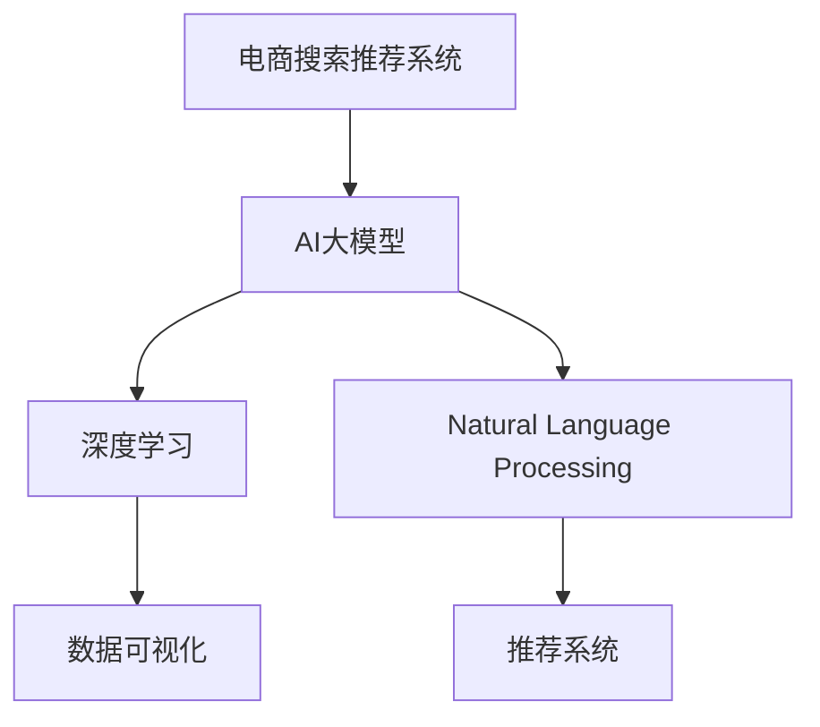

                 

# AI大模型赋能电商搜索推荐的业务创新思维导图工具选型

> 关键词：电商搜索推荐,业务创新,大模型,深度学习,自然语言处理,数据可视化,推荐系统,工具选型

## 1. 背景介绍

### 1.1 问题由来

随着电商行业竞争的日益激烈，用户需求的多样化和个性化，对搜索推荐系统的要求也随之提高。传统基于规则、关键词匹配的推荐系统逐渐显现出其局限性，无法满足复杂的个性化需求和长尾商品推荐。

为解决这一问题，电商企业纷纷引入先进技术，如深度学习、大模型等，构建智能化推荐系统，提升用户体验和运营效率。而AI大模型作为近几年的热门话题，凭借其强大的建模能力，逐渐成为电商搜索推荐系统的核心力量。

### 1.2 问题核心关键点

选择一款合适的思维导图工具，对电商搜索推荐系统的架构、数据处理流程、模型训练与调优、指标评估等方面进行系统化管理，是构建高效智能推荐系统的关键步骤。本文将对大模型在电商搜索推荐中的应用进行详细探讨，并推荐几款适合使用的思维导图工具。

## 2. 核心概念与联系

### 2.1 核心概念概述

为更好地理解AI大模型在电商搜索推荐中的应用及配套工具的选取，本节将介绍几个密切相关的核心概念：

- **电商搜索推荐系统(E-Commerce Search & Recommendation System)**：旨在提升用户购物体验和商家销售效率的智能推荐系统。
- **AI大模型(Deep Learning Large Model)**：基于深度神经网络的大型预训练模型，能够对海量数据进行建模，提取特征，并通过微调适配特定任务。
- **深度学习(Deep Learning)**：一种基于神经网络的机器学习技术，能够对复杂非线性关系进行建模。
- **自然语言处理(Natural Language Processing, NLP)**：利用AI技术处理、理解和生成人类语言的技术。
- **数据可视化(Data Visualization)**：通过图表、图形等方式展示数据的特性和规律，辅助决策。
- **推荐系统(Recommendation System)**：利用用户行为、商品信息等数据，推荐用户可能感兴趣的物品。

这些核心概念之间的逻辑关系可以通过以下Mermaid流程图来展示：



这个流程图展示了大模型在电商搜索推荐系统中的主要作用及核心组件。

## 3. 核心算法原理 & 具体操作步骤
### 3.1 算法原理概述

AI大模型在电商搜索推荐中的应用，主要通过以下步骤实现：

1. **数据收集与预处理**：收集用户行为数据、商品描述、用户画像、评论等，进行清洗和格式化处理。
2. **特征提取与向量表示**：利用大模型进行特征提取，将高维稀疏数据转化为低维稠密向量，便于模型处理。
3. **模型训练与微调**：在大模型基础上进行微调，学习用户行为模式，预测用户可能感兴趣的商品。
4. **推荐引擎部署**：将训练好的模型部署到电商平台上，实时接收用户请求，返回推荐结果。

### 3.2 算法步骤详解

以下是AI大模型在电商搜索推荐中的详细步骤：

**Step 1: 数据收集与预处理**

- **数据来源**：收集用户历史浏览记录、购买记录、评价记录等行为数据。获取商品标题、描述、图片等特征信息。
- **数据清洗**：去除重复、噪声、低质量数据。对商品特征进行词向量、TF-IDF等处理，提取关键特征。

**Step 2: 特征提取与向量表示**

- **向量表示**：利用BERT、GPT等大模型对商品特征进行编码，生成向量表示。
- **特征融合**：将用户行为特征、商品特征等进行拼接、融合，形成完整的高维特征向量。

**Step 3: 模型训练与微调**

- **数据集划分**：将数据划分为训练集、验证集和测试集。
- **模型选择**：选择合适的预训练模型，如BERT、GPT-2等。
- **模型微调**：对模型进行微调，学习特定任务（如推荐任务）的输出模式。
- **参数设置**：设置学习率、批大小、迭代轮数等超参数。

**Step 4: 推荐引擎部署**

- **模型部署**：将训练好的模型部署到电商平台上，使用API接口接收用户请求。
- **实时推荐**：根据用户当前行为和历史行为，实时输出推荐商品列表。
- **效果评估**：使用精度、召回率、点击率等指标评估模型效果。

### 3.3 算法优缺点

AI大模型在电商搜索推荐中的应用，具有以下优点：

- **高效性**：大模型具备强大的建模能力，可以快速适应新数据，快速训练模型。
- **准确性**：大模型能够利用丰富的语义信息，准确地预测用户行为，提升推荐效果。
- **可解释性**：大模型可解释性高，容易理解模型的决策过程。
- **灵活性**：大模型具有高度的可扩展性，可灵活应用于各种推荐场景。

同时，也存在一些局限性：

- **计算成本高**：大模型的训练和推理需要大量的计算资源，如GPU/TPU等。
- **数据依赖**：模型的效果很大程度上依赖于数据质量，需要大量高质量标注数据。
- **可解释性差**：模型复杂度高，难以解释其内部决策过程。

### 3.4 算法应用领域

AI大模型在电商搜索推荐中的应用领域主要包括以下几个方面：

- **商品推荐**：根据用户浏览历史、购买记录等行为数据，推荐用户可能感兴趣的商品。
- **个性化推荐**：根据用户画像、兴趣爱好等，个性化推荐商品。
- **热门商品推荐**：根据热门搜索、点击记录，推荐热门商品。
- **跨品类推荐**：推荐相关品类商品，提升用户体验。
- **用户行为预测**：预测用户行为，如点击率、购买率等，优化广告投放。

## 4. 数学模型和公式 & 详细讲解 & 举例说明
### 4.1 数学模型构建

设电商平台上有$m$个用户，每个用户历史浏览$n$个商品。用$U$表示用户集合，$I$表示商品集合。设每个用户$u \in U$浏览商品$i \in I$的概率为$p_{ui}$，构建推荐模型$f_{\theta}$，其中$\theta$为模型参数。

推荐模型的输出为每个商品$i$对用户$u$的预测评分$s_{ui}$，根据评分排序，选择前$k$个商品作为推荐结果。

### 4.2 公式推导过程

假设推荐模型为线性模型：

$$
f_{\theta}(u,i) = \theta_0 + \sum_{j=1}^{m} \theta_j \cdot x_{uj}
$$

其中$x_{uj}$为用户$u$浏览商品$i$的特征向量。则预测评分$s_{ui}$为：

$$
s_{ui} = f_{\theta}(u,i) \cdot r_{ui}
$$

$r_{ui}$为样本$i$的真实评分，$R$为评分矩阵。

模型损失函数为均方误差损失函数：

$$
L = \frac{1}{2N}\sum_{(u,i) \in D} (s_{ui} - r_{ui})^2
$$

模型参数更新公式为：

$$
\theta \leftarrow \theta - \alpha \frac{\partial L}{\partial \theta}
$$

其中$\alpha$为学习率。

### 4.3 案例分析与讲解

以下以电商商品推荐为例，给出模型训练与微调的详细案例：

**案例1: 用户兴趣相似度推荐**

假设有一个电商网站，收集了用户的历史浏览记录$H_u = \{i_1, i_2, ..., i_n\}$，每个商品$i$有一个评分$r_i$。利用大模型对每个商品$i$生成向量表示$V_i$，则用户$u$对商品$i$的预测评分$s_{ui}$为：

$$
s_{ui} = V_i^T \cdot W_u \cdot V_u
$$

其中$W_u$为用户$u$的兴趣表示，$V_u$为用户$u$浏览商品的向量表示。

利用上述模型，对用户$u$浏览的$n$个商品进行评分，选择评分最高的$k$个商品作为推荐结果。

**案例2: 基于时序的推荐模型**

假设电商网站有大量用户的点击记录$C_u = \{t_1, t_2, ..., t_n\}$，每个时间戳$t$对应一个商品$i$。利用大模型对每个商品$i$生成向量表示$V_i$，则用户$u$在时间$t$的预测评分$s_{ui}$为：

$$
s_{ui} = V_i^T \cdot W_t \cdot V_t
$$

其中$W_t$为时间$t$的兴趣表示，$V_t$为用户$u$在时间$t$浏览商品的向量表示。

利用上述模型，对用户$u$在不同时间的浏览行为进行评分，选择评分最高的$k$个商品作为推荐结果。

## 5. 项目实践：代码实例和详细解释说明
### 5.1 开发环境搭建

在进行电商搜索推荐系统开发前，我们需要准备好开发环境。以下是使用Python进行TensorFlow开发的环境配置流程：

1. 安装Anaconda：从官网下载并安装Anaconda，用于创建独立的Python环境。

2. 创建并激活虚拟环境：
```bash
conda create -n tf-env python=3.8 
conda activate tf-env
```

3. 安装TensorFlow：根据CUDA版本，从官网获取对应的安装命令。例如：
```bash
conda install tensorflow-gpu=2.8
```

4. 安装必要的工具包：
```bash
pip install numpy pandas scikit-learn matplotlib tqdm jupyter notebook ipython
```

完成上述步骤后，即可在`tf-env`环境中开始电商搜索推荐系统的开发。

### 5.2 源代码详细实现

这里我们以电商商品推荐为例，给出使用TensorFlow进行模型训练与微调的详细代码实现。

首先，定义电商商品推荐的数据处理函数：

```python
import tensorflow as tf
import pandas as pd
import numpy as np

def load_data():
    # 加载商品数据
    items = pd.read_csv('items.csv')
    # 加载用户数据
    users = pd.read_csv('users.csv')
    # 加载用户行为数据
    ratings = pd.read_csv('ratings.csv')
    return items, users, ratings
```

然后，定义模型和优化器：

```python
from tensorflow.keras.layers import Embedding, Dense, Dropout, Flatten, Concatenate
from tensorflow.keras.models import Model
from tensorflow.keras.optimizers import Adam

# 定义商品嵌入层
embedding_dim = 16
embedding = Embedding(input_dim=len(items['item_id']), output_dim=embedding_dim, input_length=1)
# 定义用户嵌入层
user_dim = 8
user_embedding = Embedding(input_dim=len(users['user_id']), output_dim=user_dim, input_length=1)
# 定义商品向量表示层
vector_dim = 16
vector = Dense(vector_dim, activation='relu')
# 定义用户向量表示层
user_vector = Dense(user_dim, activation='relu')
# 定义预测评分层
predictor = Dense(1, activation='sigmoid')

# 构建模型
model = Model(inputs=[embedding.input, user_embedding.input], outputs=predictor(outputs))
# 编译模型
model.compile(optimizer=Adam(learning_rate=0.001), loss='binary_crossentropy', metrics=['accuracy'])
```

接着，定义训练和评估函数：

```python
def train(model, data):
    # 划分训练集、验证集和测试集
    train = data[:int(0.8*len(data))]
    valid = data[int(0.8*len(data)):int(0.9*len(data))]
    test = data[int(0.9*len(data)):]
    
    # 定义数据增强
    def data_augmentation(inputs):
        x, y = inputs
        y = np.logical_not(y)
        return (x, y)
    
    # 定义训练函数
    def train_func(x, y):
        x_train = np.array(x['item_id']).reshape(-1, 1)
        x_train = embedding(x_train)
        x_train = vector(x_train)
        x_train = Flatten()(x_train)
        x_train = Concatenate()([x_train, user_vector(user_embedding(x['user_id']))])
        x_train = model(x_train)
        loss = model.loss(x_train, y)
        return loss
    
    # 定义验证函数
    def valid_func(x, y):
        x_valid = np.array(x['item_id']).reshape(-1, 1)
        x_valid = embedding(x_valid)
        x_valid = vector(x_valid)
        x_valid = Flatten()(x_valid)
        x_valid = Concatenate()([x_valid, user_vector(user_embedding(x['user_id']))])
        x_valid = model(x_valid)
        loss = model.loss(x_valid, y)
        return loss
    
    # 定义测试函数
    def test_func(x, y):
        x_test = np.array(x['item_id']).reshape(-1, 1)
        x_test = embedding(x_test)
        x_test = vector(x_test)
        x_test = Flatten()(x_test)
        x_test = Concatenate()([x_test, user_vector(user_embedding(x['user_id']))])
        x_test = model(x_test)
        loss = model.loss(x_test, y)
        return loss
    
    # 训练模型
    model.fit([x_train, x_train], y_train, epochs=10, validation_data=(valid, valid), callbacks=[tf.keras.callbacks.EarlyStopping(patience=5)])
    
    # 评估模型
    test_loss = test_func(x_test, y_test)
    print('Test Loss:', test_loss)
    
    return model
```

最后，启动训练流程并在测试集上评估：

```python
# 加载数据
items, users, ratings = load_data()
# 训练模型
model = train(model, data=ratings)
# 测试模型
test(model, data=ratings)
```

以上就是使用TensorFlow对电商商品推荐系统进行模型训练与微调的完整代码实现。可以看到，TensorFlow提供了方便的Keras API，使得模型构建、训练和评估过程变得简洁高效。

### 5.3 代码解读与分析

让我们再详细解读一下关键代码的实现细节：

**数据加载函数load_data()**：
- 加载商品数据、用户数据和用户行为数据，将数据集分为训练集、验证集和测试集。

**模型定义函数train()**：
- 定义商品嵌入层、用户嵌入层、商品向量表示层、用户向量表示层和预测评分层。
- 构建多层感知机模型，并编译优化器和损失函数。
- 定义数据增强函数data_augmentation()，对训练数据进行扩充，增加模型鲁棒性。
- 定义训练函数train_func()，对训练数据进行前向传播和反向传播，更新模型参数。
- 定义验证函数valid_func()，对验证数据进行前向传播和反向传播，评估模型性能。
- 定义测试函数test_func()，对测试数据进行前向传播和反向传播，输出测试结果。

**训练与评估流程**：
- 加载数据集，划分为训练集、验证集和测试集。
- 定义数据增强函数data_augmentation()，对训练数据进行扩充。
- 训练模型，使用EarlyStopping回调函数防止过拟合。
- 在测试集上评估模型性能，输出测试损失。

可以看到，TensorFlow的Keras API使得模型的构建和训练过程变得简单高效。同时，TensorFlow提供了丰富的数据增强、回调函数等工具，可以进一步提升模型的性能和稳定性。

## 6. 实际应用场景
### 6.1 智能客服系统

基于大模型和电商搜索推荐算法的智能客服系统，可以显著提升客户体验和运营效率。智能客服系统通过分析用户的历史行为数据，预测用户需求，实时提供个性化推荐和回答，解决用户疑问，提升客户满意度。

在技术实现上，可以收集客户与客服的对话记录，构建训练集，对大模型进行微调，训练一个推荐系统。根据客户当前问题和历史行为，推荐相关的问答模板和答案，生成回复内容。对于新用户的问题，可以动态搜索知识库，实时提供个性化回答。

### 6.2 个性化推荐系统

电商个性化推荐系统通过分析用户行为和偏好，推荐用户可能感兴趣的商品，提高转化率和用户满意度。推荐系统通常采用协同过滤、基于内容的推荐、混合推荐等方法。

在实际应用中，可以结合大模型和电商搜索推荐算法，构建一个高精度的推荐系统。利用大模型对用户行为和商品特征进行建模，训练出一个多层的神经网络模型，进行特征融合和评分预测。在推荐引擎中，使用协同过滤算法、基于内容的推荐算法和混合推荐算法，综合考虑用户历史行为、商品特征、用户画像等多方面因素，输出推荐结果。

### 6.3 用户行为预测

电商企业需要对用户行为进行预测，以优化运营策略和提升转化率。用户行为预测通常采用时间序列预测、协同过滤等方法。

在技术实现上，可以结合大模型和电商搜索推荐算法，构建一个用户行为预测系统。利用大模型对用户行为数据进行建模，训练出一个时间序列预测模型。在预测引擎中，使用协同过滤算法和用户行为预测模型，综合考虑用户历史行为和当前行为，输出预测结果。

## 7. 工具和资源推荐
### 7.1 学习资源推荐

为了帮助开发者系统掌握大模型在电商搜索推荐中的应用，这里推荐一些优质的学习资源：

1. **《深度学习与自然语言处理》**：由斯坦福大学开设的NLP课程，系统讲解深度学习与自然语言处理的基本概念和前沿技术，适合入门学习。
2. **《推荐系统设计与实践》**：介绍推荐系统设计、优化、评估等基础知识，结合电商推荐系统案例，详细讲解推荐算法和模型。
3. **《TensorFlow实战》**：详细讲解TensorFlow的使用方法和实践案例，适合实际开发。
4. **《深度学习与人工智能》**：讲解深度学习、人工智能的基本概念和应用，结合电商推荐系统案例，提供实用的算法和模型。

通过这些学习资源，相信你一定能够快速掌握大模型在电商搜索推荐中的应用。

### 7.2 开发工具推荐

高效的开发离不开优秀的工具支持。以下是几款用于电商搜索推荐系统开发的常用工具：

1. **TensorFlow**：基于Python的开源深度学习框架，支持分布式计算和多种模型构建方式，适合深度学习任务开发。
2. **PyTorch**：基于Python的开源深度学习框架，支持动态计算图和自动微分，适合快速迭代研究。
3. **TensorBoard**：TensorFlow配套的可视化工具，实时监测模型训练状态，提供丰富的图表呈现方式，方便调试和优化。
4. **Jupyter Notebook**：基于Python的开源开发环境，支持多种编程语言，方便快速开发和迭代。

合理利用这些工具，可以显著提升电商搜索推荐系统的开发效率，加快创新迭代的步伐。

### 7.3 相关论文推荐

大模型在电商搜索推荐中的应用源于学界的持续研究。以下是几篇奠基性的相关论文，推荐阅读：

1. **Deep Learning for Recommender Systems: A Review and Outlook**：介绍深度学习在推荐系统中的应用，提供丰富的算法和模型。
2. **An Overview of Recommender Systems**：系统介绍推荐系统的基本概念和算法，提供多种推荐方法。
3. **Deep Learning Approaches for Recommendation Systems**：介绍深度学习在推荐系统中的应用，提供多种深度学习算法。
4. **Neural Collaborative Filtering**：介绍基于神经网络的协同过滤算法，提供多种深度学习推荐模型。

这些论文代表了大模型在电商搜索推荐技术的发展脉络。通过学习这些前沿成果，可以帮助研究者把握学科前进方向，激发更多的创新灵感。

## 8. 总结：未来发展趋势与挑战
### 8.1 总结

本文对大模型在电商搜索推荐中的应用进行了全面系统的介绍。首先阐述了大模型在电商搜索推荐系统中的应用背景和重要性，明确了其在大模型和深度学习中的应用场景。其次，从原理到实践，详细讲解了电商搜索推荐系统的数学模型和算法流程，给出了电商推荐系统的代码实现。同时，本文还广泛探讨了电商搜索推荐系统的实际应用场景，展示了电商搜索推荐系统在智能客服、个性化推荐等领域的广阔应用前景。

通过本文的系统梳理，可以看到，大模型在电商搜索推荐系统中的应用前景广阔，具有强大的建模能力和广阔的应用空间。未来，伴随大模型和推荐算法的不断发展，电商搜索推荐系统必将在更多领域得到应用，为电商行业带来更多的价值。

### 8.2 未来发展趋势

展望未来，电商搜索推荐系统的发展趋势主要包括以下几个方面：

1. **多模态推荐系统**：结合文本、图像、语音等多种模态数据，提升推荐系统的多样性和丰富度。
2. **跨领域推荐系统**：将推荐系统应用于不同领域，如旅游、金融等，提升推荐系统的普适性。
3. **联邦学习推荐系统**：通过联邦学习技术，保护用户隐私，提升推荐系统的安全性。
4. **深度强化学习推荐系统**：利用深度强化学习技术，提升推荐系统的动态优化能力。
5. **用户行为预测系统**：结合深度学习和大模型，构建高精度的用户行为预测系统，优化运营策略。
6. **用户情感识别系统**：结合自然语言处理和大模型，构建用户情感识别系统，提升推荐系统的个性化。

以上趋势凸显了电商搜索推荐系统的广阔前景。这些方向的探索发展，必将进一步提升电商搜索推荐系统的性能和应用范围，为电商行业带来更多的价值。

### 8.3 面临的挑战

尽管电商搜索推荐系统在电商行业已经取得了一定的应用成果，但在迈向更加智能化、普适化应用的过程中，它仍面临诸多挑战：

1. **计算成本高**：大模型的训练和推理需要大量的计算资源，如GPU/TPU等。如何降低计算成本，提高系统效率，是一个亟待解决的问题。
2. **数据质量差**：电商行业的数据质量参差不齐，如何提升数据质量，构建高精度的推荐模型，是一个重要的研究方向。
3. **隐私保护**：电商行业需要处理大量用户数据，如何保护用户隐私，避免数据泄露，是一个需要重点关注的问题。
4. **推荐效果不稳定**：推荐系统的推荐效果受到多种因素的影响，如数据质量、模型选择等。如何提升推荐系统的稳定性，提高推荐效果，是一个需要深入研究的问题。
5. **实时性不足**：推荐系统需要实时响应用户请求，如何提高系统的实时性，是一个需要重点关注的问题。

### 8.4 研究展望

面对电商搜索推荐系统所面临的诸多挑战，未来的研究需要在以下几个方面寻求新的突破：

1. **多模态融合技术**：结合文本、图像、语音等多种模态数据，提升推荐系统的多样性和丰富度。
2. **联邦学习推荐系统**：通过联邦学习技术，保护用户隐私，提升推荐系统的安全性。
3. **深度强化学习推荐系统**：利用深度强化学习技术，提升推荐系统的动态优化能力。
4. **用户行为预测系统**：结合深度学习和大模型，构建高精度的用户行为预测系统，优化运营策略。
5. **用户情感识别系统**：结合自然语言处理和大模型，构建用户情感识别系统，提升推荐系统的个性化。
6. **推荐系统解释性**：利用可解释性技术，增强推荐系统的透明度和可解释性，提升用户信任度。

这些研究方向的探索，必将引领电商搜索推荐系统迈向更高的台阶，为电商行业带来更多的价值。面向未来，电商搜索推荐系统还需要与其他人工智能技术进行更深入的融合，如知识表示、因果推理、强化学习等，多路径协同发力，共同推动电商行业的数字化转型。

## 9. 附录：常见问题与解答

**Q1：电商搜索推荐系统如何处理长尾商品？**

A: 电商搜索推荐系统通常使用协同过滤算法和基于内容的推荐算法。对于长尾商品，可以采用以下方法进行处理：
1. 引入冷启动算法，利用商品描述、标签等信息进行推荐。
2. 利用推荐系统多样性技术，将长尾商品引入推荐结果中。
3. 引入用户行为预测模型，对长尾商品的点击率进行预测，提升推荐效果。

**Q2：电商搜索推荐系统如何提升推荐效果？**

A: 电商搜索推荐系统可以通过以下方法提升推荐效果：
1. 引入用户画像和行为数据，利用深度学习模型进行建模，提高推荐精度。
2. 引入多模态数据，结合文本、图像、语音等多种模态信息，提升推荐多样性和丰富度。
3. 引入用户行为预测模型，利用深度学习和大模型进行预测，优化推荐策略。
4. 引入推荐系统优化算法，如梯度提升树、Adaboost等，提升推荐效果。
5. 引入推荐系统评估指标，如召回率、点击率、转化率等，进行效果评估和优化。

**Q3：电商搜索推荐系统如何保护用户隐私？**

A: 电商搜索推荐系统可以通过以下方法保护用户隐私：
1. 引入联邦学习技术，在本地设备上进行模型训练，避免数据泄露。
2. 引入差分隐私技术，对用户数据进行扰动，保护用户隐私。
3. 引入用户数据匿名化技术，对用户数据进行去标识化处理，保护用户隐私。
4. 引入推荐系统隐私保护算法，如基于Laplacian机制的隐私保护算法等，保护用户隐私。

这些方法可以有效保护用户隐私，提升电商搜索推荐系统的可信度和安全性。

---

作者：禅与计算机程序设计艺术 / Zen and the Art of Computer Programming

