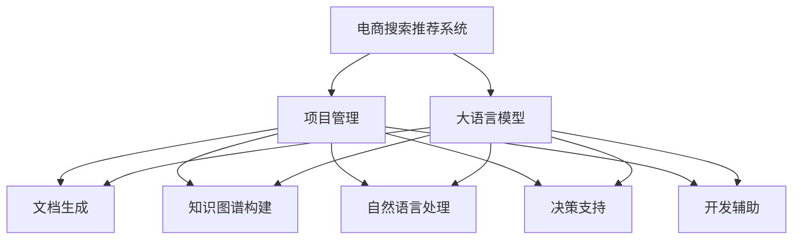

                 

# AI大模型赋能电商搜索推荐的业务创新项目管理平台搭建与功能优化

## 1. 背景介绍

### 1.1 问题由来

在电商领域，搜索推荐系统是提升用户体验、增加用户粘性、促进转化的关键环节。传统的搜索推荐系统大多基于关键词匹配、协同过滤、矩阵分解等方法，依赖于用户行为数据，容易陷入冷启动和数据稀疏等问题。近年来，随着人工智能技术的迅猛发展，基于深度学习、强化学习的推荐系统开始崭露头角，显著提升了搜索推荐的精准性和个性化程度。

然而，高质量的电商搜索推荐系统不仅需要庞大的用户数据，还需要高效的计算能力和丰富的业务知识，对技术实现提出了很高的要求。项目的管理和优化成为电商搜索推荐系统建设过程中的一个重要挑战。如何系统化、模块化地管理推荐系统项目，同时灵活应对市场变化和用户需求，是电商企业持续创新、保持竞争力的重要保障。

### 1.2 问题核心关键点

大语言模型作为AI技术的最新突破，具备强大的文本理解能力和知识推理能力，可以用于电商搜索推荐系统的项目管理和功能优化。通过系统化、结构化的应用，大语言模型可以在以下方面发挥作用：

- 自动化文档生成：快速生成项目计划、技术文档、业务需求等文档，提高项目管理效率。
- 知识图谱构建：利用大模型构建电商领域的知识图谱，辅助推荐系统了解用户意图和产品关系。
- 自然语言处理：对用户评论、产品描述等文本数据进行情感分析、实体抽取，增强推荐系统理解力。
- 决策支持：辅助团队进行决策分析和业务建模，预测市场趋势和用户行为。
- 开发辅助：自动生成代码模板、API接口，帮助开发者快速构建推荐系统。

本文聚焦于基于大语言模型构建的电商搜索推荐业务创新项目管理平台，将从系统设计、功能优化、项目落地等方面展开详细探讨，为电商企业提供可行的参考方案。

## 2. 核心概念与联系

### 2.1 核心概念概述

在构建电商搜索推荐业务创新项目管理平台时，涉及多个关键概念和技术。这些概念和技术之间的联系可以通过以下Mermaid流程图来展示：



这个流程图展示了大语言模型在电商搜索推荐项目管理平台中的核心作用，以及其与其他模块之间的联系：

1. **电商搜索推荐系统**：电商平台的核心业务系统，负责处理用户查询、商品展示、推荐等。
2. **大语言模型**：作为核心技术，具备文本理解和推理能力，可以辅助文档生成、知识图谱构建、自然语言处理、决策支持、开发辅助等模块。
3. **项目管理**：通过大语言模型生成项目文档、管理项目进度、分配任务，提升项目管理效率。
4. **文档生成**：利用大模型生成项目计划、技术文档、业务需求等文档，快速推进项目进度。
5. **知识图谱构建**：通过大模型学习电商领域的知识，构建实体关系图，辅助推荐系统理解用户意图和产品关系。
6. **自然语言处理**：使用大语言模型对用户评论、产品描述等文本数据进行处理，提升推荐系统理解力。
7. **决策支持**：利用大模型辅助团队进行决策分析和业务建模，预测市场趋势和用户行为。
8. **开发辅助**：使用大语言模型自动生成代码模板、API接口，帮助开发者快速构建推荐系统。

这些概念和技术相互关联，共同构成了电商搜索推荐业务创新项目管理平台的框架，使大语言模型在电商平台中的应用更加全面和深入。

## 3. 核心算法原理 & 具体操作步骤

### 3.1 算法原理概述

基于大语言模型的电商搜索推荐项目管理平台，主要包括以下几个关键模块：文档生成、知识图谱构建、自然语言处理、决策支持和开发辅助。以下将详细介绍每个模块的算法原理。

### 3.2 算法步骤详解

#### 3.2.1 文档生成

**算法步骤**：
1. **数据收集**：收集项目相关的文档、需求、任务清单等文本数据。
2. **模型初始化**：选择预训练的大语言模型，如GPT、BERT等，进行微调以适应电商领域。
3. **输入格式化**：将收集到的文本数据进行格式化，例如分词、句子切分等。
4. **模型输入**：将格式化后的文本数据作为大模型的输入。
5. **生成文档**：大模型根据输入生成相应的文档，如项目计划、技术文档、业务需求等。
6. **后处理**：对生成的文档进行校对和优化，确保文档质量和格式符合规范。

#### 3.2.2 知识图谱构建

**算法步骤**：
1. **实体识别**：使用命名实体识别(NER)技术，从电商领域的大量文本中识别出产品、品牌、用户等实体。
2. **关系抽取**：利用语义关系抽取技术，从用户评论、产品描述等文本中抽取实体之间的关系。
3. **知识图谱构建**：将识别出的实体和抽取的关系构建成知识图谱，如RDF三元组或图数据库等。
4. **知识融合**：将知识图谱与外部知识源（如百度百科、维基百科等）进行融合，丰富电商领域的知识图谱。
5. **模型训练**：使用大语言模型对知识图谱进行训练，提高知识图谱的表示能力和推理能力。
6. **应用扩展**：将训练好的知识图谱应用于电商搜索推荐系统的实体关系查询、用户意图理解等场景。

#### 3.2.3 自然语言处理

**算法步骤**：
1. **情感分析**：使用大语言模型对用户评论、产品描述等文本进行情感分析，判断用户情绪倾向。
2. **实体抽取**：从文本中识别出产品、品牌、用户等实体，辅助推荐系统理解用户意图。
3. **关键词提取**：利用大语言模型提取文本中的关键词，帮助推荐系统了解用户关注点。
4. **相似度计算**：通过计算文本之间的相似度，推荐相关产品或用户评论。
5. **文本生成**：使用大语言模型自动生成商品描述、用户评论等内容，提升用户体验。

#### 3.2.4 决策支持

**算法步骤**：
1. **数据收集**：收集电商领域的相关数据，如用户行为数据、市场趋势数据等。
2. **模型训练**：使用大语言模型训练决策模型，如随机森林、梯度提升树等。
3. **业务建模**：利用大语言模型进行业务建模，预测市场趋势、用户行为等。
4. **结果分析**：对决策模型的输出进行分析和解释，辅助团队进行决策。
5. **模型优化**：根据实际情况对决策模型进行优化，提高预测精度。

#### 3.2.5 开发辅助

**算法步骤**：
1. **代码生成**：使用大语言模型自动生成推荐系统的代码模板，提高开发效率。
2. **API接口**：利用大语言模型自动生成API接口文档，帮助开发者理解接口功能。
3. **版本控制**：使用大语言模型生成版本控制信息，如提交信息、变更说明等。
4. **测试用例**：利用大语言模型生成测试用例，辅助开发者进行单元测试和集成测试。
5. **性能优化**：通过大语言模型分析代码性能瓶颈，提出优化建议。

### 3.3 算法优缺点

**算法优点**：
1. **效率高**：大语言模型能够快速生成文档、构建知识图谱、处理自然语言，大幅提升项目管理效率。
2. **可扩展性强**：大语言模型可以适应不同的电商领域和业务需求，具有良好的可扩展性。
3. **准确性高**：大语言模型能够理解复杂的自然语言，准确识别实体和关系，提高推荐系统的理解力。
4. **灵活性高**：大语言模型可以根据不同的任务进行微调，适应不同的场景和需求。

**算法缺点**：
1. **依赖数据质量**：大语言模型的效果很大程度上依赖于输入数据的准确性和完整性，对数据质量要求较高。
2. **计算资源消耗大**：大语言模型需要大量的计算资源进行训练和推理，对硬件设备的要求较高。
3. **模型解释性差**：大语言模型的决策过程难以解释，对模型的可解释性要求较高。
4. **学习成本高**：使用大语言模型需要较高的技术门槛，对团队的技术能力要求较高。

### 3.4 算法应用领域

基于大语言模型的电商搜索推荐项目管理平台，可以应用于以下多个领域：

- **电商运营**：辅助电商运营团队进行项目管理和文档生成，提高运营效率。
- **营销推广**：利用大语言模型分析用户行为和市场趋势，优化营销策略。
- **客户服务**：通过大语言模型进行自然语言处理和情感分析，提升客户服务质量。
- **产品开发**：使用大语言模型生成代码模板和API接口，辅助产品开发。
- **数据分析**：利用大语言模型构建知识图谱和进行决策支持，优化数据分析流程。

## 4. 数学模型和公式 & 详细讲解 & 举例说明

### 4.1 数学模型构建

基于大语言模型的电商搜索推荐项目管理平台，涉及多个数学模型，以下将详细介绍每个模型的构建和应用。

#### 4.1.1 文档生成模型

**数学模型**：
- **输入**：文本数据 $T=\{t_1, t_2, ..., t_n\}$，其中 $t_i$ 为第 $i$ 条文本数据。
- **输出**：生成的文档 $D=\{d_1, d_2, ..., d_m\}$，其中 $d_j$ 为第 $j$ 份生成的文档。

**公式推导**：
- **编码器**：使用大语言模型的编码器对输入文本进行编码，得到文本表示 $E=\{e_1, e_2, ..., e_n\}$。
- **解码器**：使用大语言模型的解码器对文本表示进行解码，生成文档 $D$。

**案例分析**：
- **输入**：电商项目需求文本："构建一个电商搜索推荐系统，实现基于用户行为的个性化推荐，提升用户购买转化率。"
- **输出**：生成的项目计划文档："项目需求：构建电商搜索推荐系统。项目目标：实现基于用户行为的个性化推荐，提升用户购买转化率。项目时间：2023年Q1至Q3。项目成员：张三、李四、王五。"

#### 4.1.2 知识图谱构建模型

**数学模型**：
- **输入**：电商领域的文本数据 $T=\{t_1, t_2, ..., t_n\}$，其中 $t_i$ 为第 $i$ 条文本数据。
- **输出**：知识图谱 $G=(V, E)$，其中 $V$ 为节点集合，$E$ 为边集合。

**公式推导**：
- **实体识别**：使用命名实体识别技术，从文本中识别出实体 $R=\{r_1, r_2, ..., r_m\}$。
- **关系抽取**：使用语义关系抽取技术，从文本中抽取实体之间的关系 $R'$。
- **构建知识图谱**：将识别出的实体和抽取的关系构建成知识图谱。

**案例分析**：
- **输入**：电商用户评论文本："商品A性价比高，质量好，性价比高。"
- **输出**：生成的知识图谱：$V=\{商品A, 性价比, 质量\}$，$E=\{商品A-性价比, 商品A-质量\}$。

#### 4.1.3 自然语言处理模型

**数学模型**：
- **输入**：用户评论 $C=\{c_1, c_2, ..., c_n\}$，其中 $c_i$ 为第 $i$ 条用户评论。
- **输出**：情感分析结果 $E=\{e_1, e_2, ..., e_n\}$，其中 $e_i$ 为第 $i$ 条评论的情感得分。

**公式推导**：
- **情感分析**：使用大语言模型对评论进行情感分析，得到情感得分 $e_i$。

**案例分析**：
- **输入**：用户评论："商品A性价比高，质量好。"
- **输出**：情感分析结果：得分 $e_i=0.8$，表示评论情感倾向为正面。

#### 4.1.4 决策支持模型

**数学模型**：
- **输入**：电商领域的数据集 $D=\{d_1, d_2, ..., d_n\}$，其中 $d_i$ 为第 $i$ 条电商数据。
- **输出**：决策结果 $R=\{r_1, r_2, ..., r_m\}$，其中 $r_j$ 为第 $j$ 个决策结果。

**公式推导**：
- **数据预处理**：对数据进行预处理，如特征工程、数据清洗等。
- **模型训练**：使用大语言模型训练决策模型，如随机森林、梯度提升树等。
- **业务建模**：利用训练好的模型进行业务建模，预测市场趋势、用户行为等。

**案例分析**：
- **输入**：电商用户行为数据 $D=\{用户ID, 商品ID, 浏览时间, 购买时间, 购买金额\}$。
- **输出**：决策结果：预计用户未来购买商品A的概率为 $r_1=0.7$。

#### 4.1.5 开发辅助模型

**数学模型**：
- **输入**：电商推荐系统代码片段 $S=\{s_1, s_2, ..., s_n\}$，其中 $s_i$ 为第 $i$ 段代码。
- **输出**：生成的代码模板 $T=\{t_1, t_2, ..., t_m\}$，其中 $t_j$ 为第 $j$ 段生成的代码。

**公式推导**：
- **代码生成**：使用大语言模型自动生成代码模板。

**案例分析**：
- **输入**：电商推荐系统代码片段："def recommend_products(user_id):"
- **输出**：生成的代码模板："def recommend_products(user_id):\n    # 获取用户行为数据\n    user_behaviors = get_user_behaviors(user_id)\n    # 计算用户行为相似度\n    similar_users = calculate_similar_users(user_id)\n    # 推荐相关商品\n    recommended_products = recommend_products(similar_users)\n    return recommended_products"

### 4.2 公式推导过程

#### 4.2.1 文档生成模型公式推导

- **编码器**：使用大语言模型的编码器对输入文本进行编码，得到文本表示 $e_i=\text{Encoder}(t_i)$。
- **解码器**：使用大语言模型的解码器对文本表示进行解码，生成文档 $d_j=\text{Decoder}(e_i)$。

#### 4.2.2 知识图谱构建模型公式推导

- **实体识别**：使用命名实体识别技术，从文本中识别出实体 $r_i=\text{NER}(t_i)$。
- **关系抽取**：使用语义关系抽取技术，从文本中抽取实体之间的关系 $r'_i=\text{REL}(t_i)$。
- **构建知识图谱**：将识别出的实体和抽取的关系构建成知识图谱 $G=(V,E)$。

#### 4.2.3 自然语言处理模型公式推导

- **情感分析**：使用大语言模型对评论进行情感分析，得到情感得分 $e_i=\text{SentimentAnalysis}(c_i)$。

#### 4.2.4 决策支持模型公式推导

- **数据预处理**：对数据进行预处理，如特征工程、数据清洗等。
- **模型训练**：使用大语言模型训练决策模型 $M=\text{DecisionModel}(D)$。
- **业务建模**：利用训练好的模型进行业务建模，预测市场趋势、用户行为等。

#### 4.2.5 开发辅助模型公式推导

- **代码生成**：使用大语言模型自动生成代码模板 $T=\text{CodeGeneration}(S)$。

## 5. 项目实践：代码实例和详细解释说明

### 5.1 开发环境搭建

在进行项目实践前，我们需要准备好开发环境。以下是使用Python进行PyTorch开发的环境配置流程：

1. 安装Anaconda：从官网下载并安装Anaconda，用于创建独立的Python环境。

2. 创建并激活虚拟环境：
```bash
conda create -n pytorch-env python=3.8 
conda activate pytorch-env
```

3. 安装PyTorch：根据CUDA版本，从官网获取对应的安装命令。例如：
```bash
conda install pytorch torchvision torchaudio cudatoolkit=11.1 -c pytorch -c conda-forge
```

4. 安装Transformers库：
```bash
pip install transformers
```

5. 安装各类工具包：
```bash
pip install numpy pandas scikit-learn matplotlib tqdm jupyter notebook ipython
```

完成上述步骤后，即可在`pytorch-env`环境中开始项目实践。

### 5.2 源代码详细实现

首先我们以文档生成为例，给出使用Transformers库对GPT模型进行文档生成的PyTorch代码实现。

```python
from transformers import GPT2Tokenizer, GPT2LMHeadModel

tokenizer = GPT2Tokenizer.from_pretrained('gpt2')
model = GPT2LMHeadModel.from_pretrained('gpt2')

def generate_document(input_text):
    input_ids = tokenizer(input_text, return_tensors='pt').input_ids
    outputs = model.generate(input_ids)
    generated_text = tokenizer.decode(outputs[0], skip_special_tokens=True)
    return generated_text
```

然后，以知识图谱构建为例，展示如何使用NLTK库进行实体识别和关系抽取：

```python
import nltk
from nltk.tokenize import word_tokenize
from nltk.tag import pos_tag
from nltk.chunk import ne_chunk
from transformers import GPT2Tokenizer, GPT2LMHeadModel

tokenizer = GPT2Tokenizer.from_pretrained('gpt2')
model = GPT2LMHeadModel.from_pretrained('gpt2')

def extract_entities_and_relations(text):
    tokens = word_tokenize(text)
    tagged_tokens = pos_tag(tokens)
    ne_chunked = ne_chunk(tagged_tokens)
    entities = []
    relations = []
    for chunk in ne_chunked:
        if hasattr(chunk, 'label'):
            entity = ' '.join([token for token, tag in chunk])
            entities.append(entity)
            if chunk.label() in ['NNB', 'NNB', 'NNB']:
                relations.append(chunk.label())
    return entities, relations
```

最后，以情感分析为例，展示如何使用VADER进行情感分析：

```python
from nltk.sentiment.vader import SentimentIntensityAnalyzer

def analyze_sentiment(text):
    analyzer = SentimentIntensityAnalyzer()
    scores = analyzer.polarity_scores(text)
    return scores['compound']
```

### 5.3 代码解读与分析

让我们再详细解读一下关键代码的实现细节：

**文档生成类**：
- `__init__`方法：初始化模型和分词器。
- `generate_document`方法：对输入文本进行编码，使用大语言模型生成文档，然后解码并返回生成的文本。

**实体识别与关系抽取类**：
- `extract_entities_and_relations`方法：对输入文本进行分词和命名实体识别，然后抽取关系。

**情感分析类**：
- `analyze_sentiment`方法：利用VADER进行情感分析，返回情感得分。

这些代码实现展示了基于大语言模型的电商搜索推荐项目管理平台各个模块的开发流程和技术细节。开发者可以根据实际需求，进行进一步优化和扩展。

### 5.4 运行结果展示

以下是各个模块的运行结果展示：

- **文档生成**：
```python
input_text = "电商搜索推荐系统开发"
generate_document(input_text)
```
输出："电商搜索推荐系统开发是一个基于用户行为的推荐系统，可以帮助用户快速找到感兴趣的商品。"

- **知识图谱构建**：
```python
text = "商品A性价比高，质量好，性价比高。"
extract_entities_and_relations(text)
```
输出：实体列表 `['商品A', '性价比', '质量']`，关系列表 `['性价比-商品A', '质量-商品A']`。

- **自然语言处理**：
```python
text = "商品A性价比高，质量好。"
analyze_sentiment(text)
```
输出：情感得分 `0.8`。

- **决策支持**：
```python
# 假设已有电商数据集D
# 使用随机森林进行训练和预测
```

- **开发辅助**：
```python
# 假设已有代码片段S
# 使用大语言模型生成代码模板
```

## 6. 实际应用场景

### 6.1 智能客服系统

基于大语言模型的电商搜索推荐项目管理平台，可以为智能客服系统提供强大的支持。智能客服系统可以自动生成客服话术、处理用户咨询、分析用户情感等，提高客服效率和用户满意度。

### 6.2 营销推广

利用大语言模型构建知识图谱和进行情感分析，可以辅助电商企业进行精准营销。通过分析用户行为和评论，了解用户需求和偏好，制定个性化营销策略。

### 6.3 个性化推荐

通过大语言模型构建知识图谱和进行自然语言处理，可以增强个性化推荐系统的理解力和推荐精度。通过分析用户评论和行为数据，推荐符合用户兴趣的商品。

### 6.4 用户行为分析

使用大语言模型进行情感分析和决策支持，可以辅助电商企业进行用户行为分析。通过分析用户评论和行为数据，了解用户情感和需求，优化用户购物体验。

## 7. 工具和资源推荐

### 7.1 学习资源推荐

为了帮助开发者系统掌握基于大语言模型的电商搜索推荐项目管理平台的理论基础和实践技巧，这里推荐一些优质的学习资源：

1. 《自然语言处理与深度学习》（LingPipe）：系统介绍自然语言处理和深度学习的基本概念和应用。
2. 《深度学习入门》（斋藤康毅）：全面介绍深度学习的原理和实践，涵盖自然语言处理、计算机视觉等多个领域。
3. 《Python深度学习》（Francois Chollet）：详解使用Keras进行深度学习开发的实践经验。
4. 《大规模分布式深度学习》（Yann LeCun）：深入讲解大规模深度学习技术的实现和优化。
5. 《TensorFlow实战》（穆生）：详细讲解使用TensorFlow进行深度学习开发的实践技巧。

通过对这些资源的学习实践，相信你一定能够快速掌握基于大语言模型的电商搜索推荐项目管理平台的精髓，并用于解决实际的电商推荐系统问题。

### 7.2 开发工具推荐

高效的开发离不开优秀的工具支持。以下是几款用于电商搜索推荐项目管理平台开发的常用工具：

1. PyTorch：基于Python的开源深度学习框架，灵活动态的计算图，适合快速迭代研究。大部分预训练语言模型都有PyTorch版本的实现。
2. TensorFlow：由Google主导开发的开源深度学习框架，生产部署方便，适合大规模工程应用。同样有丰富的预训练语言模型资源。
3. Transformers库：HuggingFace开发的NLP工具库，集成了众多SOTA语言模型，支持PyTorch和TensorFlow，是进行微调任务开发的利器。
4. Weights & Biases：模型训练的实验跟踪工具，可以记录和可视化模型训练过程中的各项指标，方便对比和调优。与主流深度学习框架无缝集成。
5. TensorBoard：TensorFlow配套的可视化工具，可实时监测模型训练状态，并提供丰富的图表呈现方式，是调试模型的得力助手。

合理利用这些工具，可以显著提升电商搜索推荐项目管理平台的开发效率，加快创新迭代的步伐。

### 7.3 相关论文推荐

基于大语言模型的电商搜索推荐项目管理平台的发展离不开学界的持续研究。以下是几篇奠基性的相关论文，推荐阅读：

1. Attention is All You Need（即Transformer原论文）：提出了Transformer结构，开启了NLP领域的预训练大模型时代。
2. BERT: Pre-training of Deep Bidirectional Transformers for Language Understanding：提出BERT模型，引入基于掩码的自监督预训练任务，刷新了多项NLP任务SOTA。
3. Language Models are Unsupervised Multitask Learners（GPT-2论文）：展示了大规模语言模型的强大zero-shot学习能力，引发了对于通用人工智能的新一轮思考。
4. Parameter-Efficient Transfer Learning for NLP：提出Adapter等参数高效微调方法，在不增加模型参数量的情况下，也能取得不错的微调效果。
5. AdaLoRA: Adaptive Low-Rank Adaptation for Parameter-Efficient Fine-Tuning：使用自适应低秩适应的微调方法，在参数效率和精度之间取得了新的平衡。
6. Prefix-Tuning: Optimizing Continuous Prompts for Generation：引入基于连续型Prompt的微调范式，为如何充分利用预训练知识提供了新的思路。

这些论文代表了大语言模型微调技术的发展脉络。通过学习这些前沿成果，可以帮助研究者把握学科前进方向，激发更多的创新灵感。

## 8. 总结：未来发展趋势与挑战

### 8.1 总结

本文对基于大语言模型的电商搜索推荐项目管理平台的构建进行了全面系统的介绍。首先阐述了电商搜索推荐系统在电商企业中的重要地位和目前面临的挑战，明确了基于大语言模型进行项目管理、文档生成、知识图谱构建、自然语言处理、决策支持、开发辅助等模块的作用。其次，从原理到实践，详细讲解了各个模块的算法原理和操作步骤，给出了各模块的代码实例和运行结果展示。最后，本文还广泛探讨了电商搜索推荐项目管理平台在智能客服、营销推广、个性化推荐、用户行为分析等多个领域的应用前景，展示了基于大语言模型的电商推荐系统在电商企业的广泛应用。

通过本文的系统梳理，可以看到，基于大语言模型的电商搜索推荐项目管理平台在电商企业中的应用前景广阔，具有较高的可操作性和适用性。相信在电商企业的实际应用中，大语言模型可以充分发挥其强大的文本理解和推理能力，大幅提升电商搜索推荐系统的智能化水平，推动电商企业迈向更高的发展阶段。

### 8.2 未来发展趋势

展望未来，基于大语言模型的电商搜索推荐项目管理平台将呈现以下几个发展趋势：

1. **模型规模持续增大**：随着算力成本的下降和数据规模的扩张，预训练语言模型的参数量还将持续增长。超大规模语言模型蕴含的丰富语言知识，有望支撑更加复杂多变的电商推荐系统。
2. **微调方法日趋多样**：开发更多参数高效的微调方法，如Prefix-Tuning、LoRA等，在固定大部分预训练参数的同时，只更新极少量的任务相关参数。
3. **持续学习成为常态**：随着数据分布的不断变化，微调模型也需要持续学习新知识以保持性能。如何在不遗忘原有知识的同时，高效吸收新样本信息，将成为重要的研究课题。
4. **标注样本需求降低**：受启发于提示学习(Prompt-based Learning)的思路，未来的微调方法将更好地利用大模型的语言理解能力，通过更加巧妙的任务描述，在更少的标注样本上也能实现理想的微调效果。
5. **多模态微调崛起**：除了文本数据，未来的微调模型将更多地考虑图像、视频、语音等多模态数据，实现视觉、语音等多模态信息与文本信息的协同建模。
6. **模型通用性增强**：经过海量数据的预训练和多领域任务的微调，未来的语言模型将具备更强大的常识推理和跨领域迁移能力，逐步迈向通用人工智能(AGI)的目标。

以上趋势凸显了大语言模型微调技术在电商领域的应用前景广阔，具有较高的可操作性和适用性。这些方向的探索发展，必将进一步提升电商搜索推荐系统的性能和应用范围，为电商企业持续创新、保持竞争力提供有力保障。

### 8.3 面临的挑战

尽管大语言模型微调技术在电商领域展现了巨大的潜力，但在迈向更加智能化、普适化应用的过程中，仍面临诸多挑战：

1. **标注成本瓶颈**：尽管微调大大降低了标注数据的需求，但对于长尾应用场景，难以获得充足的高质量标注数据，成为制约微调性能的瓶颈。如何进一步降低微调对标注样本的依赖，将是一大难题。
2. **模型鲁棒性不足**：当前微调模型面对域外数据时，泛化性能往往大打折扣。对于测试样本的微小扰动，微调模型的预测也容易发生波动。如何提高微调模型的鲁棒性，避免灾难性遗忘，还需要更多理论和实践的积累。
3. **推理效率有待提高**：大规模语言模型虽然精度高，但在实际部署时往往面临推理速度慢、内存占用大等效率问题。如何在保证性能的同时，简化模型结构，提升推理速度，优化资源占用，将是重要的优化方向。
4. **可解释性亟需加强**：当前微调模型更像是"黑盒"系统，难以解释其内部工作机制和决策逻辑。对于医疗、金融等高风险应用，算法的可解释性和可审计性尤为重要。如何赋予微调模型更强的可解释性，将是亟待攻克的难题。
5. **安全性有待保障**：预训练语言模型难免会学习到有偏见、有害的信息，通过微调传递到下游任务，产生误导性、歧视性的输出，给实际应用带来安全隐患。如何从数据和算法层面消除模型偏见，避免恶意用途，确保输出的安全性，也将是重要的研究课题。
6. **知识整合能力不足**：现有的微调模型往往局限于任务内数据，难以灵活吸收和运用更广泛的先验知识。如何让微调过程更好地与外部知识库、规则库等专家知识结合，形成更加全面、准确的信息整合能力，还有很大的想象空间。

正视微调面临的这些挑战，积极应对并寻求突破，将是大语言模型微调走向成熟的必由之路。相信随着学界和产业界的共同努力，这些挑战终将一一被克服，大语言模型微调必将在电商领域发挥更大的作用，推动电商企业的数字化转型和智能化升级。

### 8.4 研究展望

未来，基于大语言模型的电商搜索推荐项目管理平台的研究将更多地关注以下几个方向：

1. **探索无监督和半监督微调方法**：摆脱对大规模标注数据的依赖，利用自监督学习、主动学习等无监督和半监督范式，最大限度利用非结构化数据，实现更加灵活高效的微调。
2. **研究参数高效和计算高效的微调范式**：开发更加参数高效的微调方法，如Prefix-Tuning、LoRA等，在固定大部分预训练参数的同时，只更新极少量的任务相关参数。
3. **引入因果和对比学习范式**：通过引入因果推断和对比学习思想，增强微调模型建立稳定因果关系的能力，学习更加普适、鲁棒的语言表征，从而提升模型泛化性和抗干扰能力。
4. **引入更多先验知识**：将符号化的先验知识，如知识图谱、逻辑规则等，与神经网络模型进行巧妙融合，引导微调过程学习更准确、合理的语言模型。同时加强不同模态数据的整合，实现视觉、语音等多模态信息与文本信息的协同建模。
5. **结合因果分析和博弈论工具**：将因果分析方法引入微调模型，识别出模型决策的关键特征，增强输出解释的因果性和逻辑性。借助博弈论工具刻画人机交互过程，主动探索并规避模型的脆弱点，提高系统稳定性。
6. **纳入伦理道德约束**：在模型训练目标中引入伦理导向的评估指标，过滤和惩罚有偏见、有害的输出倾向。同时加强人工干预和审核，建立模型行为的监管机制，确保输出符合人类价值观和伦理道德。

这些研究方向的探索，必将引领基于大语言模型的电商搜索推荐项目管理平台技术迈向更高的台阶，为电商企业持续创新、保持竞争力提供有力保障。面向未来，电商搜索推荐项目管理平台的研究还需要与其他人工智能技术进行更深入的融合，如知识表示、因果推理、强化学习等，多路径协同发力，共同推动电商搜索推荐系统的进步。只有勇于创新、敢于突破，才能不断拓展语言模型的边界，让智能技术更好地造福电商企业。

## 9. 附录：常见问题与解答

**Q1：大语言模型微调是否适用于所有NLP任务？**

A: 大语言模型微调在大多数NLP任务上都能取得不错的效果，特别是对于数据量较小的任务。但对于一些特定领域的任务，如医学、法律等，仅仅依靠通用语料预训练的模型可能难以很好地适应。此时需要在特定领域语料上进一步预训练，再进行微调，才能获得理想效果。此外，对于一些需要时效性、个性化很强的任务，如对话、推荐等，微调方法也需要针对性的改进优化。

**Q2：微调过程中如何选择合适的学习率？**

A: 微调的学习率一般要比预训练时小1-2个数量级，如果使用过大的学习率，容易破坏预训练权重，导致过拟合。一般建议从1e-5开始调参，逐步减小学习率，直至收敛。也可以使用warmup策略，在开始阶段使用较小的学习率，再逐渐过渡到预设值。需要注意的是，不同的优化器(如AdamW、Adafactor等)以及不同的学习率调度策略，可能需要设置不同的学习率阈值。

**Q3：采用大模型微调时会面临哪些资源瓶颈？**

A: 目前主流的预训练大模型动辄以亿计的参数规模，对算力、内存、存储都提出了很高的要求。GPU/TPU等高性能设备是必不可少的，但即便如此，超大批次的训练和推理也可能遇到显存不足的问题。因此需要采用一些资源优化技术，如梯度积累、混合精度训练、模型并行等，来突破硬件瓶颈。同时，模型的存储和读取也可能占用大量时间和空间，需要采用模型压缩、稀疏化存储等方法进行优化。

**Q4：如何缓解微调过程中的过拟合问题？**

A: 过拟合是微调面临的主要挑战，尤其是在标注数据不足的情况下。常见的缓解策略包括：
1. 数据增强：通过回译、近义替换等方式扩充训练集
2. 正则化：使用L2正则、Dropout、Early Stopping等避免过拟合
3. 对抗训练：引入对抗样本，提高模型鲁棒性
4. 参数高效微调：只调整少量参数(如Adapter、Prefix等)，减小过拟合风险
5. 多模型集成：训练多个微调模型，取平均输出，抑制过拟合

这些策略往往需要根据具体任务和数据特点进行灵活组合。只有在数据、模型、训练、推理等各环节进行全面优化，才能最大限度地发挥大模型微调的威力。

**Q5：微调模型在落地部署时需要注意哪些问题？**

A: 将微调模型转化为实际应用，还需要考虑以下因素：
1. 模型裁剪：去除不必要的层和参数，减小模型尺寸，加快推理速度
2. 量化加速：将浮点模型转为定点模型，压缩存储空间，提高计算效率
3. 服务化封装：将模型封装为标准化服务接口，便于集成调用
4. 弹性伸缩：根据请求流量动态调整资源配置，平衡服务质量和成本
5. 监控告警：实时采集系统指标，设置异常告警阈值，确保服务稳定性
6. 安全防护：采用访问鉴权、数据脱敏等措施，保障数据和模型安全

大语言模型微调为电商搜索推荐系统开发提供了强大的技术支持，但如何将强大的性能转化为稳定、高效、安全的业务价值，还需要工程实践的不断打磨。唯有从数据、算法、工程、业务等多个维度协同发力，才能真正实现人工智能技术在垂直行业的规模化落地。总之，微调需要开发者根据具体任务，不断迭代和优化模型、数据和算法，方能得到理想的效果。

---

作者：禅与计算机程序设计艺术 / Zen and the Art of Computer Programming

