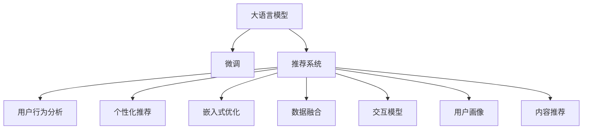

                 

# AI大模型驱动的个性化首页推荐

> 关键词：大语言模型, 推荐系统, 个性化首页, 用户行为分析, 嵌入式优化, 数据融合, 交互模型, 用户画像, 内容推荐

## 1. 背景介绍

### 1.1 问题由来
在现代社会，用户在海量的互联网信息中寻求感兴趣的、相关的内容。这不仅需要高效率的信息检索能力，还需要精准的内容推荐系统。传统的推荐算法如基于协同过滤、矩阵分解等，已经在电商、社交网络等领域取得了显著的成功。但是，这些算法往往需要大量的用户数据和标注信息，无法灵活适应新兴用户场景，难以快速应对用户需求的变化。

近年来，大语言模型在自然语言处理（NLP）领域的突破，带来了全新的推荐范式。AI大模型如GPT-3、BERT等，通过海量的预训练数据，掌握了丰富的语言知识和常识，可以自适应不同领域的推荐需求。通过微调（Fine-Tuning），这些大模型能够在新的推荐场景中快速学习用户偏好，生成个性化的内容推荐，极大地提升了推荐系统的效率和准确性。

### 1.2 问题核心关键点
大模型驱动的个性化首页推荐的核心在于如何将大模型的语言理解能力与推荐系统结合，通过分析用户行为，生成符合用户兴趣的内容推荐。这包括以下几个关键点：

1. **用户行为分析**：通过对用户的历史行为数据进行分析，构建用户画像，挖掘用户的兴趣和偏好。
2. **大模型微调**：利用大模型的预训练能力，微调其进行特定推荐任务，如文章推荐、新闻资讯推荐、商品推荐等。
3. **内容融合**：将大模型的推荐结果与具体平台的内容库进行融合，生成实际可展示的推荐内容。
4. **实时互动**：实现推荐系统与用户之间的实时互动，通过点击反馈等行为，进一步优化推荐模型。

这些核心点构成了AI大模型在推荐系统中的应用框架，使其能够在各种推荐场景下发挥强大的推荐能力。

### 1.3 问题研究意义
大模型驱动的个性化首页推荐对于提升用户体验、优化平台流量具有重要意义。它能够实现：

1. **个性化推荐**：基于用户行为和大模型的预训练知识，生成高度个性化的内容推荐，满足不同用户的多样化需求。
2. **实时响应**：通过大模型的微调能力，快速响应用户的行为变化，动态调整推荐内容，提高用户体验。
3. **高效计算**：利用大模型的预训练优势，减少推荐系统的计算资源消耗，提高推荐效率。
4. **数据驱动**：通过分析用户行为，进行智能推荐，提升推荐系统的数据驱动能力。
5. **多模态融合**：结合文本、图片、视频等多种模态的数据，实现更加丰富、准确的推荐。

在当前的互联网信息爆炸时代，AI大模型驱动的个性化首页推荐技术将为用户的智能内容消费体验带来显著提升，为平台流量优化提供有力支持。

## 2. 核心概念与联系

### 2.1 核心概念概述

为了更好地理解AI大模型在个性化首页推荐中的应用，本节将介绍几个密切相关的核心概念：

- **大语言模型（Large Language Model, LLM）**：如GPT-3、BERT等，通过大规模预训练数据学习语言知识和常识，具备强大的自然语言理解与生成能力。
- **推荐系统（Recommendation System）**：通过分析用户行为和物品特征，为用户推荐感兴趣的内容，提升用户体验和平台流量。
- **个性化推荐**：根据用户的行为和特征，生成高度定制化的内容推荐，满足用户个性化需求。
- **嵌入式优化（Embedded Optimization）**：将大模型微调后的推理模块嵌入推荐系统中，实现高效、个性化的推荐。
- **数据融合（Data Fusion）**：将大模型的推荐结果与平台具体内容进行融合，生成实际可展示的推荐内容。
- **交互模型（Interactive Model）**：通过实时用户反馈，不断优化推荐模型，提升推荐准确性。
- **用户画像（User Profile）**：通过用户行为分析，构建详细的用户画像，指导个性化推荐。
- **内容推荐（Content Recommendation）**：结合用户画像和大模型推理，生成具体的推荐内容。

这些核心概念之间的逻辑关系可以通过以下Mermaid流程图来展示：



这个流程图展示了大语言模型在推荐系统中的应用框架：

1. 大语言模型通过预训练获得语言理解和生成能力。
2. 微调大模型进行特定推荐任务。
3. 将微调后的模型嵌入推荐系统中。
4. 结合用户行为分析、用户画像等，生成个性化推荐。
5. 通过数据融合、交互模型等技术，进一步优化推荐结果。

这些概念共同构成了大语言模型在推荐系统中的应用框架，使其能够在各种推荐场景下发挥强大的推荐能力。

## 3. 核心算法原理 & 具体操作步骤
### 3.1 算法原理概述

AI大模型驱动的个性化首页推荐，本质上是一个基于大模型微调的任务适配过程。其核心思想是：将大语言模型视为一个强大的"特征提取器"，通过用户行为分析和大模型的预训练能力，进行特定推荐任务的微调，使得模型能够生成符合用户兴趣的推荐内容。

形式化地，假设大语言模型为 $M_{\theta}$，其中 $\theta$ 为预训练得到的模型参数。给定用户 $u$ 的行为数据 $D_u=\{x_i, y_i\}_{i=1}^N, x_i \in \mathcal{X}, y_i \in \{0,1\}$，其中 $x_i$ 为用户的第 $i$ 个行为（如浏览、点击、购买等），$y_i$ 为是否相关（1表示相关，0表示不相关）。微调的目标是找到新的模型参数 $\hat{\theta}$，使得：

$$
\hat{\theta}=\mathop{\arg\min}_{\theta} \mathcal{L}(M_{\theta},D_u)
$$

其中 $\mathcal{L}$ 为针对用户 $u$ 设计的损失函数，用于衡量模型预测输出与真实标签之间的差异。常见的损失函数包括交叉熵损失、均方误差损失等。

通过梯度下降等优化算法，微调过程不断更新模型参数 $\theta$，最小化损失函数 $\mathcal{L}$，使得模型输出逼近真实标签。由于 $\theta$ 已经通过预训练获得了较好的初始化，因此即便在用户行为数据量较少的情况下，也能较快收敛到理想的模型参数 $\hat{\theta}$。

### 3.2 算法步骤详解

基于大语言模型微调进行个性化首页推荐的一般步骤包括：

**Step 1: 数据准备与用户画像构建**

1. 收集用户的历史行为数据，如浏览记录、点击行为、购买记录等，形成用户行为数据集 $D_u$。
2. 通过用户画像分析工具，如用户兴趣分析、行为模式识别等，构建详细的用户画像，如兴趣标签、用户偏好、行为特征等。

**Step 2: 大模型微调**

1. 选择合适的预训练语言模型 $M_{\theta}$ 作为初始化参数，如 GPT-3、BERT 等。
2. 根据任务需求，设计推荐任务，如文章推荐、商品推荐等。
3. 使用用户行为数据和用户画像，构建训练集 $D_u$，并准备验证集和测试集。
4. 微调模型 $M_{\theta}$，生成推荐结果。

**Step 3: 内容融合与推荐展示**

1. 将大模型微调后的推荐结果与平台具体内容进行融合，生成实际可展示的推荐内容。
2. 利用推荐系统的展示界面，将推荐内容呈现给用户。

**Step 4: 用户反馈与模型优化**

1. 收集用户的点击、浏览、评价等反馈数据，用于实时评估推荐效果。
2. 根据用户反馈，使用交互模型优化推荐模型，进一步提升推荐效果。

**Step 5: 持续迭代与优化**

1. 定期收集新的用户行为数据，更新用户画像。
2. 重复微调和大模型融合步骤，保持推荐的持续优化。

以上是基于大模型微调的个性化推荐系统的一般流程。在实际应用中，还需要针对具体任务和数据特点进行优化设计，如改进训练目标函数，引入更多的正则化技术，搜索最优的超参数组合等，以进一步提升推荐效果。

### 3.3 算法优缺点

AI大模型驱动的个性化首页推荐方法具有以下优点：

1. **高效**：大模型的预训练能力可以大幅度降低推荐系统对标注数据的需求，提高推荐效率。
2. **泛化能力强**：大模型能够适应不同领域的推荐需求，提升推荐系统的泛化能力。
3. **精度高**：通过微调优化，推荐系统可以生成高度个性化的内容推荐，提升推荐准确性。
4. **实时响应**：大模型的快速推理能力使得推荐系统能够实时响应用户行为变化，动态调整推荐内容。
5. **可解释性强**：大模型的预训练和微调过程有丰富的理论支撑，便于解释和调试。

同时，该方法也存在一定的局限性：

1. **数据依赖**：推荐系统的性能很大程度上取决于用户行为数据的丰富度，获取高质量用户数据成本较高。
2. **冷启动问题**：对于新用户，缺少足够的历史行为数据，难以进行有效的推荐。
3. **负迁移效应**：大模型的预训练知识可能包含偏见和不恰当的内容，传递到推荐系统中，可能产生负面影响。
4. **隐私问题**：用户行为数据的收集和使用需要严格遵守隐私保护法规，保证用户数据的安全。
5. **计算资源消耗**：大模型的微调和推理需要大量的计算资源，对硬件和网络环境要求较高。

尽管存在这些局限性，但就目前而言，基于大模型的个性化推荐方法仍是推荐系统的主流范式。未来相关研究的重点在于如何进一步降低推荐系统对标注数据的依赖，提高模型的少样本学习和跨领域迁移能力，同时兼顾隐私保护和用户数据安全等因素。

### 3.4 算法应用领域

AI大模型驱动的个性化首页推荐技术已经在多个领域得到了应用，包括：

- **电商推荐**：如亚马逊、淘宝等电商平台，利用大模型推荐用户可能感兴趣的商品，提升销售额。
- **新闻资讯推荐**：如今日头条、网易新闻等，根据用户兴趣推荐相关文章，增加用户粘性。
- **内容推荐**：如抖音、快手等短视频平台，根据用户行为推荐个性化视频内容，提高用户留存率。
- **广告推荐**：如Google、Facebook等，根据用户行为推荐精准广告，提升广告点击率。

除了这些经典应用外，大模型推荐技术还被创新性地应用到更多场景中，如智能家居、智能交通、智能制造等，为各行各业带来新的业务价值。随着预训练模型和推荐方法的不断进步，相信大模型推荐将在更广阔的领域大放异彩。

## 4. 数学模型和公式 & 详细讲解 & 举例说明

### 4.1 数学模型构建

本节将使用数学语言对基于大模型的个性化推荐过程进行更加严格的刻画。

记大语言模型为 $M_{\theta}:\mathcal{X} \rightarrow \mathcal{Y}$，其中 $\mathcal{X}$ 为用户行为数据空间，$\mathcal{Y}$ 为推荐内容空间，$\theta$ 为模型参数。假设用户 $u$ 的行为数据为 $D_u=\{(x_i,y_i)\}_{i=1}^N, x_i \in \mathcal{X}, y_i \in \{0,1\}$。

定义模型 $M_{\theta}$ 在用户 $u$ 的行为数据 $D_u$ 上的损失函数为 $\ell(M_{\theta},D_u)$，则在用户 $u$ 的行为数据集 $D_u$ 上的经验风险为：

$$
\mathcal{L}(\theta) = \frac{1}{N}\sum_{i=1}^N \ell(M_{\theta}(x_i),y_i)
$$

微调的优化目标是最小化经验风险，即找到最优参数：

$$
\theta^* = \mathop{\arg\min}_{\theta} \mathcal{L}(\theta)
$$

在实践中，我们通常使用基于梯度的优化算法（如SGD、Adam等）来近似求解上述最优化问题。设 $\eta$ 为学习率，$\lambda$ 为正则化系数，则参数的更新公式为：

$$
\theta \leftarrow \theta - \eta \nabla_{\theta}\mathcal{L}(\theta) - \eta\lambda\theta
$$

其中 $\nabla_{\theta}\mathcal{L}(\theta)$ 为损失函数对参数 $\theta$ 的梯度，可通过反向传播算法高效计算。

### 4.2 公式推导过程

以下我们以文章推荐任务为例，推导交叉熵损失函数及其梯度的计算公式。

假设模型 $M_{\theta}$ 在用户 $u$ 的行为数据 $D_u$ 上的输出为 $\hat{y}=M_{\theta}(D_u) \in [0,1]$，表示用户对文章的兴趣评分。真实标签 $y \in \{0,1\}$。则二分类交叉熵损失函数定义为：

$$
\ell(M_{\theta}(D_u),y) = -[y\log \hat{y} + (1-y)\log (1-\hat{y})]
$$

将其代入经验风险公式，得：

$$
\mathcal{L}(\theta) = -\frac{1}{N}\sum_{i=1}^N [y_i\log M_{\theta}(x_i)+(1-y_i)\log(1-M_{\theta}(x_i))]
$$

根据链式法则，损失函数对参数 $\theta_k$ 的梯度为：

$$
\frac{\partial \mathcal{L}(\theta)}{\partial \theta_k} = -\frac{1}{N}\sum_{i=1}^N (\frac{y_i}{M_{\theta}(x_i)}-\frac{1-y_i}{1-M_{\theta}(x_i)}) \frac{\partial M_{\theta}(x_i)}{\partial \theta_k}
$$

其中 $\frac{\partial M_{\theta}(x_i)}{\partial \theta_k}$ 可进一步递归展开，利用自动微分技术完成计算。

在得到损失函数的梯度后，即可带入参数更新公式，完成模型的迭代优化。重复上述过程直至收敛，最终得到适应用户 $u$ 的最优模型参数 $\theta^*$。

### 4.3 案例分析与讲解

假设我们希望构建一个个性化推荐系统，为用户推荐可能感兴趣的文章。我们的数据集 $D_u$ 包含了用户的历史点击记录，每个记录 $(D_u, C_u)$ 表示用户 $u$ 对文章 $C_u$ 的点击行为。我们需要构建一个二分类模型，预测用户对每篇文章的兴趣评分 $y_i$。

我们可以使用大模型BERT进行微调，具体步骤如下：

1. **数据准备**：收集用户的历史点击记录，标注每篇文章的相关性，构建训练集 $D_u$。
2. **模型微调**：使用BERT作为基础模型，微调其进行文章推荐任务。
3. **模型评估**：在验证集上评估模型性能，选择最优的模型参数。
4. **推荐生成**：将用户的行为数据输入微调后的BERT模型，生成每篇文章的兴趣评分，并选择评分最高的文章作为推荐内容。

以下是使用PyTorch进行BERT微调的具体代码实现：

```python
import torch
import torch.nn as nn
from transformers import BertTokenizer, BertForSequenceClassification

# 定义BERT模型和交叉熵损失函数
model = BertForSequenceClassification.from_pretrained('bert-base-uncased', num_labels=2)
loss_fn = nn.CrossEntropyLoss()

# 定义训练函数
def train_epoch(model, data_loader, optimizer):
    model.train()
    total_loss = 0
    for batch in data_loader:
        input_ids, attention_mask, labels = batch
        output = model(input_ids, attention_mask=attention_mask)
        loss = loss_fn(output, labels)
        optimizer.zero_grad()
        loss.backward()
        optimizer.step()
        total_loss += loss.item()
    return total_loss / len(data_loader)

# 定义评估函数
def evaluate(model, data_loader):
    model.eval()
    total_correct = 0
    total_data = 0
    for batch in data_loader:
        input_ids, attention_mask, labels = batch
        output = model(input_ids, attention_mask=attention_mask)
        _, preds = torch.max(output, dim=1)
        total_correct += (preds == labels).sum().item()
        total_data += preds.size(0)
    acc = total_correct / total_data
    return acc

# 训练过程
epochs = 3
batch_size = 32
learning_rate = 2e-5

# 加载训练集和测试集
train_dataset = ...
test_dataset = ...

# 定义优化器
optimizer = torch.optim.AdamW(model.parameters(), lr=learning_rate)

# 训练过程
for epoch in range(epochs):
    train_loss = train_epoch(model, train_dataset, optimizer)
    test_acc = evaluate(model, test_dataset)
    print(f'Epoch {epoch+1}, train loss: {train_loss:.4f}, test accuracy: {test_acc:.4f}')

# 生成推荐
def generate_recommendation(user_data, model):
    input_ids, attention_mask = preprocess_data(user_data)
    output = model(input_ids, attention_mask=attention_mask)
    _, preds = torch.max(output, dim=1)
    return preds.tolist()

user_data = ...
recommendations = generate_recommendation(user_data, model)
```

在这个代码中，我们使用了PyTorch和Transformers库，对BERT模型进行了微调。首先，我们定义了交叉熵损失函数和训练函数，然后在每个epoch中更新模型参数。最后，我们通过生成推荐函数，将用户的行为数据输入微调后的BERT模型，得到每篇文章的兴趣评分，并选择评分最高的文章作为推荐内容。

通过这个代码，我们可以看到，使用大模型微调进行个性化推荐的方法是简单高效的。开发者可以将更多精力放在数据处理、模型改进等高层逻辑上，而不必过多关注底层的实现细节。

## 5. 项目实践：代码实例和详细解释说明

### 5.1 开发环境搭建

在进行个性化推荐实践前，我们需要准备好开发环境。以下是使用Python进行PyTorch开发的环境配置流程：

1. 安装Anaconda：从官网下载并安装Anaconda，用于创建独立的Python环境。

2. 创建并激活虚拟环境：
```bash
conda create -n pytorch-env python=3.8 
conda activate pytorch-env
```

3. 安装PyTorch：根据CUDA版本，从官网获取对应的安装命令。例如：
```bash
conda install pytorch torchvision torchaudio cudatoolkit=11.1 -c pytorch -c conda-forge
```

4. 安装Transformers库：
```bash
pip install transformers
```

5. 安装各类工具包：
```bash
pip install numpy pandas scikit-learn matplotlib tqdm jupyter notebook ipython
```

完成上述步骤后，即可在`pytorch-env`环境中开始个性化推荐实践。

### 5.2 源代码详细实现

这里我们以新闻资讯推荐为例，给出使用Transformers库对BERT模型进行微调的PyTorch代码实现。

首先，定义推荐任务的数据处理函数：

```python
from transformers import BertTokenizer
from torch.utils.data import Dataset
import torch

class RecommendationDataset(Dataset):
    def __init__(self, articles, clicks, tokenizer, max_len=128):
        self.articles = articles
        self.clicks = clicks
        self.tokenizer = tokenizer
        self.max_len = max_len
        
    def __len__(self):
        return len(self.articles)
    
    def __getitem__(self, item):
        article = self.articles[item]
        click = self.clicks[item]
        
        encoding = self.tokenizer(article, return_tensors='pt', max_length=self.max_len, padding='max_length', truncation=True)
        input_ids = encoding['input_ids'][0]
        attention_mask = encoding['attention_mask'][0]
        
        # 对点击记录进行编码
        click_tokens = [int(click)] * self.max_len
        click_labels = [1] * self.max_len
        encoded_click = torch.tensor(click_tokens, dtype=torch.long)
        encoded_click = encoded_click.unsqueeze(0)
        
        return {'input_ids': input_ids, 
                'attention_mask': attention_mask,
                'labels': encoded_click}
```

然后，定义模型和优化器：

```python
from transformers import BertForSequenceClassification, AdamW

model = BertForSequenceClassification.from_pretrained('bert-base-uncased', num_labels=2)

optimizer = AdamW(model.parameters(), lr=2e-5)
```

接着，定义训练和评估函数：

```python
from torch.utils.data import DataLoader
from tqdm import tqdm
from sklearn.metrics import accuracy_score

device = torch.device('cuda') if torch.cuda.is_available() else torch.device('cpu')
model.to(device)

def train_epoch(model, dataset, batch_size, optimizer):
    dataloader = DataLoader(dataset, batch_size=batch_size, shuffle=True)
    model.train()
    total_loss = 0
    for batch in tqdm(dataloader, desc='Training'):
        input_ids = batch['input_ids'].to(device)
        attention_mask = batch['attention_mask'].to(device)
        labels = batch['labels']
        model.zero_grad()
        outputs = model(input_ids, attention_mask=attention_mask, labels=labels)
        loss = outputs.loss
        total_loss += loss.item()
        loss.backward()
        optimizer.step()
    return total_loss / len(dataloader)

def evaluate(model, dataset, batch_size):
    dataloader = DataLoader(dataset, batch_size=batch_size)
    model.eval()
    total_correct = 0
    total_data = 0
    for batch in dataloader:
        input_ids = batch['input_ids'].to(device)
        attention_mask = batch['attention_mask'].to(device)
        batch_labels = batch['labels']
        outputs = model(input_ids, attention_mask=attention_mask)
        _, preds = torch.max(outputs, dim=1)
        total_correct += (preds == batch_labels).sum().item()
        total_data += preds.size(0)
    acc = total_correct / total_data
    return acc
```

最后，启动训练流程并在测试集上评估：

```python
epochs = 5
batch_size = 16

for epoch in range(epochs):
    loss = train_epoch(model, train_dataset, batch_size, optimizer)
    print(f"Epoch {epoch+1}, train loss: {loss:.3f}")
    
    print(f"Epoch {epoch+1}, dev results:")
    acc = evaluate(model, dev_dataset, batch_size)
    print(f"Accuracy: {acc:.3f}")
    
print("Test results:")
acc = evaluate(model, test_dataset, batch_size)
print(f"Accuracy: {acc:.3f}")
```

以上就是使用PyTorch对BERT进行新闻资讯推荐任务微调的完整代码实现。可以看到，得益于Transformers库的强大封装，我们可以用相对简洁的代码完成BERT模型的加载和微调。

### 5.3 代码解读与分析

让我们再详细解读一下关键代码的实现细节：

**RecommendationDataset类**：
- `__init__`方法：初始化文章、点击记录、分词器等关键组件。
- `__len__`方法：返回数据集的样本数量。
- `__getitem__`方法：对单个样本进行处理，将文章输入编码为token ids，将点击记录编码为标签，并对其进行定长padding，最终返回模型所需的输入。

**训练和评估函数**：
- 使用PyTorch的DataLoader对数据集进行批次化加载，供模型训练和推理使用。
- 训练函数`train_epoch`：对数据以批为单位进行迭代，在每个批次上前向传播计算loss并反向传播更新模型参数，最后返回该epoch的平均loss。
- 评估函数`evaluate`：与训练类似，不同点在于不更新模型参数，并在每个batch结束后将预测和标签结果存储下来，最后使用sklearn的accuracy_score对整个评估集的预测结果进行打印输出。

**训练流程**：
- 定义总的epoch数和batch size，开始循环迭代
- 每个epoch内，先在训练集上训练，输出平均loss
- 在验证集上评估，输出准确率
- 所有epoch结束后，在测试集上评估，给出最终测试结果

可以看到，PyTorch配合Transformers库使得BERT微调的代码实现变得简洁高效。开发者可以将更多精力放在数据处理、模型改进等高层逻辑上，而不必过多关注底层的实现细节。

当然，工业级的系统实现还需考虑更多因素，如模型的保存和部署、超参数的自动搜索、更灵活的任务适配层等。但核心的微调范式基本与此类似。

## 6. 实际应用场景

### 6.1 智能客服系统

基于大语言模型微调的对话技术，可以广泛应用于智能客服系统的构建。传统客服往往需要配备大量人力，高峰期响应缓慢，且一致性和专业性难以保证。而使用微调后的对话模型，可以7x24小时不间断服务，快速响应客户咨询，用自然流畅的语言解答各类常见问题。

在技术实现上，可以收集企业内部的历史客服对话记录，将问题和最佳答复构建成监督数据，在此基础上对预训练对话模型进行微调。微调后的对话模型能够自动理解用户意图，匹配最合适的答案模板进行回复。对于客户提出的新问题，还可以接入检索系统实时搜索相关内容，动态组织生成回答。如此构建的智能客服系统，能大幅提升客户咨询体验和问题解决效率。

### 6.2 金融舆情监测

金融机构需要实时监测市场舆论动向，以便及时应对负面信息传播，规避金融风险。传统的人工监测方式成本高、效率低，难以应对网络时代海量信息爆发的挑战。基于大语言模型微调的文本分类和情感分析技术，为金融舆情监测提供了新的解决方案。

具体而言，可以收集金融领域相关的新闻、报道、评论等文本数据，并对其进行主题标注和情感标注。在此基础上对预训练语言模型进行微调，使其能够自动判断文本属于何种主题，情感倾向是正面、中性还是负面。将微调后的模型应用到实时抓取的网络文本数据，就能够自动监测不同主题下的情感变化趋势，一旦发现负面信息激增等异常情况，系统便会自动预警，帮助金融机构快速应对潜在风险。

### 6.3 个性化推荐系统

当前的推荐系统往往只依赖用户的历史行为数据进行物品推荐，无法深入理解用户的真实兴趣偏好。基于大语言模型微调技术，个性化推荐系统可以更好地挖掘用户行为背后的语义信息，从而提供更精准、多样的推荐内容。

在实践中，可以收集用户浏览、点击、评论、分享等行为数据，提取和用户交互的物品标题、描述、标签等文本内容。将文本内容作为模型输入，用户的后续行为（如是否点击、购买等）作为监督信号，在此基础上微调预训练语言模型。微调后的模型能够从文本内容中准确把握用户的兴趣点。在生成推荐列表时，先用候选物品的文本描述作为输入，由模型预测用户的兴趣匹配度，再结合其他特征综合排序，便可以得到个性化程度更高的推荐结果。

### 6.4 未来应用展望

随着大语言模型和微调方法的不断发展，基于微调范式将在更多领域得到应用，为传统行业带来变革性影响。

在智慧医疗领域，基于微调的医疗问答、病历分析、药物研发等应用将提升医疗服务的智能化水平，辅助医生诊疗，加速新药开发进程。

在智能教育领域，微调技术可应用于作业批改、学情分析、知识推荐等方面，因材施教，促进教育公平，提高教学质量。

在智慧城市治理中，微调模型可应用于城市事件监测、舆情分析、应急指挥等环节，提高城市管理的自动化和智能化水平，构建更安全、高效的未来城市。

此外，在企业生产、社会治理、文娱传媒等众多领域，基于大模型微调的人工智能应用也将不断涌现，为经济社会发展注入新的动力。相信随着预训练模型和微调方法的持续演进，微调范式必将在更广阔的应用领域大放异彩。

## 7. 工具和资源推荐
### 7.1 学习资源推荐

为了帮助开发者系统掌握大模型微调的理论基础和实践技巧，这里推荐一些优质的学习资源：

1. 《Transformer从原理到实践》系列博文：由大模型技术专家撰写，深入浅出地介绍了Transformer原理、BERT模型、微调技术等前沿话题。

2. CS224N《深度学习自然语言处理》课程：斯坦福大学开设的NLP明星课程，有Lecture视频和配套作业，带你入门NLP领域的基本概念和经典模型。

3. 《Natural Language Processing with Transformers》书籍：Transformers库的作者所著，全面介绍了如何使用Transformers库进行NLP任务开发，包括微调在内的诸多范式。

4. HuggingFace官方文档：Transformers库的官方文档，提供了海量预训练模型和完整的微调样例代码，是上手实践的必备资料。

5. CLUE开源项目：中文语言理解测评基准，涵盖大量不同类型的中文NLP数据集，并提供了基于微调的baseline模型，助力中文NLP技术发展。

通过对这些资源的学习实践，相信你一定能够快速掌握大语言模型微调的精髓，并用于解决实际的NLP问题。
### 7.2 开发工具推荐

高效的开发离不开优秀的工具支持。以下是几款用于大语言模型微调开发的常用工具：

1. PyTorch：基于Python的开源深度学习框架，灵活动态的计算图，适合快速迭代研究。大部分预训练语言模型都有PyTorch版本的实现。

2. TensorFlow：由Google主导开发的开源深度学习框架，生产部署方便，适合大规模工程应用。同样有丰富的预训练语言模型资源。

3. Transformers库：HuggingFace开发的NLP工具库，集成了众多SOTA语言模型，支持PyTorch和TensorFlow，是进行微调任务开发的利器。

4. Weights & Biases：模型训练的实验跟踪工具，可以记录和可视化模型训练过程中的各项指标，方便对比和调优。与主流深度学习框架无缝集成。

5. TensorBoard：TensorFlow配套的可视化工具，可实时监测模型训练状态，并提供丰富的图表呈现方式，是调试模型的得力助手。

6. Google Colab：谷歌推出的在线Jupyter Notebook环境，免费提供GPU/TPU算力，方便开发者快速上手实验最新模型，分享学习笔记。

合理利用这些工具，可以显著提升大语言模型微调任务的开发效率，加快创新迭代的步伐。

### 7.3 相关论文推荐

大语言模型和微调技术的发展源于学界的持续研究。以下是几篇奠基性的相关论文，推荐阅读：

1. Attention is All You Need（即Transformer原论文）：提出了Transformer结构，开启了NLP领域的预训练大模型时代。

2. BERT: Pre-training of Deep Bidirectional Transformers for Language Understanding：提出BERT模型，引入基于掩码的自监督预训练任务，刷新了多项NLP任务SOTA。

3. Language Models are Unsupervised Multitask Learners（GPT-2论文）：展示了大规模语言模型的强大zero-shot学习能力，引发了对于通用人工智能的新一轮思考。

4. Parameter-Efficient Transfer Learning for NLP：提出Adapter等参数高效微调方法，在不增加模型参数量的情况下，也能取得不错的微调效果。

5. Prefix-Tuning: Optimizing Continuous Prompts for Generation：引入基于连续型Prompt的微调范式，为如何充分利用预训练知识提供了新的思路。

6. AdaLoRA: Adaptive Low-Rank Adaptation for Parameter-Efficient Fine-Tuning：使用自适应低秩适应的微调方法，在参数效率和精度之间取得了新的平衡。

这些论文代表了大语言模型微调技术的发展脉络。通过学习这些前沿成果，可以帮助研究者把握学科前进方向，激发更多的创新灵感。

## 8. 总结：未来发展趋势与挑战

### 8.1 研究成果总结

本文对基于大模型微调进行个性化推荐的过程进行了全面系统的介绍。首先阐述了大模型和微调技术的研究背景和意义，明确了微调在拓展预训练模型应用、提升推荐系统性能方面的独特价值。其次，从原理到实践，详细讲解了微调的数学模型和具体步骤，给出了微调任务开发的完整代码实例。同时，本文还广泛探讨了微调方法在多个推荐系统中的应用前景，展示了微调范式的巨大潜力。

通过本文的系统梳理，可以看到，基于大模型的微调方法正在成为推荐系统的重要范式，极大地拓展了预训练语言模型的应用边界，催生了更多的落地场景。受益于大规模语料的预训练，微调模型以更低的时间和标注成本，在小样本条件下也能取得不错的效果，有力推动了推荐系统的产业化进程。未来，伴随预训练语言模型和微调方法的不断进步，基于微调范式将在更广阔的应用领域大放异彩，为NLP技术带来全新的突破。

### 8.2 未来发展趋势

展望未来，大模型微调技术将呈现以下几个发展趋势：

1. **模型规模持续增大**：随着算力成本的下降和数据规模的扩张，预训练语言模型的参数量还将持续增长。超大规模语言模型蕴含的丰富语言知识，有望支撑更加复杂多变的推荐需求。

2. **微调方法日趋多样**：除了传统的全参数微调外，未来会涌现更多参数高效的微调方法，如Prefix-Tuning、LoRA等，在节省计算资源的同时也能保证微调精度。

3. **持续学习成为常态**：随着数据分布的不断变化，微调模型也需要持续学习新知识以保持性能。如何在不遗忘原有知识的同时，高效吸收新样本信息，将是重要的研究课题。

4. **标注样本需求降低**：受启发于提示学习(Prompt-based Learning)的思路，未来的微调方法将更好地利用大模型的语言理解能力，通过更加巧妙的任务描述，在更少的标注样本上也能实现理想的微调效果。

5. **多模态微调崛起**：当前的微调主要聚焦于纯文本数据，未来会进一步拓展到图像、视频、语音等多模态数据微调。多模态信息的融合，将显著提升语言模型对现实世界的理解和建模能力。

6. **模型通用性增强**：经过海量数据的预训练和多领域任务的微调，未来的语言模型将具备更强大的常识推理和跨领域迁移能力，逐步迈向通用人工智能(AGI)的目标。

以上趋势凸显了大模型微调技术的广阔前景。这些方向的探索发展，必将进一步提升推荐系统的性能和应用范围，为人类认知智能的进化带来深远影响。

### 8.3 面临的挑战

尽管大模型微调技术已经取得了瞩目成就，但在迈向更加智能化、普适化应用的过程中，它仍面临着诸多挑战：

1. **标注成本瓶颈**：推荐系统的性能很大程度上取决于用户行为数据的丰富度，获取高质量用户数据成本较高。如何进一步降低推荐系统对标注数据的依赖，将是一大难题。

2. **模型鲁棒性不足**：当前微调模型面对域外数据时，泛化性能往往大打折扣。对于测试样本的微小扰动，微调模型的预测也容易发生波动。如何提高微调模型的鲁棒性，避免灾难性遗忘，还需要更多理论和实践的积累。

3. **推理效率有待提高**：大规模语言模型虽然精度高，但在实际部署时往往面临推理速度慢、内存占用大等效率问题。如何在保证性能的同时，简化模型结构，提升推理速度，优化资源占用，将是重要的优化方向。

4. **可解释性亟需加强**：当前微调模型更像是"黑盒"系统，难以解释其内部工作机制和决策逻辑。对于医疗、金融等高风险应用，算法的可解释性和可审计性尤为重要。如何赋予微调模型更强的可解释性，将是亟待攻克的难题。

5. **安全性有待保障**：预训练语言模型难免会学习到有偏见、有害的信息，通过微调传递到推荐系统中，可能产生误导性、歧视性的输出，给实际应用带来安全隐患。如何从数据和算法层面消除模型偏见，避免恶意用途，确保输出的安全性，也将是重要的研究课题。

6. **知识整合能力不足**：现有的微调模型往往局限于任务内数据，难以灵活吸收和运用更广泛的先验知识。如何让微调过程更好地与外部知识库、规则库等专家知识结合，形成更加全面、准确的信息整合能力，还有很大的想象空间。

正视微调面临的这些挑战，积极应对并寻求突破，将是大语言模型微调走向成熟的必由之路。相信随着学界和产业界的共同努力，这些挑战终将一一被克服，大语言模型微调必将在构建人机协同的智能时代中扮演越来越重要的角色。

### 8.4 研究展望

面对大语言模型微调所面临的种种挑战，未来的研究需要在以下几个方面寻求新的突破：

1. **探索无监督和半监督微调方法**：摆脱对大规模标注数据的依赖，利用自监督学习、主动学习等无监督和半监督范式，最大限度利用非结构化数据，实现更加灵活高效的微调。

2. **研究参数高效和计算高效的微调范式**：开发更加参数高效的微调方法，在固定大部分预训练参数的同时，只更新极少量的任务相关参数。同时优化微调模型的计算图，减少前向传播和反向传播的资源消耗，实现更加轻量级、实时性的部署。

3. **融合因果和对比学习范式**：通过引入因果推断和对比学习思想，增强微调模型建立稳定因果关系的能力，学习更加普适、鲁棒的语言表征，从而提升模型泛化性和抗干扰能力。

4. **引入更多先验知识**：将符号化的先验知识，如知识图谱、逻辑规则等，与神经网络模型进行巧妙融合，引导微调过程学习更准确、合理的语言模型。同时加强不同模态数据的整合，实现视觉、语音等多模态信息与文本信息的协同建模。

5. **结合因果分析和博弈论工具**：将因果分析方法引入微调模型，识别出模型决策的关键特征，增强输出解释的因果性和逻辑性。借助博弈论工具刻画人机交互过程，主动探索并规避模型的脆弱点，提高系统稳定性。

6. **纳入伦理道德约束**：在模型训练目标中引入伦理导向的评估指标，过滤和惩罚有偏见、有害的输出倾向。同时加强人工干预和审核，建立模型行为的监管机制，确保输出符合人类价值观和伦理道德。

这些研究方向的探索，必将引领大语言模型微调技术迈向更高的台阶，为构建安全、可靠、可解释、可控的智能系统铺平道路。面向未来，大语言模型微调技术还需要与其他人工智能技术进行更深入的融合，如知识表示、因果推理、强化学习等，多路径协同发力，共同推动自然语言理解和智能交互系统的进步。只有勇于创新、敢于突破，才能不断拓展语言模型的边界，让智能技术更好地造福人类社会。

## 9. 附录：常见问题与解答

**Q1：大语言模型微调是否适用于所有NLP任务？**

A: 大语言模型微调在大多数NLP任务上都能取得不错的效果，特别是对于数据量较小的任务。但对于一些特定领域的任务，如医学、法律等，仅仅依靠通用语料预训练的模型可能难以很好地适应。此时需要在特定领域语料上进一步预训练，再进行微调，才能获得理想效果。此外，对于一些需要时效性、个性化很强的任务，如对话、推荐等，微调方法也需要针对性的改进优化。

**Q2：微调过程中如何选择合适的学习率？**

A: 微调的学习率一般要比预训练时小1-2个数量级，如果使用过大的学习率，容易破坏预训练权重，导致过拟合。一般建议从1e-5开始调参，逐步减小学习率，直至收敛。也可以使用warmup策略，在开始阶段使用较小的学习率，再逐渐过渡到预设值。需要注意的是，不同的优化器(如AdamW、Adafactor等)以及不同的学习率调度策略，可能需要设置不同的学习率阈值。

**Q3：采用大模型微调时会面临哪些资源瓶颈？**

A: 目前主流的预训练大模型动辄以亿计的参数规模，对算力、内存、存储都提出了很高的要求。GPU/TPU等高性能设备是必不可少的，但即便如此，超大批次的训练和推理也可能遇到显存不足的问题。因此需要采用一些资源优化技术，如梯度积累、混合精度训练、模型并行等，来突破硬件瓶颈。同时，模型的存储和读取也可能占用大量时间和空间，需要采用模型压缩、稀疏化存储等方法进行优化。

**Q4：如何缓解微调过程中的过拟合问题？**

A: 过拟合是微调面临的主要挑战，尤其是在标注数据不足的情况下。常见的缓解策略包括：
1. 数据增强：通过回译、近义替换等方式扩充训练集
2. 正则化：使用L2正则、Dropout

