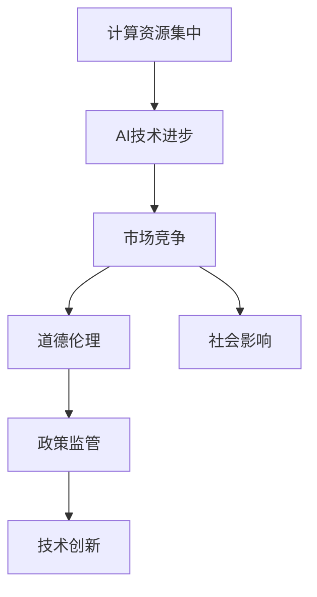

                 

# AI失控论：真正的风险在于计算资源集中

## 1. 背景介绍

在科技日新月异的今天，人工智能（AI）技术已经渗透到我们生活的方方面面。从自动驾驶到语音识别，从医学影像分析到自动翻译，AI的迅猛发展正改变着世界的面貌。然而，随着计算资源的不断集中，AI技术的爆炸性增长也引发了关于其失控的深刻思考。本文将深入探讨AI失控的核心问题，分析其潜在的风险，并提出应对策略，为科技行业的健康发展提供思路。

## 2. 核心概念与联系

### 2.1 核心概念概述

在探讨AI失控问题时，首先要理解几个核心概念：

- **计算资源集中**：指计算资源（如计算集群、存储设备、网络带宽等）被少数大型科技公司所掌控，形成市场垄断，这使得这些公司具有了更强的资源调配能力，能够迅速积累和更新技术优势。
- **AI技术进步**：包括算法的改进、模型的优化和数据的增长，这些都是推动AI技术发展的关键因素。
- **市场竞争**：在AI领域，竞争已经超越了传统行业的竞争，不再仅仅是产品和服务，更是技术、资本和人才的竞争。
- **道德伦理**：AI技术的应用涉及到隐私、安全、公平等伦理问题，如何在技术发展的同时，维护伦理道德，是AI技术发展的另一重要方面。
- **社会影响**：AI技术的应用对社会各领域的影响深远，包括就业、教育、医疗、安全等多个方面。

这些概念通过以下Mermaid流程图展示了它们之间的联系：



### 2.2 核心概念原理和架构

#### 计算资源集中

计算资源集中是AI技术发展的必然结果。大型科技公司如谷歌、亚马逊、微软等，通过不断的技术创新和市场投入，掌握了大量的计算资源，形成了市场垄断。这些公司不仅拥有强大的计算能力，还能通过数据驱动的方式来优化模型，提升算法性能。

#### AI技术进步

AI技术的进步主要依赖于以下几个方面：

1. **数据驱动**：大量标注数据的收集和利用，使得机器学习模型能够不断迭代和优化，提升模型的准确率和泛化能力。
2. **算法创新**：从传统的线性回归、决策树到深度学习、强化学习，算法的创新为AI技术带来了突破性进展。
3. **计算能力提升**：计算能力的提升使得深度学习模型能够处理更复杂的任务，例如大规模图像识别、自然语言处理等。

#### 市场竞争

在AI领域，市场竞争不仅仅局限于传统的产品和服务，更是技术、资本和人才的竞争。大型科技公司通过不断的技术创新和市场扩展，逐步形成垄断地位。这不仅导致了市场竞争的加剧，也使得AI技术的开发和使用更加集中在这些大型公司手中。

#### 道德伦理

AI技术的应用涉及到诸多伦理问题，包括数据隐私、算法偏见、自动化对就业的影响等。如何在技术发展的同时，维护伦理道德，成为AI技术应用的关键问题。

#### 社会影响

AI技术的应用对社会各领域的影响深远。从医疗、教育到交通、安全，AI技术正在改变人们的生活方式和工作方式。然而，这种改变也带来了新的挑战和风险，例如数据隐私泄露、就业岗位减少等。

## 3. 核心算法原理 & 具体操作步骤

### 3.1 算法原理概述

AI失控的核心在于计算资源的集中，而这种集中带来的技术垄断和市场竞争加剧，是导致失控的主要因素。计算资源的集中使得少数公司能够迅速积累技术优势，形成垄断地位。这种垄断地位不仅导致市场竞争的加剧，还使得AI技术的开发和使用更加集中在这些大型公司手中，进一步加剧了计算资源的集中。

### 3.2 算法步骤详解

#### Step 1: 市场分析

首先，需要对AI市场进行全面分析，了解目前市场的主要参与者、市场份额和技术优势。这可以通过市场调研、专利分析、技术评估等方式进行。

#### Step 2: 数据驱动

收集和利用大规模的标注数据，训练和优化AI模型。数据驱动是AI技术进步的核心，通过不断迭代和优化，提升模型的准确率和泛化能力。

#### Step 3: 算法创新

持续进行算法创新，从传统的机器学习算法到深度学习、强化学习等，不断探索新的技术路径，提升AI技术的性能。

#### Step 4: 计算能力提升

通过增加计算资源投入，提升计算能力，使得AI模型能够处理更复杂的任务。计算能力的提升不仅可以提高模型性能，还可以加速AI技术的研发和应用。

#### Step 5: 市场扩展

通过市场扩展，增加市场份额和技术优势，形成垄断地位。市场扩展可以通过并购、战略合作等方式实现。

### 3.3 算法优缺点

#### 优点

- **技术进步迅速**：计算资源的集中和垄断地位使得大型科技公司能够迅速积累和更新技术优势，推动AI技术的发展。
- **市场竞争力强**：通过市场扩展和战略合作，大型科技公司在AI市场中占据了主导地位。
- **资源集中高效**：资源集中使得大型科技公司能够高效调配资源，迅速推出新产品和服务。

#### 缺点

- **市场垄断**：计算资源的集中导致市场垄断，削弱了市场竞争，不利于技术多样性和创新。
- **技术风险高**：市场垄断和技术集中使得大型科技公司面临更高的技术风险，一旦技术出现问题，可能导致重大损失。
- **社会影响复杂**：AI技术的应用对社会各领域的影响深远，计算资源的集中可能带来社会的不公平和新的挑战。

### 3.4 算法应用领域

AI失控的问题不仅局限于科技领域，还涉及到社会、经济、伦理等多个方面。以下是一些主要的应用领域：

- **医疗**：AI技术在医疗领域的应用已经取得了显著成果，例如影像诊断、药物研发等。然而，计算资源的集中可能带来医疗数据的隐私泄露和伦理问题。
- **金融**：AI技术在金融领域的应用包括风险控制、自动交易等。计算资源的集中可能导致金融市场的垄断和不公平竞争。
- **教育**：AI技术在教育领域的应用包括智能推荐、自动化评估等。计算资源的集中可能带来教育资源的分配不公。
- **就业**：AI技术的应用可能导致就业岗位的减少，计算资源的集中可能加剧就业不平等。
- **伦理**：AI技术的应用涉及到诸多伦理问题，例如数据隐私、算法偏见等。计算资源的集中可能使得这些问题更加复杂。

## 4. 数学模型和公式 & 详细讲解 & 举例说明

### 4.1 数学模型构建

在AI技术的应用中，数学模型和公式是不可或缺的。以下是一个简单的数学模型示例，用于描述AI模型的训练和优化过程：

假设有一个二分类问题，模型的输入为向量 $x \in \mathbb{R}^n$，输出为二分类结果 $y \in \{0,1\}$。模型的预测结果为 $f(x; \theta)$，其中 $\theta$ 为模型的参数。模型的损失函数为交叉熵损失函数 $L(y,f(x; \theta))$，模型的目标是最小化损失函数 $L$，即：

$$
\min_{\theta} \sum_{i=1}^n L(y_i,f(x_i; \theta))
$$

### 4.2 公式推导过程

交叉熵损失函数的推导如下：

$$
L(y,f(x; \theta)) = -y \log f(x; \theta) - (1-y) \log (1-f(x; \theta))
$$

其中 $f(x; \theta)$ 为模型的预测结果，$y$ 为真实标签。

### 4.3 案例分析与讲解

以深度学习中的卷积神经网络（CNN）为例，CNN是一种广泛应用于图像识别的模型，其核心思想是通过卷积操作提取图像特征，并通过池化操作进行特征降维。CNN的训练和优化过程可以表示为：

$$
L(y,f(x; \theta)) = \frac{1}{n} \sum_{i=1}^n L(y_i,f(x_i; \theta))
$$

其中 $y$ 为真实标签，$f(x; \theta)$ 为模型的预测结果，$\theta$ 为模型的参数。

## 5. 项目实践：代码实例和详细解释说明

### 5.1 开发环境搭建

在开发AI项目时，需要搭建合适的开发环境。以下是一些建议：

- **操作系统**：建议使用Linux系统，如Ubuntu、CentOS等。
- **编程语言**：推荐使用Python，其丰富的库和框架可以满足大多数AI项目的需求。
- **开发工具**：建议使用Jupyter Notebook、PyCharm等开发工具，可以方便地进行代码调试和数据处理。
- **计算资源**：建议使用GPU或者TPU等高性能计算资源，可以显著提高模型的训练速度。

### 5.2 源代码详细实现

以下是一个简单的Python代码示例，用于描述AI模型的训练和优化过程：

```python
import numpy as np
import tensorflow as tf

# 定义模型
def model(x):
    # 定义模型的参数
    w = tf.Variable(tf.zeros([n, m]))
    b = tf.Variable(tf.zeros([1]))
    # 定义模型的预测结果
    y_pred = tf.matmul(x, w) + b
    return y_pred

# 定义损失函数
def loss(y, y_pred):
    return tf.reduce_mean(tf.nn.sigmoid_cross_entropy_with_logits(labels=y, logits=y_pred))

# 定义优化器
optimizer = tf.keras.optimizers.Adam()

# 定义训练过程
def train(x, y):
    with tf.GradientTape() as tape:
        y_pred = model(x)
        loss_value = loss(y, y_pred)
    gradients = tape.gradient(loss_value, [w, b])
    optimizer.apply_gradients(zip(gradients, [w, b]))

# 训练模型
train_data = ...
train_labels = ...
for epoch in range(num_epochs):
    for batch in train_data:
        x_batch, y_batch = batch
        train(x_batch, y_batch)
```

### 5.3 代码解读与分析

#### 模型定义

模型的定义过程包括定义参数和预测结果。在上述代码中，我们定义了一个简单的线性模型，通过矩阵乘法和偏置项得到了预测结果。

#### 损失函数定义

损失函数的定义可以采用交叉熵损失函数。在上述代码中，我们使用了`tf.nn.sigmoid_cross_entropy_with_logits`函数来计算损失值。

#### 优化器选择

在上述代码中，我们使用了Adam优化器来更新模型的参数。Adam优化器是一种常用的优化器，可以快速收敛并稳定训练。

#### 训练过程

训练过程包括前向传播和反向传播两个步骤。在上述代码中，我们使用了`tf.GradientTape`来记录梯度，并使用`optimizer.apply_gradients`来更新模型的参数。

### 5.4 运行结果展示

在训练完成后，我们可以通过以下代码来展示模型的训练效果：

```python
test_data = ...
test_labels = ...
for batch in test_data:
    x_batch, y_batch = batch
    y_pred = model(x_batch)
    print('Predictions:', np.round(y_pred.numpy()))
    print('Labels:', y_batch.numpy())
    print('Accuracy:', np.mean(np.round(y_pred.numpy()) == y_batch.numpy()))
```

以上代码展示了模型的预测结果和准确率。

## 6. 实际应用场景

### 6.1 医疗领域

AI技术在医疗领域的应用已经取得了显著成果，例如影像诊断、药物研发等。然而，计算资源的集中可能带来医疗数据的隐私泄露和伦理问题。如何保护患者的隐私，确保医疗数据的安全性，是AI技术应用的关键问题。

### 6.2 金融领域

AI技术在金融领域的应用包括风险控制、自动交易等。计算资源的集中可能导致金融市场的垄断和不公平竞争。如何确保市场公平，避免垄断，是AI技术应用的重要挑战。

### 6.3 教育领域

AI技术在教育领域的应用包括智能推荐、自动化评估等。计算资源的集中可能带来教育资源的分配不公。如何确保教育资源的公平分配，提高教育质量，是AI技术应用的关键问题。

### 6.4 就业领域

AI技术的应用可能导致就业岗位的减少，计算资源的集中可能加剧就业不平等。如何保护就业岗位，缓解就业压力，是AI技术应用的重要挑战。

### 6.5 伦理领域

AI技术的应用涉及到诸多伦理问题，例如数据隐私、算法偏见等。计算资源的集中可能使得这些问题更加复杂。如何确保AI技术的伦理应用，保护社会公平和正义，是AI技术应用的关键问题。

## 7. 工具和资源推荐

### 7.1 学习资源推荐

- **Coursera**：提供众多AI领域的课程，包括机器学习、深度学习、计算机视觉等。
- **Kaggle**：提供大量的AI竞赛和数据集，可以练习AI技术并展示成果。
- **GitHub**：提供丰富的开源AI项目，可以学习他人的经验并获取代码。

### 7.2 开发工具推荐

- **PyTorch**：开源的深度学习框架，支持动态计算图，适合研究性项目。
- **TensorFlow**：由Google开发的深度学习框架，生产部署方便。
- **Jupyter Notebook**：支持Python代码的交互式开发，可以方便地进行代码调试和数据处理。

### 7.3 相关论文推荐

- **"AI's Unintended Consequences"**：Nature杂志的一篇文章，讨论了AI技术的伦理和社会影响。
- **"Deep Learning with GPU Acceleration"**：一篇关于GPU加速深度学习的论文，介绍了如何在GPU上高效进行深度学习模型的训练和推理。
- **"Ethics in AI"**：一篇关于AI伦理的综述性论文，讨论了AI技术在伦理和社会方面的挑战和解决方案。

## 8. 总结：未来发展趋势与挑战

### 8.1 研究成果总结

AI技术的应用和发展已经深刻改变了社会的各个领域。然而，计算资源的集中和市场垄断导致的技术风险和伦理问题，是AI技术发展的重大挑战。如何确保技术公平、安全、可靠，是未来AI技术发展的关键。

### 8.2 未来发展趋势

未来AI技术的发展趋势如下：

- **计算资源分散**：计算资源的分散化和去中心化，将有助于打破市场垄断，促进技术多样性和创新。
- **跨领域应用**：AI技术将在更多领域得到应用，例如医疗、金融、教育等。
- **技术伦理化**：AI技术的伦理和道德问题将得到更多关注，确保技术应用的公平和正义。
- **自动化与智能化**：自动化和智能化将成为AI技术发展的方向，提升生产效率和用户体验。

### 8.3 面临的挑战

AI技术的发展面临着诸多挑战：

- **市场垄断**：计算资源的集中导致市场垄断，削弱了市场竞争和技术多样性。
- **技术风险**：计算资源的集中和技术垄断可能导致技术风险，一旦技术出现问题，可能导致重大损失。
- **伦理问题**：AI技术的应用涉及到诸多伦理问题，如何确保技术应用的公平和正义，是未来AI技术发展的关键。

### 8.4 研究展望

未来AI技术的研究方向如下：

- **计算资源分散**：推动计算资源的分散化和去中心化，打破市场垄断。
- **技术多样性**：推动技术多样性和创新，促进技术发展。
- **伦理道德**：加强AI技术的伦理研究，确保技术应用的公平和正义。
- **跨领域应用**：推动AI技术在更多领域的应用，提升社会生产力。

## 9. 附录：常见问题与解答

**Q1: 如何确保AI技术的伦理应用？**

A: 确保AI技术的伦理应用，可以从以下几个方面入手：

- **数据隐私保护**：保护用户数据的隐私，防止数据泄露。
- **算法透明性**：提高算法的透明性，确保算法的公正性和公平性。
- **伦理审查**：建立伦理审查机制，确保技术应用符合伦理道德标准。
- **公众参与**：鼓励公众参与AI技术的开发和应用，确保技术应用的公平和正义。

**Q2: 如何应对计算资源的集中问题？**

A: 应对计算资源的集中问题，可以从以下几个方面入手：

- **市场监管**：加强市场监管，防止市场垄断和资源集中。
- **技术多样性**：推动技术多样性和创新，促进技术发展。
- **资源共享**：推动计算资源的共享和开放，提升计算资源的使用效率。

**Q3: 如何应对市场垄断问题？**

A: 应对市场垄断问题，可以从以下几个方面入手：

- **打破垄断**：推动计算资源的分散化和去中心化，打破市场垄断。
- **技术多样化**：推动技术多样性和创新，提升技术竞争力。
- **市场竞争**：鼓励市场竞争，防止市场垄断。

通过这些方法，可以有效应对AI技术发展的挑战，推动AI技术健康发展，为人类社会带来更多福祉。

