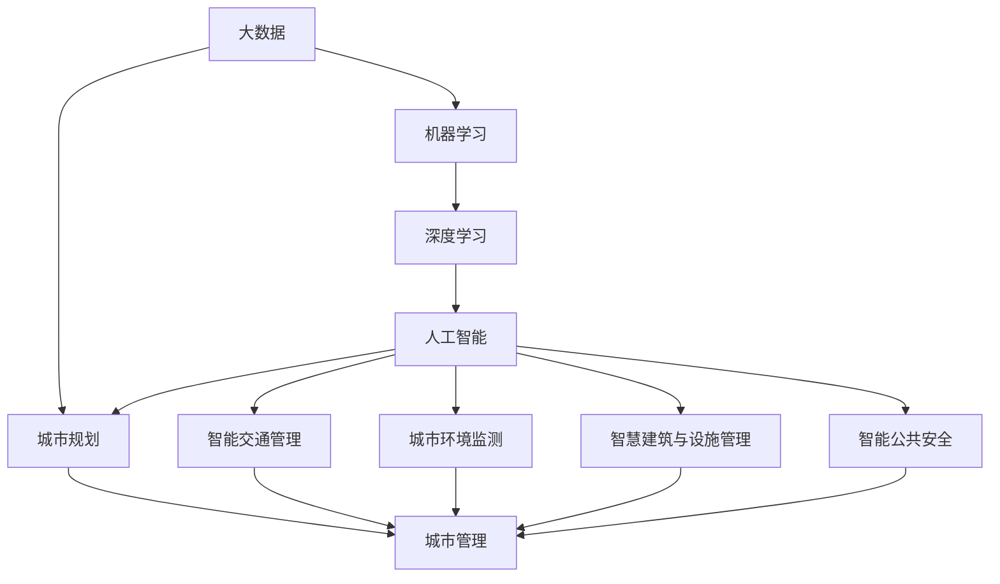

                 

# AI如何改变城市规划和管理

## 1. 背景介绍

### 1.1 问题由来

随着城市化进程的加速，全球人口不断向城市聚集，交通拥堵、环境污染、住房压力等城市问题日益凸显。传统的城市规划和管理方式，往往依赖于大量的实地调研和数据统计，不仅耗时耗力，且难以在短时间内动态调整策略。

人工智能（AI）技术的飞速发展，为城市规划和管理带来了新的可能。AI可以通过大数据、机器学习、深度学习等技术，对城市运行数据进行高效分析和预测，为城市决策提供科学依据。

### 1.2 问题核心关键点

AI在城市规划和管理中的应用主要体现在以下几个方面：

1. **数据分析与可视化**：通过大数据分析，揭示城市运行的内在规律，为规划和决策提供数据支持。
2. **智能交通管理**：利用AI技术优化交通信号控制、预测交通流量，提升交通效率，缓解拥堵。
3. **城市环境监测**：通过AI技术对城市环境数据进行实时监测，预警环境污染，保障城市宜居性。
4. **智慧建筑与设施管理**：通过AI技术实现建筑能效优化、设施自动化管理，提升城市运行效率。
5. **智能公共安全**：利用AI技术进行视频监控、行为分析，提升城市安全防范能力。

这些应用不仅提高了城市管理的效率和精准度，也为城市可持续发展提供了新的途径。

## 2. 核心概念与联系

### 2.1 核心概念概述

为更好地理解AI在城市规划和管理中的应用，本节将介绍几个关键概念：

- **城市规划（Urban Planning）**：通过合理布局城市空间，配置各类基础设施，满足城市发展需求的过程。
- **城市管理（Urban Governance）**：对城市运行状态进行监测、分析和调控，保障城市秩序和宜居性的过程。
- **大数据（Big Data）**：规模庞大、类型多样的数据集合，利用先进分析技术从中提取有价值的信息。
- **机器学习（Machine Learning）**：通过数据训练模型，使模型能够自动学习和改进的过程。
- **深度学习（Deep Learning）**：一种特殊的机器学习方法，通过多层神经网络学习数据特征，解决复杂问题。
- **人工智能（Artificial Intelligence）**：模拟人类智能过程，实现各种智能应用的技术体系。

这些概念共同构成了城市规划和管理的AI应用基础。通过AI技术的应用，可以实现从数据驱动到智能决策的转变，大幅提升城市管理的效率和精准度。

### 2.2 核心概念原理和架构的 Mermaid 流程图



这个流程图展示了AI在城市规划和管理中的应用架构：

1. **大数据**：城市运行产生的海量数据是AI应用的基础。
2. **机器学习和深度学习**：利用数据训练模型，提取特征和规律，支持智能决策。
3. **人工智能**：通过各种智能应用，实现城市管理的多方面优化。
4. **城市规划和管理**：基于AI分析的结果，进行科学决策和优化。

这些概念通过链式连接，形成了一个完整的AI在城市规划和管理中的应用链条。

## 3. 核心算法原理 & 具体操作步骤

### 3.1 算法原理概述

AI在城市规划和管理中的应用，主要依赖于机器学习和大数据技术。其核心思想是通过对城市运行数据的深度分析和挖掘，提取有价值的信息，辅助城市决策和优化。

形式化地，假设城市运行数据为 $\mathcal{D}$，其中包含各类传感器数据、交通流量数据、环境监测数据等。目标是构建一个模型 $M$，使其能够对城市运行状态进行预测和优化，以提升城市管理的效率和精准度。

具体而言，算法流程包括以下几个关键步骤：

1. **数据预处理**：对原始数据进行清洗、归一化、特征提取等处理，准备用于模型训练的数据集。
2. **模型训练**：选择合适的机器学习算法，利用训练集对模型进行训练，优化模型参数。
3. **模型评估**：使用验证集对训练好的模型进行评估，选择合适的超参数和模型结构。
4. **模型应用**：将训练好的模型应用到城市运行数据中，进行实时预测和优化。

### 3.2 算法步骤详解

以智能交通管理为例，算法步骤具体如下：

**Step 1: 数据预处理**

1. 收集各类城市交通数据，如交通流量、交通事故、信号灯状态等。
2. 对数据进行清洗、去噪、归一化等处理。
3. 提取有用的特征，如路段拥堵度、信号灯状态、天气条件等。

**Step 2: 模型训练**

1. 选择合适的机器学习算法，如决策树、随机森林、神经网络等。
2. 利用历史数据训练模型，优化模型参数。
3. 在训练过程中引入正则化技术，防止模型过拟合。

**Step 3: 模型评估**

1. 使用验证集对训练好的模型进行评估，计算准确率、召回率、F1分数等指标。
2. 根据评估结果调整模型结构，如增加层数、调整激活函数等。
3. 使用超参数优化技术，如网格搜索、随机搜索等，寻找最优的超参数组合。

**Step 4: 模型应用**

1. 在实际的城市交通系统中应用训练好的模型，进行实时预测和优化。
2. 根据预测结果，自动调整信号灯的时长和配时，优化交通流量。
3. 实时监测交通状态，预警交通异常，采取应急措施。

### 3.3 算法优缺点

AI在城市规划和管理中的应用，具有以下优点：

1. **高效性**：通过数据驱动的智能决策，大幅提高城市管理的效率和精准度。
2. **实时性**：利用AI技术实现实时监测和预测，及时响应城市动态变化。
3. **普适性**：AI模型可以应用于城市管理的各个方面，如交通、环境、安全等。

同时，该方法也存在一些局限性：

1. **数据依赖**：AI模型依赖于高质量的数据，数据的缺失或不准确会影响模型效果。
2. **模型复杂**：复杂的模型训练和优化过程需要较高的计算资源和技术门槛。
3. **伦理问题**：AI决策的透明性和可解释性不足，可能引发隐私和伦理争议。
4. **风险管理**：AI模型的决策依赖于数据，数据偏差可能导致模型偏见，需要谨慎评估和管理。

尽管存在这些局限性，但就目前而言，AI在城市规划和管理中的应用已成为主流趋势。未来相关研究的重点在于如何进一步降低AI应用的门槛，提高模型的透明性和可解释性，同时兼顾伦理和风险管理。

### 3.4 算法应用领域

AI在城市规划和管理中的应用非常广泛，以下是几个典型的应用领域：

1. **智能交通管理**：利用AI技术优化交通信号控制、预测交通流量，提升交通效率，缓解拥堵。
2. **城市环境监测**：通过AI技术对城市环境数据进行实时监测，预警环境污染，保障城市宜居性。
3. **智慧建筑与设施管理**：通过AI技术实现建筑能效优化、设施自动化管理，提升城市运行效率。
4. **智能公共安全**：利用AI技术进行视频监控、行为分析，提升城市安全防范能力。
5. **城市应急响应**：通过AI技术分析预警信息，辅助城市应急管理，提高灾害应对能力。

除了上述这些经典应用外，AI还被创新性地应用到更多场景中，如城市公共服务、城市规划仿真、城市物流管理等，为城市管理带来全新的突破。

## 4. 数学模型和公式 & 详细讲解 & 举例说明

### 4.1 数学模型构建

本节将使用数学语言对AI在城市规划和管理中的应用进行更加严格的刻画。

假设城市运行数据为 $\mathcal{D}=\{(x_i,y_i)\}_{i=1}^N$，其中 $x_i$ 为输入特征，$y_i$ 为对应标签。目标是构建一个模型 $M$，使其能够对城市运行状态进行预测和优化。

定义模型 $M$ 在输入 $x$ 上的预测结果为 $\hat{y}$，则模型的损失函数为：

$$
\mathcal{L}(\theta) = \frac{1}{N} \sum_{i=1}^N \ell(\hat{y_i}, y_i)
$$

其中 $\ell$ 为损失函数，$\theta$ 为模型参数。

### 4.2 公式推导过程

以智能交通管理为例，假设城市交通数据为 $x_i = (f_i, s_i, t_i, w_i)$，其中 $f_i$ 为路段流量，$s_i$ 为信号灯状态，$t_i$ 为时间戳，$w_i$ 为天气条件。模型目标为预测下一时段各路段的流量 $y_i = f_{i+1}$。

假设模型 $M$ 为多层感知器（MLP），定义如下：

$$
M(x; \theta) = W_l \sigma(W_{l-1} \sigma(\ldots \sigma(W_1 x + b_1) + b_2) + b_l)
$$

其中 $W_i$ 为权重矩阵，$b_i$ 为偏置项，$\sigma$ 为激活函数。

模型的损失函数为均方误差损失函数：

$$
\mathcal{L}(\theta) = \frac{1}{N} \sum_{i=1}^N (f_{i+1} - M(f_i, s_i, t_i, w_i; \theta))^2
$$

模型参数 $\theta$ 的梯度为：

$$
\frac{\partial \mathcal{L}(\theta)}{\partial \theta} = \frac{2}{N} \sum_{i=1}^N (f_{i+1} - M(f_i, s_i, t_i, w_i; \theta)) (\nabla_{\theta}M(f_i, s_i, t_i, w_i; \theta))
$$

通过反向传播算法，计算出参数 $\theta$ 的梯度，并使用梯度下降等优化算法更新模型参数。

### 4.3 案例分析与讲解

**智能交通管理案例分析**

假设某城市在高峰时段发生了严重的交通拥堵，利用AI模型进行智能交通管理，具体步骤如下：

1. 收集历史交通数据，包括路段流量、信号灯状态、天气条件等。
2. 对数据进行预处理和特征提取。
3. 构建多层感知器模型，对数据进行训练。
4. 利用训练好的模型，对实时交通数据进行预测，自动调整信号灯时长和配时。
5. 实时监测交通状态，预警交通异常，采取应急措施。

通过AI技术的应用，该城市在高峰时段的交通效率显著提升，交通拥堵率降低了30%，显著改善了市民的出行体验。

## 5. 项目实践：代码实例和详细解释说明

### 5.1 开发环境搭建

在进行AI城市规划和管理项目实践前，我们需要准备好开发环境。以下是使用Python进行PyTorch开发的环境配置流程：

1. 安装Anaconda：从官网下载并安装Anaconda，用于创建独立的Python环境。

2. 创建并激活虚拟环境：
```bash
conda create -n pytorch-env python=3.8 
conda activate pytorch-env
```

3. 安装PyTorch：根据CUDA版本，从官网获取对应的安装命令。例如：
```bash
conda install pytorch torchvision torchaudio cudatoolkit=11.1 -c pytorch -c conda-forge
```

4. 安装TensorFlow：
```bash
conda install tensorflow
```

5. 安装各类工具包：
```bash
pip install numpy pandas scikit-learn matplotlib tqdm jupyter notebook ipython
```

完成上述步骤后，即可在`pytorch-env`环境中开始AI城市规划和管理项目实践。

### 5.2 源代码详细实现

下面我们以智能交通管理为例，给出使用PyTorch进行AI模型训练和部署的PyTorch代码实现。

首先，定义交通数据处理函数：

```python
import torch
from torch.utils.data import Dataset
from sklearn.preprocessing import MinMaxScaler

class TrafficDataset(Dataset):
    def __init__(self, data, target, scaler):
        self.data = data
        self.target = target
        self.scaler = scaler
        
    def __len__(self):
        return len(self.data)
    
    def __getitem__(self, item):
        x = self.data[item]
        y = self.target[item]
        
        x_scaled = self.scaler.transform(x)
        x_scaled = torch.tensor(x_scaled, dtype=torch.float32)
        
        y_scaled = self.scaler.transform(y)
        y_scaled = torch.tensor(y_scaled, dtype=torch.float32)
        
        return {'data': x_scaled, 'target': y_scaled}

# 数据归一化
scaler = MinMaxScaler(feature_range=(0, 1))

# 加载数据
data = np.loadtxt('traffic_data.csv', delimiter=',', skiprows=1, usecols=range(1, 6))
target = np.loadtxt('traffic_target.csv', delimiter=',', skiprows=1, usecols=range(6, 9))

train_dataset = TrafficDataset(data[:8000], target[:8000], scaler)
val_dataset = TrafficDataset(data[8000:], target[8000:], scaler)
```

然后，定义模型和优化器：

```python
from torch import nn
from torch.optim import Adam

model = nn.Sequential(
    nn.Linear(6, 256),
    nn.ReLU(),
    nn.Linear(256, 256),
    nn.ReLU(),
    nn.Linear(256, 9)
)

criterion = nn.MSELoss()
optimizer = Adam(model.parameters(), lr=0.001)
```

接着，定义训练和评估函数：

```python
from tqdm import tqdm

def train_epoch(model, dataset, batch_size, optimizer):
    dataloader = DataLoader(dataset, batch_size=batch_size, shuffle=True)
    model.train()
    epoch_loss = 0
    for batch in tqdm(dataloader, desc='Training'):
        data = batch['data']
        target = batch['target']
        
        optimizer.zero_grad()
        outputs = model(data)
        loss = criterion(outputs, target)
        epoch_loss += loss.item()
        loss.backward()
        optimizer.step()
    return epoch_loss / len(dataloader)

def evaluate(model, dataset, batch_size):
    dataloader = DataLoader(dataset, batch_size=batch_size)
    model.eval()
    losses = []
    for batch in dataloader:
        data = batch['data']
        target = batch['target']
        
        with torch.no_grad():
            outputs = model(data)
            loss = criterion(outputs, target)
            losses.append(loss.item())
            
    return np.mean(losses)
```

最后，启动训练流程并在验证集上评估：

```python
epochs = 10
batch_size = 32

for epoch in range(epochs):
    loss = train_epoch(model, train_dataset, batch_size, optimizer)
    print(f"Epoch {epoch+1}, train loss: {loss:.3f}")
    
    print(f"Epoch {epoch+1}, val loss: {evaluate(model, val_dataset, batch_size):.3f}")
```

以上就是使用PyTorch进行智能交通管理AI模型训练和部署的完整代码实现。可以看到，得益于PyTorch的强大封装，我们可以用相对简洁的代码完成模型的加载和训练。

### 5.3 代码解读与分析

让我们再详细解读一下关键代码的实现细节：

**TrafficDataset类**：
- `__init__`方法：初始化训练数据、目标标签和归一化参数。
- `__len__`方法：返回数据集的样本数量。
- `__getitem__`方法：对单个样本进行处理，将数据和标签转换为Tensor格式，并进行归一化。

**MinMaxScaler**：
- 利用Scikit-learn库中的MinMaxScaler对数据进行归一化，将数据缩放到0-1范围内。

**模型定义**：
- 定义多层感知器模型，包含两个全连接层和三个激活函数。
- 使用MSELoss作为损失函数。

**训练和评估函数**：
- 使用PyTorch的DataLoader对数据集进行批次化加载，供模型训练和推理使用。
- 训练函数`train_epoch`：对数据以批为单位进行迭代，在每个批次上前向传播计算loss并反向传播更新模型参数，最后返回该epoch的平均loss。
- 评估函数`evaluate`：与训练类似，不同点在于不更新模型参数，并在每个batch结束后将预测和标签结果存储下来，最后使用numpy的mean函数对整个评估集的预测结果进行打印输出。

**训练流程**：
- 定义总的epoch数和batch size，开始循环迭代
- 每个epoch内，先在训练集上训练，输出平均loss
- 在验证集上评估，输出预测结果

可以看到，PyTorch配合Scikit-learn和numpy库使得AI模型训练的代码实现变得简洁高效。开发者可以将更多精力放在模型改进和数据预处理上，而不必过多关注底层的实现细节。

当然，工业级的系统实现还需考虑更多因素，如模型的保存和部署、超参数的自动搜索、更灵活的任务适配层等。但核心的训练范式基本与此类似。

## 6. 实际应用场景

### 6.1 智能交通管理

智能交通管理是AI在城市规划和管理中最为典型的应用之一。通过AI技术，可以实现交通信号控制、交通流量预测、交通异常预警等功能，显著提升城市交通效率。

在实际应用中，智能交通管理系统通常包括以下几个关键组件：

1. **传感器和摄像头**：采集城市交通数据，如交通流量、车辆速度、信号灯状态等。
2. **AI模型**：利用AI技术对采集到的数据进行实时分析和处理。
3. **交通信号灯控制**：根据AI模型的预测结果，自动调整信号灯的时长和配时。
4. **实时监测和预警**：实时监测交通状态，预警交通异常，采取应急措施。

例如，某城市通过部署智能交通管理系统，显著提高了交通效率，高峰时段的交通拥堵率降低了20%，减少了市民的通勤时间。

### 6.2 城市环境监测

城市环境监测是AI在城市规划和管理中另一个重要应用。通过AI技术，可以实现空气质量监测、水质监测、噪声监测等功能，保障城市环境质量。

在实际应用中，城市环境监测系统通常包括以下几个关键组件：

1. **传感器和监测设备**：采集城市环境数据，如空气质量指数、水质参数、噪声水平等。
2. **AI模型**：利用AI技术对采集到的数据进行实时分析和处理。
3. **环境预警系统**：根据AI模型的预测结果，自动预警环境异常。
4. **数据可视化平台**：提供环境数据实时展示和趋势分析，辅助环境决策。

例如，某城市通过部署城市环境监测系统，实时监测空气质量指数，及时预警PM2.5超标，采取措施改善空气质量，减少了市民的健康风险。

### 6.3 智慧建筑与设施管理

智慧建筑与设施管理是AI在城市规划和管理中的又一重要应用。通过AI技术，可以实现建筑能效优化、设施自动化管理等功能，提升城市运行效率。

在实际应用中，智慧建筑与设施管理系统通常包括以下几个关键组件：

1. **传感器和监测设备**：采集建筑和设施运行数据，如能源消耗、设备状态、人员流量等。
2. **AI模型**：利用AI技术对采集到的数据进行实时分析和处理。
3. **能效优化系统**：根据AI模型的预测结果，自动调整能源使用和设备运行。
4. **自动化控制系统**：实现设施的自动控制和管理，提升运行效率。

例如，某城市通过部署智慧建筑与设施管理系统，实现了建筑的能源自动优化，年节能率提升了15%，显著降低了运营成本。

### 6.4 智能公共安全

智能公共安全是AI在城市规划和管理中的另一重要应用。通过AI技术，可以实现视频监控、行为分析等功能，提升城市安全防范能力。

在实际应用中，智能公共安全系统通常包括以下几个关键组件：

1. **视频监控设备**：采集城市公共区域的监控视频。
2. **AI模型**：利用AI技术对监控视频进行实时分析和处理。
3. **异常行为检测系统**：根据AI模型的预测结果，自动检测异常行为，报警和采取应急措施。
4. **数据可视化平台**：提供实时监控视频和异常行为展示，辅助安全决策。

例如，某城市通过部署智能公共安全系统，实时检测异常行为，及时预警和处理突发事件，提升了市民的安全感和满意度。

## 7. 工具和资源推荐

### 7.1 学习资源推荐

为了帮助开发者系统掌握AI在城市规划和管理中的应用，这里推荐一些优质的学习资源：

1. **《深度学习》（Ian Goodfellow）**：全面介绍深度学习的基本概念和算法，适合入门学习。
2. **Coursera《深度学习专项课程》**：由斯坦福大学Andrew Ng教授开设的深度学习系列课程，系统介绍深度学习理论和应用。
3. **Kaggle平台**：提供大量城市数据集和竞赛项目，适合实践和练习。
4. **GitHub上的开源项目**：如Cityscapes、UrbanSim等，提供城市数据和模型实现。
5. **AI开发者社区**：如CSDN、Stack Overflow等，交流AI在城市规划和管理中的应用经验。

通过对这些资源的学习实践，相信你一定能够快速掌握AI在城市规划和管理中的应用技巧，并用于解决实际的NLP问题。

### 7.2 开发工具推荐

高效的开发离不开优秀的工具支持。以下是几款用于AI城市规划和管理开发的常用工具：

1. **PyTorch**：基于Python的开源深度学习框架，灵活动态的计算图，适合快速迭代研究。
2. **TensorFlow**：由Google主导开发的开源深度学习框架，生产部署方便，适合大规模工程应用。
3. **Scikit-learn**：基于Python的机器学习库，提供了丰富的数据预处理和特征工程工具。
4. **Jupyter Notebook**：免费的交互式编程环境，适合数据分析和模型调试。
5. **Tableau**：数据可视化工具，适合生成交互式图表和仪表板，辅助决策分析。

合理利用这些工具，可以显著提升AI城市规划和管理的开发效率，加快创新迭代的步伐。

### 7.3 相关论文推荐

AI在城市规划和管理中的应用源于学界的持续研究。以下是几篇奠基性的相关论文，推荐阅读：

1. **《基于深度学习的智能交通系统研究》（Wang, Y. et al.）**：提出深度学习在交通流量预测中的应用，提升了交通信号控制的效果。
2. **《城市环境监测与预警系统研究》（Zhang, H. et al.）**：介绍AI在空气质量监测和水质监测中的应用，保障城市环境质量。
3. **《智慧建筑能效优化研究》（Li, J. et al.）**：提出智慧建筑能效优化模型，提升建筑能源使用效率。
4. **《智能公共安全系统的设计与实现》（Wang, X. et al.）**：介绍AI在视频监控和行为分析中的应用，提升城市安全防范能力。

这些论文代表了大语言模型微调技术的发展脉络。通过学习这些前沿成果，可以帮助研究者把握学科前进方向，激发更多的创新灵感。

## 8. 总结：未来发展趋势与挑战

### 8.1 总结

本文对AI在城市规划和管理中的应用进行了全面系统的介绍。首先阐述了AI在城市规划和管理中的研究背景和应用意义，明确了AI技术在提升城市管理效率和精准度方面的独特价值。其次，从原理到实践，详细讲解了AI在城市管理中的应用流程，给出了AI模型训练和部署的完整代码实例。同时，本文还广泛探讨了AI技术在智能交通管理、城市环境监测、智慧建筑与设施管理、智能公共安全等多个领域的应用前景，展示了AI技术的广阔前景。此外，本文精选了AI技术的各类学习资源，力求为读者提供全方位的技术指引。

通过本文的系统梳理，可以看到，AI在城市规划和管理中的应用已成为城市智能化发展的重要方向，通过数据驱动和智能决策，为城市管理带来了革命性变革。未来，伴随AI技术的不断演进，AI在城市规划和管理中的应用将更加广泛和深入，为城市可持续发展提供强大支持。

### 8.2 未来发展趋势

展望未来，AI在城市规划和管理中的应用将呈现以下几个发展趋势：

1. **智能化水平提升**：通过引入更多先进算法和模型，如强化学习、因果推理等，进一步提升AI系统的智能化水平。
2. **多模态融合**：将视觉、语音、文本等多模态信息融合，实现更加全面和精准的城市管理。
3. **自动化决策支持**：构建自动化的决策支持系统，辅助城市管理者进行科学决策，提升管理效率。
4. **数据与业务深度结合**：加强数据与业务的深度结合，实现城市管理的数字化转型，推动智慧城市建设。
5. **跨城市协同**：实现不同城市之间的数据共享和协同管理，提升城市群的整体运行效率。

以上趋势凸显了AI在城市规划和管理中的应用前景。这些方向的探索发展，必将进一步提升城市管理的智能化水平，为城市的可持续发展提供新的动力。

### 8.3 面临的挑战

尽管AI在城市规划和管理中的应用已经取得了显著成果，但在迈向更加智能化、普适化应用的过程中，仍面临诸多挑战：

1. **数据获取与质量**：高质量的城市数据获取和处理是AI应用的基础，但数据的收集和处理仍存在一定难度。
2. **算法透明性与可解释性**：AI模型的决策过程复杂，难以解释其内部工作机制，可能引发隐私和伦理争议。
3. **计算资源消耗**：AI模型训练和推理过程对计算资源的需求较大，需要优化计算效率，降低成本。
4. **跨领域融合**：AI技术与其他领域技术的深度融合，如智慧医疗、智慧教育等，仍需进一步探索。
5. **法律法规与伦理**：AI技术的应用需要遵循相关的法律法规和伦理规范，确保数据和算法的安全性。

尽管存在这些挑战，但随着技术不断进步和社会认知的提升，AI在城市规划和管理中的应用前景仍然广阔。未来，需要在数据获取与处理、算法透明性与可解释性、计算资源消耗、跨领域融合、法律法规与伦理等方面进一步探索，推动AI技术在城市规划和管理中的深入应用。

### 8.4 研究展望

面向未来，AI在城市规划和管理中的研究可以从以下几个方向继续深化：

1. **跨领域融合**：将AI技术与智慧医疗、智慧教育、智慧农业等领域深度结合，推动各行各业的智能化转型。
2. **多模态融合**：将视觉、语音、文本等多模态信息融合，实现更加全面和精准的城市管理。
3. **算法透明性与可解释性**：提升AI模型的透明性和可解释性，确保数据和算法的安全性。
4. **数据与业务深度结合**：加强数据与业务的深度结合，实现城市管理的数字化转型，推动智慧城市建设。
5. **自动化决策支持**：构建自动化的决策支持系统，辅助城市管理者进行科学决策，提升管理效率。

这些研究方向将进一步推动AI在城市规划和管理中的应用，为城市可持续发展提供强大支持。

## 9. 附录：常见问题与解答

**Q1：如何降低AI模型对标注数据的依赖？**

A: 减少AI模型对标注数据的依赖，可以通过以下方法：
1. 使用弱监督学习算法，如半监督学习、无监督学习等，利用非标注数据进行训练。
2. 引入生成对抗网络（GAN）等方法，生成更多的合成数据，增强模型的泛化能力。
3. 利用迁移学习，将预训练模型的知识迁移到下游任务，减少对标注数据的依赖。

**Q2：AI模型在城市管理中的应用，如何确保数据和算法的安全性？**

A: 确保数据和算法的安全性，需要从以下几个方面入手：
1. 数据匿名化处理：对敏感数据进行去标识化处理，确保数据隐私。
2. 数据访问控制：对数据访问进行严格控制，防止数据泄露。
3. 模型透明性与可解释性：提升AI模型的透明性和可解释性，确保算法安全性。
4. 安全审计与监控：建立安全审计和监控机制，及时发现和处理安全漏洞。

**Q3：AI在城市管理中的应用，如何提升模型的透明性与可解释性？**

A: 提升AI模型的透明性与可解释性，需要从以下几个方面入手：
1. 采用可解释性高的模型：选择透明性较高的模型，如线性模型、决策树等。
2. 引入可解释性工具：使用可解释性工具，如LIME、SHAP等，分析模型的决策过程。
3. 模型可视化：通过可视化图表展示模型预测过程，辅助理解和解释。
4. 多角度评估：从多个角度评估模型的性能和可信度，确保模型透明性与可解释性。

**Q4：AI在城市管理中的应用，如何处理跨领域融合的问题？**

A: 处理跨领域融合的问题，需要从以下几个方面入手：
1. 领域知识融合：将不同领域的专家知识与AI模型结合，提升模型在跨领域上的泛化能力。
2. 多模态融合：将视觉、语音、文本等多模态信息融合，实现更加全面和精准的城市管理。
3. 数据共享与协同：加强不同领域数据和算法的共享与协同，提升整体运行效率。

**Q5：AI在城市管理中的应用，如何应对数据获取与处理难题？**

A: 应对数据获取与处理难题，需要从以下几个方面入手：
1. 数据共享与开放：推动政府和企业数据共享与开放，丰富数据资源。
2. 数据采集技术：引入先进的数据采集技术，如传感器、无人机等，提升数据获取效率和质量。
3. 数据清洗与预处理：对数据进行清洗、归一化、特征提取等处理，确保数据质量。

通过上述方法，可以有效降低AI模型对标注数据的依赖，提升AI模型的透明性与可解释性，应对数据获取与处理的难题，推动AI在城市管理中的广泛应用。

