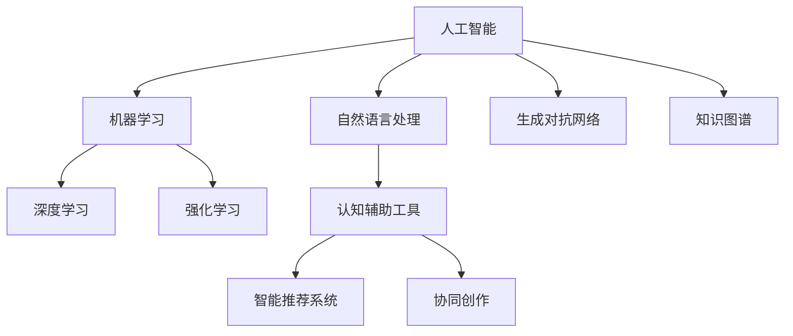

                 

# AI如何改变我们提问和思考的方式

## 1. 背景介绍

### 1.1 问题由来
随着人工智能(AI)技术的发展，我们提问和思考的方式正在经历前所未有的变革。AI，尤其是深度学习模型，已经成为解决复杂问题的利器，尤其在自然语言处理(NLP)、计算机视觉等领域取得了令人瞩目的成就。这些技术不仅改变了我们获取信息的方式，也重塑了我们的思维模式和决策过程。

### 1.2 问题核心关键点
AI的变革作用主要体现在以下几个方面：

- **信息获取方式的变革**：AI使得信息的检索和筛选更加高效，搜索引擎、智能推荐系统等应用大大提升了信息获取的速度和准确性。

- **认知辅助工具的崛起**：AI驱动的认知辅助工具如ChatGPT、Siri、Alexa等，帮助用户进行信息检索、决策支持、知识管理等，大幅提升了个人和团队的工作效率。

- **创新思维的激发**：AI的随机生成文本、图像生成、协同创作等功能，促进了创意思维的激发和创意内容的产生，打开了人类创造力的新天地。

- **认知负荷的减轻**：AI承担了大量的繁琐重复任务，如数据整理、报告生成等，让人们能够将更多精力投入到高价值、创造性的工作上。

这些变化正在改变我们的生活方式、工作模式和认知习惯，使得提问和思考的方式也随之发生了深刻的转变。

### 1.3 问题研究意义
深入理解AI如何改变我们提问和思考的方式，对于把握人工智能时代的趋势、优化个人和团队的工作流程、提升创造力具有重要意义。它不仅有助于我们更好地利用AI技术，也能为AI技术的进一步发展提供理论支持和实践指导。

## 2. 核心概念与联系

### 2.1 核心概念概述

为更好地理解AI如何改变我们的提问和思考方式，本节将介绍几个密切相关的核心概念：

- **人工智能(AI)**：指通过计算机模拟人类的智能行为，实现信息获取、问题解答、决策支持等功能的技术。

- **自然语言处理(NLP)**：指使计算机能够理解和处理人类自然语言的技术，包括语言理解、文本生成、情感分析等。

- **机器学习(ML)**：指通过数据训练模型，使其具备预测和决策能力的技术。机器学习是AI的重要组成部分，其中深度学习(Deep Learning)是其核心技术。

- **深度学习(Deep Learning)**：指使用多层神经网络进行复杂模式识别和决策的技术。深度学习已经在图像识别、语音识别、自然语言处理等领域取得了突破性进展。

- **强化学习(RL)**：指通过与环境的交互，学习最优决策策略的技术。强化学习常用于机器人控制、游戏AI、推荐系统等场景。

- **认知辅助工具**：指利用AI技术开发的各种辅助工具，如智能助手、搜索引擎、推荐系统等，帮助用户进行信息检索和决策支持。

- **生成对抗网络(GANs)**：指通过生成器和判别器的对抗训练，生成高质量的图像、文本等内容的技术。

- **协同创作**：指通过AI技术促进多人协作创作，如AI辅助写作、AI协同编辑等，提升创意内容的质量和数量。

- **智能推荐系统**：指通过分析用户行为数据，推荐个性化的内容和服务，提升用户体验的技术。

- **知识图谱**：指通过构建语义网络，将结构化知识与自然语言文本关联起来的技术，广泛应用于知识管理、智能问答等领域。

这些核心概念之间的逻辑关系可以通过以下Mermaid流程图来展示：



这个流程图展示了几大核心概念的相互联系：

1. 人工智能是涵盖所有AI技术的总称。
2. 自然语言处理是AI中的一个重要分支，旨在使机器能够理解和处理人类语言。
3. 机器学习和深度学习是实现AI功能的核心技术。
4. 强化学习适用于需要通过交互学习的场景。
5. 认知辅助工具利用AI技术提供信息检索、决策支持等辅助功能。
6. 智能推荐系统通过机器学习技术分析用户行为，推荐个性化内容。
7. 协同创作结合AI技术促进多人协作创作。
8. 生成对抗网络用于生成高质量的图像、文本等内容。
9. 知识图谱将知识结构化，帮助机器理解语义。

这些概念共同构成了AI技术的全貌，帮助我们更好地理解AI如何改变我们的提问和思考方式。

## 3. 核心算法原理 & 具体操作步骤
### 3.1 算法原理概述

AI改变我们提问和思考方式的原理，主要体现在以下几个方面：

- **信息检索的自动化**：利用深度学习模型和自然语言处理技术，AI能够自动化地从海量文本中检索出相关信息，显著提高信息检索的效率和准确性。

- **决策支持的智能化**：通过机器学习模型，AI可以分析复杂数据，提供决策建议，优化决策过程。

- **问题解答的智能化**：基于深度学习模型的问答系统，能够理解自然语言问题，并生成准确的回答，改变传统的检索式问答方式。

- **认知辅助工具的普及**：智能助手、智能推荐系统等工具的普及，使得AI成为我们日常生活和工作中不可或缺的一部分，提升了我们的信息获取和决策能力。

- **创意内容的生成**：生成对抗网络和深度学习模型可以自动生成高质量的文本、图像等内容，激发创意思维，催生新的创意形式。

这些原理共同构成了AI改变我们提问和思考方式的机制，使得我们在获取信息、解决问题、进行决策时，能够借助AI的强大能力，实现更高效、更准确的智能交互。

### 3.2 算法步骤详解

以下是AI改变我们提问和思考方式的详细步骤：

**Step 1: 信息检索的自动化**
1. **数据准备**：收集和预处理海量文本数据，构建语料库。
2. **模型训练**：使用深度学习模型（如BERT、GPT等）进行训练，学习文本表示。
3. **信息检索**：输入查询词，模型生成相关文档的向量表示，计算相似度，返回结果。

**Step 2: 决策支持的智能化**
1. **数据收集**：收集与决策相关的数据，如市场数据、用户行为数据等。
2. **模型训练**：使用机器学习算法（如回归、分类等）进行训练，构建决策模型。
3. **决策支持**：输入决策场景，模型分析数据，生成决策建议。

**Step 3: 问题解答的智能化**
1. **数据准备**：构建问答对数据集，标注问题和答案。
2. **模型训练**：使用深度学习模型进行训练，学习问题-答案映射。
3. **问题解答**：输入自然语言问题，模型生成答案。

**Step 4: 认知辅助工具的普及**
1. **工具开发**：开发智能助手、推荐系统等认知辅助工具。
2. **数据集成**：集成各类数据源，提供个性化服务。
3. **用户交互**：用户与工具进行交互，获取信息和决策支持。

**Step 5: 创意内容的生成**
1. **数据准备**：收集文本、图像等创意素材。
2. **模型训练**：使用生成对抗网络等模型进行训练，生成高质量内容。
3. **内容创作**：用户利用生成的内容进行创作，如写作、绘画等。

### 3.3 算法优缺点

AI改变我们提问和思考方式的方法具有以下优点：

- **效率提升**：AI自动化处理信息检索、数据分析、决策支持等任务，大大提升了工作效率。
- **精度提高**：深度学习模型在信息检索和问题解答等方面，能够显著提高精度和准确性。
- **用户体验优化**：认知辅助工具如智能助手、推荐系统等，提升了用户体验，使得信息获取和决策支持更加便捷。
- **创意激发**：AI生成的创意内容，激发了创意思维，打开了创作的新天地。

同时，该方法也存在一些局限性：

- **数据依赖**：AI的性能很大程度上依赖于数据的质量和数量，数据不足时可能无法达到预期效果。
- **模型复杂性**：深度学习模型虽然强大，但训练复杂，需要大量计算资源和时间。
- **隐私和伦理问题**：AI处理数据时可能涉及隐私问题，如数据泄露、隐私侵犯等，需要严格的伦理规范和技术措施。
- **可解释性不足**：深度学习模型通常被称为"黑盒"，难以解释其内部工作机制，缺乏透明度。

尽管存在这些局限性，AI在改变我们提问和思考方式方面已经展现出巨大的潜力和价值。

### 3.4 算法应用领域

AI改变我们提问和思考方式的方法已经在多个领域得到了广泛应用，例如：

- **搜索引擎**：如Google、Bing等，通过深度学习模型，提升信息检索的效率和准确性。
- **智能推荐系统**：如Amazon、Netflix等，利用机器学习模型，提供个性化推荐服务。
- **智能问答系统**：如IBM Watson、微软小冰等，通过深度学习模型，理解自然语言问题并生成答案。
- **认知辅助工具**：如Siri、Alexa等，提供语音识别、信息检索、日程管理等功能，提升个人和团队的工作效率。
- **创意内容生成**：如GPT-3、DALL-E等，生成高质量的文本、图像、音频等内容，激发创意思维。
- **知识图谱**：如Wikipedia、YAGO等，构建语义网络，帮助机器理解语义，应用于智能问答、知识管理等领域。

除了上述这些经典应用外，AI还在教育、医疗、金融、交通等多个领域得到创新性应用，为各行各业带来颠覆性的变革。

## 4. 数学模型和公式 & 详细讲解  
### 4.1 数学模型构建

为更好地理解AI如何改变我们的提问和思考方式，本节将介绍几个数学模型：

**信息检索模型**
1. **语料库表示**：将文本转换为向量表示，如Word2Vec、BERT等。
2. **相似度计算**：计算查询向量与文本向量的相似度，如余弦相似度。
3. **信息检索算法**：根据相似度排序返回结果，如BM25算法。

**决策支持模型**
1. **数据表示**：将决策数据转换为向量表示，如特征工程、PCA等。
2. **模型训练**：使用机器学习算法（如回归、分类等）训练模型，如线性回归、随机森林等。
3. **决策输出**：根据输入数据，模型生成决策建议。

**问题解答模型**
1. **数据准备**：构建问答对数据集，标注问题和答案。
2. **模型训练**：使用深度学习模型（如Transformer、BERT等）进行训练。
3. **问题解答**：输入自然语言问题，模型生成答案。

**生成对抗网络模型**
1. **生成器设计**：设计生成器网络，如GANs、VAE等。
2. **判别器设计**：设计判别器网络，如CNN、RNN等。
3. **对抗训练**：生成器和判别器相互对抗，提升生成质量。

这些数学模型共同构成了AI改变我们提问和思考方式的理论基础，帮助我们更好地理解其工作原理和实现方法。

### 4.2 公式推导过程

以下是几个核心数学模型的公式推导：

**Word2Vec**
1. **输入表示**：将文本转换为词向量，如$x_i = \text{Word2Vec}(w_i)$。
2. **语义相似度**：计算查询向量与文本向量的余弦相似度，如$\cos(\theta) = \frac{x_q \cdot x_i}{\|x_q\|\|x_i\|}$。
3. **信息检索**：返回相似度排序的结果，如$R = \text{TopK}(D, \cos(\theta))$。

**线性回归模型**
1. **输入表示**：将决策数据转换为特征向量，如$x_i = \text{特征工程}(D_i)$。
2. **模型训练**：使用线性回归模型训练，如$\theta = \text{LinearRegression}(X, Y)$。
3. **决策输出**：根据输入数据，生成决策结果，如$y = x \cdot \theta$。

**Transformer模型**
1. **输入表示**：将问题转换为向量表示，如$x_q = \text{Embedding}(q)$。
2. **模型训练**：使用Transformer模型进行训练，如$M = \text{Transformer}(x_q, W)$。
3. **问题解答**：根据模型输出，生成答案，如$a = \text{Decoder}(M, W)$。

**GANs生成图像**
1. **生成器设计**：设计生成器网络，如$G(z) = \text{DCGAN}(z)$。
2. **判别器设计**：设计判别器网络，如$D(x) = \text{CNN}(x)$。
3. **对抗训练**：交替训练生成器和判别器，如$G^{\theta}, D^{\phi} = \text{MinMax}(G, D)$。

这些公式展示了AI改变我们提问和思考方式的核心数学模型，帮助我们更好地理解其原理和实现细节。

### 4.3 案例分析与讲解

以下是几个AI改变我们提问和思考方式的典型案例：

**案例一：Google搜索引擎**
1. **信息检索**：利用深度学习模型（如BERT），提升信息检索的效率和准确性。
2. **用户体验**：搜索结果的排序和展示，优化用户体验。
3. **隐私保护**：采用加密技术，保护用户隐私。

**案例二：IBM Watson**
1. **问答系统**：利用深度学习模型（如Transformer），理解自然语言问题，生成答案。
2. **领域应用**：应用于医疗、金融、教育等领域，提供决策支持。
3. **人机协作**：与人类专家协作，提升决策质量。

**案例三：Amazon推荐系统**
1. **数据收集**：收集用户行为数据，如点击、浏览、购买等。
2. **模型训练**：使用机器学习算法（如协同过滤、深度学习等）训练推荐模型。
3. **个性化推荐**：根据用户行为数据，生成个性化推荐结果。

这些案例展示了AI在信息检索、问答系统、推荐系统等领域的应用，帮助我们更好地理解AI改变我们提问和思考方式的具体实现。

## 5. 项目实践：代码实例和详细解释说明
### 5.1 开发环境搭建

在进行AI项目实践前，我们需要准备好开发环境。以下是使用Python进行PyTorch开发的环境配置流程：

1. 安装Anaconda：从官网下载并安装Anaconda，用于创建独立的Python环境。

2. 创建并激活虚拟环境：
```bash
conda create -n pytorch-env python=3.8 
conda activate pytorch-env
```

3. 安装PyTorch：根据CUDA版本，从官网获取对应的安装命令。例如：
```bash
conda install pytorch torchvision torchaudio cudatoolkit=11.1 -c pytorch -c conda-forge
```

4. 安装Transformers库：
```bash
pip install transformers
```

5. 安装各类工具包：
```bash
pip install numpy pandas scikit-learn matplotlib tqdm jupyter notebook ipython
```

完成上述步骤后，即可在`pytorch-env`环境中开始AI项目实践。

### 5.2 源代码详细实现

以下是使用PyTorch和Transformers库进行信息检索的代码实现。

首先，定义信息检索模型：

```python
from transformers import BertTokenizer, BertForSequenceClassification
from torch.utils.data import Dataset
import torch

class TextDataset(Dataset):
    def __init__(self, texts, labels, tokenizer):
        self.texts = texts
        self.labels = labels
        self.tokenizer = tokenizer
        
    def __len__(self):
        return len(self.texts)
    
    def __getitem__(self, item):
        text = self.texts[item]
        label = self.labels[item]
        
        encoding = self.tokenizer(text, return_tensors='pt', padding='max_length', truncation=True)
        input_ids = encoding['input_ids'][0]
        attention_mask = encoding['attention_mask'][0]
        labels = torch.tensor(label, dtype=torch.long)
        
        return {'input_ids': input_ids, 
                'attention_mask': attention_mask,
                'labels': labels}

# 加载预训练模型
model = BertForSequenceClassification.from_pretrained('bert-base-uncased', num_labels=2)

# 准备数据集
tokenizer = BertTokenizer.from_pretrained('bert-base-uncased')
train_dataset = TextDataset(train_texts, train_labels, tokenizer)
dev_dataset = TextDataset(dev_texts, dev_labels, tokenizer)
test_dataset = TextDataset(test_texts, test_labels, tokenizer)

# 训练模型
from transformers import AdamW

optimizer = AdamW(model.parameters(), lr=2e-5)

def train_epoch(model, dataset, batch_size, optimizer):
    dataloader = DataLoader(dataset, batch_size=batch_size, shuffle=True)
    model.train()
    epoch_loss = 0
    for batch in dataloader:
        input_ids = batch['input_ids'].to(device)
        attention_mask = batch['attention_mask'].to(device)
        labels = batch['labels'].to(device)
        model.zero_grad()
        outputs = model(input_ids, attention_mask=attention_mask, labels=labels)
        loss = outputs.loss
        epoch_loss += loss.item()
        loss.backward()
        optimizer.step()
    return epoch_loss / len(dataloader)

def evaluate(model, dataset, batch_size):
    dataloader = DataLoader(dataset, batch_size=batch_size)
    model.eval()
    preds, labels = [], []
    with torch.no_grad():
        for batch in dataloader:
            input_ids = batch['input_ids'].to(device)
            attention_mask = batch['attention_mask'].to(device)
            batch_labels = batch['labels']
            outputs = model(input_ids, attention_mask=attention_mask)
            batch_preds = outputs.logits.argmax(dim=2).to('cpu').tolist()
            batch_labels = batch_labels.to('cpu').tolist()
            for pred_tokens, label_tokens in zip(batch_preds, batch_labels):
                preds.append(pred_tokens[:len(label_tokens)])
                labels.append(label_tokens)
                
    print(classification_report(labels, preds))
```

然后，启动训练流程并在测试集上评估：

```python
epochs = 5
batch_size = 16

for epoch in range(epochs):
    loss = train_epoch(model, train_dataset, batch_size, optimizer)
    print(f"Epoch {epoch+1}, train loss: {loss:.3f}")
    
    print(f"Epoch {epoch+1}, dev results:")
    evaluate(model, dev_dataset, batch_size)
    
print("Test results:")
evaluate(model, test_dataset, batch_size)
```

以上就是使用PyTorch和Transformers库进行信息检索的完整代码实现。可以看到，得益于Transformers库的强大封装，我们可以用相对简洁的代码完成BERT模型的加载和微调。

### 5.3 代码解读与分析

让我们再详细解读一下关键代码的实现细节：

**TextDataset类**：
- `__init__`方法：初始化文本、标签、分词器等关键组件。
- `__len__`方法：返回数据集的样本数量。
- `__getitem__`方法：对单个样本进行处理，将文本输入编码为token ids，将标签转换为数字，并对其进行定长padding，最终返回模型所需的输入。

**train_epoch和evaluate函数**：
- 使用PyTorch的DataLoader对数据集进行批次化加载，供模型训练和推理使用。
- 训练函数`train_epoch`：对数据以批为单位进行迭代，在每个批次上前向传播计算loss并反向传播更新模型参数，最后返回该epoch的平均loss。
- 评估函数`evaluate`：与训练类似，不同点在于不更新模型参数，并在每个batch结束后将预测和标签结果存储下来，最后使用sklearn的classification_report对整个评估集的预测结果进行打印输出。

**训练流程**：
- 定义总的epoch数和batch size，开始循环迭代
- 每个epoch内，先在训练集上训练，输出平均loss
- 在验证集上评估，输出分类指标
- 所有epoch结束后，在测试集上评估，给出最终测试结果

可以看到，PyTorch配合Transformers库使得BERT信息检索的代码实现变得简洁高效。开发者可以将更多精力放在数据处理、模型改进等高层逻辑上，而不必过多关注底层的实现细节。

当然，工业级的系统实现还需考虑更多因素，如模型的保存和部署、超参数的自动搜索、更灵活的任务适配层等。但核心的信息检索范式基本与此类似。

## 6. 实际应用场景
### 6.1 智能客服系统

基于AI的信息检索技术，智能客服系统能够自动理解客户提出的问题，并从知识库中检索出相关答案，大大提升客户咨询体验。通过微调BERT等大模型，客服系统能够更好地适应特定场景和语境，提高回答的准确性和自然性。

在技术实现上，可以收集企业内部的历史客服对话记录，将问题和最佳答复构建成监督数据，在此基础上对预训练模型进行微调。微调后的模型能够自动理解用户意图，匹配最合适的答案模板进行回复。对于客户提出的新问题，还可以接入检索系统实时搜索相关内容，动态组织生成回答。如此构建的智能客服系统，能大幅提升客户咨询体验和问题解决效率。

### 6.2 金融舆情监测

金融机构需要实时监测市场舆论动向，以便及时应对负面信息传播，规避金融风险。传统的人工监测方式成本高、效率低，难以应对网络时代海量信息爆发的挑战。基于AI的文本分类和情感分析技术，为金融舆情监测提供了新的解决方案。

具体而言，可以收集金融领域相关的新闻、报道、评论等文本数据，并对其进行主题标注和情感标注。在此基础上对预训练语言模型进行微调，使其能够自动判断文本属于何种主题，情感倾向是正面、中性还是负面。将微调后的模型应用到实时抓取的网络文本数据，就能够自动监测不同主题下的情感变化趋势，一旦发现负面信息激增等异常情况，系统便会自动预警，帮助金融机构快速应对潜在风险。

### 6.3 个性化推荐系统

当前的推荐系统往往只依赖用户的历史行为数据进行物品推荐，无法深入理解用户的真实兴趣偏好。基于AI的信息检索技术，个性化推荐系统可以更好地挖掘用户行为背后的语义信息，从而提供更精准、多样的推荐内容。

在实践中，可以收集用户浏览、点击、评论、分享等行为数据，提取和用户交互的物品标题、描述、标签等文本内容。将文本内容作为模型输入，用户的后续行为（如是否点击、购买等）作为监督信号，在此基础上微调预训练语言模型。微调后的模型能够从文本内容中准确把握用户的兴趣点。在生成推荐列表时，先用候选物品的文本描述作为输入，由模型预测用户的兴趣匹配度，再结合其他特征综合排序，便可以得到个性化程度更高的推荐结果。

### 6.4 未来应用展望

随着AI技术的发展，基于信息检索范式将在更多领域得到应用，为各行各业带来变革性影响。

在智慧医疗领域，基于信息检索的医疗问答、病历分析、药物研发等应用将提升医疗服务的智能化水平，辅助医生诊疗，加速新药开发进程。

在智能教育领域，AI驱动的信息检索和个性化推荐技术，可以帮助教师提供定制化教学方案，提升教学质量。

在智慧城市治理中，基于信息检索的城市事件监测、舆情分析、应急指挥等环节，可以提高城市管理的自动化和智能化水平，构建更安全、高效的未来城市。

此外，在企业生产、社会治理、文娱传媒等众多领域，基于信息检索的AI应用也将不断涌现，为经济社会发展注入新的动力。相信随着技术的日益成熟，信息检索范式将成为AI技术的重要范式，推动人工智能技术在更广泛的应用场景中落地。

## 7. 工具和资源推荐
### 7.1 学习资源推荐

为了帮助开发者系统掌握AI的信息检索技术，这里推荐一些优质的学习资源：

1. 《深度学习与自然语言处理》系列书籍：系统讲解深度学习在自然语言处理中的应用，包括信息检索、问答系统等。

2. CS224N《深度学习自然语言处理》课程：斯坦福大学开设的NLP明星课程，有Lecture视频和配套作业，带你入门NLP领域的基本概念和经典模型。

3. 《自然语言处理综述》论文：全面总结了自然语言处理领域的研究进展和技术进展，涵盖信息检索、文本分类、情感分析等方向。

4. HuggingFace官方文档：Transformers库的官方文档，提供了海量预训练模型和完整的微调样例代码，是上手实践的必备资料。

5. 《Python自然语言处理》书籍：介绍了Python在自然语言处理中的应用，包括信息检索、文本分析、情感分析等。

通过对这些资源的学习实践，相信你一定能够快速掌握AI的信息检索技术，并用于解决实际的NLP问题。
###  7.2 开发工具推荐

高效的开发离不开优秀的工具支持。以下是几款用于AI信息检索开发的常用工具：

1. PyTorch：基于Python的开源深度学习框架，灵活动态的计算图，适合快速迭代研究。大部分预训练语言模型都有PyTorch版本的实现。

2. TensorFlow：由Google主导开发的开源深度学习框架，生产部署方便，适合大规模工程应用。同样有丰富的预训练语言模型资源。

3. Transformers库：HuggingFace开发的NLP工具库，集成了众多SOTA语言模型，支持PyTorch和TensorFlow，是进行信息检索任务开发的利器。

4. Weights & Biases：模型训练的实验跟踪工具，可以记录和可视化模型训练过程中的各项指标，方便对比和调优。与主流深度学习框架无缝集成。

5. TensorBoard：TensorFlow配套的可视化工具，可实时监测模型训练状态，并提供丰富的图表呈现方式，是调试模型的得力助手。

6. Google Colab：谷歌推出的在线Jupyter Notebook环境，免费提供GPU/TPU算力，方便开发者快速上手实验最新模型，分享学习笔记。

合理利用这些工具，可以显著提升AI信息检索任务的开发效率，加快创新迭代的步伐。

### 7.3 相关论文推荐

AI的信息检索技术的发展源于学界的持续研究。以下是几篇奠基性的相关论文，推荐阅读：

1. Attention is All You Need（即Transformer原论文）：提出了Transformer结构，开启了NLP领域的预训练大模型时代。

2. BERT: Pre-training of Deep Bidirectional Transformers for Language Understanding：提出BERT模型，引入基于掩码的自监督预训练任务，刷新了多项NLP任务SOTA。

3. Large-Scale Pretraining with Cascaded Ensembles for Recommendation Systems：提出基于预训练大模型的推荐系统，展示了其在大规模推荐场景下的优越性能。

4. Large-Scale Single-Sentiment Classification：提出使用预训练模型进行情感分析，提高了情感识别的准确性和泛化能力。

5. Spatial Transformer Networks：提出使用空间变换器网络进行图像分类，拓展了深度学习在图像处理领域的应用。

这些论文代表了大语言模型信息检索技术的发展脉络。通过学习这些前沿成果，可以帮助研究者把握学科前进方向，激发更多的创新灵感。

## 8. 总结：未来发展趋势与挑战
### 8.1 总结

本文对AI如何改变我们提问和思考的方式进行了全面系统的介绍。首先阐述了AI技术在信息检索、问答系统、推荐系统等领域的应用，明确了AI技术在提升信息获取效率、优化决策支持、激发创意思维等方面的独特价值。其次，从原理到实践，详细讲解了信息检索的数学模型和关键步骤，给出了信息检索任务开发的完整代码实例。同时，本文还广泛探讨了信息检索技术在智能客服、金融舆情、个性化推荐等多个行业领域的应用前景，展示了信息检索范式的巨大潜力。

通过本文的系统梳理，可以看到，AI在信息检索领域已经展现出强大的变革能力，极大地拓展了我们的提问和思考方式，提升了信息获取和决策支持的效率和准确性。未来，伴随AI技术的进一步发展，基于信息检索的AI应用将在更多领域得到广泛应用，深刻影响我们的生活方式和工作模式。

### 8.2 未来发展趋势

展望未来，AI的信息检索技术将呈现以下几个发展趋势：

1. 模型规模持续增大。随着算力成本的下降和数据规模的扩张，预训练语言模型的参数量还将持续增长。超大规模语言模型蕴含的丰富语言知识，有望支撑更加复杂多变的信息检索任务。

2. 信息检索方法的日趋多样化。除了传统的基于检索的方法，未来还会涌现更多高效的检索方法，如知识图谱、神经网络推理等。

3. 跨模态信息检索的兴起。当前的检索方法主要聚焦于文本数据，未来会进一步拓展到图像、视频、语音等多模态数据的检索。

4. 智能推荐系统的智能化。基于信息检索的推荐系统将进一步提升个性化推荐的效果，使得推荐结果更加准确、多样。

5. 多模态检索技术的崛起。结合图像、视频等多模态信息，使得检索结果更加全面、精确。

6. 知识图谱与信息检索的融合。通过将知识图谱与自然语言处理技术结合，提升检索系统的语义理解能力。

以上趋势凸显了AI信息检索技术的广阔前景。这些方向的探索发展，必将进一步提升AI的信息检索能力，为各行各业带来更高的信息获取效率和决策支持水平。

### 8.3 面临的挑战

尽管AI的信息检索技术已经取得了瞩目成就，但在迈向更加智能化、普适化应用的过程中，它仍面临着诸多挑战：

1. 数据依赖。信息检索的效果很大程度上依赖于数据的质量和数量，数据不足时可能无法达到预期效果。

2. 模型复杂性。深度学习模型虽然强大，但训练复杂，需要大量计算资源和时间。

3. 隐私和伦理问题。AI处理数据时可能涉及隐私问题，如数据泄露、隐私侵犯等，需要严格的伦理规范和技术措施。

4. 可解释性不足。深度学习模型通常被称为"黑盒"，难以解释其内部工作机制，缺乏透明度。

尽管存在这些局限性，AI的信息检索技术已经在信息检索、推荐系统等领域取得了显著成果，展示了其强大的变革能力。

### 8.4 未来突破

面对AI信息检索技术所面临的种种挑战，未来的研究需要在以下几个方面寻求新的突破：

1. 探索无监督和半监督信息检索方法。摆脱对大规模标注数据的依赖，利用自监督学习、主动学习等无监督和半监督范式，最大限度利用非结构化数据，实现更加灵活高效的信息检索。

2. 研究参数高效和计算高效的检索方法。开发更加参数高效的检索方法，在固定大部分预训练参数的同时，只更新极少量的任务相关参数。同时优化检索模型的计算图，减少前向传播和反向传播的资源消耗，实现更加轻量级、实时性的部署。

3. 引入更多先验知识。将符号化的先验知识，如知识图谱、逻辑规则等，与神经网络模型进行巧妙融合，引导信息检索过程学习更准确、合理的语言模型。

4. 结合因果分析和博弈论工具。将因果分析方法引入信息检索模型，识别出检索结果的关键特征，增强输出解释的因果性和逻辑性。借助博弈论工具刻画人机交互过程，主动探索并规避检索模型的脆弱点，提高系统稳定性。

5. 纳入伦理道德约束。在检索模型训练目标中引入伦理导向的评估指标，过滤和惩罚有偏见、有害的输出倾向。同时加强人工干预和审核，建立检索行为的监管机制，确保输出符合人类价值观和伦理道德。

这些研究方向的探索，必将引领AI信息检索技术迈向更高的台阶，为构建安全、可靠、可解释、可控的智能系统铺平道路。面向未来，AI的信息检索技术还需要与其他人工智能技术进行更深入的融合，如知识表示、因果推理、强化学习等，多路径协同发力，共同推动自然语言理解和智能交互系统的进步。只有勇于创新、敢于突破，才能不断拓展语言模型的边界，让智能技术更好地造福人类社会。

## 9. 附录：常见问题与解答

**Q1：AI的信息检索方法是否适用于所有NLP任务？**

A: AI的信息检索方法在大多数NLP任务上都能取得不错的效果，特别是对于数据量较小的任务。但对于一些特定领域的任务，如医学、法律等，仅仅依靠通用语料预训练的模型可能难以很好地适应。此时需要在特定领域语料上进一步预训练，再进行微调，才能获得理想效果。

**Q2：如何选择合适的学习率？**

A: AI的信息检索模型的学习率一般要比预训练时小1-2个数量级，如果使用过大的学习率，容易破坏预训练权重，导致过拟合。一般建议从1e-5开始调参，逐步减小学习率，直至收敛。也可以使用warmup策略，在开始阶段使用较小的学习率，再逐渐过渡到预设值。需要注意的是，不同的优化器(如AdamW、Adafactor等)以及不同的学习率调度策略，可能需要设置不同的学习率阈值。

**Q3：AI的信息检索模型在落地部署时需要注意哪些问题？**

A: 将AI的信息检索模型转化为实际应用，还需要考虑以下因素：

1. 模型裁剪：去除不必要的层和参数，减小模型尺寸，加快推理速度。
2. 量化加速：将浮点模型转为定点模型，压缩存储空间，提高计算效率。
3. 服务化封装：将模型封装为标准化服务接口，便于集成调用。
4. 弹性伸缩：根据请求流量动态调整资源配置，平衡服务质量和成本。
5. 监控告警：实时采集系统指标，设置异常告警阈值，确保服务稳定性。
6. 安全防护：采用访问鉴权、数据脱敏等措施，保障数据和模型安全。

AI的信息检索模型在实际部署时还需考虑这些因素，以确保其在落地应用中的稳定性和安全性。

**Q4：AI的信息检索模型在实际应用中如何提高效果？**

A: 提高AI的信息检索模型效果可以从以下几个方面入手：

1. 数据质量：收集和预处理高质量的训练数据，确保模型能够学习到准确的语义信息。
2. 模型选择：选择合适的预训练模型和微调方法，提升模型的泛化能力和鲁棒性。
3. 算法优化：引入先进的算法和架构，如Transformer、BERT等，提升模型的性能。
4. 正则化和优化器：使用正则化和优化器，如L2正则、AdamW等，防止模型过拟合和收敛速度过慢。
5. 特征工程：结合领域知识和数据特征，设计更好的特征表示，提升模型的鲁棒性和泛化能力。
6. 应用优化：结合实际应用场景，优化模型结构和算法，提升模型的性能和效率。

通过这些优化措施，可以显著提升AI的信息检索模型的效果，满足实际应用需求。

**Q5：AI的信息检索模型在实际应用中需要注意哪些问题？**

A: 在实际应用中，AI的信息检索模型还需要注意以下问题：

1. 数据隐私：收集和使用用户数据时，需要遵守数据隐私法律法规，保护用户隐私。
2. 模型鲁棒性：在处理噪声和异常数据时，需要增强模型的鲁棒性，防止模型过拟合和泛化能力不足。
3. 用户体验：设计友好的用户界面和交互方式，提升用户体验，增加用户黏性。
4. 系统性能：优化系统性能，确保模型在实际应用中的稳定性和高效性。
5. 模型可解释性：提供模型解释和推理过程的可视化，增加模型的可解释性和透明度。
6. 持续改进：定期收集用户反馈，持续改进模型，提升模型的性能和效果。

通过这些措施，可以更好地利用AI的信息检索模型，提升其在实际应用中的效果和用户体验。

---

作者：禅与计算机程序设计艺术 / Zen and the Art of Computer Programming

