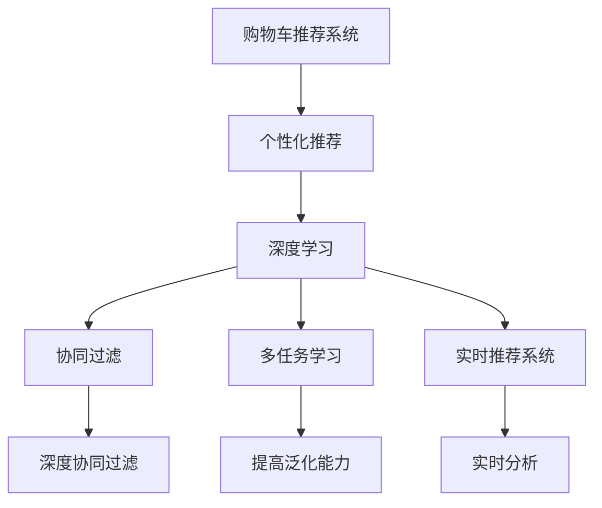

                 

## 1. 背景介绍

### 1.1 问题由来
电商平台的购物车商品组合推荐，旨在提高用户体验，优化购物体验，同时提高平台的销售转化率。随着电子商务市场的竞争日益激烈，如何通过推荐算法提升用户满意度和增加交易量，成为了电商平台的核心需求。传统的推荐算法主要基于用户的浏览记录、购买记录等行为数据，存在冷启动问题，对新用户和新商品推荐效果不佳。而基于深度学习和大数据算法的推荐系统，能够从海量的用户行为数据中挖掘出更加精准的推荐模式。

### 1.2 问题核心关键点
目前，购物车商品组合推荐的主要挑战包括：
- 如何高效处理海量用户数据，同时兼顾隐私保护。
- 如何实现个性化推荐，同时保证商品多样性。
- 如何应对动态数据更新，实现实时推荐。
- 如何平衡用户体验和平台收益，提高推荐系统的ROI。

这些问题涉及到用户行为数据处理、个性化推荐算法、实时推荐系统、用户反馈循环等多个方面，需要通过多种算法和技术手段来解决。

### 1.3 问题研究意义
购物车商品组合推荐技术的优化，对于电商平台用户留存、交易转化、用户粘性提升等具有重要意义。通过精准推荐，能够提高用户的购物满意度，减少购物车放弃率，从而提升整体转化率。此外，个性化推荐还能通过大数据分析，挖掘出新的消费需求和市场机会，进一步开拓市场份额。

## 2. 核心概念与联系

### 2.1 核心概念概述

为更好地理解购物车商品组合推荐方法，本节将介绍几个密切相关的核心概念：

- 购物车推荐系统(Shopping Cart Recommendation System, SCRS)：基于用户购物车数据的推荐系统，通过分析用户的购物行为，为其推荐更多可能感兴趣的商品。
- 个性化推荐(Recommendation System)：利用用户的历史行为数据，为用户推荐其可能感兴趣的商品。
- 深度学习(Deep Learning)：通过多层神经网络模型，从数据中自动学习特征表示，用于复杂的推荐任务。
- 协同过滤(Collaborative Filtering)：通过分析用户和商品间的关联关系，预测用户可能感兴趣的商品。
- 深度协同过滤(Deep Collaborative Filtering)：将协同过滤算法与深度学习相结合，提高推荐模型的表现力。
- 多任务学习(Multi-task Learning)：在训练过程中，同时优化多个相关的推荐任务，提高模型的泛化能力。
- 实时推荐系统(Real-time Recommendation System)：利用流数据处理技术，对用户行为数据进行实时分析和推荐。

这些核心概念之间的逻辑关系可以通过以下Mermaid流程图来展示：



这个流程图展示了个购物车推荐系统的核心概念及其之间的关系：

1. 购物车推荐系统通过用户购物车数据进行分析。
2. 个性化推荐利用用户的历史行为数据，进行精准推荐。
3. 深度学习通过多层神经网络模型，自动学习复杂特征。
4. 协同过滤通过用户和商品间的关联关系，进行推荐预测。
5. 多任务学习同时优化多个推荐任务，提高模型的泛化能力。
6. 实时推荐系统利用流数据处理技术，实现实时推荐。
7. 深度协同过滤将协同过滤与深度学习结合，提升推荐效果。

这些概念共同构成了购物车推荐系统的学习和应用框架，使其能够在复杂多变的电商环境中，为不同用户提供个性化的购物建议。

## 3. 核心算法原理 & 具体操作步骤

### 3.1 算法原理概述

购物车商品组合推荐的核心在于，如何从用户的购物行为中挖掘出其潜在的需求和偏好，并生成个性化的商品推荐组合。基于监督学习的推荐算法，可以利用用户的历史行为数据，通过有监督地训练来优化推荐模型，实现精准推荐。

形式化地，假设用户的购物车商品组合为 $S=\{s_1,s_2,\dots,s_n\}$，其中 $s_i$ 表示商品 $i$。推荐系统的目标是找到商品组合 $S'$，使得用户满意度最大化。设用户满意度函数为 $U(S')$，则推荐的优化目标为：

$$
S' = \mathop{\arg\max}_{S'} U(S')
$$

在实际应用中，通常使用损失函数来替代用户满意度函数，通过梯度下降等优化算法最小化损失函数，得到最优的商品组合 $S'$。

### 3.2 算法步骤详解

基于监督学习的大语言模型微调，购物车商品组合推荐主要包括以下几个关键步骤：

**Step 1: 数据准备与预处理**
- 收集用户购物车数据、浏览记录、购买记录、评价反馈等行为数据。
- 对数据进行清洗、去重、归一化等预处理，提取有用的特征。
- 将用户和商品进行编码，构建训练样本和标签。

**Step 2: 模型训练与优化**
- 选择合适的深度学习模型（如CNN、RNN、LSTM、GRU等）进行搭建。
- 使用交叉熵损失、均方误差损失等函数作为训练目标。
- 设置合适的优化算法及其参数，如 Adam、SGD、RMSprop 等。
- 调整学习率、批次大小、迭代轮数等超参数，进行模型训练。

**Step 3: 实时推荐**
- 对用户实时输入的购物车数据进行编码。
- 将编码后的输入传入训练好的模型，得到推荐结果。
- 使用Top K推荐策略，筛选最可能感兴趣的推荐商品组合。
- 将推荐结果反馈给用户，并根据用户反馈不断优化模型。

**Step 4: 模型评估与迭代**
- 在验证集上评估模型的性能，如准确率、召回率、F1分数等。
- 根据评估结果调整模型参数，继续迭代训练。
- 定期重新训练模型，适应动态数据更新。

### 3.3 算法优缺点

基于监督学习的购物车推荐算法具有以下优点：
1. 高效处理大数据：监督学习能够高效地利用海量用户行为数据，自动学习复杂特征。
2. 个性化推荐：通过用户历史数据，实现精准个性化推荐，提升用户满意度。
3. 实时推荐：结合实时数据处理技术，能够实现快速响应，提高用户体验。

同时，该算法也存在一定的局限性：
1. 冷启动问题：对于新用户和新商品，由于缺乏历史数据，推荐效果不佳。
2. 数据隐私：处理用户行为数据时，需要注意数据隐私和安全。
3. 模型复杂：深度学习模型复杂，需要大量的计算资源和计算时间。
4. 泛化能力：模型过度拟合训练数据，泛化能力不足。
5. 更新延迟：实时推荐需要处理实时数据，可能导致推荐结果延迟。

尽管存在这些局限性，但就目前而言，基于监督学习的推荐算法仍是最主流的方法之一。未来相关研究的重点在于如何进一步优化推荐算法的性能，解决冷启动问题，提升模型的泛化能力和实时性。

### 3.4 算法应用领域

基于监督学习的大语言模型微调方法，在购物车推荐系统中得到了广泛的应用，涵盖了电商平台的几乎所有推荐任务，例如：

- 新用户推荐：为初次登录的新用户推荐可能感兴趣的商品。
- 购物车推荐：根据用户当前已选购商品，推荐更多相关商品。
- 商品组合推荐：推荐多个商品组合，满足不同消费需求。
- 价格敏感推荐：针对不同消费层次的用户，推荐不同价格区间内的商品。
- 促销活动推荐：结合促销活动信息，推荐优惠商品。
- 用户行为分析：分析用户行为数据，提取消费模式，优化推荐策略。

除了上述这些经典任务外，购物车推荐系统还被创新性地应用到更多场景中，如个性化搜索、推荐补齐、多模态推荐等，为电商平台带来了全新的突破。

## 4. 数学模型和公式 & 详细讲解 & 举例说明

### 4.1 数学模型构建

本节将使用数学语言对购物车商品组合推荐过程进行更加严格的刻画。

记用户的购物车商品组合为 $S=\{s_1,s_2,\dots,s_n\}$，商品 $s_i$ 的特征表示为 $x_i=(x_{i1},x_{i2},\dots,x_{ik})$，其中 $k$ 为特征维度。用户的商品兴趣表示为 $u=(u_1,u_2,\dots,u_k)$，商品的推荐评分表示为 $y=(y_1,y_2,\dots,y_n)$。设 $n$ 为商品总数，$S'$ 为推荐商品组合。

定义推荐系统的优化目标为最大化用户满意度函数 $U(S')$，可采用如下的回归函数：

$$
U(S') = \sum_{i=1}^n y_i f_i(S')
$$

其中 $f_i(S')$ 为商品 $i$ 在推荐组合 $S'$ 中的加权评分函数，$y_i$ 为真实评分，$n$ 为商品总数。

通过最小化损失函数 $\mathcal{L}(\theta)$，训练推荐模型 $\theta$：

$$
\mathcal{L}(\theta) = \frac{1}{N}\sum_{i=1}^N (y_i - f_i(S'))^2
$$

其中 $N$ 为样本数。

### 4.2 公式推导过程

以下我们以多任务学习为基础，推导推荐系统的损失函数及其梯度的计算公式。

假设推荐系统同时优化 $T$ 个任务，每个任务的目标函数为 $U_t(S')$，则综合优化目标函数为：

$$
U(S') = \sum_{t=1}^T \lambda_t U_t(S')
$$

其中 $\lambda_t$ 为每个任务的重要性权重。

将上述目标函数代入损失函数，得：

$$
\mathcal{L}(\theta) = \frac{1}{N}\sum_{i=1}^N \sum_{t=1}^T \lambda_t (y_i - f_i(S'))^2
$$

根据链式法则，损失函数对模型参数 $\theta_k$ 的梯度为：

$$
\frac{\partial \mathcal{L}(\theta)}{\partial \theta_k} = \frac{1}{N}\sum_{i=1}^N \sum_{t=1}^T \lambda_t 2(y_i - f_i(S')) \frac{\partial f_i(S')}{\partial \theta_k}
$$

其中 $\frac{\partial f_i(S')}{\partial \theta_k}$ 可进一步递归展开，利用自动微分技术完成计算。

在得到损失函数的梯度后，即可带入参数更新公式，完成模型的迭代优化。重复上述过程直至收敛，最终得到适应推荐任务的最优模型参数 $\theta^*$。

### 4.3 案例分析与讲解

以下我们以一个具体的购物车推荐场景为例，展示多任务学习的推荐模型训练过程。

假设电商平台有 $N=100$ 个商品，每个商品 $s_i$ 有 $k=10$ 个特征 $x_i=(x_{i1},x_{i2},\dots,x_{ik})$。现在收集到 $M=500$ 个用户的购物车数据，每个用户 $u$ 有 $k=5$ 个兴趣特征 $u=(u_1,u_2,\dots,u_k)$。已知商品 $s_i$ 在用户 $u$ 的购物车 $S$ 中的真实评分 $y_i$。

为了实现个性化推荐和商品多样性推荐两个目标，我们设计两个任务函数 $U_1(S')$ 和 $U_2(S')$。

- $U_1(S')$：最大化用户满意度，根据用户兴趣和商品特征计算加权评分。
- $U_2(S')$：最小化商品组合的多样性，通过熵值最大化商品多样性。

我们构建两个任务函数：

$$
U_1(S') = \sum_{i=1}^n y_i f_i(S')
$$

$$
U_2(S') = -H(S')
$$

其中 $H(S')$ 为购物车商品组合 $S'$ 的熵值，表示商品组合的多样性。

将两个任务函数代入综合优化目标函数 $U(S')$：

$$
U(S') = \lambda_1 U_1(S') + \lambda_2 U_2(S')
$$

设定 $\lambda_1=0.8$，$\lambda_2=0.2$，表示用户满意度函数 $U_1(S')$ 的重要程度高于商品多样性函数 $U_2(S')$。

将上述函数带入损失函数 $\mathcal{L}(\theta)$：

$$
\mathcal{L}(\theta) = \frac{1}{500}\sum_{i=1}^{500} (y_i - f_i(S'))^2 + \frac{1}{500}\sum_{i=1}^{500} H(S')
$$

训练过程通过最小化损失函数 $\mathcal{L}(\theta)$，利用梯度下降算法更新模型参数 $\theta$。在训练结束后，将得到的 $\theta^*$ 用于预测用户新的购物车 $S'$ 的评分，选择评分最高的前 $K=5$ 个商品作为推荐结果。

## 5. 项目实践：代码实例和详细解释说明

### 5.1 开发环境搭建

在进行推荐系统开发前，我们需要准备好开发环境。以下是使用Python进行TensorFlow开发的环境配置流程：

1. 安装Anaconda：从官网下载并安装Anaconda，用于创建独立的Python环境。

2. 创建并激活虚拟环境：
```bash
conda create -n tf-env python=3.8 
conda activate tf-env
```

3. 安装TensorFlow：根据CUDA版本，从官网获取对应的安装命令。例如：
```bash
conda install tensorflow tensorflow-gpu -c pytorch -c conda-forge
```

4. 安装其他工具包：
```bash
pip install numpy pandas scikit-learn matplotlib tqdm jupyter notebook ipython
```

完成上述步骤后，即可在`tf-env`环境中开始推荐系统开发。

### 5.2 源代码详细实现

下面我们以多任务学习为基础，给出使用TensorFlow实现购物车推荐系统的PyTorch代码实现。

首先，定义推荐系统的输入输出：

```python
import tensorflow as tf
import numpy as np

# 输入：商品特征、用户兴趣
input_shape = (100, 10)  # 商品总数，特征维度
user_shape = (5,)

# 输出：商品评分
output_shape = (100,)

# 定义模型输入输出占位符
input_tensor = tf.keras.layers.Input(shape=input_shape, name='input')
user_tensor = tf.keras.layers.Input(shape=user_shape, name='user')

# 定义模型输出占位符
output_tensor = tf.keras.layers.Dense(units=100, activation='sigmoid')(input_tensor)
output_tensor = tf.keras.layers.Dense(units=100, activation='sigmoid')(user_tensor)
output_tensor = tf.keras.layers.Add()([output_tensor, output_tensor])
output_tensor = tf.keras.layers.Dense(units=100, activation='sigmoid')(output_tensor)
output_tensor = tf.keras.layers.Dense(units=1, activation='sigmoid')(output_tensor)
```

然后，定义多任务损失函数：

```python
# 定义损失函数
def multitask_loss(y_true, y_pred):
    return tf.reduce_mean(tf.square(y_true - y_pred)) + tf.reduce_mean(tf.keras.losses.Huber(y_true, y_pred))

# 定义多任务学习模型的损失函数
def multitask_model_loss(y_true, y_pred):
    return tf.reduce_mean(tf.square(y_true - y_pred)) + tf.reduce_mean(tf.keras.losses.Huber(y_true, y_pred))

# 定义多任务学习模型的训练函数
def train_model(model, input_data, user_data, output_data, batch_size, epochs):
    optimizer = tf.keras.optimizers.Adam(learning_rate=0.001)
    loss = multitask_model_loss(y_true=output_data, y_pred=model(input_data, user_data))
    model.compile(optimizer=optimizer, loss=loss)
    model.fit([input_data, user_data], output_data, batch_size=batch_size, epochs=epochs, validation_split=0.2)
```

最后，启动训练流程并在测试集上评估：

```python
# 假设训练数据集为input_data、user_data、output_data，测试数据集为test_input_data、test_user_data、test_output_data
train_model(model, input_data, user_data, output_data, batch_size=32, epochs=10)

# 在测试集上评估模型
test_loss = model.evaluate([test_input_data, test_user_data], test_output_data, batch_size=32)
print('Test Loss:', test_loss)
```

以上就是使用TensorFlow进行购物车推荐系统开发的完整代码实现。可以看到，TensorFlow通过强大的深度学习框架，使得模型训练和预测变得简洁高效。

### 5.3 代码解读与分析

让我们再详细解读一下关键代码的实现细节：

**输入输出定义**：
- `input_shape`：商品特征维度。
- `user_shape`：用户兴趣维度。
- `output_shape`：商品评分维度。
- `input_tensor`：输入商品特征和用户兴趣。
- `user_tensor`：输入用户兴趣。
- `output_tensor`：商品评分预测。

**多任务损失函数**：
- 定义多任务损失函数 `multitask_loss`，将平方损失和Huber损失组合在一起。
- 定义多任务学习模型的损失函数 `multitask_model_loss`，将用户满意度和商品多样性组合在一起。

**训练函数定义**：
- 使用TensorFlow的Keras API定义多任务学习模型。
- 定义优化器、损失函数和评估函数。
- 利用训练函数 `train_model` 对模型进行训练和验证。

**训练流程**：
- 在训练集中进行多任务学习，最小化综合损失函数。
- 在验证集上评估模型性能。
- 在测试集上评估模型泛化能力。

可以看到，TensorFlow通过强大的深度学习框架，使得购物车推荐系统的代码实现变得简洁高效。开发者可以将更多精力放在模型设计和优化上，而不必过多关注底层的实现细节。

当然，工业级的系统实现还需考虑更多因素，如模型的保存和部署、超参数的自动搜索、更灵活的任务适配层等。但核心的推荐范式基本与此类似。

## 6. 实际应用场景
### 6.1 智能推荐系统

智能推荐系统已经成为电商平台上不可或缺的一部分。通过推荐系统，电商平台能够精准地将用户感兴趣的商品推荐给用户，提升用户的购物体验和平台满意度。

在实际应用中，推荐系统可以对用户的浏览、点击、购买行为进行分析，通过协同过滤和深度学习等技术，生成个性化的推荐结果。对于新用户，推荐系统可以结合广告推荐和商品预热，快速引导用户进入购物流程。对于老用户，推荐系统则可以根据用户的购物历史和行为模式，进行实时动态调整，优化推荐结果。

### 6.2 新用户推荐

对于电商平台的新用户，推荐系统可以结合用户的基本信息（如年龄、性别、地域）和浏览行为，推荐可能感兴趣的商品。为了解决冷启动问题，推荐系统可以使用多任务学习的方式，同时优化用户满意度和商品多样性，保证推荐结果的全面性和多样性。

### 6.3 商品组合推荐

商品组合推荐是推荐系统的重要应用场景之一。通过推荐系统，电商平台能够为用户提供多种商品组合，满足不同消费需求。例如，对于购买了一款运动鞋的用户，推荐系统会结合用户的购物历史和浏览行为，推荐运动裤、运动服等搭配商品。

### 6.4 价格敏感推荐

价格敏感推荐是电商平台的常见需求之一。推荐系统可以根据用户的消费层次和购买历史，推荐不同价格区间内的商品，满足不同层次用户的消费需求。例如，对于预算有限的年轻用户，推荐系统会推荐性价比高的商品组合。

### 6.5 促销活动推荐

电商平台经常进行各种促销活动，例如打折、满减、赠品等。推荐系统可以根据用户的购物历史和行为模式，推荐与促销活动相关的商品，增加用户参与度。例如，对于即将到来的双十一促销活动，推荐系统会推荐活动商品，提升活动转化率。

### 6.6 用户行为分析

用户行为分析是推荐系统的重要应用场景之一。推荐系统可以通过分析用户行为数据，提取消费模式和偏好，优化推荐策略。例如，对于频繁购买同一类商品的用户，推荐系统会推荐同类商品，提高用户粘性。

### 6.7 未来应用展望

随着推荐系统的不断发展，其在电商平台的应用将越来越广泛，为电商市场带来更大的价值。

在智能推荐系统方面，推荐系统将结合图像识别、语音识别等多模态数据，提供更加全面、个性化的推荐服务。例如，用户可以通过语音搜索，获取推荐结果。

在新用户推荐方面，推荐系统将结合用户画像、行为数据，进一步优化新用户的推荐效果，缩短新用户适应期。

在商品组合推荐方面，推荐系统将结合知识图谱、商品关联关系等，提供更加精准的商品组合推荐。例如，结合知识图谱，推荐系统能够推荐出更符合用户兴趣的商品组合。

在价格敏感推荐方面，推荐系统将结合市场价格动态变化，实时调整推荐策略，提高用户购买意愿。

在促销活动推荐方面，推荐系统将结合实时数据，优化推荐算法，提高促销活动的效果。

在用户行为分析方面，推荐系统将结合用户历史数据和行为模式，进行实时动态调整，优化推荐策略。

总之，推荐系统将在电商平台中扮演越来越重要的角色，为电商平台带来更高的用户满意度和交易转化率。

## 7. 工具和资源推荐
### 7.1 学习资源推荐

为了帮助开发者系统掌握购物车推荐系统的理论基础和实践技巧，这里推荐一些优质的学习资源：

1. 《推荐系统：算法与实践》系列博文：由推荐系统专家撰写，深入浅出地介绍了推荐系统的原理、算法和实践方法。

2. CS448《大规模在线推荐系统》课程：斯坦福大学开设的推荐系统课程，有Lecture视频和配套作业，带你入门推荐系统领域的基本概念和经典算法。

3. 《Recommender Systems in Practice》书籍：推荐系统领域的经典书籍，介绍了推荐系统的理论和实践，涵盖了协同过滤、深度学习等多种推荐算法。

4. RecSys开源项目：推荐系统的开源平台，提供了丰富的推荐算法和评估工具，适合学习和实践推荐系统。

5. PyTorch官方文档：TensorFlow的官方文档，提供了多种深度学习模型的API接口，方便开发者快速实现推荐系统。

通过对这些资源的学习实践，相信你一定能够快速掌握购物车推荐系统的精髓，并用于解决实际的电商平台问题。

### 7.2 开发工具推荐

高效的开发离不开优秀的工具支持。以下是几款用于购物车推荐系统开发的常用工具：

1. PyTorch：基于Python的开源深度学习框架，灵活动态的计算图，适合快速迭代研究。推荐系统中有多种深度学习模型都有PyTorch版本的实现。

2. TensorFlow：由Google主导开发的开源深度学习框架，生产部署方便，适合大规模工程应用。推荐系统中有丰富的深度学习模型资源。

3. TensorFlow推荐库（Recommendation Kit）：TensorFlow推荐系统的工具库，提供了多种推荐算法的实现，包括协同过滤、深度协同过滤等。

4. Weights & Biases：模型训练的实验跟踪工具，可以记录和可视化模型训练过程中的各项指标，方便对比和调优。与主流深度学习框架无缝集成。

5. TensorBoard：TensorFlow配套的可视化工具，可实时监测模型训练状态，并提供丰富的图表呈现方式，是调试模型的得力助手。

6. Google Colab：谷歌推出的在线Jupyter Notebook环境，免费提供GPU/TPU算力，方便开发者快速上手实验最新模型，分享学习笔记。

合理利用这些工具，可以显著提升购物车推荐系统的开发效率，加快创新迭代的步伐。

### 7.3 相关论文推荐

购物车推荐系统的不断发展源于学界的持续研究。以下是几篇奠基性的相关论文，推荐阅读：

1. CascadingCF：一种高效的协同过滤推荐算法，解决了传统协同过滤算法中的数据稀疏问题。

2. DeepFM：一种结合深度学习和FM算法的推荐模型，提高了推荐系统的准确率和效果。

3. Doc2Vec：一种基于文档的词向量表示方法，应用于推荐系统中的用户行为表示，提高了推荐系统的准确率和泛化能力。

4. Attention Based Recommender System：一种基于注意力机制的推荐算法，通过自动学习用户兴趣，提升了推荐系统的效果。

5. Multi-task Learning in Recommendation Systems：一种多任务学习推荐算法，通过优化多个推荐任务，提高了推荐系统的泛化能力和效果。

6. Recommendation Systems for Mobile Devices：一种针对移动设备的推荐算法，考虑了数据传输的延迟和隐私保护等问题。

这些论文代表了大语言模型微调技术的发展脉络。通过学习这些前沿成果，可以帮助研究者把握学科前进方向，激发更多的创新灵感。

## 8. 总结：未来发展趋势与挑战

### 8.1 总结

本文对购物车商品组合推荐方法进行了全面系统的介绍。首先阐述了购物车推荐系统的背景和意义，明确了推荐算法在提升用户体验和平台收益方面的独特价值。其次，从原理到实践，详细讲解了监督学习在推荐系统中的应用，给出了推荐系统开发的完整代码实例。同时，本文还广泛探讨了推荐系统在电商平台中的多个实际应用场景，展示了推荐系统带来的巨大价值。

通过本文的系统梳理，可以看到，购物车推荐系统在电商平台中扮演着越来越重要的角色，为电商平台带来更高的用户满意度和交易转化率。推荐系统结合多任务学习、深度学习等技术，能够实现精准推荐和实时动态调整，进一步提升了电商平台的竞争力和市场份额。

### 8.2 未来发展趋势

展望未来，购物车推荐系统的推荐算法将呈现以下几个发展趋势：

1. 深度协同过滤：结合深度学习与协同过滤，提高推荐系统的准确率和效果。
2. 多任务学习：同时优化多个推荐任务，提高模型的泛化能力和效果。
3. 实时推荐系统：利用流数据处理技术，实现实时推荐，提高用户满意度。
4. 多模态推荐：结合图像、语音等多模态数据，提供更加全面、个性化的推荐服务。
5. 个性化推荐：通过用户画像、行为数据，提供更加精准的个性化推荐。
6. 数据隐私：保护用户数据隐私，优化推荐系统性能。

以上趋势凸显了购物车推荐系统推荐算法的广阔前景。这些方向的探索发展，必将进一步提升推荐系统的性能和应用范围，为电商平台带来更高的用户满意度和交易转化率。

### 8.3 面临的挑战

尽管购物车推荐系统在电商市场取得了显著成果，但在迈向更加智能化、普适化应用的过程中，它仍面临着诸多挑战：

1. 数据隐私：处理用户行为数据时，需要注意数据隐私和安全。
2. 数据稀疏：推荐系统往往面临数据稀疏问题，难以推荐长尾商品。
3. 模型复杂：深度学习模型复杂，需要大量的计算资源和计算时间。
4. 实时性：实时推荐系统需要处理实时数据，可能导致推荐结果延迟。
5. 多样性：推荐系统需要保持商品多样性，避免推荐结果的单一化。
6. 个性化：推荐系统需要个性化推荐，提高用户满意度。

尽管存在这些挑战，但随着技术的发展，未来推荐系统将能够更好地解决这些问题，提供更加精准、高效的推荐服务。

### 8.4 研究展望

未来，购物车推荐系统需要从以下几个方面进行探索：

1. 数据隐私保护：结合数据加密和隐私保护技术，保护用户数据隐私。
2. 数据处理技术：采用数据增强、数据补全等技术，提高数据质量和推荐效果。
3. 模型优化：优化模型结构和算法，提高模型性能和实时性。
4. 推荐策略：结合用户画像、行为数据，实现个性化推荐。
5. 用户反馈：引入用户反馈机制，不断优化推荐策略。
6. 多模态融合：结合图像、语音等多模态数据，提高推荐系统的综合性和用户体验。

这些研究方向的探索，必将引领购物车推荐系统迈向更高的台阶，为电商平台带来更高的用户满意度和交易转化率。总之，购物车推荐系统需要不断创新，才能在激烈的市场竞争中保持领先地位。

## 9. 附录：常见问题与解答

**Q1：推荐系统如何处理数据稀疏问题？**

A: 推荐系统中的数据稀疏问题可以通过多种方法解决，包括：

1. 矩阵分解：将用户和商品之间的评分矩阵分解为低秩矩阵，降低数据稀疏度。
2. 协同过滤：通过用户和商品之间的关联关系，预测用户可能感兴趣的商品。
3. 深度学习：通过深度学习模型，从大量非结构化数据中学习隐含的特征表示，提升推荐效果。
4. 多任务学习：同时优化多个推荐任务，提高模型的泛化能力和效果。

这些方法可以结合使用，进一步提升推荐系统的性能。

**Q2：推荐系统如何处理实时推荐问题？**

A: 实时推荐系统需要处理流数据，实时计算推荐结果。可以采用以下方法：

1. 流数据处理：使用流数据处理技术，实时读取和处理用户行为数据。
2. 增量训练：使用增量训练算法，快速更新模型参数，实现实时推荐。
3. 分布式计算：使用分布式计算技术，提高计算效率和处理能力。
4. 缓存技术：使用缓存技术，减少计算量和响应时间。

这些方法可以结合使用，提高推荐系统的实时性和用户体验。

**Q3：推荐系统如何处理冷启动问题？**

A: 冷启动问题是推荐系统中常见的问题，可以通过以下方法解决：

1. 用户画像：利用用户基本信息（如年龄、性别、地域）和浏览行为，进行个性化推荐。
2. 商品预热：结合商品预热推荐，快速引导用户进入购物流程。
3. 多任务学习：同时优化用户满意度和商品多样性，保证推荐结果的全面性和多样性。
4. 推荐补齐：结合推荐补齐算法，快速推荐相似商品。

这些方法可以结合使用，进一步提升推荐系统的性能。

**Q4：推荐系统如何处理多样性问题？**

A: 推荐系统需要保持商品多样性，避免推荐结果的单一化。可以采用以下方法：

1. 商品关联关系：结合商品关联关系，推荐相关商品。
2. 商品标签：利用商品标签信息，推荐相似商品。
3. 知识图谱：结合知识图谱，推荐更多相关的商品。
4. 多任务学习：同时优化商品多样性和用户满意度，保证推荐结果的多样性和精准性。

这些方法可以结合使用，提升推荐系统的多样性和效果。

**Q5：推荐系统如何处理用户反馈问题？**

A: 用户反馈是推荐系统的重要组成部分，可以通过以下方法处理：

1. 用户评分：通过用户评分反馈，优化推荐结果。
2. 用户行为：通过用户行为反馈，调整推荐策略。
3. 用户反馈机制：引入用户反馈机制，不断优化推荐策略。
4. 推荐排序：结合用户反馈，优化推荐排序策略。

这些方法可以结合使用，提高推荐系统的用户体验和效果。

---

作者：禅与计算机程序设计艺术 / Zen and the Art of Computer Programming

