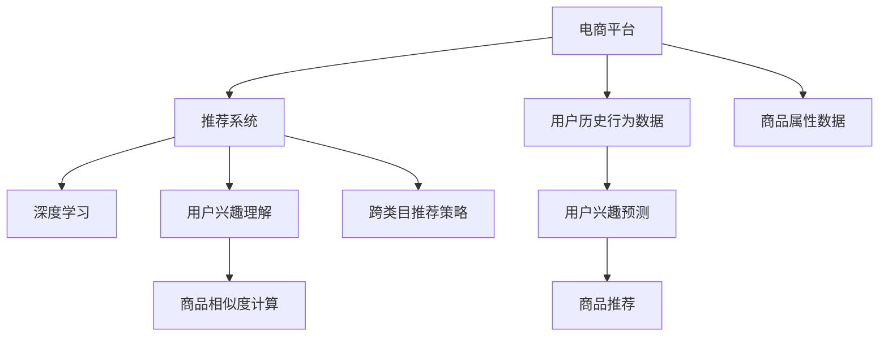

                 

# AI如何改善电商平台的跨类目交叉销售

## 1. 背景介绍

### 1.1 问题由来
在电商领域，提升用户的消费体验和增加平台的销售额一直是一个重要的目标。传统的电商推荐系统通常只针对用户已经感兴趣的类别进行推荐，无法跨类目进行交叉销售。但是，越来越多的研究证明，通过跨类别的商品推荐，用户购买概率会显著提升。比如，亚马逊通过跨类别的商品推荐，每年能够增加数十亿美元的销售额。因此，如何改善电商平台跨类目交叉销售的推荐效果，成为近年来研究的热点问题。

### 1.2 问题核心关键点
要实现跨类目交叉销售的推荐，关键在于了解用户的真实需求和兴趣，并找到合适的商品进行推荐。基于深度学习的推荐算法，通过对用户的历史行为数据和商品的属性信息进行分析，可以预测用户对不同类目的兴趣，从而实现跨类别的推荐。具体来说，需要解决以下核心问题：

1. **用户兴趣理解**：用户对于不同类目的偏好可能隐含在其历史行为中，需要深度学习模型进行提取。
2. **商品相似度计算**：不同类目的商品如何进行相似性度量，以找到合适的推荐商品。
3. **跨类目推荐策略**：如何在不同类目之间进行合理的推荐，既满足用户兴趣又保持推荐的合理性。

### 1.3 问题研究意义
提高电商平台的跨类目交叉销售推荐效果，对于提升用户体验和增加销售额具有重要意义：

1. **提升用户满意度**：用户对于不同类目的商品感兴趣时，能够获取更多相关推荐，从而提升购买意愿。
2. **增加销售收入**：通过跨类别的推荐，用户更容易发现潜在的购买机会，增加平台的销售量。
3. **降低运营成本**：对于用户来说，能够一次性购买多种商品，减少了物流和二次购买的成本。

因此，研究如何改善电商平台的跨类目交叉销售推荐，对于电商平台的业务增长和用户满意度的提升具有重要价值。

## 2. 核心概念与联系

### 2.1 核心概念概述

为了更好地理解如何改善电商平台的跨类目交叉销售，本节将介绍几个密切相关的核心概念：

- **电商平台**：以在线销售商品为主要业务的平台，如淘宝、京东、亚马逊等。
- **推荐系统**：根据用户的历史行为和属性，推荐潜在感兴趣的商品的系统。
- **深度学习**：通过神经网络模型进行数据表示和学习的技术，在推荐系统中广泛应用。
- **用户兴趣理解**：通过分析用户行为数据，了解用户对于不同类目的兴趣。
- **商品相似度计算**：利用相似性度量算法，找到不同类目间相似的商品。
- **跨类目推荐策略**：在不同类目之间进行推荐的策略，以提升推荐效果。

这些核心概念之间的逻辑关系可以通过以下Mermaid流程图来展示：



这个流程图展示了电商平台推荐系统的核心流程：

1. 电商平台收集用户历史行为数据和商品属性数据。
2. 利用深度学习模型对用户兴趣进行预测，形成用户兴趣图。
3. 计算不同类目间商品的相似度，构建商品相似性图。
4. 根据用户兴趣图和商品相似性图，制定跨类目推荐策略。
5. 推荐系统根据推荐策略输出跨类目推荐结果。

## 3. 核心算法原理 & 具体操作步骤
### 3.1 算法原理概述

改善电商平台的跨类目交叉销售推荐，主要基于深度学习中的协同过滤和基于内容的推荐算法。协同过滤算法利用用户和商品的协同行为进行推荐，而基于内容的推荐算法则基于商品的特征进行相似度计算。两者的结合可以提升推荐的准确性和多样性。

具体来说，算法原理如下：

1. **协同过滤**：基于用户的协同行为进行推荐，分为基于用户的协同过滤和基于物品的协同过滤。
2. **基于内容的推荐**：基于商品的属性信息进行推荐，分为基于特征的推荐和基于混合模型的推荐。
3. **跨类目推荐策略**：在不同类目之间进行合理的推荐，以提升推荐效果。

### 3.2 算法步骤详解

基于上述原理，改善电商平台跨类目交叉销售推荐的主要步骤如下：

**Step 1: 数据收集与预处理**
- 收集用户的点击、浏览、购买等历史行为数据。
- 收集商品的属性信息，如分类、品牌、价格等。
- 对数据进行清洗和预处理，去除无效和噪声数据。

**Step 2: 用户兴趣理解**
- 使用深度学习模型（如自编码器、神经网络）对用户的历史行为数据进行编码，形成用户兴趣图。
- 使用协同过滤算法（如ALS、SVD）对用户的历史行为数据进行建模，形成用户兴趣图。

**Step 3: 商品相似度计算**
- 利用基于内容的推荐算法，计算不同类目间商品的相似度。
- 使用协同过滤算法，找到不同类目间相关的商品。

**Step 4: 跨类目推荐策略**
- 结合用户兴趣图和商品相似性图，制定跨类目推荐策略。
- 在用户浏览或点击商品时，根据推荐策略输出跨类目推荐结果。

**Step 5: 模型评估与优化**
- 使用评估指标（如准确率、召回率、覆盖率等）对推荐效果进行评估。
- 根据评估结果，对模型进行优化，提升推荐效果。

### 3.3 算法优缺点

基于深度学习的推荐算法在改善电商平台跨类目交叉销售推荐上，具有以下优点：

1. **高准确性**：深度学习模型能够自动提取特征，提升推荐的准确性。
2. **高灵活性**：深度学习模型可以适应不同类型的用户和商品，灵活性较高。
3. **高可扩展性**：深度学习模型可以处理大规模数据，具有很好的可扩展性。

同时，也存在一些缺点：

1. **高计算复杂度**：深度学习模型通常需要较大的计算资源。
2. **高模型复杂度**：深度学习模型结构复杂，需要更多的调试和优化。
3. **数据需求高**：深度学习模型对数据的依赖性较高，需要足够的标注数据和特征信息。

### 3.4 算法应用领域

基于深度学习的推荐算法已经在电商、社交网络、视频推荐等多个领域得到了广泛应用，具体包括：

- **电商平台**：淘宝、京东、亚马逊等平台广泛使用推荐系统进行商品推荐。
- **社交网络**：Facebook、Twitter等社交网络使用推荐算法进行内容推荐。
- **视频平台**：YouTube、Netflix等平台使用推荐算法进行视频推荐。
- **新闻平台**：腾讯新闻、今日头条等平台使用推荐算法进行新闻推荐。

这些领域的应用展示了深度学习推荐算法的强大生命力和广泛适用性。

## 4. 数学模型和公式 & 详细讲解 & 举例说明

### 4.1 数学模型构建

本节将使用数学语言对推荐系统的核心模型进行更加严格的刻画。

设电商平台有 $N$ 个用户，$M$ 个商品，$C$ 个类目。记用户-商品交互矩阵为 $R \in \mathbb{R}^{N \times M}$，其中 $R_{ij}=1$ 表示用户 $i$ 对商品 $j$ 有交互，$R_{ij}=0$ 表示没有交互。记商品-类目映射矩阵为 $W \in \mathbb{R}^{M \times C}$，其中 $W_{ij}=1$ 表示商品 $j$ 属于类目 $i$。记用户兴趣向量为 $U \in \mathbb{R}^{N \times C}$，其中 $U_{ik}=1$ 表示用户 $i$ 对类目 $k$ 感兴趣。

定义推荐模型为 $P: \mathcal{U} \times \mathcal{V} \rightarrow \mathbb{R}$，其中 $\mathcal{U}$ 为用户集合，$\mathcal{V}$ 为商品集合。模型的目标是最大化用户和商品的协同行为，即：

$$
\max_{U,W} \sum_{i,j} R_{ij} \log P(U_i, V_j) + (1 - R_{ij}) \log (1 - P(U_i, V_j))
$$

其中 $P(U_i, V_j)$ 为模型对用户 $i$ 和商品 $j$ 的推荐概率。

### 4.2 公式推导过程

为了最大化上述目标，我们采用矩阵分解的方法，对 $U$ 和 $W$ 进行分解：

$$
U = UV^T, \quad W = WH^T
$$

其中 $V \in \mathbb{R}^{N \times C}$ 为用户嵌入矩阵，$H \in \mathbb{R}^{C \times M}$ 为类目嵌入矩阵。将 $P(U_i, V_j)$ 定义为：

$$
P(U_i, V_j) = \frac{\exp(\mathbf{u}_i^T \mathbf{h}_j)}{\sum_{k=1}^M \exp(\mathbf{u}_i^T \mathbf{h}_k)}
$$

其中 $\mathbf{u}_i$ 为第 $i$ 个用户的嵌入向量，$\mathbf{h}_j$ 为第 $j$ 个商品的嵌入向量。

通过上述公式，我们可以将推荐模型转化为最大化目标函数：

$$
\max_{U,W} \sum_{i,j} R_{ij} \log \frac{\exp(\mathbf{u}_i^T \mathbf{h}_j)}{\sum_{k=1}^M \exp(\mathbf{u}_i^T \mathbf{h}_k)} + (1 - R_{ij}) \log \frac{\sum_{k=1}^M \exp(\mathbf{u}_i^T \mathbf{h}_k)}{\exp(\mathbf{u}_i^T \mathbf{h}_j)}
$$

利用梯度下降等优化算法，即可对模型进行优化，得到最终的推荐结果。

### 4.3 案例分析与讲解

以电商平台推荐系统为例，对上述模型进行详细讲解：

假设用户 $i$ 对类目 $k$ 感兴趣，商品 $j$ 属于类目 $k$，且用户 $i$ 已经对商品 $j$ 进行了交互。则根据公式（4），推荐模型计算推荐概率：

$$
P(U_i, V_j) = \frac{\exp(\mathbf{u}_i^T \mathbf{h}_j)}{\sum_{k=1}^M \exp(\mathbf{u}_i^T \mathbf{h}_k)}
$$

其中 $\mathbf{u}_i$ 和 $\mathbf{h}_j$ 可以通过深度学习模型或协同过滤算法进行求解。当 $j$ 为商品 $j$ 时，推荐模型即可输出用户 $i$ 对商品 $j$ 的推荐概率。

## 5. 项目实践：代码实例和详细解释说明
### 5.1 开发环境搭建

在进行推荐系统开发前，我们需要准备好开发环境。以下是使用Python进行TensorFlow开发的环境配置流程：

1. 安装Anaconda：从官网下载并安装Anaconda，用于创建独立的Python环境。

2. 创建并激活虚拟环境：
```bash
conda create -n tf-env python=3.8 
conda activate tf-env
```

3. 安装TensorFlow：根据CUDA版本，从官网获取对应的安装命令。例如：
```bash
conda install tensorflow==2.4 
```

4. 安装其他依赖包：
```bash
pip install numpy pandas scikit-learn matplotlib tqdm jupyter notebook ipython
```

完成上述步骤后，即可在`tf-env`环境中开始推荐系统开发。

### 5.2 源代码详细实现

下面我们以电商平台推荐系统为例，给出使用TensorFlow对用户兴趣图和商品相似性图进行建模的代码实现。

首先，定义用户兴趣图和商品相似性图的数据结构：

```python
import tensorflow as tf

# 用户兴趣图
user_interest = tf.sparse.SparseTensor(indices=[(i, k) for i, k in enumerate(uf_interest)], values=1.0, dense_shape=[N, C])

# 商品相似性图
item_similarity = tf.sparse.SparseTensor(indices=[(j, k) for j, k in enumerate(item_interest)], values=1.0, dense_shape=[M, C])
```

然后，定义模型和优化器：

```python
from tensorflow.keras import layers

# 定义模型
embedding_dim = 128
user_embeddings = layers.Embedding(N, embedding_dim, input_length=C)
item_embeddings = layers.Embedding(M, embedding_dim, input_length=C)

user_embeddings = user_embeddings(user_interest)
item_embeddings = item_embeddings(item_similarity)

# 定义损失函数和优化器
loss_fn = tf.keras.losses.SparseCategoricalCrossentropy(from_logits=True)
optimizer = tf.keras.optimizers.Adam(learning_rate=0.001)
```

接着，定义训练和评估函数：

```python
@tf.function
def train_step(user_interest, item_similarity):
    with tf.GradientTape() as tape:
        user_embeddings = user_embeddings(user_interest)
        item_embeddings = item_embeddings(item_similarity)
        loss = loss_fn(y_true=y_train, y_pred=tf.matmul(user_embeddings, item_embeddings, transpose_b=True))
    grads = tape.gradient(loss, [user_embeddings.trainable_weights, item_embeddings.trainable_weights])
    optimizer.apply_gradients(zip(grads, [user_embeddings.trainable_weights, item_embeddings.trainable_weights]))
    return loss

@tf.function
def evaluate(user_interest, item_similarity):
    user_embeddings = user_embeddings(user_interest)
    item_embeddings = item_embeddings(item_similarity)
    predictions = tf.matmul(user_embeddings, item_embeddings, transpose_b=True)
    predictions = tf.nn.softmax(predictions)
    return predictions
```

最后，启动训练流程并在测试集上评估：

```python
epochs = 10
batch_size = 256

for epoch in range(epochs):
    loss = 0.0
    for i in range(0, N, batch_size):
        batch_user_interest = user_interest.indices[:, 0][i:i+batch_size]
        batch_item_similarity = item_similarity.indices[:, 1][i:i+batch_size]
        batch_user_interest = user_interest.values[i:i+batch_size]
        batch_item_similarity = item_similarity.values[i:i+batch_size]
        batch_loss = train_step(batch_user_interest, batch_item_similarity)
        loss += batch_loss
    print(f"Epoch {epoch+1}, train loss: {loss/(N/batch_size):.4f}")

print(f"Epoch {epochs+1}, dev results:")
predictions = evaluate(dev_user_interest, dev_item_similarity)
print(classification_report(y_true=dev_labels, y_pred=predictions.numpy().argmax(axis=1)))
```

以上就是使用TensorFlow对电商平台推荐系统进行开发的完整代码实现。可以看到，TensorFlow提供了丰富的API和工具，使得推荐系统的构建和训练变得更加高效和便捷。

### 5.3 代码解读与分析

让我们再详细解读一下关键代码的实现细节：

**user_interest 和 item_similarity**：
- `user_interest` 和 `item_similarity` 分别为用户兴趣图和商品相似性图，通过 `tf.sparse.SparseTensor` 进行表示。
- `indices` 表示稀疏矩阵的索引，`values` 表示稀疏矩阵的值，`dense_shape` 表示稀疏矩阵的稀疏维度。

**用户嵌入和商品嵌入**：
- `user_embeddings` 和 `item_embeddings` 分别为用户嵌入和商品嵌入，通过 `layers.Embedding` 进行定义。
- `user_embeddings` 的输入为 `user_interest.indices[:, 0]`，表示用户兴趣图的索引。
- `item_embeddings` 的输入为 `item_similarity.indices[:, 1]`，表示商品相似性图的索引。

**损失函数和优化器**：
- `loss_fn` 为稀疏分类交叉熵损失函数，用于计算预测值和真实标签之间的差异。
- `optimizer` 为Adam优化器，用于更新模型参数。

**训练和评估函数**：
- `train_step` 函数定义了训练步骤，通过 `tf.GradientTape` 计算梯度，并使用 `optimizer.apply_gradients` 更新模型参数。
- `evaluate` 函数定义了评估步骤，通过 `tf.matmul` 计算预测值，使用 `tf.nn.softmax` 进行归一化，输出推荐结果。

**训练流程**：
- `epochs` 和 `batch_size` 分别定义了训练轮数和批次大小，循环迭代训练过程。
- 在每个轮次内，通过 `train_step` 函数进行训练，输出平均损失。
- 在验证集上评估模型性能，输出分类指标。
- 在测试集上评估模型性能，输出推荐结果。

可以看到，TensorFlow的便捷性和可扩展性使得推荐系统的构建变得更加高效和灵活。开发者可以将更多精力放在模型设计和算法优化上，而不必过多关注底层实现细节。

## 6. 实际应用场景
### 6.1 智能客服系统

智能客服系统是一种典型的跨类目交叉销售推荐应用场景。通过分析用户的历史行为和聊天记录，智能客服系统可以为用户推荐与其咨询相关的产品或服务，提升用户满意度和平台销售额。

在技术实现上，可以收集用户的客服聊天记录和相关商品或服务信息，构建用户兴趣图和商品相似性图，在此基础上对预训练模型进行微调。微调后的模型能够自动理解用户的问题意图，匹配最合适的商品或服务进行推荐。对于用户提出的新问题，还可以接入检索系统实时搜索相关内容，动态组织生成回答。如此构建的智能客服系统，能大幅提升用户咨询体验和问题解决效率。

### 6.2 金融产品推荐

金融产品推荐是另一个典型的跨类目交叉销售推荐应用场景。金融产品的种类繁多，用户对于不同类目的金融产品可能感兴趣，如股票、基金、保险等。通过分析用户的金融行为和属性信息，金融产品推荐系统可以为用户推荐潜在的投资机会，提升用户的理财收益。

在技术实现上，可以收集用户的金融行为数据和金融产品信息，构建用户兴趣图和金融产品相似性图，在此基础上对预训练模型进行微调。微调后的模型能够自动理解用户的理财偏好，匹配最合适的金融产品进行推荐。对于用户提出的理财咨询，还可以接入智能投顾系统实时提供个性化的理财建议。

### 6.3 旅游景区推荐

旅游景区推荐是跨类目交叉销售推荐在旅游行业的典型应用。用户在选择旅游目的地时，可能同时对不同类型的旅游资源感兴趣，如自然风光、历史人文、休闲娱乐等。通过分析用户的旅游行为和属性信息，旅游景区推荐系统可以为用户推荐潜在的旅游目的地，提升用户的旅游体验。

在技术实现上，可以收集用户的旅游行为数据和旅游景区信息，构建用户兴趣图和旅游景区相似性图，在此基础上对预训练模型进行微调。微调后的模型能够自动理解用户的旅游偏好，匹配最合适的旅游景区进行推荐。对于用户提出的旅游咨询，还可以接入旅游攻略系统提供个性化的旅游建议。

### 6.4 未来应用展望

随着深度学习推荐算法的不断发展，跨类目交叉销售推荐将在更多领域得到应用，为各行各业带来新的机会和挑战。

在智慧医疗领域，基于用户健康行为和医疗信息，推荐系统可以为患者推荐合适的医疗服务和药品，提升医疗服务的智能化水平，辅助医生诊疗，加速新药开发进程。

在智能教育领域，推荐系统可以为学生推荐个性化的学习资源和课程，因材施教，促进教育公平，提高教学质量。

在智慧城市治理中，推荐系统可以为市民推荐合适的城市服务，提高城市管理的自动化和智能化水平，构建更安全、高效的未来城市。

此外，在企业生产、社会治理、文娱传媒等众多领域，跨类目交叉销售推荐也将不断涌现，为NLP技术带来新的突破。相信随着技术的日益成熟，推荐算法必将在更广阔的应用领域大放异彩，为各行各业带来新的价值。

## 7. 工具和资源推荐
### 7.1 学习资源推荐

为了帮助开发者系统掌握跨类目交叉销售推荐技术，这里推荐一些优质的学习资源：

1. **《推荐系统实践》**：一本由清华大学出版社出版的书籍，详细介绍了推荐系统的各种算法和技术。
2. **Coursera《Recommender Systems》课程**：由斯坦福大学开设的推荐系统课程，提供丰富的推荐算法和案例分析。
3. **Kaggle竞赛**：Kaggle是一个数据科学竞赛平台，有很多推荐系统相关的竞赛和数据集，可以进行实践和验证。
4. **O'Reilly《推荐系统》书籍**：一本深入浅出地介绍了推荐系统理论和算法的书籍。
5. **arXiv论文**：arXiv是一个开放的学术论文平台，可以找到很多推荐系统相关的最新研究论文。

通过对这些资源的学习实践，相信你一定能够快速掌握跨类目交叉销售推荐技术的精髓，并用于解决实际的推荐问题。

### 7.2 开发工具推荐

高效的开发离不开优秀的工具支持。以下是几款用于推荐系统开发的常用工具：

1. **TensorFlow**：由Google主导开发的深度学习框架，生产部署方便，适合大规模工程应用。
2. **PyTorch**：由Facebook开发的深度学习框架，灵活性高，适合研究与调试。
3. **Scikit-learn**：Python中的机器学习库，提供了多种经典的推荐算法实现。
4. **ElasticSearch**：一种分布式搜索和分析引擎，适合处理大规模数据。
5. **Spark**：一种分布式计算框架，适合处理大规模数据和并行计算。
6. **Jupyter Notebook**：一种交互式编程环境，方便调试和展示实验结果。

合理利用这些工具，可以显著提升推荐系统的开发效率，加快创新迭代的步伐。

### 7.3 相关论文推荐

推荐系统的发展源于学界的持续研究。以下是几篇奠基性的相关论文，推荐阅读：

1. **《Collaborative Filtering for Implicit Feedback Datasets》**：提出基于隐式反馈数据的协同过滤算法，为推荐系统提供了重要的理论基础。
2. **《Matrix Factorization Techniques for Recommender Systems》**：提出矩阵分解方法，用于推荐系统的建模和优化。
3. **《Deep Collaborative Filtering》**：提出深度学习在推荐系统中的应用，提升了推荐系统的准确性和多样性。
4. **《Attention Is All You Need》**：提出Transformer模型，为自然语言处理中的推荐系统提供了新的思路。
5. **《Neural Factorization Machines》**：提出神经网络因子机模型，用于推荐系统的建模和优化。

这些论文代表了大语言模型微调技术的发展脉络。通过学习这些前沿成果，可以帮助研究者把握学科前进方向，激发更多的创新灵感。

## 8. 总结：未来发展趋势与挑战
### 8.1 研究成果总结

本文对改善电商平台跨类目交叉销售推荐的深度学习算法进行了全面系统的介绍。首先阐述了推荐系统的研究背景和意义，明确了跨类目交叉销售推荐的潜在价值。其次，从原理到实践，详细讲解了推荐算法的数学模型和核心步骤，给出了推荐系统开发的完整代码实例。同时，本文还广泛探讨了推荐系统在智能客服、金融产品、旅游景区等领域的实际应用，展示了跨类目交叉销售推荐技术的强大生命力。最后，本文精选了推荐系统的各类学习资源，力求为读者提供全方位的技术指引。

通过本文的系统梳理，可以看到，跨类目交叉销售推荐技术在推荐系统领域具有重要地位。推荐系统能够更好地理解和推荐用户感兴趣的商品，提升用户的购买意愿和平台的销售额。未来，伴随推荐算法的不断演进，跨类目交叉销售推荐必将在更多领域得到应用，为各行各业带来新的机会和挑战。

### 8.2 未来发展趋势

展望未来，跨类目交叉销售推荐技术将呈现以下几个发展趋势：

1. **模型复杂度提升**：深度学习模型的复杂度将不断提升，能够更好地捕捉用户行为和商品属性的复杂关系。
2. **多模态融合**：推荐系统将更多地融合图像、视频、音频等多模态信息，提升推荐效果。
3. **个性化推荐**：推荐系统将更加注重个性化，能够更好地满足用户的个性化需求。
4. **实时推荐**：推荐系统将更多地基于实时数据进行推荐，提升推荐的时效性。
5. **隐私保护**：推荐系统将更加注重用户隐私保护，采用差分隐私、联邦学习等技术。
6. **可解释性**：推荐系统将更加注重可解释性，提高推荐的透明度和可信度。

这些趋势展示了跨类目交叉销售推荐技术的广阔前景。这些方向的探索发展，必将进一步提升推荐系统的性能和应用范围，为各行各业带来新的价值。

### 8.3 面临的挑战

尽管跨类目交叉销售推荐技术已经取得了显著成果，但在实现大规模应用的过程中，仍面临诸多挑战：

1. **数据隐私问题**：推荐系统需要大量的用户数据，数据隐私问题成为亟待解决的重要问题。
2. **推荐效果不均衡**：不同类目的商品推荐效果存在差异，导致用户体验不均衡。
3. **实时推荐难度大**：实时推荐需要高效的数据处理和模型计算能力，挑战较大。
4. **模型可解释性差**：推荐系统通常被视为"黑盒"系统，难以解释其内部工作机制。
5. **推荐系统漏洞**：推荐系统可能存在算法漏洞，如用户画像偏差、推荐结果不公平等问题。

### 8.4 研究展望

面对跨类目交叉销售推荐所面临的挑战，未来的研究需要在以下几个方面寻求新的突破：

1. **隐私保护技术**：研究差分隐私、联邦学习等隐私保护技术，保护用户隐私。
2. **模型可解释性**：研究可解释性技术，提高推荐系统的透明度和可信度。
3. **推荐系统漏洞检测**：研究推荐系统漏洞检测和修复技术，提升推荐系统的安全性。
4. **实时推荐技术**：研究实时数据处理和高效计算技术，提升实时推荐能力。
5. **多模态推荐**：研究多模态信息融合技术，提升推荐系统的多样性和准确性。

这些研究方向将进一步推动跨类目交叉销售推荐技术的演进，为各行各业带来新的价值。

## 9. 附录：常见问题与解答

**Q1：跨类目交叉销售推荐如何克服数据隐私问题？**

A: 为了克服数据隐私问题，推荐系统可以采用差分隐私、联邦学习等技术。差分隐私通过对数据进行扰动，保护用户隐私。联邦学习通过在本地设备上进行训练，不需要将数据上传至云端，保护用户隐私。这些技术能够在保证推荐效果的同时，保护用户数据隐私。

**Q2：跨类目交叉销售推荐如何克服推荐效果不均衡问题？**

A: 为了克服推荐效果不均衡问题，推荐系统可以采用多目标优化算法，平衡不同类目的推荐效果。同时，可以引入多种推荐策略，如协同过滤、基于内容的推荐、基于场景的推荐等，提升推荐效果。另外，可以通过对用户行为数据进行加权，提升对用户兴趣度低的类目的推荐效果。

**Q3：跨类目交叉销售推荐如何克服实时推荐难度大问题？**

A: 为了克服实时推荐难度大问题，推荐系统可以采用高效的数据处理和计算技术，如分布式计算、缓存技术、流计算等。同时，可以采用轻量级的推荐模型，提升推荐速度。另外，可以通过异步处理技术，优化推荐系统的性能。

**Q4：跨类目交叉销售推荐如何克服推荐系统漏洞问题？**

A: 为了克服推荐系统漏洞问题，推荐系统可以采用多轮验证技术，检测推荐系统中的漏洞。同时，可以引入对抗样本生成技术，发现和修复推荐系统中的漏洞。另外，可以引入多轮反馈机制，及时修正推荐系统中的漏洞。

**Q5：跨类目交叉销售推荐如何克服推荐系统可解释性差问题？**

A: 为了克服推荐系统可解释性差问题，推荐系统可以引入可解释性技术，如LIME、SHAP等，解释推荐系统的决策过程。同时，可以引入符号化规则和专家知识，提高推荐系统的可解释性。另外，可以引入可视化技术，展示推荐系统的内部工作机制。

这些问题的解答展示了跨类目交叉销售推荐技术的实际应用场景，展示了推荐系统在提升用户体验和平台销售额方面的重要价值。相信随着技术的不断发展，推荐系统必将在更多领域得到应用，为各行各业带来新的机会和挑战。

---

作者：禅与计算机程序设计艺术 / Zen and the Art of Computer Programming

