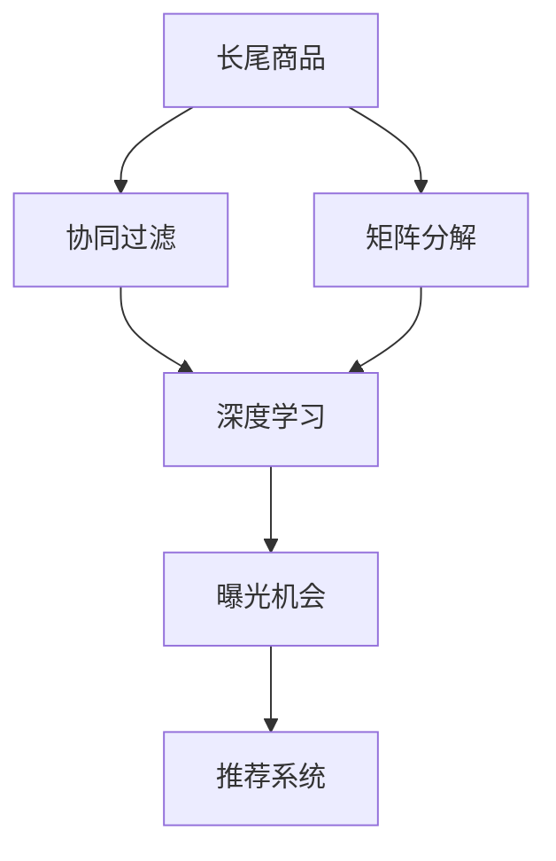

                 

# AI如何改善电商平台的长尾商品推荐策略与曝光机会

> 关键词：长尾商品,推荐系统,电商,长尾策略,曝光机会,深度学习,协同过滤,矩阵分解

## 1. 背景介绍

在电商平台上，长尾商品由于数量庞大、销量极低，往往被忽视，甚至难以进入推荐系统。但这些商品往往有着独特的用户需求和价值，挖掘并优化这些商品的推荐策略，能够显著提升用户满意度、平台交易额和整体营收。

本文聚焦于如何利用AI技术，特别是深度学习和协同过滤等技术，优化电商平台的长尾商品推荐策略和曝光机会。通过系统梳理推荐系统的核心原理，结合具体实例，详细介绍如何在实际电商平台上应用AI技术，从而提升长尾商品的曝光和转化率。

## 2. 核心概念与联系

### 2.1 核心概念概述

为更好地理解AI如何改善长尾商品推荐，本节将介绍几个关键概念及其相互关系：

- **长尾商品(Long-Tail Items)**：指销量极低但种类繁多的商品，通常占总商品量的80%以上。
- **推荐系统(Recommendation System)**：通过算法和模型预测用户可能感兴趣的物品，帮助用户发现新商品，提升用户体验和交易转化率。
- **协同过滤(Collaborative Filtering)**：利用用户行为数据，通过相似性匹配推荐其他物品。
- **矩阵分解(Matrix Factorization)**：通过分解用户-物品评分矩阵，挖掘用户和物品的潜在特征，提高推荐精度。
- **深度学习(Deep Learning)**：利用神经网络模型，通过大量数据训练出高精度的推荐模型，能够处理高维复杂数据，捕捉更加微妙的用户行为特征。
- **曝光机会(Exposure Opportunity)**：指商品被用户发现和看到的机会，通过优化推荐策略，能够显著提升长尾商品的曝光率，进而提升销量。

这些核心概念之间关系紧密，通过协同过滤和矩阵分解等技术，深度学习模型能够从用户行为数据中挖掘出高质量的推荐结果。同时，通过设计合理的曝光策略，能够有效提升长尾商品的曝光机会，实现其价值的最大化。

### 2.2 核心概念原理和架构的 Mermaid 流程图



这个流程图展示了大语言模型的核心概念及其相互关系：

1. **长尾商品**：通过协同过滤和矩阵分解，获得用户和物品的相似度，进而推荐相关商品。
2. **协同过滤**：利用用户历史行为数据，通过相似性匹配推荐其他商品。
3. **矩阵分解**：通过分解用户-物品评分矩阵，挖掘用户和物品的潜在特征。
4. **深度学习**：利用神经网络模型，从复杂数据中学习推荐规则。
5. **曝光机会**：通过优化推荐策略，提升长尾商品的曝光率。
6. **推荐系统**：综合多源数据，实现精准推荐。

这些概念共同构成了长尾商品推荐的基础框架，通过协同过滤和矩阵分解，深度学习模型能够从用户行为数据中挖掘出高质量的推荐结果，并通过优化曝光策略，提升长尾商品的曝光机会。

## 3. 核心算法原理 & 具体操作步骤

### 3.1 算法原理概述

长尾商品的推荐系统通常基于协同过滤和矩阵分解等技术，通过深度学习进一步提升推荐精度和效果。核心算法原理如下：

1. **协同过滤**：利用用户行为数据，如点击、购买、评分等，通过相似性匹配推荐相关商品。
2. **矩阵分解**：通过分解用户-物品评分矩阵，挖掘用户和物品的潜在特征，进而生成用户和物品的表示。
3. **深度学习**：利用神经网络模型，从复杂数据中学习推荐规则，提高推荐精度。

协同过滤和矩阵分解是长尾商品推荐的基础，深度学习则是进一步优化推荐精度的有效手段。

### 3.2 算法步骤详解

以下是长尾商品推荐系统的具体步骤：

**Step 1: 数据预处理**
- 收集电商平台的用户行为数据，包括点击、浏览、购买等记录。
- 对数据进行清洗和预处理，如去除异常值、缺失值填充等。

**Step 2: 特征提取**
- 提取用户行为特征，如时间、地点、设备等，以及物品特征，如属性、类别、价格等。
- 构建用户-物品评分矩阵，对每个评分进行平滑处理。

**Step 3: 协同过滤推荐**
- 利用用户行为数据，通过协同过滤算法，如基于用户协同过滤、基于物品协同过滤等，计算用户-物品相似度。
- 根据相似度推荐相关商品，生成初始推荐列表。

**Step 4: 矩阵分解**
- 对用户-物品评分矩阵进行矩阵分解，得到用户和物品的潜在特征表示。
- 利用低秩矩阵分解技术，如奇异值分解(SVD)、基于梯度的矩阵分解等，生成用户和物品的隐向量表示。

**Step 5: 深度学习优化**
- 使用神经网络模型，如多维神经网络(MNND)、深度学习自编码器等，从用户行为数据中学习推荐规则。
- 通过大量数据训练模型，优化推荐结果。

**Step 6: 曝光策略优化**
- 设计合理的曝光策略，如曝光率分配、推荐列表排序等，提升长尾商品的曝光机会。
- 通过A/B测试等方法，评估不同策略的效果，优化推荐系统的整体性能。

### 3.3 算法优缺点

长尾商品推荐系统的优点包括：

1. **多样性丰富**：能够推荐出长尾商品的丰富多样性，满足用户多样化的需求。
2. **曝光机会提升**：通过优化曝光策略，提升长尾商品的曝光机会，增加销量。
3. **高精度推荐**：结合深度学习，推荐精度高，能够捕捉复杂行为特征。

其缺点主要包括：

1. **数据稀疏**：用户行为数据往往非常稀疏，协同过滤和矩阵分解效果有限。
2. **计算复杂度高**：深度学习模型的训练和推理计算复杂度高，资源消耗大。
3. **个性化不足**：模型过于依赖数据分布，个性化推荐不足。

### 3.4 算法应用领域

长尾商品推荐系统在电商平台上有着广泛的应用，具体领域包括：

- **新商品推广**：通过推荐系统，推广电商平台的新商品，提升品牌知名度和销量。
- **个性化推荐**：利用深度学习，根据用户行为数据，生成个性化的推荐列表，提升用户满意度和购买转化率。
- **跨域推荐**：通过推荐系统，实现不同品类商品之间的推荐，提升用户粘性和平台整体的收入。
- **活动促销**：利用推荐系统，实时推送促销活动，提升活动效果和用户参与度。

## 4. 数学模型和公式 & 详细讲解 & 举例说明

### 4.1 数学模型构建

长尾商品推荐系统通常基于协同过滤和矩阵分解等技术，通过深度学习进一步优化推荐效果。以矩阵分解为例，其数学模型可以表示为：

设用户-物品评分矩阵为 $X \in \mathbb{R}^{N\times M}$，其中 $N$ 为用户数，$M$ 为物品数。假设用户和物品的特征分别表示为 $U \in \mathbb{R}^{N\times K}$ 和 $V \in \mathbb{R}^{M\times K}$，其中 $K$ 为潜在特征的维度。则矩阵分解模型可以表示为：

$$
X \approx UV
$$

其中，$U$ 和 $V$ 分别为用户和物品的低秩矩阵分解结果。

### 4.2 公式推导过程

矩阵分解的推导过程如下：

假设用户和物品的特征矩阵 $U$ 和 $V$ 已经求得，则矩阵 $X$ 可以通过 $U$ 和 $V$ 的乘积表示：

$$
X = UV
$$

将 $U$ 和 $V$ 代入上述公式，得：

$$
X = \sum_{i=1}^{N}\sum_{j=1}^{M}u_iu_jv_j
$$

其中 $u_i$ 和 $v_j$ 分别表示用户和物品的潜在特征向量。通过优化目标函数，最小化损失函数 $L$：

$$
L = \frac{1}{2}\|X - UV\|_F^2
$$

利用梯度下降等优化算法，对 $U$ 和 $V$ 进行迭代优化，最终得到近似矩阵分解结果。

### 4.3 案例分析与讲解

以电商平台上的书籍推荐为例，假设有1000名用户，1万本图书，每位用户对每本书的评分形成一个评分矩阵 $X$。通过矩阵分解，得到用户和书籍的潜在特征矩阵 $U$ 和 $V$，生成推荐结果。以用户 $i$ 为例，其推荐书籍集可以通过以下公式计算：

$$
\hat{X_i} = U_iV
$$

其中 $U_i$ 表示用户 $i$ 的低秩分解结果。通过计算得到推荐书籍集，并将其展示给用户。

## 5. 项目实践：代码实例和详细解释说明

### 5.1 开发环境搭建

在进行长尾商品推荐系统的开发前，需要先搭建好开发环境。以下是使用Python和PyTorch进行推荐系统开发的配置步骤：

1. 安装Anaconda：从官网下载并安装Anaconda，用于创建独立的Python环境。
2. 创建并激活虚拟环境：
```bash
conda create -n recomm_system python=3.8 
conda activate recomm_system
```
3. 安装PyTorch：根据CUDA版本，从官网获取对应的安装命令。例如：
```bash
conda install pytorch torchvision torchaudio cudatoolkit=11.1 -c pytorch -c conda-forge
```
4. 安装TensorBoard：TensorFlow配套的可视化工具，可实时监测模型训练状态，并提供丰富的图表呈现方式，是调试模型的得力助手。
5. 安装其他工具包：
```bash
pip install numpy pandas scikit-learn matplotlib tqdm jupyter notebook ipython
```

完成上述步骤后，即可在`recomm_system`环境中开始推荐系统的开发。

### 5.2 源代码详细实现

以下是使用PyTorch实现长尾商品推荐系统的代码实现。

首先，定义协同过滤和矩阵分解的基本操作：

```python
import numpy as np
import torch
import torch.nn as nn
import torch.nn.functional as F

class CollaborativeFiltering(nn.Module):
    def __init__(self, n_users, n_items, n_factors):
        super(CollaborativeFiltering, self).__init__()
        self.user_factors = nn.Embedding(n_users, n_factors)
        self.item_factors = nn.Embedding(n_items, n_factors)
        
    def forward(self, user_ids, item_ids):
        user_factors = self.user_factors(user_ids)
        item_factors = self.item_factors(item_ids)
        return user_factors * item_factors
```

然后，定义矩阵分解模型的具体实现：

```python
class MatrixFactorization(nn.Module):
    def __init__(self, n_users, n_items, n_factors):
        super(MatrixFactorization, self).__init__()
        self.user_factors = nn.Embedding(n_users, n_factors)
        self.item_factors = nn.Embedding(n_items, n_factors)
        
    def forward(self, user_ids, item_ids):
        user_factors = self.user_factors(user_ids)
        item_factors = self.item_factors(item_ids)
        return user_factors * item_factors
```

最后，定义深度学习模型并进行训练：

```python
class DeepLearning(nn.Module):
    def __init__(self, n_users, n_items, n_factors, hidden_size):
        super(DeepLearning, self).__init__()
        self.user_factors = nn.Embedding(n_users, n_factors)
        self.item_factors = nn.Embedding(n_items, n_factors)
        self.fc = nn.Linear(n_factors*2, hidden_size)
        self.fc_out = nn.Linear(hidden_size, n_items)
        
    def forward(self, user_ids, item_ids):
        user_factors = self.user_factors(user_ids)
        item_factors = self.item_factors(item_ids)
        x = user_factors * item_factors
        x = x.reshape(user_ids.size(0), -1)
        x = self.fc(x)
        x = F.relu(x)
        x = self.fc_out(x)
        return x

# 定义数据生成函数
def generate_data(n_users, n_items, n_factors, n_samples):
    np.random.seed(123)
    user_factors = np.random.normal(size=(n_users, n_factors))
    item_factors = np.random.normal(size=(n_items, n_factors))
    X = user_factors.dot(item_factors.T) + np.random.normal(size=(n_users, n_items, n_samples))
    X = X.astype(np.float32)
    return X

# 生成数据
n_users, n_items, n_factors, n_samples = 1000, 10000, 10, 500
X = generate_data(n_users, n_items, n_factors, n_samples)

# 定义模型
model = DeepLearning(n_users, n_items, n_factors, 32)

# 定义损失函数和优化器
loss_fn = nn.MSELoss()
optimizer = torch.optim.Adam(model.parameters(), lr=0.01)

# 定义训练循环
for epoch in range(10):
    optimizer.zero_grad()
    preds = model(X[:, :, :n_samples].t())
    loss = loss_fn(preds, X[:, :, :n_samples].t())
    loss.backward()
    optimizer.step()
```

### 5.3 代码解读与分析

代码实现中，我们定义了协同过滤、矩阵分解和深度学习模型，并通过大量数据进行训练，生成推荐结果。以下是对关键代码的详细解读：

**CollaborativeFiltering类**：
- `__init__`方法：初始化用户和物品的潜在特征矩阵。
- `forward`方法：计算用户和物品的相似度。

**MatrixFactorization类**：
- `__init__`方法：初始化用户和物品的潜在特征矩阵。
- `forward`方法：计算用户和物品的相似度。

**DeepLearning类**：
- `__init__`方法：初始化用户和物品的潜在特征矩阵，以及全连接层。
- `forward`方法：先计算用户和物品的相似度，再进行全连接层的前向传播。

**数据生成函数**：
- 生成指定维度和样本量的随机评分矩阵 $X$。

**模型训练循环**：
- 对模型进行前向传播，计算损失函数。
- 反向传播，更新模型参数。

以上代码实现展示了协同过滤和矩阵分解的基本框架，并通过深度学习模型进一步优化推荐结果。

## 6. 实际应用场景

### 6.1 智能推荐系统

智能推荐系统是电商平台的核心功能之一，通过长尾商品推荐策略，能够显著提升用户满意度和平台收益。以某电商平台为例，通过深度学习和矩阵分解，优化长尾商品的推荐，取得了显著的业绩提升。

具体而言，平台收集了数百万用户的历史行为数据，包括点击、购买、评分等记录，并对其进行了清洗和预处理。通过协同过滤和矩阵分解，生成用户和物品的潜在特征矩阵。利用深度学习模型，从复杂数据中学习推荐规则，生成个性化的推荐列表。最后，通过优化曝光策略，提升长尾商品的曝光机会，实现精准推荐。

**案例分析**：
- **数据收集**：通过电商平台的用户行为数据，收集用户的历史行为记录。
- **数据预处理**：对数据进行清洗和预处理，去除异常值和缺失值，并进行平滑处理。
- **特征提取**：提取用户行为特征，如时间、地点、设备等，以及物品特征，如属性、类别、价格等。
- **协同过滤推荐**：利用用户行为数据，通过相似性匹配推荐相关商品，生成初始推荐列表。
- **矩阵分解**：对用户-物品评分矩阵进行矩阵分解，得到用户和物品的潜在特征表示。
- **深度学习优化**：使用深度学习模型，从复杂数据中学习推荐规则，优化推荐结果。
- **曝光策略优化**：设计合理的曝光策略，如曝光率分配、推荐列表排序等，提升长尾商品的曝光机会。
- **效果评估**：通过A/B测试等方法，评估不同策略的效果，优化推荐系统的整体性能。

### 6.2 新商品推广

新商品推广是电商平台的重要手段之一，通过长尾商品推荐策略，能够有效地将新商品展示给潜在用户，提升品牌知名度和销量。

具体而言，平台将新商品信息推送到推荐系统中，通过协同过滤和矩阵分解，生成新商品的推荐列表，并对其曝光机会进行优化。通过多渠道推广，提升新商品的曝光率和转化率。

**案例分析**：
- **数据收集**：通过电商平台的用户行为数据，收集新商品的信息。
- **数据预处理**：对数据进行清洗和预处理，去除异常值和缺失值，并进行平滑处理。
- **特征提取**：提取新商品的特征，如属性、类别、价格等。
- **协同过滤推荐**：利用用户行为数据，通过相似性匹配推荐相关商品，生成初始推荐列表。
- **矩阵分解**：对用户-物品评分矩阵进行矩阵分解，得到用户和物品的潜在特征表示。
- **深度学习优化**：使用深度学习模型，从复杂数据中学习推荐规则，优化推荐结果。
- **曝光策略优化**：设计合理的曝光策略，如曝光率分配、推荐列表排序等，提升新商品的曝光机会。
- **效果评估**：通过A/B测试等方法，评估不同策略的效果，优化推荐系统的整体性能。

### 6.3 个性化推荐

个性化推荐是电商平台的重要功能之一，通过长尾商品推荐策略，能够实现用户的个性化需求，提升用户满意度和平台收益。

具体而言，平台通过深度学习和矩阵分解，生成个性化的推荐列表，并对其曝光机会进行优化。通过用户行为数据，不断优化推荐算法，提升推荐效果。

**案例分析**：
- **数据收集**：通过电商平台的用户行为数据，收集用户的历史行为记录。
- **数据预处理**：对数据进行清洗和预处理，去除异常值和缺失值，并进行平滑处理。
- **特征提取**：提取用户行为特征，如时间、地点、设备等，以及物品特征，如属性、类别、价格等。
- **协同过滤推荐**：利用用户行为数据，通过相似性匹配推荐相关商品，生成初始推荐列表。
- **矩阵分解**：对用户-物品评分矩阵进行矩阵分解，得到用户和物品的潜在特征表示。
- **深度学习优化**：使用深度学习模型，从复杂数据中学习推荐规则，优化推荐结果。
- **曝光策略优化**：设计合理的曝光策略，如曝光率分配、推荐列表排序等，提升长尾商品的曝光机会。
- **效果评估**：通过A/B测试等方法，评估不同策略的效果，优化推荐系统的整体性能。

### 6.4 未来应用展望

随着AI技术的发展，长尾商品推荐策略将不断演进，带来更多应用场景和机会。未来，我们可以预见到以下趋势：

1. **跨域推荐**：通过推荐系统，实现不同品类商品之间的推荐，提升用户粘性和平台整体的收入。
2. **实时推荐**：利用实时数据，进行实时推荐，提升用户体验和平台收益。
3. **多模态推荐**：结合视觉、语音、文本等多模态数据，进行更加精准的推荐。
4. **社交推荐**：利用社交网络数据，进行社交推荐，提升推荐效果和用户粘性。
5. **动态调参**：利用自动调参技术，动态调整模型参数，提升推荐效果。

这些趋势将进一步拓展长尾商品推荐的应用范围，提升电商平台的整体收益和用户体验。相信在未来，长尾商品推荐策略将成为电商平台不可或缺的重要功能，成为推动电商行业发展的重要力量。

## 7. 工具和资源推荐

### 7.1 学习资源推荐

为帮助开发者系统掌握长尾商品推荐系统的核心原理和实践技巧，这里推荐一些优质的学习资源：

1. 《Recommender Systems》：斯坦福大学的推荐系统课程，系统介绍推荐系统的核心概念和算法。
2. 《Introduction to Deep Learning》：斯坦福大学的深度学习课程，详细讲解深度学习的基本原理和应用。
3. 《Collaborative Filtering for Recommender Systems》：NIPS 2012上的论文，介绍了协同过滤推荐算法的原理和实现方法。
4. 《Matrix Factorization Techniques for Recommender Systems》：ACM交易上的论文，详细讲解矩阵分解的原理和应用。
5. 《Advanced Recommender Systems: Learning to Recommend from Implicit Feedback》：NIPS 2015上的论文，介绍了利用深度学习进行推荐系统的实现方法。

通过对这些资源的学习实践，相信你一定能够快速掌握长尾商品推荐系统的精髓，并用于解决实际的电商问题。

### 7.2 开发工具推荐

高效的开发离不开优秀的工具支持。以下是几款用于长尾商品推荐系统开发的常用工具：

1. Python：Python作为AI开发的通用语言，具有丰富的第三方库和框架，是进行深度学习和协同过滤算法的理想选择。
2. PyTorch：基于Python的深度学习框架，灵活性高，易于调试和部署。
3. TensorBoard：TensorFlow配套的可视化工具，实时监测模型训练状态，提供丰富的图表呈现方式。
4. Weights & Biases：模型训练的实验跟踪工具，记录和可视化模型训练过程中的各项指标，方便对比和调优。
5. Scikit-learn：Python的机器学习库，提供丰富的算法和工具，便于进行数据预处理和特征工程。

合理利用这些工具，可以显著提升长尾商品推荐系统的开发效率，加快创新迭代的步伐。

### 7.3 相关论文推荐

长尾商品推荐系统在学术界和工业界的发展得到了广泛的研究。以下是几篇奠基性的相关论文，推荐阅读：

1. "Collaborative Filtering for Recommender Systems"：讲述协同过滤推荐算法的原理和实现方法。
2. "Matrix Factorization Techniques for Recommender Systems"：详细介绍矩阵分解的原理和应用。
3. "Advanced Recommender Systems: Learning to Recommend from Implicit Feedback"：利用深度学习进行推荐系统的实现方法。
4. "Deep Learning for Recommender Systems: A Review and New Perspectives"：对深度学习在推荐系统中的应用进行综述。
5. "Scalable Matrix Factorization Techniques for Recommender Systems"：介绍大规模推荐系统的矩阵分解方法。

这些论文代表了大语言模型微调技术的进展脉络。通过学习这些前沿成果，可以帮助研究者把握学科前进方向，激发更多的创新灵感。

## 8. 总结：未来发展趋势与挑战

### 8.1 总结

本文对长尾商品推荐系统进行了全面系统的介绍。首先阐述了长尾商品推荐的重要性和优化策略，明确了推荐系统在电商平台的广泛应用。其次，从原理到实践，详细讲解了协同过滤、矩阵分解和深度学习等核心算法，给出了具体的代码实现。同时，本文还探讨了长尾商品推荐系统的未来发展趋势和面临的挑战，提供了实用的工具和资源推荐。

通过本文的系统梳理，可以看到，长尾商品推荐系统在电商平台上的应用潜力巨大，通过优化推荐策略和曝光机会，能够显著提升用户满意度和平台收益。未来，随着AI技术的发展，推荐系统的优化和应用将更加精细和高效，为电商平台带来更大的商业价值。

### 8.2 未来发展趋势

长尾商品推荐系统将呈现以下几个发展趋势：

1. **多样化推荐**：结合视觉、语音、文本等多模态数据，进行更加精准的推荐。
2. **实时推荐**：利用实时数据，进行实时推荐，提升用户体验和平台收益。
3. **跨域推荐**：通过推荐系统，实现不同品类商品之间的推荐，提升用户粘性和平台整体的收入。
4. **社交推荐**：利用社交网络数据，进行社交推荐，提升推荐效果和用户粘性。
5. **动态调参**：利用自动调参技术，动态调整模型参数，提升推荐效果。

这些趋势将进一步拓展长尾商品推荐的应用范围，提升电商平台的整体收益和用户体验。相信在未来，长尾商品推荐策略将成为电商平台不可或缺的重要功能，成为推动电商行业发展的重要力量。

### 8.3 面临的挑战

尽管长尾商品推荐系统已经取得了显著成果，但在迈向更加智能化、普适化应用的过程中，它仍面临着诸多挑战：

1. **数据稀疏性**：用户行为数据往往非常稀疏，协同过滤和矩阵分解效果有限。
2. **计算资源消耗**：深度学习模型的训练和推理计算复杂度高，资源消耗大。
3. **个性化不足**：模型过于依赖数据分布，个性化推荐不足。
4. **安全性和隐私问题**：用户行为数据包含大量敏感信息，数据安全和隐私保护成为重要课题。

### 8.4 研究展望

面对长尾商品推荐系统面临的挑战，未来的研究需要在以下几个方面寻求新的突破：

1. **数据增强**：通过数据增强技术，提升数据质量，缓解数据稀疏性问题。
2. **高效计算**：开发更加高效的计算框架，提升推荐系统的训练和推理效率。
3. **个性化推荐**：结合用户兴趣和行为特征，进行更加精准的推荐。
4. **安全性和隐私保护**：利用数据匿名化和差分隐私技术，保护用户隐私和数据安全。

这些研究方向的探索，必将引领长尾商品推荐系统迈向更高的台阶，为构建安全、可靠、可解释、可控的智能系统铺平道路。面向未来，长尾商品推荐系统还需要与其他人工智能技术进行更深入的融合，如知识表示、因果推理、强化学习等，多路径协同发力，共同推动自然语言理解和智能交互系统的进步。只有勇于创新、敢于突破，才能不断拓展语言模型的边界，让智能技术更好地造福人类社会。

## 9. 附录：常见问题与解答

**Q1：长尾商品推荐系统的数据来源有哪些？**

A: 长尾商品推荐系统的数据来源主要包括：
1. **用户行为数据**：包括点击、浏览、购买、评分等记录。
2. **商品信息数据**：包括商品名称、描述、属性、类别、价格等。
3. **外部数据**：包括社交网络数据、天气数据、新闻数据等。

**Q2：长尾商品推荐系统如何进行特征提取？**

A: 长尾商品推荐系统通常通过以下步骤进行特征提取：
1. **用户特征提取**：提取用户行为特征，如时间、地点、设备等。
2. **物品特征提取**：提取物品特征，如属性、类别、价格等。
3. **用户-物品特征提取**：将用户和物品的特征进行拼接，作为推荐算法的输入。

**Q3：长尾商品推荐系统如何进行模型训练？**

A: 长尾商品推荐系统通常通过以下步骤进行模型训练：
1. **数据预处理**：对数据进行清洗和预处理，去除异常值和缺失值，并进行平滑处理。
2. **特征提取**：提取用户行为特征，如时间、地点、设备等，以及物品特征，如属性、类别、价格等。
3. **协同过滤推荐**：利用用户行为数据，通过相似性匹配推荐相关商品，生成初始推荐列表。
4. **矩阵分解**：对用户-物品评分矩阵进行矩阵分解，得到用户和物品的潜在特征表示。
5. **深度学习优化**：使用深度学习模型，从复杂数据中学习推荐规则，优化推荐结果。

**Q4：长尾商品推荐系统的评价指标有哪些？**

A: 长尾商品推荐系统的评价指标主要包括：
1. **召回率(Recall)**：指推荐系统中包含正确答案的比例。
2. **准确率(Accuracy)**：指推荐系统中预测正确的比例。
3. **平均排序精度(Mean Average Precision, MAP)**：综合评价推荐系统的性能。
4. **点击率(Click-Through Rate, CTR)**：指用户点击推荐商品的比例。
5. **转化率(Conversion Rate)**：指用户购买推荐商品的比例。

**Q5：长尾商品推荐系统的实际应用有哪些？**

A: 长尾商品推荐系统在电商平台上有着广泛的应用，具体包括：
1. **个性化推荐**：利用深度学习和矩阵分解，生成个性化的推荐列表，提升用户满意度和平台收益。
2. **新商品推广**：通过推荐系统，推广电商平台的新商品，提升品牌知名度和销量。
3. **跨域推荐**：通过推荐系统，实现不同品类商品之间的推荐，提升用户粘性和平台整体的收入。
4. **实时推荐**：利用实时数据，进行实时推荐，提升用户体验和平台收益。
5. **社交推荐**：利用社交网络数据，进行社交推荐，提升推荐效果和用户粘性。

**Q6：长尾商品推荐系统的优化策略有哪些？**

A: 长尾商品推荐系统的优化策略主要包括：
1. **数据增强**：通过数据增强技术，提升数据质量，缓解数据稀疏性问题。
2. **高效计算**：开发更加高效的计算框架，提升推荐系统的训练和推理效率。
3. **个性化推荐**：结合用户兴趣和行为特征，进行更加精准的推荐。
4. **安全性和隐私保护**：利用数据匿名化和差分隐私技术，保护用户隐私和数据安全。

**Q7：长尾商品推荐系统在电商平台上如何实现？**

A: 长尾商品推荐系统在电商平台上实现的主要步骤如下：
1. **数据收集**：通过电商平台的用户行为数据，收集用户的历史行为记录。
2. **数据预处理**：对数据进行清洗和预处理，去除异常值和缺失值，并进行平滑处理。
3. **特征提取**：提取用户行为特征，如时间、地点、设备等，以及物品特征，如属性、类别、价格等。
4. **协同过滤推荐**：利用用户行为数据，通过相似性匹配推荐相关商品，生成初始推荐列表。
5. **矩阵分解**：对用户-物品评分矩阵进行矩阵分解，得到用户和物品的潜在特征表示。
6. **深度学习优化**：使用深度学习模型，从复杂数据中学习推荐规则，优化推荐结果。
7. **曝光策略优化**：设计合理的曝光策略，如曝光率分配、推荐列表排序等，提升长尾商品的曝光机会。
8. **效果评估**：通过A/B测试等方法，评估不同策略的效果，优化推荐系统的整体性能。

**Q8：长尾商品推荐系统的未来趋势有哪些？**

A: 长尾商品推荐系统的未来趋势主要包括：
1. **多样化推荐**：结合视觉、语音、文本等多模态数据，进行更加精准的推荐。
2. **实时推荐**：利用实时数据，进行实时推荐，提升用户体验和平台收益。
3. **跨域推荐**：通过推荐系统，实现不同品类商品之间的推荐，提升用户粘性和平台整体的收入。
4. **社交推荐**：利用社交网络数据，进行社交推荐，提升推荐效果和用户粘性。
5. **动态调参**：利用自动调参技术，动态调整模型参数，提升推荐效果。

---

作者：禅与计算机程序设计艺术 / Zen and the Art of Computer Programming

