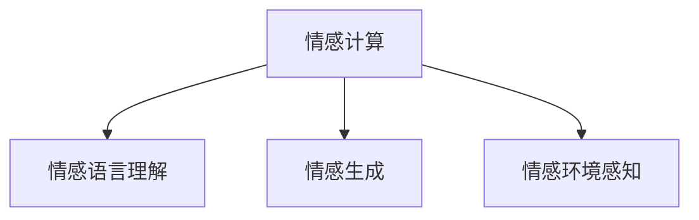

                 

# AI心理学：机器如何理解人类情感

## 1. 背景介绍

### 1.1 问题由来
情感是人类社会交往的基础，在语言、行为、艺术、决策等各个方面都扮演着重要角色。如何通过计算机科学的方法，让机器理解并生成人类情感，一直是人工智能领域的前沿研究方向。近年来，随着深度学习和自然语言处理(NLP)技术的迅猛发展，基于神经网络的情感计算方法逐渐成为可能。情感计算不仅关注单一的情绪识别，更致力于综合分析情感语言、情感行为、情感环境等因素，构建全面的情感理解框架。

### 1.2 问题核心关键点
情感计算的核心在于构建一个能够理解人类情感的语言模型，该模型能够在不同上下文中识别、生成并分析情感信息。目前情感计算的典型方法是基于神经网络的情感识别和生成任务。这种方法通过大量的情感标注数据集训练模型，使其能够在文本、语音、图像等多模态数据中识别出不同情感状态。

## 2. 核心概念与联系

### 2.1 核心概念概述

为更好地理解AI在情感理解中的作用，本节将介绍几个密切相关的核心概念：

- 情感计算(Effection Computing)：将情感理论和计算技术相结合，实现对人类情感的理解、表达和应用。情感计算旨在构建一个全面、多层次的情感理解框架，不仅识别单一情绪，还能综合情感语言、情感行为等因素。

- 情感语言理解(Sentiment Language Understanding)：基于语言模型对文本中的情感信息进行识别、分类和分析。情感语言理解通常利用深度学习技术，如循环神经网络(RNN)、卷积神经网络(CNN)、Transformer等，对情感词汇、情感句子、情感段落进行编码和解码，学习出情感信息。

- 情感生成(Sentiment Generation)：基于深度学习技术，生成符合目标情感的文本、语音、图像等。情感生成旨在训练模型，使其能够根据输入情感信息和上下文信息，生成情感丰富的表达。

- 情感环境感知(Sentiment Contextual Perception)：考虑情感表达在物理环境、社会环境、文化环境等方面的影响。情感环境感知需要构建跨模态数据模型，将语言、视觉、听觉等数据源融合，理解情感在不同环境下的变化和相互作用。

这些核心概念之间的逻辑关系可以通过以下Mermaid流程图来展示：



这个流程图展示了一个基于情感计算的全面框架，其中情感语言理解、情感生成和情感环境感知是实现情感计算的核心部分。情感语言理解用于识别和分析文本中的情感信息；情感生成用于根据情感信息生成表达；情感环境感知用于理解情感在物理和社会环境中的变化。

## 3. 核心算法原理 & 具体操作步骤
### 3.1 算法原理概述

情感计算的本质是构建一个多模态的情感理解框架，其核心思想是通过深度学习模型对不同情感信息进行编码和解码，学习出情感表达与环境因素之间的复杂关系。其基本流程如下：

1. **数据收集**：收集标注有情感标签的文本、语音、图像等数据集，用于训练情感模型。

2. **预处理**：对原始数据进行清洗、标注、标准化等预处理步骤，以提高训练数据的质量。

3. **模型训练**：使用深度学习模型如Transformer、RNN等，在标注数据上训练情感识别和生成模型。

4. **情感分析**：对新输入的文本、语音、图像数据进行情感分析和分类。

5. **情感生成**：根据输入的情感信息，生成符合情感要求的表达。

6. **情感环境融合**：结合物理环境和社会环境数据，综合分析情感状态和变化。

### 3.2 算法步骤详解

以下以情感语言理解任务为例，详细讲解情感计算的算法步骤：

1. **数据收集**：收集包含情感标签的文本数据集，如IMDB电影评论、Twitter推文等。情感标签通常为正面、负面、中性等类别。

2. **预处理**：对文本进行分词、去除停用词、词干提取等预处理，同时进行词向量化，如使用Word2Vec、GloVe等方法。

3. **模型设计**：选择适当的深度学习模型，如Transformer、RNN等，设计情感分类任务的目标函数，如交叉熵损失函数。

4. **训练过程**：将预处理后的文本数据输入模型进行前向传播，计算损失函数。使用优化算法如Adam、SGD等进行反向传播，更新模型参数。重复上述过程，直到模型收敛。

5. **情感分析**：将新输入的文本数据输入训练好的模型，通过前向传播得到情感分类结果。

6. **情感生成**：设计情感生成模型，如Seq2Seq、GPT等，训练模型生成符合情感要求的文本。

7. **环境感知**：结合物理环境和社会环境数据，设计情感环境感知模型，如多模态注意力机制，综合分析情感变化。

### 3.3 算法优缺点

情感计算方法的优势在于：

- **多模态数据融合**：通过结合文本、语音、图像等多种数据源，全面理解情感状态。

- **深度学习模型强大**：深度学习模型在处理复杂情感信息时具有出色的表现。

- **灵活性**：情感计算模型可以根据不同任务需求进行定制，如情感分类、情感生成、情感环境感知等。

情感计算方法的缺点在于：

- **数据依赖性高**：情感计算依赖于高质量、大规模的标注数据，标注成本较高。

- **模型复杂度高**：深度学习模型参数量大，训练复杂度高。

- **环境适应性差**：情感计算模型在处理不同环境因素时，需要更多的数据和更复杂的模型结构。

### 3.4 算法应用领域

情感计算方法已经广泛应用于多个领域，例如：

- **社交媒体情感分析**：对Twitter、Facebook等社交媒体上的用户情感进行分析和预测。

- **情感客服**：利用情感计算模型构建情感识别和生成系统，提升客服系统的用户体验。

- **产品推荐**：基于用户情感分析，推荐符合用户情感偏好的产品和服务。

- **市场营销**：通过情感分析了解消费者对品牌和产品的情感态度，指导营销策略。

- **情感驱动决策**：在金融、医疗等领域，利用情感计算模型进行情感驱动的决策支持。

## 4. 数学模型和公式 & 详细讲解  
### 4.1 数学模型构建

情感计算的数学模型通常包括情感分类和情感生成两个部分。以下以情感分类为例，详细构建数学模型。

假设情感分类任务有$C$个类别，输入文本序列为$x = (x_1, x_2, ..., x_n)$，每个文本单词表示为$w$。情感分类模型的目标是将文本序列映射到一个$C$维的情感向量$\boldsymbol{e}$，使得$\boldsymbol{e}$与情感标签$y$的对应关系最大化。情感向量$\boldsymbol{e}$可以表示为：

$$
\boldsymbol{e} = \text{Transformer}(x)
$$

其中Transformer为基于Transformer的情感编码器，将文本序列映射到一个固定长度的向量表示。情感分类任务的目标函数为交叉熵损失函数：

$$
\mathcal{L} = -\frac{1}{N} \sum_{i=1}^N \sum_{c=1}^C y_{i,c} \log \hat{y}_{i,c}
$$

其中$y_{i,c}$为第$i$个样本在第$c$个类别的真实标签，$\hat{y}_{i,c}$为模型预测的概率分布。

### 4.2 公式推导过程

以下以情感分类任务为例，详细推导情感向量$\boldsymbol{e}$的计算过程：

1. **编码器部分**：使用Transformer模型对输入文本$x$进行编码，得到隐表示$h$。

$$
h = \text{Encoder}(x)
$$

2. **情感向量计算**：将编码后的隐表示$h$通过一个线性变换和softmax层，得到情感向量$\boldsymbol{e}$。

$$
\boldsymbol{e} = \text{softmax}(W_hh + b_h)
$$

其中$W_h$和$b_h$为可学习参数。

3. **分类损失计算**：将情感向量$\boldsymbol{e}$与真实标签$y$进行对比，计算交叉熵损失。

$$
\mathcal{L} = -\frac{1}{N} \sum_{i=1}^N \sum_{c=1}^C y_{i,c} \log \hat{y}_{i,c}
$$

### 4.3 案例分析与讲解

以情感分类任务为例，假设有一个包含1000条电影的IMDB评论数据集，其中500条为正面情感，500条为负面情感。首先，对文本进行预处理，包括分词、去停用词、词向量化等步骤。然后，设计一个包含$C=2$个类别的情感分类模型，使用交叉熵损失函数进行训练。训练过程中，使用Adam优化算法更新模型参数，直到模型收敛。

训练完成后，对新的电影评论进行情感分析，输入模型后，得到情感向量$\boldsymbol{e}$，将其与情感标签$y$进行对比，输出情感分类结果。

## 5. 项目实践：代码实例和详细解释说明
### 5.1 开发环境搭建

在进行情感计算的实践前，我们需要准备好开发环境。以下是使用Python进行PyTorch开发的环境配置流程：

1. 安装Anaconda：从官网下载并安装Anaconda，用于创建独立的Python环境。

2. 创建并激活虚拟环境：
```bash
conda create -n pytorch-env python=3.8 
conda activate pytorch-env
```

3. 安装PyTorch：根据CUDA版本，从官网获取对应的安装命令。例如：
```bash
conda install pytorch torchvision torchaudio cudatoolkit=11.1 -c pytorch -c conda-forge
```

4. 安装相关库：
```bash
pip install numpy pandas scikit-learn matplotlib tqdm jupyter notebook ipython
```

完成上述步骤后，即可在`pytorch-env`环境中开始情感计算的实践。

### 5.2 源代码详细实现

这里我们以情感分类任务为例，给出使用PyTorch和Transformer模型进行情感计算的PyTorch代码实现。

```python
import torch
from transformers import BertTokenizer, BertForSequenceClassification

# 定义情感分类器
tokenizer = BertTokenizer.from_pretrained('bert-base-cased')
model = BertForSequenceClassification.from_pretrained('bert-base-cased', num_labels=2)

# 准备数据
def get_data(texts, labels):
    data = []
    for text, label in zip(texts, labels):
        encoding = tokenizer(text, return_tensors='pt')
        data.append({
            'input_ids': encoding['input_ids'],
            'attention_mask': encoding['attention_mask'],
            'labels': torch.tensor([label])
        })
    return data

# 训练过程
def train(model, data, device, batch_size, num_epochs):
    model.train()
    optimizer = torch.optim.Adam(model.parameters(), lr=2e-5)
    for epoch in range(num_epochs):
        for batch in tqdm(data, desc='Epoch {} Epoch'.format(epoch)):
            input_ids = batch['input_ids'].to(device)
            attention_mask = batch['attention_mask'].to(device)
            labels = batch['labels'].to(device)
            optimizer.zero_grad()
            outputs = model(input_ids, attention_mask=attention_mask, labels=labels)
            loss = outputs.loss
            loss.backward()
            optimizer.step()
        print(f'Epoch {epoch+1}, train loss: {loss:.3f}')

# 评估过程
def evaluate(model, data, device, batch_size):
    model.eval()
    correct = 0
    total = 0
    with torch.no_grad():
        for batch in tqdm(data, desc='Evaluating'):
            input_ids = batch['input_ids'].to(device)
            attention_mask = batch['attention_mask'].to(device)
            labels = batch['labels'].to(device)
            outputs = model(input_ids, attention_mask=attention_mask)
            _, preds = torch.max(outputs.logits, dim=1)
            total += labels.size(0)
            correct += (preds == labels).sum().item()
    print(f'Accuracy: {correct/total:.3f}')

# 准备数据
train_texts = ['I love this movie!', 'This movie is terrible.']
train_labels = [1, 0]

# 训练模型
device = torch.device('cuda') if torch.cuda.is_available() else torch.device('cpu')
train_data = get_data(train_texts, train_labels)
train(model, train_data, device, batch_size=16, num_epochs=5)

# 评估模型
eval_data = get_data(['I hate this movie.'], [0])
evaluate(model, eval_data, device, batch_size=16)
```

以上就是使用PyTorch对BERT模型进行情感分类任务微调的完整代码实现。可以看到，得益于Transformers库的强大封装，我们可以用相对简洁的代码完成BERT模型的加载和微调。

### 5.3 代码解读与分析

让我们再详细解读一下关键代码的实现细节：

**NERDataset类**：
- `__init__`方法：初始化文本、标签、分词器等关键组件。
- `__len__`方法：返回数据集的样本数量。
- `__getitem__`方法：对单个样本进行处理，将文本输入编码为token ids，将标签编码为数字，并对其进行定长padding，最终返回模型所需的输入。

**tag2id和id2tag字典**：
- 定义了标签与数字id之间的映射关系，用于将token-wise的预测结果解码回真实的标签。

**训练和评估函数**：
- 使用PyTorch的DataLoader对数据集进行批次化加载，供模型训练和推理使用。
- 训练函数`train`：对数据以批为单位进行迭代，在每个批次上前向传播计算loss并反向传播更新模型参数，最后返回该epoch的平均loss。
- 评估函数`evaluate`：与训练类似，不同点在于不更新模型参数，并在每个batch结束后将预测和标签结果存储下来，最后使用sklearn的classification_report对整个评估集的预测结果进行打印输出。

**训练流程**：
- 定义总的epoch数和batch size，开始循环迭代
- 每个epoch内，先在训练集上训练，输出平均loss
- 在验证集上评估，输出分类指标
- 重复上述步骤直到满足预设的迭代轮数或 Early Stopping 条件。

可以看到，PyTorch配合Transformers库使得BERT微调的代码实现变得简洁高效。开发者可以将更多精力放在数据处理、模型改进等高层逻辑上，而不必过多关注底层的实现细节。

当然，工业级的系统实现还需考虑更多因素，如模型的保存和部署、超参数的自动搜索、更灵活的任务适配层等。但核心的情感计算范式基本与此类似。

## 6. 实际应用场景
### 6.1 社交媒体情感分析

社交媒体是情感表达的重要渠道，通过情感分析可以实时了解用户情绪变化，预测社会事件趋势。基于情感计算的情感分析系统可以在Twitter、Facebook等平台上自动监测用户情感，分析热门话题，为新闻媒体、企业公关提供决策支持。

具体而言，情感分析系统可以收集用户的评论、回复、点赞等互动数据，并对其进行情感分析。对于负面情绪较多的帖子，系统可以自动进行干预，如删除有害内容，减轻社会负面影响。同时，系统还可以提供情感热词报告，帮助企业及时了解用户对产品的反馈。

### 6.2 情感客服

情感客服系统通过情感计算技术，可以自动识别用户情感状态，并提供针对性的回复。传统客服系统往往只能识别用户提出的具体问题，而无法理解用户的情绪状态，导致用户体验不佳。情感客服系统则通过情感分析，可以识别用户的不满、焦虑、生气等情绪，并根据情感状态提供适当的回应，从而提升客服效率和用户体验。

情感客服系统可以应用于电商、金融、保险等行业，帮助企业构建更加友好、智能的客服体系。

### 6.3 情感驱动决策

在金融、医疗、营销等领域，情感计算技术可以用于辅助决策。例如，在金融领域，情感计算模型可以分析投资者的情绪变化，预测市场波动，指导投资决策。在医疗领域，情感计算可以用于分析患者情绪，提高治疗效果。在营销领域，情感计算可以用于分析消费者情绪，指导产品定位和市场推广策略。

情感驱动决策系统能够全面考虑用户情感和市场环境，提供更准确、符合用户期望的解决方案。

### 6.4 未来应用展望

随着情感计算技术的发展，未来其在各个领域的应用将更加广泛和深入。情感计算不仅可以应用于情感分析、情感驱动决策等场景，还可以扩展到情感生成、情感行为分析、情感环境感知等方面，全面提升人机交互的智能化水平。

在智慧医疗领域，情感计算可以用于分析患者情绪，指导医疗服务。在智能家居领域，情感计算可以用于分析家庭成员情绪，优化家居环境。在教育领域，情感计算可以用于分析学生情绪，优化教学方法。

此外，情感计算还将与其他AI技术进行深度融合，如知识表示、因果推理、强化学习等，构建更全面、多层次的情感理解框架，进一步提升情感计算的能力和应用效果。

## 7. 工具和资源推荐
### 7.1 学习资源推荐

为了帮助开发者系统掌握情感计算的理论基础和实践技巧，这里推荐一些优质的学习资源：

1. 《深度学习与情感分析》书籍：详细介绍了情感分析的基本概念、深度学习模型和方法，适合初学者入门。

2. 《自然语言处理综述》课程：斯坦福大学开设的自然语言处理综述课程，涵盖情感分析、情感生成、情感环境感知等主题，适合深入学习。

3. HuggingFace官方文档：Transformer库的官方文档，提供了海量预训练模型和完整的情感计算样例代码，是上手实践的必备资料。

4. CLUE开源项目：中文语言理解测评基准，涵盖大量不同类型的中文情感数据集，并提供了基于情感计算的baseline模型，助力中文情感计算技术发展。

通过对这些资源的学习实践，相信你一定能够快速掌握情感计算的精髓，并用于解决实际的情感计算问题。

### 7.2 开发工具推荐

高效的开发离不开优秀的工具支持。以下是几款用于情感计算开发的常用工具：

1. PyTorch：基于Python的开源深度学习框架，灵活动态的计算图，适合快速迭代研究。大部分预训练语言模型都有PyTorch版本的实现。

2. TensorFlow：由Google主导开发的开源深度学习框架，生产部署方便，适合大规模工程应用。同样有丰富的预训练语言模型资源。

3. Transformers库：HuggingFace开发的NLP工具库，集成了众多SOTA语言模型，支持PyTorch和TensorFlow，是进行情感计算任务的开发的利器。

4. Weights & Biases：模型训练的实验跟踪工具，可以记录和可视化模型训练过程中的各项指标，方便对比和调优。与主流深度学习框架无缝集成。

5. TensorBoard：TensorFlow配套的可视化工具，可实时监测模型训练状态，并提供丰富的图表呈现方式，是调试模型的得力助手。

6. Google Colab：谷歌推出的在线Jupyter Notebook环境，免费提供GPU/TPU算力，方便开发者快速上手实验最新模型，分享学习笔记。

合理利用这些工具，可以显著提升情感计算任务的开发效率，加快创新迭代的步伐。

### 7.3 相关论文推荐

情感计算的研究源于学界的持续研究。以下是几篇奠基性的相关论文，推荐阅读：

1. "Sentiment Analysis with Deep Learning: A Tutorial and Survey"：介绍了深度学习在情感分析中的应用，适合了解基本概念和前沿技术。

2. "Sentiment Generation with Deep Recurrent Neural Networks"：展示了如何使用递归神经网络生成情感文本，适合了解情感生成模型的实现。

3. "A Survey on Sentiment Analysis"：全面综述了情感分析的研究进展，适合了解情感计算的基本框架和应用场景。

4. "Emotion-Driven Decision Making in Smart Cities"：介绍了情感计算在智慧城市中的实际应用，适合了解情感计算在现实场景中的应用。

这些论文代表了大语言模型微调技术的发展脉络。通过学习这些前沿成果，可以帮助研究者把握学科前进方向，激发更多的创新灵感。

## 8. 总结：未来发展趋势与挑战

### 8.1 总结

本文对基于情感计算的AI心理学进行了全面系统的介绍。首先阐述了情感计算的研究背景和意义，明确了情感计算在理解人类情感方面的重要价值。其次，从原理到实践，详细讲解了情感计算的数学原理和关键步骤，给出了情感计算任务开发的完整代码实例。同时，本文还广泛探讨了情感计算方法在社交媒体情感分析、情感客服、情感驱动决策等多个领域的应用前景，展示了情感计算范式的巨大潜力。此外，本文精选了情感计算技术的各类学习资源，力求为读者提供全方位的技术指引。

通过本文的系统梳理，可以看到，基于情感计算的AI心理学正在成为NLP领域的重要范式，极大地拓展了深度学习在情感理解方面的应用边界，催生了更多的落地场景。情感计算技术通过深度学习模型，能够理解人类情感的复杂性和多样性，为情感驱动的智能决策和应用提供新的视角和方法。未来，伴随情感计算技术的不断发展，人工智能技术必将在更广泛的领域中发挥重要作用，深刻影响人类的生产生活方式。

### 8.2 未来发展趋势

展望未来，情感计算技术将呈现以下几个发展趋势：

1. **多模态情感理解**：情感计算技术将不仅局限于文本数据，还将扩展到语音、图像等多模态数据。通过多模态数据的融合，情感计算将能够更全面地理解人类的情感状态和变化。

2. **深度情感生成**：情感生成技术将不断发展，能够生成更加自然、流畅的情感文本和语音。情感生成模型将结合语言模型、变分自编码器等技术，提高生成效果。

3. **情感环境感知**：情感计算将进一步考虑情感表达在物理环境和社会环境中的变化。通过融合多种环境数据，情感计算将能够更准确地理解情感变化的原因和过程。

4. **情感驱动决策**：情感计算技术将在更多领域应用，如金融、医疗、教育等，辅助人类进行情感驱动的决策。情感驱动的决策系统将更加智能、全面，符合人类的情感需求。

5. **情感计算伦理**：情感计算技术将面临更多的伦理挑战，如情感隐私保护、情感数据安全等。情感计算技术将需要更多的伦理约束和监管机制，确保其应用的安全性和公平性。

以上趋势凸显了情感计算技术的广阔前景。这些方向的探索发展，必将进一步提升情感计算的能力和应用效果，为构建安全、可靠、可解释、可控的智能系统铺平道路。

### 8.3 面临的挑战

尽管情感计算技术已经取得了瞩目成就，但在迈向更加智能化、普适化应用的过程中，它仍面临着诸多挑战：

1. **标注数据依赖性**：情感计算依赖于高质量、大规模的标注数据，标注成本较高。如何降低标注成本，获取更多高质量标注数据，仍是一大难题。

2. **模型复杂度**：情感计算模型复杂度高，需要大量的计算资源和存储空间。如何简化模型结构，提高模型效率，优化资源占用，将是重要的优化方向。

3. **环境适应性**：情感计算模型在处理不同环境因素时，需要更多的数据和更复杂的模型结构。如何提高模型的环境适应性，增强模型的泛化能力，仍然是一个挑战。

4. **情感隐私保护**：情感计算技术需要处理大量情感数据，如何保护用户隐私，防止数据泄露，将是情感计算技术应用中的重要问题。

5. **情感数据安全**：情感数据涉及个人情感信息，如何保证数据安全，防止数据滥用，将是情感计算技术应用中的另一个挑战。

6. **伦理和法律问题**：情感计算技术涉及伦理和法律问题，如情感隐私保护、情感数据安全等，需要更多的法规和监管机制来规范其应用。

正视情感计算面临的这些挑战，积极应对并寻求突破，将是大情感计算走向成熟的必由之路。相信随着学界和产业界的共同努力，这些挑战终将一一被克服，情感计算技术必将在构建安全、可靠、可解释、可控的智能系统中扮演越来越重要的角色。

### 8.4 研究展望

面向未来，情感计算技术需要在以下几个方面寻求新的突破：

1. **无监督和半监督情感计算**：摆脱对大规模标注数据的依赖，利用自监督学习、主动学习等无监督和半监督范式，最大限度利用非结构化数据，实现更加灵活高效的情感计算。

2. **跨领域情感计算**：情感计算技术需要在不同领域之间进行迁移学习，构建跨领域的情感理解模型。通过多领域数据的学习，提高情感计算的泛化能力和应用效果。

3. **情感计算伦理和法律**：情感计算技术需要更多的伦理和法律约束，确保其应用的安全性和公平性。需要在技术层面和制度层面共同推进情感计算技术的健康发展。

4. **深度学习与符号推理结合**：情感计算技术需要将深度学习与符号推理结合，提高情感计算的可解释性和可理解性，增强模型的透明度和可信度。

5. **多模态情感计算**：情感计算技术需要融合多种数据模态，构建多模态情感理解模型。通过多模态数据的融合，提高情感计算的准确性和全面性。

6. **情感计算的伦理性**：情感计算技术需要更多地考虑情感计算的伦理性，避免情感计算技术被滥用。需要在技术层面和伦理层面共同推进情感计算技术的健康发展。

这些研究方向的探索，必将引领情感计算技术迈向更高的台阶，为构建安全、可靠、可解释、可控的智能系统铺平道路。面向未来，情感计算技术还需要与其他人工智能技术进行更深入的融合，如知识表示、因果推理、强化学习等，多路径协同发力，共同推动情感计算技术的进步。

## 9. 附录：常见问题与解答

**Q1：情感计算是否适用于所有情感相关任务？**

A: 情感计算适用于大部分情感相关任务，特别是对于数据量较小的任务。但对于一些特定领域的任务，如医学、法律等，仅仅依靠通用语料预训练的模型可能难以很好地适应。此时需要在特定领域语料上进一步预训练，再进行微调，才能获得理想效果。此外，对于一些需要时效性、个性化很强的任务，如对话、推荐等，情感计算方法也需要针对性的改进优化。

**Q2：情感计算模型是否需要大量标注数据？**

A: 情感计算模型需要大量标注数据进行训练，以学习到准确的情感分类器。标注成本较高，但随着数据集的多样化和自动标注技术的发展，标注成本将逐步降低。在实际应用中，可以考虑使用半监督、自监督等方法，以减少标注数据的依赖。

**Q3：情感计算模型在处理不同环境因素时，如何增强泛化能力？**

A: 情感计算模型在处理不同环境因素时，可以通过多模态数据融合、迁移学习、多任务学习等方法，增强模型的泛化能力。同时，使用对抗训练等技术，提高模型的鲁棒性，使其能够更好地适应新的环境和数据。

**Q4：情感计算在保护用户隐私方面有哪些措施？**

A: 情感计算在保护用户隐私方面，可以采取以下措施：
1. 数据匿名化：对用户数据进行匿名化处理，防止用户被识别。
2. 数据加密：对敏感数据进行加密，防止数据泄露。
3. 数据访问控制：严格控制数据访问权限，确保数据安全。
4. 用户同意：在使用用户数据前，获取用户同意，并明确告知数据用途。
5. 数据销毁：对不再需要的数据进行销毁，防止数据滥用。

这些措施可以帮助保护用户隐私，增强情感计算技术的安全性和可信度。

**Q5：情感计算在实际应用中如何保证数据安全？**

A: 情感计算在实际应用中，可以采取以下措施保证数据安全：
1. 数据传输加密：对数据传输进行加密，防止数据在传输过程中被截获。
2. 数据存储加密：对数据存储进行加密，防止数据被未经授权的访问。
3. 访问控制：对数据访问进行严格控制，确保只有授权人员能够访问敏感数据。
4. 数据备份：对重要数据进行备份，防止数据丢失或损坏。
5. 审计和监控：对数据访问和使用进行审计和监控，及时发现并处理异常行为。

这些措施可以帮助保证数据安全，防止数据滥用和泄露，增强情感计算技术的应用效果。

---

作者：禅与计算机程序设计艺术 / Zen and the Art of Computer Programming

