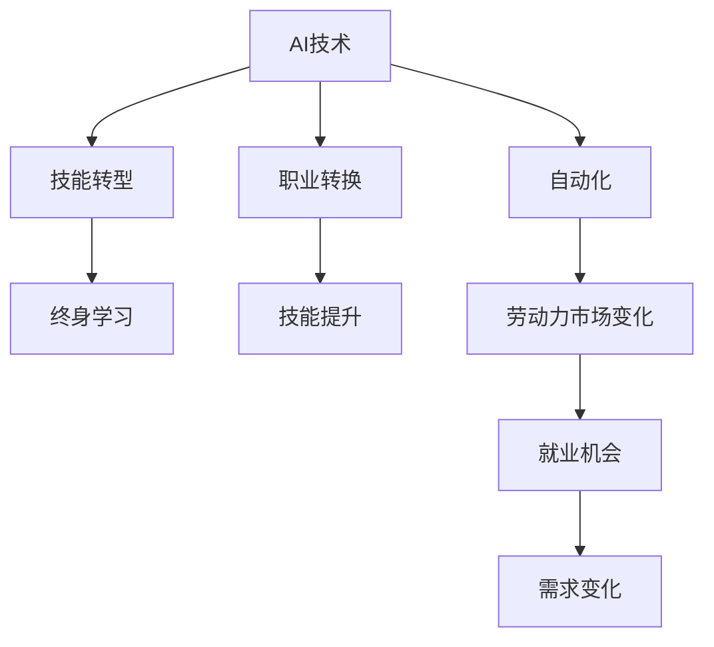

                 

# AI技术的就业影响应对:技能培训和职业转换支持

在人工智能（AI）技术的飞速发展下，各行各业正经历着前所未有的变革，传统的职业和技能面临着严峻的挑战。从自动化、机器人、自然语言处理，到计算机视觉、深度学习等，AI技术的广泛应用正在改变工作方式和劳动市场。然而，这一变革同时也带来了大量的就业机会，需要相关人才进行技术开发、维护和运营。

## 1. 背景介绍

随着AI技术的不断进步，传统行业的许多工作岗位逐渐被自动化系统取代。例如，制造业中的机器人装配线、银行中的自动取款机、客服系统中的聊天机器人等，都在逐步减少对人力的依赖。此外，一些专业性较强的岗位，如财务审计、法律咨询等，也开始借助AI技术实现自动化，降低人力成本。

### 1.1 就业影响概览
AI技术的广泛应用对劳动市场产生了深远的影响。据国际劳工组织（ILO）预测，到2030年，约有2500万个岗位将因自动化而消失。然而，AI也将创造7000万个新岗位，涵盖数据分析、算法开发、机器学习工程师、AI产品经理等多个新兴领域。

### 1.2 新兴职业与技能需求
随着AI技术的兴起，市场对新型职业的需求日益增长，主要包括：
- **数据科学家**：负责数据收集、处理、分析和建模，为业务决策提供支持。
- **AI工程师**：设计、实现和维护AI系统，包括机器学习、深度学习、自然语言处理等领域。
- **技术产品经理**：负责AI产品从构思到上市的全流程管理，确保技术应用符合市场需求。
- **AI运营专员**：管理AI系统运行，进行数据监控、模型调优和故障排查。

## 2. 核心概念与联系

### 2.1 核心概念概述

为更好地理解AI技术对就业的影响及其应对策略，本节将介绍几个关键概念：

- **AI技术**：涉及机器学习、深度学习、自然语言处理、计算机视觉等领域的多种技术，旨在模拟人类的智能行为。
- **自动化**：通过编程或机器学习算法，使机器能够自动执行特定任务的过程。
- **技能转型**：劳动者从传统岗位转向AI相关岗位的过程，需要掌握新的技能和知识。
- **职业转换**：劳动者从一种职业角色转变为另一种职业角色的过程，通常需要适应新的工作环境和要求。
- **终身学习**：不断更新知识和技能，以适应技术变化和市场需求的终身教育理念。

这些核心概念之间的逻辑关系可以通过以下Mermaid流程图来展示：



这个流程图展示了AI技术对就业市场的影响途径：
- AI技术通过自动化替代传统岗位，导致就业结构变化。
- 劳动者需要通过技能转型和职业转换适应新的市场需求。
- 终身学习理念，促使劳动者不断提升技能，以保持竞争力。

## 3. 核心算法原理 & 具体操作步骤

### 3.1 算法原理概述

AI技术对就业的影响主要通过自动化和技能转型两个环节发生。自动化技术减少了对低技能劳动力的需求，而技能转型则要求劳动者掌握新的知识和技能。这种变化可通过以下数学模型进行描述：

设 $L$ 为劳动市场对某职业的需求，$A$ 为该职业的自动化水平，$S$ 为劳动者对该职业的技能掌握度，则劳动市场需求可以表示为：

$$
L = f(A, S)
$$

其中 $f$ 为需求函数，$A$ 和 $S$ 为需求函数的自变量，分别代表自动化水平和技能掌握度。在AI技术的影响下，$A$ 值增加，进而影响 $L$ 的变化。

### 3.2 算法步骤详解

为了应对AI技术对就业的影响，技能培训和职业转换支持主要包括以下几个步骤：

**Step 1: 技能需求分析**
- 通过调研和数据分析，识别当前市场对AI技能的需求类型和数量。
- 分类劳动市场中的传统岗位和新兴岗位，确定技能转型的重点领域。

**Step 2: 技能培训设计**
- 设计适应不同背景和能力的培训课程，包括基础课程和高级课程。
- 开发针对特定岗位的培训项目，如数据科学、AI工程、机器学习等。
- 引入在线学习平台和互动式学习工具，支持个性化学习和灵活安排学习时间。

**Step 3: 职业转换指导**
- 提供职业转换咨询服务，帮助劳动者评估自身的技能和兴趣，匹配合适的岗位。
- 设计职业转换路径，包括技能提升、求职技巧和面试准备。
- 组织职业转换工作坊和职业指导课程，提供实际经验分享和指导。

**Step 4: 终身学习支持**
- 建立终身学习支持系统，包括在线学习平台、学习社群和学术资源。
- 定期发布技术趋势和课程更新，帮助学习者掌握最新技术。
- 提供个性化的学习计划和职业发展建议，促进终身学习。

### 3.3 算法优缺点

技能培训和职业转换支持具有以下优点：
1. 提升劳动者技能，适应新兴市场需求，增加就业机会。
2. 通过技能提升和职业转换，实现劳动力市场和产业结构的优化。
3. 帮助劳动者应对技术变革，提高职场竞争力。

同时，该方法也存在一定的局限性：
1. 培训成本高。需要投入大量资金和资源进行课程开发和推广。
2. 学习者自主性要求高。需要学习者具有较高的自我管理能力。
3. 培训效果难以量化。很难精确评估培训的效果和市场认可度。
4. 职业转换需要时间。劳动者的职业转换通常需要一定的时间周期，短期内难以见效。

尽管存在这些局限性，但整体而言，技能培训和职业转换支持是应对AI技术就业影响的有效方法，对于促进经济社会的转型和可持续发展具有重要意义。

### 3.4 算法应用领域

技能培训和职业转换支持在多个领域得到了广泛应用，如：

- **教育领域**：通过技能培训项目，帮助学生提前掌握未来就业所需的技能。
- **企业培训**：企业为员工提供技能提升和职业转换的内部培训和支持。
- **政府政策**：政府推出技能培训和就业转换项目，助力劳动力市场转型。
- **非营利组织**：提供技能培训和职业转换服务，帮助低技能劳动者进入新兴职业。

## 4. 数学模型和公式 & 详细讲解 & 举例说明

### 4.1 数学模型构建

为了描述技能培训和职业转换的效果，我们可以构建以下数学模型：

设 $E$ 为技能培训对就业的影响，$T$ 为职业转换对就业的影响，则有：

$$
E = f_{E}(S, L_{\text{培训}})
$$
$$
T = f_{T}(S, L_{\text{转换}})
$$

其中 $f_{E}$ 和 $f_{T}$ 分别为技能培训和职业转换的函数，$S$ 为劳动者对技能培训的适应度，$L_{\text{培训}}$ 和 $L_{\text{转换}}$ 分别为技能培训和职业转换的效果。

### 4.2 公式推导过程

根据上述模型，我们进行以下推导：

- 对于技能培训，我们需要评估技能提升对就业市场的影响，假设函数 $f_{E}$ 为线性关系，则有：

$$
E = a \cdot S + b \cdot L_{\text{培训}}
$$

其中 $a$ 和 $b$ 为系数，需通过实际数据和分析确定。

- 对于职业转换，我们也需要评估技能提升和职业转换对就业市场的影响，假设函数 $f_{T}$ 为线性关系，则有：

$$
T = c \cdot S + d \cdot L_{\text{转换}}
$$

其中 $c$ 和 $d$ 为系数，需通过实际数据和分析确定。

### 4.3 案例分析与讲解

**案例：数据科学岗位的职业转换**

假设某企业拥有大量数据分析师，为应对AI技术的挑战，企业决定对员工进行职业转换培训，帮助他们转变为数据科学家。通过分析企业对数据科学家的需求和岗位要求，设计了一套技能培训课程，包括数据挖掘、机器学习、大数据技术等。

- **技能培训需求分析**：调查现有数据分析师的技能水平和岗位需求，确定培训重点。
- **技能培训设计**：设计包括在线课程、工作坊和实践项目在内的综合培训方案，确保培训效果的全面性和深度。
- **职业转换指导**：通过职业转换指导课程和工作坊，帮助数据分析师评估自身技能，制定职业转换计划。
- **终身学习支持**：建立学习平台，提供在线学习资源和社群支持，促进学习者持续学习。

经过培训，数据分析师成功转变为数据科学家，适应了新的岗位需求，提升了企业的竞争力。

## 5. 项目实践：代码实例和详细解释说明

### 5.1 开发环境搭建

在进行技能培训和职业转换支持的项目开发前，我们需要准备开发环境。以下是Python开发环境的搭建流程：

1. 安装Anaconda：从官网下载并安装Anaconda，用于创建独立的Python环境。

2. 创建并激活虚拟环境：
```bash
conda create -n learning-env python=3.8 
conda activate learning-env
```

3. 安装必要的Python包：
```bash
conda install numpy pandas scikit-learn matplotlib jupyter notebook ipython
```

4. 安装相关的机器学习库：
```bash
pip install scikit-learn pandas matplotlib jupyter notebook ipython
```

完成上述步骤后，即可在`learning-env`环境中开始项目开发。

### 5.2 源代码详细实现

以下是一个简单的Python脚本，用于模拟技能培训和职业转换的效果：

```python
import numpy as np

# 定义函数f_E和f_T
def f_E(S, L_train):
    a = 0.5
    b = 0.2
    return a * S + b * L_train

def f_T(S, L_convert):
    c = 0.3
    d = 0.1
    return c * S + d * L_convert

# 假设技能培训效果为10，职业转换效果为5
L_train = 10
L_convert = 5

# 假设初始技能水平为50
S = 50

# 计算技能培训和职业转换的效果
E = f_E(S, L_train)
T = f_T(S, L_convert)

# 输出结果
print(f"技能培训效果：{E}")
print(f"职业转换效果：{T}")
```

### 5.3 代码解读与分析

让我们再详细解读一下关键代码的实现细节：

**f_E和f_T函数**：
- 定义了两个函数，分别代表技能培训和职业转换的函数模型。
- 使用线性模型，假设系数 $a$ 和 $b$（或 $c$ 和 $d$）为常数。
- 通过输入的参数 $S$ 和 $L_{\text{培训}}$（或 $L_{\text{转换}}$），计算出技能培训和职业转换的效果。

**L_train和L_convert变量**：
- 定义了技能培训效果和职业转换效果的变量。
- 假设技能培训效果为10，职业转换效果为5，这些数据需要根据实际培训效果进行调整。

**S变量**：
- 定义了初始技能水平。
- 假设初始技能水平为50，这需要根据实际情况和培训效果进行调整。

**计算E和T变量**：
- 通过函数调用，计算技能培训和职业转换的效果。
- 最终输出技能培训和职业转换的效果。

## 6. 实际应用场景

### 6.1 技能培训在企业中的应用

某大型制造业企业面临自动化升级的挑战，决定对员工进行技能培训，帮助他们适应新的生产线和自动化设备。

- **需求分析**：通过调研和数据分析，确定技能培训的重点领域，包括机械操作、设备维护、数据分析等。
- **培训设计**：设计包括理论课程、实操训练和虚拟仿真在内的综合培训方案，确保培训效果的全面性和深度。
- **职业转换指导**：通过职业转换指导课程和工作坊，帮助员工评估自身技能，制定职业转换计划。
- **终身学习支持**：建立学习平台，提供在线学习资源和社群支持，促进员工持续学习。

通过技能培训和职业转换支持，企业顺利完成了自动化升级，员工也适应了新的工作环境，提升了企业的竞争力。

### 6.2 职业转换在教育中的应用

某大学计算机系面临技术变革的挑战，决定对学生进行职业转换培训，帮助他们适应新的市场需求。

- **需求分析**：通过调研和数据分析，确定当前市场需求和岗位需求，确定培训重点。
- **培训设计**：设计包括在线课程、项目实战和实习项目在内的综合培训方案，确保培训效果的全面性和深度。
- **职业转换指导**：通过职业转换指导课程和工作坊，帮助学生评估自身技能，制定职业转换计划。
- **终身学习支持**：建立学习平台，提供在线学习资源和社群支持，促进学生持续学习。

通过职业转换培训，计算机系学生顺利转变为AI工程师和数据科学家，适应了新的市场需求，提升了就业竞争力。

### 6.3 政府政策在劳动力市场中的应用

某国家政府决定推出技能培训和职业转换政策，帮助劳动力市场应对AI技术的挑战。

- **需求分析**：通过调研和数据分析，确定技能培训和职业转换的重点领域，包括机器学习、人工智能、大数据分析等。
- **培训设计**：设计包括在线课程、工作坊和实践项目在内的综合培训方案，确保培训效果的全面性和深度。
- **职业转换指导**：通过职业转换指导课程和工作坊，帮助劳动者评估自身技能，制定职业转换计划。
- **终身学习支持**：建立学习平台，提供在线学习资源和社群支持，促进劳动者持续学习。

通过技能培训和职业转换政策，政府成功帮助劳动力市场转型，提升了劳动者的就业竞争力，促进了经济社会发展。

## 7. 工具和资源推荐

### 7.1 学习资源推荐

为了帮助开发者系统掌握技能培训和职业转换的理论基础和实践技巧，这里推荐一些优质的学习资源：

1. Coursera和edX上的AI相关课程：提供来自世界顶级大学的AI课程，涵盖从基础到高级的多个层次。
2. Kaggle竞赛：参与数据科学竞赛，提升实际应用能力，了解行业需求和技术趋势。
3. Udacity和Codecademy上的编程课程：提供实用的编程和技能培训课程，帮助学习者掌握实际技能。
4. HackerRank和LeetCode上的技术挑战：提供大量的编程练习和算法问题，提高编程能力。
5. GitHub上的开源项目：参与开源项目，积累实际开发经验，学习最佳实践。

通过对这些资源的学习实践，相信你一定能够快速掌握技能培训和职业转换的精髓，并用于解决实际的就业问题。

### 7.2 开发工具推荐

高效的开发离不开优秀的工具支持。以下是几款用于技能培训和职业转换开发的常用工具：

1. Jupyter Notebook：支持Python、R等语言的交互式编程，适合进行数据处理和模型训练。
2. TensorFlow和PyTorch：提供强大的深度学习框架，支持GPU加速，适合进行大规模数据处理和模型训练。
3. Keras：提供简单易用的深度学习API，支持快速原型开发和模型训练。
4. R和Pandas：提供数据处理和分析工具，适合进行数据探索和预处理。
5. Anaconda和Miniconda：提供Python环境管理工具，方便快速搭建和切换Python环境。

合理利用这些工具，可以显著提升技能培训和职业转换任务的开发效率，加快创新迭代的步伐。

### 7.3 相关论文推荐

技能培训和职业转换技术的发展源于学界的持续研究。以下是几篇奠基性的相关论文，推荐阅读：

1. "Training Large-Scale Neural Machine Translation Models with Maximal Marginalization"：提出基于大规模语言模型的翻译模型，为机器翻译领域的技能培训提供了新的思路。
2. "Deep Learning for AI" by Ian Goodfellow, Yoshua Bengio, and Aaron Courville：深入介绍了深度学习的基本原理和技术，为技能培训提供了理论基础。
3. "Human-AI Collaboration in AI Education"：探讨了人机协作在AI教育中的作用，为职业转换培训提供了新视角。
4. "Lifelong Learning in Online Education"：研究了在线教育中的终身学习机制，为学习者的持续学习提供了支持。

这些论文代表了大语言模型微调技术的发展脉络。通过学习这些前沿成果，可以帮助研究者把握学科前进方向，激发更多的创新灵感。

## 8. 总结：未来发展趋势与挑战

### 8.1 总结

本文对技能培训和职业转换的方法进行了全面系统的介绍。首先阐述了AI技术对就业的影响及其应对策略，明确了技能培训和职业转换支持在劳动力市场转型中的重要作用。其次，从原理到实践，详细讲解了技能培训和职业转换的数学模型和操作步骤，给出了具体的代码实例和解释说明。同时，本文还广泛探讨了技能培训和职业转换在多个领域的应用前景，展示了其广泛的适用性。

通过本文的系统梳理，可以看到，技能培训和职业转换技术正在成为应对AI技术就业影响的有效方法，对于促进经济社会的转型和可持续发展具有重要意义。未来，伴随技术的不断进步和政策的持续支持，技能培训和职业转换必将进一步完善和发展，助力劳动者适应新的工作环境，促进经济社会的健康发展。

### 8.2 未来发展趋势

展望未来，技能培训和职业转换技术将呈现以下几个发展趋势：

1. **个性化学习**：通过数据挖掘和机器学习，为每位学习者提供个性化学习路径和推荐，提高学习效率。
2. **跨领域融合**：将技能培训和职业转换与其他技术进行融合，如区块链、物联网、人工智能等，拓展应用场景。
3. **自动化评估**：引入AI技术对学习效果进行自动化评估，提供实时反馈和优化建议，提升学习体验。
4. **终身学习平台**：构建终身学习生态系统，提供持续的学习资源和社群支持，促进学习者的终身学习。
5. **全球化推广**：将技能培训和职业转换技术推广到全球，帮助全球劳动力市场应对技术变革的挑战。

这些趋势表明，技能培训和职业转换技术将不断进化，为劳动者提供更加全面、高效、便捷的学习和职业发展支持。

### 8.3 面临的挑战

尽管技能培训和职业转换技术已经取得了显著成效，但在迈向更加智能化、普适化应用的过程中，它仍面临着诸多挑战：

1. **资源投入高**：技能培训和职业转换需要大量资金和资源进行课程开发、平台建设和维护。
2. **学习效果难量化**：难以精确评估学习者的技能提升和职业转换效果，缺乏客观评估指标。
3. **市场适应性差**：技能培训和职业转换内容需要不断更新，以适应技术变化和市场需求。
4. **学习者自主性要求高**：需要学习者具备较高的自我管理能力和学习动机。
5. **政策支持不足**：缺乏有效的政策和激励措施，难以形成广泛的社会共识和参与度。

这些挑战需要政府、企业和教育机构共同努力，采取多种措施加以解决，以促进技能培训和职业转换技术的健康发展。

### 8.4 研究展望

未来，技能培训和职业转换技术需要在以下几个方面进行深入研究：

1. **个性化学习算法**：开发更加智能的个性化学习算法，提供更精准的学习路径和推荐。
2. **跨领域技能融合**：研究不同领域的技能融合方法，提升技能培训和职业转换的效果。
3. **学习效果评估**：开发更加科学的学习效果评估方法，提供实时的反馈和优化建议。
4. **社会化学习平台**：构建社会化学习平台，促进学习者之间的交流和协作，提升学习效果。
5. **政策支持机制**：研究有效的政策支持机制，提供激励措施和保障措施，促进技能培训和职业转换的普及。

这些研究方向的探索，将进一步提升技能培训和职业转换技术的实用性和可操作性，为劳动者提供更全面、高效、便捷的学习和职业发展支持。

## 9. 附录：常见问题与解答

**Q1：技能培训和职业转换是否适用于所有行业？**

A: 技能培训和职业转换方法适用于绝大多数行业，但需要根据不同行业的特点进行调整和优化。例如，制造业需要更注重实际操作和技能训练，而IT行业则需要更多理论学习和编程实践。

**Q2：如何设计高效的技能培训课程？**

A: 设计高效的技能培训课程需要考虑以下几个要素：
1. 目标明确：确定课程的目标和重点，确保培训内容与市场需求相匹配。
2. 理论与实践相结合：提供理论知识的同时，安排实战项目和实习机会，提高学习者的实战能力。
3. 互动性高：采用互动式教学方法，如小组讨论、案例分析、项目实战等，提高学习者的参与度。
4. 个性化支持：根据学习者的背景和需求，提供个性化的学习路径和资源。
5. 反馈及时：提供及时的反馈和评估，帮助学习者及时调整学习策略。

**Q3：如何进行职业转换指导？**

A: 进行职业转换指导需要考虑以下几个要素：
1. 职业需求分析：了解目标岗位的要求和技能需求，确定职业转换的重点。
2. 技能差距评估：评估学习者现有技能与目标岗位之间的差距，制定详细的学习计划。
3. 求职技能提升：提供求职技能培训，包括简历撰写、面试技巧、职业规划等。
4. 职业路径规划：提供职业路径规划建议，帮助学习者制定长期发展计划。
5. 心理支持：提供心理支持和职业指导，帮助学习者应对职业转换过程中的心理压力和挑战。

**Q4：终身学习如何实现？**

A: 实现终身学习需要考虑以下几个要素：
1. 学习平台：建立在线学习平台，提供丰富的学习资源和互动式学习工具。
2. 社群支持：建立学习社群，促进学习者之间的交流和协作。
3. 持续更新：定期更新学习资源和课程，保持学习内容的最新性和实用性。
4. 激励机制：提供激励措施，如证书、荣誉等，鼓励学习者持续学习。
5. 职业发展支持：提供职业发展支持，帮助学习者实现职业转换和职业发展。

**Q5：技能培训和职业转换的效果如何评估？**

A: 评估技能培训和职业转换的效果可以从以下几个方面进行：
1. 学习者的技能提升：通过技能测试和实际应用，评估学习者的技能提升情况。
2. 就业率的提升：通过跟踪学习者的就业情况，评估职业转换的效果。
3. 学习者的满意度：通过问卷调查和反馈，评估学习者的学习体验和满意度。
4. 企业的反馈：通过企业反馈，评估培训和转换对企业运营的影响。

通过这些评估方法，可以全面了解技能培训和职业转换的效果，不断优化和提升培训和转换的质量。

---

作者：禅与计算机程序设计艺术 / Zen and the Art of Computer Programming

