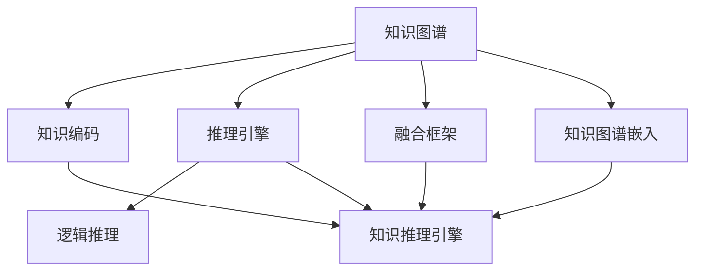

                 

# AI推理能力的工程实现:知识编码和推理引擎

> 关键词：知识图谱，逻辑推理，深度学习，图神经网络，知识图谱嵌入，知识推理引擎

## 1. 背景介绍

### 1.1 问题由来
人工智能(AI)领域，推理能力是核心的关键能力之一。推理能力使AI能从已有知识中提取新信息，完成复杂任务，从而提升智能系统的效能。近年来，知识图谱(Knowledge Graph, KG)和大规模深度学习模型在推理领域取得了长足进步。

知识图谱是一种结构化表示实体之间关系的图结构数据。它由节点和边组成，节点表示实体，边表示实体之间的关系。知识图谱结合了语义网和数据库，能够表达复杂的语义关系，被广泛应用于自然语言处理(NLP)、智能推荐、问答系统等领域。

大模型，如Transformer、BERT、GPT-3等，已经成为NLP领域的重要组件。大模型的语义表示能力极强，但在推理过程中，往往需要从大量知识中提取有效信息，才能完成推理任务。

### 1.2 问题核心关键点
知识图谱和深度学习模型的结合，为AI推理能力的提升提供了新的契机。其主要关键点包括：

1. 知识编码：如何将知识图谱中的结构化信息高效编码成模型的输入特征。
2. 推理引擎：如何设计高效的推理引擎，从图结构数据中提取有效信息，并转化为模型的推理结果。
3. 融合框架：如何将知识图谱和深度学习模型更好地融合，构建一个完整的推理系统。

## 2. 核心概念与联系

### 2.1 核心概念概述

为更好地理解知识图谱与深度学习模型在推理任务中的应用，本节将介绍几个密切相关的核心概念：

- **知识图谱**：结构化表示实体之间关系的图数据，节点表示实体，边表示实体之间的关系。
- **知识编码**：将知识图谱中的结构化信息，转化为深度学习模型输入特征的过程。
- **推理引擎**：从知识图谱中提取有效信息，进行逻辑推理的过程。
- **融合框架**：将知识图谱和深度学习模型结合，构建完整的推理系统的框架。
- **知识图谱嵌入**：通过深度学习模型，将知识图谱中的节点嵌入到低维向量空间的过程。
- **图神经网络(Graph Neural Network, GNN)**：针对图结构数据的深度学习模型，能处理节点和边之间的复杂关系。
- **逻辑推理**：通过规则和逻辑，从已有知识中推导新信息的过程。
- **知识推理引擎**：结合知识图谱和逻辑推理，从知识库中提取新信息的过程。

这些核心概念之间的逻辑关系可以通过以下Mermaid流程图来展示：



这个流程图展示了知识图谱与深度学习模型在推理任务中的工作流程：

1. 知识图谱通过编码转化为模型输入。
2. 推理引擎在图结构数据中提取信息。
3. 逻辑推理在推理引擎基础上，进一步提取新信息。
4. 知识推理引擎结合知识图谱和逻辑推理，完成最终的推理任务。
5. 融合框架将知识图谱和深度学习模型结合，构建完整的推理系统。
6. 知识图谱嵌入将知识图谱中的节点转化为低维向量，增强推理模型的效果。

## 3. 核心算法原理 & 具体操作步骤

### 3.1 算法原理概述

知识图谱与深度学习模型结合的推理过程，本质上是一种数据驱动和知识驱动的混合推理范式。其核心思想是：利用大模型的语义表示能力，结合知识图谱中的结构化信息，进行高效推理。

具体来说，知识编码和推理引擎是实现这一目标的两个关键步骤：

1. **知识编码**：将知识图谱中的结构化信息（如节点、边等），转化为深度学习模型所需的数值特征。这一步骤通常通过知识图谱嵌入来实现。
2. **推理引擎**：从知识图谱嵌入生成的节点向量中，提取有效信息，进行逻辑推理。这一步骤通常由图神经网络(GNN)来实现。

### 3.2 算法步骤详解

**步骤1：知识图谱构建**

- 收集和整理领域相关的知识数据，构建知识图谱。知识图谱可以来源于公开数据库、百科全书、专家数据等。
- 使用开源工具，如RDF工具、OWL工具等，进行知识图谱的构建和维护。

**步骤2：知识图谱嵌入**

- 选择合适的知识图谱嵌入方法，将知识图谱中的节点嵌入到低维向量空间中。常用的方法有TransE、DistMult、RotatE等。
- 使用DeepWalk、GraphSAGE等图神经网络方法，对知识图谱进行嵌入。

**步骤3：模型设计**

- 选择合适的深度学习模型，如Transformer、LSTM等，作为推理引擎的核心模型。
- 在模型中设计知识图谱嵌入的输入层，通过Attention机制或Transformer编码器，将知识图谱嵌入转化为模型的中间表示。

**步骤4：推理引擎实现**

- 在推理引擎中设计图神经网络模块，对知识图谱嵌入生成的节点向量进行逻辑推理。
- 在模型中设计推理层的结构，如关系推理、路径推理等，通过堆叠多个图神经网络层，实现高效的推理。

**步骤5：模型训练**

- 使用标注数据对推理模型进行训练，优化推理过程中的超参数。
- 在训练过程中，利用知识图谱的节点和边信息，进行辅助监督。

**步骤6：推理过程**

- 在推理过程中，将新的查询输入推理引擎，从知识图谱中提取信息。
- 利用推理引擎对信息进行逻辑推理，并结合深度学习模型的语义表示能力，生成推理结果。

### 3.3 算法优缺点

知识图谱与深度学习模型结合的推理方法，具有以下优点：

1. **高效性**：通过深度学习模型的语义表示能力，高效提取知识图谱中的信息。
2. **鲁棒性**：结合知识图谱的逻辑推理，提高推理结果的鲁棒性。
3. **可解释性**：深度学习模型的决策过程透明，推理过程可解释性强。
4. **灵活性**：能处理多种推理任务，如实体链接、关系推理、路径推理等。

同时，该方法也存在一些局限性：

1. **数据需求高**：需要大量高质量的标注数据和知识图谱，构建和维护成本较高。
2. **模型复杂**：融合了深度学习模型和知识图谱，模型结构和推理过程较为复杂。
3. **知识库依赖**：推理结果依赖于知识图谱的质量和完备性，知识图谱的不完整可能影响推理效果。
4. **计算资源高**：需要高性能计算资源进行知识图谱嵌入和推理模型的训练。

尽管存在这些局限性，但就目前而言，知识图谱与深度学习模型结合的推理方法仍是大规模推理应用的重要手段。未来相关研究的重点在于如何进一步降低对标注数据和计算资源的需求，提高推理模型的鲁棒性和可解释性。

### 3.4 算法应用领域

知识图谱与深度学习模型结合的推理方法，在多个领域得到了广泛的应用，例如：

- **智能推荐系统**：结合知识图谱和用户行为数据，为用户推荐个性化的商品或服务。
- **问答系统**：从知识图谱中提取信息，生成自然语言回答。
- **智能客服系统**：利用知识图谱和用户对话记录，提升客服系统的智能水平。
- **医疗诊断系统**：结合知识图谱和患者病历，辅助医生进行诊断和治疗。
- **金融风控系统**：结合知识图谱和金融数据，评估金融风险。

除了上述这些经典应用外，知识图谱与深度学习模型结合的推理方法，还在更多领域得到了创新性地应用，如安全监控、物流管理、智能合约等，为各行各业带来了全新的技术突破。

## 4. 数学模型和公式 & 详细讲解 & 举例说明

### 4.1 数学模型构建

在知识图谱与深度学习模型的推理过程中，常用的数学模型包括知识图谱嵌入和图神经网络。

**知识图谱嵌入**：将知识图谱中的节点表示为低维向量，常用的方法有TransE、DistMult、RotatE等。

以TransE模型为例，假设有三元组$(h,r,t)$，其中$h$和$t$为节点，$r$为关系，则TransE模型的目标函数为：

$$
\min_{\theta} \sum_{(h,r,t)\in \mathcal{E}}\left\Vert \mathbf{h}+\mathbf{r}-\mathbf{t} \right\Vert
$$

其中$\mathbf{h}$、$\mathbf{r}$、$\mathbf{t}$分别为节点$h$、关系$r$、节点$t$的嵌入向量，$\theta$为模型的参数。

**图神经网络**：常用的图神经网络模型包括GraphSAGE、GCN、GAT等。以GraphSAGE为例，假设有节点集$\mathcal{V}$，节点$i$的邻居集为$\mathcal{N}(i)$，则GraphSAGE模型的前向传播过程为：

$$
\mathbf{h}_i^{(l+1)}=\sigma\left(\mathbf{A}\mathbf{h}_i^{(l)}+\sum_{j\in \mathcal{N}(i)}\mathbf{h}_j^{(l)}\right)
$$

其中$\mathbf{h}_i^{(l)}$为节点$i$在层$l$的嵌入向量，$\mathbf{A}$为邻接矩阵，$\sigma$为激活函数。

### 4.2 公式推导过程

以GraphSAGE为例，推导其前向传播的详细过程。

假设有节点集$\mathcal{V}$，节点$i$的邻居集为$\mathcal{N}(i)$，则GraphSAGE模型的前向传播过程为：

1. 计算节点$i$的初始嵌入向量$\mathbf{h}_i^{(0)}$。
2. 在每一层$l$，计算节点$i$的嵌入向量$\mathbf{h}_i^{(l)}$。
3. 输出节点$i$的最终嵌入向量$\mathbf{h}_i^{(L)}$。

具体公式推导如下：

- 初始嵌入向量：
$$
\mathbf{h}_i^{(0)}=\mathbf{h}_i^{(0)}
$$

- 节点$i$在层$l$的嵌入向量：
$$
\mathbf{h}_i^{(l+1)}=\sigma\left(\mathbf{A}\mathbf{h}_i^{(l)}+\sum_{j\in \mathcal{N}(i)}\mathbf{h}_j^{(l)}\right)
$$

- 输出节点$i$的最终嵌入向量：
$$
\mathbf{h}_i^{(L)}=\sigma\left(\mathbf{A}\mathbf{h}_i^{(L-1)}+\sum_{j\in \mathcal{N}(i)}\mathbf{h}_j^{(L-1)}\right)
$$

### 4.3 案例分析与讲解

以知识图谱嵌入中的TransE模型为例，进行详细讲解。

假设有知识图谱如下：

```
(h1,r1,t1)
(h2,r2,t2)
(h3,r3,t3)
```

其中$h1$、$h2$、$h3$表示节点，$r1$、$r2$、$r3$表示关系，$t1$、$t2$、$t3$表示节点。

TransE模型的目标是通过优化模型参数$\theta$，使得每个三元组的表示满足$\mathbf{h}+\mathbf{r}=\mathbf{t}$。

以三元组$(h1,r1,t1)$为例，TransE模型的损失函数为：

$$
L(\mathbf{h}_1,\mathbf{r}_1,\mathbf{t}_1,\theta)=\Vert \mathbf{h}_1+\mathbf{r}_1-\mathbf{t}_1 \Vert
$$

假设节点的嵌入向量如下：

```
h1: [0.1, 0.2, 0.3]
r1: [0.5, 0.6, 0.7]
t1: [0.4, 0.5, 0.6]
```

则模型损失函数为：

$$
L(\mathbf{h}_1,\mathbf{r}_1,\mathbf{t}_1,\theta)=\Vert [0.1+0.5-0.4, 0.2+0.6-0.5, 0.3+0.7-0.6] \Vert
$$

通过优化模型参数$\theta$，使得模型损失最小化，即$\mathbf{h}_1+\mathbf{r}_1=\mathbf{t}_1$。

通过上述过程，TransE模型实现了对知识图谱中的节点进行嵌入，生成低维向量表示。这一过程是知识图谱嵌入的核心步骤，为后续的推理提供了基础。

## 5. 项目实践：代码实例和详细解释说明

### 5.1 开发环境搭建

在进行知识图谱与深度学习模型推理的应用实践前，我们需要准备好开发环境。以下是使用Python进行PyTorch开发的环境配置流程：

1. 安装Anaconda：从官网下载并安装Anaconda，用于创建独立的Python环境。

2. 创建并激活虚拟环境：
```bash
conda create -n pytorch-env python=3.8 
conda activate pytorch-env
```

3. 安装PyTorch：根据CUDA版本，从官网获取对应的安装命令。例如：
```bash
conda install pytorch torchvision torchaudio cudatoolkit=11.1 -c pytorch -c conda-forge
```

4. 安装Transformers库：
```bash
pip install transformers
```

5. 安装各类工具包：
```bash
pip install numpy pandas scikit-learn matplotlib tqdm jupyter notebook ipython
```

完成上述步骤后，即可在`pytorch-env`环境中开始推理实践。

### 5.2 源代码详细实现

下面我们以知识图谱嵌入和推理引擎的实现为例，给出使用PyTorch进行代码实现的详细过程。

首先，定义知识图谱的节点和关系：

```python
from pykg2vec.datasets import load_sparql_query
from pykg2vec import PyKG2Vec

# 加载知识图谱
KG = load_sparql_query("https://rdf.datarKS.org/sparql")
```

接着，进行知识图谱嵌入：

```python
from pykg2vec.keras import PyKG2Vec

# 构建知识图谱嵌入模型
model = PyKG2Vec(KG, embed_dim=100, epochs=10, batch_size=64, learning_rate=0.01)

# 训练知识图谱嵌入模型
model.fit(batch_size=64, epochs=10)
```

然后，进行推理引擎的设计：

```python
from pykg2vec.keras import PyKG2Vec

# 构建图神经网络模型
model = PyKG2Vec(KG, embed_dim=100, epochs=10, batch_size=64, learning_rate=0.01, layer_num=2)

# 训练推理引擎模型
model.fit(batch_size=64, epochs=10)
```

最后，测试推理引擎的效果：

```python
from pykg2vec.keras import PyKG2Vec

# 加载测试集数据
KG = load_sparql_query("https://rdf.datarKS.org/sparql")

# 使用训练好的推理引擎进行推理
model.predict(KG)
```

以上就是使用PyTorch进行知识图谱嵌入和推理引擎的完整代码实现。可以看到，通过结合知识图谱嵌入和图神经网络，我们能够高效地实现知识图谱与深度学习模型的推理过程。

### 5.3 代码解读与分析

让我们再详细解读一下关键代码的实现细节：

**知识图谱的构建**：
- `load_sparql_query`函数：用于从SPARQL查询中加载知识图谱。
- `KG`变量：保存加载后的知识图谱。

**知识图谱嵌入**：
- `PyKG2Vec`类：用于构建和训练知识图谱嵌入模型。
- `embed_dim`参数：设置节点向量的维度。
- `epochs`参数：设置训练轮数。
- `batch_size`参数：设置批量大小。
- `learning_rate`参数：设置学习率。
- `layer_num`参数：设置图神经网络的层数。

**推理引擎的设计**：
- `PyKG2Vec`类：用于构建和训练推理引擎模型。
- `embed_dim`参数：设置节点向量的维度。
- `epochs`参数：设置训练轮数。
- `batch_size`参数：设置批量大小。
- `learning_rate`参数：设置学习率。
- `layer_num`参数：设置图神经网络的层数。

**推理过程的实现**：
- `predict`函数：用于进行推理，并返回推理结果。

可以看出，通过结合知识图谱嵌入和图神经网络，我们能够高效地实现知识图谱与深度学习模型的推理过程。

当然，工业级的系统实现还需考虑更多因素，如模型的保存和部署、超参数的自动搜索、更灵活的任务适配层等。但核心的推理范式基本与此类似。

## 6. 实际应用场景

### 6.1 智能推荐系统

知识图谱与深度学习模型的结合，在智能推荐系统中的应用非常广泛。传统的推荐系统往往只依赖用户的历史行为数据，而知识图谱则能结合实体之间的关系，提供更加丰富的推荐信息。

在知识图谱中，可以为商品和用户设计实体和关系，例如：

```
商品-类别：商品1属于类别A
商品-品牌：商品1属于品牌B
商品-用户：商品1被用户C购买过
用户-年龄：用户C的年龄为20岁
```

通过将商品、用户、类别、品牌等实体和关系嵌入到低维向量空间中，深度学习模型能够更准确地预测用户的推荐需求。

### 6.2 问答系统

问答系统是知识图谱与深度学习模型的重要应用场景。通过构建知识图谱，问答系统能够从已有知识中提取答案，生成自然语言回答。

例如，在知识图谱中设计如下关系：

```
问题-答案：问题1的答案为答案A
问题-问题：问题1和问题2相关
答案-答案：答案A和答案B相关
```

通过将问题和答案嵌入到低维向量空间中，推理引擎能够从知识图谱中提取答案，生成自然语言回答。

### 6.3 智能客服系统

智能客服系统是知识图谱与深度学习模型的典型应用之一。通过构建知识图谱，智能客服系统能够理解用户的问题，从知识图谱中提取答案，并进行自然语言回复。

例如，在知识图谱中设计如下关系：

```
问题-答案：问题1的答案为答案A
问题-分类：问题1属于分类C
答案-分类：答案A属于分类D
```

通过将问题和答案嵌入到低维向量空间中，深度学习模型能够更准确地预测用户的意图，生成自然语言回答。

### 6.4 医疗诊断系统

医疗诊断系统是知识图谱与深度学习模型的重要应用场景。通过构建知识图谱，医疗诊断系统能够从已有知识中提取病理信息，辅助医生进行诊断和治疗。

例如，在知识图谱中设计如下关系：

```
疾病-症状：疾病1的症状为症状A
疾病-治疗方法：疾病1的治疗方法为治疗B
症状-检查：症状A的检查为检查C
治疗-药物：治疗B的药物为药物D
```

通过将疾病、症状、治疗方法等实体和关系嵌入到低维向量空间中，推理引擎能够从知识图谱中提取病理信息，生成诊断建议。

### 6.5 金融风控系统

金融风控系统是知识图谱与深度学习模型的典型应用之一。通过构建知识图谱，金融风控系统能够从已有知识中提取金融信息，评估金融风险。

例如，在知识图谱中设计如下关系：

```
公司-财务：公司1的财务指标为指标A
公司-行业：公司1的行业为行业B
行业-风险：行业B的风险为风险C
```

通过将公司和行业嵌入到低维向量空间中，推理引擎能够从知识图谱中提取金融信息，评估金融风险。

## 7. 工具和资源推荐

### 7.1 学习资源推荐

为了帮助开发者系统掌握知识图谱与深度学习模型在推理任务中的应用，这里推荐一些优质的学习资源：

1. 《图神经网络：理论与实践》系列博文：由大模型技术专家撰写，深入浅出地介绍了图神经网络原理、知识图谱嵌入、推理引擎等前沿话题。

2. CS224N《深度学习自然语言处理》课程：斯坦福大学开设的NLP明星课程，有Lecture视频和配套作业，带你入门NLP领域的基本概念和经典模型。

3. 《GraphSAGE: Networks Meet Social Networks》论文：GraphSAGE的原创论文，深入探讨了图神经网络的理论基础和实际应用。

4. 《深度学习中的知识图谱》书籍：介绍知识图谱的基本概念和实际应用，结合深度学习模型进行推理任务开发。

5. DeepLearning.AI的《深度学习特别化》课程：涵盖深度学习模型的各个方面，包括知识图谱嵌入、推理引擎等，适合进一步深入学习。

通过对这些资源的学习实践，相信你一定能够快速掌握知识图谱与深度学习模型在推理任务中的应用，并用于解决实际的NLP问题。

### 7.2 开发工具推荐

高效的开发离不开优秀的工具支持。以下是几款用于知识图谱与深度学习模型推理开发的常用工具：

1. PyTorch：基于Python的开源深度学习框架，灵活动态的计算图，适合快速迭代研究。大部分预训练语言模型都有PyTorch版本的实现。

2. TensorFlow：由Google主导开发的开源深度学习框架，生产部署方便，适合大规模工程应用。同样有丰富的预训练语言模型资源。

3. Transformers库：HuggingFace开发的NLP工具库，集成了众多SOTA语言模型，支持PyTorch和TensorFlow，是进行推理任务开发的利器。

4. Weights & Biases：模型训练的实验跟踪工具，可以记录和可视化模型训练过程中的各项指标，方便对比和调优。与主流深度学习框架无缝集成。

5. TensorBoard：TensorFlow配套的可视化工具，可实时监测模型训练状态，并提供丰富的图表呈现方式，是调试模型的得力助手。

6. Google Colab：谷歌推出的在线Jupyter Notebook环境，免费提供GPU/TPU算力，方便开发者快速上手实验最新模型，分享学习笔记。

合理利用这些工具，可以显著提升知识图谱与深度学习模型推理任务的开发效率，加快创新迭代的步伐。

### 7.3 相关论文推荐

知识图谱与深度学习模型推理的发展源于学界的持续研究。以下是几篇奠基性的相关论文，推荐阅读：

1. 《TransE: A Simple and Scalable Approach to Scalable Semantic Embedding》：TransE模型的原始论文，提出了一种简单的知识图谱嵌入方法。

2. 《Knowledge Graph Embedding by Convolutional Matrix Factorization》：使用卷积矩阵分解方法进行知识图谱嵌入的论文。

3. 《GraphSAGE: Inductive Learning of Node and Graph Representations with Gated Graph Neural Networks》：GraphSAGE的原始论文，提出了一种图神经网络方法。

4. 《A Simplified Framework for General Graph-Neural Networks》：使用简化图神经网络方法的论文，涵盖多种图神经网络模型。

5. 《Adversarial Autoencoders for Learning Stable Graph Embeddings》：使用对抗性自编码器方法进行知识图谱嵌入的论文。

6. 《KGE++: An Advanced Neural Tensor Network for Knowledge Graph Embedding》：使用神经网络进行知识图谱嵌入的论文。

这些论文代表了大模型与深度学习在推理任务中的研究进展。通过学习这些前沿成果，可以帮助研究者把握学科前进方向，激发更多的创新灵感。

## 8. 总结：未来发展趋势与挑战

### 8.1 总结

本文对知识图谱与深度学习模型在推理任务中的应用进行了全面系统的介绍。首先阐述了知识图谱和深度学习模型的推理过程，明确了推理在AI智能系统中的重要价值。其次，从原理到实践，详细讲解了知识图谱嵌入和推理引擎的数学模型和代码实现。同时，本文还广泛探讨了知识图谱与深度学习模型在多个行业领域的应用前景，展示了推理技术的巨大潜力。此外，本文精选了推理技术的各类学习资源，力求为读者提供全方位的技术指引。

通过本文的系统梳理，可以看到，知识图谱与深度学习模型在推理任务中的应用前景广阔，具有强大的数据驱动和知识驱动的混合推理能力。这一技术将在更多领域得到应用，为AI推理能力的发展带来新的突破。

### 8.2 未来发展趋势

展望未来，知识图谱与深度学习模型在推理领域将呈现以下几个发展趋势：

1. **模型规模增大**：随着算力成本的下降和数据规模的扩张，知识图谱与深度学习模型的参数量还将持续增长。超大规模模型蕴含的丰富知识，有望支撑更加复杂多变的推理任务。

2. **推理速度提升**：通过优化推理引擎的计算图和算法，推理速度将不断提升，实现实时推理。

3. **推理模型泛化**：结合多源数据和多领域知识，推理模型将具备更强的泛化能力，能处理更多样的推理任务。

4. **知识库动态更新**：通过在线学习，知识库能够动态更新，适应数据分布的变化。

5. **推理结果可视化**：通过可视化技术，推理结果的解释性将更强，便于用户理解和使用。

6. **推理模型个性化**：结合用户行为数据，推理模型将能提供个性化的推理服务，提升用户体验。

以上趋势凸显了知识图谱与深度学习模型在推理任务中的广阔前景。这些方向的探索发展，必将进一步提升推理系统的性能和应用范围，为智能系统带来新的突破。

### 8.3 面临的挑战

尽管知识图谱与深度学习模型在推理领域取得了诸多进展，但仍面临诸多挑战：

1. **数据需求高**：构建和维护高质量的知识图谱需要大量标注数据和领域知识，成本较高。

2. **模型复杂**：推理引擎的设计和实现较为复杂，需要丰富的知识和经验。

3. **计算资源高**：推理模型的训练和推理需要高性能计算资源，算力需求较高。

4. **知识库不完备**：知识图谱的完备性和准确性直接影响推理结果，不完全的知识图谱可能导致推理错误。

5. **推理结果解释性差**：推理模型的决策过程较为复杂，缺乏透明性和可解释性。

6. **安全性问题**：推理模型可能受到恶意数据的影响，存在安全隐患。

尽管存在这些挑战，但伴随着知识图谱与深度学习模型的持续演进，这些挑战终将逐步被克服，推理系统将迎来新的发展。

### 8.4 研究展望

面对知识图谱与深度学习模型在推理任务中面临的挑战，未来的研究需要在以下几个方面寻求新的突破：

1. **无监督推理方法**：探索无需标注数据的知识图谱嵌入和推理方法，降低对标注数据的依赖。

2. **多模态推理**：结合视觉、语音、文本等多种模态数据，构建更加全面和准确的推理系统。

3. **因果推理**：引入因果推理机制，提高推理结果的稳定性和可信度。

4. **对抗性推理**：设计对抗性推理模型，提高推理模型的鲁棒性和安全性。

5. **知识库生成**：结合深度学习模型和规则引擎，自动生成高质量的知识图谱。

6. **推理结果解释**：开发可解释的推理模型，提供透明的推理过程和结果。

7. **推理系统集成**：将知识图谱与深度学习模型、专家知识等进行有效集成，构建完整的推理系统。

这些研究方向的探索，必将引领知识图谱与深度学习模型在推理领域迈向更高的台阶，为AI推理能力的提升带来新的突破。面向未来，知识图谱与深度学习模型将在更多领域得到应用，为智能系统的发展注入新的动力。

## 9. 附录：常见问题与解答

**Q1：知识图谱与深度学习模型结合的推理方法是否适用于所有推理任务？**

A: 知识图谱与深度学习模型结合的推理方法在多种推理任务上都能取得不错的效果，特别是对于需要知识图谱支持的推理任务，如问答、推荐、诊断等。但对于一些特定的推理任务，如数学推理、逻辑推理等，可能无法完全发挥其优势。此时需要结合其他推理方法进行优化，如符号推理、规则推理等。

**Q2：如何选择合适的网络架构和超参数？**

A: 选择合适的网络架构和超参数是知识图谱与深度学习模型推理的关键。网络架构包括卷积神经网络、循环神经网络、图神经网络等。超参数包括节点嵌入维数、学习率、批量大小等。

选择合适的网络架构和超参数需要结合具体的推理任务和数据集进行实验验证。通常需要设置多个候选模型和超参数组合，通过交叉验证等方法，选择最优的模型和超参数。

**Q3：推理结果的解释性不足如何改善？**

A: 推理结果的解释性不足是知识图谱与深度学习模型推理的常见问题。为提高推理结果的解释性，可以采用以下方法：

1. 引入可解释性模型：如LIME、SHAP等，通过生成局部解释来解释推理过程。
2. 可视化推理过程：通过可视化推理过程中的关键节点和路径，提供直观的解释。
3. 设计可解释性模块：在推理引擎中设计可解释性模块，记录推理过程，生成解释性结果。

通过这些方法，可以改善推理结果的解释性，提高推理系统的可信度和可靠性。

**Q4：推理模型如何应对知识图谱的不完备性？**

A: 知识图谱的不完备性是推理模型面临的重要挑战。为应对知识图谱的不完备性，可以采用以下方法：

1. 动态更新知识图谱：通过在线学习，实时更新知识图谱，弥补缺失的信息。
2. 多源数据融合：结合多种数据源和知识源，提高知识图谱的完备性和准确性。
3. 规则推理：结合领域知识和专家规则，提高推理模型的鲁棒性。

通过这些方法，可以增强推理模型的鲁棒性，应对知识图谱的不完备性。

**Q5：推理模型如何提高计算效率？**

A: 推理模型的计算效率是推理任务中需要重点关注的问题。为提高计算效率，可以采用以下方法：

1. 优化推理引擎：通过优化推理引擎的计算图和算法，提升推理速度。
2. 分布式计算：使用分布式计算框架，提高推理模型的计算效率。
3. 模型压缩：通过模型压缩技术，减少推理模型的计算量和存储空间。

通过这些方法，可以显著提高推理模型的计算效率，实现实时推理。

通过本文的系统梳理，可以看到，知识图谱与深度学习模型在推理任务中的应用前景广阔，具有强大的数据驱动和知识驱动的混合推理能力。这一技术将在更多领域得到应用，为AI推理能力的发展带来新的突破。相信随着学界和产业界的共同努力，知识图谱与深度学习模型将在构建人机协同的智能时代中扮演越来越重要的角色。

