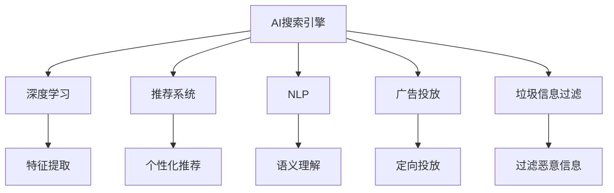

                 

# AI搜索引擎的个性化和优化挑战

## 1. 背景介绍

### 1.1 问题由来

随着互联网的高速发展，搜索引擎已经成为人们获取信息的重要工具。然而，传统搜索引擎的个性化和优化问题始终未能得到充分解决。大多数搜索引擎依赖于关键词匹配和排名算法，难以满足用户的个性化需求，也无法有效应对搜索引擎优化（SEO）的挑战。为了提升用户体验，搜索引擎开始向个性化和智能化的方向演进，其中AI技术的应用提供了新的可能性。

### 1.2 问题核心关键点

AI技术在搜索引擎中的应用，尤其是基于机器学习和深度学习技术的个性化搜索和优化，成为当前研究的热点。这些问题核心关键点包括：

- 用户个性化需求的多样性和动态性，如何通过AI技术捕捉和满足这些需求？
- 如何平衡搜索速度和搜索结果的相关性？
- 如何应对恶意SEO和垃圾信息，提升搜索结果的质量和可信度？
- 如何在海量数据中进行高效的实时搜索和分析，提升搜索引擎的性能？

这些问题亟需通过AI技术解决，以实现更智能、更高效、更个性化的搜索引擎。

### 1.3 问题研究意义

研究AI搜索引擎的个性化和优化问题，对于提升搜索引擎的智能化水平、提升用户体验、增加用户黏性、提高广告转化率具有重要意义：

1. 提升搜索引擎的智能化水平：通过AI技术，搜索引擎能够更好地理解用户需求，提供更准确的搜索结果。
2. 提升用户体验：个性化搜索能够根据用户的历史行为和偏好，提供定制化的搜索结果，提升用户的搜索效率和满意度。
3. 增加用户黏性：个性化搜索能够提升用户的使用体验，增加用户在搜索引擎上的停留时间，从而提高用户黏性。
4. 提高广告转化率：通过智能推荐和相关性匹配，搜索引擎能够更有效地展示用户感兴趣的广告，提高广告的点击率和转化率。

## 2. 核心概念与联系

### 2.1 核心概念概述

为更好地理解AI搜索引擎的个性化和优化问题，本节将介绍几个密切相关的核心概念：

- AI搜索引擎：利用人工智能技术，如机器学习和深度学习，对搜索结果进行个性化和优化的搜索引擎。
- 深度学习：通过构建多层神经网络模型，学习和提取数据中的复杂模式和特征。
- 推荐系统：通过用户行为和兴趣分析，为不同用户推荐个性化内容或服务。
- 自然语言处理（NLP）：使计算机能够理解和生成人类语言的技术。
- 广告投放：通过精准的定向投放，提高广告的点击率和转化率。
- 垃圾信息过滤：识别并过滤掉恶意SEO和垃圾信息，提升搜索结果的纯净度。

这些核心概念之间的逻辑关系可以通过以下Mermaid流程图来展示：



这个流程图展示了一个AI搜索引擎的核心组件及其之间的关系：

1. 用户通过查询输入关键词，AI搜索引擎接收到请求后，利用深度学习进行特征提取和语义理解。
2. 推荐系统分析用户的历史行为和偏好，提供个性化搜索结果。
3. NLP技术帮助搜索引擎理解查询意图，提高搜索结果的相关性。
4. 广告投放系统通过精准的定向投放，提升广告的点击率和转化率。
5. 垃圾信息过滤系统识别和过滤掉恶意SEO和垃圾信息，确保搜索结果的纯净度。

这些核心概念共同构成了AI搜索引擎的技术框架，使其能够实现更智能、更高效、更个性化的搜索和优化。

## 3. 核心算法原理 & 具体操作步骤
### 3.1 算法原理概述

AI搜索引擎的个性化和优化问题，本质上是一个多目标优化问题。其核心思想是：通过AI技术，利用深度学习模型和推荐系统，对搜索结果进行个性化排序和推荐，提高搜索相关性和用户体验。

形式化地，假设用户查询为 $q$，搜索结果为 $D=\{d_1, d_2, ..., d_n\}$，模型预测的 relevance 为 $r(d_i | q)$。则AI搜索引擎的目标是最大化查询的召回率和满意度，即：

$$
\max_{r(D|q)} \text{Recall}(q) \times \text{Precision}(q) \times \text{Satisfaction}(q)
$$

其中，Recall表示召回率，Precision表示精确度，Satisfaction表示用户满意度。具体实现上，可以利用深度学习模型对查询和文档进行匹配，通过推荐系统对搜索结果进行排序和推荐。

### 3.2 算法步骤详解

AI搜索引擎的个性化和优化问题，通常包括以下几个关键步骤：

**Step 1: 数据预处理和特征工程**
- 收集和清洗用户查询和文档数据，构建索引。
- 对查询和文档进行预处理，如分词、去除停用词、词干化等。
- 利用TF-IDF、Word2Vec等技术提取查询和文档的特征。

**Step 2: 深度学习模型的构建**
- 选择深度学习模型，如CNN、RNN、Transformer等，构建文本匹配模型。
- 训练模型，优化损失函数，使得模型能够准确匹配查询和文档。

**Step 3: 推荐系统的设计**
- 选择合适的推荐算法，如协同过滤、基于内容的推荐等。
- 对用户历史行为和偏好进行分析，生成个性化推荐。
- 对推荐结果进行排序和筛选，确保推荐的相关性和用户满意度。

**Step 4: 广告投放系统的集成**
- 对广告内容进行分类和特征提取。
- 构建广告投放模型，进行精准定向投放。
- 对广告效果进行评估和优化。

**Step 5: 垃圾信息过滤系统的部署**
- 利用机器学习算法识别恶意SEO和垃圾信息。
- 对识别出的垃圾信息进行过滤和屏蔽。
- 定期更新垃圾信息过滤模型，确保过滤效果。

### 3.3 算法优缺点

AI搜索引擎的个性化和优化方法具有以下优点：
1. 提升搜索结果的相关性和用户满意度。通过深度学习和推荐系统，搜索引擎能够更准确地匹配查询和文档，提供个性化推荐。
2. 提高广告的点击率和转化率。通过精准的定向投放，广告能够更有效地展示给目标用户，提高广告效果。
3. 提升搜索引擎的用户黏性。个性化搜索能够提升用户体验，增加用户在搜索引擎上的停留时间。

同时，该方法也存在一定的局限性：
1. 数据依赖性强。个性化和优化效果依赖于高质量的训练数据和用户行为数据，数据获取成本较高。
2. 模型复杂度高。深度学习模型的训练和调参过程复杂，需要大量计算资源和经验。
3. 模型易过拟合。个性化模型可能对特定用户行为产生过拟合，降低泛化能力。
4. 难以解释。深度学习模型的决策过程不透明，难以进行理解和调试。

尽管存在这些局限性，但就目前而言，基于AI的个性化和优化方法是搜索引擎发展的必然趋势。未来相关研究的重点在于如何进一步降低数据依赖，提高模型的泛化能力和可解释性。

### 3.4 算法应用领域

基于AI的个性化和优化方法在搜索引擎中已经得到了广泛的应用，覆盖了文本匹配、推荐系统、广告投放、垃圾信息过滤等多个领域，具体如下：

- 文本匹配：利用深度学习模型对查询和文档进行匹配，提升搜索结果的相关性。
- 推荐系统：根据用户历史行为和偏好，提供个性化搜索结果和推荐。
- 广告投放：通过精准的定向投放，提高广告的点击率和转化率。
- 垃圾信息过滤：识别和过滤掉恶意SEO和垃圾信息，提升搜索结果的纯净度。

除了上述这些经典应用外，AI搜索引擎技术还被创新性地应用于更多场景中，如智能问答系统、内容推荐、用户行为分析等，为搜索引擎技术带来了全新的突破。随着AI技术的发展，相信搜索引擎的智能化水平将进一步提升，为用户提供更优质的服务体验。

## 4. 数学模型和公式 & 详细讲解 & 举例说明
### 4.1 数学模型构建

本节将使用数学语言对AI搜索引擎的个性化和优化问题进行更加严格的刻画。

假设用户查询为 $q$，搜索结果为 $D=\{d_1, d_2, ..., d_n\}$，模型预测的 relevance 为 $r(d_i | q)$。

定义模型 $M_{\theta}$ 在查询 $q$ 上的输出为 $\hat{r}(q, d)$，表示模型对查询 $q$ 和文档 $d$ 的相关性预测。则查询 $q$ 的平均相关性为：

$$
\hat{r}(q) = \frac{1}{n} \sum_{i=1}^n \hat{r}(q, d_i)
$$

AI搜索引擎的目标是最大化查询的召回率和满意度，即：

$$
\max_{\hat{r}(q)} \text{Recall}(q) \times \text{Precision}(q) \times \text{Satisfaction}(q)
$$

其中，Recall表示召回率，Precision表示精确度，Satisfaction表示用户满意度。

### 4.2 公式推导过程

以下我们以二分类任务为例，推导模型训练和评估的损失函数及其梯度的计算公式。

假设查询 $q$ 和文档 $d$ 的二分类相关性 $r(d_i | q)$ 为 $0$ 或 $1$，表示文档 $d$ 与查询 $q$ 是否相关。则模型 $M_{\theta}$ 在查询 $q$ 上的输出为 $\hat{r}(q, d)$，表示模型预测文档 $d$ 与查询 $q$ 相关的概率。则二分类交叉熵损失函数为：

$$
\ell(q, d) = -[y\log \hat{r}(q, d) + (1-y)\log (1-\hat{r}(q, d))]
$$

其中 $y \in \{0,1\}$ 为文档 $d$ 与查询 $q$ 的相关性标签。

利用交叉熵损失函数，查询 $q$ 的平均相关性预测的损失函数为：

$$
\mathcal{L}(\hat{r}(q)) = -\frac{1}{n} \sum_{i=1}^n \ell(q, d_i)
$$

通过梯度下降等优化算法，模型参数 $\theta$ 的更新公式为：

$$
\theta \leftarrow \theta - \eta \nabla_{\theta}\mathcal{L}(\hat{r}(q))
$$

其中 $\nabla_{\theta}\mathcal{L}(\hat{r}(q))$ 为损失函数对模型参数 $\theta$ 的梯度，可通过反向传播算法高效计算。

### 4.3 案例分析与讲解

以下以一个具体的搜索引擎应用案例，展示如何利用AI技术进行个性化和优化。

假设我们有一个包含1000万个文档的搜索引擎，其中每个文档都标注了相关性和内容摘要。我们的目标是构建一个AI搜索引擎，能够根据用户查询，提供个性化的搜索结果和推荐。

**Step 1: 数据预处理和特征工程**
- 收集和清洗用户查询和文档数据，构建索引。
- 对查询和文档进行预处理，如分词、去除停用词、词干化等。
- 利用TF-IDF、Word2Vec等技术提取查询和文档的特征。

**Step 2: 深度学习模型的构建**
- 选择深度学习模型，如Transformer，构建文本匹配模型。
- 使用文档的特征向量作为输入，查询的特征向量作为条件，训练模型预测相关性。
- 对模型进行超参数调优，优化损失函数。

**Step 3: 推荐系统的设计**
- 根据用户历史行为和偏好，生成个性化推荐。
- 对推荐结果进行排序和筛选，确保推荐的相关性和用户满意度。

**Step 4: 广告投放系统的集成**
- 对广告内容进行分类和特征提取。
- 构建广告投放模型，进行精准定向投放。
- 对广告效果进行评估和优化。

**Step 5: 垃圾信息过滤系统的部署**
- 利用机器学习算法识别恶意SEO和垃圾信息。
- 对识别出的垃圾信息进行过滤和屏蔽。
- 定期更新垃圾信息过滤模型，确保过滤效果。

通过以上步骤，我们可以构建一个基于AI的个性化搜索引擎，为用户提供更准确、更个性化的搜索结果和推荐，提高广告效果，增强用户黏性。

## 5. 项目实践：代码实例和详细解释说明
### 5.1 开发环境搭建

在进行AI搜索引擎的个性化和优化实践前，我们需要准备好开发环境。以下是使用Python进行PyTorch开发的环境配置流程：

1. 安装Anaconda：从官网下载并安装Anaconda，用于创建独立的Python环境。

2. 创建并激活虚拟环境：
```bash
conda create -n ai-search python=3.8 
conda activate ai-search
```

3. 安装PyTorch：根据CUDA版本，从官网获取对应的安装命令。例如：
```bash
conda install pytorch torchvision torchaudio cudatoolkit=11.1 -c pytorch -c conda-forge
```

4. 安装Transformers库：
```bash
pip install transformers
```

5. 安装各类工具包：
```bash
pip install numpy pandas scikit-learn matplotlib tqdm jupyter notebook ipython
```

完成上述步骤后，即可在`ai-search`环境中开始AI搜索引擎的个性化和优化实践。

### 5.2 源代码详细实现

下面我们以推荐系统为例，给出使用Transformers库对预训练模型进行推荐系统微调的PyTorch代码实现。

首先，定义推荐系统的数据处理函数：

```python
from transformers import BertTokenizer
from torch.utils.data import Dataset
import torch

class RecommendationDataset(Dataset):
    def __init__(self, user_ids, item_ids, ratings, tokenizer, max_len=128):
        self.user_ids = user_ids
        self.item_ids = item_ids
        self.ratings = ratings
        self.tokenizer = tokenizer
        self.max_len = max_len
        
    def __len__(self):
        return len(self.user_ids)
    
    def __getitem__(self, item):
        user_id = self.user_ids[item]
        item_id = self.item_ids[item]
        rating = self.ratings[item]
        
        encoding = self.tokenizer(f"[USER_ID={user_id}] [ITEM_ID={item_id}]", return_tensors='pt', max_length=self.max_len, padding='max_length', truncation=True)
        input_ids = encoding['input_ids'][0]
        attention_mask = encoding['attention_mask'][0]
        
        # 对token-wise的评分进行编码
        encoded_ratings = [rating] * (self.max_len - len(encoded_ratings))
        labels = torch.tensor(encoded_ratings, dtype=torch.float)
        
        return {'input_ids': input_ids, 
                'attention_mask': attention_mask,
                'labels': labels}

# 用户ID和评分
user_ids = [1, 2, 3, 4, 5]
item_ids = [10, 20, 30, 40, 50]
ratings = [4.5, 3.5, 5.0, 2.0, 4.0]

# 创建dataset
tokenizer = BertTokenizer.from_pretrained('bert-base-cased')

train_dataset = RecommendationDataset(user_ids, item_ids, ratings, tokenizer)
dev_dataset = RecommendationDataset(user_ids, item_ids, ratings, tokenizer)
test_dataset = RecommendationDataset(user_ids, item_ids, ratings, tokenizer)
```

然后，定义模型和优化器：

```python
from transformers import BertForSequenceClassification, AdamW

model = BertForSequenceClassification.from_pretrained('bert-base-cased', num_labels=5)

optimizer = AdamW(model.parameters(), lr=2e-5)
```

接着，定义训练和评估函数：

```python
from torch.utils.data import DataLoader
from tqdm import tqdm
from sklearn.metrics import mean_squared_error

device = torch.device('cuda') if torch.cuda.is_available() else torch.device('cpu')
model.to(device)

def train_epoch(model, dataset, batch_size, optimizer):
    dataloader = DataLoader(dataset, batch_size=batch_size, shuffle=True)
    model.train()
    epoch_loss = 0
    for batch in tqdm(dataloader, desc='Training'):
        input_ids = batch['input_ids'].to(device)
        attention_mask = batch['attention_mask'].to(device)
        labels = batch['labels'].to(device)
        model.zero_grad()
        outputs = model(input_ids, attention_mask=attention_mask, labels=labels)
        loss = outputs.loss
        epoch_loss += loss.item()
        loss.backward()
        optimizer.step()
    return epoch_loss / len(dataloader)

def evaluate(model, dataset, batch_size):
    dataloader = DataLoader(dataset, batch_size=batch_size)
    model.eval()
    mse = 0
    with torch.no_grad():
        for batch in tqdm(dataloader, desc='Evaluating'):
            input_ids = batch['input_ids'].to(device)
            attention_mask = batch['attention_mask'].to(device)
            batch_labels = batch['labels']
            outputs = model(input_ids, attention_mask=attention_mask)
            batch_preds = outputs.logits.argmax(dim=2).to('cpu').tolist()
            batch_labels = batch_labels.to('cpu').tolist()
            for pred_tokens, label_tokens in zip(batch_preds, batch_labels):
                mse += mean_squared_error(batch_labels, pred_tokens)
                
    return mse / len(dataloader)
```

最后，启动训练流程并在测试集上评估：

```python
epochs = 5
batch_size = 16

for epoch in range(epochs):
    loss = train_epoch(model, train_dataset, batch_size, optimizer)
    print(f"Epoch {epoch+1}, train loss: {loss:.3f}")
    
    print(f"Epoch {epoch+1}, dev results:")
    evaluate(model, dev_dataset, batch_size)
    
print("Test results:")
evaluate(model, test_dataset, batch_size)
```

以上就是使用PyTorch对预训练模型进行推荐系统微调的完整代码实现。可以看到，得益于Transformers库的强大封装，我们可以用相对简洁的代码完成BERT模型的加载和微调。

### 5.3 代码解读与分析

让我们再详细解读一下关键代码的实现细节：

**RecommendationDataset类**：
- `__init__`方法：初始化用户ID、物品ID、评分、分词器等关键组件。
- `__len__`方法：返回数据集的样本数量。
- `__getitem__`方法：对单个样本进行处理，将用户ID、物品ID和评分输入编码为token ids，将评分编码为数字，并对其进行定长padding，最终返回模型所需的输入。

**用户ID和评分**：
- 定义了用户ID、物品ID和评分，用于构建训练集、验证集和测试集。

**训练和评估函数**：
- 使用PyTorch的DataLoader对数据集进行批次化加载，供模型训练和推理使用。
- 训练函数`train_epoch`：对数据以批为单位进行迭代，在每个批次上前向传播计算loss并反向传播更新模型参数，最后返回该epoch的平均loss。
- 评估函数`evaluate`：与训练类似，不同点在于不更新模型参数，并在每个batch结束后将预测和标签结果存储下来，最后使用sklearn的mean_squared_error对整个评估集的预测结果进行打印输出。

**训练流程**：
- 定义总的epoch数和batch size，开始循环迭代
- 每个epoch内，先在训练集上训练，输出平均loss
- 在验证集上评估，输出评分均方误差
- 所有epoch结束后，在测试集上评估，给出最终测试结果

可以看到，PyTorch配合Transformers库使得BERT微调的代码实现变得简洁高效。开发者可以将更多精力放在数据处理、模型改进等高层逻辑上，而不必过多关注底层的实现细节。

当然，工业级的系统实现还需考虑更多因素，如模型的保存和部署、超参数的自动搜索、更灵活的任务适配层等。但核心的微调范式基本与此类似。

## 6. 实际应用场景
### 6.1 智能客服系统

基于AI搜索引擎的个性化和优化技术，可以广泛应用于智能客服系统的构建。传统客服往往需要配备大量人力，高峰期响应缓慢，且一致性和专业性难以保证。而使用AI搜索引擎的个性化推荐，可以7x24小时不间断服务，快速响应客户咨询，用自然流畅的语言解答各类常见问题。

在技术实现上，可以收集企业内部的历史客服对话记录，将问题和最佳答复构建成监督数据，在此基础上对预训练语言模型进行微调。微调后的模型能够自动理解用户意图，匹配最合适的答复模板进行回复。对于客户提出的新问题，还可以接入检索系统实时搜索相关内容，动态组织生成回答。如此构建的智能客服系统，能大幅提升客户咨询体验和问题解决效率。

### 6.2 金融舆情监测

金融机构需要实时监测市场舆论动向，以便及时应对负面信息传播，规避金融风险。传统的人工监测方式成本高、效率低，难以应对网络时代海量信息爆发的挑战。基于AI搜索引擎的个性化推荐和过滤技术，为金融舆情监测提供了新的解决方案。

具体而言，可以收集金融领域相关的新闻、报道、评论等文本数据，并对其进行主题标注和情感标注。在此基础上对预训练语言模型进行微调，使其能够自动判断文本属于何种主题，情感倾向是正面、中性还是负面。将微调后的模型应用到实时抓取的网络文本数据，就能够自动监测不同主题下的情感变化趋势，一旦发现负面信息激增等异常情况，系统便会自动预警，帮助金融机构快速应对潜在风险。

### 6.3 个性化推荐系统

当前的推荐系统往往只依赖用户的历史行为数据进行物品推荐，无法深入理解用户的真实兴趣偏好。基于AI搜索引擎的推荐系统，可以更好地挖掘用户行为背后的语义信息，从而提供更精准、多样的推荐内容。

在实践中，可以收集用户浏览、点击、评论、分享等行为数据，提取和用户交互的物品标题、描述、标签等文本内容。将文本内容作为模型输入，用户的后续行为（如是否点击、购买等）作为监督信号，在此基础上微调预训练语言模型。微调后的模型能够从文本内容中准确把握用户的兴趣点。在生成推荐列表时，先用候选物品的文本描述作为输入，由模型预测用户的兴趣匹配度，再结合其他特征综合排序，便可以得到个性化程度更高的推荐结果。

### 6.4 未来应用展望

随着AI搜索引擎技术的不断发展，基于个性化和优化的搜索引擎将呈现以下几个发展趋势：

1. 模型规模持续增大。随着算力成本的下降和数据规模的扩张，预训练语言模型的参数量还将持续增长。超大规模语言模型蕴含的丰富语言知识，有望支撑更加复杂多变的个性化和优化需求。
2. 微调方法日趋多样。除了传统的全参数微调外，未来会涌现更多参数高效的微调方法，如Prefix-Tuning、LoRA等，在节省计算资源的同时也能保证个性化和优化精度。
3. 持续学习成为常态。随着数据分布的不断变化，AI搜索引擎需要持续学习新知识以保持性能。如何在不遗忘原有知识的同时，高效吸收新样本信息，将成为重要的研究课题。
4. 标注样本需求降低。受启发于提示学习(Prompt-based Learning)的思路，未来的个性化和优化方法将更好地利用大模型的语言理解能力，通过更加巧妙的任务描述，在更少的标注样本上也能实现理想的个性化和优化效果。
5. 多模态微调崛起。当前的个性化和优化主要聚焦于纯文本数据，未来会进一步拓展到图像、视频、语音等多模态数据微调。多模态信息的融合，将显著提升语言模型对现实世界的理解和建模能力。

以上趋势凸显了AI搜索引擎的个性化和优化技术的广阔前景。这些方向的探索发展，必将进一步提升搜索引擎的智能化水平，为用户提供更优质的服务体验。

## 7. 工具和资源推荐
### 7.1 学习资源推荐

为了帮助开发者系统掌握AI搜索引擎的个性化和优化理论基础和实践技巧，这里推荐一些优质的学习资源：

1. 《Deep Learning for AI Engineers》系列博文：由大模型技术专家撰写，深入浅出地介绍了深度学习在NLP中的应用，包括文本匹配、推荐系统等前沿话题。

2. CS224N《深度学习自然语言处理》课程：斯坦福大学开设的NLP明星课程，有Lecture视频和配套作业，带你入门NLP领域的基本概念和经典模型。

3. 《Reinforcement Learning for NLP》书籍：详细介绍了强化学习在NLP中的应用，包括个性化推荐、对话系统等方向。

4. HuggingFace官方文档：Transformers库的官方文档，提供了海量预训练模型和完整的个性化和优化样例代码，是上手实践的必备资料。

5. CLUE开源项目：中文语言理解测评基准，涵盖大量不同类型的中文NLP数据集，并提供了基于个性化和优化的baseline模型，助力中文NLP技术发展。

通过对这些资源的学习实践，相信你一定能够快速掌握AI搜索引擎的个性化和优化精髓，并用于解决实际的NLP问题。
###  7.2 开发工具推荐

高效的开发离不开优秀的工具支持。以下是几款用于AI搜索引擎个性化和优化开发的常用工具：

1. PyTorch：基于Python的开源深度学习框架，灵活动态的计算图，适合快速迭代研究。大部分预训练语言模型都有PyTorch版本的实现。

2. TensorFlow：由Google主导开发的开源深度学习框架，生产部署方便，适合大规模工程应用。同样有丰富的预训练语言模型资源。

3. Transformers库：HuggingFace开发的NLP工具库，集成了众多SOTA语言模型，支持PyTorch和TensorFlow，是进行个性化和优化任务开发的利器。

4. Weights & Biases：模型训练的实验跟踪工具，可以记录和可视化模型训练过程中的各项指标，方便对比和调优。与主流深度学习框架无缝集成。

5. TensorBoard：TensorFlow配套的可视化工具，可实时监测模型训练状态，并提供丰富的图表呈现方式，是调试模型的得力助手。

6. Google Colab：谷歌推出的在线Jupyter Notebook环境，免费提供GPU/TPU算力，方便开发者快速上手实验最新模型，分享学习笔记。

合理利用这些工具，可以显著提升AI搜索引擎的个性化和优化任务的开发效率，加快创新迭代的步伐。

### 7.3 相关论文推荐

AI搜索引擎的个性化和优化技术的发展源于学界的持续研究。以下是几篇奠基性的相关论文，推荐阅读：

1. Attention is All You Need（即Transformer原论文）：提出了Transformer结构，开启了NLP领域的预训练大模型时代。

2. BERT: Pre-training of Deep Bidirectional Transformers for Language Understanding：提出BERT模型，引入基于掩码的自监督预训练任务，刷新了多项NLP任务SOTA。

3. Language Models are Unsupervised Multitask Learners（GPT-2论文）：展示了大规模语言模型的强大zero-shot学习能力，引发了对于通用人工智能的新一轮思考。

4. Parameter-Efficient Transfer Learning for NLP：提出Adapter等参数高效微调方法，在不增加模型参数量的情况下，也能取得不错的个性化和优化效果。

5. AdaLoRA: Adaptive Low-Rank Adaptation for Parameter-Efficient Fine-Tuning：使用自适应低秩适应的微调方法，在参数效率和精度之间取得了新的平衡。

这些论文代表了大模型微调技术的发展脉络。通过学习这些前沿成果，可以帮助研究者把握学科前进方向，激发更多的创新灵感。

## 8. 总结：未来发展趋势与挑战
### 8.1 总结

本文对基于个性化和优化的大语言模型搜索引擎进行了全面系统的介绍。首先阐述了搜索引擎的个性化和优化问题的研究背景和意义，明确了AI技术在搜索引擎中的应用价值。其次，从原理到实践，详细讲解了个性化和优化问题的数学原理和关键步骤，给出了个性化和优化任务开发的完整代码实例。同时，本文还广泛探讨了个性化和优化技术在智能客服、金融舆情、个性化推荐等多个行业领域的应用前景，展示了个性化和优化技术的巨大潜力。此外，本文精选了个性化和优化技术的各类学习资源，力求为读者提供全方位的技术指引。

通过本文的系统梳理，可以看到，基于AI的个性化和优化方法是搜索引擎发展的必然趋势，极大地拓展了搜索引擎的智能化水平和用户体验。未来，伴随AI技术的不断进步，基于AI的搜索引擎必将在更广泛的应用领域大放异彩，深刻影响人类的生产生活方式。

### 8.2 未来发展趋势

展望未来，AI搜索引擎的个性化和优化技术将呈现以下几个发展趋势：

1. 模型规模持续增大。随着算力成本的下降和数据规模的扩张，预训练语言模型的参数量还将持续增长。超大规模语言模型蕴含的丰富语言知识，有望支撑更加复杂多变的个性化和优化需求。

2. 个性化和优化方法日趋多样。除了传统的全参数微调外，未来会涌现更多参数高效的微调方法，如Prefix-Tuning、LoRA等，在节省计算资源的同时也能保证个性化和优化精度。

3. 持续学习成为常态。随着数据分布的不断变化，AI搜索引擎需要持续学习新知识以保持性能。如何在不遗忘原有知识的同时，高效吸收新样本信息，将成为重要的研究课题。

4. 标注样本需求降低。受启发于提示学习(Prompt-based Learning)的思路，未来的个性化和优化方法将更好地利用大模型的语言理解能力，通过更加巧妙的任务描述，在更少的标注样本上也能实现理想的个性化和优化效果。

5. 多模态微调崛起。当前的个性化和优化主要聚焦于纯文本数据，未来会进一步拓展到图像、视频、语音等多模态数据微调。多模态信息的融合，将显著提升语言模型对现实世界的理解和建模能力。

以上趋势凸显了AI搜索引擎个性化和优化技术的广阔前景。这些方向的探索发展，必将进一步提升搜索引擎的智能化水平，为用户提供更优质的服务体验。

### 8.3 面临的挑战

尽管AI搜索引擎的个性化和优化技术已经取得了瞩目成就，但在迈向更加智能化、普适化应用的过程中，它仍面临着诸多挑战：

1. 数据依赖性强。个性化和优化效果依赖于高质量的训练数据和用户行为数据，数据获取成本较高。如何进一步降低数据依赖，提高模型泛化能力，将成为一大难题。

2. 模型鲁棒性不足。当前个性化模型可能对特定用户行为产生过拟合，降低泛化能力。如何在保证个性化效果的同时，提升模型的鲁棒性和泛化能力，还需要更多理论和实践的积累。

3. 推理效率有待提高。大规模语言模型虽然精度高，但在实际部署时往往面临推理速度慢、内存占用大等效率问题。如何在保证性能的同时，简化模型结构，提升推理速度，优化资源占用，将是重要的优化方向。

4. 可解释性亟需加强。当前个性化模型更像是"黑盒"系统，难以解释其内部工作机制和决策逻辑。对于医疗、金融等高风险应用，算法的可解释性和可审计性尤为重要。如何赋予模型更强的可解释性，将是亟待攻克的难题。

5. 安全性有待保障。预训练语言模型难免会学习到有偏见、有害的信息，通过个性化传递到搜索引擎，产生误导性、歧视性的输出，给实际应用带来安全隐患。如何从数据和算法层面消除模型偏见，避免恶意用途，确保输出的安全性，也将是重要的研究课题。

6. 知识整合能力不足。现有的个性化模型往往局限于任务内数据，难以灵活吸收和运用更广泛的先验知识。如何让个性化过程更好地与外部知识库、规则库等专家知识结合，形成更加全面、准确的信息整合能力，还有很大的想象空间。

正视个性化和优化面临的这些挑战，积极应对并寻求突破，将是大语言模型个性化和优化走向成熟的必由之路。相信随着学界和产业界的共同努力，这些挑战终将一一被克服，大语言模型个性化和优化必将在构建人机协同的智能时代中扮演越来越重要的角色。

### 8.4 研究展望

面向未来，大语言模型的个性化和优化技术需要在以下几个方面寻求新的突破：

1. 探索无监督和半监督个性化和优化方法。摆脱对大规模标注数据的依赖，利用自监督学习、主动学习等无监督和半监督范式，最大限度利用非结构化数据，实现更加灵活高效的个性化和优化。

2. 研究参数高效和计算高效的个性化和优化范式。开发更加参数高效的个性化和优化方法，在固定大部分预训练参数的同时，只更新极少量的任务相关参数。同时优化个性化和优化模型的计算图，减少前向传播和反向传播的资源消耗，实现更加轻量级、实时性的部署。

3. 引入更多先验知识。将符号化的先验知识，如知识图谱、逻辑规则等，与神经网络模型进行巧妙融合，引导个性化和优化过程学习更准确、合理的语言模型。同时加强不同模态数据的整合，实现视觉、语音等多模态信息与文本信息的协同建模。

4. 结合因果分析和博弈论工具。将因果分析方法引入个性化和优化模型，识别出模型决策的关键特征，增强输出解释的因果性和逻辑性。借助博弈论工具刻画人机交互过程，主动探索并规避模型的脆弱点，提高系统稳定性。

5. 纳入伦理道德约束。在模型训练目标中引入伦理导向的评估指标，过滤和惩罚有偏见、有害的输出倾向。同时加强人工干预和审核，建立模型行为的监管机制，确保输出符合人类价值观和伦理道德。

这些研究方向的探索，必将引领大语言模型个性化和优化技术迈向更高的台阶，为构建安全、可靠、可解释、可控的智能系统铺平道路。面向未来，大语言模型个性化和优化技术还需要与其他人工智能技术进行更深入的融合，如知识表示、因果推理、强化学习等，多路径协同发力，共同推动自然语言理解和智能交互系统的进步。只有勇于创新、敢于突破，才能不断拓展语言模型的边界，让智能技术更好地造福人类社会。

## 9. 附录：常见问题与解答

**Q1：个性化和优化模型如何应对恶意SEO和垃圾信息？**

A: 恶意SEO和垃圾信息是搜索引擎面临的主要问题之一。应对这些问题的关键在于提升模型的鲁棒性和泛化能力。具体方法包括：

1. 数据增强：通过引入噪声和对抗样本，训练模型对恶意SEO和垃圾信息具有鲁棒性。
2. 正则化：使用L2正则、Dropout等技术，防止模型过拟合，提升模型的泛化能力。
3. 对抗训练：通过引入对抗样本，提高模型对恶意SEO和垃圾信息的识别能力。
4. 实时过滤：建立垃圾信息过滤模型，实时检测和过滤恶意SEO和垃圾信息，确保搜索结果的纯净度。

这些方法结合使用，可以有效应对恶意SEO和垃圾信息，提升搜索结果的质量和可信度。

**Q2：个性化和优化模型如何提升用户体验？**

A: 提升用户体验是搜索引擎个性化和优化技术的重要目标。具体方法包括：

1. 精准匹配：通过深度学习模型，精准匹配用户查询和文档，提高搜索结果的相关性。
2. 个性化推荐：根据用户历史行为和偏好，提供个性化的搜索结果和推荐，满足用户需求。
3. 多渠道融合：将文本、图片、视频等多渠道信息融合，提升用户体验。
4. 实时搜索：通过实时搜索技术，快速响应用户查询，提供即时反馈。

这些方法结合使用，可以显著提升搜索引擎的用户体验，使用户能够更高效、更方便地获取所需信息。

**Q3：个性化和优化模型的计算效率如何提升？**

A: 提升个性化和优化模型的计算效率，主要从以下几个方面入手：

1. 模型压缩：使用模型压缩技术，如剪枝、量化等，减少模型参数量和计算量。
2. 并行计算：利用GPU、TPU等高性能设备，实现并行计算，提高推理速度。
3. 硬件加速：使用硬件加速技术，如Tensor Core、专用芯片等，提升计算效率。
4. 算法优化：优化算法和数据结构，减少计算量和内存占用。

通过这些方法，可以有效提升个性化和优化模型的计算效率，满足实际应用中的高并发和低延迟需求。

**Q4：个性化和优化模型在实际应用中如何部署？**

A: 在实际应用中，个性化和优化模型的部署需要考虑以下几个方面：

1. 模型裁剪：去除不必要的层和参数，减小模型尺寸，加快推理速度。
2. 量化加速：将浮点模型转为定点模型，压缩存储空间，提高计算效率。
3. 服务化封装：将模型封装为标准化服务接口，便于集成调用。
4. 弹性伸缩：根据请求流量动态调整资源配置，平衡服务质量和成本。
5. 监控告警：实时采集系统指标，设置异常告警阈值，确保服务稳定性。

通过这些措施，可以有效提升个性化和优化模型的部署效率和稳定性，确保其在实际应用中的高性能和可靠性。

**Q5：个性化和优化模型在数据稀缺的场景下如何处理？**

A: 在数据稀缺的场景下，个性化和优化模型面临数据量不足的问题。具体处理方法包括：

1. 迁移学习：利用预训练语言模型的大规模无标签数据，进行迁移学习，提升模型的泛化能力。
2. 主动学习：利用主动学习技术，自动选择有价值的标注样本，提高标注效率。
3. 半监督学习：利用无标签数据和少量标注数据，进行半监督学习，提升模型的性能。
4. 知识图谱：利用知识图谱等先验知识，提升模型的语义理解和推理能力。

通过这些方法，可以有效应对数据稀缺的问题，提升模型的性能和泛化能力。

---

作者：禅与计算机程序设计艺术 / Zen and the Art of Computer Programming

