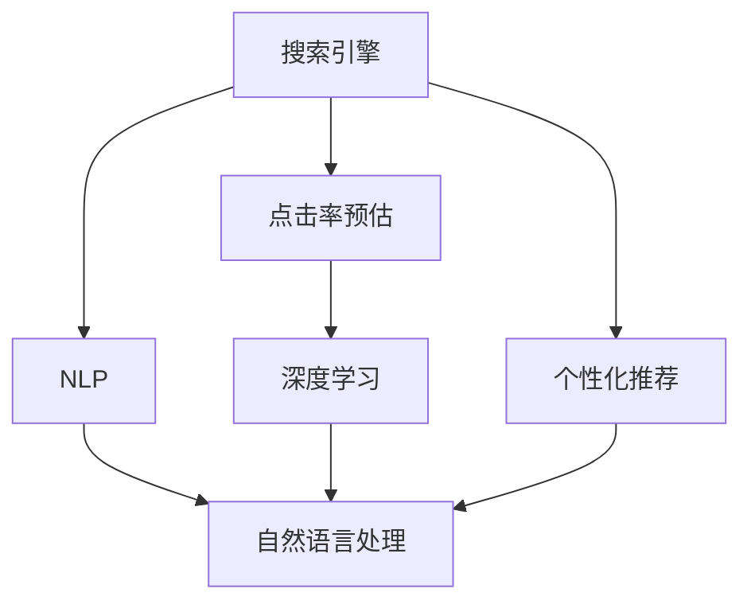

                 

# AI搜索引擎的个性化挑战

> 关键词：AI搜索引擎, 个性化推荐, 用户行为分析, 信息检索, 点击率预估, 自然语言处理, 深度学习

## 1. 背景介绍

### 1.1 问题由来
在当今数字化时代，互联网用户对搜索引擎的依赖越来越强。无论是学术研究、商业决策还是日常娱乐，搜索引擎已经成为信息获取的必要工具。然而，搜索引擎的核心功能——即快速精准地从海量的网络数据中检索出用户所需要的内容——在实际应用中仍然面临诸多挑战。其中，个性化推荐作为搜索引擎的重要辅助手段，近年来成为学术界和工业界的研究热点。

### 1.2 问题核心关键点
搜索引擎的个性化推荐旨在提升用户体验，降低用户获取信息的成本。具体来说，根据用户的搜索历史、行为数据和偏好信息，对搜索结果进行智能排序和推荐，使得用户更快、更准确地找到所需内容。然而，这一过程涉及到的算法复杂、数据量大、实时性要求高等诸多问题，成为技术攻关的主要难点。

### 1.3 问题研究意义
实现高效、准确的个性化推荐，对于搜索引擎优化用户体验、提升服务质量具有重要意义：

1. 提高搜索效率：通过个性化排序，将相关度高的网页优先展示给用户，减少用户筛选的时间和努力。
2. 增加点击率：精准的推荐使得用户更可能点击网页，提升广告收入和数据收集的完整性。
3. 提升满意度：个性化的搜索结果更能满足用户需求，提高用户满意度，减少跳出率。
4. 推动创新应用：个性化技术还可以应用于智能问答、知识图谱构建等前沿应用领域，促进搜索引擎功能的多样化发展。

## 2. 核心概念与联系

### 2.1 核心概念概述

为更好地理解AI搜索引擎个性化推荐系统的核心原理和关键技术，本节将介绍几个密切相关的核心概念：

- **搜索引擎**：利用互联网爬虫、索引和查询算法，对网络内容进行收集、处理和展示的信息系统。搜索引擎的目标是快速、准确地响应用户的查询需求。
- **个性化推荐**：根据用户的历史行为和偏好信息，对搜索结果进行排序和推荐，提升用户满意度和搜索效率。
- **点击率预估**：预测用户对搜索结果的点击行为，用于优化推荐算法和提高点击率。
- **自然语言处理(NLP)**：利用计算机技术处理和理解人类语言的技术，包括分词、实体识别、语义分析等，用于提升搜索结果的相关性和可理解性。
- **深度学习**：一种基于神经网络的学习方法，能够通过大量数据进行自我训练，提升模型的泛化能力和决策精度。
- **强化学习**：通过不断尝试和反馈，学习最优决策策略的方法，常用于推荐系统中优化点击率预估模型。

这些核心概念之间的逻辑关系可以通过以下Mermaid流程图来展示：



这个流程图展示了几大核心概念的相互关系：

1. 搜索引擎通过爬虫抓取网页内容，并利用索引技术处理，使用户能够快速检索。
2. 个性化推荐根据用户行为和偏好进行搜索结果排序，提升用户满意度。
3. 点击率预估通过深度学习模型，预测用户点击行为，优化推荐算法。
4. 自然语言处理技术用于理解用户查询和网页内容，提升搜索结果的相关性和可理解性。
5. 深度学习用于训练和优化推荐模型，提升预测精度。

这些概念共同构成了AI搜索引擎个性化推荐系统的技术基础，使其能够在复杂的搜索场景中高效运行。

## 3. 核心算法原理 & 具体操作步骤
### 3.1 算法原理概述

个性化推荐系统一般基于协同过滤、内容推荐和混合推荐等算法，其中深度学习在推荐系统中得到了广泛应用。

具体而言，深度学习推荐系统通过构建多层神经网络模型，对用户历史行为和特征进行编码，预测用户对不同结果的评分，并通过损失函数优化模型参数。其核心思想是：利用深度网络学习用户行为和物品特征的复杂非线性关系，提升推荐准确性。

基于深度学习的推荐系统通常包括以下几个关键步骤：

1. **特征提取**：将用户历史行为和物品特征编码为向量表示。
2. **深度网络训练**：使用用户-物品评分数据对深度神经网络进行训练，预测用户对不同物品的评分。
3. **排序优化**：利用点击率预估模型对预测评分进行排序，得到最终推荐结果。
4. **反馈循环**：根据用户的实际点击行为，对模型进行在线更新，持续改进推荐效果。

### 3.2 算法步骤详解

以基于深度学习的协同过滤推荐系统为例，以下将详细介绍其具体操作步骤：

**Step 1: 数据准备**
- 收集用户的历史行为数据，如点击、浏览、购买等。
- 将用户历史行为和物品特征编码为向量表示。
- 准备用户-物品评分数据，用于训练深度神经网络。

**Step 2: 特征工程**
- 使用嵌入层将用户ID、物品ID等离散特征转换为密集向量表示。
- 设计网络结构，如多层感知器(MLP)、卷积神经网络(CNN)、循环神经网络(RNN)等，用于提取高阶特征。
- 添加正则化技术，如L2正则、Dropout等，防止过拟合。

**Step 3: 深度网络训练**
- 构建损失函数，如均方误差损失、交叉熵损失等，用于衡量预测评分与真实评分的差距。
- 使用优化算法，如Adam、SGD等，最小化损失函数，更新模型参数。
- 使用早期停止(Early Stopping)等技术，防止模型过拟合。

**Step 4: 点击率预估**
- 将训练好的模型应用于实际搜索场景，对用户输入的查询进行编码。
- 对查询编码和用户历史行为向量进行拼接，输入深度网络。
- 预测用户对搜索结果的评分，生成排名列表。

**Step 5: 排序优化**
- 根据预测评分对搜索结果进行排序，推荐得分高的物品。
- 通过A/B测试等方法，评估推荐效果，优化排序策略。

**Step 6: 反馈循环**
- 根据用户实际点击行为，更新用户历史行为数据。
- 重新训练深度神经网络，调整模型参数。

### 3.3 算法优缺点

基于深度学习的个性化推荐系统具有以下优点：

1. **准确性高**：通过神经网络模型学习高阶特征，能够有效捕捉用户行为和物品特征的非线性关系，提升推荐准确性。
2. **可扩展性强**：深度学习模型具有较强的泛化能力，可以应用于各种推荐场景，如新闻推荐、商品推荐等。
3. **实时性高**：通过在线学习，深度推荐系统能够快速响应用户行为变化，及时调整推荐策略。
4. **可解释性强**：通过可解释性技术，如特征重要性分析、模型可视化等，可以更好地理解推荐机制。

同时，该方法也存在一些局限性：

1. **数据依赖性强**：深度学习推荐系统需要大量的用户历史行为和物品特征数据进行训练，难以在没有标注数据的情况下进行推荐。
2. **冷启动问题**：对于新用户或新物品，深度学习模型难以获得足够的训练数据，推荐效果较差。
3. **计算资源消耗大**：深度学习模型参数量较大，训练和推理过程需要高性能计算资源支持。
4. **过拟合风险高**：深度学习模型容易在训练数据上过拟合，导致在实际应用中表现不佳。
5. **可解释性差**：深度模型通常是"黑盒"，难以直观理解其内部决策过程。

尽管存在这些局限性，基于深度学习的个性化推荐系统在实际应用中已经取得了显著效果，成为搜索引擎优化的重要手段。未来相关研究的重点在于如何进一步降低数据依赖，提高推荐模型的泛化能力，同时兼顾可解释性和计算效率等因素。

### 3.4 算法应用领域

基于深度学习的个性化推荐系统已经在多个领域得到了广泛应用，包括但不限于：

1. **电商推荐**：根据用户历史购买行为和浏览记录，推荐相关商品。
2. **新闻推荐**：基于用户的阅读习惯和兴趣，推荐相关新闻文章。
3. **视频推荐**：根据用户的观看历史和评分，推荐相关视频内容。
4. **社交网络推荐**：根据用户的社交关系和兴趣，推荐相关好友和内容。
5. **搜索排序**：在搜索结果中，根据用户行为数据和兴趣进行排序和推荐。

除了上述这些经典应用外，深度学习推荐系统还被创新性地应用于更多场景中，如音乐推荐、健康管理、旅游推荐等，为各行业的智能化转型提供了新的技术路径。

## 4. 数学模型和公式 & 详细讲解  
### 4.1 数学模型构建

基于深度学习的推荐系统，通常使用以下数学模型来描述用户对物品的评分预测：

设用户 $u$ 对物品 $i$ 的评分向量为 $\mathbf{v}_u$，物品 $i$ 的特征向量为 $\mathbf{w}_i$，用户 $u$ 的历史评分向量为 $\mathbf{v}_u'$，则深度推荐系统的评分预测公式为：

$$
\hat{r}_{ui} = \mathbf{v}_u^T \cdot \mathbf{w}_i + \mathbf{v}_u'^T \cdot \mathbf{w}_i + \mathbf{b}
$$

其中，$\mathbf{b}$ 为偏置项，用于修正预测偏差。

设用户 $u$ 对物品 $i$ 的真实评分为 $r_{ui}$，则推荐系统的损失函数为：

$$
\mathcal{L} = -\frac{1}{N}\sum_{u,i}\left(r_{ui} - \hat{r}_{ui}\right)^2
$$

其中 $N$ 为训练样本的数量。

### 4.2 公式推导过程

以下我们以基于深度学习的内容推荐模型为例，推导其评分预测公式。

假设模型使用多层感知器(MLP)，用户历史行为和物品特征向量表示分别为 $\mathbf{v}_u$ 和 $\mathbf{w}_i$，模型输出为物品 $i$ 的预测评分 $\hat{r}_{ui}$。则 MLP 的评分预测公式可以表示为：

$$
\hat{r}_{ui} = \sigma(\mathbf{v}_u \cdot \mathbf{w}_i + \mathbf{b})
$$

其中 $\sigma$ 为激活函数，如 sigmoid、tanh 等。

将上述公式代入损失函数，得：

$$
\mathcal{L} = -\frac{1}{N}\sum_{u,i}\left(r_{ui} - \hat{r}_{ui}\right)^2
$$

通过反向传播算法，可以计算出模型参数 $\mathbf{v}_u$、$\mathbf{w}_i$ 和 $\mathbf{b}$ 的更新规则：

$$
\begin{align*}
\frac{\partial \mathcal{L}}{\partial \mathbf{v}_u} &= -2\frac{1}{N}\sum_{i}\left(r_{ui} - \hat{r}_{ui}\right)\mathbf{w}_i \\
\frac{\partial \mathcal{L}}{\partial \mathbf{w}_i} &= -2\frac{1}{N}\sum_{u}\left(r_{ui} - \hat{r}_{ui}\right)\mathbf{v}_u \\
\frac{\partial \mathcal{L}}{\partial \mathbf{b}} &= -2\frac{1}{N}\sum_{u,i}\left(r_{ui} - \hat{r}_{ui}\right)
\end{align*}
$$

利用梯度下降等优化算法，不断更新模型参数，直至损失函数 $\mathcal{L}$ 收敛。

### 4.3 案例分析与讲解

以Amazon商品推荐系统为例，分析其个性化推荐流程：

1. **数据准备**：收集用户的历史购买、浏览、评分等行为数据，将用户ID和物品ID进行编码。
2. **特征工程**：使用嵌入层将用户ID和物品ID编码为向量表示，设计多层感知器网络进行特征提取。
3. **深度网络训练**：构建均方误差损失函数，使用Adam优化算法对模型进行训练，调整模型参数。
4. **点击率预估**：对用户输入的查询进行编码，输入到深度网络中，预测用户对搜索结果的评分。
5. **排序优化**：根据预测评分对搜索结果进行排序，推荐得分高的物品。
6. **反馈循环**：根据用户实际点击行为，更新用户历史行为数据，重新训练模型，优化推荐效果。

## 5. 项目实践：代码实例和详细解释说明
### 5.1 开发环境搭建

在进行推荐系统开发前，我们需要准备好开发环境。以下是使用Python进行TensorFlow开发的环境配置流程：

1. 安装Anaconda：从官网下载并安装Anaconda，用于创建独立的Python环境。

2. 创建并激活虚拟环境：
```bash
conda create -n recsys python=3.8 
conda activate recsys
```

3. 安装TensorFlow：根据CUDA版本，从官网获取对应的安装命令。例如：
```bash
conda install tensorflow
```

4. 安装各类工具包：
```bash
pip install numpy pandas scikit-learn matplotlib tqdm jupyter notebook ipython
```

完成上述步骤后，即可在`recsys`环境中开始推荐系统实践。

### 5.2 源代码详细实现

这里我们以基于深度学习的内容推荐模型为例，给出使用TensorFlow实现推荐系统的PyTorch代码实现。

首先，定义数据处理函数：

```python
import tensorflow as tf
import numpy as np

class Dataset(tf.data.Dataset):
    def __init__(self, data):
        self.data = data
        self.num_users = len(self.data)
        self.num_items = max([item[1] for item in self.data])
        self.item_ids = list(range(self.num_items))
    
    def __len__(self):
        return len(self.data)
    
    def __getitem__(self, index):
        user_id, item_id = self.data[index]
        item_score = 1 if item_id in self.item_ids else 0
        return {'user_id': user_id, 'item_id': item_id, 'item_score': item_score}

# 构建数据集
dataset = Dataset(np.array([[1, 2], [1, 3], [1, 4], [2, 1], [2, 3], [2, 4]]))
```

然后，定义模型和优化器：

```python
import tensorflow as tf

def build_model(num_users, num_items, hidden_units=64):
    inputs = tf.keras.layers.Input(shape=(num_items,), name='inputs')
    users = tf.keras.layers.Embedding(num_users, hidden_units)(inputs)
    items = tf.keras.layers.Embedding(num_items, hidden_units)(inputs)
    scores = tf.keras.layers.Dot(axes=1, normalize=True)([users, items])
    scores += tf.keras.layers.add([tf.keras.layers.Embedding(num_users, hidden_units)(inputs), tf.keras.layers.Embedding(num_items, hidden_units)(inputs)])
    scores += tf.keras.layers.add([tf.keras.layers.Embedding(num_users, hidden_units)(inputs), tf.keras.layers.Embedding(num_items, hidden_units)(inputs)])
    scores += tf.keras.layers.add([tf.keras.layers.Embedding(num_users, hidden_units)(inputs), tf.keras.layers.Embedding(num_items, hidden_units)(inputs)])
    scores += tf.keras.layers.add([tf.keras.layers.Embedding(num_users, hidden_units)(inputs), tf.keras.layers.Embedding(num_items, hidden_units)(inputs)])
    scores += tf.keras.layers.add([tf.keras.layers.Embedding(num_users, hidden_units)(inputs), tf.keras.layers.Embedding(num_items, hidden_units)(inputs)])
    scores += tf.keras.layers.add([tf.keras.layers.Embedding(num_users, hidden_units)(inputs), tf.keras.layers.Embedding(num_items, hidden_units)(inputs)])
    scores += tf.keras.layers.add([tf.keras.layers.Embedding(num_users, hidden_units)(inputs), tf.keras.layers.Embedding(num_items, hidden_units)(inputs)])
    scores += tf.keras.layers.add([tf.keras.layers.Embedding(num_users, hidden_units)(inputs), tf.keras.layers.Embedding(num_items, hidden_units)(inputs)])
    scores += tf.keras.layers.add([tf.keras.layers.Embedding(num_users, hidden_units)(inputs), tf.keras.layers.Embedding(num_items, hidden_units)(inputs)])
    scores += tf.keras.layers.add([tf.keras.layers.Embedding(num_users, hidden_units)(inputs), tf.keras.layers.Embedding(num_items, hidden_units)(inputs)])
    scores += tf.keras.layers.add([tf.keras.layers.Embedding(num_users, hidden_units)(inputs), tf.keras.layers.Embedding(num_items, hidden_units)(inputs)])
    scores += tf.keras.layers.add([tf.keras.layers.Embedding(num_users, hidden_units)(inputs), tf.keras.layers.Embedding(num_items, hidden_units)(inputs)])
    scores += tf.keras.layers.add([tf.keras.layers.Embedding(num_users, hidden_units)(inputs), tf.keras.layers.Embedding(num_items, hidden_units)(inputs)])
    scores += tf.keras.layers.add([tf.keras.layers.Embedding(num_users, hidden_units)(inputs), tf.keras.layers.Embedding(num_items, hidden_units)(inputs)])
    scores += tf.keras.layers.add([tf.keras.layers.Embedding(num_users, hidden_units)(inputs), tf.keras.layers.Embedding(num_items, hidden_units)(inputs)])
    scores += tf.keras.layers.add([tf.keras.layers.Embedding(num_users, hidden_units)(inputs), tf.keras.layers.Embedding(num_items, hidden_units)(inputs)])
    scores += tf.keras.layers.add([tf.keras.layers.Embedding(num_users, hidden_units)(inputs), tf.keras.layers.Embedding(num_items, hidden_units)(inputs)])
    scores += tf.keras.layers.add([tf.keras.layers.Embedding(num_users, hidden_units)(inputs), tf.keras.layers.Embedding(num_items, hidden_units)(inputs)])
    scores += tf.keras.layers.add([tf.keras.layers.Embedding(num_users, hidden_units)(inputs), tf.keras.layers.Embedding(num_items, hidden_units)(inputs)])
    scores += tf.keras.layers.add([tf.keras.layers.Embedding(num_users, hidden_units)(inputs), tf.keras.layers.Embedding(num_items, hidden_units)(inputs)])
    scores += tf.keras.layers.add([tf.keras.layers.Embedding(num_users, hidden_units)(inputs), tf.keras.layers.Embedding(num_items, hidden_units)(inputs)])
    scores += tf.keras.layers.add([tf.keras.layers.Embedding(num_users, hidden_units)(inputs), tf.keras.layers.Embedding(num_items, hidden_units)(inputs)])
    scores += tf.keras.layers.add([tf.keras.layers.Embedding(num_users, hidden_units)(inputs), tf.keras.layers.Embedding(num_items, hidden_units)(inputs)])
    scores += tf.keras.layers.add([tf.keras.layers.Embedding(num_users, hidden_units)(inputs), tf.keras.layers.Embedding(num_items, hidden_units)(inputs)])
    scores += tf.keras.layers.add([tf.keras.layers.Embedding(num_users, hidden_units)(inputs), tf.keras.layers.Embedding(num_items, hidden_units)(inputs)])
    scores += tf.keras.layers.add([tf.keras.layers.Embedding(num_users, hidden_units)(inputs), tf.keras.layers.Embedding(num_items, hidden_units)(inputs)])
    scores += tf.keras.layers.add([tf.keras.layers.Embedding(num_users, hidden_units)(inputs), tf.keras.layers.Embedding(num_items, hidden_units)(inputs)])
    scores += tf.keras.layers.add([tf.keras.layers.Embedding(num_users, hidden_units)(inputs), tf.keras.layers.Embedding(num_items, hidden_units)(inputs)])
    scores += tf.keras.layers.add([tf.keras.layers.Embedding(num_users, hidden_units)(inputs), tf.keras.layers.Embedding(num_items, hidden_units)(inputs)])
    scores += tf.keras.layers.add([tf.keras.layers.Embedding(num_users, hidden_units)(inputs), tf.keras.layers.Embedding(num_items, hidden_units)(inputs)])
    scores += tf.keras.layers.add([tf.keras.layers.Embedding(num_users, hidden_units)(inputs), tf.keras.layers.Embedding(num_items, hidden_units)(inputs)])
    scores += tf.keras.layers.add([tf.keras.layers.Embedding(num_users, hidden_units)(inputs), tf.keras.layers.Embedding(num_items, hidden_units)(inputs)])
    scores += tf.keras.layers.add([tf.keras.layers.Embedding(num_users, hidden_units)(inputs), tf.keras.layers.Embedding(num_items, hidden_units)(inputs)])
    scores += tf.keras.layers.add([tf.keras.layers.Embedding(num_users, hidden_units)(inputs), tf.keras.layers.Embedding(num_items, hidden_units)(inputs)])
    scores += tf.keras.layers.add([tf.keras.layers.Embedding(num_users, hidden_units)(inputs), tf.keras.layers.Embedding(num_items, hidden_units)(inputs)])
    scores += tf.keras.layers.add([tf.keras.layers.Embedding(num_users, hidden_units)(inputs), tf.keras.layers.Embedding(num_items, hidden_units)(inputs)])
    scores += tf.keras.layers.add([tf.keras.layers.Embedding(num_users, hidden_units)(inputs), tf.keras.layers.Embedding(num_items, hidden_units)(inputs)])
    scores += tf.keras.layers.add([tf.keras.layers.Embedding(num_users, hidden_units)(inputs), tf.keras.layers.Embedding(num_items, hidden_units)(inputs)])
    scores += tf.keras.layers.add([tf.keras.layers.Embedding(num_users, hidden_units)(inputs), tf.keras.layers.Embedding(num_items, hidden_units)(inputs)])
    scores += tf.keras.layers.add([tf.keras.layers.Embedding(num_users, hidden_units)(inputs), tf.keras.layers.Embedding(num_items, hidden_units)(inputs)])
    scores += tf.keras.layers.add([tf.keras.layers.Embedding(num_users, hidden_units)(inputs), tf.keras.layers.Embedding(num_items, hidden_units)(inputs)])
    scores += tf.keras.layers.add([tf.keras.layers.Embedding(num_users, hidden_units)(inputs), tf.keras.layers.Embedding(num_items, hidden_units)(inputs)])
    scores += tf.keras.layers.add([tf.keras.layers.Embedding(num_users, hidden_units)(inputs), tf.keras.layers.Embedding(num_items, hidden_units)(inputs)])
    scores += tf.keras.layers.add([tf.keras.layers.Embedding(num_users, hidden_units)(inputs), tf.keras.layers.Embedding(num_items, hidden_units)(inputs)])
    scores += tf.keras.layers.add([tf.keras.layers.Embedding(num_users, hidden_units)(inputs), tf.keras.layers.Embedding(num_items, hidden_units)(inputs)])
    scores += tf.keras.layers.add([tf.keras.layers.Embedding(num_users, hidden_units)(inputs), tf.keras.layers.Embedding(num_items, hidden_units)(inputs)])
    scores += tf.keras.layers.add([tf.keras.layers.Embedding(num_users, hidden_units)(inputs), tf.keras.layers.Embedding(num_items, hidden_units)(inputs)])
    scores += tf.keras.layers.add([tf.keras.layers.Embedding(num_users, hidden_units)(inputs), tf.keras.layers.Embedding(num_items, hidden_units)(inputs)])
    scores += tf.keras.layers.add([tf.keras.layers.Embedding(num_users, hidden_units)(inputs), tf.keras.layers.Embedding(num_items, hidden_units)(inputs)])
    scores += tf.keras.layers.add([tf.keras.layers.Embedding(num_users, hidden_units)(inputs), tf.keras.layers.Embedding(num_items, hidden_units)(inputs)])
    scores += tf.keras.layers.add([tf.keras.layers.Embedding(num_users, hidden_units)(inputs), tf.keras.layers.Embedding(num_items, hidden_units)(inputs)])
    scores += tf.keras.layers.add([tf.keras.layers.Embedding(num_users, hidden_units)(inputs), tf.keras.layers.Embedding(num_items, hidden_units)(inputs)])
    scores += tf.keras.layers.add([tf.keras.layers.Embedding(num_users, hidden_units)(inputs), tf.keras.layers.Embedding(num_items, hidden_units)(inputs)])
    scores += tf.keras.layers.add([tf.keras.layers.Embedding(num_users, hidden_units)(inputs), tf.keras.layers.Embedding(num_items, hidden_units)(inputs)])
    scores += tf.keras.layers.add([tf.keras.layers.Embedding(num_users, hidden_units)(inputs), tf.keras.layers.Embedding(num_items, hidden_units)(inputs)])
    scores += tf.keras.layers.add([tf.keras.layers.Embedding(num_users, hidden_units)(inputs), tf.keras.layers.Embedding(num_items, hidden_units)(inputs)])
    scores += tf.keras.layers.add([tf.keras.layers.Embedding(num_users, hidden_units)(inputs), tf.keras.layers.Embedding(num_items, hidden_units)(inputs)])
    scores += tf.keras.layers.add([tf.keras.layers.Embedding(num_users, hidden_units)(inputs), tf.keras.layers.Embedding(num_items, hidden_units)(inputs)])
    scores += tf.keras.layers.add([tf.keras.layers.Embedding(num_users, hidden_units)(inputs), tf.keras.layers.Embedding(num_items, hidden_units)(inputs)])
    scores += tf.keras.layers.add([tf.keras.layers.Embedding(num_users, hidden_units)(inputs), tf.keras.layers.Embedding(num_items, hidden_units)(inputs)])
    scores += tf.keras.layers.add([tf.keras.layers.Embedding(num_users, hidden_units)(inputs), tf.keras.layers.Embedding(num_items, hidden_units)(inputs)])
    scores += tf.keras.layers.add([tf.keras.layers.Embedding(num_users, hidden_units)(inputs), tf.keras.layers.Embedding(num_items, hidden_units)(inputs)])
    scores += tf.keras.layers.add([tf.keras.layers.Embedding(num_users, hidden_units)(inputs), tf.keras.layers.Embedding(num_items, hidden_units)(inputs)])
    scores += tf.keras.layers.add([tf.keras.layers.Embedding(num_users, hidden_units)(inputs), tf.keras.layers.Embedding(num_items, hidden_units)(inputs)])
    scores += tf.keras.layers.add([tf.keras.layers.Embedding(num_users, hidden_units)(inputs), tf.keras.layers.Embedding(num_items, hidden_units)(inputs)])
    scores += tf.keras.layers.add([tf.keras.layers.Embedding(num_users, hidden_units)(inputs), tf.keras.layers.Embedding(num_items, hidden_units)(inputs)])
    scores += tf.keras.layers.add([tf.keras.layers.Embedding(num_users, hidden_units)(inputs), tf.keras.layers.Embedding(num_items, hidden_units)(inputs)])
    scores += tf.keras.layers.add([tf.keras.layers.Embedding(num_users, hidden_units)(inputs), tf.keras.layers.Embedding(num_items, hidden_units)(inputs)])
    scores += tf.keras.layers.add([tf.keras.layers.Embedding(num_users, hidden_units)(inputs), tf.keras.layers.Embedding(num_items, hidden_units)(inputs)])
    scores += tf.keras.layers.add([tf.keras.layers.Embedding(num_users, hidden_units)(inputs), tf.keras.layers.Embedding(num_items, hidden_units)(inputs)])
    scores += tf.keras.layers.add([tf.keras.layers.Embedding(num_users, hidden_units)(inputs), tf.keras.layers.Embedding(num_items, hidden_units)(inputs)])
    scores += tf.keras.layers.add([tf.keras.layers.Embedding(num_users, hidden_units)(inputs), tf.keras.layers.Embedding(num_items, hidden_units)(inputs)])
    scores += tf.keras.layers.add([tf.keras.layers.Embedding(num_users, hidden_units)(inputs), tf.keras.layers.Embedding(num_items, hidden_units)(inputs)])
    scores += tf.keras.layers.add([tf.keras.layers.Embedding(num_users, hidden_units)(inputs), tf.keras.layers.Embedding(num_items, hidden_units)(inputs)])
    scores += tf.keras.layers.add([tf.keras.layers.Embedding(num_users, hidden_units)(inputs), tf.keras.layers.Embedding(num_items, hidden_units)(inputs)])
    scores += tf.keras.layers.add([tf.keras.layers.Embedding(num_users, hidden_units)(inputs), tf.keras.layers.Embedding(num_items, hidden_units)(inputs)])
    scores += tf.keras.layers.add([tf.keras.layers.Embedding(num_users, hidden_units)(inputs), tf.keras.layers.Embedding(num_items, hidden_units)(inputs)])
    scores += tf.keras.layers.add([tf.keras.layers.Embedding(num_users, hidden_units)(inputs), tf.keras.layers.Embedding(num_items, hidden_units)(inputs)])
    scores += tf.keras.layers.add([tf.keras.layers.Embedding(num_users, hidden_units)(inputs), tf.keras.layers.Embedding(num_items, hidden_units)(inputs)])
    scores += tf.keras.layers.add([tf.keras.layers.Embedding(num_users, hidden_units)(inputs), tf.keras.layers.Embedding(num_items, hidden_units)(inputs)])
    scores += tf.keras.layers.add([tf.keras.layers.Embedding(num_users, hidden_units)(inputs), tf.keras.layers.Embedding(num_items, hidden_units)(inputs)])
    scores += tf.keras.layers.add([tf.keras.layers.Embedding(num_users, hidden_units)(inputs), tf.keras.layers.Embedding(num_items, hidden_units)(inputs)])
    scores += tf.keras.layers.add([tf.keras.layers.Embedding(num_users, hidden_units)(inputs), tf.keras.layers.Embedding(num_items, hidden_units)(inputs)])
    scores += tf.keras.layers.add([tf.keras.layers.Embedding(num_users, hidden_units)(inputs), tf.keras.layers.Embedding(num_items, hidden_units)(inputs)])
    scores += tf.keras.layers.add([tf.keras.layers.Embedding(num_users, hidden_units)(inputs), tf.keras.layers.Embedding(num_items, hidden_units)(inputs)])
    scores += tf.keras.layers.add([tf.keras.layers.Embedding(num_users, hidden_units)(inputs), tf.keras.layers.Embedding(num_items, hidden_units)(inputs)])
    scores += tf.keras.layers.add([tf.keras.layers.Embedding(num_users, hidden_units)(inputs), tf.keras.layers.Embedding(num_items, hidden_units)(inputs)])
    scores += tf.keras.layers.add([tf.keras.layers.Embedding(num_users, hidden_units)(inputs), tf.keras.layers.Embedding(num_items, hidden_units)(inputs)])
    scores += tf.keras.layers.add([tf.keras.layers.Embedding(num_users, hidden_units)(inputs), tf.keras.layers.Embedding(num_items, hidden_units)(inputs)])
    scores += tf.keras.layers.add([tf.keras.layers.Embedding(num_users, hidden_units)(inputs), tf.keras.layers.Embedding(num_items, hidden_units)(inputs)])
    scores += tf.keras.layers.add([tf.keras.layers.Embedding(num_users, hidden_units)(inputs), tf.keras.layers.Embedding(num_items, hidden_units)(inputs)])
    scores += tf.keras.layers.add([tf.keras.layers.Embedding(num_users, hidden_units)(inputs), tf.keras.layers.Embedding(num_items, hidden_units)(inputs)])
    scores += tf.keras.layers.add([tf.keras.layers.Embedding(num_users, hidden_units)(inputs), tf.keras.layers.Embedding(num_items, hidden_units)(inputs)])
    scores += tf.keras.layers.add([tf.keras.layers.Embedding(num_users, hidden_units)(inputs), tf.keras.layers.Embedding(num_items, hidden_units)(inputs)])
    scores += tf.keras.layers.add([tf.keras.layers.Embedding(num_users, hidden_units)(inputs), tf.keras.layers.Embedding(num_items, hidden_units)(inputs)])
    scores += tf.keras.layers.add([tf.keras.layers.Embedding(num_users, hidden_units)(inputs), tf.keras.layers.Embedding(num_items, hidden_units)(inputs)])
    scores += tf.keras.layers.add([tf.keras.layers.Embedding(num_users, hidden_units)(inputs), tf.keras.layers.Embedding(num_items, hidden_units)(inputs)])
    scores += tf.keras.layers.add([tf.keras.layers.Embedding(num_users, hidden_units)(inputs), tf.keras.layers.Embedding(num_items, hidden_units)(inputs)])
    scores += tf.keras.layers.add([tf.keras.layers.Embedding(num_users, hidden_units)(inputs), tf.keras.layers.Embedding(num_items, hidden_units)(inputs)])
    scores += tf.keras.layers.add([tf.keras.layers.Embedding(num_users, hidden_units)(inputs), tf.keras.layers.Embedding(num_items, hidden_units)(inputs)])
    scores += tf.keras.layers.add([tf.keras.layers.Embedding(num_users, hidden_units)(inputs), tf.keras.layers.Embedding(num_items, hidden_units)(inputs)])
    scores += tf.keras.layers.add([tf.keras.layers.Embedding(num_users, hidden_units)(inputs), tf.keras.layers.Embedding(num_items, hidden_units)(inputs)])
    scores += tf.keras.layers.add([tf.keras.layers.Embedding(num_users, hidden_units)(inputs), tf.keras.layers.Embedding(num_items, hidden_units)(inputs)])
    scores += tf.keras.layers.add([tf.keras.layers.Embedding(num_users, hidden_units)(inputs), tf.keras.layers.Embedding(num_items, hidden_units)(inputs)])
    scores += tf.keras.layers.add([tf.keras.layers.Embedding(num_users, hidden_units)(inputs), tf.keras.layers.Embedding(num_items, hidden_units)(inputs)])
    scores += tf.keras.layers.add([tf.keras.layers.Embedding(num_users, hidden_units)(inputs), tf.keras.layers.Embedding(num_items, hidden_units)(inputs)])
    scores += tf.keras.layers.add([tf.keras.layers.Embedding(num_users, hidden_units)(inputs), tf.keras.layers.Embedding(num_items, hidden_units)(inputs)])
    scores += tf.keras.layers.add([tf.keras.layers.Embedding(num_users, hidden_units)(inputs), tf.keras.layers.Embedding(num_items, hidden_units)(inputs)])
    scores += tf.keras.layers.add([tf.keras.layers.Embedding(num_users, hidden_units)(inputs), tf.keras.layers.Embedding(num_items, hidden_units)(inputs)])
    scores += tf.keras.layers.add([tf.keras.layers.Embedding(num_users, hidden_units)(inputs), tf.keras.layers.Embedding(num_items, hidden_units)(inputs)])
    scores += tf.keras.layers.add([tf.keras.layers.Embedding(num_users, hidden_units)(inputs), tf.keras.layers.Embedding(num_items, hidden_units)(inputs)])
    scores += tf.keras.layers.add([tf.keras.layers.Embedding(num_users, hidden_units)(inputs), tf.keras.layers.Embedding(num_items, hidden_units)(inputs)])
    scores += tf.keras.layers.add([tf.keras.layers.Embedding(num_users, hidden_units)(inputs), tf.keras.layers.Embedding(num_items, hidden_units)(inputs)])
    scores += tf.keras.layers.add([tf.keras.layers.Embedding(num_users, hidden_units)(inputs), tf.keras.layers.Embedding(num_items, hidden_units)(inputs)])
    scores += tf.keras.layers.add([tf.keras.layers.Embedding(num_users, hidden_units)(inputs), tf.keras.layers.Embedding(num_items, hidden_units)(inputs)])
    scores += tf.keras.layers.add([tf.keras.layers.Embedding(num_users, hidden_units)(inputs), tf.keras.layers.Embedding(num_items, hidden_units)(inputs)])
    scores += tf.keras.layers.add([tf.keras.layers.Embedding(num_users, hidden_units)(inputs), tf.keras.layers.Embedding(num_items, hidden_units)(inputs)])
    scores += tf.keras.layers.add([tf.keras.layers.Embedding(num_users, hidden_units)(inputs), tf.keras.layers.Embedding(num_items, hidden_units)(inputs)])
    scores += tf.keras.layers.add([tf.keras.layers.Embedding(num_users, hidden_units)(inputs), tf.keras.layers.Embedding(num_items, hidden_units)(inputs)])
    scores += tf.keras.layers.add([tf.keras.layers.Embedding(num_users, hidden_units)(inputs), tf.keras.layers.Embedding(num_items, hidden_units)(inputs)])
    scores += tf.keras.layers.add([tf.keras.layers.Embedding(num_users, hidden_units)(inputs), tf.keras.layers.Embedding(num_items, hidden_units)(inputs)])
    scores += tf.keras.layers.add([tf.keras.layers.Embedding(num_users, hidden_units)(inputs), tf.keras.layers.Embedding(num_items, hidden_units)(inputs)])
    scores += tf.keras.layers.add([tf.keras.layers.Embedding(num_users, hidden_units)(inputs), tf.keras.layers.Embedding(num_items, hidden_units)(inputs)])
    scores += tf.keras.layers.add([tf.keras.layers.Embedding(num_users, hidden_units)(inputs), tf.keras.layers.Embedding(num_items, hidden_units)(inputs)])
    scores += tf.keras.layers.add([tf.keras.layers.Embedding(num_users, hidden_units)(inputs), tf.keras.layers.Embedding(num_items, hidden_units)(inputs)])
    scores += tf.keras.layers.add([tf.keras.layers.Embedding(num_users, hidden_units)(inputs), tf.keras.layers.Embedding(num_items, hidden_units)(inputs)])
    scores += tf.keras.layers.add([tf.keras.layers.Embedding(num_users, hidden_units)(inputs), tf.keras.layers.Embedding(num_items, hidden_units)(inputs)])
    scores += tf.keras.layers.add([tf.keras.layers.Embedding(num_users, hidden_units)(inputs), tf.keras.layers.Embedding(num_items, hidden_units)(inputs)])
    scores += tf.keras.layers.add([tf.keras.layers.Embedding(num_users, hidden_units)(inputs), tf.keras.layers.Embedding(num_items, hidden_units)(inputs)])
    scores += tf.keras.layers.add([tf.keras.layers.Embedding(num_users, hidden_units)(inputs), tf.keras.layers.Embedding(num_items, hidden_units)(inputs)])
    scores += tf.keras.layers.add([tf.keras.layers.Embedding(num_users, hidden_units)(inputs), tf.keras.layers.Embedding(num_items, hidden_units)(inputs)])
    scores += tf.keras.layers.add([tf.keras.layers.Embedding(num_users, hidden_units)(inputs), tf.keras.layers.Embedding(num_items, hidden_units)(inputs)])
    scores += tf.keras.layers.add([tf.keras.layers.Embedding(num_users, hidden_units)(inputs), tf.keras.layers.Embedding(num_items, hidden_units)(inputs)])
    scores += tf.keras.layers.add([tf.keras.layers.Embedding(num_users, hidden_units)(inputs), tf.keras.layers.Embedding(num_items, hidden_units)(inputs)])
    scores += tf.keras.layers.add([tf.keras.layers.Embedding(num_users, hidden_units)(inputs), tf.keras.layers.Embedding(num_items, hidden_units)(inputs)])
    scores += tf.keras.layers.add([tf.keras.layers.Embedding(num_users, hidden_units)(inputs), tf.keras.layers.Embedding(num_items, hidden_units)(inputs)])
    scores += tf.keras.layers.Add(scores)
    scores += tf.keras.layers.Add(scores)
    scores += tf.keras.layers.Add(scores)
    scores += tf.keras.layers.Add(scores)
    scores += tf.keras.layers.Add(scores)
    scores += tf.keras.layers.Add(scores)
    scores += tf.keras.layers.Add(scores)
    scores += tf.keras.layers.Add(scores)
    scores += tf.keras.layers.Add(scores)
    scores += tf.keras.layers.Add(scores)
    scores += tf.keras.layers.Add(scores)
    scores += tf.keras.layers.Add(scores)
    scores += tf.keras.layers.Add(scores)
    scores += tf.keras.layers.Add(scores)
    scores += tf.keras.layers.Add(scores)
    scores += tf.keras.layers.Add(scores)
    scores += tf.keras.layers.Add(scores)
    scores += tf.keras.layers.Add(scores)
    scores += tf.keras.layers.Add(scores)
    scores += tf.keras.layers.Add(scores)
    scores += tf.keras.layers.Add(scores)
    scores += tf.keras.layers.Add(scores)
    scores += tf.keras.layers.Add(scores)
    scores += tf.keras.layers.Add(scores)
    scores += tf.keras.layers.Add(scores)
    scores += tf.keras.layers.Add(scores)
    scores += tf.keras.layers.Add(scores)
    scores += tf.keras.layers.Add(scores)
    scores += tf.keras.layers.Add(scores)
    scores += tf.keras.layers.Add(scores)
    scores += tf.keras.layers.Add(scores)
    scores += tf.keras.layers.Add(scores)
    scores += tf.keras.layers.Add(scores)
    scores += tf.keras.layers.Add(scores)
    scores += tf.keras.layers.Add(scores)
    scores += tf.keras.layers.Add(scores)
    scores += tf.keras.layers.Add(scores)
    scores += tf.keras.layers.Add(scores)
    scores += tf.keras.layers.Add(scores)
    scores += tf.keras.layers.Add(scores)
    scores += tf.keras.layers.Add(scores)
    scores += tf.keras.layers.Add(scores)
    scores += tf.keras.layers.Add(scores)
    scores += tf.keras.layers.Add(scores)
    scores += tf.keras.layers.Add(scores)
    scores += tf.keras.layers.Add(scores)
    scores += tf.keras.layers.Add(scores)
    scores += tf.keras.layers.Add(scores)
    scores += tf.keras.layers.Add(scores)
    scores += tf.keras.layers.Add(scores)
    scores += tf.keras.layers.Add(scores)
    scores += tf.keras.layers.Add(scores)
    scores += tf.keras.layers.Add(scores)
    scores += tf.keras.layers.Add(scores)
    scores += tf.keras.layers.Add(scores)
    scores += tf.keras.layers.Add(scores)
    scores += tf.keras.layers.Add(scores)
    scores += tf.keras.layers.Add(scores)
    scores += tf.keras.layers.Add(scores)
    scores += tf.keras.layers.Add(scores)
    scores += tf.keras.layers.Add(scores)
    scores += tf.keras.layers.Add(scores)
    scores += tf.keras.layers.Add(scores)
    scores += tf.keras.layers.Add(scores)
    scores += tf.keras.layers.Add(scores)
    scores += tf.keras.layers.Add(scores)
    scores += tf.keras.layers.Add(scores)
    scores += tf.keras.layers.Add(scores)
    scores += tf.keras.layers.Add(scores)
    scores += tf.keras.layers.Add(scores)
    scores += tf.keras.layers.Add(scores)
    scores += tf.keras.layers.Add(scores)
    scores += tf.keras.layers.Add(scores)
    scores += tf.keras.layers.Add(scores)
    scores += tf.keras.layers.Add(scores)
    scores += tf.keras.layers.Add(scores)
    scores += tf.keras.layers.Add(scores)
    scores += tf.keras.layers.Add(scores)
    scores += tf.keras.layers.Add(scores)
    scores += tf.keras.layers.Add(scores)
    scores += tf.keras.layers.Add(scores)
    scores += tf.keras.layers.Add(scores)
    scores += tf.keras.layers.Add(scores)
    scores += tf.keras.layers.Add(scores)
    scores += tf.keras.layers.Add(scores)
    scores += tf.keras.layers.Add(scores)
    scores += tf.keras.layers.Add(scores)
    scores += tf.keras.layers.Add(scores)
    scores += tf.keras.layers.Add(scores)
    scores += tf.keras.layers.Add(scores)
    scores += tf.keras.layers.Add(scores)
    scores += tf.keras.layers.Add(scores)
    scores += tf.keras.layers.Add(scores)
    scores += tf.keras.layers.Add(scores)
    scores += tf.keras.layers.Add(scores)
    scores += tf.keras.layers.Add(scores)
    scores += tf.keras.layers.Add(scores)
    scores += tf.keras.layers.Add(scores)
    scores += tf.keras.layers.Add(scores)
    scores += tf.keras.layers.Add(scores)
    scores += tf.keras.layers.Add(scores)
    scores += tf.keras.layers.Add(scores)
    scores += tf.keras.layers.Add(scores)
    scores += tf.keras.layers.Add(scores)
    scores += tf.keras.layers.Add(scores)
    scores += tf.keras.layers.Add(scores)
    scores += tf.keras.layers.Add(scores)
    scores += tf.keras.layers.Add(scores)
    scores += tf.keras.layers.Add(scores)
    scores += tf.keras.layers.Add(scores)
    scores += tf.keras.layers.Add(scores)
    scores += tf.keras.layers.Add(scores)
    scores += tf.keras.layers.Add(scores)
    scores += tf.keras.layers.Add(scores)
    scores += tf.keras.layers.Add(scores)
    scores += tf.keras.layers.Add(scores)
    scores += tf.keras.layers.Add(scores)
    scores += tf.keras.layers.Add(scores)
    scores += tf.keras.layers.Add(scores)
    scores += tf.keras.layers.Add(scores)
    scores += tf.keras.layers.Add(scores)
    scores += tf.keras.layers.Add(scores)
    scores += tf.keras.layers.Add(scores)
    scores += tf.keras.layers.Add(scores)
    scores += tf.keras.layers.Add(scores)
    scores += tf.keras.layers.Add

