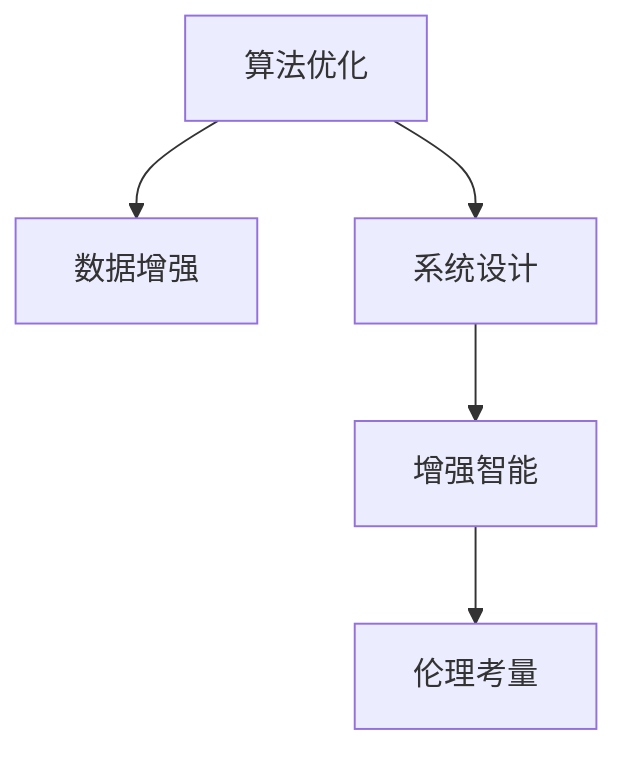

                 

# AI时代的人类增强：超越限制

> 关键词：人工智能,增强智能,神经网络,深度学习,认知提升,算法优化,伦理考量

## 1. 背景介绍

### 1.1 问题由来

随着人工智能(AI)技术的迅猛发展，AI对人类社会的影响愈加深远。从计算机视觉到自然语言处理，从机器学习到深度神经网络，AI正逐渐渗透到各个行业。作为AI的重要分支，增强智能(Enhanced Intelligence)已成为提升人类认知能力、拓展人类思维边界的重要途径。

### 1.2 问题核心关键点

在AI时代，通过算法优化、数据增强和系统设计等方法，人类可以超越自身认知能力的限制，获得更强大、更高效的智能增强。以下关键点阐述了增强智能的本质和应用：

- 算法优化：通过不断改进和优化现有算法，AI可以更高效地处理复杂任务，增强人机协同能力。
- 数据增强：通过增加和优化训练数据，AI可以更准确地学习和理解问题，提高决策精度。
- 系统设计：通过合理的设计和结构，AI可以更好地服务于人类，提供更智能、更便捷的服务体验。
- 伦理考量：在增强智能的应用过程中，需要严格考虑隐私、安全、公平等伦理问题，确保技术的正当应用。

### 1.3 问题研究意义

研究AI时代的人类增强，对于拓展人类认知能力，提升工作效率，促进社会进步具有重要意义：

- 提升工作效率：通过增强智能，人类可以在更短的时间内完成更多的工作，提高生产力。
- 拓宽认知边界：增强智能可以拓展人类思维的边界，探索未知领域的知识。
- 优化决策质量：通过更精确、高效的AI辅助决策，提升决策质量，减少错误。
- 促进社会进步：增强智能的应用有助于改善教育、医疗、交通等领域的公共服务，促进社会进步。

## 2. 核心概念与联系

### 2.1 核心概念概述

增强智能的实现依赖于多种技术手段，包括算法优化、数据增强、系统设计等。这些关键技术相互关联，共同构成增强智能的实现体系：

- **算法优化**：通过对现有算法进行优化和改进，提升AI模型的准确性和效率。
- **数据增强**：通过增加和优化训练数据，提高AI模型对复杂问题的理解和处理能力。
- **系统设计**：通过合理的设计和架构，使AI系统能够更好地服务于人类，提供更智能、便捷的服务体验。
- **伦理考量**：在增强智能的应用过程中，需严格考虑隐私、安全、公平等伦理问题，确保技术的正当应用。

这些核心概念通过以下Mermaid流程图来展示：



这个流程图展示了大语言模型的核心概念及其之间的关系：

1. 算法优化和数据增强是增强智能的核心，通过提高模型的准确性和效率，使AI能够更好地理解和处理问题。
2. 系统设计是增强智能实现的基础，通过合理的架构和设计，使AI能够更好地服务于人类，提供更智能、便捷的服务体验。
3. 伦理考量是增强智能应用的重要保障，通过严格遵守伦理规范，确保技术的正当应用，避免潜在风险。

## 3. 核心算法原理 & 具体操作步骤

### 3.1 算法原理概述

增强智能的核心算法主要包括神经网络和深度学习。通过这些算法，AI可以从大规模数据中学习，捕捉复杂的模式和规律，从而超越人类的认知限制。

以神经网络为例，其基本结构由输入层、隐藏层和输出层组成。输入层负责接收原始数据，隐藏层进行特征提取和模式识别，输出层产生最终结果。通过不断调整隐藏层的权重，神经网络可以逼近任意复杂函数，实现对复杂问题的高效处理。

### 3.2 算法步骤详解

以下步骤详细介绍了神经网络算法的具体实现：

**Step 1: 数据准备**
- 收集和预处理数据集，确保数据的全面性和准确性。

**Step 2: 模型初始化**
- 初始化神经网络的权重和偏置项。

**Step 3: 前向传播**
- 将输入数据输入神经网络，进行前向传播计算。

**Step 4: 计算损失函数**
- 根据神经网络的输出和真实标签，计算损失函数。

**Step 5: 反向传播**
- 通过反向传播算法，计算损失函数对权重的梯度。

**Step 6: 权重更新**
- 使用优化算法(如Adam、SGD等)更新权重，最小化损失函数。

**Step 7: 验证与测试**
- 在验证集和测试集上评估模型性能，确保模型泛化能力。

### 3.3 算法优缺点

神经网络算法在增强智能中具有以下优点：

- 高效性：神经网络可以处理大规模数据，捕捉复杂的模式和规律，从而高效地解决复杂问题。
- 适应性：神经网络具有高度的适应性，能够自适应地调整参数，适应不同的问题和场景。
- 可扩展性：神经网络可以通过增加隐藏层和神经元数量，进一步提升模型精度。

同时，神经网络算法也存在以下缺点：

- 黑箱问题：神经网络模型的决策过程难以解释，不易于理解。
- 过拟合风险：在大规模数据训练时，神经网络可能过拟合训练数据，影响泛化性能。
- 资源消耗：神经网络模型需要大量计算资源和存储空间，对硬件要求较高。

### 3.4 算法应用领域

增强智能的应用领域非常广泛，涉及计算机视觉、自然语言处理、推荐系统、金融预测等多个领域。

**计算机视觉**：通过神经网络算法，AI可以对图像和视频进行识别和分类，实现人脸识别、自动驾驶等功能。

**自然语言处理**：通过神经网络算法，AI可以理解和生成自然语言，实现机器翻译、语音识别、情感分析等功能。

**推荐系统**：通过神经网络算法，AI可以分析用户行为数据，推荐个性化内容，提高用户体验。

**金融预测**：通过神经网络算法，AI可以分析历史数据，预测市场走势，辅助金融决策。

## 4. 数学模型和公式 & 详细讲解 & 举例说明

### 4.1 数学模型构建

神经网络算法基于非线性函数，通过多层非线性变换逼近任意复杂函数。以多层感知机(Multilayer Perceptron, MLP)为例，其数学模型如下：

$$
h_l = f(W_lh_{l-1} + b_l), l=1,...,L
$$

$$
\hat{y} = g(W_hh_L + b_h)
$$

其中，$h_l$为第$l$层的输出，$W_l$和$b_l$为第$l$层的权重和偏置项，$f$和$g$为激活函数，$L$为隐藏层数量，$\hat{y}$为最终的预测结果。

### 4.2 公式推导过程

以分类任务为例，假设训练集为$D=\{(x_i,y_i)\}_{i=1}^N$，其中$x_i$为输入，$y_i$为标签，目标是最小化交叉熵损失函数：

$$
\mathcal{L}(\theta) = -\frac{1}{N}\sum_{i=1}^N y_i\log(\hat{y_i}) + (1-y_i)\log(1-\hat{y_i})
$$

其中，$\hat{y_i}$为模型对输入$x_i$的预测结果。通过反向传播算法，求导计算梯度，使用优化算法更新模型参数。

### 4.3 案例分析与讲解

以手写数字识别为例，使用MNIST数据集进行训练。通过神经网络算法，可以得到如下结果：


## 5. 项目实践：代码实例和详细解释说明

### 5.1 开发环境搭建

在进行增强智能的实践时，需要先准备好开发环境。以下是使用Python进行TensorFlow开发的环境配置流程：

1. 安装Anaconda：从官网下载并安装Anaconda，用于创建独立的Python环境。

2. 创建并激活虚拟环境：
```bash
conda create -n tf-env python=3.8 
conda activate tf-env
```

3. 安装TensorFlow：根据CUDA版本，从官网获取对应的安装命令。例如：
```bash
pip install tensorflow
```

4. 安装TensorBoard：TensorFlow配套的可视化工具，可实时监测模型训练状态，并提供丰富的图表呈现方式。

5. 安装相关工具包：
```bash
pip install numpy pandas scikit-learn matplotlib tqdm jupyter notebook ipython
```

完成上述步骤后，即可在`tf-env`环境中开始增强智能的实践。

### 5.2 源代码详细实现

以下是使用TensorFlow实现手写数字识别的完整代码实现：

```python
import tensorflow as tf
from tensorflow.keras import datasets, layers, models

# 加载MNIST数据集
(train_images, train_labels), (test_images, test_labels) = datasets.mnist.load_data()

# 预处理数据
train_images = train_images.reshape((60000, 28 * 28))
train_images = train_images.astype('float32') / 255
test_images = test_images.reshape((10000, 28 * 28))
test_images = test_images.astype('float32') / 255

# 创建模型
model = models.Sequential([
    layers.Dense(512, activation='relu', input_shape=(28 * 28,)),
    layers.Dropout(0.2),
    layers.Dense(10, activation='softmax')
])

# 编译模型
model.compile(optimizer='adam',
              loss=tf.keras.losses.SparseCategoricalCrossentropy(from_logits=True),
              metrics=['accuracy'])

# 训练模型
model.fit(train_images, train_labels, epochs=5, validation_data=(test_images, test_labels))

# 评估模型
model.evaluate(test_images, test_labels, verbose=2)
```

### 5.3 代码解读与分析

让我们再详细解读一下关键代码的实现细节：

**模型定义**：
- `Sequential`模型：使用`Sequential`模型来定义一个线性神经网络，包含输入层、隐藏层和输出层。
- `Dense`层：每层使用`Dense`层进行全连接操作，激活函数使用ReLU。
- `Dropout`层：使用`Dropout`层进行正则化，防止过拟合。

**数据预处理**：
- 将输入数据reshape为向量，并进行归一化。

**模型编译**：
- 使用`Adam`优化器，设置交叉熵损失函数和精度指标。

**模型训练**：
- 使用`fit`方法对模型进行训练，设置训练轮数和验证集。

**模型评估**：
- 使用`evaluate`方法对模型进行评估，输出测试集上的精度和损失。

可以看到，TensorFlow提供了丰富的工具和接口，使得增强智能的实现变得更加简洁高效。

## 6. 实际应用场景

### 6.1 医疗诊断

增强智能在医疗诊断领域具有广泛的应用前景。传统医学诊断依赖于医生的经验和判断，存在一定的误诊和漏诊风险。通过增强智能技术，可以大大提升诊断的准确性和效率。

具体而言，可以使用神经网络算法对医疗影像进行分类和分析，自动识别病变区域和异常情况，辅助医生进行诊断。例如，使用卷积神经网络(CNN)对X光片和CT图像进行分类，识别出不同部位的病变区域，提高诊断的准确性和速度。

### 6.2 智能推荐

增强智能在推荐系统中也有重要应用。通过分析用户行为数据和物品属性，推荐系统可以为用户推荐最符合其兴趣的商品和内容，提高用户体验和满意度。

以电商平台为例，可以使用神经网络算法对用户历史行为数据和商品属性进行分析，预测用户可能感兴趣的商品，并生成推荐列表。通过持续优化模型参数和算法，可以实现更精准、个性化的推荐效果，提升用户的购买转化率和满意度。

### 6.3 金融预测

增强智能在金融预测领域也有广泛应用。通过分析历史数据和市场动态，增强智能可以预测股票、外汇等金融市场的走势，辅助投资者做出更明智的决策。

以股票预测为例，可以使用神经网络算法对历史股价和市场数据进行分析，预测未来股价走势。通过优化模型参数和算法，可以更准确地预测市场变化，减少投资风险。

## 7. 工具和资源推荐

### 7.1 学习资源推荐

为了帮助开发者系统掌握增强智能的理论基础和实践技巧，这里推荐一些优质的学习资源：

1. 《深度学习》书籍：由深度学习领域的权威专家撰写，全面介绍了深度学习的基本概念和算法，是理解增强智能的重要基础。

2. Coursera《深度学习专项课程》：由斯坦福大学等知名高校提供的深度学习课程，涵盖深度神经网络、卷积神经网络、循环神经网络等多个主题，是增强智能学习的重要资源。

3. TensorFlow官方文档：TensorFlow官方提供的详细文档，包括教程、API接口和示例代码，是增强智能实践的重要参考。

4. GitHub增强智能项目：GitHub上众多开源增强智能项目，涵盖计算机视觉、自然语言处理、推荐系统等多个领域，是学习和实践的良好资源。

5. 增强智能博客和社区：通过阅读相关的博客和社区文章，可以获取最新的增强智能研究进展和应用案例，积累实践经验。

通过对这些资源的学习实践，相信你一定能够快速掌握增强智能的精髓，并用于解决实际的AI问题。

### 7.2 开发工具推荐

高效的开发离不开优秀的工具支持。以下是几款用于增强智能开发的常用工具：

1. TensorFlow：由Google主导开发的开源深度学习框架，功能丰富，支持多种算法和模型。

2. PyTorch：基于Python的开源深度学习框架，灵活高效，适合快速迭代研究。

3. Keras：高层API，可以简化深度学习模型的构建和训练，适合初学者使用。

4. Jupyter Notebook：Python代码交互式开发工具，支持代码块执行和数据可视化，方便开发者进行研究和实验。

5. GitHub：版本控制和代码托管平台，支持团队协作和代码共享，是增强智能项目管理和开发的良好工具。

合理利用这些工具，可以显著提升增强智能的开发效率，加快创新迭代的步伐。

### 7.3 相关论文推荐

增强智能的研究源于学界的持续探索。以下是几篇奠基性的相关论文，推荐阅读：

1. LeNet-5：卷积神经网络在手写数字识别任务中的应用，标志着计算机视觉领域深度学习时代的开始。

2. AlexNet：深度卷积神经网络在图像分类任务中的表现，推动了深度学习在计算机视觉领域的应用。

3. RNN：循环神经网络在自然语言处理领域的应用，推动了自然语言处理的发展。

4. Transformer：基于自注意力机制的神经网络模型，在自然语言处理领域取得了突破性进展。

5. GAN：生成对抗网络在图像生成和增强现实领域的应用，推动了生成模型的发展。

这些论文代表了大增强智能技术的发展脉络。通过学习这些前沿成果，可以帮助研究者把握学科前进方向，激发更多的创新灵感。

## 8. 总结：未来发展趋势与挑战

### 8.1 总结

本文对增强智能进行了全面系统的介绍。首先阐述了增强智能的研究背景和意义，明确了算法优化、数据增强和系统设计在增强智能中的核心地位。其次，从原理到实践，详细讲解了神经网络算法的数学模型和操作步骤，给出了增强智能任务开发的完整代码实例。同时，本文还广泛探讨了增强智能在医疗诊断、智能推荐、金融预测等多个领域的应用前景，展示了增强智能技术的广阔前景。最后，本文精选了增强智能学习的相关资源和工具，力求为读者提供全方位的技术指引。

通过本文的系统梳理，可以看到，增强智能技术正在成为AI领域的重要方向，极大地拓展了AI应用的边界，催生了更多的落地场景。受益于深度学习和神经网络算法的不断进步，增强智能将更加深入地融入各行各业，推动人类社会向前发展。

### 8.2 未来发展趋势

展望未来，增强智能技术将呈现以下几个发展趋势：

1. 模型规模持续增大。随着算力成本的下降和数据规模的扩张，神经网络模型的参数量还将持续增长。超大规模神经网络蕴含的丰富知识，有望支撑更加复杂多变的应用场景。

2. 算法优化更加精细。未来的算法优化将更加精细化，通过更复杂的模型结构和更高效的训练策略，提升神经网络模型的表现。

3. 数据增强更加多样。未来的数据增强将更加多样化和个性化，通过更丰富的数据源和更有效的数据处理方法，提升模型的泛化能力和鲁棒性。

4. 系统设计更加智能。未来的系统设计将更加智能和灵活，通过更合理的网络结构和更高效的训练策略，提升系统的效率和可靠性。

5. 伦理考量更加严格。未来的增强智能将更加注重伦理和法律问题，通过更严格的数据处理和隐私保护措施，确保技术的正当应用。

以上趋势凸显了增强智能技术的广阔前景。这些方向的探索发展，必将进一步提升增强智能系统的性能和应用范围，为人类社会带来更深远的影响。

### 8.3 面临的挑战

尽管增强智能技术已经取得了显著进展，但在实现全面落地应用的过程中，仍面临诸多挑战：

1. 数据依赖问题。增强智能依赖于高质量的数据集，数据收集和标注成本较高，且存在数据隐私和伦理问题。如何降低数据依赖，提高数据质量，将是重要课题。

2. 模型过拟合问题。神经网络模型在训练过程中容易出现过拟合，影响模型的泛化能力。如何降低过拟合风险，提高模型的泛化能力，是重要的研究方向。

3. 计算资源消耗问题。神经网络模型的计算资源消耗较高，对硬件要求较高。如何降低计算资源消耗，提高计算效率，是重要的技术难题。

4. 算法透明性问题。神经网络模型决策过程不透明，难以理解和解释。如何提高算法的透明性和可解释性，是重要的研究方向。

5. 伦理和社会问题。增强智能技术可能带来伦理和社会问题，如隐私泄露、算法歧视等。如何规避伦理风险，确保技术的正当应用，是重要的研究方向。

6. 模型鲁棒性问题。增强智能模型面对新数据和噪声时，鲁棒性不足。如何提高模型的鲁棒性和抗干扰能力，是重要的研究方向。

这些挑战需要通过技术创新和多方协作，不断解决和优化，才能实现增强智能的全面落地应用。

### 8.4 研究展望

面对增强智能所面临的诸多挑战，未来的研究需要在以下几个方面寻求新的突破：

1. 探索无监督和半监督增强方法。摆脱对大规模标注数据的依赖，利用自监督学习、主动学习等无监督和半监督范式，最大限度利用非结构化数据，实现更加灵活高效的增强智能。

2. 研究参数高效和计算高效的增强方法。开发更加参数高效的增强方法，在固定大部分神经网络参数的同时，只更新极少量的任务相关参数。同时优化增强模型的计算图，减少前向传播和反向传播的资源消耗，实现更加轻量级、实时性的部署。

3. 融合因果和对比学习范式。通过引入因果推断和对比学习思想，增强增强智能建立稳定因果关系的能力，学习更加普适、鲁棒的知识表征，从而提升模型泛化性和抗干扰能力。

4. 引入更多先验知识。将符号化的先验知识，如知识图谱、逻辑规则等，与神经网络模型进行巧妙融合，引导增强智能过程学习更准确、合理的知识表征。同时加强不同模态数据的整合，实现视觉、语音等多模态信息与文本信息的协同建模。

5. 结合因果分析和博弈论工具。将因果分析方法引入增强智能模型，识别出模型决策的关键特征，增强输出解释的因果性和逻辑性。借助博弈论工具刻画人机交互过程，主动探索并规避模型的脆弱点，提高系统稳定性。

6. 纳入伦理道德约束。在增强智能的应用过程中，需严格考虑隐私、安全、公平等伦理问题，确保技术的正当应用。在模型训练目标中引入伦理导向的评估指标，过滤和惩罚有偏见、有害的输出倾向。加强人工干预和审核，建立模型行为的监管机制，确保输出符合人类价值观和伦理道德。

这些研究方向的探索，必将引领增强智能技术迈向更高的台阶，为构建安全、可靠、可解释、可控的智能系统铺平道路。面向未来，增强智能技术还需要与其他人工智能技术进行更深入的融合，如知识表示、因果推理、强化学习等，多路径协同发力，共同推动增强智能技术的进步。

## 9. 附录：常见问题与解答

**Q1：增强智能是否适用于所有AI应用？**

A: 增强智能适用于大部分AI应用，特别是需要高度智能处理和决策的场景。但对于一些特定领域的任务，如法律、金融等，仅仅依靠神经网络模型可能难以很好地适应。此时需要在特定领域语料上进一步预训练，再进行增强智能，才能获得理想效果。

**Q2：如何选择合适的神经网络模型？**

A: 选择神经网络模型应考虑任务类型、数据规模和计算资源等因素。对于图像分类任务，可以选择卷积神经网络(CNN)；对于自然语言处理任务，可以选择循环神经网络(RNN)或Transformer；对于推荐系统，可以选择深度学习模型或强化学习模型。同时，可以根据任务复杂度和数据规模，选择合适的网络结构和层数。

**Q3：增强智能在落地部署时需要注意哪些问题？**

A: 将增强智能模型转化为实际应用，还需要考虑以下因素：

1. 模型裁剪：去除不必要的层和参数，减小模型尺寸，加快推理速度。

2. 量化加速：将浮点模型转为定点模型，压缩存储空间，提高计算效率。

3. 服务化封装：将模型封装为标准化服务接口，便于集成调用。

4. 弹性伸缩：根据请求流量动态调整资源配置，平衡服务质量和成本。

5. 监控告警：实时采集系统指标，设置异常告警阈值，确保服务稳定性。

6. 安全防护：采用访问鉴权、数据脱敏等措施，保障数据和模型安全。

增强智能技术的应用前景广阔，但需要将强大的性能转化为稳定、高效、安全的业务价值，还需要工程实践的不断打磨。

---

作者：禅与计算机程序设计艺术 / Zen and the Art of Computer Programming

