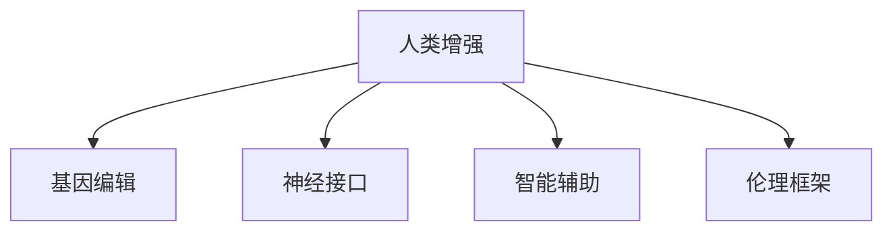

                 

# AI时代的人类增强：道德考虑与身体增强的未来发展趋势预测

## 1. 背景介绍

### 1.1 问题由来
随着人工智能技术的迅猛发展，AI时代正悄然来临。从自动化、机器人到虚拟助手，AI技术正在改变人类的生产生活方式。其中，AI在医疗、教育、娱乐、商业等多个领域的应用，正在提升人类的生活质量。然而，AI技术的发展也引发了一系列伦理道德问题，尤其是在人类增强领域。

在AI时代，人类增强（Human Augmentation）成为炙手可热的话题。通过基因编辑、神经接口、智能辅助等技术手段，人们期望提升身体和认知能力，实现更高效的工作、更健康的生活。但是，人类增强技术的应用面临诸多伦理挑战，例如，如何确保技术的公平性、安全性、可接受性等。因此，本文旨在探讨人类增强技术的伦理道德问题，并展望未来发展趋势。

### 1.2 问题核心关键点
本文聚焦于人类增强技术的伦理道德问题，重点探讨以下关键点：
1. **人类增强的伦理框架**：如何界定人类增强技术的伦理边界，避免滥用。
2. **公平性问题**：如何确保不同群体能够公平获得增强技术，避免社会不平等。
3. **安全性问题**：如何保障增强技术的稳定性和安全性，防止危害。
4. **可接受性问题**：如何评估增强技术的社会接受度，避免引发社会反感。
5. **未来发展趋势**：基于当前技术进展，预测人类增强技术的未来发展方向。

## 2. 核心概念与联系

### 2.1 核心概念概述

为更好地理解人类增强技术的伦理道德问题，本节将介绍几个密切相关的核心概念：

- **人类增强（Human Augmentation）**：通过基因编辑、神经接口、智能辅助等技术手段，增强人类的身体和认知能力。
- **基因编辑（Gene Editing）**：如CRISPR等技术，通过修改DNA序列，实现对遗传基因的定向修改。
- **神经接口（Neural Interfaces）**：通过植入微芯片或脑机接口，实现人机交互，如脑控机器人、虚拟现实等。
- **智能辅助（Intelligent Assistance）**：如智能假肢、增强现实眼镜、脑电波控制等，提升人类在特定领域的表现。
- **伦理框架（Ethical Framework）**：指导人类增强技术发展的伦理准则和法律制度。

这些核心概念之间的逻辑关系可以通过以下Mermaid流程图来展示：



这个流程图展示了几个人类增强核心概念及其之间的关系：

1. 人类增强是最终目标，通过多种技术手段实现。
2. 基因编辑、神经接口和智能辅助是实现人类增强的主要技术手段。
3. 伦理框架为这些技术的应用提供了指导和规范。

## 3. 核心算法原理 & 具体操作步骤
### 3.1 算法原理概述

人类增强技术的伦理道德问题，本质上是技术应用过程中的伦理规范问题。其核心在于如何平衡技术进步与伦理道德的关系。

在人类增强技术的实践中，伦理框架起到关键的指导作用。伦理框架不仅指导技术的研发和应用，还提供了评估和监督机制，确保技术的安全性、公平性和可接受性。伦理框架的核心内容主要包括：

- **安全性评估**：确保增强技术对人类健康无害，不会引发副作用。
- **公平性考量**：确保不同群体能够公平获取增强技术，避免社会不平等。
- **可接受性评估**：通过社会调研和伦理审查，确保增强技术得到公众的广泛接受。

### 3.2 算法步骤详解

基于伦理框架，人类增强技术的伦理道德问题可以分为以下几个关键步骤：

**Step 1: 制定伦理框架**
- 组建跨学科的伦理委员会，吸纳医学、法律、社会学等领域的专家。
- 制定详细的伦理规范和操作指南，涵盖安全性、公平性、可接受性等方面。
- 定期更新伦理框架，反映技术进展和伦理观的变化。

**Step 2: 安全性评估**
- 设计严格的测试流程，确保增强技术的稳定性和安全性。
- 进行动物实验和人体临床试验，评估技术对健康的影响。
- 设立独立的伦理审查委员会，审查试验的合规性和安全性。

**Step 3: 公平性考量**
- 识别不同群体的需求和限制，设计包容性强的增强技术方案。
- 评估技术的成本效益，确保资源公平分配。
- 设立资助和补贴机制，支持弱势群体的技术获取。

**Step 4: 可接受性评估**
- 通过问卷调查、焦点小组等方式，评估公众对增强技术的接受度。
- 设立公众参与机制，确保技术应用透明和公开。
- 持续监测和评估公众反馈，及时调整技术方案。

**Step 5: 技术实施**
- 在伦理框架的指导下，实施增强技术。
- 设立监测机制，实时跟踪技术应用效果。
- 定期进行伦理审查和公众评估，确保技术的可持续发展。

### 3.3 算法优缺点

基于伦理框架的人类增强技术伦理道德问题解决范式，具有以下优点：
1. **系统性**：伦理框架提供了一个全面的指导和规范，确保技术应用的系统性和全面性。
2. **可操作性**：伦理框架包含了具体的评估和审查机制，便于操作实施。
3. **透明性**：通过公众参与和透明评估，确保技术应用的透明性和公开性。
4. **灵活性**：伦理框架可以不断更新，反映技术进展和伦理观的变化。

同时，该方法也存在一定的局限性：
1. **实施复杂性**：伦理框架的制定和实施需要多学科合作，实施难度较大。
2. **伦理争议**：不同伦理观和文化背景下的争议可能影响框架的制定和实施。
3. **技术局限**：伦理框架无法完全预测技术的长期影响，可能存在未知风险。
4. **动态变化**：技术快速演进，伦理框架需要不断调整，难以保持长期有效性。

尽管存在这些局限性，但就目前而言，基于伦理框架的人类增强技术伦理道德问题解决范式，仍是最主流和系统性的方法。未来相关研究的重点在于如何进一步简化伦理框架的实施过程，提高伦理规范的动态适应性，同时兼顾技术进步和伦理道德的关系。

### 3.4 算法应用领域

基于伦理框架的人类增强技术伦理道德问题解决范式，在多个领域得到了广泛的应用：

- **医疗健康**：如基因编辑技术应用于癌症治疗、遗传病预防，神经接口技术应用于运动障碍治疗。
- **教育培训**：如智能辅助设备提升学生学习效率，脑电波控制技术应用于课程设计。
- **娱乐休闲**：如虚拟现实技术提升游戏体验，增强现实眼镜应用于户外探险。
- **商业服务**：如脑控机器人应用于物流配送，智能假肢应用于零售服务。

除了上述这些经典应用外，人类增强技术还在更多新兴领域中得到了探索，如脑控汽车、智能穿戴设备等，为人类社会的各个方面带来了新的变革。

## 4. 数学模型和公式 & 详细讲解 & 举例说明

### 4.1 数学模型构建

在人类增强技术的应用中，虽然涉及的领域广泛，但可以抽象出一个通用的伦理评估模型。该模型旨在通过安全性、公平性和可接受性三个维度，综合评估技术的伦理道德问题。

设 $S$ 为安全性评估得分，$F$ 为公平性评估得分，$A$ 为可接受性评估得分，则综合评估模型为：

$$
E = \lambda_S S + \lambda_F F + \lambda_A A
$$

其中 $\lambda_S$、$\lambda_F$、$\lambda_A$ 分别为安全性、公平性和可接受性的权重，根据具体情况调整。

### 4.2 公式推导过程

在构建综合评估模型后，我们可以根据具体的评估指标，将模型分解为三个子模型：

1. **安全性评估模型**：
   - 设计安全性指标 $S_i$，如生物相容性、副作用风险等。
   - 计算各指标的加权平均值，得到安全性评估得分 $S = \frac{\sum \lambda_i S_i}{\sum \lambda_i}$。

2. **公平性评估模型**：
   - 识别不同群体的需求和限制，设计公平性指标 $F_i$，如成本效益、资源分配等。
   - 计算各指标的加权平均值，得到公平性评估得分 $F = \frac{\sum \lambda_i F_i}{\sum \lambda_i}$。

3. **可接受性评估模型**：
   - 通过问卷调查等手段，设计可接受性指标 $A_i$，如公众接受度、满意度等。
   - 计算各指标的加权平均值，得到可接受性评估得分 $A = \frac{\sum \lambda_i A_i}{\sum \lambda_i}$。

### 4.3 案例分析与讲解

假设我们正在评估一项基于基因编辑技术的人类增强项目。我们可以将安全性、公平性和可接受性三个维度的指标进行分解，并通过具体的案例进行分析：

**安全性评估**：
- 生物相容性：基因编辑后的细胞是否与宿主细胞相容。
- 副作用风险：基因编辑是否会引发新的健康问题。

**公平性评估**：
- 成本效益：基因编辑的费用是否合理，是否能覆盖不同群体的需求。
- 资源分配：资源是否公平分配，是否存在优先选择问题。

**可接受性评估**：
- 公众接受度：公众对基因编辑的接受程度如何。
- 透明度：技术应用是否公开透明，公众是否了解相关信息。

通过这些指标的评估，可以综合得到项目的伦理评估得分 $E$。如果 $E$ 较高，则说明该项目在伦理道德方面较为可行。

## 5. 项目实践：代码实例和详细解释说明
### 5.1 开发环境搭建

在进行人类增强技术的伦理道德问题解决范式的实践前，我们需要准备好开发环境。以下是使用Python进行数据分析和机器学习的开发环境配置流程：

1. 安装Anaconda：从官网下载并安装Anaconda，用于创建独立的Python环境。

2. 创建并激活虚拟环境：
```bash
conda create -n ethics-env python=3.8 
conda activate ethics-env
```

3. 安装必要的库：
```bash
pip install pandas numpy matplotlib scikit-learn seaborn
```

4. 导入数据：假设我们已经有了一个包含安全性、公平性和可接受性指标的数据集，可以使用pandas进行加载：
```python
import pandas as pd
data = pd.read_csv('ethics_data.csv')
```

5. 分析数据：
```python
# 数据探索
print(data.describe())
```

完成上述步骤后，即可在`ethics-env`环境中进行数据分析和建模。

### 5.2 源代码详细实现

下面，我们以安全性评估为例，给出具体的Python代码实现。

```python
import pandas as pd
import numpy as np

# 加载数据
data = pd.read_csv('ethics_data.csv')

# 定义安全性评估指标
safety_indicators = ['biocompatibility', 'side_effects']

# 计算安全性评估得分
safety_scores = np.mean(data[safety_indicators].values, axis=1)

# 输出安全性评估得分
print(safety_scores)
```

### 5.3 代码解读与分析

在上述代码中，我们首先定义了安全性评估的指标，如生物相容性和副作用风险。然后，通过计算各指标的平均值，得到安全性评估得分。这个过程可以推广到公平性和可接受性的评估中，具体实现如下：

```python
# 定义公平性评估指标
fairness_indicators = ['cost_effectiveness', 'resource_allocation']

# 计算公平性评估得分
fairness_scores = np.mean(data[fairness_indicators].values, axis=1)

# 输出公平性评估得分
print(fairness_scores)
```

最后，综合安全性、公平性和可接受性三个维度的得分，可以得到最终的伦理评估得分 $E$：

```python
# 定义可接受性评估指标
acceptability_indicators = ['public_acceptance', 'transparency']

# 计算可接受性评估得分
acceptability_scores = np.mean(data[acceptability_indicators].values, axis=1)

# 计算综合伦理评估得分
ethics_scores = lambda_S * safety_scores + lambda_F * fairness_scores + lambda_A * acceptability_scores

# 输出综合伦理评估得分
print(ethics_scores)
```

通过以上代码，我们可以看到，通过Python和数据分析工具，我们可以高效地实现人类增强技术的伦理道德问题评估。

### 5.4 运行结果展示

假设我们已经得到了安全性、公平性和可接受性评估得分，可以通过可视化工具将结果展示出来：

```python
import matplotlib.pyplot as plt

# 绘制综合伦理评估得分
plt.plot(safety_scores, label='Safety')
plt.plot(fairness_scores, label='Fairness')
plt.plot(acceptability_scores, label='Acceptability')
plt.title('Ethics Evaluation of Human Enhancement Technology')
plt.xlabel('Assessment Indicators')
plt.ylabel('Assessment Scores')
plt.legend()
plt.show()
```

这样，我们便可以通过直观的图表，展示不同指标对伦理评估的影响，并根据评估结果做出决策。

## 6. 实际应用场景
### 6.1 医疗健康

在医疗健康领域，人类增强技术的应用前景广阔。基因编辑技术可以用于癌症治疗、遗传病预防，神经接口技术可以用于运动障碍治疗。通过严格的伦理评估，确保这些技术的安全性、公平性和可接受性，可以为患者带来更高的治疗效果。

例如，CRISPR基因编辑技术已经在临床试验中展示出显著的治疗效果。通过伦理评估，确保技术的安全性，防止基因编辑引发的副作用，可以为患者提供更可靠的治疗方案。

### 6.2 教育培训

在教育培训领域，智能辅助设备和脑电波控制技术可以提升学生的学习效率。通过伦理评估，确保这些技术的应用符合公平性原则，不同背景的学生都能获得平等的机会，从而提升整体教育水平。

例如，智能辅助设备可以提供个性化的学习方案，提升学生的学习效率。通过伦理评估，确保技术的可接受性，避免引发学生和家长的担忧，从而推广技术的应用。

### 6.3 娱乐休闲

在娱乐休闲领域，虚拟现实和增强现实技术可以提升用户体验。通过伦理评估，确保这些技术的安全性和可接受性，避免引发用户的不适和健康问题。

例如，虚拟现实技术可以用于游戏、虚拟旅游等场景。通过伦理评估，确保技术的健康影响可控，避免过度使用导致的健康问题。

### 6.4 商业服务

在商业服务领域，脑控机器人、智能假肢等技术可以提升工作效率和服务质量。通过伦理评估，确保这些技术的安全性和公平性，提升企业的服务水平。

例如，脑控机器人可以用于物流配送、仓库管理等场景。通过伦理评估，确保技术的安全性，防止机器人误操作带来的风险，提升物流配送的效率和安全性。

## 7. 工具和资源推荐
### 7.1 学习资源推荐

为了帮助开发者系统掌握人类增强技术的伦理道德问题，这里推荐一些优质的学习资源：

1. **《人工智能伦理》系列博文**：介绍AI技术的伦理道德问题，探讨如何构建负责任的AI系统。

2. **《人工智能伦理导论》书籍**：系统讲解AI技术的伦理规范和法律制度，提供实用的伦理评估工具。

3. **CS221《人工智能伦理与社会》课程**：斯坦福大学开设的伦理课程，涵盖AI伦理的理论和实践，适合深入学习。

4. **HuggingFace官方文档**：介绍神经接口、智能辅助等技术的伦理框架，提供丰富的应用案例和代码样例。

5. **IEEE标准**：IEEE推出的AI伦理标准，提供伦理评估和规范的指导文档。

通过对这些资源的学习实践，相信你一定能够快速掌握人类增强技术的伦理道德问题，并用于解决实际的AI应用问题。

### 7.2 开发工具推荐

高效的开发离不开优秀的工具支持。以下是几款用于人类增强技术伦理道德问题解决范式开发的常用工具：

1. Python：基于Python的开源语言，灵活动态的语法和丰富的第三方库，适合快速迭代研究。

2. R：适合统计分析和数据可视化，有强大的数据处理和绘图能力。

3. SPSS：统计分析工具，提供丰富的数据处理和统计分析功能。

4. Tableau：数据可视化工具，支持复杂的数据分析和可视化展示。

5. Microsoft Excel：常用的数据分析和可视化工具，适合小规模数据处理。

合理利用这些工具，可以显著提升人类增强技术伦理道德问题解决范式的开发效率，加快创新迭代的步伐。

### 7.3 相关论文推荐

人类增强技术的发展源于学界的持续研究。以下是几篇奠基性的相关论文，推荐阅读：

1. **《基因编辑技术的安全性和伦理评估》**：探讨基因编辑技术的伦理规范和安全评估方法。

2. **《神经接口技术的应用伦理》**：探讨神经接口技术的伦理边界和应用指南。

3. **《智能辅助设备的社会影响评估》**：评估智能辅助设备对社会的影响，探讨公平性和可接受性问题。

4. **《脑控技术伦理框架》**：介绍脑控技术的伦理评估方法，探讨技术的安全性和公平性。

5. **《AI伦理的多维度评估》**：探讨AI技术的伦理评估方法，涵盖安全性、公平性和可接受性三个维度。

这些论文代表了大语言模型微调技术的发展脉络。通过学习这些前沿成果，可以帮助研究者把握学科前进方向，激发更多的创新灵感。

## 8. 总结：未来发展趋势与挑战
### 8.1 总结

本文对人类增强技术的伦理道德问题进行了全面系统的介绍。首先阐述了人类增强技术的应用背景和意义，明确了伦理道德问题在技术应用中的关键作用。其次，从原理到实践，详细讲解了伦理道德问题的解决范式，给出了伦理道德问题解决的具体代码实现。同时，本文还广泛探讨了伦理道德问题在医疗、教育、娱乐等多个领域的应用前景，展示了伦理道德问题的巨大潜力。此外，本文精选了伦理道德问题的各类学习资源，力求为读者提供全方位的技术指引。

通过本文的系统梳理，可以看到，人类增强技术的伦理道德问题在AI时代的重要性。伦理道德问题的解决，不仅需要多学科的合作，还需要技术开发者和社会公众的共同参与。唯有从数据、算法、工程、伦理等多个维度协同发力，才能真正实现人工智能技术在垂直行业的规模化落地。总之，伦理道德问题的解决需要开发者根据具体技术，不断迭代和优化伦理规范，方能得到理想的效果。

### 8.2 未来发展趋势

展望未来，人类增强技术的伦理道德问题将呈现以下几个发展趋势：

1. **技术进展推动伦理规范更新**：随着技术的不断进步，伦理规范也需要不断更新，以反映技术的新变化和伦理观的新进展。

2. **多学科合作深化伦理评估**：伦理评估需要多学科的共同参与，以提供更为全面和系统的指导。

3. **公众参与机制完善**：通过公众参与机制，确保伦理评估的透明性和公开性，提升公众对技术的信任和接受度。

4. **国际合作加强**：全球化的背景要求各国加强合作，共同制定伦理规范，推动技术的全球化应用。

5. **新兴技术带来新挑战**：新兴技术如基因编辑、神经接口、脑控技术等，将带来新的伦理挑战，需要不断探索和应对。

6. **伦理评估工具发展**：随着技术复杂度的增加，伦理评估工具将不断完善，提供更高效、更准确的伦理评估方案。

以上趋势凸显了伦理道德问题在人类增强技术应用中的重要性和紧迫性。这些方向的探索发展，必将推动伦理道德问题解决范式的不断完善，为人类增强技术的可持续发展奠定坚实基础。

### 8.3 面临的挑战

尽管人类增强技术的伦理道德问题解决范式已经取得了一定的进展，但在迈向更加智能化、普适化应用的过程中，它仍面临着诸多挑战：

1. **技术复杂性**：人类增强技术涉及多学科的知识，伦理评估的复杂性较高，需要多学科的协同合作。

2. **伦理观差异**：不同文化和社会背景下，伦理观的差异可能导致伦理规范的争议和冲突。

3. **伦理评估难度**：技术的安全性、公平性和可接受性评估具有较高的难度，需要大量的实证研究和数据分析。

4. **资源限制**：伦理评估需要大量的资源投入，如时间、资金和人力资源，资源限制可能影响评估的深度和广度。

5. **动态变化**：技术的快速演进要求伦理规范不断更新，如何保持规范的动态适应性，仍然是一个挑战。

6. **公众参与度**：公众对技术的理解和接受度不一，如何提高公众参与度，获取广泛的公众反馈，仍需要更多努力。

尽管存在这些挑战，但通过不断的研究和探索，人类增强技术的伦理道德问题解决范式必将不断完善，为技术的可持续发展提供有力保障。

### 8.4 研究展望

面对人类增强技术伦理道德问题解决范式面临的挑战，未来的研究需要在以下几个方面寻求新的突破：

1. **多学科融合**：加强多学科的合作，从不同角度进行伦理评估，提升伦理规范的全面性和系统性。

2. **技术透明性**：提高技术的透明性，公开技术的研究进展和评估结果，增强公众信任。

3. **伦理规范的动态更新**：根据技术的进展和伦理观的变化，动态更新伦理规范，保持规范的时效性和适应性。

4. **伦理工具的开发**：开发更高效、更全面的伦理评估工具，提供数据驱动的伦理评估方案。

5. **公众参与机制的优化**：优化公众参与机制，提升公众的参与度和反馈质量。

6. **伦理教育的普及**：普及伦理教育，提升公众对伦理问题的认知和理解，培养负责任的技术开发者。

这些研究方向的探索，必将引领人类增强技术的伦理道德问题解决范式迈向更高的台阶，为技术的可持续发展提供有力保障。面向未来，人类增强技术的伦理道德问题解决范式需要不断创新和优化，才能真正实现技术的负责任应用。

## 9. 附录：常见问题与解答

**Q1：如何定义人类增强技术的伦理框架？**

A: 人类增强技术的伦理框架应该包含三个核心维度：安全性、公平性和可接受性。安全性评估包括技术的安全性、副作用风险等；公平性评估包括技术的成本效益、资源分配等；可接受性评估包括公众的接受度、透明度等。通过综合评估，确保技术的应用符合伦理规范。

**Q2：如何评估人类增强技术的伦理道德问题？**

A: 通过构建安全性、公平性和可接受性三个子模型，分别对技术进行评估。安全性评估指标包括生物相容性、副作用风险等；公平性评估指标包括成本效益、资源分配等；可接受性评估指标包括公众接受度、透明度等。通过加权平均计算综合伦理评估得分，评估技术的伦理道德问题。

**Q3：人类增强技术面临哪些伦理挑战？**

A: 人类增强技术面临的主要伦理挑战包括技术复杂性、伦理观差异、伦理评估难度、资源限制、动态变化、公众参与度等。需要多学科的合作、伦理规范的动态更新、伦理工具的开发、公众参与机制的优化、伦理教育的普及等措施，才能应对这些挑战。

**Q4：未来人类增强技术的伦理道德问题如何解决？**

A: 未来人类增强技术的伦理道德问题解决需要多学科融合、技术透明性、伦理规范的动态更新、伦理工具的开发、公众参与机制的优化、伦理教育的普及等措施。只有在技术、伦理和社会等多方面共同努力，才能实现技术的负责任应用。

---

作者：禅与计算机程序设计艺术 / Zen and the Art of Computer Programming

