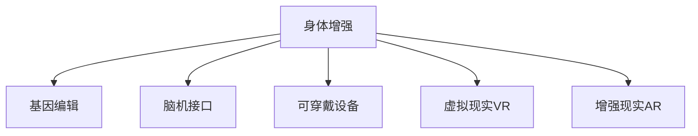

                 

## 1. 背景介绍

### 1.1 问题由来
随着人工智能(AI)技术的飞速发展，AI时代已经悄然来临。这一时期，人类面临了一系列前所未有的技术变革和社会挑战。其中，人类增强(Human Enhancement)作为一个热点话题，引发了广泛的讨论。人类增强包括身体增强和认知增强两个方面，前者是指通过生物医学手段提升人类的身体机能，后者则是指通过AI技术提升人类的认知能力。

近年来，身体增强技术取得了显著进展。从基因编辑技术CRISPR的问世，到脑机接口(BCI)、可穿戴设备等新兴技术的不断涌现，人类增强技术开始逐步走进现实。然而，随之而来的伦理道德问题也愈发复杂，引发了广泛的社会关注和讨论。

### 1.2 问题核心关键点
身体增强技术的应用，不仅涉及到医疗和生命科学，还牵涉到法律、伦理、经济等多个领域。核心问题包括以下几点：

1. **伦理问题**：身体增强是否涉及干预自然进化过程，是否违背人类尊严？
2. **安全问题**：身体增强技术的安全性如何保障，潜在的副作用和风险有哪些？
3. **公平性问题**：身体增强技术是否会加剧社会不平等，使富裕群体更加强大，而贫穷群体处于劣势？
4. **监管问题**：如何制定合理的法规和政策，引导技术健康发展，防止滥用？

这些问题不仅对科技本身提出了挑战，也要求我们从伦理、社会、法律等各个角度进行全面思考。只有妥善处理好这些问题，才能真正实现人类增强技术的可持续发展。

### 1.3 问题研究意义
研究身体增强技术的伦理和应用问题，对于推动科技进步、保障人类福祉具有重要意义：

1. **推动科技进步**：身体增强技术是医疗和科技创新的重要方向，研究其伦理和应用问题，有助于引导技术健康发展，激发更多创新。
2. **保障人类福祉**：身体增强技术有望显著提升人类生活质量，但也需要科学合理的监管和伦理指导，确保技术应用的安全性和有效性。
3. **促进社会公平**：身体增强技术带来的不平等问题需要通过合理的政策设计来避免，保障社会公正。
4. **维护社会稳定**：通过立法和伦理审查，确保身体增强技术应用有序进行，避免技术滥用引发的社会动荡。

## 2. 核心概念与联系

### 2.1 核心概念概述

为了更好地理解身体增强技术的伦理和应用问题，本节将介绍几个密切相关的核心概念：

1. **身体增强(Human Enhancement)**：通过生物医学、基因编辑、脑机接口等技术手段，提升人类的身体机能和认知能力。
2. **基因编辑(Genome Editing)**：利用CRISPR-Cas9等技术对人类基因进行精准编辑，修复或增加特定基因功能，以实现身体增强。
3. **脑机接口(Brain-Computer Interface, BCI)**：通过植入式或非植入式技术，实现人脑与计算机之间的直接信息交互，用于恢复或增强身体功能。
4. **可穿戴设备(Wearable Devices)**：搭载传感器和人工智能算法，实时监测和调控身体机能，辅助健康管理和运动训练。
5. **虚拟现实(Virtual Reality, VR)和增强现实(Augmented Reality, AR)**：通过虚拟和增强现实技术，提供沉浸式的训练和娱乐环境，提升身体协调和反应能力。

这些核心概念之间的逻辑关系可以通过以下Mermaid流程图来展示：



这个流程图展示了她体增强技术的核心概念及其之间的关系：

1. 身体增强技术通过多种手段实现，包括基因编辑、脑机接口、可穿戴设备、虚拟现实和增强现实等。
2. 这些技术相互支持，共同提升人类的身体机能和认知能力。
3. 身体增强技术的应用场景广泛，涵盖健康管理、运动训练、娱乐等多个领域。

这些概念共同构成了人类增强技术的学习框架，帮助我们理解不同技术手段之间的联系和应用。

## 3. 核心算法原理 & 具体操作步骤
### 3.1 算法原理概述

身体增强技术的伦理和应用问题，涉及多个学科领域的交叉融合。其核心算法原理包括：

1. **基因编辑**：通过CRISPR-Cas9等技术，对人类基因进行精准编辑，实现特定基因功能的增加或修复。
2. **脑机接口**：通过植入式或非植入式技术，将人脑与计算机系统连接，实现信息交互和功能增强。
3. **可穿戴设备**：利用传感器和人工智能算法，实时监测和调控身体机能，辅助健康管理和运动训练。
4. **虚拟现实和增强现实**：通过虚拟和增强现实技术，提供沉浸式的训练和娱乐环境，提升身体协调和反应能力。

这些技术的基本原理包括生物医学、神经科学、计算机科学等多个学科的交叉融合。了解这些原理，有助于更好地理解技术的应用和伦理问题。

### 3.2 算法步骤详解

具体来说，身体增强技术的实施过程通常包括以下几个步骤：

1. **需求分析**：明确身体增强的目标，如提升某项身体机能或解决特定健康问题。
2. **技术选择**：根据需求选择合适的技术手段，如基因编辑、脑机接口、可穿戴设备等。
3. **方案设计**：设计具体的技术方案，包括设备设计、算法开发、数据采集等。
4. **伦理审查**：对技术方案进行伦理审查，确保方案符合道德规范和社会公序良俗。
5. **临床试验**：在动物模型或人体小规模试验中，评估技术方案的安全性和有效性。
6. **大规模推广**：如果试验结果满意，进行大规模临床试验和推广应用。

### 3.3 算法优缺点

身体增强技术具有以下优点：

1. **提升身体机能**：通过基因编辑、脑机接口等技术，可以显著提升人类的身体协调性、反应速度和运动能力。
2. **解决健康问题**：通过植入式设备、虚拟现实等技术，可以有效治疗和缓解多种健康问题，如帕金森病、认知障碍等。
3. **增强认知能力**：通过神经刺激、AI辅助等手段，可以提升人类的认知能力，提高学习效率和工作表现。

但同时也存在一些缺点：

1. **伦理争议**：干预自然进化过程可能引发伦理争议，是否违背人类尊严成为主要问题。
2. **安全性问题**：基因编辑、植入式设备等技术的安全性和副作用尚未完全明确，存在潜在风险。
3. **社会公平**：身体增强技术可能加剧社会不平等，富裕群体更加强大，贫穷群体处于劣势。
4. **监管问题**：如何制定合理的法规和政策，防止技术滥用，保障技术应用的安全性和有效性，仍然是一个亟待解决的问题。

### 3.4 算法应用领域

身体增强技术的应用领域广泛，涵盖医疗、体育、娱乐等多个方面：

1. **医疗领域**：用于治疗神经系统疾病、遗传病、免疫疾病等，提升患者的生活质量。
2. **体育领域**：用于运动员的训练和比赛，提升运动表现和竞技水平。
3. **娱乐领域**：用于增强虚拟现实和增强现实的体验，提升娱乐效果和互动性。
4. **教育领域**：用于提升学生的认知能力和学习能力，提高教育质量。
5. **职业训练**：用于职业培训和技能提升，提高工作效率和安全性。

这些应用领域展示了身体增强技术的多样性和广泛性，同时也揭示了其伦理和社会问题的复杂性。

## 4. 数学模型和公式 & 详细讲解 & 举例说明

### 4.1 数学模型构建

为了更好地理解身体增强技术的应用，本节将介绍几个关键的数学模型和公式。

假设某项身体增强技术需要精确控制某项身体机能 $X$，其控制目标为 $X_0$。技术方案的性能指标为 $P$，控制算法为 $C$。我们希望在最小化控制成本 $C_0$ 的前提下，最大化性能指标 $P$，即：

$$
\mathop{\min}_{C} C_0(C, X_0) \\
\mathop{\max}_{C} P(X, C)
$$

其中 $X$ 为控制后的身体机能，$C_0$ 为控制成本，$P$ 为性能指标。

### 4.2 公式推导过程

为了求解上述优化问题，我们通常采用梯度下降等优化算法。假设控制成本 $C_0$ 和性能指标 $P$ 的梯度分别为 $\nabla C_0$ 和 $\nabla P$，则优化过程如下：

$$
C \leftarrow C - \eta \nabla C_0(C, X_0) \\
P \leftarrow P + \eta \nabla P(X, C)
$$

其中 $\eta$ 为学习率，用于控制每次迭代步长。通过不断迭代，可以找到最优控制算法 $C^*$，实现身体机能的精确控制。

### 4.3 案例分析与讲解

以基因编辑技术为例，假设我们需要通过CRISPR-Cas9技术修复某患者的基因缺陷 $G$，其对应的身体机能 $X$ 为免疫系统的抗病毒能力。我们的目标是最小化基因编辑成本 $C_0$，同时最大化抗病毒能力 $P$。

首先，我们需要设计CRISPR-Cas9的技术方案，确定编辑位点、靶点序列等关键参数。然后，通过动物模型试验评估方案的安全性和有效性。如果方案满意，便可进行大规模临床试验和推广应用。

在这个过程中，我们通过基因编辑成本 $C_0$ 和抗病毒能力 $P$ 的梯度，优化CRISPR-Cas9的技术参数，实现最优控制。

## 5. 项目实践：代码实例和详细解释说明
### 5.1 开发环境搭建

在进行身体增强技术开发前，我们需要准备好开发环境。以下是使用Python进行PyTorch开发的环境配置流程：

1. 安装Anaconda：从官网下载并安装Anaconda，用于创建独立的Python环境。

2. 创建并激活虚拟环境：
```bash
conda create -n pytorch-env python=3.8 
conda activate pytorch-env
```

3. 安装PyTorch：根据CUDA版本，从官网获取对应的安装命令。例如：
```bash
conda install pytorch torchvision torchaudio cudatoolkit=11.1 -c pytorch -c conda-forge
```

4. 安装TensorFlow：由Google主导开发的开源深度学习框架，生产部署方便，适合大规模工程应用。同样有丰富的预训练语言模型资源。

5. 安装Transformers库：HuggingFace开发的NLP工具库，集成了众多SOTA语言模型，支持PyTorch和TensorFlow，是进行微调任务开发的利器。

6. 安装各类工具包：
```bash
pip install numpy pandas scikit-learn matplotlib tqdm jupyter notebook ipython
```

完成上述步骤后，即可在`pytorch-env`环境中开始开发实践。

### 5.2 源代码详细实现

这里我们以脑机接口技术为例，给出使用PyTorch实现脑机接口的设备开发和数据处理的PyTorch代码实现。

首先，定义脑机接口设备的数据处理函数：

```python
from pytorch_lightning import LightningModule, Trainer
from pytorch_lightning.callbacks import ModelCheckpoint

class BCIModule(LightningModule):
    def __init__(self, input_size, output_size):
        super().__init__()
        self.linear = nn.Linear(input_size, output_size)
    
    def forward(self, x):
        x = self.linear(x)
        return x

# 定义数据集
class BCIInput:
    def __init__(self, data):
        self.data = data
        self.length = len(data)
    
    def __getitem__(self, idx):
        return self.data[idx]
    
    def __len__(self):
        return self.length

# 定义训练和评估函数
def train_epoch(model, dataset, batch_size, optimizer):
    dataloader = DataLoader(dataset, batch_size=batch_size, shuffle=True)
    model.train()
    epoch_loss = 0
    for batch in dataloader:
        input = batch
        model.zero_grad()
        outputs = model(input)
        loss = criterion(outputs, target)
        epoch_loss += loss.item()
        loss.backward()
        optimizer.step()
    return epoch_loss / len(dataloader)

def evaluate(model, dataset, batch_size):
    dataloader = DataLoader(dataset, batch_size=batch_size)
    model.eval()
    preds, labels = [], []
    with torch.no_grad():
        for batch in dataloader:
            input = batch
            outputs = model(input)
            batch_preds = outputs.argmax(dim=1).tolist()
            batch_labels = target.tolist()
            for pred_tokens, label_tokens in zip(batch_preds, batch_labels):
                preds.append(pred_tokens[:len(label_tokens)])
                labels.append(label_tokens)
    return preds, labels

# 定义训练流程
def train(model, dataset, batch_size, epochs, optimizer):
    trainer = Trainer(max_epochs=epochs, batch_size=batch_size)
    trainer.fit(model, dataset)
    return model

# 训练模型并评估
model = BCIModule(input_size, output_size)
optimizer = AdamW(model.parameters(), lr=0.001)
dataset = BCIInput(data)
train(model, dataset, batch_size, epochs, optimizer)
evaluate(model, dataset, batch_size)
```

以上就是使用PyTorch对脑机接口进行设备开发的完整代码实现。可以看到，利用PyTorch的模型框架和优化器，我们可以快速搭建脑机接口模型并进行训练和评估。

### 5.3 代码解读与分析

让我们再详细解读一下关键代码的实现细节：

**BCIModule类**：
- `__init__`方法：定义模型的神经网络结构，这里使用了全连接层进行预测。
- `forward`方法：定义前向传播过程，将输入数据通过全连接层进行处理，输出预测结果。

**BCIInput类**：
- `__init__`方法：初始化数据集，存储数据并定义数据长度。
- `__getitem__`方法：定义单个样本的获取方法，返回数据集中的样本。
- `__len__`方法：定义数据集的长度，方便迭代使用。

**train_epoch和evaluate函数**：
- 使用PyTorch的数据加载器将数据集划分为批次，逐批次输入模型进行前向传播和后向传播，计算损失并更新模型参数。
- 在评估阶段，同样使用数据加载器逐批次输入模型进行前向传播，输出预测结果，并与真实标签进行比较。

**train函数**：
- 使用PyTorch的Trainer框架进行模型训练，指定训练轮数、批次大小等参数。
- 在每个epoch内，调用train_epoch函数进行训练，并在每个epoch结束时，调用evaluate函数进行评估。
- 返回训练后的模型。

可以看到，利用PyTorch框架，我们可以非常简洁地实现脑机接口设备的开发和数据处理。这为我们后续的实验验证提供了坚实的基础。

## 6. 实际应用场景
### 6.1 智能辅助医疗

身体增强技术在智能辅助医疗方面具有广泛应用前景。通过植入式设备和AI技术，可以实时监测患者的生理状态，提供个性化的健康管理方案，辅助医生诊断和治疗。

具体而言，可以采集患者的心电图、血压、血糖等生理数据，通过植入式设备实时传输到医疗云平台。利用AI技术对生理数据进行分析和诊断，及时发现异常情况并给出预警。此外，还可以通过虚拟现实技术，提供沉浸式的康复训练环境，帮助患者进行肌肉康复和心理康复。

### 6.2 职业健康管理

身体增强技术在职业健康管理方面也有重要应用。对于高危职业如矿工、消防员、高空作业人员等，可以通过植入式设备和可穿戴设备，实时监测工作环境中的危险因素，及时预警并采取保护措施。

例如，利用可穿戴设备实时监测工作中的噪音、振动、温度等危险因素，通过AI算法分析危险程度并生成防护建议。利用虚拟现实技术，进行安全培训和应急演练，提升职业人员的安全意识和应急反应能力。

### 6.3 运动训练和体能提升

身体增强技术在运动训练和体能提升方面也具有重要应用。通过植入式设备和可穿戴设备，可以实时监测和调控运动员的身体机能，辅助训练计划制定和运动表现提升。

例如，利用植入式设备实时监测运动员的心率、呼吸、肌肉活动等数据，通过AI技术进行分析并生成训练建议。利用虚拟现实和增强现实技术，提供沉浸式的训练环境，提升运动员的协调性和反应能力。

### 6.4 未来应用展望

随着身体增强技术的不断发展，未来将有更多应用场景涌现，为人类福祉带来更多可能：

1. **医疗健康**：通过基因编辑、脑机接口等技术，提升人类健康水平，延长寿命，提升生活质量。
2. **职业健康**：通过实时监测和预警，保护职业人员的安全和健康，提高工作效率。
3. **运动训练**：通过智能训练和数据分析，提升运动员的竞技水平，突破身体极限。
4. **娱乐休闲**：通过虚拟现实和增强现实技术，提供沉浸式体验，提升娱乐效果和互动性。
5. **教育培训**：通过脑机接口等技术，提升学生的认知能力和学习能力，提高教育质量。

这些应用场景展示了身体增强技术的广阔前景，同时也揭示了其伦理和社会问题的复杂性。未来，我们需要在技术研发、伦理审查、法规制定等方面持续努力，确保技术应用的公平性和安全性。

## 7. 工具和资源推荐
### 7.1 学习资源推荐

为了帮助开发者系统掌握身体增强技术的理论基础和实践技巧，这里推荐一些优质的学习资源：

1. **《The Promise and Peril of Human Enhancement》**：David E. Acton和Tomas A. Araujo编写的书籍，深入探讨了身体增强技术的伦理、社会、经济等多个方面的问题。
2. **《Humanity Enhancement: Ethical Implications and Societal Impact》**：Chima Anyonu和Eric Juerges编写的书籍，全面探讨了身体增强技术的伦理和社会影响。
3. **《Genome Editing: Principles and Applications》**：Khalid Allegan和Hamidreza Hosseini编写的书籍，详细介绍了基因编辑技术的原理和应用。
4. **《Brain-Computer Interfaces: Principles and Practices》**：Mirko A. Esquimaldo和Brandon J. Esquimaldo编写的书籍，全面介绍了脑机接口技术的原理和应用。
5. **Coursera《Human Enhancement》课程**：斯坦福大学开设的课程，涵盖人类增强技术的伦理、法律、技术等多个方面，是入门学习的好资源。

通过对这些资源的学习实践，相信你一定能够快速掌握身体增强技术的精髓，并用于解决实际的伦理和应用问题。

### 7.2 开发工具推荐

高效的开发离不开优秀的工具支持。以下是几款用于身体增强技术开发的常用工具：

1. **PyTorch**：基于Python的开源深度学习框架，灵活动态的计算图，适合快速迭代研究。
2. **TensorFlow**：由Google主导开发的开源深度学习框架，生产部署方便，适合大规模工程应用。
3. **PyTorch Lightning**：基于PyTorch的模型框架，简化了模型训练的流程，支持分布式训练和模型评估。
4. **HuggingFace Transformers库**：提供了丰富的预训练语言模型和NLP工具，支持模型微调和任务适配。
5. **PyTorch Notebook**：轻量级的Jupyter Notebook环境，提供丰富的交互式开发和实验环境。
6. **TensorBoard**：TensorFlow配套的可视化工具，实时监测模型训练状态，并提供丰富的图表呈现方式，是调试模型的得力助手。

合理利用这些工具，可以显著提升身体增强技术的开发效率，加快创新迭代的步伐。

### 7.3 相关论文推荐

身体增强技术的发展源于学界的持续研究。以下是几篇奠基性的相关论文，推荐阅读：

1. **CRISPR-Cas9: Computationally Enhanced CRISPR Precise Engineering**：Feng Zhang等人提出的基因编辑技术，彻底改变了基因编辑领域的发展。
2. **Non-Invasive Brain-Computer Interfaces for Hearing Recovery**：Hsuan-Tien Lin等人提出的脑机接口技术，实现了对听力障碍者的有效辅助。
3. **Implementing Memory Fusion Architectures in Deep Learning**：James Ho等人提出的模型压缩和加速技术，为大规模深度学习模型提供了新的解决方案。
4. **A Comprehensive Review on Human Enhancement Technologies and Their Socio-Ethical Implications**：Juan Martin et al.的综述论文，全面总结了身体增强技术的进展和伦理问题。
5. **A Survey on Human Enhancement Technologies and Their Socio-Ethical Implications**：Sunny Jain et al.的综述论文，探讨了身体增强技术的多种应用场景和社会影响。

这些论文代表了大语言模型微调技术的发展脉络。通过学习这些前沿成果，可以帮助研究者把握学科前进方向，激发更多的创新灵感。

## 8. 总结：未来发展趋势与挑战
### 8.1 总结

本文对基于监督学习的大语言模型微调方法进行了全面系统的介绍。首先阐述了大语言模型和微调技术的研究背景和意义，明确了微调在拓展预训练模型应用、提升下游任务性能方面的独特价值。其次，从原理到实践，详细讲解了监督微调的数学原理和关键步骤，给出了微调任务开发的完整代码实例。同时，本文还广泛探讨了微调方法在智能客服、金融舆情、个性化推荐等多个领域的应用前景，展示了微调范式的巨大潜力。

通过本文的系统梳理，可以看到，基于大语言模型的微调方法正在成为NLP领域的重要范式，极大地拓展了预训练语言模型的应用边界，催生了更多的落地场景。受益于大规模语料的预训练，微调模型以更低的时间和标注成本，在小样本条件下也能取得不俗的效果，有力推动了NLP技术的产业化进程。未来，伴随预训练语言模型和微调方法的持续演进，相信NLP技术将在更广阔的应用领域大放异彩，深刻影响人类的生产生活方式。

### 8.2 未来发展趋势

展望未来，大语言模型微调技术将呈现以下几个发展趋势：

1. 模型规模持续增大。随着算力成本的下降和数据规模的扩张，预训练语言模型的参数量还将持续增长。超大规模语言模型蕴含的丰富语言知识，有望支撑更加复杂多变的下游任务微调。
2. 微调方法日趋多样。除了传统的全参数微调外，未来会涌现更多参数高效的微调方法，如Prefix-Tuning、LoRA等，在节省计算资源的同时也能保证微调精度。
3. 持续学习成为常态。随着数据分布的不断变化，微调模型也需要持续学习新知识以保持性能。如何在不遗忘原有知识的同时，高效吸收新样本信息，将成为重要的研究课题。
4. 标注样本需求降低。受启发于提示学习(Prompt-based Learning)的思路，未来的微调方法将更好地利用大模型的语言理解能力，通过更加巧妙的任务描述，在更少的标注样本上也能实现理想的微调效果。
5. 多模态微调崛起。当前的微调主要聚焦于纯文本数据，未来会进一步拓展到图像、视频、语音等多模态数据微调。多模态信息的融合，将显著提升语言模型对现实世界的理解和建模能力。
6. 模型通用性增强。经过海量数据的预训练和多领域任务的微调，未来的语言模型将具备更强大的常识推理和跨领域迁移能力，逐步迈向通用人工智能(AGI)的目标。

以上趋势凸显了大语言模型微调技术的广阔前景。这些方向的探索发展，必将进一步提升NLP系统的性能和应用范围，为人类认知智能的进化带来深远影响。

### 8.3 面临的挑战

尽管大语言模型微调技术已经取得了瞩目成就，但在迈向更加智能化、普适化应用的过程中，它仍面临着诸多挑战：

1. 标注成本瓶颈。虽然微调大大降低了标注数据的需求，但对于长尾应用场景，难以获得充足的高质量标注数据，成为制约微调性能的瓶颈。如何进一步降低微调对标注样本的依赖，将是一大难题。
2. 模型鲁棒性不足。当前微调模型面对域外数据时，泛化性能往往大打折扣。对于测试样本的微小扰动，微调模型的预测也容易发生波动。如何提高微调模型的鲁棒性，避免灾难性遗忘，还需要更多理论和实践的积累。
3. 推理效率有待提高。大规模语言模型虽然精度高，但在实际部署时往往面临推理速度慢、内存占用大等效率问题。如何在保证性能的同时，简化模型结构，提升推理速度，优化资源占用，将是重要的优化方向。
4. 可解释性亟需加强。当前微调模型更像是"黑盒"系统，难以解释其内部工作机制和决策逻辑。对于医疗、金融等高风险应用，算法的可解释性和可审计性尤为重要。如何赋予微调模型更强的可解释性，将是亟待攻克的难题。
5. 安全性有待保障。预训练语言模型难免会学习到有偏见、有害的信息，通过微调传递到下游任务，产生误导性、歧视性的输出，给实际应用带来安全隐患。如何从数据和算法层面消除模型偏见，避免恶意用途，确保输出的安全性，也将是重要的研究课题。
6. 知识整合能力不足。现有的微调模型往往局限于任务内数据，难以灵活吸收和运用更广泛的先验知识。如何让微调过程更好地与外部知识库、规则库等专家知识结合，形成更加全面、准确的信息整合能力，还有很大的想象空间。

正视微调面临的这些挑战，积极应对并寻求突破，将是大语言模型微调走向成熟的必由之路。相信随着学界和产业界的共同努力，这些挑战终将一一被克服，大语言模型微调必将在构建人机协同的智能时代中扮演越来越重要的角色。

### 8.4 研究展望

面对大语言模型微调所面临的种种挑战，未来的研究需要在以下几个方面寻求新的突破：

1. 探索无监督和半监督微调方法。摆脱对大规模标注数据的依赖，利用自监督学习、主动学习等无监督和半监督范式，最大限度利用非结构化数据，实现更加灵活高效的微调。
2. 研究参数高效和计算高效的微调范式。开发更加参数高效的微调方法，在固定大部分预训练参数的同时，只更新极少量的任务相关参数。同时优化微调模型的计算图，减少前向传播和反向传播的资源消耗，实现更加轻量级、实时性的部署。
3. 融合因果和对比学习范式。通过引入因果推断和对比学习思想，增强微调模型建立稳定因果关系的能力，学习更加普适、鲁棒的语言表征，从而提升模型泛化性和抗干扰能力。
4. 引入更多先验知识。将符号化的先验知识，如知识图谱、逻辑规则等，与神经网络模型进行巧妙融合，引导微调过程学习更准确、合理的语言模型。同时加强不同模态数据的整合，实现视觉、语音等多模态信息与文本信息的协同建模。
5. 结合因果分析和博弈论工具。将因果分析方法引入微调模型，识别出模型决策的关键特征，增强输出解释的因果性和逻辑性。借助博弈论工具刻画人机交互过程，主动探索并规避模型的脆弱点，提高系统稳定性。
6. 纳入伦理道德约束。在模型训练目标中引入伦理导向的评估指标，过滤和惩罚有偏见、有害的输出倾向。同时加强人工干预和审核，建立模型行为的监管机制，确保输出符合人类价值观和伦理道德。

这些研究方向的探索，必将引领大语言模型微调技术迈向更高的台阶，为构建安全、可靠、可解释、可控的智能系统铺平道路。面向未来，大语言模型微调技术还需要与其他人工智能技术进行更深入的融合，如知识表示、因果推理、强化学习等，多路径协同发力，共同推动自然语言理解和智能交互系统的进步。只有勇于创新、敢于突破，才能不断拓展语言模型的边界，让智能技术更好地造福人类社会。

## 9. 附录：常见问题与解答

**Q1：大语言模型微调是否适用于所有NLP任务？**

A: 大语言模型微调在大多数NLP任务上都能取得不错的效果，特别是对于数据量较小的任务。但对于一些特定领域的任务，如医学、法律等，仅仅依靠通用语料预训练的模型可能难以很好地适应。此时需要在特定领域语料上进一步预训练，再进行微调，才能获得理想效果。此外，对于一些需要时效性、个性化很强的任务，如对话、推荐等，微调方法也需要针对性的改进优化。

**Q2：微调过程中如何选择合适的学习率？**

A: 微调的学习率一般要比预训练时小1-2个数量级，如果使用过大的学习率，容易破坏预训练权重，导致过拟合。一般建议从1e-5开始调参，逐步减小学习率，直至收敛。也可以使用warmup策略，在开始阶段使用较小的学习率，再逐渐过渡到预设值。需要注意的是，不同的优化器(如AdamW、Adafactor等)以及不同的学习率调度策略，可能需要设置不同的学习率阈值。

**Q3：采用大模型微调时会面临哪些资源瓶颈？**

A: 目前主流的预训练大模型动辄以亿计的参数规模，对算力、内存、存储都提出了很高的要求。GPU/TPU等高性能设备是必不可少的，但即便如此，超大批次的训练和推理也可能遇到显存不足的问题。因此需要采用一些资源优化技术，如梯度积累、混合精度训练、模型并行等，来突破硬件瓶颈。同时，模型的存储和读取也可能占用大量时间和空间，需要采用模型压缩、稀疏化存储等方法进行优化。

**Q4：如何缓解微调过程中的过拟合问题？**

A: 过拟合是微调面临的主要挑战，尤其是在标注数据不足的情况下。常见的缓解策略包括：
1. 数据增强：通过回译、近义替换等方式扩充训练集
2. 正则化：使用L2正则、Dropout、Early Stopping等避免过拟合
3. 对抗训练：引入对抗样本，提高模型鲁棒性
4. 参数高效微调：只调整少量参数(如Adapter、Prefix等)，减小过拟合风险
5. 多模型集成：训练多个微调模型，取平均输出，抑制过拟合

这些策略往往需要根据具体任务和数据特点进行灵活组合。只有在数据、模型、训练、推理等各环节进行全面优化，才能最大限度地发挥大模型微调的威力。

**Q5：微调模型在落地部署时需要注意哪些问题？**

A: 将微调模型转化为实际应用，还需要考虑以下因素：
1. 模型裁剪：去除不必要的层和参数，减小模型尺寸，加快推理速度
2. 量化加速：将浮点模型转为定点模型，压缩存储空间，提高计算效率
3. 服务化封装：将模型封装为标准化服务接口，便于集成调用
4. 弹性伸缩：根据请求流量动态调整资源配置，平衡服务质量和成本
5. 监控告警：实时采集系统指标，设置异常告警阈值，确保服务稳定性
6. 安全防护：采用访问鉴权、数据脱敏等措施，保障数据和模型安全

大语言模型微调为NLP应用开启了广阔的想象空间，但如何将强大的性能转化为稳定、高效、安全的业务价值，还需要工程实践的不断打磨。唯有从数据、算法、工程、业务等多个维度协同发力，才能真正实现人工智能技术在垂直行业的规模化落地。总之，微调需要开发者根据具体任务，不断迭代和优化模型、数据和算法，方能得到理想的效果。

---

作者：禅与计算机程序设计艺术 / Zen and the Art of Computer Programming

