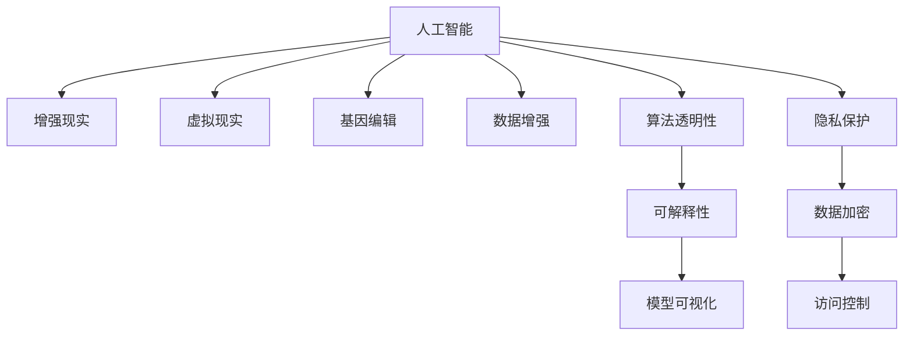

                 

# AI时代的人类增强：道德考虑和身体增强的限制

> 关键词：人工智能, 人体增强, 道德伦理, 隐私保护, 公平性, 安全性, 算法透明性, 未来展望

## 1. 背景介绍

随着人工智能技术的飞速发展，人类增强（Human Augmentation）正逐渐成为可能。借助AI的强大计算能力，人类可以突破自身生理和认知的局限，获得更加强大的能力和智能。然而，这一过程也伴随着诸多道德和伦理挑战，需要我们对这些技术的使用加以审慎思考。

### 1.1 问题由来

现代科技的迅猛发展，尤其是生物技术和人工智能的交叉融合，为人类增强提供了前所未有的机遇。例如，基因编辑技术可以修复遗传性疾病，延长人类寿命；增强现实（AR）和虚拟现实（VR）技术可以增强认知能力，拓展信息获取渠道；AI算法可以对大数据进行深度分析，提升决策科学性。但与此同时，这些技术的广泛应用也带来了一些负面影响，如伦理争议、隐私侵犯、数据滥用等问题。

### 1.2 问题核心关键点

人工智能技术在人类增强领域的应用，主要涉及以下几个关键点：
1. **技术的可行性与局限性**：目前已有技术在多大程度上可以应用于人类增强？其效用和安全性如何？
2. **伦理与道德考量**：增强技术对个体、社会有何影响？如何防止技术滥用？
3. **隐私保护**：增强技术涉及大量敏感数据，如何确保数据安全？
4. **公平性与安全性**：技术应用是否公平？如何防止算法偏见和攻击？
5. **算法的透明性**：如何确保算法的决策过程公开透明？

这些问题的探讨，将有助于我们更好地理解和应对人工智能技术在人类增强领域的应用。

## 2. 核心概念与联系

### 2.1 核心概念概述

为更好地理解人工智能在人类增强中的应用，本节将介绍几个关键概念：

- **人工智能（AI）**：通过模拟人脑的逻辑和推理过程，让机器执行复杂任务的技术。
- **人类增强（Human Augmentation）**：通过技术手段提升人类生理和认知能力的过程。
- **生物技术（Biotechnology）**：利用生物科学原理，开发改善人类健康和体能的新技术。
- **增强现实（AR）和虚拟现实（VR）**：通过计算机生成的视觉、听觉等感官信息，扩展人类的感知能力。
- **算法透明性（Algorithmic Transparency）**：确保算法的决策过程可被理解和解释。
- **隐私保护（Privacy Protection）**：在数据收集、存储、处理和分享过程中，保障个人隐私安全。

这些概念之间相互联系，共同构成了人工智能时代人类增强的核心框架。

### 2.2 核心概念原理和架构的 Mermaid 流程图



这个流程图展示了人工智能与人类增强领域内的多个关键概念及其相互联系：

1. 人工智能技术为增强现实、虚拟现实、基因编辑等提供了技术支持。
2. 增强现实、虚拟现实、基因编辑等技术通过扩展人类感知、提升健康和体能，实现了人类增强。
3. 算法透明性和隐私保护是确保技术安全和伦理的基础。
4. 可解释性、数据加密和访问控制等措施，保障了增强技术的可信度和安全性。

## 3. 核心算法原理 & 具体操作步骤

### 3.1 算法原理概述

人工智能在人类增强中的应用，主要依赖于以下几个核心算法：

- **深度学习（Deep Learning）**：利用多层神经网络，通过大量数据训练模型，实现高精度预测和决策。
- **自然语言处理（NLP）**：使计算机能够理解、生成和分析人类语言，实现更智能的交互。
- **计算机视觉（CV）**：让计算机能“看”和“理解”图像和视频，提升人类的视觉感知能力。
- **机器人学（Robotics）**：通过传感器和控制器，使机器人能够执行复杂的物理任务。

这些算法共同构成了人工智能技术在人类增强领域的基础，通过不断优化算法模型，提升技术的实用性和安全性。

### 3.2 算法步骤详解

基于人工智能技术的人类增强，一般包括以下几个关键步骤：

**Step 1: 数据准备和预处理**
- 收集与增强目标相关的数据，如健康数据、学习记录、行为数据等。
- 对数据进行清洗、标准化和归一化处理，确保数据质量。

**Step 2: 模型训练与优化**
- 使用深度学习等算法，对数据进行建模和训练。
- 根据模型性能，优化超参数，如学习率、批大小等。
- 通过交叉验证等方法，评估模型泛化能力。

**Step 3: 模型评估与测试**
- 在测试数据集上评估模型性能，如准确率、召回率等指标。
- 对模型进行灵敏度、特异度等测试，确保模型在实际应用中的可靠性。

**Step 4: 模型部署与应用**
- 将训练好的模型部署到实际应用环境中，如增强现实、虚拟现实、基因编辑等场景。
- 对用户进行隐私保护，确保数据使用合法合规。
- 对模型进行实时监控，确保系统稳定运行。

### 3.3 算法优缺点

人工智能在人类增强中的应用具有以下优点：
1. **高效性**：通过深度学习等算法，可以实现高精度预测和决策，显著提升人类能力。
2. **泛化性强**：通过大数据训练，模型能够适应不同环境和应用场景。
3. **可扩展性**：通过算法优化和硬件升级，可以不断提升系统的性能和功能。

同时，这些技术也存在一些局限性：
1. **技术复杂性高**：需要大量专业知识和技能，应用门槛较高。
2. **数据依赖性强**：需要高质量的大数据支持，数据获取成本较高。
3. **安全性问题**：技术应用可能带来隐私泄露、算法偏见等安全问题。

### 3.4 算法应用领域

人工智能在人类增强中的应用领域广泛，包括但不限于：

- **医疗健康**：基因编辑、药物研发、疾病诊断和治疗。
- **教育培训**：个性化学习、智能辅导、虚拟教室。
- **体育运动**：增强训练、运动损伤预防、体能监测。
- **军事应用**：智能装备、模拟训练、战场决策。
- **娱乐文化**：虚拟现实游戏、沉浸式体验、内容创作。

这些领域的应用展示了人工智能技术的巨大潜力，但也带来了诸多道德和伦理挑战。

## 4. 数学模型和公式 & 详细讲解 & 举例说明

### 4.1 数学模型构建

本节将使用数学语言对基于人工智能技术的人类增强模型进行更加严格的刻画。

假设有一项基于人工智能技术的增强应用，目标是提升人类的某种能力，如学习效率、认知能力等。记增强模型为 $M_{\theta}(x)$，其中 $\theta$ 为模型参数，$x$ 为输入数据。增强后的输出 $y$ 与 $x$ 的关系为：

$$
y = M_{\theta}(x)
$$

模型的目标是通过训练，最小化输出 $y$ 与目标值 $y^*$ 之间的误差：

$$
\min_{\theta} ||y - y^*||^2
$$

其中，$||\cdot||^2$ 表示误差平方。

### 4.2 公式推导过程

以提升学习效率为例，假设输入数据 $x$ 为学生的学习记录，目标输出 $y^*$ 为学生的期望学习效率。模型的输入为 $x = (x_1, x_2, \ldots, x_n)$，其中 $x_i$ 为学生在第 $i$ 天的学习时长和内容。模型输出 $y = (y_1, y_2, \ldots, y_n)$，其中 $y_i$ 为学生在第 $i$ 天的实际学习效率。

模型的优化目标可以表示为：

$$
\min_{\theta} \sum_{i=1}^n (y_i - y^*)^2
$$

其中，$\theta$ 为模型的超参数，包括神经网络层数、神经元数量、学习率等。

### 4.3 案例分析与讲解

以一个简单的神经网络模型为例，分析其训练和优化过程。

首先，构建神经网络模型：

$$
M_{\theta}(x) = \sigma(W_2 \sigma(W_1 x + b_1) + b_2)
$$

其中，$W_1$ 和 $W_2$ 为权重矩阵，$b_1$ 和 $b_2$ 为偏置项，$\sigma$ 为激活函数。

设输入数据 $x$ 为 $x = [x_1, x_2, \ldots, x_n]^T$，目标输出 $y^*$ 为 $y^* = [y_1^*, y_2^*, \ldots, y_n^*]^T$。

模型训练过程中，通过反向传播算法计算误差，并根据误差调整参数：

$$
\frac{\partial L}{\partial \theta} = \frac{\partial}{\partial \theta} \sum_{i=1}^n (y_i - y_i^*)^2
$$

其中，$L$ 为损失函数，可以通过交叉熵等方法计算。

通过不断迭代优化，模型参数 $\theta$ 逐渐逼近最优解，最终提升学习效率。

## 5. 项目实践：代码实例和详细解释说明

### 5.1 开发环境搭建

在进行人类增强项目开发前，我们需要准备好开发环境。以下是使用Python进行深度学习开发的环境配置流程：

1. 安装Anaconda：从官网下载并安装Anaconda，用于创建独立的Python环境。

2. 创建并激活虚拟环境：
```bash
conda create -n pytorch-env python=3.8 
conda activate pytorch-env
```

3. 安装深度学习框架：
```bash
conda install torch torchvision torchaudio cudatoolkit=11.1 -c pytorch -c conda-forge
```

4. 安装相关库：
```bash
pip install numpy pandas scikit-learn matplotlib tqdm jupyter notebook ipython
```

完成上述步骤后，即可在`pytorch-env`环境中开始人类增强项目开发。

### 5.2 源代码详细实现

下面我们以提升学习效率为例，给出使用深度学习框架PyTorch实现人类增强模型的代码实现。

首先，定义模型和优化器：

```python
import torch
import torch.nn as nn
import torch.optim as optim

class MLP(nn.Module):
    def __init__(self, input_size, hidden_size, output_size):
        super(MLP, self).__init__()
        self.fc1 = nn.Linear(input_size, hidden_size)
        self.fc2 = nn.Linear(hidden_size, output_size)
        self.relu = nn.ReLU()

    def forward(self, x):
        x = self.fc1(x)
        x = self.relu(x)
        x = self.fc2(x)
        return x

input_size = 10
hidden_size = 20
output_size = 1

model = MLP(input_size, hidden_size, output_size)
optimizer = optim.SGD(model.parameters(), lr=0.001)
```

接着，定义训练和评估函数：

```python
def train_epoch(model, train_data, optimizer, loss_fn):
    model.train()
    for batch in train_data:
        x, y = batch
        optimizer.zero_grad()
        outputs = model(x)
        loss = loss_fn(outputs, y)
        loss.backward()
        optimizer.step()
    return loss

def evaluate(model, test_data, loss_fn):
    model.eval()
    with torch.no_grad():
        losses = []
        for batch in test_data:
            x, y = batch
            outputs = model(x)
            loss = loss_fn(outputs, y)
            losses.append(loss.item())
        return sum(losses) / len(test_data)
```

最后，启动训练流程并在测试集上评估：

```python
epochs = 100
batch_size = 32

train_data = ...
test_data = ...

for epoch in range(epochs):
    loss = train_epoch(model, train_data, optimizer, loss_fn)
    print(f"Epoch {epoch+1}, train loss: {loss:.4f}")
    
print(f"Epoch {epochs+1}, dev results:")
print(evaluate(model, test_data, loss_fn))
```

以上就是使用PyTorch实现人类增强模型的完整代码实现。可以看到，通过深度学习框架，我们可以用相对简洁的代码完成模型的构建和训练。

### 5.3 代码解读与分析

让我们再详细解读一下关键代码的实现细节：

**MLP类**：
- `__init__`方法：初始化模型结构，包括两个全连接层和ReLU激活函数。
- `forward`方法：定义前向传播计算，通过线性变换和激活函数计算输出。

**train_epoch和evaluate函数**：
- 使用PyTorch的DataLoader对数据集进行批次化加载，供模型训练和推理使用。
- 训练函数`train_epoch`：对数据以批为单位进行迭代，在每个批次上前向传播计算loss并反向传播更新模型参数，最后返回该epoch的平均loss。
- 评估函数`evaluate`：与训练类似，不同点在于不更新模型参数，并在每个batch结束后将预测和标签结果存储下来，最后使用自定义损失函数计算整体损失。

**训练流程**：
- 定义总的epoch数和batch size，开始循环迭代
- 每个epoch内，先在训练集上训练，输出平均loss
- 在测试集上评估，输出整体损失
- 所有epoch结束后，给出最终测试结果

可以看到，PyTorch框架使得深度学习模型的实现和训练变得简洁高效。开发者可以将更多精力放在模型设计、数据处理等高层逻辑上，而不必过多关注底层的实现细节。

当然，工业级的系统实现还需考虑更多因素，如模型的保存和部署、超参数的自动搜索、更灵活的任务适配层等。但核心的模型构建和训练流程基本与此类似。

## 6. 实际应用场景

### 6.1 智能教育

基于深度学习技术的人类增强，可以广泛应用于智能教育系统的构建。传统教育往往依赖教师的个人经验和知识，难以满足个性化教学需求。而使用增强后的教育模型，可以实时分析和调整教学策略，实现个性化学习，提升教学效果。

在技术实现上，可以收集学生的学习记录、行为数据等，构建基于深度学习的智能辅导系统。模型可以根据学生的学习表现和兴趣，推荐个性化学习资源，辅助教师进行因材施教。如此构建的智能教育系统，能显著提高学生的学习效率和效果。

### 6.2 医疗健康

在医疗健康领域，基于深度学习技术的人类增强，可以提升诊断和治疗的准确性。例如，通过基因编辑技术，可以修复遗传性疾病；通过增强现实技术，可以模拟手术过程，提高手术成功率；通过深度学习模型，可以进行疾病预测和个性化治疗。

在具体应用中，可以收集大量的医疗数据，包括基因序列、病历记录、影像数据等，构建深度学习模型。模型可以对新入院患者的基因和病历进行分析和预测，辅助医生进行疾病诊断和治疗。如此构建的医疗增强系统，能提高诊断的准确性和治疗的个性化水平，提升医疗服务的质量和效率。

### 6.3 军事应用

在军事应用领域，基于深度学习技术的人类增强，可以提升情报分析和战场决策的精准度。例如，通过计算机视觉技术，可以实时监控战场环境，识别敌我目标；通过自然语言处理技术，可以分析敌对国家的政策动向，辅助军事决策；通过深度学习模型，可以进行情报分析和战斗模拟。

在具体应用中，可以收集军事卫星数据、战场监控视频、敌方通讯记录等，构建深度学习模型。模型可以实时分析战场环境，辅助指挥官进行情报分析和战斗决策。如此构建的军事增强系统，能提高情报分析和战斗决策的精准度，提升战场指挥能力。

### 6.4 未来应用展望

随着深度学习技术的发展，基于人类增强的应用场景将更加广泛。未来，人工智能技术将进一步渗透到更多领域，为人类带来全新的体验和能力。

在智慧城市治理中，基于深度学习技术的人类增强，可以实现智能交通、公共安全、应急响应等功能，提升城市的智能化水平。

在智能家居应用中，基于深度学习技术的人类增强，可以实现语音交互、智能控制、环境监测等功能，提升居家体验。

在文化娱乐领域，基于深度学习技术的人类增强，可以实现虚拟现实、增强现实、内容生成等功能，带来全新的娱乐体验。

## 7. 工具和资源推荐

### 7.1 学习资源推荐

为了帮助开发者系统掌握深度学习技术在人类增强领域的应用，这里推荐一些优质的学习资源：

1. **《深度学习》**（Ian Goodfellow等著）：全面介绍深度学习的基本概念、算法和应用，是深度学习的经典教材。
2. **Deep Learning Specialization**（Coursera课程）：由深度学习领域的知名专家Andrew Ng主讲，涵盖了深度学习的基础和高级内容。
3. **Transformers: From Self-Attention to Statistical Translation**（ACL 2019论文）：介绍了Transformer模型的原理和应用，是Transformer技术的奠基性论文。
4. **Natural Language Processing with PyTorch**（书籍）：详细介绍了使用PyTorch进行自然语言处理，包括深度学习模型构建和优化等内容。
5. **Hugging Face Transformers**：提供了丰富的预训练模型和代码示例，是使用深度学习模型进行人类增强开发的强大工具。

通过对这些资源的学习实践，相信你一定能够快速掌握深度学习技术在人类增强领域的应用，并用于解决实际的增强问题。

### 7.2 开发工具推荐

高效的开发离不开优秀的工具支持。以下是几款用于深度学习技术人类增强开发的常用工具：

1. **PyTorch**：基于Python的开源深度学习框架，灵活动态的计算图，适合快速迭代研究。大部分深度学习模型都有PyTorch版本的实现。
2. **TensorFlow**：由Google主导开发的开源深度学习框架，生产部署方便，适合大规模工程应用。同样有丰富的深度学习模型资源。
3. **Hugging Face Transformers**：提供了丰富的预训练模型和代码示例，是使用深度学习模型进行人类增强开发的强大工具。
4. **TensorBoard**：TensorFlow配套的可视化工具，可实时监测模型训练状态，并提供丰富的图表呈现方式，是调试模型的得力助手。
5. **Weights & Biases**：模型训练的实验跟踪工具，可以记录和可视化模型训练过程中的各项指标，方便对比和调优。

合理利用这些工具，可以显著提升深度学习技术在人类增强任务的开发效率，加快创新迭代的步伐。

### 7.3 相关论文推荐

深度学习技术在人类增强领域的研究始于学术界，以下是几篇奠基性的相关论文，推荐阅读：

1. **ImageNet Classification with Deep Convolutional Neural Networks**（AlexNet论文）：介绍了卷积神经网络的原理和应用，是深度学习领域的奠基性论文。
2. **Bidirectional Long Short-Term Memory Networks Applied to Natural Language Processing**（LSTM论文）：介绍了长短时记忆网络（LSTM）的原理和应用，是自然语言处理领域的经典模型。
3. **Attention is All You Need**（Transformer论文）：提出了Transformer结构，开启了深度学习领域的预训练范式。
4. **Attention-Based Reasoning**（Reasoning paper）：探讨了深度学习模型在逻辑推理和知识图谱中的应用，是AI知识推理领域的经典论文。
5. **Deep Reinforcement Learning for Human-Robot Interaction**（深度强化学习论文）：介绍了深度强化学习在机器人学中的应用，是AI机器人领域的经典论文。

这些论文代表了大规模深度学习技术在人类增强领域的研究脉络。通过学习这些前沿成果，可以帮助研究者把握学科前进方向，激发更多的创新灵感。

## 8. 总结：未来发展趋势与挑战

### 8.1 研究成果总结

本文对基于深度学习技术的人类增强模型进行了全面系统的介绍。首先阐述了深度学习技术在人类增强领域的应用背景和意义，明确了增强技术在提高人类认知和体能方面的独特价值。其次，从原理到实践，详细讲解了深度学习模型的构建和优化过程，给出了人类增强任务开发的完整代码实例。同时，本文还广泛探讨了增强技术在智能教育、医疗健康、军事应用等多个领域的应用前景，展示了深度学习技术的巨大潜力。最后，本文精选了深度学习技术在人类增强领域的各类学习资源，力求为读者提供全方位的技术指引。

通过本文的系统梳理，可以看到，基于深度学习技术的人类增强模型在提升人类认知和体能方面展示了巨大潜力。受益于深度学习模型的不断优化和应用场景的不断拓展，未来在医疗健康、智能教育、军事应用等领域，深度学习技术将为人类带来全新的体验和能力，推动社会进步和文明发展。

### 8.2 未来发展趋势

展望未来，深度学习技术在人类增强领域的应用将呈现以下几个发展趋势：

1. **算力提升**：随着计算资源的丰富和计算效率的提升，深度学习模型的规模将进一步扩大，处理能力将更强。
2. **算法优化**：深度学习算法将不断优化，更加高效、鲁棒和可靠，适应更多应用场景。
3. **跨领域融合**：深度学习技术与生物技术、计算机视觉、自然语言处理等领域将进一步融合，实现更全面的人类增强。
4. **伦理和隐私保护**：随着深度学习技术的应用普及，伦理和隐私保护问题将更加突出，相关法规和标准将更加严格。
5. **智能交互**：基于深度学习技术的增强模型将更加注重智能交互和自然语言处理，提升用户体验。

以上趋势凸显了深度学习技术在人类增强领域的应用前景，这些方向的探索发展，必将进一步提升人类认知和体能的边界，为构建更加智能、高效的社会提供技术支持。

### 8.3 面临的挑战

尽管深度学习技术在人类增强领域取得了显著进展，但在迈向更加智能化、普适化应用的过程中，仍面临诸多挑战：

1. **数据获取和处理**：深度学习模型需要大量高质量的数据支持，如何获取和处理这些数据，是一个重要问题。
2. **算法复杂性**：深度学习模型的训练和优化过程复杂，需要大量的计算资源和时间，难以在实时场景中应用。
3. **伦理和隐私**：深度学习技术的应用可能带来伦理和隐私问题，如何确保技术应用的安全性和合规性，是一个重要课题。
4. **可解释性**：深度学习模型的决策过程复杂，难以解释和理解，需要开发更透明的模型。
5. **公平性**：深度学习模型可能存在算法偏见，如何确保模型的公平性，是一个重要问题。

这些挑战需要多方协作，共同解决，才能推动深度学习技术在人类增强领域的进一步应用。

### 8.4 研究展望

面对深度学习技术在人类增强领域面临的挑战，未来的研究需要在以下几个方面寻求新的突破：

1. **数据收集和处理**：开发更高效的数据收集和处理方法，确保深度学习模型能够获得高质量的数据支持。
2. **算法优化**：继续优化深度学习算法，提高模型效率和鲁棒性，实现更广泛的应用场景。
3. **伦理和隐私保护**：制定相关法规和标准，确保深度学习技术应用的安全性和合规性。
4. **可解释性**：开发更透明的深度学习模型，提高模型的可解释性和可信度。
5. **公平性**：研究如何消除深度学习模型的算法偏见，确保模型的公平性和安全性。

这些研究方向的探索，必将引领深度学习技术在人类增强领域迈向更高的台阶，为构建更加智能、高效的社会提供技术支持。面向未来，深度学习技术需要在算法、伦理、隐私、公平等方面进行全面的研究和优化，才能真正实现其应用价值。

## 9. 附录：常见问题与解答

**Q1：深度学习技术在人类增强领域的应用前景如何？**

A: 深度学习技术在人类增强领域展示了巨大的潜力，如智能教育、医疗健康、军事应用等领域。通过深度学习模型的训练和优化，可以实现个性化学习、疾病预测、战场决策等功能，提升人类认知和体能的边界。

**Q2：人类增强技术面临哪些伦理和隐私问题？**

A: 人类增强技术可能带来诸多伦理和隐私问题，如基因编辑可能引发的伦理争议、增强技术的滥用风险、隐私数据泄露等。这些问题需要多方协作，共同制定相关法规和标准，确保技术应用的安全性和合规性。

**Q3：如何确保深度学习模型的公平性？**

A: 确保深度学习模型的公平性，需要从数据、算法和应用等多个层面进行优化。在数据层面，需要确保数据的多样性和代表性；在算法层面，需要设计公平性优化算法；在应用层面，需要进行公平性测试和评估。

**Q4：如何开发更透明的深度学习模型？**

A: 开发更透明的深度学习模型，需要采用可解释性技术，如注意力机制、可视化工具等。这些技术可以帮助用户理解模型的决策过程，提高模型的可信度和透明度。

**Q5：深度学习技术在人类增强领域的应用前景如何？**

A: 深度学习技术在人类增强领域展示了巨大的潜力，如智能教育、医疗健康、军事应用等领域。通过深度学习模型的训练和优化，可以实现个性化学习、疾病预测、战场决策等功能，提升人类认知和体能的边界。

---

作者：禅与计算机程序设计艺术 / Zen and the Art of Computer Programming

