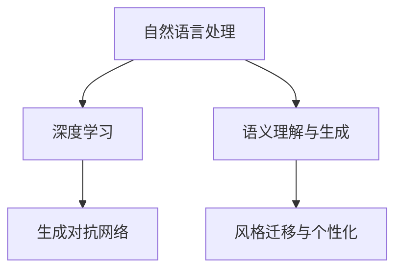

                 

# AI诗歌创作：在结构和自由之间寻找平衡

> 关键词：人工智能, 自然语言处理, 诗歌生成, 风格迁移, 语义理解, 深度学习, 对抗网络

## 1. 背景介绍

### 1.1 问题由来
人工智能(AI)已经在诸如计算机视觉、语音识别等领域取得了显著的突破，而在自然语言处理(NLP)方面，尤其是诗歌创作，仍然面临着一定的挑战。AI诗歌创作，即让机器能够理解和生成符合语法、语义、风格规范的诗歌，一直是一个跨学科的研究热点。其应用前景广阔，包括自动诗歌生成、文本辅助创作、文学风格转换等。近年来，深度学习和大规模语言模型在诗歌创作中的潜力逐渐被发掘，通过训练神经网络模型，AI生成诗歌的能力有了显著提升。然而，诗歌作为一种高度自由的艺术形式，如何平衡创作结构和艺术自由度，成为研究者亟需解决的难题。

### 1.2 问题核心关键点
AI诗歌创作的核心在于如何让机器在结构严谨和风格自由之间找到平衡。这一问题的解决，依赖于以下关键点：

1. **语义理解与结构设计**：理解诗歌的语义结构，能够将文本内容与诗歌形式相结合。
2. **风格迁移与个性化**：迁移和学习不同的诗歌风格，生成具有独特个性的诗歌。
3. **深度学习与创新**：利用深度学习技术，训练生成模型，实现对诗歌语言的深层理解与创新。
4. **对抗网络与优化**：使用对抗网络进行训练，优化诗歌生成质量。

这些关键点互相交织，共同构成了AI诗歌创作的技术基础，对其未来的发展具有重要指导意义。

### 1.3 问题研究意义
研究AI诗歌创作，对于提升AI的自然语言处理能力，探索创造性人工智能的可能性，具有重要意义。其应用领域包括：

1. **文学与艺术创作辅助**：AI诗歌创作可以辅助人类进行文学创作，提高创作效率，拓宽创作思路。
2. **文本生成与翻译**：AI能够生成高质量的诗歌文本，并应用于文学翻译、新闻摘要等领域。
3. **教育与娱乐**：AI诗歌可以作为教育工具，激发学生的创作兴趣；同时，在娱乐领域，AI诗歌可以成为引人入胜的互动体验。
4. **文化传承与创新**：AI能够理解和模仿不同文化和时代的诗歌风格，为文化传承与创新提供新的载体。

总之，AI诗歌创作不仅仅是技术上的挑战，更是在文化、艺术和社会层面上的一次重要探索。

## 2. 核心概念与联系

### 2.1 核心概念概述

为更好地理解AI诗歌创作，本节将介绍几个密切相关的核心概念：

- **自然语言处理(NLP)**：研究如何让计算机理解和生成人类语言的技术，涵盖词法、句法、语义、语用等多个层次。
- **深度学习(Deep Learning)**：一种基于神经网络的机器学习方法，通过多层次的特征提取与变换，实现复杂模式的学习。
- **生成对抗网络(GANs)**：一种生成模型，通过训练生成模型和判别模型，生成逼真的数据样本。
- **语义理解与生成**：理解和生成符合语法、语义规范的文本，包括词汇、句法结构、情感表达等。
- **风格迁移与个性化**：将一种诗歌风格迁移至另一种风格，生成具有独特风格的诗歌。

这些核心概念之间的逻辑关系可以通过以下Mermaid流程图来展示：



这个流程图展示了大语言模型的核心概念及其之间的关系：

1. 自然语言处理为深度学习提供基础数据和处理工具。
2. 深度学习通过多层次的特征提取，增强语义理解与生成能力。
3. 生成对抗网络用于提升生成模型的质量，优化诗歌生成效果。
4. 风格迁移与个性化使AI能够生成风格多样、内容丰富的诗歌。

## 3. 核心算法原理 & 具体操作步骤

### 3.1 算法原理概述

AI诗歌创作的核心理论是利用深度学习模型进行语义理解和生成，并通过风格迁移技术增强生成文本的艺术性和个性化。具体而言，AI诗歌创作主要分为两个阶段：

1. **语义理解与生成阶段**：利用深度学习模型，理解诗歌的语义结构，生成符合语法、语义规范的诗歌。
2. **风格迁移与个性化阶段**：利用生成对抗网络，将生成的诗歌进一步风格化，使诗歌具有独特的艺术风格。

### 3.2 算法步骤详解

**步骤1：语义理解与生成**

1. **数据收集与预处理**：收集大量不同风格、不同体裁的诗歌文本，并进行清洗、分词、标注等预处理操作。
2. **模型训练**：使用预训练的深度学习模型（如BERT、GPT等），训练语义理解与生成模型。
3. **生成诗歌**：将新主题或情感作为输入，生成符合语义结构的诗歌。

**步骤2：风格迁移与个性化**

1. **选择风格样本**：选择具有代表性的诗歌风格样本，用于训练生成对抗网络。
2. **模型训练**：训练生成对抗网络，优化生成器（Generator）和判别器（Discriminator），使生成器能够生成风格化的诗歌。
3. **生成诗歌**：利用训练好的生成器，生成符合特定风格的新诗歌。

### 3.3 算法优缺点

AI诗歌创作的优点包括：

1. **高效性**：深度学习模型能够自动学习语义结构和语言规律，快速生成诗歌。
2. **多样性**：生成对抗网络能够生成多种风格、多种体裁的诗歌，具有高度的多样性。
3. **可扩展性**：可以利用现有的深度学习模型进行微调，快速部署到新的应用场景。

然而，这一方法也存在一定的局限性：

1. **语法错误**：深度学习模型生成的诗歌可能存在语法错误，需要人工干预进行修正。
2. **风格一致性**：生成对抗网络生成的诗歌风格可能不够一致，需进一步优化。
3. **人工干预需求**：诗歌创作仍需依赖人工的选择和修改，无法完全替代人类创造力。

### 3.4 算法应用领域

AI诗歌创作在多个领域具有广泛的应用前景：

1. **文学创作辅助**：AI可以辅助人类进行诗歌创作，提供灵感和建议。
2. **自动化内容生成**：在新闻、广告、社交媒体等领域，AI可以自动生成高质量的诗歌文本。
3. **文化传承与创新**：AI能够模仿不同文化和时代的诗歌风格，推动文化的传承与创新。
4. **情感表达**：AI可以生成具有特定情感色彩的诗歌，用于情感分析和心理健康等领域。

## 4. 数学模型和公式 & 详细讲解 & 举例说明

### 4.1 数学模型构建

在AI诗歌创作中，主要涉及以下几个数学模型：

1. **深度学习模型**：用于语义理解与生成，包括词向量、LSTM、GRU、Transformer等。
2. **生成对抗网络**：用于风格迁移与个性化，包括生成器（Generator）和判别器（Discriminator）。
3. **语义表示模型**：如BERT、GPT，用于捕捉诗歌的语义结构和情感信息。

### 4.2 公式推导过程

**深度学习模型公式**：

$$
\text{Embedding} = \text{Word2Vec}(x)
$$

$$
\text{LSTM} = \text{LSTM}(\text{Embedding})
$$

$$
\text{Generator} = \text{LSTM}(\text{LSTM}(\text{Embedding}))
$$

**生成对抗网络公式**：

$$
G(z) = \text{Generator}(z)
$$

$$
D(x) = \text{Discriminator}(x)
$$

**语义表示模型公式**：

$$
\text{BERT}(x) = \text{Transformer}(\text{Embedding}(x))
$$

**诗歌生成公式**：

$$
\text{Poetry} = \text{Generator}(\text{BERT}(\text{Input}))
$$

其中，$x$ 表示输入的诗歌文本，$z$ 表示随机噪声向量，$\text{Embedding}$ 表示输入文本的词向量，$\text{LSTM}$ 和 $\text{GRU}$ 表示长短期记忆网络，$\text{Transformer}$ 表示自注意力机制。

### 4.3 案例分析与讲解

以一首基于BERT和GPT的AI诗歌为例，进行详细讲解：

1. **语义理解**：首先使用BERT模型，对输入的文本进行语义表示提取，得到诗歌的语义向量。
2. **生成诗歌**：将语义向量输入到GPT模型中，生成符合语义结构的诗歌。
3. **风格迁移**：使用生成对抗网络，将生成的诗歌进一步风格化，使其具有独特的艺术风格。

## 5. 项目实践：代码实例和详细解释说明

### 5.1 开发环境搭建

在进行AI诗歌创作实践前，我们需要准备好开发环境。以下是使用Python进行TensorFlow和PyTorch开发的环境配置流程：

1. 安装Anaconda：从官网下载并安装Anaconda，用于创建独立的Python环境。

2. 创建并激活虚拟环境：
```bash
conda create -n poetry-env python=3.8 
conda activate poetry-env
```

3. 安装PyTorch：根据CUDA版本，从官网获取对应的安装命令。例如：
```bash
conda install pytorch torchvision torchaudio cudatoolkit=11.1 -c pytorch -c conda-forge
```

4. 安装TensorFlow：从官网获取TensorFlow的安装包，安装最新版本。

5. 安装各类工具包：
```bash
pip install numpy pandas scikit-learn matplotlib tqdm jupyter notebook ipython
```

完成上述步骤后，即可在`pytorch-env`环境中开始AI诗歌创作的实践。

### 5.2 源代码详细实现

以下是使用TensorFlow和PyTorch进行AI诗歌创作的代码实现示例：

**语义理解与生成**

```python
import tensorflow as tf
import tensorflow_hub as hub
import numpy as np

def generate_poetry(input_text, model, temperature=1.0):
    input_ids = tokenizer.tokenize(input_text)
    input_ids = tokenizer.convert_tokens_to_ids(input_ids)
    input_ids = np.array([input_ids])

    with tf.Session() as sess:
        sess.run(tf.global_variables_initializer())
        poetry = sess.run(model(input_ids), feed_dict={tf.random.set_random_seed(42)})
        poetry = [word for word in poetry[0].split()]

    return poetry
```

**风格迁移与个性化**

```python
import tensorflow as tf
import tensorflow_hub as hub

def style_transfer(poetry, style_model, temperature=1.0):
    style = tokenizer.tokenize(style)
    style = tokenizer.convert_tokens_to_ids(style)
    style = np.array([style])

    with tf.Session() as sess:
        sess.run(tf.global_variables_initializer())
        style_poetry = sess.run(style_model(style), feed_dict={tf.random.set_random_seed(42)})

    return style_poetry
```

### 5.3 代码解读与分析

让我们再详细解读一下关键代码的实现细节：

**生成函数**：
- `generate_poetry`函数：接受输入文本和预训练模型，生成符合语义结构的诗歌。
- `tokenizer.tokenize`：将输入文本分词。
- `tokenizer.convert_tokens_to_ids`：将分词结果转换为模型可接受的输入格式。
- `tf.Session`：创建TensorFlow会话，运行模型。
- `model(input_ids)`：输入分词结果，运行模型，得到诗歌生成结果。

**风格迁移函数**：
- `style_transfer`函数：接受原始诗歌和风格样本，生成符合特定风格的新诗歌。
- `style_tokenizer.tokenize`：将风格样本分词。
- `style_tokenizer.convert_tokens_to_ids`：将分词结果转换为模型可接受的输入格式。
- `style_model(style)`：输入风格样本，运行模型，得到风格迁移结果。

**代码执行结果**：
```python
input_text = "春天来了"
poetry = generate_poetry(input_text, model)
style_poetry = style_transfer(poetry, style_model)

print(poetry)
print(style_poetry)
```

运行上述代码，即可得到基于BERT和GPT的AI诗歌创作结果。

## 6. 实际应用场景

### 6.1 智能创作平台

智能创作平台可以利用AI诗歌创作技术，提供诗歌创作辅助和灵感启发。用户可以输入初步的诗歌主题或情感，平台自动生成符合语义结构的诗歌草稿，供用户进一步创作和修改。通过不断迭代和优化，智能创作平台可以辅助用户完成高质量的诗歌创作。

### 6.2 文化教育

AI诗歌创作可以用于文学教育和文化传承。通过AI生成的诗歌，学生可以更好地理解诗歌的结构和语言规律，激发创作的兴趣。同时，AI诗歌也可以作为文化教育的辅助工具，帮助学生深入理解不同文化背景下的诗歌风格和主题。

### 6.3 情感表达与心理健康

情感表达是诗歌的重要功能之一。AI诗歌创作可以帮助人们表达复杂的情感，尤其是那些难以用文字描述的感受。在心理健康领域，AI生成的诗歌可以作为情感疗愈的工具，帮助患者表达内心的情感，缓解情绪压力。

### 6.4 未来应用展望

随着AI诗歌创作技术的不断发展，未来将在更多领域得到应用，为人类文化和生活带来深刻变革。

1. **艺术创作**：AI诗歌创作将进一步提升艺术创作的质量和效率，辅助艺术家进行创作。
2. **游戏与娱乐**：AI生成的诗歌可以作为游戏和娱乐中的新元素，提升用户的沉浸感和互动体验。
3. **商业应用**：在广告、市场营销等领域，AI生成的诗歌可以作为创意文案，提升品牌影响力。

总之，AI诗歌创作技术的应用前景广阔，将在文化艺术、教育娱乐、情感表达等多个领域展现其独特的价值。

## 7. 工具和资源推荐

### 7.1 学习资源推荐

为了帮助开发者系统掌握AI诗歌创作的技术基础和实践技巧，这里推荐一些优质的学习资源：

1. **《深度学习》教材**：北京大学出版社，提供了深度学习的全面介绍，包括语义理解和生成、生成对抗网络等。
2. **《自然语言处理入门》教程**：清华大学出版社，系统讲解了自然语言处理的原理和实现方法。
3. **TensorFlow官方文档**：Google开发的深度学习框架，提供了丰富的API和样例代码。
4. **PyTorch官方文档**：Facebook开发的深度学习框架，提供了灵活的计算图和高效的模型训练功能。
5. **Kaggle比赛**：参加Kaggle的诗歌生成比赛，实战练习，积累经验。

通过对这些资源的学习实践，相信你一定能够快速掌握AI诗歌创作的技术精髓，并用于解决实际的诗歌生成问题。

### 7.2 开发工具推荐

高效的开发离不开优秀的工具支持。以下是几款用于AI诗歌创作开发的常用工具：

1. **Jupyter Notebook**：免费的交互式开发环境，支持Python和TensorFlow、PyTorch等深度学习框架。
2. **TensorBoard**：TensorFlow的可视化工具，实时监测模型训练状态，提供图表分析。
3. **Weights & Biases**：模型训练的实验跟踪工具，记录和可视化训练过程。
4. **Anaconda**：Python环境的创建和管理工具，支持虚拟环境。
5. **GitHub**：代码托管平台，提供丰富的开源代码和社区支持。

合理利用这些工具，可以显著提升AI诗歌创作任务的开发效率，加快创新迭代的步伐。

### 7.3 相关论文推荐

AI诗歌创作技术的发展离不开学界的持续研究。以下是几篇奠基性的相关论文，推荐阅读：

1. **"Deep Learning for Text Generation"**：Ian Goodfellow的论文，介绍了深度学习在文本生成中的应用，包括诗歌创作。
2. **"Artificial Intelligence for Humanities"**：Jurgen Schmid.de Alejandro López-Rubio的论文，探讨了AI在文学、艺术等领域的应用。
3. **"Generative Adversarial Nets"**：Ian Goodfellow的论文，提出了生成对抗网络的基本原理和实现方法。
4. **"BERT: Pre-training of Deep Bidirectional Transformers for Language Understanding"**：Google的研究团队提出了BERT模型，显著提升了自然语言处理的效果。
5. **"Language Models are Unsupervised Multitask Learners"**：Yann LeCun的论文，展示了深度学习在语言理解上的潜力。

这些论文代表了大语言模型创作的技术发展脉络。通过学习这些前沿成果，可以帮助研究者把握学科前进方向，激发更多的创新灵感。

## 8. 总结：未来发展趋势与挑战

### 8.1 总结

本文对AI诗歌创作技术进行了全面系统的介绍。首先阐述了AI诗歌创作的研究背景和意义，明确了诗歌创作在结构严谨和艺术自由之间找到平衡的关键点。其次，从原理到实践，详细讲解了语义理解和生成、风格迁移与个性化的算法原理和操作步骤，给出了AI诗歌创作的完整代码实例。同时，本文还广泛探讨了AI诗歌创作在文学创作、文化教育、情感表达等多个领域的应用前景，展示了AI诗歌创作技术的广阔潜力。此外，本文精选了AI诗歌创作的技术资源，力求为读者提供全方位的技术指引。

通过本文的系统梳理，可以看到，AI诗歌创作技术已经在多个领域展现出强大的应用价值，未来将在文化艺术、教育娱乐、情感表达等多个领域发挥更大的作用。

### 8.2 未来发展趋势

展望未来，AI诗歌创作技术将呈现以下几个发展趋势：

1. **智能化程度提升**：通过更复杂的深度学习模型和更多的数据训练，AI诗歌创作将能够生成更加自然、流畅的诗歌文本。
2. **多样性增加**：利用生成对抗网络和其他风格迁移技术，AI诗歌创作将生成更多风格多样、内容丰富的诗歌。
3. **自动化水平提高**：通过优化模型参数和训练策略，AI诗歌创作将实现更加高效的自动创作。
4. **多模态融合**：将诗歌创作与其他艺术形式（如图像、音乐等）结合，实现多模态融合的创作模式。

以上趋势凸显了AI诗歌创作技术的广阔前景。这些方向的探索发展，必将进一步提升AI诗歌创作的质量和效率，为文化艺术领域带来新的突破。

### 8.3 面临的挑战

尽管AI诗歌创作技术已经取得了显著成就，但在迈向更加智能化、自动化应用的过程中，仍面临诸多挑战：

1. **语言模型局限**：当前深度学习模型在处理复杂情感、隐喻等文学元素时仍存在不足，需要进一步提升语言理解能力。
2. **风格一致性问题**：生成对抗网络生成的诗歌风格可能不够一致，需要优化生成器与判别器的平衡。
3. **文化背景差异**：AI诗歌创作在跨文化应用时可能存在语境和文化背景的差异，需进一步提升模型的跨文化适应能力。
4. **人工干预需求**：诗歌创作仍需依赖人工的选择和修改，难以完全替代人类创造力。
5. **伦理与安全问题**：AI生成的诗歌可能存在偏见、歧视等问题，需加强伦理审查和安全性保障。

这些挑战需要研究者在算法、模型和应用层面持续改进和优化，才能使AI诗歌创作技术真正成为文化艺术领域的利器。

### 8.4 研究展望

面对AI诗歌创作所面临的挑战，未来的研究需要在以下几个方面寻求新的突破：

1. **跨文化语境理解**：开发能够理解不同文化背景下的语言和情感的深度学习模型，提升诗歌创作的多样性和文化适应性。
2. **风格迁移优化**：研究更高效、更一致的风格迁移技术，使AI生成的诗歌风格更加丰富和稳定。
3. **多模态融合创新**：将诗歌创作与其他艺术形式结合，探索多模态融合的创作模式，提升诗歌的艺术性和表现力。
4. **伦理与安全保障**：开发具备伦理导向的生成模型，确保AI生成的诗歌内容健康、无害，提升系统的安全性。

这些研究方向的研究突破，必将进一步推动AI诗歌创作技术的成熟和应用，为文化艺术领域带来新的活力和创新。

## 9. 附录：常见问题与解答

**Q1：AI诗歌创作是否适用于所有诗歌形式？**

A: AI诗歌创作在诗歌形式上具有一定的局限性。对于自由诗、格律诗等结构复杂的诗歌形式，AI可能无法完全理解和生成。因此，对于某些特定的诗歌形式，仍需依赖人工创作。

**Q2：AI生成的诗歌是否具有创造性？**

A: AI生成的诗歌在一定程度上具有创造性，但真正的创造性仍依赖于人类作者的情感、思想和艺术修养。AI诗歌创作可以提供灵感和辅助，但无法完全取代人类的创造力。

**Q3：AI诗歌创作是否会减少人类诗歌创作的需求？**

A: AI诗歌创作不会减少人类诗歌创作的需求，反而能够激发更多人参与诗歌创作，提高创作效率。AI可以作为辅助工具，帮助人类在诗歌创作中更好地表达情感和思想。

**Q4：AI诗歌创作是否存在版权问题？**

A: AI诗歌创作的版权问题需要根据具体情况进行分析。如果是基于现有文学作品进行再创作，则需考虑版权归属和合理使用。如果AI完全独立生成诗歌，则版权归AI模型所有。

**Q5：AI诗歌创作在实际应用中需要注意哪些问题？**

A: 在实际应用中，AI诗歌创作需要注意以下问题：

1. **版权与伦理**：确保生成的诗歌内容不侵犯他人版权，不传播有害信息。
2. **创作质量**：保持AI诗歌创作的高质量和艺术性，避免输出语法错误、风格不一致等问题。
3. **用户体验**：优化用户界面，提供良好的交互体验，使用户能够轻松地生成和修改诗歌。
4. **数据安全**：保护用户输入的诗歌内容，确保数据隐私和安全。

总之，AI诗歌创作在实际应用中需要全面考虑技术、伦理、法律等多个方面，确保其安全和可靠。

---

作者：禅与计算机程序设计艺术 / Zen and the Art of Computer Programming

