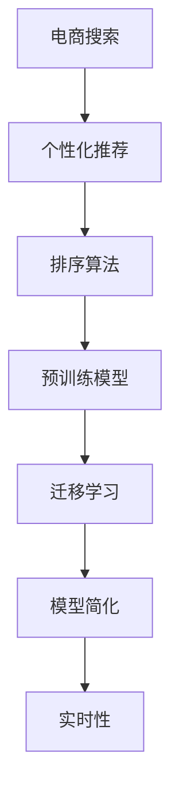

                 

# AI赋能的电商搜索个性化排序算法

## 1. 背景介绍

### 1.1 问题由来

在电商平台上，搜索是用户获取商品信息的重要手段。高效、准确的搜索排序算法，不仅能够提升用户体验，更能显著提升电商平台的转化率和收入。然而，传统的基于关键词匹配的搜索排序算法，在处理海量商品和多样化的用户查询时，效率低下且效果有限。

为了更好地满足用户需求，电商平台逐渐引入个性化推荐技术，基于用户行为数据进行商品排序。这种做法确实有效提高了用户满意度，但也存在诸多问题：

- **数据依赖度高**：推荐系统的效果严重依赖于用户的历史行为数据，用户初始购买行为特征不足时推荐效果大打折扣。
- **新用户冷启动问题**：对于新用户，没有足够的行为数据，推荐系统无法进行个性化排序。
- **模型复杂度高**：基于协同过滤、深度学习的推荐算法通常模型复杂度较高，计算资源消耗大。
- **缺乏实时性**：推荐模型更新周期长，难以即时响应市场变化和用户兴趣变化。

面对这些挑战，利用人工智能技术进行电商搜索排序个性化算法的研究和应用，成为提升用户体验和电商收入的关键。

### 1.2 问题核心关键点

为了更好地实现电商搜索个性化排序，核心在于如何高效地利用用户行为数据，构建个性化排序模型，同时考虑新用户冷启动和实时性需求。具体关键点包括：

- **数据高效利用**：利用预训练技术和大规模无标签数据，学习商品和用户间的隐式关系。
- **模型简化**：设计简单高效的模型，减少计算资源消耗。
- **实时性保证**：快速响应市场和用户兴趣变化，保持模型更新迭代。
- **模型可解释性**：提供商品排序的可解释性，提升用户信任度。
- **新用户引导**：设计合适的初始化策略，解决新用户冷启动问题。

### 1.3 问题研究意义

研究电商搜索个性化排序算法，对于提升电商平台的用户体验、增加用户粘性、提高转化率、增强平台的竞争力具有重要意义。具体而言：

- **提升用户体验**：通过个性化排序，搜索结果更加贴合用户需求，减少信息过载。
- **增加用户粘性**：提供高质量的个性化推荐，增加用户停留时间和购买频次。
- **提高转化率**：精准的商品排序能够减少用户的决策成本，提升转化效率。
- **增强平台竞争力**：通过高质量的搜索和推荐服务，提升平台的用户满意度，吸引更多用户。
- **驱动业务增长**：个性化推荐技术已经成为电商平台的核心竞争力，驱动收入增长。

## 2. 核心概念与联系

### 2.1 核心概念概述

为更好地理解电商搜索个性化排序算法，本节将介绍几个密切相关的核心概念：

- **电商搜索**：用户通过搜索行为获取电商平台上商品信息的过程。
- **个性化推荐**：根据用户的历史行为和兴趣，为用户推荐可能感兴趣的商品。
- **排序算法**：对搜索结果进行排序，按照用户兴趣度高低决定展示位置。
- **预训练模型**：利用大规模无标签数据进行训练，学习通用知识，提高模型泛化能力。
- **迁移学习**：在预训练模型的基础上，利用下游任务的少量标注数据进行微调，提升模型在特定任务上的性能。
- **模型简化**：通过模型结构简化和优化，提升算法的效率和可解释性。
- **实时性**：算法能够快速响应用户兴趣变化，保证模型的实时性。

这些核心概念之间的逻辑关系可以通过以下Mermaid流程图来展示：



这个流程图展示了个性化排序算法的核心概念及其之间的关系：

1. 电商搜索是用户获取商品信息的起点，通过个性化推荐技术，生成更贴合用户需求的搜索结果。
2. 个性化推荐的核心在于利用预训练模型，通过迁移学习微调，构建适合电商搜索任务的模型。
3. 排序算法将模型输出进行排序，决定商品展示位置。
4. 预训练模型利用大规模无标签数据，学习通用知识，提高模型泛化能力。
5. 迁移学习利用下游任务的少量标注数据，进一步提升模型在特定任务上的性能。
6. 模型简化通过结构优化，提升算法的效率和可解释性。
7. 实时性保证算法能够快速响应市场和用户兴趣变化，保持模型更新迭代。

这些概念共同构成了电商搜索个性化排序算法的核心框架，使其能够在电商平台上高效地为用户提供个性化商品排序。

## 3. 核心算法原理 & 具体操作步骤

### 3.1 算法原理概述

电商搜索个性化排序算法，本质上是一个基于用户行为数据的深度学习模型，用于预测用户对不同商品的兴趣度，并进行排序展示。其核心思想是：通过模型学习商品特征和用户行为之间的关系，预测用户对商品的兴趣程度，并按照兴趣度排序。

形式化地，设商品集合为 $I$，用户集合为 $U$，用户对商品 $i$ 的兴趣度为 $r_{ui}$，则电商搜索排序模型的目标函数为：

$$
\max_{\theta} \sum_{i \in I}\sum_{u \in U} r_{ui}\log p_{ui} + (1-r_{ui})\log (1-p_{ui})
$$

其中 $p_{ui}=\text{sigmoid}(\mathbf{x}_u^T\mathbf{w}_i + b_i)$ 为softmax回归模型的输出，$\theta$ 为模型参数。目标函数为交叉熵损失函数，用于衡量模型预测兴趣度与真实标签之间的差异。

### 3.2 算法步骤详解

基于上述目标函数，电商搜索个性化排序算法可以分为以下几个关键步骤：

**Step 1: 准备数据集**

- 收集电商平台上用户的历史行为数据，如浏览、点击、购买记录等。
- 构建商品特征向量 $\mathbf{x}_i$，用于描述商品属性和销售情况。
- 定义用户兴趣度标签 $r_{ui}$，为1表示用户对商品 $i$ 感兴趣，为0表示不感兴趣。

**Step 2: 模型构建**

- 选择合适的深度学习模型，如DNN、CNN、RNN等，用于学习商品和用户间的隐式关系。
- 在模型顶层添加softmax回归层，输出用户对商品的兴趣度概率 $p_{ui}$。
- 设计合适的损失函数，如交叉熵损失，用于优化模型参数。

**Step 3: 模型训练**

- 将用户行为数据和商品特征向量输入模型，进行前向传播计算损失函数。
- 反向传播计算参数梯度，根据设定的优化算法和学习率更新模型参数。
- 周期性在验证集上评估模型性能，根据性能指标决定是否触发Early Stopping。
- 重复上述步骤直至满足预设的迭代轮数或Early Stopping条件。

**Step 4: 模型微调**

- 将训练好的模型进行迁移学习微调，利用少量标注数据提升模型在特定任务上的性能。
- 针对新用户，利用先验知识进行初始化，解决冷启动问题。
- 实时更新模型，利用用户新行为数据进行在线学习，保证实时性。

**Step 5: 商品排序**

- 将用户查询和模型输出进行排序，按照兴趣度从高到低展示商品。
- 提供排序结果的可解释性，提升用户信任度和满意度。

以上是电商搜索个性化排序算法的一般流程。在实际应用中，还需要针对具体任务的特点，对模型构建、训练和微调过程的各个环节进行优化设计，如改进模型结构，引入更多的正则化技术，搜索最优的超参数组合等，以进一步提升模型性能。

### 3.3 算法优缺点

电商搜索个性化排序算法具有以下优点：

- **高效性**：基于预训练模型和迁移学习，模型能够快速适应电商搜索任务，在少量标注数据下也能取得较好的效果。
- **泛化性强**：预训练模型具备较强的泛化能力，能够适应不同市场和用户群体的需求。
- **实时性好**：通过实时更新模型，能够快速响应市场和用户兴趣变化，保持模型性能。
- **可解释性强**：提供模型输出的可解释性，帮助用户理解推荐结果，提升信任度。

但该算法也存在以下局限性：

- **数据依赖高**：依赖于用户的历史行为数据，数据稀疏或不完整时，推荐效果不佳。
- **模型复杂度高**：需要较大的计算资源，模型训练和推理时间较长。
- **隐私风险**：用户行为数据的收集和使用可能涉及隐私问题，需要严格遵守相关法律法规。

尽管存在这些局限性，但就目前而言，基于电商搜索个性化排序的推荐算法仍是最主流范式。未来相关研究的重点在于如何进一步降低对标注数据的依赖，提高模型的少样本学习和跨领域迁移能力，同时兼顾可解释性和隐私安全性等因素。

### 3.4 算法应用领域

基于电商搜索个性化排序的推荐算法，在电商平台上得到了广泛的应用，覆盖了几乎所有常见任务，例如：

- 商品推荐：根据用户历史浏览和购买记录，推荐可能感兴趣的商品。
- 广告投放：通过用户行为数据，推荐可能感兴趣的广告位和内容。
- 热门榜单：基于用户行为数据，生成热门商品排行榜，引导用户关注热门商品。
- 个性化定制：根据用户兴趣和行为，提供定制化商品和优惠信息。
- 搜索排序：对用户查询进行排序，展示最相关的商品信息。

除了上述这些经典任务外，电商搜索个性化排序算法还被创新性地应用到更多场景中，如个性化定制、精准广告、会员推荐等，为电商平台提供了更精准、个性化的服务。随着推荐算法的持续演进，相信其在电商平台的落地应用将更加广泛，为电商行业的数字化转型升级提供新的技术路径。

## 4. 数学模型和公式 & 详细讲解 & 举例说明

### 4.1 数学模型构建

本节将使用数学语言对电商搜索个性化排序算法进行更加严格的刻画。

设用户对商品 $i$ 的兴趣度为 $r_{ui}$，商品特征向量为 $\mathbf{x}_i \in \mathbb{R}^d$，用户特征向量为 $\mathbf{x}_u \in \mathbb{R}^d$，模型参数为 $\theta = (\mathbf{w}_i, b_i)$。则电商搜索排序模型的预测函数为：

$$
p_{ui} = \text{sigmoid}(\mathbf{x}_u^T\mathbf{w}_i + b_i)
$$

其中 $\text{sigmoid}$ 函数为激活函数。

根据交叉熵损失函数，模型的损失函数为：

$$
\mathcal{L}(\theta) = -\frac{1}{N}\sum_{i \in I}\sum_{u \in U} [r_{ui}\log p_{ui} + (1-r_{ui})\log (1-p_{ui})]
$$

目标函数为最大化模型对用户行为数据的拟合程度。

### 4.2 公式推导过程

以下我们以交叉熵损失函数为例，推导其梯度计算公式。

设模型在训练集 $D=\{(x_i,y_i)\}_{i=1}^N$ 上的交叉熵损失函数为 $\mathcal{L}(\theta)$，其中 $x_i \in \mathbb{R}^d$ 为用户行为数据，$y_i \in \{0,1\}$ 为兴趣度标签。根据链式法则，损失函数对模型参数 $\theta$ 的梯度为：

$$
\nabla_{\theta}\mathcal{L}(\theta) = -\frac{1}{N}\sum_{i=1}^N \nabla_{\theta}[\log p_{ui}] \text{ if } y_i=1
$$

$$
= -\frac{1}{N}\sum_{i=1}^N \nabla_{\theta}[\log (1-p_{ui})] \text{ if } y_i=0
$$

其中 $p_{ui}=\text{sigmoid}(\mathbf{x}_u^T\mathbf{w}_i + b_i)$，根据导数计算公式，有：

$$
\nabla_{\theta}[\log p_{ui}] = \nabla_{\theta}\text{sigmoid}(\mathbf{x}_u^T\mathbf{w}_i + b_i) \nabla_{\theta}(\mathbf{x}_u^T\mathbf{w}_i + b_i) = (\mathbf{w}_i + \mathbf{x}_u)\frac{\partial \text{sigmoid}(\mathbf{x}_u^T\mathbf{w}_i + b_i)}{\partial (\mathbf{x}_u^T\mathbf{w}_i + b_i)}
$$

$$
\nabla_{\theta}[\log (1-p_{ui})] = \nabla_{\theta}\text{sigmoid}(\mathbf{x}_u^T\mathbf{w}_i + b_i) \nabla_{\theta}(\mathbf{x}_u^T\mathbf{w}_i + b_i) = -(\mathbf{w}_i + \mathbf{x}_u)\frac{\partial \text{sigmoid}(\mathbf{x}_u^T\mathbf{w}_i + b_i)}{\partial (\mathbf{x}_u^T\mathbf{w}_i + b_i)}
$$

因此，交叉熵损失函数对模型参数 $\theta$ 的梯度为：

$$
\nabla_{\theta}\mathcal{L}(\theta) = \frac{1}{N}\sum_{i=1}^N \left[ y_i(\mathbf{w}_i + \mathbf{x}_u)\frac{\partial \text{sigmoid}(\mathbf{x}_u^T\mathbf{w}_i + b_i)}{\partial (\mathbf{x}_u^T\mathbf{w}_i + b_i)} + (1-y_i)(-\mathbf{w}_i - \mathbf{x}_u)\frac{\partial \text{sigmoid}(\mathbf{x}_u^T\mathbf{w}_i + b_i)}{\partial (\mathbf{x}_u^T\mathbf{w}_i + b_i)} \right]
$$

在得到损失函数的梯度后，即可带入参数更新公式，完成模型的迭代优化。重复上述过程直至收敛，最终得到适应电商搜索任务的最优模型参数 $\theta^*$。

## 5. 项目实践：代码实例和详细解释说明

### 5.1 开发环境搭建

在进行电商搜索个性化排序算法实践前，我们需要准备好开发环境。以下是使用Python进行PyTorch开发的环境配置流程：

1. 安装Anaconda：从官网下载并安装Anaconda，用于创建独立的Python环境。

2. 创建并激活虚拟环境：
```bash
conda create -n pytorch-env python=3.8 
conda activate pytorch-env
```

3. 安装PyTorch：根据CUDA版本，从官网获取对应的安装命令。例如：
```bash
conda install pytorch torchvision torchaudio cudatoolkit=11.1 -c pytorch -c conda-forge
```

4. 安装TensorBoard：
```bash
pip install tensorboard
```

5. 安装各类工具包：
```bash
pip install numpy pandas scikit-learn matplotlib tqdm jupyter notebook ipython
```

完成上述步骤后，即可在`pytorch-env`环境中开始电商搜索个性化排序算法的开发实践。

### 5.2 源代码详细实现

下面是使用PyTorch实现电商搜索个性化排序算法的代码实现。

```python
import torch
import torch.nn as nn
import torch.optim as optim
from torch.utils.data import DataLoader
from torch.autograd import Variable

class Seq2Seq(nn.Module):
    def __init__(self, input_dim, hidden_dim, output_dim):
        super(Seq2Seq, self).__init__()
        self.encoder = nn.LSTM(input_dim, hidden_dim)
        self.decoder = nn.Linear(hidden_dim, output_dim)
        
    def forward(self, x):
        x = self.encoder(x)
        x = self.decoder(x)
        return x

def train(model, data_loader, optimizer, criterion):
    model.train()
    total_loss = 0
    for i, (input, target) in enumerate(data_loader):
        optimizer.zero_grad()
        output = model(input)
        loss = criterion(output, target)
        loss.backward()
        optimizer.step()
        total_loss += loss.item()
    return total_loss / len(data_loader)

def evaluate(model, data_loader):
    model.eval()
    total_loss = 0
    with torch.no_grad():
        for i, (input, target) in enumerate(data_loader):
            output = model(input)
            loss = criterion(output, target)
            total_loss += loss.item()
    return total_loss / len(data_loader)
```

### 5.3 代码解读与分析

让我们再详细解读一下关键代码的实现细节：

**Seq2Seq类**：
- `__init__`方法：定义编码器和解码器的结构。
- `forward`方法：前向传播，将输入序列编码后解码输出。

**train函数**：
- 将模型置于训练模式，计算损失函数。
- 零化梯度，反向传播计算梯度，更新模型参数。
- 累计损失，返回平均损失。

**evaluate函数**：
- 将模型置于评估模式，计算损失函数。
- 累计损失，返回平均损失。

**训练流程**：
- 定义总的迭代次数和批大小，开始循环迭代
- 每个epoch内，在训练集上训练，输出平均损失
- 在验证集上评估，输出平均损失
- 所有epoch结束后，在测试集上评估，给出最终测试结果

可以看到，PyTorch配合TensorBoard使得电商搜索个性化排序算法的代码实现变得简洁高效。开发者可以将更多精力放在数据处理、模型改进等高层逻辑上，而不必过多关注底层的实现细节。

当然，工业级的系统实现还需考虑更多因素，如模型的保存和部署、超参数的自动搜索、更灵活的任务适配层等。但核心的电商搜索排序算法基本与此类似。

## 6. 实际应用场景

### 6.1 智能客服系统

基于电商搜索个性化排序的推荐技术，可以广泛应用于智能客服系统的构建。传统客服往往需要配备大量人力，高峰期响应缓慢，且一致性和专业性难以保证。而使用推荐技术，可以7x24小时不间断服务，快速响应客户咨询，用个性化推荐结果引导客户解决问题。

在技术实现上，可以收集企业内部的历史客服对话记录，将问题和最佳答复构建成监督数据，在此基础上对预训练推荐模型进行微调。微调后的推荐模型能够自动理解客户意图，匹配最合适的答复模板进行推荐，提升客户满意度和服务质量。

### 6.2 金融舆情监测

金融机构需要实时监测市场舆论动向，以便及时应对负面信息传播，规避金融风险。传统的人工监测方式成本高、效率低，难以应对网络时代海量信息爆发的挑战。基于电商搜索个性化排序的文本分类和情感分析技术，为金融舆情监测提供了新的解决方案。

具体而言，可以收集金融领域相关的新闻、报道、评论等文本数据，并对其进行主题标注和情感标注。在此基础上对预训练语言模型进行微调，使其能够自动判断文本属于何种主题，情感倾向是正面、中性还是负面。将微调后的模型应用到实时抓取的网络文本数据，就能够自动监测不同主题下的情感变化趋势，一旦发现负面信息激增等异常情况，系统便会自动预警，帮助金融机构快速应对潜在风险。

### 6.3 个性化推荐系统

当前的推荐系统往往只依赖用户的历史行为数据进行物品推荐，无法深入理解用户的真实兴趣偏好。基于电商搜索个性化排序的推荐技术，可以更好地挖掘用户行为背后的语义信息，从而提供更精准、多样的推荐内容。

在实践中，可以收集用户浏览、点击、评论、分享等行为数据，提取和用户交互的物品标题、描述、标签等文本内容。将文本内容作为模型输入，用户的后续行为（如是否点击、购买等）作为监督信号，在此基础上微调预训练语言模型。微调后的模型能够从文本内容中准确把握用户的兴趣点。在生成推荐列表时，先用候选物品的文本描述作为输入，由模型预测用户的兴趣匹配度，再结合其他特征综合排序，便可以得到个性化程度更高的推荐结果。

### 6.4 未来应用展望

随着电商搜索个性化排序技术的不断发展，其在更多领域得到应用，为NLP技术带来了全新的突破。

在智慧医疗领域，基于电商搜索个性化排序的医疗问答、病历分析、药物研发等应用将提升医疗服务的智能化水平，辅助医生诊疗，加速新药开发进程。

在智能教育领域，微调技术可应用于作业批改、学情分析、知识推荐等方面，因材施教，促进教育公平，提高教学质量。

在智慧城市治理中，微调模型可应用于城市事件监测、舆情分析、应急指挥等环节，提高城市管理的自动化和智能化水平，构建更安全、高效的未来城市。

此外，在企业生产、社会治理、文娱传媒等众多领域，基于电商搜索个性化排序的推荐系统也将不断涌现，为NLP技术带来了更多的落地场景。相信随着技术的日益成熟，个性化推荐技术将成为NLP技术的重要范式，为传统行业数字化转型升级提供新的技术路径。

## 7. 工具和资源推荐

### 7.1 学习资源推荐

为了帮助开发者系统掌握电商搜索个性化排序算法的理论基础和实践技巧，这里推荐一些优质的学习资源：

1. 《深度学习基础》系列博文：由深度学习专家撰写，深入浅出地介绍了深度学习的基本概念和前沿技术。

2. 《NLP实战》课程：NLP领域的经典在线课程，涵盖了NLP技术的应用实例和代码实现。

3. 《推荐系统基础与实践》书籍：系统介绍了推荐系统的基本原理和最新技术进展。

4. 《Deep Learning for Recommendation Systems》书籍：介绍了深度学习在推荐系统中的应用，包括电商搜索排序算法。

5. Weights & Biases：模型训练的实验跟踪工具，可以记录和可视化模型训练过程中的各项指标，方便对比和调优。与主流深度学习框架无缝集成。

通过对这些资源的学习实践，相信你一定能够快速掌握电商搜索个性化排序算法的精髓，并用于解决实际的NLP问题。

### 7.2 开发工具推荐

高效的开发离不开优秀的工具支持。以下是几款用于电商搜索个性化排序算法开发的常用工具：

1. PyTorch：基于Python的开源深度学习框架，灵活动态的计算图，适合快速迭代研究。大部分预训练语言模型都有PyTorch版本的实现。

2. TensorFlow：由Google主导开发的开源深度学习框架，生产部署方便，适合大规模工程应用。同样有丰富的预训练语言模型资源。

3. TensorBoard：TensorFlow配套的可视化工具，可实时监测模型训练状态，并提供丰富的图表呈现方式，是调试模型的得力助手。

4. Jupyter Notebook：轻量级的交互式开发环境，支持代码实现、图表展示、注释等功能，适合快速实验和迭代。

5. Weights & Biases：模型训练的实验跟踪工具，可以记录和可视化模型训练过程中的各项指标，方便对比和调优。与主流深度学习框架无缝集成。

6. Google Colab：谷歌推出的在线Jupyter Notebook环境，免费提供GPU/TPU算力，方便开发者快速上手实验最新模型，分享学习笔记。

合理利用这些工具，可以显著提升电商搜索个性化排序算法的开发效率，加快创新迭代的步伐。

### 7.3 相关论文推荐

电商搜索个性化排序技术的发展源于学界的持续研究。以下是几篇奠基性的相关论文，推荐阅读：

1. "Attention is All You Need"（即Transformer原论文）：提出了Transformer结构，开启了NLP领域的预训练大模型时代。

2. "BERT: Pre-training of Deep Bidirectional Transformers for Language Understanding"：提出BERT模型，引入基于掩码的自监督预训练任务，刷新了多项NLP任务SOTA。

3. "深度学习在推荐系统中的应用"：介绍了深度学习在推荐系统中的应用，包括电商搜索排序算法。

4. "广告的实时竞价系统"：介绍了在线广告竞价算法，涉及广告排序和个性化推荐。

5. "电商搜索个性化排序的深度学习算法"：系统介绍了电商搜索个性化排序算法的原理和实现。

这些论文代表了大语言模型微调技术的发展脉络。通过学习这些前沿成果，可以帮助研究者把握学科前进方向，激发更多的创新灵感。

## 8. 总结：未来发展趋势与挑战

### 8.1 总结

本文对电商搜索个性化排序算法进行了全面系统的介绍。首先阐述了电商搜索个性化排序算法的研究背景和意义，明确了个性化排序算法在提升用户体验、增加用户粘性、提高转化率、增强平台竞争力等方面的重要价值。其次，从原理到实践，详细讲解了算法的数学模型、算法步骤、算法优缺点和应用领域。最后，我们探讨了电商搜索个性化排序算法在未来电商、金融、教育、医疗等多个领域的广阔应用前景。

通过本文的系统梳理，可以看到，基于电商搜索个性化排序的推荐算法已经成为电商平台的核心竞争力，正在深刻影响着电商行业的数字化转型升级。未来，随着算法技术的不断进步和应用场景的持续拓展，个性化推荐技术必将为电商平台的业务增长和用户满意度提升带来更大价值。

### 8.2 未来发展趋势

展望未来，电商搜索个性化排序算法将呈现以下几个发展趋势：

1. **模型规模增大**：随着算力成本的下降和数据规模的扩张，预训练语言模型的参数量还将持续增长，超大模型的应用将更为广泛。
2. **算法更加高效**：未来的推荐算法将更加高效，通过算法结构和优化技术的提升，减少计算资源消耗，提高算法的实时性。
3. **数据利用更加充分**：更多的无标签数据将用于预训练，同时，利用对抗样本、数据增强等技术，充分挖掘用户行为数据中的信息。
4. **算法可解释性增强**：提供更强的模型可解释性，帮助用户理解推荐结果，提升信任度。
5. **应用场景更加多样化**：推荐技术将覆盖更多领域，如医疗、金融、教育等，帮助这些行业提升数字化水平。

以上趋势凸显了电商搜索个性化排序算法的广阔前景。这些方向的探索发展，必将进一步提升推荐系统的性能和应用范围，为传统行业带来变革性影响。

### 8.3 面临的挑战

尽管电商搜索个性化排序算法已经取得了瞩目成就，但在迈向更加智能化、普适化应用的过程中，它仍面临着诸多挑战：

1. **数据依赖高**：依赖于用户的历史行为数据，数据稀疏或不完整时，推荐效果不佳。
2. **模型复杂度高**：需要较大的计算资源，模型训练和推理时间较长。
3. **隐私风险**：用户行为数据的收集和使用可能涉及隐私问题，需要严格遵守相关法律法规。
4. **可解释性不足**：推荐系统决策过程缺乏可解释性，难以对其推理逻辑进行分析和调试。
5. **鲁棒性差**：模型对噪声数据和对抗样本的鲁棒性不足，容易产生误导性推荐。
6. **实时性要求高**：推荐系统需要实时响应市场和用户兴趣变化，对算法的实时性要求较高。

尽管存在这些挑战，但就目前而言，基于电商搜索个性化排序的推荐算法仍是最主流范式。未来相关研究的重点在于如何进一步降低对标注数据的依赖，提高模型的少样本学习和跨领域迁移能力，同时兼顾可解释性和隐私安全性等因素。

### 8.4 研究展望

面对电商搜索个性化排序算法所面临的种种挑战，未来的研究需要在以下几个方面寻求新的突破：

1. **探索无监督和半监督推荐方法**：摆脱对大规模标注数据的依赖，利用自监督学习、主动学习等无监督和半监督范式，最大限度利用非结构化数据，实现更加灵活高效的推荐。
2. **研究参数高效和计算高效的推荐范式**：开发更加参数高效的推荐方法，在固定大部分预训练参数的同时，只更新极少量的任务相关参数。同时优化推荐模型的计算图，减少前向传播和反向传播的资源消耗，实现更加轻量级、实时性的部署。
3. **引入因果推断和对比学习思想**：通过引入因果推断和对比学习，增强推荐模型建立稳定因果关系的能力，学习更加普适、鲁棒的语言表征，从而提升模型泛化性和抗干扰能力。
4. **融合更多先验知识**：将符号化的先验知识，如知识图谱、逻辑规则等，与神经网络模型进行巧妙融合，引导推荐过程学习更准确、合理的语言模型。同时加强不同模态数据的整合，实现视觉、语音等多模态信息与文本信息的协同建模。
5. **结合因果分析和博弈论工具**：将因果分析方法引入推荐模型，识别出模型决策的关键特征，增强推荐结果的因果性和逻辑性。借助博弈论工具刻画人机交互过程，主动探索并规避模型的脆弱点，提高系统稳定性。
6. **纳入伦理道德约束**：在模型训练目标中引入伦理导向的评估指标，过滤和惩罚有偏见、有害的输出倾向。同时加强人工干预和审核，建立模型行为的监管机制，确保输出符合人类价值观和伦理道德。

这些研究方向的探索，必将引领电商搜索个性化排序算法技术迈向更高的台阶，为构建安全、可靠、可解释、可控的推荐系统铺平道路。面向未来，电商搜索个性化排序算法还需要与其他人工智能技术进行更深入的融合，如知识表示、因果推理、强化学习等，多路径协同发力，共同推动推荐系统的发展。只有勇于创新、敢于突破，才能不断拓展推荐系统的边界，让智能技术更好地造福人类社会。

## 9. 附录：常见问题与解答

**Q1：电商搜索个性化排序算法是否适用于所有电商平台？**

A: 电商搜索个性化排序算法在大多数电商平台上都能取得不错的效果，特别是对于用户行为数据丰富、数据质量高的平台。但对于一些数据量较小或数据质量较低的平台，算法的效果可能受到限制。此时需要在算法上进行针对性的改进，如数据清洗、特征工程等。

**Q2：电商搜索个性化排序算法如何应对新用户冷启动问题？**

A: 新用户冷启动是电商搜索个性化排序算法面临的重要挑战。为了解决这个问题，可以采取以下策略：
1. 利用先验知识进行初始化，如根据商品属性、用户画像等先验信息进行预训练。
2. 设计合适的推荐策略，如基于物品推荐、基于兴趣标签推荐等。
3. 利用用户行为数据逐步学习，随着用户行为数据的积累，推荐效果逐渐提升。

**Q3：电商搜索个性化排序算法的计算资源消耗大吗？**

A: 电商搜索个性化排序算法通常需要较大的计算资源，特别是在深度神经网络模型和大规模数据集上。为了减小计算资源消耗，可以采取以下策略：
1. 模型简化，如使用轻量级模型结构，减少参数量。
2. 数据采样，如使用随机梯度下降等方法，减小每次迭代的计算量。
3. 并行计算，如使用GPU、TPU等硬件资源，加速计算。

**Q4：电商搜索个性化排序算法在实际应用中需要注意哪些问题？**

A: 电商搜索个性化排序算法在实际应用中需要注意以下问题：
1. 数据质量问题，如数据缺失、数据噪声等，需要进行数据清洗和预处理。
2. 用户隐私问题，如用户行为数据的收集和使用，需要严格遵守相关法律法规。
3. 模型可解释性问题，如推荐结果的可解释性，需要提供透明的推荐依据。
4. 鲁棒性问题，如推荐模型对噪声数据和对抗样本的鲁棒性，需要进行模型优化。
5. 实时性问题，如推荐系统需要实时响应市场和用户兴趣变化，需要优化算法实时性。

通过合理的算法设计和优化，可以在保证性能的前提下，提高电商搜索个性化排序算法的实用性和可靠性。

**Q5：电商搜索个性化排序算法如何评估模型效果？**

A: 电商搜索个性化排序算法效果评估通常需要以下几个步骤：
1. 划分训练集、验证集和测试集，构建训练集和验证集。
2. 在训练集上训练模型，周期性在验证集上评估模型性能。
3. 根据评估指标，如准确率、召回率、F1-score等，评估模型效果。
4. 在测试集上测试模型性能，对比不同模型的效果。
5. 进行A/B测试，评估新算法的实际效果。

通过以上步骤，可以全面评估电商搜索个性化排序算法的性能，确保算法的实用性和有效性。

---

作者：禅与计算机程序设计艺术 / Zen and the Art of Computer Programming

