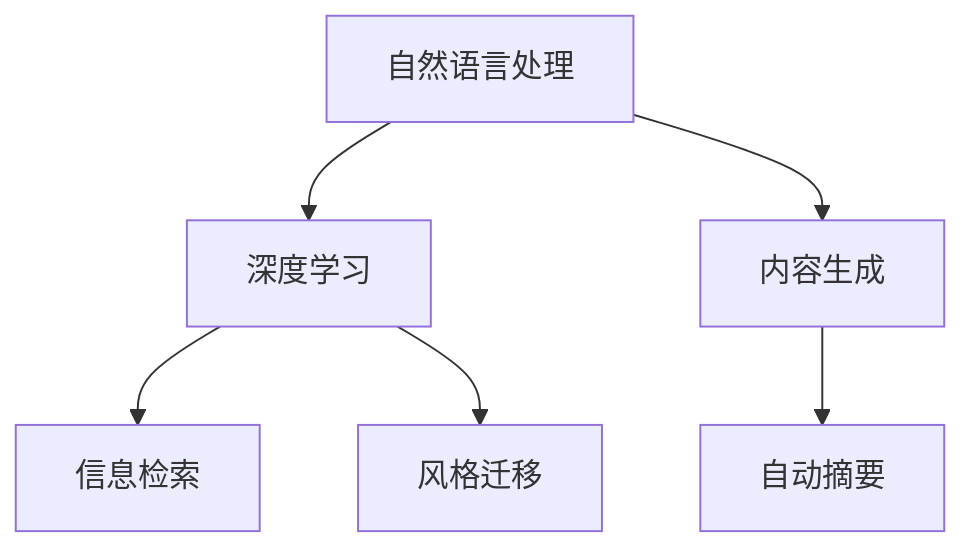

                 

# AI辅助写作：从搜索到创作

> 关键词：人工智能,自然语言处理,深度学习,内容生成,语言模型,写作助手,自动摘要

## 1. 背景介绍

### 1.1 问题由来
在信息爆炸的时代，内容创作成为了一种稀缺资源。无论是新闻、博客、小说还是科技文章，高质量的内容产出需要大量时间和精力。这对个人创作者和专业内容生产机构都提出了巨大的挑战。

与此同时，搜索引擎的普及让信息获取变得前所未有的便捷，但用户仍然需要耗费大量时间在海量信息中寻找有价值的内容。尽管搜索引擎可以提供精确的结果，但无法替代人类对内容的创造和深度理解。

因此，AI辅助写作应运而生，旨在通过技术手段帮助创作者更高效地生成、筛选和优化内容，减少重复劳动，提升创作质量和效率。

### 1.2 问题核心关键点
AI辅助写作的本质是通过自然语言处理(Natural Language Processing, NLP)和深度学习技术，模拟人类写作的过程，辅助创作者从零到一，从粗糙到精炼，从有到优。其主要技术手段包括内容生成、信息检索、自动摘要、风格迁移等。

核心技术挑战在于：
1. **内容的生成质量**：如何生成自然流畅、逻辑严密、具有创意思维的文本。
2. **信息的检索和筛选**：如何在海量文本中高效检索和筛选相关内容。
3. **自动摘要的能力**：如何提炼文本的核心内容，生成简洁明了的摘要。
4. **风格迁移的实现**：如何将不同的写作风格融合到生成的文本中。

### 1.3 问题研究意义
AI辅助写作技术的开发和应用，具有以下几方面的重要意义：

1. **提升创作效率**：通过自动化生成和优化文本，大大减少创作过程中的重复劳动，提高创作速度和效率。
2. **丰富内容多样性**：AI可以生成各种风格和主题的内容，为内容创作提供新的思路和素材。
3. **辅助内容优化**：自动生成的内容可以进行进一步的优化和改写，提升创作质量和可读性。
4. **促进知识传播**：将复杂的信息以易于理解的方式呈现，提高知识传播的效果和覆盖面。
5. **增强创作者工具**：为创作者提供高效的工具和支持，减少创作过程中的认知负担。

## 2. 核心概念与联系

### 2.1 核心概念概述

为更好地理解AI辅助写作的技术框架，本节将介绍几个关键概念：

- **自然语言处理(NLP)**：旨在使计算机理解和处理人类语言的技术，涵盖了文本预处理、语言模型、文本分类、信息检索等多个子领域。
- **深度学习(Deep Learning)**：通过多层神经网络进行学习，能够从原始数据中提取高层次特征，广泛应用于图像、语音、文本等领域。
- **内容生成(Content Generation)**：指AI系统自动生成文本、图片、视频等形式的信息内容，模拟人类的创作过程。
- **信息检索(Information Retrieval)**：指从海量的文本数据中，快速检索出相关的内容，帮助用户获取所需信息。
- **自动摘要(Automatic Summarization)**：指自动提炼文本的核心信息，生成简洁明了的摘要，帮助用户快速了解文本的主要内容。
- **风格迁移(Style Transfer)**：指将一篇文本的风格转换为另一篇文本的风格，实现创作风格的跨界融合。

这些核心概念之间的逻辑关系可以通过以下Mermaid流程图来展示：



这个流程图展示了大语言模型写作辅助的核心概念及其之间的关系：

1. **自然语言处理**：是大语言模型基础，提供文本处理和分析能力。
2. **深度学习**：是内容生成的核心，通过多层神经网络进行文本生成和优化。
3. **内容生成**：基于自然语言处理和深度学习的技术，自动生成文本。
4. **信息检索**：基于自然语言处理的索引和检索技术，帮助用户快速找到所需信息。
5. **自动摘要**：基于自然语言处理和深度学习的技术，自动提炼文本核心。
6. **风格迁移**：基于深度学习的多样化生成能力，实现文本风格的跨界融合。

## 3. 核心算法原理 & 具体操作步骤

### 3.1 算法原理概述

AI辅助写作的核心算法包括内容生成、信息检索、自动摘要和风格迁移等。这些算法通常基于深度学习技术，尤其是基于Transformer架构的语言模型。

以内容生成为例，最流行的模型包括GPT系列、BERT等。这些模型的核心思想是通过自监督学习，在大规模语料上进行预训练，学习到丰富的语言知识。在微调阶段，通过引入任务特定的损失函数，引导模型生成符合特定任务需求的文本。

形式化地，假设预训练模型为 $M_{\theta}$，其中 $\theta$ 为预训练得到的模型参数。给定下游任务 $T$ 的标注数据集 $D=\{(x_i, y_i)\}_{i=1}^N$，内容生成的优化目标是最小化生成文本与标注数据之间的差距，即：

$$
\hat{\theta}=\mathop{\arg\min}_{\theta} \mathcal{L}(M_{\theta},D)
$$

其中 $\mathcal{L}$ 为针对任务 $T$ 设计的损失函数，用于衡量生成文本与真实标注之间的差异。常见的损失函数包括交叉熵损失、BLEU等。

### 3.2 算法步骤详解

AI辅助写作的算法步骤通常包括数据预处理、模型选择、损失函数设计、超参数设置、模型训练、评估和部署等。

**Step 1: 数据预处理**
- 收集并清洗与任务相关的文本数据，去除噪音和不相关内容。
- 对文本进行分词、标记等预处理，转化为模型所需的格式。
- 构建标注数据集，用于模型微调。

**Step 2: 模型选择**
- 选择合适的预训练模型，如GPT、BERT等。
- 确定模型的结构、层数、参数规模等。

**Step 3: 损失函数设计**
- 根据任务需求设计损失函数。如分类任务通常使用交叉熵损失，生成任务通常使用BLEU、ROUGE等指标。
- 设计数据增强、正则化等技术，提高模型的泛化能力。

**Step 4: 超参数设置**
- 设置学习率、批大小、迭代轮数等优化算法参数。
- 选择正则化技术，如L2正则、Dropout等，防止模型过拟合。

**Step 5: 模型训练**
- 将标注数据集分为训练集、验证集和测试集。
- 使用优化算法进行模型微调，最小化损失函数。
- 在验证集上评估模型性能，调整超参数。

**Step 6: 评估和部署**
- 在测试集上评估模型性能，对比训练前后的效果。
- 部署模型，将其集成到内容生成系统中。
- 持续收集新数据，定期重新微调模型，以适应数据分布的变化。

以上是AI辅助写作的一般流程。在实际应用中，还需要根据具体任务的需求，对模型进行进一步的优化和改进。

### 3.3 算法优缺点

AI辅助写作的算法具有以下优点：
1. 生成速度快。使用深度学习模型可以大规模并行计算，生成速度远快于传统的人工创作。
2. 内容多样性。模型可以生成各种风格和主题的内容，满足不同用户的需求。
3. 辅助创作。为创作者提供初步的内容草稿，节省创作时间，提升创作效率。
4. 提升创作质量。通过多轮优化和改写，生成的内容质量往往优于传统手工创作。

同时，这些算法也存在一些局限性：
1. 内容质量不稳定。生成的内容往往存在逻辑不连贯、语法错误等问题。
2. 对标注数据依赖高。模型生成质量依赖于标注数据的质量和数量。
3. 缺乏创新性。模型倾向于生成常见或模板化的内容，缺乏个性化和独特性。
4. 难以处理复杂任务。对于需要深度理解和高阶推理的任务，模型可能表现不佳。
5. 不具备实时性。模型通常需要较长时间进行训练，难以实时生成高质量内容。

尽管存在这些局限性，但AI辅助写作技术在实际应用中仍然展现出巨大的潜力和价值，为创作者提供了高效、丰富的创作工具。

### 3.4 算法应用领域

AI辅助写作技术已经在多个领域得到了广泛应用，以下是几个典型应用场景：

- **新闻创作**：使用内容生成技术，自动撰写新闻稿件。可生成新闻标题、导语、正文等，辅助记者快速撰写新闻。
- **内容营销**：为品牌营销人员提供高质量的内容草稿，提升内容创作效率。可生成广告文案、社交媒体帖子、博客文章等。
- **技术文档**：生成技术文档的草稿，提升文档编写的速度和质量。可生成API文档、技术手册、用户指南等。
- **教育辅助**：生成教育内容，如练习题、解释性文本等，辅助教育工作者教学。
- **创意写作**：为作家提供灵感和素材，生成小说、诗歌等创意文本。
- **多语言翻译**：使用多语言模型，将文本从一种语言翻译成另一种语言，提升翻译效率和质量。

## 4. 数学模型和公式 & 详细讲解 & 举例说明

### 4.1 数学模型构建

本文以文本生成为例，介绍基于深度学习的文本生成模型的数学模型构建。

记预训练语言模型为 $M_{\theta}$，其中 $\theta$ 为预训练得到的模型参数。假设文本生成任务为 $T$，文本的输入为 $x$，输出为 $y$。文本生成模型的目标是最大化对数似然函数：

$$
\max_{\theta} \sum_{x,y \in D} \log P(y|x; \theta)
$$

其中 $D$ 为标注数据集，$P(y|x; \theta)$ 为模型在输入 $x$ 下的输出 $y$ 的条件概率，可以通过训练数据计算得到。

通过最大似然估计，模型参数 $\theta$ 可以优化为：

$$
\theta=\mathop{\arg\min}_{\theta} -\frac{1}{N}\sum_{i=1}^N \log P(y_i|x_i; \theta)
$$

在实际训练中，通常使用交叉熵损失函数：

$$
\mathcal{L}(\theta)=\frac{1}{N}\sum_{i=1}^N -\log P(y_i|x_i; \theta)
$$

### 4.2 公式推导过程

以生成文本的概率计算为例，推导模型的梯度更新公式。

假设模型的预测输出为 $p_{pred}(y|x; \theta)$，真实标签为 $y$，则交叉熵损失函数为：

$$
\mathcal{L}(\theta)=\frac{1}{N}\sum_{i=1}^N -\log p_{pred}(y_i|x_i; \theta)
$$

模型的梯度更新公式为：

$$
\nabla_{\theta}\mathcal{L}(\theta)=\frac{1}{N}\sum_{i=1}^N -\frac{p_{pred}(y_i|x_i; \theta)}{p_{pred}(y_i|x_i; \theta)} \nabla_{\theta}p_{pred}(y_i|x_i; \theta)
$$

其中 $\nabla_{\theta}p_{pred}(y_i|x_i; \theta)$ 为模型对 $y_i$ 的预测概率的梯度，可以通过反向传播算法计算得到。

### 4.3 案例分析与讲解

以GPT模型为例，解释其在文本生成中的应用。

GPT模型通过自回归的方式生成文本，每次生成一个词或一段文本，然后将其作为下一个词的输入，从而逐步生成整个文本。其核心算法为Transformer自注意力机制，可以捕捉文本中的长距离依赖关系。

GPT模型的数学模型如下：

$$
p(y|x)=\prod_{i=1}^{T} p(y_i|y_{<i},x; \theta)
$$

其中 $T$ 为生成的文本长度，$y_{<i}$ 为已生成的前 $i-1$ 个词，$x$ 为输入的文本。模型通过学习到每个位置上的条件概率，最终生成完整的文本。

在训练过程中，模型通过最大化对数似然函数来学习各个位置的条件概率。具体步骤如下：
1. 随机初始化模型参数 $\theta$。
2. 将输入文本 $x$ 输入模型，得到每个位置的条件概率 $p_{pred}(y_i|y_{<i},x; \theta)$。
3. 计算交叉熵损失 $\mathcal{L}(\theta)$。
4. 使用梯度下降等优化算法，更新模型参数 $\theta$。
5. 重复步骤2-4，直至收敛。

通过不断的训练和优化，模型可以生成符合语法和语义的文本，并在特定任务上取得不错的效果。

## 5. 项目实践：代码实例和详细解释说明

### 5.1 开发环境搭建

在进行AI辅助写作的实践前，我们需要准备好开发环境。以下是使用Python进行PyTorch开发的环境配置流程：

1. 安装Anaconda：从官网下载并安装Anaconda，用于创建独立的Python环境。

2. 创建并激活虚拟环境：
```bash
conda create -n pytorch-env python=3.8 
conda activate pytorch-env
```

3. 安装PyTorch：根据CUDA版本，从官网获取对应的安装命令。例如：
```bash
conda install pytorch torchvision torchaudio cudatoolkit=11.1 -c pytorch -c conda-forge
```

4. 安装Transformers库：
```bash
pip install transformers
```

5. 安装各类工具包：
```bash
pip install numpy pandas scikit-learn matplotlib tqdm jupyter notebook ipython
```

完成上述步骤后，即可在`pytorch-env`环境中开始AI辅助写作的实践。

### 5.2 源代码详细实现

下面我们以新闻生成任务为例，给出使用Transformers库对GPT模型进行新闻生成的PyTorch代码实现。

首先，定义新闻生成任务的数据处理函数：

```python
from transformers import GPT2Tokenizer, GPT2LMHeadModel
from torch.utils.data import Dataset
import torch

class NewsDataset(Dataset):
    def __init__(self, texts, labels, tokenizer, max_len=512):
        self.texts = texts
        self.labels = labels
        self.tokenizer = tokenizer
        self.max_len = max_len
        
    def __len__(self):
        return len(self.texts)
    
    def __getitem__(self, item):
        text = self.texts[item]
        label = self.labels[item]
        
        encoding = self.tokenizer(text, return_tensors='pt', max_length=self.max_len, padding='max_length', truncation=True)
        input_ids = encoding['input_ids'][0]
        attention_mask = encoding['attention_mask'][0]
        
        # 将label作为输出标签
        labels = torch.tensor(label, dtype=torch.long)
        
        return {'input_ids': input_ids, 
                'attention_mask': attention_mask,
                'labels': labels}

# 初始化tokenizer和模型
tokenizer = GPT2Tokenizer.from_pretrained('gpt2')
model = GPT2LMHeadModel.from_pretrained('gpt2')

# 准备训练数据
train_dataset = NewsDataset(train_texts, train_labels, tokenizer)
dev_dataset = NewsDataset(dev_texts, dev_labels, tokenizer)
test_dataset = NewsDataset(test_texts, test_labels, tokenizer)
```

然后，定义模型和优化器：

```python
from transformers import AdamW

optimizer = AdamW(model.parameters(), lr=2e-5)
```

接着，定义训练和评估函数：

```python
from torch.utils.data import DataLoader
from tqdm import tqdm
from sklearn.metrics import precision_recall_fscore_support

device = torch.device('cuda') if torch.cuda.is_available() else torch.device('cpu')
model.to(device)

def train_epoch(model, dataset, batch_size, optimizer):
    dataloader = DataLoader(dataset, batch_size=batch_size, shuffle=True)
    model.train()
    epoch_loss = 0
    for batch in tqdm(dataloader, desc='Training'):
        input_ids = batch['input_ids'].to(device)
        attention_mask = batch['attention_mask'].to(device)
        labels = batch['labels'].to(device)
        model.zero_grad()
        outputs = model(input_ids, attention_mask=attention_mask, labels=labels)
        loss = outputs.loss
        epoch_loss += loss.item()
        loss.backward()
        optimizer.step()
    return epoch_loss / len(dataloader)

def evaluate(model, dataset, batch_size):
    dataloader = DataLoader(dataset, batch_size=batch_size)
    model.eval()
    preds, labels = [], []
    with torch.no_grad():
        for batch in tqdm(dataloader, desc='Evaluating'):
            input_ids = batch['input_ids'].to(device)
            attention_mask = batch['attention_mask'].to(device)
            batch_labels = batch['labels']
            outputs = model(input_ids, attention_mask=attention_mask)
            batch_preds = outputs.logits.argmax(dim=2).to('cpu').tolist()
            batch_labels = batch_labels.to('cpu').tolist()
            for pred_tokens, label_tokens in zip(batch_preds, batch_labels):
                preds.append(pred_tokens[:len(label_tokens)])
                labels.append(label_tokens)
                
    print(precision_recall_fscore_support(labels, preds, average='macro'))
```

最后，启动训练流程并在测试集上评估：

```python
epochs = 5
batch_size = 16

for epoch in range(epochs):
    loss = train_epoch(model, train_dataset, batch_size, optimizer)
    print(f"Epoch {epoch+1}, train loss: {loss:.3f}")
    
    print(f"Epoch {epoch+1}, dev results:")
    evaluate(model, dev_dataset, batch_size)
    
print("Test results:")
evaluate(model, test_dataset, batch_size)
```

以上就是使用PyTorch对GPT2进行新闻生成任务微调的完整代码实现。可以看到，得益于Transformers库的强大封装，我们可以用相对简洁的代码完成GPT2模型的加载和微调。

### 5.3 代码解读与分析

让我们再详细解读一下关键代码的实现细节：

**NewsDataset类**：
- `__init__`方法：初始化文本、标签、分词器等关键组件。
- `__len__`方法：返回数据集的样本数量。
- `__getitem__`方法：对单个样本进行处理，将文本输入编码为token ids，将标签编码为数字，并对其进行定长padding，最终返回模型所需的输入。

**模型和优化器**：
- 使用GPT2模型作为初始化参数，AdamW优化器作为训练过程的优化器。

**训练和评估函数**：
- 使用PyTorch的DataLoader对数据集进行批次化加载，供模型训练和推理使用。
- 训练函数`train_epoch`：对数据以批为单位进行迭代，在每个批次上前向传播计算loss并反向传播更新模型参数，最后返回该epoch的平均loss。
- 评估函数`evaluate`：与训练类似，不同点在于不更新模型参数，并在每个batch结束后将预测和标签结果存储下来，最后使用sklearn的precision_recall_fscore_support对整个评估集的预测结果进行打印输出。

**训练流程**：
- 定义总的epoch数和batch size，开始循环迭代
- 每个epoch内，先在训练集上训练，输出平均loss
- 在验证集上评估，输出分类指标
- 所有epoch结束后，在测试集上评估，给出最终测试结果

可以看到，PyTorch配合Transformers库使得GPT2新闻生成任务的代码实现变得简洁高效。开发者可以将更多精力放在数据处理、模型改进等高层逻辑上，而不必过多关注底层的实现细节。

当然，工业级的系统实现还需考虑更多因素，如模型的保存和部署、超参数的自动搜索、更灵活的任务适配层等。但核心的微调范式基本与此类似。

## 6. 实际应用场景
### 6.1 智能客服系统

基于AI辅助写作的对话技术，可以广泛应用于智能客服系统的构建。传统客服往往需要配备大量人力，高峰期响应缓慢，且一致性和专业性难以保证。而使用基于AI辅助写作的对话模型，可以7x24小时不间断服务，快速响应客户咨询，用自然流畅的语言解答各类常见问题。

在技术实现上，可以收集企业内部的历史客服对话记录，将问题和最佳答复构建成监督数据，在此基础上对预训练对话模型进行微调。微调后的对话模型能够自动理解用户意图，匹配最合适的答案模板进行回复。对于客户提出的新问题，还可以接入检索系统实时搜索相关内容，动态组织生成回答。如此构建的智能客服系统，能大幅提升客户咨询体验和问题解决效率。

### 6.2 金融舆情监测

金融机构需要实时监测市场舆论动向，以便及时应对负面信息传播，规避金融风险。传统的人工监测方式成本高、效率低，难以应对网络时代海量信息爆发的挑战。基于AI辅助写作的文本分类和情感分析技术，为金融舆情监测提供了新的解决方案。

具体而言，可以收集金融领域相关的新闻、报道、评论等文本数据，并对其进行主题标注和情感标注。在此基础上对预训练语言模型进行微调，使其能够自动判断文本属于何种主题，情感倾向是正面、中性还是负面。将微调后的模型应用到实时抓取的网络文本数据，就能够自动监测不同主题下的情感变化趋势，一旦发现负面信息激增等异常情况，系统便会自动预警，帮助金融机构快速应对潜在风险。

### 6.3 个性化推荐系统

当前的推荐系统往往只依赖用户的历史行为数据进行物品推荐，无法深入理解用户的真实兴趣偏好。基于AI辅助写作的个性化推荐系统可以更好地挖掘用户行为背后的语义信息，从而提供更精准、多样的推荐内容。

在实践中，可以收集用户浏览、点击、评论、分享等行为数据，提取和用户交互的物品标题、描述、标签等文本内容。将文本内容作为模型输入，用户的后续行为（如是否点击、购买等）作为监督信号，在此基础上微调预训练语言模型。微调后的模型能够从文本内容中准确把握用户的兴趣点。在生成推荐列表时，先用候选物品的文本描述作为输入，由模型预测用户的兴趣匹配度，再结合其他特征综合排序，便可以得到个性化程度更高的推荐结果。

### 6.4 未来应用展望

随着AI辅助写作技术的发展，其应用场景将越来越广泛，为各行各业带来变革性影响。

在智慧医疗领域，基于AI辅助写作的医疗问答、病历分析、药物研发等应用将提升医疗服务的智能化水平，辅助医生诊疗，加速新药开发进程。

在智能教育领域，微调技术可应用于作业批改、学情分析、知识推荐等方面，因材施教，促进教育公平，提高教学质量。

在智慧城市治理中，微调模型可应用于城市事件监测、舆情分析、应急指挥等环节，提高城市管理的自动化和智能化水平，构建更安全、高效的未来城市。

此外，在企业生产、社会治理、文娱传媒等众多领域，基于AI辅助写作的人工智能应用也将不断涌现，为经济社会发展注入新的动力。相信随着技术的日益成熟，AI辅助写作技术必将推动人工智能技术的广泛应用，深刻影响人类的生产生活方式。

## 7. 工具和资源推荐
### 7.1 学习资源推荐

为了帮助开发者系统掌握AI辅助写作的理论基础和实践技巧，这里推荐一些优质的学习资源：

1. 《自然语言处理综述》系列博文：由大语言模型技术专家撰写，深入浅出地介绍了NLP领域的基本概念和经典模型。

2. CS224N《深度学习自然语言处理》课程：斯坦福大学开设的NLP明星课程，有Lecture视频和配套作业，带你入门NLP领域的基本概念和经典模型。

3. 《深度学习与自然语言处理》书籍：深度学习领域知名专家所著，全面介绍了深度学习在自然语言处理中的应用，包括内容生成、信息检索等。

4. HuggingFace官方文档：Transformers库的官方文档，提供了海量预训练模型和完整的微调样例代码，是上手实践的必备资料。

5. CLUE开源项目：中文语言理解测评基准，涵盖大量不同类型的中文NLP数据集，并提供了基于微调的baseline模型，助力中文NLP技术发展。

通过对这些资源的学习实践，相信你一定能够快速掌握AI辅助写作的精髓，并用于解决实际的NLP问题。
### 7.2 开发工具推荐

高效的开发离不开优秀的工具支持。以下是几款用于AI辅助写作开发的常用工具：

1. PyTorch：基于Python的开源深度学习框架，灵活动态的计算图，适合快速迭代研究。大部分预训练语言模型都有PyTorch版本的实现。

2. TensorFlow：由Google主导开发的开源深度学习框架，生产部署方便，适合大规模工程应用。同样有丰富的预训练语言模型资源。

3. Transformers库：HuggingFace开发的NLP工具库，集成了众多SOTA语言模型，支持PyTorch和TensorFlow，是进行AI辅助写作开发的利器。

4. Weights & Biases：模型训练的实验跟踪工具，可以记录和可视化模型训练过程中的各项指标，方便对比和调优。与主流深度学习框架无缝集成。

5. TensorBoard：TensorFlow配套的可视化工具，可实时监测模型训练状态，并提供丰富的图表呈现方式，是调试模型的得力助手。

6. Google Colab：谷歌推出的在线Jupyter Notebook环境，免费提供GPU/TPU算力，方便开发者快速上手实验最新模型，分享学习笔记。

合理利用这些工具，可以显著提升AI辅助写作任务的开发效率，加快创新迭代的步伐。

### 7.3 相关论文推荐

AI辅助写作技术的发展源于学界的持续研究。以下是几篇奠基性的相关论文，推荐阅读：

1. Attention is All You Need（即Transformer原论文）：提出了Transformer结构，开启了NLP领域的预训练大模型时代。

2. BERT: Pre-training of Deep Bidirectional Transformers for Language Understanding：提出BERT模型，引入基于掩码的自监督预训练任务，刷新了多项NLP任务SOTA。

3. Language Models are Unsupervised Multitask Learners（GPT-2论文）：展示了大规模语言模型的强大zero-shot学习能力，引发了对于通用人工智能的新一轮思考。

4. Sequence to Sequence Learning with Neural Networks: Bridging NLP, Computer Vision and Speech Processing（seq2seq论文）：提出Seq2Seq模型，将NLP任务与计算机视觉、语音处理等任务相结合，推动了多模态语言模型的发展。

5. Transformer-XL: Attentive Language Models Beyond a Fixed-Length Context（Transformer-XL论文）：提出了Transformer-XL模型，解决了长期依赖问题，提升了语言模型的长距离信息捕捉能力。

这些论文代表了大语言模型辅助写作技术的发展脉络。通过学习这些前沿成果，可以帮助研究者把握学科前进方向，激发更多的创新灵感。

## 8. 总结：未来发展趋势与挑战

### 8.1 总结

本文对AI辅助写作技术进行了全面系统的介绍。首先阐述了AI辅助写作的研究背景和意义，明确了其在大语言模型、深度学习等技术框架下的实现方式。其次，从原理到实践，详细讲解了内容生成、信息检索、自动摘要等核心算法的数学原理和关键步骤，给出了AI辅助写作任务开发的完整代码实例。同时，本文还广泛探讨了AI辅助写作技术在智能客服、金融舆情、个性化推荐等多个行业领域的应用前景，展示了其广阔的应用潜力。此外，本文精选了AI辅助写作技术的各类学习资源，力求为读者提供全方位的技术指引。

通过本文的系统梳理，可以看到，AI辅助写作技术正在成为NLP领域的重要范式，极大地拓展了深度学习模型的应用边界，催生了更多的落地场景。受益于深度学习模型的强大能力和广泛数据支持，AI辅助写作技术在实际应用中已经展现出巨大的价值，为创作者提供了高效、丰富的创作工具。未来，伴随深度学习模型的不断进步，AI辅助写作技术也将迎来更多创新，进一步提升内容创作的效率和质量。

### 8.2 未来发展趋势

展望未来，AI辅助写作技术将呈现以下几个发展趋势：

1. **模型的多样性**：未来的AI辅助写作模型将不仅限于单一语言和文本形式，将拓展到多种语言、多模态数据的处理，如语音、图像、视频等。

2. **模型的通用性**：模型将具备更强的跨领域迁移能力，能够在不同任务和领域中快速适应和应用，提升内容的通用性和泛化性。

3. **模型的可解释性**：未来的AI辅助写作模型将具备更强的可解释性，能够生成具有逻辑性和连贯性的文本，提高文本的可读性和可信度。

4. **模型的鲁棒性**：模型将具备更强的鲁棒性，能够抵御对抗样本攻击，保证生成的文本质量。

5. **模型的交互性**：未来的AI辅助写作模型将具备更强的交互性，能够与用户进行自然对话，提升用户的参与感和体验感。

6. **模型的个性化**：模型将具备更强的个性化能力，能够根据用户偏好和场景生成个性化的内容，提升内容的个性化和多样化。

以上趋势凸显了AI辅助写作技术的广阔前景。这些方向的探索发展，必将进一步提升AI辅助写作系统的性能和应用范围，为人类认知智能的进化带来深远影响。

### 8.3 面临的挑战

尽管AI辅助写作技术已经取得了瞩目成就，但在迈向更加智能化、普适化应用的过程中，它仍面临着诸多挑战：

1. **内容的真实性**：生成的文本需要具备真实性和可信度，避免误导用户和传播虚假信息。
2. **内容的创新性**：避免生成模板化、陈旧的内容，提升内容的独特性和创新性。
3. **内容的情感性**：生成的文本需要具备情感共鸣，提升内容的感染力和吸引力。
4. **内容的伦理性**：避免生成有害、偏见性的内容，保证内容的伦理性和安全性。
5. **内容的规范性**：生成的文本需要符合语法和语用规范，保证内容的可读性和易理解性。

尽管存在这些挑战，但AI辅助写作技术在实际应用中仍然展现出巨大的潜力和价值，为创作者提供了高效、丰富的创作工具。未来，随着技术不断进步，这些挑战终将一一被克服，AI辅助写作技术必将引领NLP领域迈向新的高度。

### 8.4 未来突破

面对AI辅助写作所面临的挑战，未来的研究需要在以下几个方面寻求新的突破：

1. **引入伦理和监管机制**：在模型训练和应用过程中，引入伦理和监管机制，确保生成的内容符合社会价值观和伦理道德。

2. **发展多模态生成技术**：开发能够处理多种形式数据的多模态生成技术，如图像、语音、视频等，提升内容的丰富性和多样性。

3. **提升内容的交互性和情感性**：通过引入心理学和语言学知识，提升文本的情感共鸣和交互性，提升内容的感染力和吸引力。

4. **增强内容的真实性和可信度**：通过引入数据验证和事实核查技术，提升文本的真实性和可信度，避免误导用户。

5. **实现个性化和定制化生成**：通过引入用户画像和偏好分析技术，实现个性化的内容生成，提升内容的个性化和多样化。

6. **提升内容的规范性和标准化**：通过引入自然语言处理和标准化技术，提升文本的语法和语用规范，确保内容的可读性和易理解性。

这些研究方向的探索，必将引领AI辅助写作技术迈向更高的台阶，为构建人机协同的智能系统铺平道路。面向未来，AI辅助写作技术还需要与其他人工智能技术进行更深入的融合，如知识表示、因果推理、强化学习等，多路径协同发力，共同推动自然语言理解和智能交互系统的进步。只有勇于创新、敢于突破，才能不断拓展语言模型的边界，让智能技术更好地造福人类社会。

## 9. 附录：常见问题与解答

**Q1：AI辅助写作的生成效果如何？**

A: AI辅助写作的生成效果取决于模型的训练数据、算法和参数设置。一般来说，模型的训练数据量越大、质量越高，生成的文本质量越好。此外，模型的超参数（如学习率、批大小、迭代轮数等）也会影响生成效果。通过不断的调参和优化，可以显著提升生成文本的质量和流畅度。

**Q2：AI辅助写作能否生成原创内容？**

A: AI辅助写作的生成文本并非原创，而是基于已有文本数据进行理解和生成的。生成的文本可能存在逻辑不连贯、语法错误等问题，需要人工进一步编辑和优化。因此，AI辅助写作更多地被视为一种辅助工具，而非完全替代人类创作的工具。

**Q3：AI辅助写作的生成效率如何？**

A: AI辅助写作的生成效率非常高，尤其是使用深度学习模型进行大规模并行计算时，生成速度远快于传统的人工创作。但不同任务的生成效率也会有所差异，复杂任务可能需要更长的生成时间。

**Q4：AI辅助写作的生成内容有哪些局限性？**

A: AI辅助写作生成的内容可能存在以下局限性：
1. 内容的真实性和可信度：生成的文本可能存在虚假信息，需要进行数据验证和事实核查。
2. 内容的创新性和独特性：生成的文本可能存在模板化、陈旧的问题，需要进一步优化。
3. 内容的情感性和交互性：生成的文本可能缺乏情感共鸣和交互性，需要进行优化。
4. 内容的规范性和标准化：生成的文本可能不符合语法和语用规范，需要进行优化。

**Q5：AI辅助写作的未来发展方向是什么？**

A: AI辅助写作的未来发展方向包括：
1. 多模态生成：将文本与其他形式的数据（如图像、视频、音频等）结合，提升内容的丰富性和多样性。
2. 通用化和泛化：提升模型的跨领域迁移能力，能够在不同任务和领域中快速适应和应用。
3. 可解释性和可信度：提升模型的可解释性，确保生成的文本具有逻辑性和连贯性，增强用户的信任感。
4. 个性化和定制化：通过引入用户画像和偏好分析技术，实现个性化的内容生成，提升内容的个性化和多样化。

这些方向的发展将进一步拓展AI辅助写作技术的应用范围和深度，为创作者和用户提供更加高效、丰富、多样和可靠的内容创作工具。

---

作者：禅与计算机程序设计艺术 / Zen and the Art of Computer Programming

