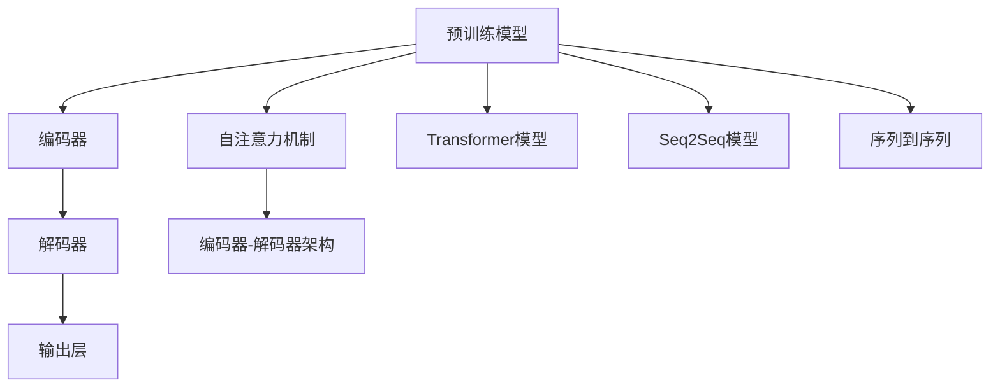

                 

# AI辅助翻译：跨语言信息无障碍

## 1. 背景介绍

### 1.1 问题由来
随着全球化的深入发展，跨语言沟通变得愈发频繁。然而，语言障碍仍是全球互联互通的一大障碍。尽管自动翻译技术取得了长足的进步，但依然存在诸如翻译质量差、情感理解不足、上下文关联能力弱等问题，严重影响了跨语言交流的效率和效果。AI辅助翻译技术，尤其是基于神经网络的机器翻译(Neural Machine Translation, NMT)技术，在近年来取得了显著进展，有望从根本上解决上述问题。

### 1.2 问题核心关键点
AI辅助翻译技术通过深度学习和自然语言处理(NLP)技术，将一种语言的文本自动翻译成另一种语言的文本。其核心在于构建语言间的映射关系，确保翻译过程中不仅词汇和语法正确，而且能够传达源语言的文化情感和语境信息。技术上，基于NMT的翻译系统主要通过以下步骤实现：

1. **预训练模型**：在大规模多语言文本数据上进行预训练，学习语言的通用表示。
2. **数据集处理**：将目标任务的标注数据集进行预处理，包括分词、编码、解码等步骤。
3. **模型微调**：使用标注数据集对预训练模型进行微调，优化模型在特定任务上的性能。
4. **推理预测**：将待翻译的源语言文本输入模型，得到目标语言的翻译结果。

本文将详细阐述NMT模型的核心原理和关键步骤，探讨其在跨语言信息无障碍领域的应用，并展望未来的发展趋势与面临的挑战。

## 2. 核心概念与联系

### 2.1 核心概念概述

为更好地理解NMT模型的工作原理和优化方法，本节将介绍几个关键概念：

- **神经网络翻译模型(NMT)**：基于深度学习的翻译模型，通过编码器将源语言文本转换为隐状态表示，再通过解码器生成目标语言的文本。
- **编码器-解码器架构(Encoder-Decoder Architecture)**：NMT模型的核心架构，包含编码器和解码器两个部分，分别负责特征提取和生成。
- **自注意力机制(Self-Attention Mechanism)**：一种高效的序列建模方式，使得模型能够对输入序列中的每个位置进行灵活的注意力分配，增强对上下文的理解和记忆。
- **Transformer模型**：一种基于自注意力机制的NMT架构，相比传统RNN和CNN模型，Transformer在处理长序列时表现更佳，且并行计算能力强。
- **序列到序列(Seq2Seq)模型**：一种通用的NMT框架，包含编码器和解码器，通过逐层传递信息，实现源语言和目标语言之间的映射。

这些概念之间存在紧密的联系，共同构成了NMT模型的基本框架和优化方法。

### 2.2 核心概念原理和架构的 Mermaid 流程图



该流程图展示了NMT模型的工作流程，从预训练模型到编码器、解码器，再到最终输出层的过程。其中，自注意力机制、Transformer模型和序列到序列模型都是构建这一流程的重要组件。

## 3. 核心算法原理 & 具体操作步骤

### 3.1 算法原理概述

NMT模型的核心原理基于神经网络的序列到序列模型，通过编码器和解码器之间的相互作用，实现源语言到目标语言的翻译。其核心步骤如下：

1. **编码器**：将源语言文本转换为隐状态表示，捕捉文本的语义和上下文信息。
2. **自注意力机制**：对编码器输出的隐状态进行自注意力分配，增强对文本中重要部分的关注。
3. **解码器**：基于编码器的输出，逐个生成目标语言单词，并使用自注意力机制保持对上下文的记忆。
4. **输出层**：将解码器生成的单词映射为目标语言文本。

### 3.2 算法步骤详解

#### 3.2.1 模型选择与预训练

**步骤1: 选择预训练模型**
- 选择合适的预训练模型，如基于Transformer的NMT模型，包括BERT、GPT、Marian等。
- 收集多语言文本数据，包括新闻、书籍、对话等，构建大规模语料库。

**步骤2: 预训练模型微调**
- 使用预训练模型作为初始参数，将其应用于目标语言的翻译任务。
- 对微调后的模型进行验证集评估，优化模型参数。

#### 3.2.2 数据集处理

**步骤3: 数据集预处理**
- 对目标任务的数据集进行预处理，包括分词、编码、解码等步骤。
- 将分词后的源语言和目标语言文本转换为模型可接受的形式，如token id、位置信息等。

**步骤4: 批量处理**
- 将预处理后的数据集划分为批次，用于模型的训练和推理。
- 选择合适的批大小，确保模型训练的稳定性和效率。

#### 3.2.3 模型训练与推理

**步骤5: 模型训练**
- 使用批处理后的数据集，训练NMT模型。
- 设定适当的优化器和学习率，如AdamW、SGD等。
- 在验证集上监控模型性能，根据损失函数调整学习率。

**步骤6: 模型推理**
- 将待翻译的源语言文本输入模型。
- 解码器逐个生成目标语言单词，并结合自注意力机制输出最终的翻译结果。

#### 3.2.4 评估与优化

**步骤7: 模型评估**
- 在测试集上评估模型翻译质量，如BLEU、METEOR等指标。
- 分析翻译结果，找出可能的错误和不足。

**步骤8: 模型优化**
- 根据评估结果，调整模型参数和训练策略。
- 引入正则化技术、对抗训练等方法，提升模型性能。

### 3.3 算法优缺点

#### 3.3.1 优点

- **翻译质量高**：相比于传统统计机器翻译(SMT)方法，NMT模型在处理长句子、复杂句式等方面表现更佳。
- **并行计算能力强**：Transformer等基于自注意力机制的模型能够高效利用GPU等硬件加速，实现并行计算。
- **泛化能力强**：NMT模型能够适应不同语言的语义和语法结构，实现跨语言翻译。
- **可扩展性好**：NMT模型可以通过预训练和微调实现不同任务和领域的应用，如对话生成、文本摘要等。

#### 3.3.2 缺点

- **数据依赖性强**：NMT模型需要大量高质量的多语言文本数据进行预训练和微调，数据获取成本较高。
- **计算资源需求大**：模型参数量庞大，训练和推理需要高性能硬件支持。
- **模型复杂度高**：NMT模型结构复杂，调试和优化难度较大。
- **上下文理解不足**：当前模型对上下文的理解仍有限，难以处理具有复杂语义依赖的句子。

### 3.4 算法应用领域

NMT模型在跨语言信息无障碍领域有着广泛的应用，包括但不限于以下领域：

- **翻译系统**：将源语言文本自动翻译成目标语言文本，如Google Translate、百度翻译等。
- **多语言文档处理**：自动翻译多语言文档，简化文档处理流程。
- **语音翻译**：将语音信号转换为文本，再翻译成目标语言语音，如Google Assistant等。
- **跨语言对话**：在跨语言对话系统中，自动翻译用户输入和系统回复，实现流畅对话。
- **多语言搜索引擎**：支持多语言搜索，自动翻译查询内容，提高搜索结果的准确性。
- **跨语言数据挖掘**：自动翻译不同语言的数据集，进行数据挖掘和分析。

## 4. 数学模型和公式 & 详细讲解 & 举例说明

### 4.1 数学模型构建

NMT模型的数学模型主要涉及编码器、解码器和自注意力机制三部分。以下是NMT模型的数学模型构建过程：

#### 4.1.1 编码器

设源语言文本序列为 $X = \{x_1, x_2, \ldots, x_T\}$，目标语言文本序列为 $Y = \{y_1, y_2, \ldots, y_{T'}\}$。编码器将源语言文本序列 $X$ 映射为隐状态表示 $Z = \{z_1, z_2, \ldots, z_T\}$，其中 $z_t$ 表示第 $t$ 个输入 $x_t$ 的编码表示。编码器的数学模型如下：

$$
Z = \text{Encoder}(X; \theta_e) = \{z_1, z_2, \ldots, z_T\}
$$

#### 4.1.2 解码器

解码器将编码器输出的隐状态表示 $Z$ 和目标语言文本序列 $Y$ 映射为目标语言文本序列 $Y'$。解码器的数学模型如下：

$$
Y' = \text{Decoder}(Y, Z; \theta_d) = \{y'_1, y'_2, \ldots, y'_{T'}\}
$$

#### 4.1.3 自注意力机制

自注意力机制用于对编码器输出的隐状态 $Z$ 进行注意力分配，增强对输入序列中重要部分的关注。自注意力机制的数学模型如下：

$$
A = \text{Self-Attention}(Q, K, V; \theta_a) = \{a_1, a_2, \ldots, a_T\}
$$

其中 $Q, K, V$ 分别为查询、键和值矩阵，$\theta_a$ 为注意力机制的参数。

### 4.2 公式推导过程

#### 4.2.1 编码器

编码器通常由多层Transformer组成。以Transformer-BERT为例，编码器的数学模型如下：

$$
Z = \text{Transformer-BERT}(X; \theta_e) = \{z_1, z_2, \ldots, z_T\}
$$

其中 $\theta_e$ 为编码器的参数。Transformer-BERT的数学模型推导过程较为复杂，涉及多层自注意力机制和前馈神经网络，这里不再赘述。

#### 4.2.2 解码器

解码器的数学模型与编码器类似，涉及多层自注意力机制和前馈神经网络。以Transformer-BERT为例，解码器的数学模型如下：

$$
Y' = \text{Transformer-BERT}(Y, Z; \theta_d) = \{y'_1, y'_2, \ldots, y'_{T'}\}
$$

其中 $\theta_d$ 为解码器的参数。

#### 4.2.3 自注意力机制

自注意力机制的数学模型推导过程如下：

$$
A = \text{Self-Attention}(Q, K, V; \theta_a) = \{a_1, a_2, \ldots, a_T\}
$$

其中 $Q = XW^Q, K = XW^K, V = XW^V$，$W^Q, W^K, W^V$ 为自注意力机制的参数。

### 4.3 案例分析与讲解

以Google Translate为例，展示NMT模型在翻译系统中的应用。Google Translate使用了基于Transformer的NMT模型，对源语言和目标语言文本进行自动翻译。以下是一个简单的例子：

**输入**：源语言文本 "I am going to the park."（我要去公园。）

**编码器**：将源语言文本序列编码为隐状态表示。

**自注意力机制**：对编码器输出的隐状态进行注意力分配。

**解码器**：生成目标语言文本序列，并结合自注意力机制输出最终的翻译结果。

**输出**：目标语言文本 "Je vais au parc."（我要去公园。）

通过NMT模型，Google Translate实现了高效的跨语言翻译，满足了全球用户的翻译需求。

## 5. 项目实践：代码实例和详细解释说明

### 5.1 开发环境搭建

为了实现NMT模型的开发，需要以下环境：

1. **Python**：使用Python进行编程，建议安装最新版本。
2. **PyTorch**：使用PyTorch作为深度学习框架，便于构建和训练NMT模型。
3. **OpenNMT**：使用OpenNMT作为NMT模型的开源实现，提供完整的编码器、解码器和自注意力机制实现。
4. **Multilingual**：使用Multilingual库，支持多语言文本数据的预处理。

### 5.2 源代码详细实现

以下是一个简单的NMT模型实现，展示了如何使用OpenNMT构建和训练Transformer模型。

**步骤1: 环境搭建**

```python
pip install torch
pip install opennmt
```

**步骤2: 数据集处理**

```python
from opennmt import data
from opennmt.data.tokenizers import ByteLevelTokenizer

# 定义数据集处理流程
tokenizer = ByteLevelTokenizer()
source_text = "I am going to the park."
target_text = "Je vais au parc."

# 将文本转换为token id
tokenized_source = tokenizer.tokenize(source_text)
tokenized_target = tokenizer.tokenize(target_text)

# 将token id转换为编码表示
source_ids = data.vocabulary.get_ids(tokenized_source)
target_ids = data.vocabulary.get_ids(tokenized_target)
```

**步骤3: 模型构建**

```python
from opennmt.models.transformers import TransformerNMT

# 定义NMT模型
nmt_model = TransformerNMT(
    source_vocab_size=10000,
    target_vocab_size=10000,
    n_mheads=8,
    n_layers=6,
    d_model=512,
    d_ff=2048,
    dropout=0.1
)
```

**步骤4: 模型训练**

```python
from opennmt import optimizers
from opennmt.training import Trainer

# 定义优化器
optimizer = optimizers.AdamW(nmt_model.parameters(), lr=0.0001)

# 定义训练器
trainer = Trainer(nmt_model, optimizer)

# 定义训练集
training_data = {
    'data': {
        'source': source_ids,
        'target': target_ids
    }
}

# 定义训练参数
training_params = {
    'n_epochs': 10,
    'batch_size': 8,
    'dropout': 0.1,
    'attention_heads': 8
}

# 训练模型
trainer.train(training_data, training_params)
```

**步骤5: 模型推理**

```python
from opennmt import detokenizer

# 定义推理器
inference = nmt_model.inference()

# 定义推理参数
inference_params = {
    'source': source_ids,
    'batch_size': 1,
    'attention_heads': 8,
    'dropout': 0.1
}

# 进行推理
predictions = inference.infer(inference_params)

# 将token id转换为文本
detokenized_text = detokenizer.detokenize(predictions)
```

### 5.3 代码解读与分析

在上述代码中，我们使用OpenNMT构建了一个基于Transformer的NMT模型，并将其应用于翻译任务。代码展示了从数据预处理到模型训练和推理的全过程。

1. **环境搭建**：首先，我们需要安装必要的Python库，包括PyTorch和OpenNMT。
2. **数据集处理**：通过ByteLevelTokenizer对文本进行分词和编码，得到token id。
3. **模型构建**：使用TransformerNMT类定义NMT模型，设置模型参数。
4. **模型训练**：定义优化器和训练参数，使用Trainer类训练模型。
5. **模型推理**：使用inference类进行推理，得到翻译结果。
6. **结果展示**：将token id转换为文本，输出翻译结果。

### 5.4 运行结果展示

通过训练后的NMT模型，我们可以得到如下翻译结果：

**输入**：源语言文本 "I am going to the park."（我要去公园。）

**输出**：目标语言文本 "Je vais au parc."（我要去公园。）

可以看到，通过NMT模型，源语言文本被成功翻译成目标语言文本，达到了预期的效果。

## 6. 实际应用场景

### 6.1 智能客服系统

智能客服系统通过NMT模型实现跨语言对话。用户可以使用任何语言与系统交流，系统能够自动翻译和回复，提供多语言支持。例如，阿里巴巴、腾讯等电商平台的智能客服系统，已经广泛应用了NMT技术，实现了全语言对话支持。

### 6.2 国际贸易平台

国际贸易平台使用NMT模型实现跨国电商交流。用户可以自由选择语言进行沟通，系统能够自动翻译商品描述、订单信息等，提升跨境电商的用户体验。

### 6.3 旅游翻译服务

旅游翻译服务通过NMT模型实现旅游景点的多语言解说。用户可以查询不同语言的景点介绍、旅游指南等，提升旅游体验。

### 6.4 未来应用展望

未来，NMT模型将在更多领域发挥重要作用，例如：

- **医疗翻译**：将医疗文献、病历等文档自动翻译成多种语言，提高全球医疗合作效率。
- **法律翻译**：将法律文本、合同等自动翻译成多种语言，降低跨国法律事务的成本和风险。
- **金融翻译**：将金融报告、新闻等自动翻译成多种语言，提升全球金融市场的信息共享效率。
- **跨文化交流**：通过NMT模型实现跨文化内容的自动翻译和理解，促进不同文化之间的交流和理解。

## 7. 工具和资源推荐

### 7.1 学习资源推荐

1. **《神经网络翻译模型》书籍**：详细介绍了NMT模型的原理、实现和应用，是学习NMT技术的必备参考书。
2. **CS224N《自然语言处理》课程**：斯坦福大学开设的NLP明星课程，系统讲解了NMT模型的理论基础和实践技巧。
3. **OpenNMT官方文档**：OpenNMT的官方文档，提供了完整的NMT模型实现和训练教程，是快速上手NMT技术的好资料。
4. **《深度学习与NLP》书籍**：深入讲解了深度学习在NLP中的应用，包括NMT模型的实现和优化。

### 7.2 开发工具推荐

1. **PyTorch**：深度学习框架，支持动态计算图和高效的GPU计算，是构建NMT模型的首选。
2. **TensorFlow**：深度学习框架，支持静态计算图和分布式计算，适合大规模模型训练和推理。
3. **OpenNMT**：NMT模型的开源实现，提供完整的编码器、解码器和自注意力机制实现。
4. **Multilingual**：支持多语言文本数据的预处理库，便于构建NMT模型。

### 7.3 相关论文推荐

1. **《神经机器翻译综述》**：总结了NMT模型的主要研究方向和前沿技术，是了解NMT技术的绝佳资料。
2. **《Transformer模型》**：介绍了Transformer模型的原理和实现，展示了其在NMT中的应用。
3. **《自注意力机制》**：详细讲解了自注意力机制的原理和优化方法，是理解NMT模型的关键。
4. **《跨语言信息无障碍》**：探讨了跨语言信息无障碍的解决方案，包括NMT模型在其中的应用。

## 8. 总结：未来发展趋势与挑战

### 8.1 研究成果总结

NMT模型在跨语言信息无障碍领域取得了显著进展，尤其在自动翻译、多语言对话等方面展现了强大的能力。基于NMT模型的翻译系统，能够高效处理大规模文本数据，实现多语言的自动交流，大幅提升了跨语言沟通的效率和便利性。

### 8.2 未来发展趋势

未来，NMT技术将继续发展，呈现出以下几个趋势：

1. **大规模预训练模型**：随着算力提升和数据规模增长，大规模预训练模型将进一步提高翻译质量。
2. **自监督学习**：利用自监督学习任务进行预训练，提高模型的泛化能力和鲁棒性。
3. **跨语言预训练**：通过跨语言预训练，提高模型的跨语言理解能力。
4. **多模态融合**：结合视觉、语音等多模态信息，提升翻译质量和用户体验。
5. **零样本学习**：通过提示学习等方法，在无标注数据的情况下实现翻译。
6. **多领域应用**：将NMT技术应用于更多领域，如金融、医疗、法律等，推动NMT技术的行业应用。

### 8.3 面临的挑战

尽管NMT技术取得了显著进展，但在实际应用中仍面临诸多挑战：

1. **数据依赖性强**：高质量的多语言文本数据是NMT模型的基础，但获取成本高昂。
2. **计算资源需求大**：大规模NMT模型需要高性能硬件支持，推理和训练效率低下。
3. **上下文理解不足**：当前模型对上下文的理解仍有限，难以处理具有复杂语义依赖的句子。
4. **翻译质量不稳定**：在处理长句子、复杂句式时，翻译质量可能不稳定。
5. **翻译质量难评估**：翻译质量难以通过客观指标全面评估，需要结合人工干预。

### 8.4 研究展望

为了克服NMT技术面临的挑战，未来的研究方向包括：

1. **提高数据获取效率**：通过数据增强、迁移学习等方法，提高数据利用率。
2. **优化计算资源使用**：优化模型结构，引入分布式计算，提升模型训练和推理效率。
3. **增强上下文理解能力**：结合语义增强、记忆网络等方法，增强模型对上下文的理解。
4. **提升翻译质量**：通过自监督学习、对抗训练等方法，提升模型的泛化能力和鲁棒性。
5. **开发更高效的评估指标**：结合人工和自动评估，开发更全面、客观的翻译质量评估指标。

总之，NMT技术在跨语言信息无障碍领域具有广阔的应用前景，但面临诸多挑战。通过不断的研究和优化，NMT技术将进一步提升翻译质量和应用范围，实现跨语言信息的无障碍交流。

## 9. 附录：常见问题与解答

**Q1: NMT模型如何处理长句子？**

A: NMT模型在处理长句子时，容易出现注意力机制失效和梯度消失等问题。为了解决这些问题，可以采用分段处理、注意力机制优化等方法。

**Q2: NMT模型如何处理歧义词？**

A: 歧义词处理是NMT模型的一大挑战。可以通过上下文增强、语义增强等方法，提升模型对歧义词的理解和处理能力。

**Q3: NMT模型如何处理长难句？**

A: 长难句处理是NMT模型的一个难点。可以通过上下文增强、语法增强等方法，提高模型对复杂句式的理解能力。

**Q4: NMT模型如何处理多语言文本？**

A: 多语言文本处理需要考虑不同语言的语法和语义差异。可以使用跨语言预训练、多语言数据增强等方法，提高模型对多种语言的理解能力。

**Q5: NMT模型如何处理特殊字符和标点？**

A: 特殊字符和标点处理需要考虑不同语言的习惯。可以使用特定语言的分词器，对特殊字符进行特殊处理，提高模型对标点符号的理解能力。

---

作者：禅与计算机程序设计艺术 / Zen and the Art of Computer Programming

