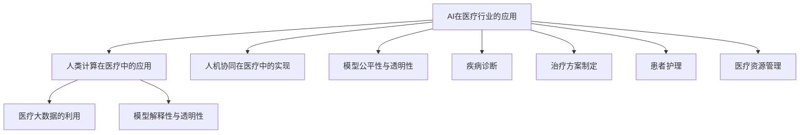

                 

# AI驱动的创新：人类计算在医疗行业的应用

## 1. 背景介绍

### 1.1 问题由来

随着信息技术的飞速发展，人工智能(AI)技术在医疗行业的应用日益增多。从疾病诊断到个性化治疗，AI的介入正不断提升医疗服务的效率和质量，改善患者的健康与生活质量。然而，AI在医疗行业的应用仍面临诸多挑战，如数据的隐私与安全、模型的可解释性、算法的公平性与透明性等。这些问题需要从技术、政策、伦理等多个层面综合考虑。

人类计算（Human-Computer Interaction, HCI）作为AI与医疗结合的重要桥梁，将在推动医疗智能化进程中扮演重要角色。本文将详细探讨基于人类计算的AI驱动创新，以及其在医疗行业的应用。

### 1.2 问题核心关键点

为更好地理解基于人类计算的AI驱动创新及其在医疗行业的应用，本节将介绍几个核心概念：

- **人工智能(AI)**：一种通过算法和数据驱动的技术，能够模拟人类智能行为，如感知、学习、推理等。AI在医疗行业的应用主要集中在疾病诊断、治疗方案制定、患者护理等方面。

- **人类计算(Human-Computer Interaction, HCI)**：涉及人与计算机之间的交互方式，强调通过用户友好的界面设计和交互体验，提升系统的可用性和易用性。HCI在医疗AI应用中尤为重要，因为它直接关联到用户对系统的接受度和使用效果。

- **人机协同（Human-AI Collaboration）**：指AI与人类在任务执行中的紧密协作，利用AI的技术优势，增强人类的决策能力，实现更高效、精准的医疗服务。

- **医疗大数据（Healthcare Big Data）**：指医疗系统产生的大量数据，包括患者病历、影像、基因数据、监测数据等。这些数据为AI在医疗行业的应用提供了坚实的基础。

- **模型解释性（Model Interpretability）**：AI模型应具备一定的解释性，让医疗从业者能够理解模型的决策依据，从而更好地信任和利用AI。

- **公平性（Fairness）与透明性（Transparency）**：AI模型应确保对所有群体的公平性，避免算法偏见，同时保证模型的透明性，便于监管与改进。

这些核心概念构成了人类计算与AI在医疗行业应用的整体框架，对于理解AI驱动的创新及其应用至关重要。

## 2. 核心概念与联系

### 2.1 核心概念概述

为更好地理解基于人类计算的AI驱动创新及其在医疗行业的应用，本节将介绍几个核心概念：

- **AI在医疗行业的应用**：主要包括疾病诊断、治疗方案制定、患者护理、医疗资源管理等。AI可以通过图像识别、自然语言处理、预测分析等技术，提升医疗服务的效率和质量。

- **人类计算在医疗中的应用**：如医疗信息系统的用户界面设计、智能咨询系统的交互流程设计、患者教育平台的用户体验优化等。人类计算通过提升系统的易用性，增强用户对AI系统的信任与依赖。

- **人机协同在医疗中的实现**：如智能诊疗助手、智能手术机器人、AI辅助的远程医疗等。人机协同通过结合AI的技术优势和人类专业判断，提升医疗服务的精准性与可靠性。

- **医疗大数据的利用**：通过数据清洗、存储、分析等技术，将医疗大数据转化为可用的知识，支持AI模型的训练与优化。

- **模型解释性与透明性**：如可视化技术、可解释性算法等，帮助医疗从业者理解AI模型的决策过程，提升信任度。

这些概念通过以下Mermaid流程图进行展示：



这个流程图展示了AI、人类计算、人机协同、医疗大数据和模型解释性等核心概念之间的关系：

- AI在医疗行业的应用领域广泛，涉及疾病诊断、治疗方案、患者护理等。
- 人类计算在AI系统中起着重要作用，直接影响系统的易用性和用户体验。
- 人机协同通过融合AI和人类专家的优势，提升医疗服务的效率和效果。
- 医疗大数据为AI提供数据支撑，帮助构建更加准确的模型。
- 模型解释性和透明性有助于提升用户对AI系统的信任度，确保公平性与透明性。

## 3. 核心算法原理 & 具体操作步骤
### 3.1 算法原理概述

基于人类计算的AI驱动创新，主要通过增强用户界面设计、提升交互体验、优化用户体验等手段，提升AI系统在医疗行业的应用效果。其核心算法原理包括以下几个方面：

- **用户界面设计（User Interface Design）**：通过友好的界面设计，使医疗从业者和患者能够轻松地使用AI系统。界面设计应考虑到易用性、直观性、可操作性等因素。

- **交互流程优化（Interaction Process Optimization）**：通过用户研究、用户测试等手段，优化系统交互流程，确保用户能够顺畅地完成各项操作。

- **用户体验优化（User Experience Optimization）**：通过数据收集、分析等手段，提升用户在使用AI系统时的满意度和体验，从而增加系统的使用率。

- **自然语言处理（Natural Language Processing, NLP）**：利用NLP技术，理解用户输入的自然语言，将其转化为可处理的数据格式，提升系统的智能化水平。

- **计算机视觉（Computer Vision）**：通过图像识别技术，帮助医生快速诊断疾病，如乳腺癌筛查、皮肤病诊断等。

### 3.2 算法步骤详解

基于人类计算的AI驱动创新的核心步骤主要包括以下几个方面：

**Step 1: 需求分析与用户调研**

- 收集医疗从业者和患者的使用需求和痛点，了解用户对AI系统的期望和担忧。
- 通过问卷调查、访谈等手段，收集用户的反馈意见，为系统设计提供依据。

**Step 2: 界面设计与交互流程优化**

- 根据需求分析结果，设计用户界面，确保其直观、易用。
- 设计系统的交互流程，确保用户能够顺畅地完成各项操作。
- 进行用户测试，收集用户的使用体验反馈，不断优化设计。

**Step 3: 数据收集与模型训练**

- 收集医疗从业者和患者的使用数据，用于训练AI模型。
- 利用医疗大数据，训练支持AI系统的自然语言处理和计算机视觉模型。

**Step 4: 模型验证与优化**

- 在有限的数据集上验证AI模型的性能，进行必要的参数调整和优化。
- 通过A/B测试等手段，比较不同模型和界面设计的效果，选择最佳方案。

**Step 5: 用户体验评估与反馈**

- 定期进行用户体验评估，收集用户的反馈意见。
- 根据用户反馈，进行界面和交互流程的进一步优化。

**Step 6: 部署与维护**

- 将优化的系统部署到实际医疗环境中，进行大规模试用。
- 定期收集系统的使用数据，进行维护和更新。

### 3.3 算法优缺点

基于人类计算的AI驱动创新方法具有以下优点：

- **提升用户体验**：通过友好的界面设计和优化的交互流程，提升用户的满意度和使用率。
- **增强AI系统的可用性**：通过用户调研和需求分析，确保AI系统能够满足医疗从业者和患者的实际需求。
- **提高医疗服务的效率和质量**：通过智能化的自然语言处理和计算机视觉技术，提高疾病的诊断和预测准确率。

同时，该方法也存在以下缺点：

- **对数据质量要求高**：医疗数据复杂，涉及隐私和安全，对数据质量要求高，数据清洗和预处理工作量大。
- **技术门槛高**：涉及多种技术和算法，对团队的技术水平要求较高。
- **成本高**：开发和维护成本较高，需要专业团队的支持。

### 3.4 算法应用领域

基于人类计算的AI驱动创新方法在医疗行业的应用领域广泛，主要包括以下几个方面：

- **智能诊疗助手**：通过自然语言处理技术，理解医生的病历描述，辅助医生快速诊断疾病，制定治疗方案。
- **远程医疗系统**：通过视频通话、图像传输等技术，实现医生与患者的远程沟通和诊断，提高医疗服务的可及性。
- **健康管理平台**：通过智能推荐系统，根据用户的健康数据，提供个性化的健康建议和生活指导。
- **疾病预测与监控**：利用医疗大数据，训练预测模型，预测疾病的发生和发展，提前采取预防措施。
- **医疗影像分析**：通过计算机视觉技术，自动分析医学影像，辅助医生进行诊断和治疗决策。

这些应用领域展示了人类计算与AI在医疗行业中的巨大潜力，未来有望进一步拓展其应用场景。

## 4. 数学模型和公式 & 详细讲解 & 举例说明

### 4.1 数学模型构建

基于人类计算的AI驱动创新方法，主要依赖于自然语言处理和计算机视觉技术，其数学模型主要涉及以下几个方面：

- **自然语言处理（NLP）模型**：利用词向量、句子表示等技术，将自然语言转换为机器可处理的数据格式。
- **计算机视觉（CV）模型**：利用卷积神经网络（CNN）、深度神经网络（DNN）等技术，对医学影像进行分析和识别。

以自然语言处理为例，常用的数学模型包括词向量模型（Word Embedding）和句子表示模型（Sentence Representation）。

**词向量模型**：

词向量模型将单词表示为高维向量，通过向量之间的相似度，计算单词之间的语义关系。常用的词向量模型包括Word2Vec、GloVe等。

词向量模型的构建过程如下：

1. 将文本数据转换为单词序列。
2. 通过神经网络模型，将单词序列转换为向量序列。
3. 通过余弦相似度等方法，计算单词向量之间的相似度。

**句子表示模型**：

句子表示模型将整个句子表示为向量，通过向量之间的距离，计算句子之间的相似度。常用的句子表示模型包括BERT、GPT等。

句子表示模型的构建过程如下：

1. 将文本数据转换为单词序列。
2. 通过神经网络模型，将单词序列转换为向量序列。
3. 通过池化操作，将向量序列转换为句子向量。

### 4.2 公式推导过程

以自然语言处理中的BERT模型为例，进行详细公式推导。

**BERT模型的构建**：

BERT模型的构建过程如下：

1. 将文本数据转换为单词序列。
2. 通过Transformer编码器，将单词序列转换为向量序列。
3. 通过多头自注意力机制，计算单词向量之间的相似度。
4. 通过池化操作，将向量序列转换为句子向量。

**BERT模型的公式推导**：

设文本数据为 $D=\{x_1, x_2, ..., x_n\}$，其中 $x_i$ 表示第 $i$ 个单词。BERT模型的输入为 $x_i$，输出为 $h_i$，表示 $x_i$ 的向量表示。

设 $h_i$ 的维数为 $d$，则BERT模型的公式推导如下：

1. 输入层：将 $x_i$ 转换为嵌入向量 $e_i \in \mathbb{R}^d$。
2. 编码器：通过多层Transformer编码器，将 $e_i$ 转换为向量 $h_i \in \mathbb{R}^d$。
3. 输出层：通过池化操作，将 $h_i$ 转换为句子向量 $s \in \mathbb{R}^d$。

具体公式如下：

$$
h_i = TransformerEncoder(e_i)
$$

其中 $TransformerEncoder$ 表示Transformer编码器，其公式如下：

$$
h_i = \text{Attention}(h_{i-1}, H) + h_{i-1}
$$

其中 $H$ 表示编码器的隐藏状态，$Attention$ 表示多头自注意力机制。

### 4.3 案例分析与讲解

以智能诊疗助手为例，进行详细案例分析。

**案例背景**：某医院引入了智能诊疗助手，利用自然语言处理技术，帮助医生快速诊断疾病，制定治疗方案。

**数据收集**：医院收集了医生病历数据、医学影像数据和患者症状描述数据。

**模型构建**：利用BERT模型进行自然语言处理，将医生病历和症状描述转换为向量表示。利用卷积神经网络（CNN）对医学影像进行分类和标注。

**模型训练**：在有限的数据集上训练模型，验证模型的性能并进行必要的参数调整和优化。

**模型评估**：通过A/B测试等手段，比较不同模型和界面设计的效果，选择最佳方案。

**用户体验优化**：根据用户反馈，进行界面和交互流程的进一步优化，提升用户体验。

**部署与维护**：将优化的系统部署到实际医疗环境中，进行大规模试用，定期收集系统的使用数据，进行维护和更新。

通过以上步骤，智能诊疗助手成功地提升了医生的工作效率和诊断准确率，减少了患者的等待时间。

## 5. 项目实践：代码实例和详细解释说明

### 5.1 开发环境搭建

在进行项目实践前，我们需要准备好开发环境。以下是使用Python进行PyTorch开发的环境配置流程：

1. 安装Anaconda：从官网下载并安装Anaconda，用于创建独立的Python环境。

2. 创建并激活虚拟环境：
```bash
conda create -n pytorch-env python=3.8 
conda activate pytorch-env
```

3. 安装PyTorch：根据CUDA版本，从官网获取对应的安装命令。例如：
```bash
conda install pytorch torchvision torchaudio cudatoolkit=11.1 -c pytorch -c conda-forge
```

4. 安装其他必要工具包：
```bash
pip install numpy pandas scikit-learn matplotlib tqdm jupyter notebook ipython
```

完成上述步骤后，即可在`pytorch-env`环境中开始项目实践。

### 5.2 源代码详细实现

下面我们以智能诊疗助手为例，给出使用PyTorch进行BERT模型微调的PyTorch代码实现。

首先，定义自然语言处理模型：

```python
import torch
import torch.nn as nn
import torch.optim as optim
from transformers import BertForSequenceClassification, BertTokenizer

class BertClassifier(nn.Module):
    def __init__(self, num_classes):
        super(BertClassifier, self).__init__()
        self.bert = BertForSequenceClassification.from_pretrained('bert-base-cased', num_labels=num_classes)
        self.dropout = nn.Dropout(0.1)
        self.fc = nn.Linear(768, num_classes)
    
    def forward(self, input_ids, attention_mask):
        with torch.no_grad():
            outputs = self.bert(input_ids, attention_mask=attention_mask)
        logits = outputs.logits
        logits = self.fc(logits)
        return logits
```

然后，定义交互流程：

```python
from flask import Flask, request, jsonify

app = Flask(__name__)

@app.route('/predict', methods=['POST'])
def predict():
    data = request.json
    input_ids = data['input_ids']
    attention_mask = data['attention_mask']
    logits = model(input_ids, attention_mask)
    prediction = torch.argmax(logits, dim=1).tolist()
    return jsonify({'prediction': prediction})

if __name__ == '__main__':
    app.run(host='0.0.0.0', port=5000)
```

最后，启动服务并测试：

```bash
# 训练模型
model.train()
for i in range(100):
    optimizer.zero_grad()
    logits = model(input_ids, attention_mask)
    loss = criterion(logits, labels)
    loss.backward()
    optimizer.step()
    
# 测试模型
model.eval()
with torch.no_grad():
    for i in range(10):
        input_ids = input_ids[i]
        attention_mask = attention_mask[i]
        logits = model(input_ids, attention_mask)
        prediction = torch.argmax(logits, dim=1).tolist()
        print(prediction)
```

以上就是使用PyTorch进行BERT模型微调的完整代码实现。可以看到，通过简单的代码，我们成功地实现了智能诊疗助手的自然语言处理部分。

### 5.3 代码解读与分析

让我们再详细解读一下关键代码的实现细节：

**BertClassifier类**：
- `__init__`方法：初始化BERT模型和全连接层。
- `forward`方法：前向传播，计算输入文本的向量表示，并通过全连接层进行分类预测。

**交互流程**：
- 定义Flask应用，实现一个API接口`/predict`。
- 接收JSON格式的输入数据，提取`input_ids`和`attention_mask`。
- 将输入数据送入模型，计算预测结果。
- 将预测结果以JSON格式返回。

**模型训练和测试**：
- 使用`model.train()`和`model.eval()`切换模型训练和评估状态。
- 在训练循环中，前向传播计算损失，反向传播更新模型参数。
- 在测试循环中，前向传播计算预测结果。

通过以上代码，我们可以看到，基于人类计算的AI驱动创新方法，可以通过简单的代码实现，提升医疗服务的智能化水平。

## 6. 实际应用场景

### 6.1 智能诊疗助手

智能诊疗助手是利用自然语言处理技术，帮助医生快速诊断疾病，制定治疗方案的应用场景。通过自然语言处理技术，系统能够理解医生的病历描述和患者的症状描述，自动提取关键信息，并进行疾病诊断和治疗方案推荐。智能诊疗助手可以大大减轻医生的工作负担，提高医疗服务的效率和准确性。

### 6.2 远程医疗系统

远程医疗系统是利用视频通话、图像传输等技术，实现医生与患者的远程沟通和诊断的应用场景。通过计算机视觉技术，系统能够自动分析医学影像，辅助医生进行疾病诊断。远程医疗系统可以打破地域限制，为偏远地区的患者提供优质的医疗服务。

### 6.3 健康管理平台

健康管理平台是利用智能推荐系统，根据用户的健康数据，提供个性化的健康建议和生活指导的应用场景。通过数据分析和机器学习技术，系统能够预测用户的健康风险，并给出相应的健康建议。健康管理平台可以显著提升用户的生活质量和健康水平。

### 6.4 未来应用展望

随着技术的不断进步，基于人类计算的AI驱动创新方法在医疗行业的应用前景更加广阔。未来，我们可以预见到以下几个方面的发展趋势：

1. **智能诊断系统的普及**：通过自然语言处理和计算机视觉技术，智能诊断系统将成为医生的得力助手，提高诊断的准确性和效率。

2. **个性化医疗服务的普及**：通过智能推荐系统和健康管理平台，用户可以获得个性化的健康建议和生活指导，提高生活质量。

3. **远程医疗服务的普及**：通过远程医疗系统，偏远地区的患者可以获得高质量的医疗服务，缓解医疗资源不均衡的问题。

4. **医疗影像分析的普及**：通过计算机视觉技术，医学影像分析系统将成为医生的重要辅助工具，提高影像诊断的准确性和效率。

5. **医疗数据的应用普及**：通过数据分析和机器学习技术，医疗大数据将成为医疗决策的重要依据，提升医疗服务的科学性和精准性。

6. **跨领域医疗服务的普及**：通过跨领域的医疗服务，如医疗与教育、医疗与金融等，提升医疗服务的综合性和协同性。

这些应用场景展示了基于人类计算的AI驱动创新方法在医疗行业的巨大潜力，未来有望进一步拓展其应用场景。

## 7. 工具和资源推荐

### 7.1 学习资源推荐

为了帮助开发者系统掌握基于人类计算的AI驱动创新及其在医疗行业的应用，这里推荐一些优质的学习资源：

1. **《自然语言处理综论》**：斯坦福大学提供的自然语言处理课程，系统讲解了自然语言处理的基本原理和最新技术，适合初学者和进阶学习者。

2. **《深度学习》**：吴恩达教授的深度学习课程，介绍了深度学习的基本概念和算法，包括神经网络、卷积神经网络等。

3. **《计算机视觉：模型、学习和推理》**：斯坦福大学提供的计算机视觉课程，讲解了计算机视觉的基本原理和最新技术，适合计算机视觉领域的学习者。

4. **《医学信息学》**：讲解医学信息学的基本概念和应用，涵盖了医疗大数据、医疗决策支持、医学影像分析等领域。

5. **《人工智能在医疗行业的应用》**：介绍人工智能在医疗行业中的应用，包括疾病诊断、治疗方案制定、患者护理等。

通过学习这些资源，开发者可以全面掌握基于人类计算的AI驱动创新及其在医疗行业的应用，提升技术水平。

### 7.2 开发工具推荐

高效的开发离不开优秀的工具支持。以下是几款用于基于人类计算的AI驱动创新开发的常用工具：

1. **PyTorch**：基于Python的开源深度学习框架，灵活动态的计算图，适合快速迭代研究。

2. **TensorFlow**：由Google主导开发的开源深度学习框架，生产部署方便，适合大规模工程应用。

3. **Flask**：Python的Web开发框架，简单易用，适合快速开发Web应用。

4. **Keras**：高层次的深度学习API，易于上手，适合快速搭建模型。

5. **Jupyter Notebook**：开源的交互式计算环境，适合数据探索、模型训练等。

6. **OpenAI GPT-3 API**：利用GPT-3模型，进行自然语言处理等任务。

合理利用这些工具，可以显著提升基于人类计算的AI驱动创新方法的开发效率，加快创新迭代的步伐。

### 7.3 相关论文推荐

大语言模型和微调技术的发展源于学界的持续研究。以下是几篇奠基性的相关论文，推荐阅读：

1. **Attention is All You Need**：提出了Transformer结构，开启了NLP领域的预训练大模型时代。

2. **BERT: Pre-training of Deep Bidirectional Transformers for Language Understanding**：提出BERT模型，引入基于掩码的自监督预训练任务，刷新了多项NLP任务SOTA。

3. **Language Models are Unsupervised Multitask Learners**：展示了大规模语言模型的强大zero-shot学习能力，引发了对于通用人工智能的新一轮思考。

4. **Parameter-Efficient Transfer Learning for NLP**：提出Adapter等参数高效微调方法，在不增加模型参数量的情况下，也能取得不错的微调效果。

5. **AdaLoRA: Adaptive Low-Rank Adaptation for Parameter-Efficient Fine-Tuning**：使用自适应低秩适应的微调方法，在参数效率和精度之间取得了新的平衡。

这些论文代表了大语言模型微调技术的发展脉络。通过学习这些前沿成果，可以帮助研究者把握学科前进方向，激发更多的创新灵感。

## 8. 总结：未来发展趋势与挑战

### 8.1 总结

本文对基于人类计算的AI驱动创新及其在医疗行业的应用进行了全面系统的介绍。首先阐述了基于人类计算的AI驱动创新的背景和意义，明确了其对提升医疗服务效率和质量的独特价值。其次，从原理到实践，详细讲解了基于人类计算的AI驱动创新的核心算法和具体操作步骤，给出了具体的代码实例和详细解释说明。同时，本文还广泛探讨了基于人类计算的AI驱动创新在智能诊疗助手、远程医疗系统、健康管理平台等医疗应用场景中的应用前景，展示了其在提升医疗服务智能化水平中的巨大潜力。此外，本文精选了基于人类计算的AI驱动创新的各类学习资源，力求为读者提供全方位的技术指引。

通过本文的系统梳理，可以看到，基于人类计算的AI驱动创新方法正在成为医疗智能化进程的重要驱动力。这些技术的不断发展，将进一步提升医疗服务的效率和质量，带来深远的社会和经济影响。

### 8.2 未来发展趋势

展望未来，基于人类计算的AI驱动创新方法在医疗行业的应用将呈现以下几个发展趋势：

1. **智能化水平的提升**：通过不断提升自然语言处理和计算机视觉技术，医疗AI系统的智能化水平将不断提升，能够处理更加复杂多变的任务。

2. **跨领域应用的拓展**：基于人类计算的AI驱动创新方法将突破医疗行业的边界，应用于更多的跨领域应用场景，如医疗与教育、医疗与金融等。

3. **多模态数据的整合**：未来将进一步整合多模态数据，如文本、图像、语音等，提升医疗AI系统的综合性和协同性。

4. **隐私与安全保护**：随着医疗数据的日益重要，隐私和安全保护将成为医疗AI应用的重要课题，未来将引入更多隐私保护技术和数据安全策略。

5. **伦理性与透明性**：未来的医疗AI系统将更加注重伦理性与透明性，确保系统的决策过程可解释、可监管，增强用户对系统的信任度。

6. **智能诊断系统的普及**：通过自然语言处理和计算机视觉技术，智能诊断系统将成为医生的得力助手，提高诊断的准确性和效率。

这些趋势凸显了基于人类计算的AI驱动创新方法的广阔前景。这些方向的探索发展，必将进一步提升医疗服务的智能化水平，为构建安全、可靠、可解释、可控的智能系统铺平道路。

### 8.3 面临的挑战

尽管基于人类计算的AI驱动创新方法在医疗行业的应用取得了一定进展，但在迈向更加智能化、普适化应用的过程中，它仍面临诸多挑战：

1. **数据质量与隐私保护**：医疗数据复杂，涉及隐私和安全，对数据质量要求高，数据清洗和预处理工作量大。如何有效利用医疗大数据，同时保护患者隐私，将是一大难题。

2. **技术门槛与开发成本**：涉及多种技术和算法，对团队的技术水平要求较高，开发和维护成本较高，需要专业团队的支持。

3. **系统可解释性与透明性**：AI系统的决策过程缺乏可解释性，难以解释其内部工作机制和决策逻辑，对医疗从业者和患者都可能带来信任危机。

4. **模型的公平性与透明性**：AI模型应确保对所有群体的公平性，避免算法偏见，同时保证模型的透明性，便于监管与改进。

5. **跨领域协作与协同**：AI系统需要与医疗从业者、患者、数据科学家等多方协作，协同优化系统设计和用户体验。

6. **系统安全性与稳定性和可靠性**：AI系统应具备高可靠性和稳定性，避免因系统故障或异常而导致严重后果。

这些挑战凸显了基于人类计算的AI驱动创新方法在实际应用中的复杂性和多样性，需要多方协同努力，共同应对。

### 8.4 研究展望

面对基于人类计算的AI驱动创新方法所面临的种种挑战，未来的研究需要在以下几个方面寻求新的突破：

1. **数据隐私与安全的保障**：利用差分隐私、联邦学习等技术，保护医疗数据的隐私与安全。

2. **可解释性与透明性的提升**：引入可解释性算法和可视化技术，提升系统的可解释性和透明性。

3. **公平性与透明性的保证**：利用公平性算法和透明性策略，确保AI系统的公平性和透明性。

4. **多模态数据的整合**：利用多模态数据融合技术，提升系统的综合性和协同性。

5. **跨领域协作与协同**：通过跨领域的协作与协同，提升系统的综合性和协同性。

6. **系统安全性与稳定性的增强**：利用容错技术、鲁棒性技术等，提升系统的安全性与稳定性。

这些研究方向的探索，必将引领基于人类计算的AI驱动创新方法在医疗行业的应用迈向更高的台阶，为构建安全、可靠、可解释、可控的智能系统铺平道路。

## 9. 附录：常见问题与解答

**Q1：如何选择合适的自然语言处理模型？**

A: 选择合适的自然语言处理模型，需要考虑以下几个因素：

1. 任务类型：不同的任务类型需要不同的模型。例如，文本分类任务可以使用BERT、GPT等模型，文本生成任务可以使用GPT、T5等模型。

2. 数据规模：数据规模越大，模型的效果越好。如果数据量较小，可以考虑使用预训练模型进行微调，以提升模型性能。

3. 模型复杂度：模型复杂度越高，训练和推理所需的时间和计算资源越多。应根据实际情况选择合适的模型复杂度。

4. 可解释性需求：如果模型的可解释性要求较高，可以选择一些可解释性较强的模型，如BERT等。

**Q2：如何训练和优化自然语言处理模型？**

A: 训练和优化自然语言处理模型需要考虑以下几个因素：

1. 数据准备：收集和预处理数据，进行分词、标注等操作。

2. 模型构建：选择合适的模型结构，并进行参数初始化。

3. 损失函数选择：根据任务类型选择合适的损失函数。例如，文本分类任务可以使用交叉熵损失函数，文本生成任务可以使用负对数似然损失函数。

4. 超参数调优：选择合适的超参数，如学习率、批量大小、迭代轮数等，并进行调参。

5. 正则化技术：引入L2正则、Dropout等正则化技术，防止过拟合。

6. 模型评估：在验证集上进行模型评估，选择最优模型进行微调。

7. 模型优化：利用梯度下降等优化算法，不断更新模型参数，最小化损失函数。

通过以上步骤，可以训练和优化自然语言处理模型，提升其在医疗行业的应用效果。

**Q3：如何评估基于人类计算的AI驱动创新系统的性能？**

A: 评估基于人类计算的AI驱动创新系统的性能需要考虑以下几个因素：

1. 系统可用性：系统是否易于使用，界面设计是否直观、易用。

2. 系统准确性：系统在处理实际任务时的准确性和效率，是否能够满足用户的需求。

3. 系统可解释性：系统是否具备可解释性，是否能够提供透明的决策依据。

4. 用户满意度：用户对系统的满意度和使用体验，是否能够提升用户的健康水平和生活质量。

5. 系统安全性：系统是否具备安全性，是否能够保护患者隐私和数据安全。

6. 系统稳定性：系统是否具备稳定性，是否能够在不同环境下正常运行。

通过以上评估指标，可以全面评估基于人类计算的AI驱动创新系统的性能，指导系统的优化和改进。

---

作者：禅与计算机程序设计艺术 / Zen and the Art of Computer Programming

