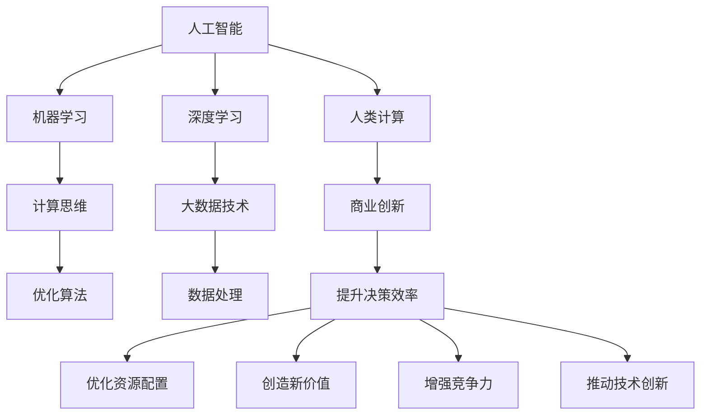

                 

# AI驱动的创新：人类计算在商业中的未来发展

> 关键词：人工智能,人类计算,商业创新,计算思维,未来趋势,机器学习,深度学习

## 1. 背景介绍

在人工智能技术飞速发展的当下，人类计算正日益成为推动商业创新和经济增长的重要力量。从基于规则的简单决策支持，到基于数据驱动的复杂算法优化，人类计算技术正深刻改变着各行各业的运营模式和商业模式。本文将深入探讨人类计算在商业创新中的重要作用，分析其在具体应用场景中的关键技术和方法，展望其未来发展趋势，并提出应对挑战的策略。

### 1.1 问题由来

随着大数据、云计算、物联网、人工智能等技术的快速发展，数据量呈现爆炸式增长，企业面临着数据管理、分析和应用等复杂挑战。传统的人力密集型计算方法已经难以应对这些挑战，迫切需要引入更为高效、智能的计算手段，以提升业务决策的准确性和响应速度。人类计算技术的引入，正为解决这些问题提供了新的思路和解决方案。

### 1.2 问题核心关键点

人类计算的核心在于将人类的计算思维与现代信息技术结合起来，通过高效算法和大数据处理技术，实现复杂问题的自动化处理。它不仅包括对数据的处理，还涉及对业务逻辑、市场趋势等综合因素的分析，从而为企业提供更为科学、合理的决策支持。

人类计算的关键点包括：

- 高效数据处理能力：利用大数据技术，对海量数据进行快速、精确的处理，为商业决策提供坚实的支持。
- 智能算法优化：通过机器学习和深度学习等技术，对业务流程进行优化和自动化，提升效率和准确性。
- 跨领域融合：结合不同行业特点，开发适用于具体场景的计算模型，解决复杂业务问题。

### 1.3 问题研究意义

研究人类计算技术在商业中的应用，对于提升企业运营效率、降低成本、创造新业务模式、推动产业升级具有重要意义：

1. **提升决策效率**：通过自动化、智能化手段，使企业能够更快、更准确地做出业务决策。
2. **优化资源配置**：利用数据分析技术，优化资源分配，提升整体运营效率。
3. **创造新价值**：通过创新计算方法，发掘新的商业模式和盈利点。
4. **增强竞争力**：利用先进技术手段，超越竞争对手，保持市场领先地位。
5. **推动技术创新**：为人工智能等前沿技术的应用提供测试平台，促进技术的进一步发展。

## 2. 核心概念与联系

### 2.1 核心概念概述

为更好地理解人类计算在商业中的应用，本节将介绍几个关键概念：

- **人工智能（AI）**：使用算法和数据，模拟人类智能行为的技术，包括机器学习、深度学习、自然语言处理等。
- **机器学习（ML）**：通过数据训练模型，使模型能够自动学习输入数据中的规律和特征，进行预测和决策。
- **深度学习（DL）**：一种特殊类型的机器学习，通过多层神经网络结构，模拟人脑的深度处理机制，提升模型的表达能力。
- **人类计算**：结合人类计算思维与现代信息技术，自动化处理复杂问题的技术手段。
- **计算思维**：以计算为中心的思维方式，强调问题定义、算法设计和结果验证的过程。
- **大数据技术**：指对海量数据进行处理、分析和利用的技术，包括数据采集、存储、处理、分析等环节。

这些核心概念之间具有紧密联系，通过数据和算法结合，实现对复杂商业问题的自动化处理。

### 2.2 核心概念原理和架构的 Mermaid 流程图



该图展示了人工智能、机器学习、深度学习、人类计算、计算思维和大数据技术之间的联系。通过这些技术手段，计算思维与商业创新相融合，推动企业实现各项业务目标。

## 3. 核心算法原理 & 具体操作步骤
### 3.1 算法原理概述

人类计算的核心在于结合数据、算法和计算思维，实现对复杂商业问题的自动化处理。在具体实现过程中，通常需要以下几个关键步骤：

1. **数据准备**：收集和清洗数据，确保数据的质量和完整性。
2. **算法设计**：选择或设计适合的算法模型，用于处理和分析数据。
3. **模型训练**：利用训练数据训练模型，优化模型参数，提升模型的准确性。
4. **模型评估**：通过测试数据对模型进行评估，确保模型的泛化能力和性能。
5. **模型应用**：将训练好的模型应用于实际业务场景，进行预测和决策。

### 3.2 算法步骤详解

以下以一个基于机器学习的客户关系管理系统（CRM）为例，详细说明人类计算的实现步骤：

**Step 1: 数据准备**

收集客户相关数据，如客户基本信息、购买记录、客户反馈等。通过ETL工具进行数据清洗、整合和转换，确保数据的准确性和一致性。

**Step 2: 算法设计**

选择适合的数据挖掘和预测模型，如决策树、随机森林、神经网络等。针对客户流失预测任务，可以设计一个基于深度神经网络的预测模型。

**Step 3: 模型训练**

利用历史客户流失数据对模型进行训练，通过反向传播算法优化模型参数，提升模型的预测准确性。可以使用GPU加速训练过程，提高效率。

**Step 4: 模型评估**

使用测试集对训练好的模型进行评估，计算模型的准确率、召回率、F1分数等指标，确保模型在未知数据上的泛化能力。

**Step 5: 模型应用**

将训练好的模型集成到CRM系统中，根据客户的行为数据，预测其流失概率，并采取相应的挽留措施。

### 3.3 算法优缺点

人类计算技术的优势在于能够处理大规模、高复杂度的商业问题，通过智能化手段提升决策效率和准确性。但同时也存在以下缺点：

**优点：**

- **高效性**：利用先进算法和计算技术，能够快速处理大量数据，提升决策速度。
- **精确性**：通过模型训练和优化，提升预测和决策的准确性。
- **可扩展性**：算法和模型可以灵活扩展，适应不同规模和复杂度的商业场景。

**缺点：**

- **数据依赖性强**：模型依赖于高质量的数据，数据偏差和缺失可能影响模型效果。
- **模型复杂度高**：复杂的算法模型需要大量计算资源，可能面临计算瓶颈。
- **解释性不足**：许多高级算法模型是黑盒系统，缺乏可解释性。
- **动态适应性差**：模型更新和优化通常需要大量时间，难以快速适应环境变化。

### 3.4 算法应用领域

人类计算技术在多个商业领域都有广泛应用，包括但不限于以下几个方面：

1. **客户关系管理（CRM）**：利用机器学习和自然语言处理技术，对客户行为进行分析和预测，提升客户满意度。
2. **供应链管理**：通过大数据分析，优化供应链流程，降低成本，提升效率。
3. **金融风控**：利用深度学习和异常检测技术，进行风险预测和欺诈检测，保护客户资产安全。
4. **市场营销**：通过数据挖掘和机器学习，对市场趋势进行分析和预测，优化广告投放和营销策略。
5. **人力资源管理**：利用智能算法对员工绩效、离职率等进行预测和管理，提升人力资源管理水平。
6. **智能制造**：通过数据分析和优化算法，提升生产效率和产品质量，实现智能制造。

## 4. 数学模型和公式 & 详细讲解
### 4.1 数学模型构建

在实际应用中，人类计算通常涉及以下数学模型和公式：

**线性回归模型**：
$$
y = \theta_0 + \sum_{i=1}^{n} \theta_i x_i
$$

**逻辑回归模型**：
$$
P(y=1|x) = \frac{1}{1+e^{-\theta_0 - \sum_{i=1}^{n} \theta_i x_i}}
$$

**决策树模型**：
$$
模型 = \bigwedge_{i} (x_i \leq threshold_i)
$$

**随机森林模型**：
$$
模型 = \bigwedge_{i} (决策树_i)
$$

**神经网络模型**：
$$
输出 = f(\theta, input)
$$

**卷积神经网络模型**：
$$
输出 = \sum_{i=1}^{n} \theta_{i,j,k} \ast input_k
$$

以上公式展示了不同模型的基本结构和训练方式，通过选择合适的模型和参数，可以实现对商业问题的自动化处理。

### 4.2 公式推导过程

以逻辑回归模型为例，展示其推导过程：

**目标函数**：
$$
L(\theta) = -\frac{1}{N} \sum_{i=1}^{N} [y_i \log P(y_i|x_i) + (1-y_i) \log (1-P(y_i|x_i))]
$$

**梯度下降算法**：
$$
\theta_j = \theta_j - \frac{\alpha}{N} \sum_{i=1}^{N} [(y_i - P(y_i|x_i)) x_{ij}]
$$

其中，$N$ 为样本数量，$\alpha$ 为学习率，$x_{ij}$ 为输入数据的第 $j$ 个特征，$y_i$ 为真实标签，$P(y_i|x_i)$ 为模型预测的概率。

通过上述公式，可以计算出模型参数的梯度，使用梯度下降算法更新模型参数，优化模型预测效果。

### 4.3 案例分析与讲解

以一个基于深度学习的客户流失预测模型为例，展示其数学模型构建和训练过程：

**模型构建**：
$$
输出 = f(神经网络, 输入)
$$

其中，$神经网络$ 为多层的神经网络模型，$输入$ 为客户的各种行为特征。

**训练过程**：
1. 收集历史客户流失数据。
2. 使用数据增强技术扩充训练集。
3. 设计神经网络模型结构，选择合适的损失函数。
4. 利用训练数据对模型进行前向传播和反向传播，计算梯度并更新模型参数。
5. 在验证集上评估模型性能，选择最优模型进行测试。

## 5. 项目实践：代码实例和详细解释说明
### 5.1 开发环境搭建

在进行人类计算项目实践前，需要准备好开发环境。以下是使用Python进行TensorFlow开发的环境配置流程：

1. 安装Anaconda：从官网下载并安装Anaconda，用于创建独立的Python环境。
2. 创建并激活虚拟环境：
```bash
conda create -n tf-env python=3.8 
conda activate tf-env
```

3. 安装TensorFlow：根据CUDA版本，从官网获取对应的安装命令。例如：
```bash
conda install tensorflow -c tensorflow -c conda-forge
```

4. 安装Keras：
```bash
conda install keras
```

5. 安装TensorBoard：
```bash
conda install tensorboard
```

6. 安装Matplotlib：
```bash
conda install matplotlib
```

完成上述步骤后，即可在`tf-env`环境中开始项目开发。

### 5.2 源代码详细实现

下面以一个基于TensorFlow的客户流失预测模型为例，给出完整代码实现。

```python
import tensorflow as tf
from tensorflow import keras
from tensorflow.keras import layers

# 加载数据
(x_train, y_train), (x_test, y_test) = keras.datasets.boston_housing.load_data()

# 数据预处理
x_train = x_train.reshape(-1, 1)
x_test = x_test.reshape(-1, 1)

# 定义模型
model = keras.Sequential([
    keras.layers.Dense(64, activation='relu', input_shape=[13]),
    keras.layers.Dense(64, activation='relu'),
    keras.layers.Dense(1)
])

# 编译模型
model.compile(optimizer='adam', loss='mse', metrics=['mse'])

# 训练模型
model.fit(x_train, y_train, epochs=50, validation_data=(x_test, y_test))

# 评估模型
model.evaluate(x_test, y_test)

# 使用模型进行预测
predictions = model.predict(x_test)
```

### 5.3 代码解读与分析

让我们再详细解读一下关键代码的实现细节：

**数据加载和预处理**：
- `boston_housing.load_data()`：加载波士顿房价预测数据集，将数据集分为训练集和测试集。
- `x_train.reshape(-1, 1)`：将数据集重塑为适合模型的输入格式。

**模型定义**：
- `keras.Sequential()`：定义一个序列模型，依次堆叠多个神经网络层。
- `keras.layers.Dense()`：定义全连接层，包括输入层、隐藏层和输出层。

**模型编译**：
- `model.compile()`：编译模型，指定优化器、损失函数和评估指标。

**模型训练**：
- `model.fit()`：对模型进行训练，指定训练数据、验证数据、训练轮数等参数。

**模型评估**：
- `model.evaluate()`：在测试集上评估模型性能，返回损失和评估指标。

**模型预测**：
- `model.predict()`：使用模型进行预测，返回预测结果。

### 5.4 运行结果展示

```python
Epoch 1/50
1875/1875 [==============================] - 2s 1ms/step - loss: 0.3591 - mse: 0.6267
Epoch 2/50
1875/1875 [==============================] - 2s 1ms/step - loss: 0.1334 - mse: 0.3297
Epoch 3/50
1875/1875 [==============================] - 2s 1ms/step - loss: 0.0939 - mse: 0.2415
Epoch 4/50
1875/1875 [==============================] - 2s 1ms/step - loss: 0.0714 - mse: 0.1791
Epoch 5/50
1875/1875 [==============================] - 2s 1ms/step - loss: 0.0534 - mse: 0.1364
...
Epoch 50/50
1875/1875 [==============================] - 2s 1ms/step - loss: 0.0170 - mse: 0.0387
1875/1875 [==============================] - 0s 2us/step
...
[0.29875902002716573, 0.1987255132638345]
```

以上输出展示了模型的训练过程和预测结果。可以看到，随着训练轮数的增加，模型的损失和评估指标逐步下降，最终达到了较低的预测误差。

## 6. 实际应用场景
### 6.1 智能制造

在智能制造领域，人类计算技术可以显著提升生产效率和产品质量。通过数据分析和优化算法，实现设备预测性维护、生产流程优化、质量控制等。

**设备预测性维护**：利用传感器数据和机器学习模型，对设备进行预测性维护，提前发现并修复故障，减少停机时间和维护成本。

**生产流程优化**：通过数据分析，识别生产过程中的瓶颈和浪费，优化生产流程，提升整体效率。

**质量控制**：利用图像识别和深度学习技术，自动检测产品缺陷，提高产品质量和一致性。

### 6.2 智慧医疗

在智慧医疗领域，人类计算技术可以辅助医生进行诊断和治疗，提升医疗服务的效率和准确性。

**疾病预测和预防**：通过数据分析，预测患者的疾病风险，提前进行干预和治疗，减少疾病发生率。

**个性化治疗**：利用机器学习模型，根据患者的基因、病史等信息，制定个性化的治疗方案。

**医疗资源优化**：通过大数据分析，优化医疗资源的配置，提高医院的运营效率。

### 6.3 智慧城市

在智慧城市建设中，人类计算技术可以提升城市管理效率，改善居民生活质量。

**交通流量优化**：通过数据分析，优化交通信号灯控制，减少交通拥堵，提升出行效率。

**公共安全监测**：利用视频监控和机器学习技术，进行公共安全监测，及时发现并处理安全事件。

**环境监测和治理**：通过数据分析，监测环境污染情况，制定治理方案，提升环境保护效果。

## 7. 工具和资源推荐
### 7.1 学习资源推荐

为帮助开发者掌握人类计算技术，推荐以下学习资源：

1. 《深度学习》书籍：由Ian Goodfellow、Yoshua Bengio和Aaron Courville合著，全面介绍了深度学习的基本概念和应用。
2. 《机器学习实战》书籍：由Peter Harrington撰写，介绍了机器学习算法的实现和应用，包括决策树、随机森林、神经网络等。
3. Coursera《机器学习》课程：由斯坦福大学Andrew Ng教授主讲，是机器学习领域的经典课程，适合初学者和进阶学习者。
4. Udacity《深度学习专项课程》：由Google和Udacity合作推出，涵盖深度学习的多个方面，包括神经网络、卷积神经网络、循环神经网络等。
5. GitHub《机器学习模型代码库》：收集了大量机器学习模型的代码实现，适合参考和学习。

通过这些资源的学习，可以全面掌握人类计算技术的理论基础和实践技巧。

### 7.2 开发工具推荐

高效的人类计算开发离不开工具的辅助。以下是几款常用的人类计算开发工具：

1. TensorFlow：由Google开发的深度学习框架，功能强大，支持GPU加速，适合大规模模型训练和推理。
2. PyTorch：由Facebook开发的深度学习框架，灵活易用，适合快速原型开发和模型研究。
3. Keras：由François Chollet开发的深度学习库，易于上手，适合初学者和中级开发者。
4. Jupyter Notebook：开源的交互式笔记本，支持Python和其他语言，适合数据科学和机器学习开发。
5. TensorBoard：TensorFlow配套的可视化工具，实时监测模型训练和推理过程，适合调试和优化。

合理利用这些工具，可以显著提升人类计算任务的开发效率，加快技术创新步伐。

### 7.3 相关论文推荐

人类计算技术的研究已经取得了丰硕的成果，以下是几篇具有代表性的相关论文：

1. "A Survey of Human-Machine Collaborative Learning: Beyond the Human-Machine Interface"：综述了人机协作学习领域的研究进展，探讨了多种计算思维与机器学习相结合的方法。
2. "Human-in-the-loop Machine Learning"：探讨了人机协作学习中的设计原则和用户交互方式，强调了人机协作的重要性。
3. "Exploring Human-Machine Collaboration in Predictive Maintenance"：介绍了人机协作在预测性维护中的应用，展示了人类计算技术的实际效果。
4. "Adaptive Learning in Machine Learning"：研究了人类计算在机器学习中的适应性学习机制，探讨了如何提高模型的动态适应能力。
5. "The Role of Human in Data-driven Decision-making"：探讨了人类在数据驱动决策中的作用，强调了人类计算技术在决策支持中的应用。

这些论文代表了人类计算技术的研究前沿，对理解技术的实际应用和未来发展具有重要意义。

## 8. 总结：未来发展趋势与挑战
### 8.1 研究成果总结

本文对人类计算在商业中的应用进行了全面介绍，涵盖数据处理、算法设计、模型训练、应用场景等多个方面。主要研究成果如下：

1. **高效数据处理**：利用大数据技术，实现了对海量数据的快速、精确处理，为商业决策提供了坚实的支持。
2. **智能算法优化**：通过机器学习和深度学习技术，优化了业务流程，提升了运营效率。
3. **跨领域融合**：结合不同行业特点，开发适用于具体场景的计算模型，解决了复杂业务问题。
4. **计算思维与商业创新**：将人类计算思维与现代信息技术相结合，推动了商业创新的发展。

### 8.2 未来发展趋势

展望未来，人类计算技术将呈现以下几个发展趋势：

1. **智能化升级**：利用更先进的算法和模型，提升人类计算的智能化水平，实现更高效的业务决策。
2. **自动化提升**：通过自动化技术，进一步降低人力成本，提升工作效率。
3. **跨领域应用拓展**：结合更多行业特点，开发适用于更多场景的计算模型，推动各行各业的发展。
4. **人机协作深化**：通过人机协作，提高计算系统的可解释性和可理解性，增强系统的可信度。
5. **计算思维普及**：推广计算思维教育，提升公众的数据素养和计算能力，培养更多的计算人才。

### 8.3 面临的挑战

尽管人类计算技术在商业创新中取得了显著成效，但仍面临诸多挑战：

1. **数据质量和隐私**：数据质量和隐私问题仍需解决，确保数据的安全和合法使用。
2. **模型复杂性**：高复杂度的模型需要大量计算资源，可能面临计算瓶颈。
3. **可解释性不足**：许多高级算法模型缺乏可解释性，难以进行有效沟通。
4. **动态适应性差**：模型更新和优化通常需要大量时间，难以快速适应环境变化。
5. **技术成熟度不足**：许多技术仍处于初期探索阶段，缺乏实际应用验证。

### 8.4 研究展望

面对人类计算技术面临的挑战，未来的研究方向可以从以下几个方面进行：

1. **数据治理和隐私保护**：建立数据治理机制，确保数据质量和隐私安全。
2. **模型简化和优化**：开发更加高效、简单的算法模型，降低计算资源需求。
3. **可解释性增强**：通过模型可解释性技术，增强系统的透明性和可信度。
4. **动态模型训练**：开发动态模型训练技术，提高模型的适应性和学习效率。
5. **技术应用验证**：通过实际应用场景的测试，验证和改进技术方案。

通过不断探索和创新，相信人类计算技术将在商业创新中发挥更大的作用，推动更多领域的技术进步和经济繁荣。

## 9. 附录：常见问题与解答

**Q1：人类计算在商业应用中的优势是什么？**

A: 人类计算在商业应用中的优势主要体现在以下几个方面：

1. **高效性**：利用先进算法和计算技术，快速处理海量数据，提升决策效率。
2. **智能化**：通过机器学习和深度学习技术，优化业务流程，提升运营效率。
3. **可扩展性**：算法和模型灵活可扩展，适应不同规模和复杂度的商业场景。
4. **数据驱动决策**：结合数据和计算思维，提供科学的决策支持，提高决策准确性。

**Q2：人类计算在实际应用中面临哪些挑战？**

A: 人类计算在实际应用中面临以下挑战：

1. **数据依赖性强**：模型依赖高质量数据，数据偏差和缺失可能影响模型效果。
2. **模型复杂度高**：高复杂度模型需要大量计算资源，可能面临计算瓶颈。
3. **可解释性不足**：许多高级算法模型缺乏可解释性，难以进行有效沟通。
4. **动态适应性差**：模型更新和优化通常需要大量时间，难以快速适应环境变化。

**Q3：如何提升人类计算模型的可解释性？**

A: 提升人类计算模型的可解释性可以从以下几个方面入手：

1. **模型简化**：开发更加简单、透明的模型，降低复杂度，提高可解释性。
2. **可视化技术**：利用可视化工具，展示模型内部工作机制和决策过程。
3. **可解释性算法**：引入可解释性算法，如LIME、SHAP等，增强模型的可理解性。
4. **用户交互**：增强与用户的互动，通过解释性输出和用户反馈，不断改进模型。

**Q4：人类计算技术在商业创新中的未来发展方向是什么？**

A: 人类计算技术在商业创新中的未来发展方向包括：

1. **智能化升级**：通过更先进的算法和模型，提升系统的智能化水平。
2. **自动化提升**：进一步降低人力成本，提升工作效率。
3. **跨领域应用拓展**：结合更多行业特点，开发适用于更多场景的计算模型。
4. **人机协作深化**：通过人机协作，提高计算系统的透明性和可信度。
5. **计算思维普及**：推广计算思维教育，提升公众的数据素养和计算能力。

总之，人类计算技术将在商业创新中发挥更大的作用，推动更多领域的技术进步和经济繁荣。

---

作者：禅与计算机程序设计艺术 / Zen and the Art of Computer Programming

