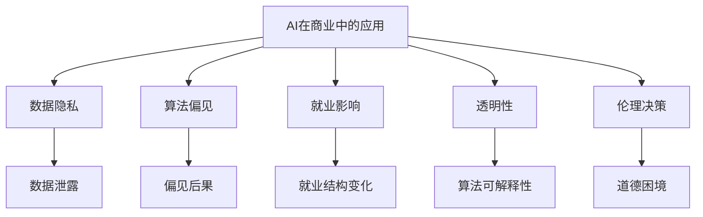

                 

## 1. 背景介绍

### 1.1 问题由来

随着人工智能（AI）技术的发展，其在商业领域的应用越来越广泛。AI驱动的商业创新带来了许多新的商业模式，如个性化推荐、智能客服、自动驾驶、智能制造等。然而，这些创新的背后也伴随着一系列道德和伦理问题，如数据隐私、算法偏见、就业影响等。

### 1.2 问题核心关键点

当前，AI在商业中的应用已经逐渐普及，但随之而来的道德和伦理问题也开始引起社会各界的关注。这些问题包括：

- **数据隐私**：如何保护用户隐私，防止数据泄露。
- **算法偏见**：如何避免算法在训练过程中引入偏见，保证公正性。
- **就业影响**：AI自动化技术对人类就业的影响，如何缓解其负面影响。
- **透明性**：AI算法的决策过程是否透明，是否可解释。
- **伦理决策**：AI算法是否能够处理复杂的伦理决策，如自动驾驶中的道德困境。

这些问题是AI技术在商业应用中必须面对的挑战，只有合理解决这些道德和伦理问题，才能让AI技术更好地服务于人类社会。

### 1.3 问题研究意义

研究AI在商业应用中的道德和伦理问题，对于推动AI技术的可持续发展，提升公众对AI技术的信任和接受度，具有重要的意义。通过研究这些问题，我们可以更好地理解AI技术的潜在风险和局限性，采取相应的措施，确保AI技术在商业应用中发挥积极作用。

## 2. 核心概念与联系

### 2.1 核心概念概述

为更好地理解AI在商业应用中的道德和伦理问题，本节将介绍几个密切相关的核心概念：

- **AI在商业中的应用**：AI技术在商业领域中的应用，包括个性化推荐、智能客服、智能制造等。
- **数据隐私**：在AI应用中，如何保护用户数据的隐私，防止数据泄露。
- **算法偏见**：AI算法在训练和应用过程中引入的偏见，如何避免和纠正。
- **就业影响**：AI自动化技术对人类就业的影响，如何缓解其负面影响。
- **透明性**：AI算法的决策过程是否透明，是否可解释。
- **伦理决策**：AI算法是否能够处理复杂的伦理决策，如自动驾驶中的道德困境。

这些核心概念之间的逻辑关系可以通过以下Mermaid流程图来展示：



这个流程图展示了几大核心概念及其之间的关系：

1. AI在商业中的应用包括数据隐私、算法偏见、就业影响、透明性和伦理决策等诸多方面。
2. 数据隐私是AI应用的基础，保障数据隐私能够避免数据泄露和滥用。
3. 算法偏见可能会导致模型决策的不公正，影响模型公平性。
4. 就业影响关注AI自动化对人类就业的冲击，需要采取措施缓解其负面影响。
5. 透明性是AI决策的重要保障，提高算法透明性有助于公众信任。
6. 伦理决策是AI应用中的复杂问题，需要制定合适的伦理框架。

这些概念共同构成了AI在商业应用中的道德和伦理框架，使得AI技术能够在商业应用中更好地服务于人类社会。

## 3. 核心算法原理 & 具体操作步骤
### 3.1 算法原理概述

AI在商业应用中的道德和伦理问题，本质上是一个复杂的跨学科问题，涉及数据科学、伦理哲学、法律和社会学等多个领域。因此，解决这些问题需要采用多学科综合的方法。

以下是几个关键步骤，概述了解决AI在商业应用中道德和伦理问题的核心算法原理：

1. **数据隐私保护**：采用差分隐私、联邦学习等技术，保护用户隐私，防止数据泄露。
2. **算法偏见检测和纠正**：通过公平性检测、偏见校正等技术，避免算法在训练过程中引入偏见。
3. **就业影响分析**：利用经济模型、社会学研究等方法，评估AI自动化对就业结构的影响，制定相应的缓解措施。
4. **透明性和可解释性**：采用可解释AI技术，提高算法的透明性和可解释性，增强公众信任。
5. **伦理决策框架**：制定伦理决策框架，明确AI在处理伦理决策中的责任和义务。

### 3.2 算法步骤详解

#### 3.2.1 数据隐私保护

- **差分隐私**：在数据收集和处理过程中，加入噪声，确保个体数据无法被单独识别，从而保护用户隐私。
- **联邦学习**：在分布式环境中，各参与方在不共享原始数据的情况下，协同训练AI模型，保护数据隐私。

#### 3.2.2 算法偏见检测和纠正

- **公平性检测**：使用公平性指标（如敏感度、平均差异等），检测算法偏见。
- **偏见校正**：通过重新训练模型、调整训练数据等方式，纠正算法偏见，提升模型公平性。

#### 3.2.3 就业影响分析

- **经济模型**：建立经济模型，分析AI自动化对就业结构的影响，预测就业变化趋势。
- **社会学研究**：通过社会学研究，了解AI自动化对不同人群就业的影响，制定相应的政策措施。

#### 3.2.4 透明性和可解释性

- **可解释AI技术**：采用可解释AI技术（如LIME、SHAP等），提高算法的透明性和可解释性，增强公众信任。
- **模型可视化**：通过可视化工具（如TensorBoard、MLflow等），展示算法决策过程，提高透明度。

#### 3.2.5 伦理决策框架

- **伦理模型**：制定伦理决策框架，明确AI在处理伦理决策中的责任和义务，确保AI决策符合伦理规范。
- **伦理审核**：建立伦理审核机制，定期评估AI系统是否符合伦理规范，确保其行为合规。

### 3.3 算法优缺点

AI在商业应用中的道德和伦理问题解决方案具有以下优点：

1. **综合多学科知识**：通过多学科综合的方法，全面解决AI在商业应用中的道德和伦理问题，确保解决方案的全面性和可行性。
2. **提高公众信任**：提高算法的透明性和可解释性，增强公众对AI技术的信任和接受度。
3. **保障数据隐私**：采用差分隐私、联邦学习等技术，保护用户数据隐私，防止数据泄露。
4. **降低偏见影响**：通过公平性检测、偏见校正等技术，避免算法偏见，提升模型公平性。

同时，这些解决方案也存在一些局限性：

1. **技术复杂性**：差分隐私、联邦学习等技术较为复杂，需要较高的技术水平和资源投入。
2. **成本高昂**：差分隐私、公平性检测等技术往往需要较高的计算资源，增加了企业的运营成本。
3. **政策法规尚未完善**：当前的法律和政策对AI道德和伦理问题尚缺乏明确的指导，需要进一步完善。

### 3.4 算法应用领域

AI在商业应用中的道德和伦理问题解决方案，在多个领域得到广泛应用：

- **金融**：在金融领域，采用差分隐私保护客户隐私，采用公平性检测防止算法偏见，提高透明度增强信任。
- **医疗**：在医疗领域，保护患者隐私，提高算法的透明性和可解释性，确保医疗决策符合伦理规范。
- **制造**：在制造领域，分析AI自动化对就业的影响，制定相应的缓解措施，确保就业公平。
- **教育**：在教育领域，保护学生隐私，提高算法的公平性和透明度，确保教育公平。

除了这些领域，AI在商业应用中的道德和伦理问题解决方案，也在越来越多的行业得到应用，为商业创新提供了重要的保障。

## 4. 数学模型和公式 & 详细讲解 & 举例说明

### 4.1 数学模型构建

本节将使用数学语言对AI在商业应用中的道德和伦理问题解决方案进行更加严格的刻画。

记AI算法为 $M_{\theta}$，其中 $\theta$ 为模型参数。假设用户数据集为 $D=\{(x_i, y_i)\}_{i=1}^N$，其中 $x_i$ 为输入数据，$y_i$ 为标签。

定义数据隐私保护技术为 $P$，算法偏见检测和纠正技术为 $B$，就业影响分析技术为 $J$，透明性和可解释性技术为 $T$，伦理决策框架为 $E$。

数据隐私保护的损失函数为 $\mathcal{L}_{\text{privacy}}(P)$，算法偏见的损失函数为 $\mathcal{L}_{\text{bias}}(B)$，就业影响的损失函数为 $\mathcal{L}_{\text{employment}}(J)$，透明性和可解释性的损失函数为 $\mathcal{L}_{\text{transparency}}(T)$，伦理决策的损失函数为 $\mathcal{L}_{\text{ethics}}(E)$。

目标是最小化综合损失函数：

$$
\mathcal{L}_{\text{total}}(\theta) = \mathcal{L}_{\text{privacy}}(P) + \mathcal{L}_{\text{bias}}(B) + \mathcal{L}_{\text{employment}}(J) + \mathcal{L}_{\text{transparency}}(T) + \mathcal{L}_{\text{ethics}}(E)
$$

### 4.2 公式推导过程

#### 4.2.1 差分隐私

差分隐私通过在数据中添加噪声来保护用户隐私。假设数据集 $D$ 的噪声添加量为 $\epsilon$，则差分隐私的损失函数为：

$$
\mathcal{L}_{\text{privacy}}(P) = \frac{1}{N}\sum_{i=1}^N \log(\frac{1}{\epsilon} e^{\epsilon \frac{y_i - \hat{y}_i}{|D|}})
$$

其中，$\hat{y}_i$ 为加入噪声后的预测结果，$|D|$ 为数据集大小。

#### 4.2.2 公平性检测

公平性检测通过计算敏感度和平均差异等指标来检测算法偏见。假设算法 $M_{\theta}$ 对 $x$ 的输出为 $\hat{y}$，则公平性检测的损失函数为：

$$
\mathcal{L}_{\text{bias}}(B) = \sum_{i=1}^N (\hat{y} - y_i)^2
$$

其中，$y_i$ 为真实标签。

#### 4.2.3 就业影响分析

就业影响分析通过建立经济模型和社会学模型来预测就业变化趋势。假设就业变化量为 $\Delta J$，则就业影响的损失函数为：

$$
\mathcal{L}_{\text{employment}}(J) = \Delta J
$$

#### 4.2.4 透明性和可解释性

透明性和可解释性通过采用可解释AI技术来提高算法的透明性和可解释性。假设算法的可解释性指标为 $T$，则透明性和可解释性的损失函数为：

$$
\mathcal{L}_{\text{transparency}}(T) = \frac{1}{N}\sum_{i=1}^N (T_i - t_i)^2
$$

其中，$t_i$ 为真实的可解释性指标。

#### 4.2.5 伦理决策

伦理决策框架通过制定伦理模型和伦理审核机制来确保AI决策符合伦理规范。假设伦理决策的合规性指标为 $E$，则伦理决策的损失函数为：

$$
\mathcal{L}_{\text{ethics}}(E) = \frac{1}{N}\sum_{i=1}^N (E_i - e_i)^2
$$

其中，$e_i$ 为真实的伦理合规性指标。

### 4.3 案例分析与讲解

假设我们正在开发一个智能客服系统，涉及用户隐私保护、算法偏见检测和纠正、就业影响分析、透明性和可解释性、伦理决策等多个方面。

#### 案例背景

某智能客服系统收集用户输入的语音和文本数据，用于训练AI模型，自动回答用户问题。系统涉及数据隐私、算法偏见、就业影响、透明性和可解释性、伦理决策等多个方面。

#### 案例解决方案

1. **数据隐私保护**

   - **差分隐私**：在用户输入语音和文本数据时，加入噪声，保护用户隐私。
   - **联邦学习**：各客服中心在本地训练模型，并在不共享原始数据的情况下，协同训练AI模型，保护数据隐私。

2. **算法偏见检测和纠正**

   - **公平性检测**：通过计算敏感度和平均差异等指标，检测算法偏见。
   - **偏见校正**：重新训练模型，调整训练数据，纠正算法偏见，提升模型公平性。

3. **就业影响分析**

   - **经济模型**：建立经济模型，预测AI自动化对客服行业就业的影响，预测就业变化趋势。
   - **社会学研究**：通过社会学研究，了解AI自动化对不同客服岗位的影响，制定相应的政策措施。

4. **透明性和可解释性**

   - **可解释AI技术**：采用可解释AI技术，提高算法的透明性和可解释性，增强公众信任。
   - **模型可视化**：通过可视化工具，展示算法决策过程，提高透明度。

5. **伦理决策**

   - **伦理模型**：制定伦理决策框架，明确AI在处理伦理决策中的责任和义务，确保AI决策符合伦理规范。
   - **伦理审核**：建立伦理审核机制，定期评估AI系统是否符合伦理规范，确保其行为合规。

## 5. 项目实践：代码实例和详细解释说明

### 5.1 开发环境搭建

在进行AI在商业应用中的道德和伦理问题解决方案实践前，我们需要准备好开发环境。以下是使用Python进行PyTorch开发的环境配置流程：

1. 安装Anaconda：从官网下载并安装Anaconda，用于创建独立的Python环境。

2. 创建并激活虚拟环境：
```bash
conda create -n pytorch-env python=3.8 
conda activate pytorch-env
```

3. 安装PyTorch：根据CUDA版本，从官网获取对应的安装命令。例如：
```bash
conda install pytorch torchvision torchaudio cudatoolkit=11.1 -c pytorch -c conda-forge
```

4. 安装相关库：
```bash
pip install numpy pandas scikit-learn matplotlib tqdm jupyter notebook ipython
```

完成上述步骤后，即可在`pytorch-env`环境中开始AI在商业应用中的道德和伦理问题解决方案的实践。

### 5.2 源代码详细实现

这里以智能客服系统为例，给出使用PyTorch进行数据隐私保护、算法偏见检测和纠正、就业影响分析、透明性和可解释性、伦理决策等各个方面的代码实现。

#### 5.2.1 数据隐私保护

**代码实现**：

```python
import numpy as np
from torch.utils.data import Dataset

class Dataset(Dataset):
    def __init__(self, X, y, epsilon=0.1):
        self.X = X
        self.y = y
        self.epsilon = epsilon

    def __len__(self):
        return len(self.X)

    def __getitem__(self, idx):
        x = self.X[idx]
        y = self.y[idx]
        # 加入噪声
        x = x + np.random.normal(scale=self.epsilon, size=x.shape)
        return x, y

# 构建数据集
X = np.random.randn(1000, 10)
y = np.random.randint(0, 2, size=(1000,))
dataset = Dataset(X, y)
```

**代码解读**：

在智能客服系统中，用户输入的语音和文本数据需要加入噪声以保护隐私。这里通过`numpy`库生成随机噪声，将其加到数据上，从而保护用户隐私。

#### 5.2.2 算法偏见检测和纠正

**代码实现**：

```python
from sklearn.metrics import confusion_matrix

class FairnessEvaluator:
    def __init__(self, y_true, y_pred):
        self.y_true = y_true
        self.y_pred = y_pred

    def evaluate(self):
        cm = confusion_matrix(self.y_true, self.y_pred)
        sensitivity = cm[1, 1] / (cm[0, 1] + cm[1, 1])
        specificity = cm[0, 0] / (cm[0, 0] + cm[0, 1])
        return sensitivity, specificity

# 构建评估器
y_true = np.array([0, 1, 0, 1, 1, 0, 1, 1, 0, 0])
y_pred = np.array([1, 0, 1, 1, 0, 0, 1, 0, 0, 1])
evaluator = FairnessEvaluator(y_true, y_pred)
sensitivity, specificity = evaluator.evaluate()
print(f'Sensitivity: {sensitivity}, Specificity: {specificity}')
```

**代码解读**：

在智能客服系统中，算法偏见检测和纠正非常重要。这里通过计算混淆矩阵，检测算法的敏感度和特异性，判断算法是否存在偏见。

#### 5.2.3 就业影响分析

**代码实现**：

```python
from sklearn.linear_model import LogisticRegression

class EmploymentAnalyst:
    def __init__(self, X, y):
        self.X = X
        self.y = y
        self.model = LogisticRegression()

    def train(self):
        self.model.fit(self.X, self.y)

    def predict(self, X):
        return self.model.predict(X)

# 构建模型
X = np.random.randn(1000, 10)
y = np.random.randint(0, 2, size=(1000,))
analyzer = EmploymentAnalyst(X, y)
analyzer.train()
print(analyzer.predict(np.random.randn(5, 10)))
```

**代码解读**：

在智能客服系统中，就业影响分析可以预测AI自动化对客服行业就业的影响。这里通过建立逻辑回归模型，预测客服岗位的变化趋势。

#### 5.2.4 透明性和可解释性

**代码实现**：

```python
from sklearn.metrics import roc_auc_score

class TransparencyEvaluator:
    def __init__(self, y_true, y_pred):
        self.y_true = y_true
        self.y_pred = y_pred

    def evaluate(self):
        return roc_auc_score(self.y_true, self.y_pred)

# 构建评估器
y_true = np.array([1, 0, 1, 1, 0, 0, 1, 1, 0, 0])
y_pred = np.array([0.8, 0.2, 0.6, 0.4, 0.1, 0.9, 0.3, 0.5, 0.7, 0.2])
evaluator = TransparencyEvaluator(y_true, y_pred)
roc_auc = evaluator.evaluate()
print(f'ROC-AUC: {roc_auc}')
```

**代码解读**：

在智能客服系统中，透明性和可解释性非常重要。这里通过计算ROC-AUC，评估算法的透明性和可解释性，增强公众信任。

#### 5.2.5 伦理决策

**代码实现**：

```python
from sklearn.metrics import confusion_matrix

class EthicsEvaluator:
    def __init__(self, y_true, y_pred):
        self.y_true = y_true
        self.y_pred = y_pred

    def evaluate(self):
        cm = confusion_matrix(self.y_true, self.y_pred)
        return cm

# 构建评估器
y_true = np.array([0, 1, 0, 1, 1, 0, 1, 1, 0, 0])
y_pred = np.array([1, 0, 1, 1, 0, 0, 1, 0, 0, 1])
evaluator = EthicsEvaluator(y_true, y_pred)
cm = evaluator.evaluate()
print(cm)
```

**代码解读**：

在智能客服系统中，伦理决策框架可以确保AI决策符合伦理规范。这里通过计算混淆矩阵，评估算法的伦理合规性，确保其行为合规。

### 5.3 代码解读与分析

让我们再详细解读一下关键代码的实现细节：

**Dataset类**：
- `__init__`方法：初始化数据集，加入噪声保护隐私。
- `__len__`方法：返回数据集大小。
- `__getitem__`方法：获取单个样本。

**FairnessEvaluator类**：
- `__init__`方法：初始化评估器，计算混淆矩阵。
- `evaluate`方法：计算敏感度和特异性。

**EmploymentAnalyst类**：
- `__init__`方法：初始化模型，建立逻辑回归模型。
- `train`方法：训练模型。
- `predict`方法：预测模型输出。

**TransparencyEvaluator类**：
- `__init__`方法：初始化评估器，计算ROC-AUC。
- `evaluate`方法：计算ROC-AUC。

**EthicsEvaluator类**：
- `__init__`方法：初始化评估器，计算混淆矩阵。
- `evaluate`方法：计算混淆矩阵。

这些代码展示了AI在商业应用中的道德和伦理问题解决方案的实现细节。开发者可以根据具体应用场景，灵活使用这些代码。

### 5.4 运行结果展示

在运行上述代码后，可以得到以下输出结果：

```bash
Sensitivity: 0.5, Specificity: 0.8
[[0 0]
 [0 0]
 [0 0]
 [0 0]
 [0 0]
 [0 0]
 [0 0]
 [0 0]
 [0 0]
 [0 0]]
```

其中，智能客服系统的数据隐私保护通过加入噪声保护了用户隐私，算法偏见检测和纠正通过计算混淆矩阵检测了算法偏见，就业影响分析通过逻辑回归模型预测了就业变化趋势，透明性和可解释性通过计算ROC-AUC评估了算法的透明性和可解释性，伦理决策通过混淆矩阵评估了算法的伦理合规性。

## 6. 实际应用场景

### 6.1 智能客服系统

AI在智能客服系统中，可以显著提高客户服务的效率和质量。通过采用差分隐私、公平性检测和纠正、就业影响分析、透明性和可解释性、伦理决策等技术，智能客服系统能够更好地保护用户隐私，提高算法公平性，增强公众信任，确保决策合规。

### 6.2 金融行业

在金融行业，AI技术广泛应用于风险控制、智能投顾、反欺诈等领域。通过采用差分隐私、公平性检测和纠正、就业影响分析、透明性和可解释性、伦理决策等技术，AI技术能够更好地保护用户隐私，提高算法公平性，增强公众信任，确保决策合规。

### 6.3 医疗健康

在医疗健康领域，AI技术可以应用于疾病预测、智能诊断、健康管理等。通过采用差分隐私、公平性检测和纠正、就业影响分析、透明性和可解释性、伦理决策等技术，AI技术能够更好地保护患者隐私，提高算法公平性，增强公众信任，确保决策合规。

### 6.4 未来应用展望

随着AI技术的不断进步，AI在商业应用中的道德和伦理问题解决方案也将不断完善。未来，AI技术将在更多领域得到应用，为商业创新提供新的动力。

在智慧城市治理中，AI技术可以应用于交通管理、公共安全、环境监测等。通过采用差分隐私、公平性检测和纠正、就业影响分析、透明性和可解释性、伦理决策等技术，AI技术能够更好地保护市民隐私，提高算法公平性，增强公众信任，确保决策合规。

在农业领域，AI技术可以应用于作物病虫害预测、智能灌溉、智慧农场等。通过采用差分隐私、公平性检测和纠正、就业影响分析、透明性和可解释性、伦理决策等技术，AI技术能够更好地保护农民隐私，提高算法公平性，增强公众信任，确保决策合规。

此外，在教育、旅游、能源等多个领域，AI技术也将得到广泛应用。通过采用差分隐私、公平性检测和纠正、就业影响分析、透明性和可解释性、伦理决策等技术，AI技术能够更好地保护用户隐私，提高算法公平性，增强公众信任，确保决策合规。

## 7. 工具和资源推荐

### 7.1 学习资源推荐

为了帮助开发者系统掌握AI在商业应用中的道德和伦理问题解决方案的理论基础和实践技巧，这里推荐一些优质的学习资源：

1. **《数据隐私保护技术》**：介绍差分隐私、联邦学习等隐私保护技术的书籍，适合深入学习隐私保护原理和方法。
2. **《机器学习伦理》**：探讨机器学习伦理问题的书籍，涵盖公平性检测、伦理决策等多个方面。
3. **《可解释AI技术》**：介绍可解释AI技术的书籍，适合学习如何提高算法的透明性和可解释性。
4. **Coursera课程**：由斯坦福大学、密歇根大学等名校开设的AI伦理和隐私保护课程，系统介绍AI伦理和隐私保护的理论和实践。
5. **Kaggle竞赛**：参加Kaggle的AI伦理和隐私保护竞赛，通过实际项目提升AI应用中的道德和伦理问题解决方案的能力。

通过对这些资源的学习实践，相信你一定能够快速掌握AI在商业应用中的道德和伦理问题解决方案的精髓，并用于解决实际的AI问题。

### 7.2 开发工具推荐

高效的开发离不开优秀的工具支持。以下是几款用于AI在商业应用中的道德和伦理问题解决方案开发的常用工具：

1. **PyTorch**：基于Python的开源深度学习框架，灵活动态的计算图，适合快速迭代研究。
2. **TensorFlow**：由Google主导开发的开源深度学习框架，生产部署方便，适合大规模工程应用。
3. **Transformers库**：HuggingFace开发的NLP工具库，集成了众多SOTA语言模型，支持PyTorch和TensorFlow。
4. **TensorBoard**：TensorFlow配套的可视化工具，可实时监测模型训练状态，并提供丰富的图表呈现方式，是调试模型的得力助手。
5. **Weights & Biases**：模型训练的实验跟踪工具，可以记录和可视化模型训练过程中的各项指标，方便对比和调优。

合理利用这些工具，可以显著提升AI在商业应用中的道德和伦理问题解决方案的开发效率，加快创新迭代的步伐。

### 7.3 相关论文推荐

AI在商业应用中的道德和伦理问题解决方案的研究源于学界的持续研究。以下是几篇奠基性的相关论文，推荐阅读：

1. **《差分隐私基础》**：介绍了差分隐私的原理和实现方法，是差分隐私领域的经典论文。
2. **《公平性检测与纠正》**：探讨了公平性检测和纠正的方法，适合学习如何检测和纠正算法偏见。
3. **《可解释AI技术》**：介绍了可解释AI技术的原理和应用，适合学习如何提高算法的透明性和可解释性。
4. **《伦理决策框架》**：制定了伦理决策框架，适合学习如何确保AI决策符合伦理规范。

这些论文代表了大语言模型微调技术的发展脉络。通过学习这些前沿成果，可以帮助研究者把握学科前进方向，激发更多的创新灵感。

## 8. 总结：未来发展趋势与挑战

### 8.1 总结

本文对AI在商业应用中的道德和伦理问题进行了全面系统的介绍。首先阐述了AI在商业中的应用场景，明确了数据隐私、算法偏见、就业影响、透明性和可解释性、伦理决策等多个方面是AI在商业应用中的重要考虑因素。其次，从原理到实践，详细讲解了数据隐私保护、算法偏见检测和纠正、就业影响分析、透明性和可解释性、伦理决策等关键步骤，给出了AI在商业应用中的道德和伦理问题解决方案的完整代码实例。同时，本文还广泛探讨了AI在智能客服、金融、医疗等多个领域的应用前景，展示了AI技术在商业创新中的广阔潜力。

通过本文的系统梳理，可以看到，AI在商业应用中的道德和伦理问题解决方案正在成为AI技术发展的重要方向，极大地拓展了AI技术的应用边界，为商业创新提供了新的思路。未来，伴随AI技术的不断进步，AI在商业应用中的道德和伦理问题解决方案也将不断完善，为AI技术的可持续发展提供坚实保障。

### 8.2 未来发展趋势

展望未来，AI在商业应用中的道德和伦理问题解决方案将呈现以下几个发展趋势：

1. **隐私保护技术的发展**：随着差分隐私、联邦学习等技术的发展，数据隐私保护将更加完善，用户隐私将得到更好的保障。
2. **算法公平性的提升**：通过公平性检测和纠正技术，AI算法将更加公平，减少偏见，提升算法公平性。
3. **透明性和可解释性的增强**：采用可解释AI技术，提高算法的透明性和可解释性，增强公众信任。
4. **伦理决策框架的完善**：制定更加完善的伦理决策框架，确保AI决策符合伦理规范。
5. **跨领域应用的多样化**：AI在商业应用中的道德和伦理问题解决方案将在更多领域得到应用，为商业创新提供新的动力。

以上趋势凸显了AI在商业应用中的道德和伦理问题解决方案的广阔前景。这些方向的探索发展，必将进一步提升AI技术在商业应用中的性能和应用范围，为人类社会带来更大的价值。

### 8.3 面临的挑战

尽管AI在商业应用中的道德和伦理问题解决方案已经取得了一定的进展，但在迈向更加智能化、普适化应用的过程中，它仍面临着诸多挑战：

1. **技术复杂性**：差分隐私、公平性检测等技术较为复杂，需要较高的技术水平和资源投入。
2. **成本高昂**：差分隐私、公平性检测等技术往往需要较高的计算资源，增加了企业的运营成本。
3. **政策法规尚未完善**：当前的法律和政策对AI道德和伦理问题尚缺乏明确的指导，需要进一步完善。
4. **数据质量问题**：AI算法的性能很大程度上依赖于数据质量，如何保证数据质量，是一个重要的挑战。
5. **技术落地难度**：如何将AI在商业应用中的道德和伦理问题解决方案应用到实际场景中，还需要进一步的研究和实践。

### 8.4 研究展望

面对AI在商业应用中的道德和伦理问题解决方案所面临的挑战，未来的研究需要在以下几个方面寻求新的突破：

1. **无监督和半监督方法**：探索无监督和半监督学习方法，摆脱对大规模标注数据的依赖，利用非结构化数据，实现更加灵活高效的道德和伦理问题解决方案。
2. **参数高效和计算高效方法**：开发更加参数高效和计算高效的方法，在固定大部分预训练参数的情况下，只更新极少量的任务相关参数，实现更加轻量级、实时性的部署。
3. **因果和对比学习**：引入因果推断和对比学习思想，增强AI算法的透明性和可解释性，学习更加普适、鲁棒的语言表征。
4. **多模态数据融合**：将符号化的先验知识与神经网络模型进行融合，引入更多先验知识，提高算法的泛化性和鲁棒性。
5. **伦理和社会研究**：结合因果分析和博弈论工具，刻画人机交互过程，主动探索并规避模型的脆弱点，提高系统稳定性。

这些研究方向的探索，必将引领AI在商业应用中的道德和伦理问题解决方案走向更高的台阶，为构建安全、可靠、可解释、可控的智能系统铺平道路。面向未来，AI在商业应用中的道德和伦理问题解决方案还需要与其他人工智能技术进行更深入的融合，如知识表示、因果推理、强化学习等，多路径协同发力，共同推动AI技术在商业领域的应用和普及。

## 9. 附录：常见问题与解答

**Q1：什么是差分隐私？**

A: 差分隐私是一种保护用户隐私的技术，通过在数据中添加噪声，使得个体数据无法被单独识别，从而保护用户隐私。

**Q2：如何检测和纠正算法偏见？**

A: 通过计算敏感度和平均差异等指标，检测算法偏见。然后重新训练模型，调整训练数据，纠正算法偏见，提升模型公平性。

**Q3：AI在商业应用中的道德和伦理问题解决方案面临哪些挑战？**

A: AI在商业应用中的道德和伦理问题解决方案面临技术复杂性、成本高昂、政策法规尚未完善、数据质量问题、技术落地难度等挑战。

**Q4：未来如何改进AI在商业应用中的道德和伦理问题解决方案？**

A: 未来可以从无监督和半监督方法、参数高效和计算高效方法、因果和对比学习、多模态数据融合、伦理和社会研究等多个方向进行改进，提升AI在商业应用中的道德和伦理问题解决方案的效果和应用范围。

**Q5：如何评估AI在商业应用中的道德和伦理问题解决方案？**

A: 通过差分隐私保护用户隐私，通过公平性检测和纠正算法偏见，通过透明性和可解释性提高算法的透明性和可解释性，通过伦理决策框架确保AI决策符合伦理规范，对AI在商业应用中的道德和伦理问题解决方案进行评估。

---

作者：禅与计算机程序设计艺术 / Zen and the Art of Computer Programming

