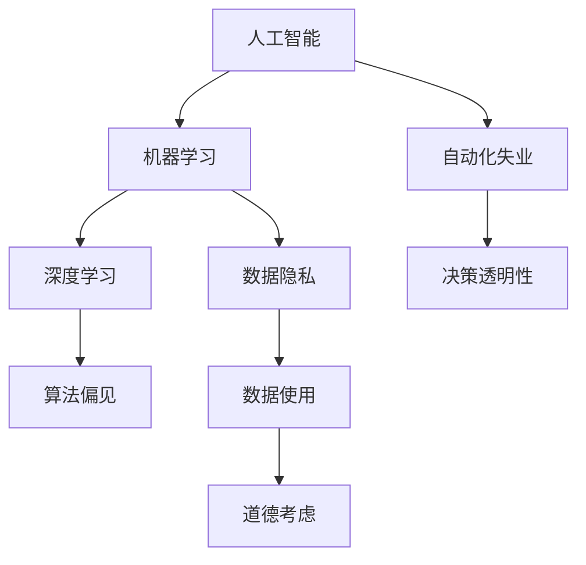

                 

## 1. 背景介绍

在数字经济时代，人工智能（AI）正迅速改变着商业运营的各个方面。从自动化生产线到智能客服，再到精准营销，AI技术的广泛应用极大地提升了企业的运营效率和竞争优势。然而，AI的发展同时也引发了一系列道德和伦理问题，特别是当AI被广泛应用于商业决策时，这些问题的严重性和复杂性尤为凸显。因此，探讨如何在AI驱动的商业创新中考虑道德因素，具有重要的理论和现实意义。

### 1.1 问题由来

随着AI技术的不断成熟，越来越多的企业开始将其引入商业决策中。例如，金融行业利用AI进行风险评估、欺诈检测；零售业利用AI进行库存管理、个性化推荐；制造业利用AI进行质量控制、生产优化等。这些应用不仅提高了企业的运营效率，也创造了显著的经济价值。然而，随着AI应用范围的扩大，与之相关的道德问题也逐渐浮现。比如，算法偏见、隐私泄露、自动化失业等，这些问题不仅影响企业的商业道德形象，还可能引发社会矛盾和法律纠纷。

### 1.2 问题核心关键点

AI驱动的商业创新面临的道德问题主要集中在以下几个方面：

1. **算法偏见**：AI系统在训练过程中可能吸收和放大数据中的偏见，导致决策结果的不公平。
2. **隐私保护**：AI在处理大量用户数据时，可能侵犯用户的隐私权。
3. **自动化失业**：AI的广泛应用可能导致某些岗位的自动化，从而引发大规模失业。
4. **决策透明性**：AI决策过程的复杂性使得其行为难以解释，导致决策过程缺乏透明度。
5. **数据使用**：AI系统在数据使用过程中可能面临数据获取、处理和共享的伦理挑战。

这些问题不仅影响企业的商业道德形象，还可能引发社会矛盾和法律纠纷，因此需要在AI驱动的商业创新中给予充分的考虑。

## 2. 核心概念与联系

### 2.1 核心概念概述

为更好地理解AI驱动的商业创新中的道德问题，本节将介绍几个密切相关的核心概念：

- **人工智能（AI）**：一种通过模拟人类智能行为（如感知、学习、推理、决策等）的计算机系统。
- **机器学习（ML）**：一种通过数据驱动的算法，使AI系统能够从经验中学习，并根据新数据进行调整。
- **深度学习（DL）**：一种基于神经网络的机器学习技术，能够处理大规模的复杂数据，并从中学习到特征表示。
- **数据隐私**：保护个人和组织的敏感信息，防止其被未经授权的访问或泄露。
- **算法偏见**：指在训练和应用过程中，AI系统可能产生的不公平、歧视性的决策行为。
- **自动化失业**：指由于AI和机器人技术的发展，导致某些岗位的自动化，从而引发大规模失业。

这些核心概念之间的逻辑关系可以通过以下Mermaid流程图来展示：



这个流程图展示了大语言模型的核心概念及其之间的关系：

1. 人工智能通过机器学习和深度学习技术，从数据中学习知识，形成决策能力。
2. 在学习和应用过程中，可能面临数据隐私、算法偏见等伦理和法律问题。
3. 数据的使用需要考虑道德因素，确保数据获取、处理和共享的合法性。
4. 自动化失业是AI技术应用带来的社会问题，需要考虑其对就业的影响。
5. AI决策过程的透明性对企业和社会都至关重要，需要在设计和应用中加以保障。

## 3. 核心算法原理 & 具体操作步骤

### 3.1 算法原理概述

AI驱动的商业创新，尤其是基于深度学习技术的商业应用，通常涉及大量的数据收集、处理和分析。这些步骤中，数据隐私、算法偏见等问题需要得到充分考虑。因此，需要在算法设计、模型训练和应用过程中，引入道德和伦理因素，确保技术应用的合规性和安全性。

### 3.2 算法步骤详解

基于深度学习技术的商业创新，主要包括以下几个关键步骤：

**Step 1: 数据收集与预处理**
- 收集商业运营相关的数据，如销售记录、客户反馈、市场调研等。
- 对数据进行清洗、去噪和标准化处理，确保数据质量。
- 对敏感数据进行脱敏处理，确保数据隐私保护。

**Step 2: 模型设计与训练**
- 根据商业目标，设计适合深度学习模型的架构和训练策略。
- 在训练过程中，使用正则化技术（如L2正则、Dropout等）防止过拟合。
- 引入公平性约束，如利用对抗性训练或公平性约束层，减少算法偏见。
- 定期评估模型性能，确保模型的鲁棒性和泛化能力。

**Step 3: 模型评估与部署**
- 在测试集上评估模型的性能，确保模型的稳定性和可靠性。
- 部署模型至实际应用中，实时监控模型行为，确保合规性和安全性。
- 收集用户反馈，持续优化模型，提升用户体验。

### 3.3 算法优缺点

AI驱动的商业创新具有以下优点：

1. **效率提升**：AI技术能够自动处理和分析大量数据，提高决策的效率和准确性。
2. **创新驱动**：AI能够提供新的视角和解决方案，推动商业创新。
3. **用户个性化**：AI能够根据用户行为和偏好，提供个性化的服务和产品。

同时，该方法也存在一定的局限性：

1. **数据依赖**：模型的性能依赖于数据的质量和数量，数据获取和处理过程可能存在道德和法律问题。
2. **技术复杂性**：深度学习模型复杂，难以解释其内部工作机制，可能缺乏透明性。
3. **模型偏见**：模型可能吸收和放大数据中的偏见，导致决策结果的不公平。
4. **隐私风险**：模型在处理大量数据时，可能侵犯用户隐私，引发道德和法律问题。
5. **道德风险**：模型在商业决策中的使用可能带来新的道德和法律风险，需要严格监管。

尽管存在这些局限性，但就目前而言，基于深度学习技术的商业创新仍是大势所趋。未来相关研究的重点在于如何进一步降低AI技术应用的道德风险，提高模型的透明度和公平性，同时兼顾隐私保护和法律合规性。

### 3.4 算法应用领域

AI驱动的商业创新已经在诸多领域得到了广泛应用，例如：

- **金融行业**：利用AI进行风险评估、欺诈检测、投资策略等。
- **零售业**：利用AI进行个性化推荐、库存管理、客户服务等。
- **制造业**：利用AI进行质量控制、生产优化、供应链管理等。
- **医疗健康**：利用AI进行疾病预测、诊断、治疗方案推荐等。
- **交通物流**：利用AI进行交通预测、智能调度、货物追踪等。

除了上述这些经典应用外，AI技术还被创新性地应用到更多场景中，如智慧城市、智能家居、智能客服等，为商业创新带来了新的突破。

## 4. 数学模型和公式 & 详细讲解 & 举例说明

### 4.1 数学模型构建

在AI驱动的商业创新中，数学模型通常用于描述和优化决策过程。以推荐系统为例，推荐模型的目标是最大化用户满意度。假设用户对商品的评分服从伯努利分布，推荐模型的目标是最大化以下目标函数：

$$
\max_{\theta} \mathbb{E}[R(\theta)]
$$

其中，$R(\theta)$ 为推荐模型在参数 $\theta$ 下的预期回报，通常表示为：

$$
R(\theta) = \sum_{i,j} w_{ij} \log \sigma(\theta^\top a_i + b_j)
$$

其中，$a_i$ 和 $b_j$ 分别为用户和商品的特征向量，$\sigma(\cdot)$ 为 sigmoid 函数，$w_{ij}$ 为特征权重。

### 4.2 公式推导过程

以下我们以推荐系统为例，推导目标函数的梯度计算公式。

首先，假设用户 $i$ 对商品 $j$ 的评分服从伯努利分布，其概率为 $p_{ij} = \sigma(\theta^\top a_i + b_j)$，其中 $\sigma(\cdot)$ 为 sigmoid 函数。推荐系统的目标函数为：

$$
\max_{\theta} \mathbb{E}[R(\theta)] = \max_{\theta} \sum_{i,j} w_{ij} \log p_{ij}
$$

利用梯度上升法进行优化，对 $\theta$ 的梯度计算公式为：

$$
\nabla_{\theta} \mathbb{E}[R(\theta)] = \sum_{i,j} w_{ij} \frac{a_i}{p_{ij}} \frac{1-p_{ij}}{1-p_{ij}^2}
$$

其中，$\frac{a_i}{p_{ij}}$ 为拉格朗日乘数，用于优化目标函数。

在得到目标函数的梯度后，即可带入参数更新公式，完成模型的迭代优化。重复上述过程直至收敛，最终得到理想的目标参数 $\theta^*$。

### 4.3 案例分析与讲解

在推荐系统应用中，模型训练数据的获取和处理是一个重要的环节。例如，某电商公司利用用户行为数据（如浏览记录、购买记录等）训练推荐模型。在数据收集过程中，需要注意以下道德问题：

1. **隐私保护**：确保用户数据匿名化，防止数据泄露。
2. **用户同意**：在数据收集前，获取用户的明确同意，确保数据使用的合法性。
3. **数据公平**：确保数据样本的代表性，防止数据偏见对模型的影响。

## 5. 项目实践：代码实例和详细解释说明

### 5.1 开发环境搭建

在进行AI驱动的商业创新开发前，我们需要准备好开发环境。以下是使用Python进行TensorFlow开发的环境配置流程：

1. 安装Anaconda：从官网下载并安装Anaconda，用于创建独立的Python环境。

2. 创建并激活虚拟环境：
```bash
conda create -n tf-env python=3.8 
conda activate tf-env
```

3. 安装TensorFlow：根据CUDA版本，从官网获取对应的安装命令。例如：
```bash
conda install tensorflow tensorflow-cpu -c conda-forge
```

4. 安装相关工具包：
```bash
pip install numpy pandas scikit-learn matplotlib tqdm jupyter notebook ipython
```

完成上述步骤后，即可在`tf-env`环境中开始AI驱动的商业创新开发。

### 5.2 源代码详细实现

下面我们以推荐系统为例，给出使用TensorFlow进行推荐模型训练的PyTorch代码实现。

首先，定义推荐模型的损失函数和优化器：

```python
import tensorflow as tf
from tensorflow.keras import layers

# 定义模型架构
model = tf.keras.Sequential([
    layers.Dense(64, activation='relu', input_shape=(N,)),
    layers.Dense(1, activation='sigmoid')
])

# 定义损失函数
loss_fn = tf.keras.losses.BinaryCrossentropy(from_logits=True)

# 定义优化器
optimizer = tf.keras.optimizers.Adam(learning_rate=0.001)
```

然后，定义数据生成器和数据预处理函数：

```python
import numpy as np

def generate_data():
    # 生成随机数据
    N = 1000
    X = np.random.randn(N, D)
    y = np.random.randint(2, size=N)
    return X, y

def preprocess_data(X, y):
    # 对数据进行标准化处理
    X = (X - X.mean()) / X.std()
    # 将标签进行二值化处理
    y = (y > 0).astype(np.int32)
    return X, y

# 生成和预处理数据
X, y = generate_data()
X, y = preprocess_data(X, y)
```

接着，定义训练函数：

```python
@tf.function
def train_step(X, y):
    with tf.GradientTape() as tape:
        logits = model(X)
        loss = loss_fn(y, logits)
    gradients = tape.gradient(loss, model.trainable_variables)
    optimizer.apply_gradients(zip(gradients, model.trainable_variables))
    return loss

# 训练模型
epochs = 100
for epoch in range(epochs):
    X, y = preprocess_data(X, y)
    loss = train_step(X, y)
    print(f"Epoch {epoch+1}, loss: {loss.numpy():.4f}")
```

最后，启动模型训练流程：

```python
# 训练模型
train(X, y)
```

以上就是使用TensorFlow进行推荐模型训练的完整代码实现。可以看到，TensorFlow提供了一套灵活的计算图机制，方便开发者对深度学习模型进行快速迭代和优化。

### 5.3 代码解读与分析

让我们再详细解读一下关键代码的实现细节：

**数据生成器**：
- 生成随机数据，模拟用户行为数据，其中 $X$ 为特征向量，$y$ 为用户评分。
- 对数据进行标准化处理，以确保模型训练的稳定性。

**模型架构**：
- 使用两个全连接层，第一层为64个神经元，激活函数为ReLU；第二层为输出层，激活函数为Sigmoid，用于预测用户评分。

**损失函数和优化器**：
- 使用二元交叉熵损失函数，适用于二分类问题。
- 使用Adam优化器，初始学习率为0.001，用于更新模型参数。

**训练函数**：
- 使用TensorFlow的梯度计算图，通过自动微分计算梯度。
- 在每个epoch内，对数据进行预处理，计算损失并更新模型参数。
- 输出每个epoch的平均损失。

**训练流程**：
- 循环迭代100个epoch，每个epoch处理一次数据。
- 每个epoch输出一次平均损失。

可以看到，TensorFlow提供了一套灵活的计算图机制，方便开发者对深度学习模型进行快速迭代和优化。

当然，工业级的系统实现还需考虑更多因素，如模型的保存和部署、超参数的自动搜索、更灵活的任务适配层等。但核心的算法原理基本与此类似。

## 6. 实际应用场景

### 6.1 金融风险管理

在金融行业，AI技术被广泛应用于风险评估、欺诈检测等任务中。通过分析历史数据，AI模型可以自动识别出潜在的风险点和异常行为，从而提高风险管理效率。然而，在处理大量敏感数据时，AI模型可能面临数据隐私和公平性的问题。

例如，某金融公司利用AI进行客户信用评估。在数据收集过程中，需要注意以下道德问题：

1. **隐私保护**：确保用户数据匿名化，防止数据泄露。
2. **用户同意**：在数据收集前，获取用户的明确同意，确保数据使用的合法性。
3. **数据公平**：确保数据样本的代表性，防止数据偏见对模型的影响。

**AI驱动的信用评估模型**：
- 利用历史信用记录数据进行训练，对新客户进行信用评估。
- 在训练过程中，使用正则化技术（如L2正则、Dropout等）防止过拟合。
- 引入公平性约束，如利用对抗性训练或公平性约束层，减少算法偏见。

**数据隐私保护**：
- 对敏感数据进行脱敏处理，确保数据隐私保护。
- 对数据使用进行合规性审查，确保数据处理的合法性。

**模型评估与部署**：
- 在测试集上评估模型的性能，确保模型的稳定性和可靠性。
- 部署模型至实际应用中，实时监控模型行为，确保合规性和安全性。
- 收集用户反馈，持续优化模型，提升用户体验。

### 6.2 零售个性化推荐

在零售业，AI技术被广泛应用于个性化推荐系统中。通过分析用户行为数据，AI模型可以精准推荐用户感兴趣的商品，从而提高销售额和用户满意度。然而，在处理大量用户数据时，AI模型可能面临数据隐私和用户同意的问题。

例如，某电商公司利用AI进行个性化推荐。在数据收集过程中，需要注意以下道德问题：

1. **隐私保护**：确保用户数据匿名化，防止数据泄露。
2. **用户同意**：在数据收集前，获取用户的明确同意，确保数据使用的合法性。
3. **数据公平**：确保数据样本的代表性，防止数据偏见对模型的影响。

**AI驱动的推荐系统**：
- 利用用户行为数据进行训练，对用户进行个性化推荐。
- 在训练过程中，使用正则化技术（如L2正则、Dropout等）防止过拟合。
- 引入公平性约束，如利用对抗性训练或公平性约束层，减少算法偏见。

**数据隐私保护**：
- 对敏感数据进行脱敏处理，确保数据隐私保护。
- 对数据使用进行合规性审查，确保数据处理的合法性。

**模型评估与部署**：
- 在测试集上评估模型的性能，确保模型的稳定性和可靠性。
- 部署模型至实际应用中，实时监控模型行为，确保合规性和安全性。
- 收集用户反馈，持续优化模型，提升用户体验。

### 6.3 智能客服系统

在智能客服系统中，AI技术被广泛应用于自动回复和问题解答。通过分析用户提问，AI模型可以自动生成回复，从而提高客户满意度。然而，在处理用户提问时，AI模型可能面临隐私保护和决策透明性的问题。

例如，某客服系统利用AI进行自动回复。在数据收集过程中，需要注意以下道德问题：

1. **隐私保护**：确保用户数据匿名化，防止数据泄露。
2. **用户同意**：在数据收集前，获取用户的明确同意，确保数据使用的合法性。
3. **决策透明性**：确保AI决策过程透明，用户可以理解和信任AI的决策结果。

**AI驱动的智能客服系统**：
- 利用历史客服数据进行训练，对用户提问进行自动回复。
- 在训练过程中，使用正则化技术（如L2正则、Dropout等）防止过拟合。
- 引入公平性约束，如利用对抗性训练或公平性约束层，减少算法偏见。

**数据隐私保护**：
- 对敏感数据进行脱敏处理，确保数据隐私保护。
- 对数据使用进行合规性审查，确保数据处理的合法性。

**模型评估与部署**：
- 在测试集上评估模型的性能，确保模型的稳定性和可靠性。
- 部署模型至实际应用中，实时监控模型行为，确保合规性和安全性。
- 收集用户反馈，持续优化模型，提升用户体验。

## 7. 工具和资源推荐

### 7.1 学习资源推荐

为了帮助开发者系统掌握AI驱动的商业创新的道德考虑因素，这里推荐一些优质的学习资源：

1. 《人工智能伦理与法律》系列博文：由AI伦理专家撰写，深入浅出地介绍了AI伦理的基本概念和重要问题。

2. 《数据隐私保护》课程：由国际知名大学开设的课程，系统讲解了数据隐私保护的重要性和实践方法。

3. 《AI伦理与法律》书籍：全面介绍了AI伦理和法律的相关理论和实际案例，是系统学习AI伦理的重要参考。

4. HuggingFace官方文档：提供了丰富的预训练模型和道德考虑因素相关的样例代码，是学习AI伦理的重要资源。

5. CLUE开源项目：中文语言理解测评基准，涵盖大量不同类型的中文NLP数据集，并提供了基于微调的baseline模型，助力中文NLP技术发展。

通过对这些资源的学习实践，相信你一定能够快速掌握AI驱动的商业创新中的道德考虑因素，并用于解决实际的AI问题。

### 7.2 开发工具推荐

高效的开发离不开优秀的工具支持。以下是几款用于AI驱动的商业创新开发的常用工具：

1. PyTorch：基于Python的开源深度学习框架，灵活动态的计算图，适合快速迭代研究。

2. TensorFlow：由Google主导开发的开源深度学习框架，生产部署方便，适合大规模工程应用。

3. Weights & Biases：模型训练的实验跟踪工具，可以记录和可视化模型训练过程中的各项指标，方便对比和调优。

4. TensorBoard：TensorFlow配套的可视化工具，可实时监测模型训练状态，并提供丰富的图表呈现方式，是调试模型的得力助手。

5. Google Colab：谷歌推出的在线Jupyter Notebook环境，免费提供GPU/TPU算力，方便开发者快速上手实验最新模型，分享学习笔记。

合理利用这些工具，可以显著提升AI驱动的商业创新开发的效率，加快创新迭代的步伐。

### 7.3 相关论文推荐

AI驱动的商业创新涉及的伦理问题已引起学界的广泛关注。以下是几篇奠基性的相关论文，推荐阅读：

1. 《AI伦理与法律》：系统总结了AI伦理和法律的相关理论和实际案例，是理解AI伦理的重要参考文献。

2. 《数据隐私保护》：介绍了数据隐私保护的重要性和实践方法，是数据隐私保护的重要参考资料。

3. 《算法偏见与公平性》：分析了算法偏见的原因和影响，并提出了减少算法偏见的多种方法，是AI公平性的重要文献。

4. 《AI伦理与伦理审查》：探讨了AI伦理审查的必要性和方法，为AI伦理的实践提供了重要指导。

5. 《AI伦理与可解释性》：分析了AI决策过程的透明性和可解释性问题，提出了增强AI可解释性的多种方法，是AI伦理和可解释性的重要参考文献。

这些论文代表了大语言模型微调技术的发展脉络。通过学习这些前沿成果，可以帮助研究者把握学科前进方向，激发更多的创新灵感。

## 8. 总结：未来发展趋势与挑战

### 8.1 总结

本文对AI驱动的商业创新中的道德问题进行了全面系统的介绍。首先阐述了AI技术在商业运营中的应用，明确了AI驱动的商业创新在提升企业效率、推动商业创新等方面的价值。其次，从原理到实践，详细讲解了AI驱动的商业创新中的道德问题，如算法偏见、隐私保护、自动化失业等，给出了具体的操作流程和技术实现方法。同时，本文还广泛探讨了AI驱动的商业创新在金融、零售、智能客服等诸多行业领域的应用前景，展示了AI驱动的商业创新技术的广阔前景。

通过本文的系统梳理，可以看到，AI驱动的商业创新在提升企业效率、推动商业创新等方面的巨大潜力，但也面临着数据隐私、算法偏见等诸多道德问题。需要在算法设计、模型训练和应用过程中，引入道德和伦理因素，确保技术应用的合规性和安全性。

### 8.2 未来发展趋势

展望未来，AI驱动的商业创新将呈现以下几个发展趋势：

1. **伦理和法律框架的完善**：随着AI技术应用的广泛，伦理和法律框架的完善将成为重要保障。未来，将有更多法律和政策出台，规范AI技术的应用。

2. **数据隐私保护技术的进步**：随着数据隐私保护技术的进步，AI技术在处理敏感数据时将更加安全。未来的AI系统将采用更高级的数据加密和匿名化技术，确保数据隐私保护。

3. **公平性约束的引入**：AI系统在训练和应用过程中，将更加注重公平性约束。未来的AI系统将引入更多的公平性约束机制，减少算法偏见。

4. **透明度和可解释性的提升**：AI系统的透明度和可解释性将成为重要研究课题。未来的AI系统将采用更先进的技术，如因果分析、对抗训练等，增强模型的透明性和可解释性。

5. **多模态融合技术的应用**：未来的AI系统将更多地应用多模态融合技术，实现视觉、语音、文本等多模态数据的协同建模，提高AI系统的综合能力。

以上趋势凸显了AI驱动的商业创新技术的广阔前景。这些方向的探索发展，必将进一步提升AI系统的性能和应用范围，为商业创新带来新的突破。

### 8.3 面临的挑战

尽管AI驱动的商业创新技术已经取得了显著成果，但在迈向更加智能化、普适化应用的过程中，仍面临诸多挑战：

1. **数据获取的复杂性**：AI系统在处理大量数据时，数据获取和处理过程可能存在道德和法律问题，需要更加高效、透明的数据获取方法。

2. **模型的透明性和可解释性**：AI系统的决策过程复杂，难以解释其内部工作机制，可能缺乏透明性。如何增强AI系统的透明性和可解释性，是未来研究的重要方向。

3. **公平性和偏见问题**：AI系统在训练和应用过程中，可能产生算法偏见，导致决策结果的不公平。如何减少算法偏见，确保AI系统的公平性，是未来研究的重要任务。

4. **隐私保护和数据安全**：AI系统在处理大量数据时，可能面临隐私保护和数据安全问题。如何确保数据隐私和安全，是未来研究的重要方向。

5. **伦理和法律合规性**：AI系统的应用过程中，可能面临伦理和法律合规性问题。如何确保AI系统的合规性，是未来研究的重要任务。

这些挑战需要学界和产业界的共同努力，通过不断探索和创新，才能克服这些难题，推动AI驱动的商业创新技术的健康发展。

### 8.4 研究展望

面对AI驱动的商业创新技术面临的挑战，未来的研究需要在以下几个方面寻求新的突破：

1. **伦理和法律研究**：进一步深入研究AI伦理和法律问题，提出更加完善的伦理和法律框架，规范AI技术的应用。

2. **数据隐私保护技术**：研究更加高效、透明的数据获取和处理技术，确保数据隐私保护。

3. **公平性约束机制**：研究更多公平性约束机制，减少算法偏见，确保AI系统的公平性。

4. **透明性和可解释性技术**：研究更先进的技术，增强AI系统的透明性和可解释性。

5. **多模态融合技术**：研究多模态融合技术，实现视觉、语音、文本等多模态数据的协同建模。

6. **伦理和法律审查机制**：建立AI伦理和法律审查机制，确保AI系统的合规性和安全性。

这些研究方向的探索，必将引领AI驱动的商业创新技术迈向更高的台阶，为构建安全、可靠、可解释、可控的智能系统铺平道路。面向未来，AI驱动的商业创新技术还需要与其他人工智能技术进行更深入的融合，如知识表示、因果推理、强化学习等，多路径协同发力，共同推动自然语言理解和智能交互系统的进步。只有勇于创新、敢于突破，才能不断拓展AI系统的边界，让智能技术更好地造福人类社会。

## 9. 附录：常见问题与解答

**Q1：AI驱动的商业创新是否会带来自动化失业问题？**

A: AI驱动的商业创新可能带来自动化失业问题，尤其是在重复性高、技术要求低的岗位。然而，AI技术也能创造新的岗位，如数据分析、模型训练等。因此，需要关注AI技术的就业影响，并采取适当的政策措施，如职业培训、岗位转型等，缓解失业问题。

**Q2：如何在AI驱动的商业创新中平衡公平性和隐私保护？**

A: 在AI驱动的商业创新中，平衡公平性和隐私保护需要多方面考虑：

1. **数据公平性**：确保数据样本的代表性，防止数据偏见对模型的影响。
2. **隐私保护**：对敏感数据进行脱敏处理，确保数据隐私保护。
3. **公平性约束**：引入公平性约束机制，减少算法偏见。
4. **数据共享**：在数据共享过程中，确保数据使用的合法性和透明性。

通过以上措施，可以在AI驱动的商业创新中平衡公平性和隐私保护。

**Q3：如何在AI驱动的商业创新中引入伦理和法律审查机制？**

A: 在AI驱动的商业创新中引入伦理和法律审查机制需要多方面考虑：

1. **伦理审查委员会**：建立独立的伦理审查委员会，对AI系统的伦理和法律合规性进行审查。
2. **透明性和可解释性**：确保AI系统的透明性和可解释性，便于伦理和法律审查。
3. **用户同意**：在数据收集和使用过程中，获取用户的明确同意，确保数据使用的合法性。
4. **合规性审查**：对AI系统进行合规性审查，确保其符合伦理和法律规定。

通过以上措施，可以在AI驱动的商业创新中引入伦理和法律审查机制。

**Q4：如何在AI驱动的商业创新中提高模型的透明性和可解释性？**

A: 在AI驱动的商业创新中提高模型的透明性和可解释性需要多方面考虑：

1. **透明性技术**：使用因果分析、对抗训练等技术，增强AI系统的透明性。
2. **可解释性技术**：引入可解释性技术，如LIME、SHAP等，解释AI系统的决策过程。
3. **用户反馈**：收集用户反馈，持续优化AI系统的透明性和可解释性。
4. **多模态融合**：利用多模态融合技术，增强AI系统的综合能力，提高其透明性和可解释性。

通过以上措施，可以在AI驱动的商业创新中提高模型的透明性和可解释性。

---

作者：禅与计算机程序设计艺术 / Zen and the Art of Computer Programming

