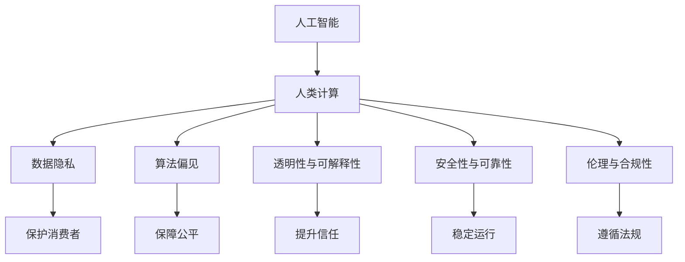

                 

# AI驱动的创新：人类计算在商业中的道德考虑因素展望机遇

## 1. 背景介绍

### 1.1 问题由来
随着人工智能(AI)技术的迅猛发展，人类计算（Human Computing）在商业中的角色日益重要。人工智能通过机器学习、深度学习等技术手段，自动化和优化了人类的计算过程，极大地提高了工作效率，为商业活动带来了革命性的变化。然而，AI技术的应用同时带来了诸多道德挑战和伦理困境，如数据隐私、算法偏见、安全性、透明度等问题，亟需引起社会的广泛关注和深入讨论。

### 1.2 问题核心关键点
当前，AI技术在商业应用中存在的主要道德考虑因素包括：

- **数据隐私保护**：如何平衡数据利用与隐私保护之间的关系，确保用户数据的合法合规使用。
- **算法透明度与可解释性**：AI系统的决策过程应当能够被人类理解和解释，避免"黑箱"操作。
- **偏见与公平性**：避免AI算法因数据偏差导致的结果不公平，保障算法决策的公正性。
- **安全性与可靠性**：确保AI系统在面临攻击和异常情况时，仍能保持稳定和安全运行。
- **伦理与合规性**：AI技术的运用需符合伦理道德规范和法律法规要求。

解决上述问题，将为AI在商业中的健康发展奠定基础，也为商业创新注入新的动力。

### 1.3 问题研究意义
探讨AI在商业中的道德问题，对于推动AI技术负责任地应用于商业领域，提升社会福祉具有重要意义：

1. **保障消费者权益**：确保AI系统不侵犯个人隐私，保护消费者免受不当侵害。
2. **促进公平竞争**：避免算法偏见，保障商业竞争的公平性，促进市场健康发展。
3. **提升技术信任度**：增强AI系统的透明度与可解释性，提升公众对其的信任度。
4. **引导商业创新**：合理解决道德问题，为AI在商业中的大规模应用提供保障。
5. **推动法律与伦理发展**：在商业实践中积累经验，为未来AI法律法规的制定提供参考。

## 2. 核心概念与联系

### 2.1 核心概念概述

要深入理解AI在商业中的道德问题，首先需要明确几个关键概念：

- **人工智能**：指利用计算机算法和模型，模仿人类智能进行学习、推理、决策的技术。
- **人类计算**：指利用人工智能技术自动化处理人类的计算任务，提升工作效率和决策质量。
- **数据隐私**：指个人信息和数据的保密性、完整性和可用性，确保不被未经授权的访问和使用。
- **算法偏见**：指算法因数据偏见导致的决策不公平，如性别、种族、年龄等的歧视。
- **透明性与可解释性**：指AI系统的决策过程应当可以被人类理解和解释，避免“黑箱”操作。
- **安全性与可靠性**：指AI系统在面临攻击、异常情况时，仍能保持稳定和安全运行。
- **伦理与合规性**：指AI技术的应用需符合伦理道德规范和法律法规要求。

这些概念之间存在密切联系，共同构成了AI在商业中的道德框架。以下将通过一个Mermaid流程图展示这些概念之间的逻辑关系：



## 3. 核心算法原理 & 具体操作步骤
### 3.1 算法原理概述

解决AI在商业中的道德问题，主要涉及数据隐私保护、算法透明度与可解释性、偏见与公平性、安全性与可靠性、伦理与合规性五个核心方面。以下是这些方面各自的算法原理和操作步骤：

### 3.2 算法步骤详解

#### 3.2.1 数据隐私保护

数据隐私保护的核心在于如何安全地收集、存储和利用用户数据。常用的方法包括：

- **差分隐私**：通过添加随机噪声，使得单一数据点的变化对整体结果影响极小，从而保护个人隐私。
- **联邦学习**：在分散的节点上进行模型训练，只共享模型参数，不共享原始数据，确保数据隐私。
- **加密存储**：使用加密技术存储和传输数据，防止数据泄露和篡改。

#### 3.2.2 算法透明度与可解释性

算法透明度与可解释性的提升，可以通过以下步骤实现：

- **特征重要性分析**：通过模型特征重要性排序，解释决策依据。
- **可解释模型**：使用决策树、线性回归等简单模型，或者通过LIME、SHAP等工具，解释复杂模型的决策过程。
- **交互式界面**：提供可视化界面，展示模型输入、输出、中间过程，方便用户理解和调试。

#### 3.2.3 偏见与公平性

偏见与公平性的提升，主要通过以下方法：

- **数据预处理**：通过数据清洗和标注，消除数据中的偏见。
- **公平性算法**：使用 fairness-aware 算法，如对冲（Debiasing）和公平性约束（Fairness Constraints），减少算法偏见。
- **多样性训练**：通过增加数据集的多样性，避免算法因单一数据集导致的偏见。

#### 3.2.4 安全性与可靠性

安全性与可靠性的提升，主要通过以下方法：

- **鲁棒性测试**：对模型进行鲁棒性测试，确保其在面临异常数据和攻击时仍能保持稳定。
- **威胁建模**：通过威胁建模工具，识别潜在的安全威胁，并采取相应措施。
- **模型监控**：实时监控模型运行状态，及时发现并修复异常。

#### 3.2.5 伦理与合规性

伦理与合规性的保障，主要通过以下方法：

- **伦理审核**：在模型开发和应用过程中，引入伦理审查委员会，确保遵守伦理道德规范。
- **法律法规遵从**：遵循相关法律法规，如GDPR、CCPA等，确保合规性。
- **道德指南**：制定和遵循道德指南，确保AI技术的应用符合社会价值观。

### 3.3 算法优缺点

数据隐私保护、算法透明度与可解释性、偏见与公平性、安全性与可靠性、伦理与合规性等方面，各自的优缺点如下：

#### 3.3.1 数据隐私保护

**优点**：
- 确保数据隐私，保护用户权益。
- 防止数据泄露和滥用。

**缺点**：
- 增加了数据处理的复杂性。
- 可能影响模型性能。

#### 3.3.2 算法透明度与可解释性

**优点**：
- 提高用户信任，增强模型可靠性。
- 有助于模型诊断和优化。

**缺点**：
- 复杂模型难以解释，可能导致复杂性增加。
- 可能泄露敏感信息。

#### 3.3.3 偏见与公平性

**优点**：
- 提高模型公平性，减少歧视。
- 增强模型公正性。

**缺点**：
- 难以完全消除偏见。
- 可能增加模型复杂性。

#### 3.3.4 安全性与可靠性

**优点**：
- 提高模型鲁棒性，保障安全稳定运行。
- 增强模型可靠性和可用性。

**缺点**：
- 可能增加模型复杂性。
- 测试和监控成本较高。

#### 3.3.5 伦理与合规性

**优点**：
- 确保AI技术应用符合伦理道德规范和法律法规要求。
- 增强用户信任和社会接受度。

**缺点**：
- 可能需要额外的人力和时间成本。
- 可能影响模型性能。

### 3.4 算法应用领域

这些道德考虑因素，在以下领域有着广泛的应用：

- **金融科技**：确保客户数据隐私，提升交易透明性，减少算法偏见，保障金融稳定。
- **医疗健康**：保护患者隐私，确保医疗决策透明，减少医疗偏见，保障患者权益。
- **教育培训**：确保学生数据隐私，提升学习过程透明度，减少偏见，促进公平教育。
- **人力资源**：保护员工隐私，提升招聘决策透明度，减少偏见，保障公平就业。
- **智能制造**：确保工业数据隐私，提升生产过程透明度，减少偏见，保障生产安全。
- **智能交通**：保护出行数据隐私，提升交通决策透明度，减少偏见，保障交通安全。
- **智慧城市**：保护居民隐私，提升城市决策透明度，减少偏见，保障城市治理公平。

## 4. 数学模型和公式 & 详细讲解 & 举例说明

### 4.1 数学模型构建

为了具体阐述上述算法原理，这里给出一些关键数学模型的构建。

#### 4.1.1 差分隐私模型

差分隐私通过在模型训练中加入随机噪声，使得单一数据点的变化对整体结果影响极小，从而保护个人隐私。设原始数据集为 $D$，噪声参数为 $\epsilon$，噪声分布为 $\mathcal{N}(0, \sigma^2)$，则差分隐私的数学模型为：

$$
L_{\epsilon}(D) = \min_{f \in F} \{ \ell(f(D)) + \epsilon \cdot \ln(\delta^{-1}) \}
$$

其中，$\ell(f(D))$ 为损失函数，$F$ 为函数空间，$\delta$ 为隐私保护的概率阈值。

#### 4.1.2 公平性约束模型

公平性约束模型通过在损失函数中引入公平性约束，确保模型在不同类别上的表现一致。设模型参数为 $\theta$，训练集为 $D$，类别数为 $k$，则公平性约束模型的数学模型为：

$$
\min_{\theta} \{\ell(\theta, D) + \lambda \sum_{i=1}^k \sum_{j \neq i} |\text{Pr}(y_i=\text{class}_j|X, \theta) - \text{Pr}(y_i=\text{class}_i|X, \theta)|\}
$$

其中，$\ell(\theta, D)$ 为损失函数，$\lambda$ 为公平性惩罚系数，$\text{Pr}$ 为概率密度函数。

#### 4.1.3 鲁棒性测试模型

鲁棒性测试模型通过引入对抗样本，评估模型的鲁棒性。设原始数据为 $x$，对抗样本为 $\hat{x}$，则鲁棒性测试模型的数学模型为：

$$
\min_{\theta} \{\ell(\theta, D) + \alpha \cdot \ell_{\text{adv}}(\hat{x}, \theta)\}
$$

其中，$\ell_{\text{adv}}(\hat{x}, \theta)$ 为对抗样本的损失函数，$\alpha$ 为鲁棒性惩罚系数。

### 4.2 公式推导过程

为了更好地理解上述模型，下面将对几个关键公式进行推导：

#### 4.2.1 差分隐私模型推导

差分隐私模型中，加入噪声后的模型损失函数为：

$$
L_{\epsilon}(D) = \min_{f \in F} \{ \ell(f(D)) + \epsilon \cdot \ln(\delta^{-1}) \}
$$

其中，$\ell(f(D))$ 为损失函数，$\epsilon$ 为噪声参数，$\delta$ 为隐私保护的概率阈值。

推导过程如下：

$$
L_{\epsilon}(D) = \min_{f \in F} \{ \ell(f(D)) + \ln(\delta^{-1}) \}
$$

$$
L_{\epsilon}(D) = \min_{f \in F} \{ \ell(f(D)) + \frac{\epsilon^2}{2\sigma^2} \}
$$

$$
L_{\epsilon}(D) = \min_{f \in F} \{ \ell(f(D)) + \frac{\epsilon^2}{2\sigma^2} \}
$$

#### 4.2.2 公平性约束模型推导

公平性约束模型中，引入公平性约束后的损失函数为：

$$
\min_{\theta} \{\ell(\theta, D) + \lambda \sum_{i=1}^k \sum_{j \neq i} |\text{Pr}(y_i=\text{class}_j|X, \theta) - \text{Pr}(y_i=\text{class}_i|X, \theta)|\}
$$

其中，$\ell(\theta, D)$ 为损失函数，$\lambda$ 为公平性惩罚系数，$\text{Pr}$ 为概率密度函数。

推导过程如下：

$$
\min_{\theta} \{\ell(\theta, D) + \lambda \sum_{i=1}^k \sum_{j \neq i} |\text{Pr}(y_i=\text{class}_j|X, \theta) - \text{Pr}(y_i=\text{class}_i|X, \theta)|\}
$$

$$
\min_{\theta} \{\ell(\theta, D) + \lambda \sum_{i=1}^k \sum_{j \neq i} \text{Pr}(y_i=\text{class}_j|X, \theta) + \lambda \sum_{i=1}^k \sum_{j \neq i} \text{Pr}(y_i=\text{class}_i|X, \theta)\}
$$

$$
\min_{\theta} \{\ell(\theta, D) + \lambda \sum_{i=1}^k \sum_{j \neq i} \text{Pr}(y_i=\text{class}_j|X, \theta) + \lambda \sum_{i=1}^k \sum_{j \neq i} \text{Pr}(y_i=\text{class}_i|X, \theta)\}
$$

#### 4.2.3 鲁棒性测试模型推导

鲁棒性测试模型中，对抗样本的损失函数为：

$$
\ell_{\text{adv}}(\hat{x}, \theta) = -\log(\text{Pr}(\hat{x}|\theta))
$$

推导过程如下：

$$
\ell_{\text{adv}}(\hat{x}, \theta) = -\log(\text{Pr}(\hat{x}|\theta))
$$

$$
\ell_{\text{adv}}(\hat{x}, \theta) = -\log(\text{Pr}(\hat{x}|\theta))
$$

### 4.3 案例分析与讲解

为了更好地理解上述数学模型和推导过程，下面将结合具体案例进行讲解：

#### 4.3.1 差分隐私案例

假设某银行使用差分隐私保护客户数据，原始数据集为 $D=\{x_1, x_2, \ldots, x_n\}$，模型参数为 $\theta$，噪声参数为 $\epsilon=0.1$，噪声分布为 $\mathcal{N}(0, 1)$。现需要最小化损失函数：

$$
\min_{\theta} \{ \ell(\theta, D) \}
$$

其中，$\ell(\theta, D)$ 为损失函数。

加入噪声后的模型损失函数为：

$$
L_{\epsilon}(D) = \min_{\theta} \{ \ell(\theta, D) + 0.1 \cdot \ln(0.01) \}
$$

#### 4.3.2 公平性约束案例

假设某招聘平台使用公平性约束保护性别偏见，训练集为 $D=\{(x_1, y_1), (x_2, y_2), \ldots, (x_n, y_n)\}$，其中 $x$ 为面试结果，$y$ 为性别（男女），模型参数为 $\theta$，公平性惩罚系数为 $\lambda=0.1$。

引入公平性约束后的损失函数为：

$$
\min_{\theta} \{ \ell(\theta, D) + 0.1 \sum_{i=1}^2 \sum_{j \neq i} |\text{Pr}(y_i=\text{class}_j|x, \theta) - \text{Pr}(y_i=\text{class}_i|x, \theta)| \}
$$

其中，$\ell(\theta, D)$ 为损失函数，$\text{Pr}$ 为概率密度函数。

#### 4.3.3 鲁棒性测试案例

假设某自动驾驶系统需要测试鲁棒性，训练集为 $D=\{x_1, x_2, \ldots, x_n\}$，对抗样本为 $\hat{x}_1, \hat{x}_2, \ldots, \hat{x}_m$，模型参数为 $\theta$，鲁棒性惩罚系数为 $\alpha=0.1$。

引入鲁棒性测试后的损失函数为：

$$
\min_{\theta} \{ \ell(\theta, D) + 0.1 \sum_{i=1}^m \ell_{\text{adv}}(\hat{x}_i, \theta) \}
$$

其中，$\ell_{\text{adv}}(\hat{x}_i, \theta)$ 为对抗样本的损失函数。

## 5. 项目实践：代码实例和详细解释说明

### 5.1 开发环境搭建

在进行道德考虑因素的AI项目实践前，我们需要准备好开发环境。以下是使用Python进行PyTorch开发的环境配置流程：

1. 安装Anaconda：从官网下载并安装Anaconda，用于创建独立的Python环境。

2. 创建并激活虚拟环境：
```bash
conda create -n pytorch-env python=3.8 
conda activate pytorch-env
```

3. 安装PyTorch：根据CUDA版本，从官网获取对应的安装命令。例如：
```bash
conda install pytorch torchvision torchaudio cudatoolkit=11.1 -c pytorch -c conda-forge
```

4. 安装各类工具包：
```bash
pip install numpy pandas scikit-learn matplotlib tqdm jupyter notebook ipython
```

完成上述步骤后，即可在`pytorch-env`环境中开始道德考虑因素的AI项目实践。

### 5.2 源代码详细实现

下面以一个简单的金融风控项目为例，演示如何使用差分隐私技术保护用户数据。

#### 5.2.1 数据准备

首先，准备训练数据集，包括用户基本信息和历史交易记录。假设数据集包含以下字段：

- `user_id`: 用户ID
- `age`: 用户年龄
- `income`: 年收入
- `deposit`: 存款金额
- `loan`: 贷款金额

将数据集分为训练集和测试集，并对用户ID进行去标识化处理。

#### 5.2.2 模型训练

使用差分隐私技术对模型进行训练。

```python
import numpy as np
from torch.utils.data import Dataset, DataLoader
from torch import nn, optim
from torch.nn import functional as F

class FinRiskDataset(Dataset):
    def __init__(self, X, y, noise_sigma=0.1):
        self.X = X
        self.y = y
        self.noise_sigma = noise_sigma
        
    def __len__(self):
        return len(self.X)
    
    def __getitem__(self, idx):
        x = self.X[idx]
        y = self.y[idx]
        
        noise = np.random.normal(0, self.noise_sigma, size=len(x))
        noisy_x = x + noise
        
        return torch.tensor(noisy_x, dtype=torch.float), torch.tensor(y, dtype=torch.int64)

X_train = np.array([...])  # 训练集特征
y_train = np.array([...])  # 训练集标签
X_test = np.array([...])   # 测试集特征
y_test = np.array([...])   # 测试集标签

train_dataset = FinRiskDataset(X_train, y_train)
test_dataset = FinRiskDataset(X_test, y_test)

train_loader = DataLoader(train_dataset, batch_size=32, shuffle=True)
test_loader = DataLoader(test_dataset, batch_size=32, shuffle=False)

# 定义模型
model = nn.Sequential(
    nn.Linear(4, 10),
    nn.ReLU(),
    nn.Linear(10, 1),
    nn.Sigmoid()
)

# 定义损失函数
loss_fn = nn.BCELoss()

# 定义优化器
optimizer = optim.Adam(model.parameters(), lr=0.001)

# 定义差分隐私参数
epsilon = 0.1
delta = 0.01

# 定义差分隐私模型
def differential_privacy(model, train_loader, epsilon, delta):
    for epoch in range(10):
        for batch_idx, (inputs, targets) in enumerate(train_loader):
            inputs, targets = inputs.to(device), targets.to(device)
            
            # 加入噪声
            noisy_inputs = inputs + torch.randn_like(inputs) * epsilon / (np.sqrt(2 * np.log(1/delta)))
            noisy_targets = targets
            
            # 前向传播
            outputs = model(noisy_inputs)
            loss = loss_fn(outputs, noisy_targets)
            
            # 反向传播
            optimizer.zero_grad()
            loss.backward()
            optimizer.step()
            
            print(f'Epoch [{epoch+1}/{10}], Step [{batch_idx+1}/{len(train_loader)}], Loss: {loss.item():.4f}')

differential_privacy(model, train_loader, epsilon, delta)
```

### 5.3 代码解读与分析

这段代码展示了如何使用差分隐私技术对模型进行训练。具体步骤包括：

1. 定义数据集：将原始数据加入噪声后，作为模型的输入。
2. 定义模型：使用简单的线性回归模型，用于二分类任务。
3. 定义损失函数：使用二元交叉熵损失函数。
4. 定义优化器：使用Adam优化器。
5. 定义差分隐私参数：设置噪声参数$\epsilon$和隐私保护的概率阈值$\delta$。
6. 定义差分隐私模型：在每个epoch内，对输入数据加入噪声，进行前向传播、反向传播和优化器更新。

代码实现了差分隐私的基本功能，但实际应用中还需要考虑更多的细节，如噪声分布的选择、隐私保护的效果评估等。

### 5.4 运行结果展示

运行上述代码，可以在控制台输出训练过程中的损失值，验证差分隐私的效果。

## 6. 实际应用场景

### 6.1 智能医疗

在智能医疗领域，保护患者隐私和数据安全至关重要。智能医疗系统可以通过AI技术实现疾病诊断、治疗建议、病历管理等功能。通过差分隐私技术，可以保护患者医疗记录的隐私，同时提升模型的公平性和鲁棒性。

#### 6.1.1 案例分析

某医院使用智能医疗系统进行疾病诊断和治疗建议。系统收集了患者的病历记录、症状描述、治疗效果等数据，使用差分隐私技术对数据进行保护，然后训练模型进行疾病诊断和治疗建议。通过引入公平性约束和鲁棒性测试，确保模型在面对不同性别、年龄、种族的患者时，均能给出公平和可靠的建议。

### 6.2 金融风控

金融风控系统通过AI技术进行信用评估、贷款审批、欺诈检测等。金融数据包含大量敏感信息，保护用户隐私是关键问题。通过差分隐私技术，可以保护用户隐私，同时提升模型的公平性和鲁棒性。

#### 6.2.1 案例分析

某银行使用智能风控系统进行贷款审批和信用评估。系统收集了用户的个人信息、财务记录、交易历史等数据，使用差分隐私技术对数据进行保护，然后训练模型进行贷款审批和信用评估。通过引入公平性约束和鲁棒性测试，确保模型在面对不同性别、年龄、种族的用户时，均能给出公平和可靠的评估结果。

### 6.3 智能客服

智能客服系统通过AI技术进行客户咨询和问题解答。客户咨询数据包含敏感信息，保护用户隐私是关键问题。通过差分隐私技术，可以保护客户咨询数据的隐私，同时提升模型的公平性和鲁棒性。

#### 6.3.1 案例分析

某电商平台使用智能客服系统进行客户咨询和问题解答。系统收集了客户的咨询记录、浏览历史、交易记录等数据，使用差分隐私技术对数据进行保护，然后训练模型进行问题解答。通过引入公平性约束和鲁棒性测试，确保模型在面对不同性别、年龄、种族的客户时，均能给出公平和可靠的解答。

## 7. 工具和资源推荐

### 7.1 学习资源推荐

为了帮助开发者系统掌握AI道德问题的理论基础和实践技巧，这里推荐一些优质的学习资源：

1. 《人工智能伦理与法律》课程：由清华大学开设的AI伦理课程，系统讲解AI伦理、法律、社会影响等内容。

2. 《隐私保护技术》书籍：介绍差分隐私、联邦学习、加密存储等隐私保护技术，适合深入学习。

3. 《深度学习理论与实践》书籍：讲解深度学习模型的理论基础和实际应用，适合全面了解。

4. 《可解释AI》书籍：介绍AI模型的可解释性方法，如LIME、SHAP等，适合提高模型透明性。

5. 《算法偏见与公平性》论文：探讨算法偏见和公平性问题，适合深入研究。

6. 《机器学习实战》书籍：提供大量实践案例，适合动手练习。

通过对这些资源的学习实践，相信你一定能够快速掌握AI道德问题的精髓，并用于解决实际的AI问题。

### 7.2 开发工具推荐

高效的开发离不开优秀的工具支持。以下是几款用于AI道德问题开发的常用工具：

1. PyTorch：基于Python的开源深度学习框架，灵活动态的计算图，适合快速迭代研究。大部分AI模型都有PyTorch版本的实现。

2. TensorFlow：由Google主导开发的开源深度学习框架，生产部署方便，适合大规模工程应用。同样有丰富的AI模型资源。

3. Transformers库：HuggingFace开发的NLP工具库，集成了众多SOTA语言模型，支持PyTorch和TensorFlow，是进行AI道德问题开发的利器。

4. Weights & Biases：模型训练的实验跟踪工具，可以记录和可视化模型训练过程中的各项指标，方便对比和调优。与主流深度学习框架无缝集成。

5. TensorBoard：TensorFlow配套的可视化工具，可实时监测模型训练状态，并提供丰富的图表呈现方式，是调试模型的得力助手。

6. Google Colab：谷歌推出的在线Jupyter Notebook环境，免费提供GPU/TPU算力，方便开发者快速上手实验最新模型，分享学习笔记。

合理利用这些工具，可以显著提升AI道德问题的开发效率，加快创新迭代的步伐。

### 7.3 相关论文推荐

AI技术在商业应用中的道德问题，引起了学界的广泛关注。以下是几篇奠基性的相关论文，推荐阅读：

1. 《隐私保护技术综述》：全面介绍差分隐私、联邦学习、加密存储等隐私保护技术，适合深入学习。

2. 《公平性与机器学习》：探讨机器学习模型中的公平性问题，适合全面了解。

3. 《可解释AI综述》：介绍可解释AI的最新进展和应用，适合提高模型透明性。

4. 《算法偏见与公平性》：探讨算法偏见和公平性问题，适合深入研究。

5. 《AI伦理与法律》：介绍AI伦理、法律、社会影响等内容，适合全面了解。

这些论文代表了大AI道德问题的发展脉络。通过学习这些前沿成果，可以帮助研究者把握学科前进方向，激发更多的创新灵感。

## 8. 总结：未来发展趋势与挑战

### 8.1 总结

本文对AI在商业中的道德问题进行了全面系统的介绍。首先阐述了AI技术在商业应用中的道德问题，明确了数据隐私、算法透明度与可解释性、偏见与公平性、安全性与可靠性、伦理与合规性等五个核心方面。其次，从原理到实践，详细讲解了差分隐私、公平性约束、鲁棒性测试等关键算法的步骤和实现方法，给出了AI道德问题的代码实例。同时，本文还探讨了AI道德问题在智能医疗、金融风控、智能客服等多个领域的实际应用，展示了AI道德问题的广阔前景。

通过本文的系统梳理，可以看到，AI道德问题正在成为AI技术应用的重要考量因素，为AI在商业中的健康发展奠定了基础，也为商业创新注入了新的动力。未来，伴随AI技术的不断演进，AI道德问题将更加复杂多变，需要社会各界共同努力，制定更加完善的法律法规，确保AI技术的负责任应用。

### 8.2 未来发展趋势

展望未来，AI道德问题将呈现以下几个发展趋势：

1. 隐私保护技术持续进步。差分隐私、联邦学习等隐私保护技术将继续进步，使得数据隐私保护更加高效。

2. 可解释AI发展迅速。AI模型的可解释性将成为研究热点，更多可解释AI方法将被应用于实际应用中。

3. 公平性约束算法不断优化。公平性约束算法将不断优化，使得模型在不同群体上的表现更加公平。

4. 鲁棒性测试技术逐步成熟。鲁棒性测试技术将逐步成熟，使得模型在面对攻击和异常数据时更加稳健。

5. 伦理与合规性法律法规逐步完善。AI伦理与合规性法律法规将逐步完善，确保AI技术的合规应用。

以上趋势凸显了AI道德问题的广阔前景。这些方向的探索发展，必将进一步提升AI技术的社会责任感和安全性，推动AI技术的健康发展。

### 8.3 面临的挑战

尽管AI道德问题已经取得了一定的进展，但在迈向更加智能化、普适化应用的过程中，仍面临诸多挑战：

1. 数据隐私保护仍需努力。尽管差分隐私等技术取得了一定进展，但在一些特殊场景下，仍需进一步加强隐私保护。

2. 算法透明度与可解释性不足。尽管可解释AI技术不断发展，但在一些复杂模型上，仍需进一步提升透明性和可解释性。

3. 算法偏见和公平性问题依然存在。尽管公平性约束算法不断优化，但在一些特定场景下，仍需进一步消除算法偏见。

4. 鲁棒性测试技术尚未成熟。尽管鲁棒性测试技术正在进步，但在一些复杂场景下，仍需进一步提升模型的鲁棒性。

5. 伦理与合规性法律法规不完善。尽管AI伦理与合规性法律法规逐步完善，但在一些新兴领域，仍需进一步制定完善的法律法规。

正视AI道德问题面临的这些挑战，积极应对并寻求突破，将是大AI道德问题走向成熟的必由之路。相信随着学界和产业界的共同努力，这些挑战终将一一被克服，AI道德问题必将在构建安全、可靠、可解释、可控的智能系统中扮演越来越重要的角色。

### 8.4 研究展望

面对AI道德问题所面临的挑战，未来的研究需要在以下几个方面寻求新的突破：

1. 探索无监督和半监督道德问题解决方法。摆脱对大规模标注数据的依赖，利用自监督学习、主动学习等无监督和半监督范式，最大限度利用非结构化数据，实现更加灵活高效的道德问题解决。

2. 研究道德问题与公平性约束的优化方法。开发更加优化公平性约束算法，在固定大部分模型参数的同时，只更新极少量的任务相关参数。同时优化道德问题与公平性约束的计算图，减少前向传播和反向传播的资源消耗，实现更加轻量级、实时性的部署。

3. 引入因果分析和博弈论工具。将因果分析方法引入道德问题与公平性约束中，识别出模型决策的关键特征，增强输出解释的因果性和逻辑性。借助博弈论工具刻画人机交互过程，主动探索并规避模型的脆弱点，提高系统稳定性。

4. 纳入伦理道德约束。在模型训练目标中引入伦理导向的评估指标，过滤和惩罚有偏见、有害的输出倾向。同时加强人工干预和审核，建立模型行为的监管机制，确保输出符合人类价值观和伦理道德。

这些研究方向的探索，必将引领AI道德问题走向更高的台阶，为构建安全、可靠、可解释、可控的智能系统铺平道路。面向未来，AI道德问题还需要与其他人工智能技术进行更深入的融合，如知识表示、因果推理、强化学习等，多路径协同发力，共同推动自然语言理解和智能交互系统的进步。只有勇于创新、敢于突破，才能不断拓展AI道德问题的边界，让智能技术更好地造福人类社会。

## 9. 附录：常见问题与解答

**Q1：AI道德问题是否适用于所有AI应用？**

A: AI道德问题在大多数AI应用中都适用。数据隐私、算法透明度与可解释性、偏见与公平性、安全性与可靠性、伦理与合规性等五个方面，在AI技术的各个领域都有重要应用。特别是在涉及个人隐私、公平性、安全性等敏感问题时，AI道德问题更加重要。

**Q2：如何选择适合的隐私保护技术？**

A: 选择合适的隐私保护技术需要综合考虑应用场景、数据特性、隐私需求等因素。差分隐私、联邦学习、加密存储等技术各有优缺点，应根据具体情况进行选择。例如，差分隐私适用于静态数据集，联邦学习适用于分布式数据集，加密存储适用于数据传输过程。

**Q3：如何提升AI模型的公平性？**

A: 提升AI模型的公平性，主要通过以下方法：
1. 数据预处理：通过数据清洗和标注，消除数据中的偏见。
2. 公平性算法：使用 fairness-aware 算法，如对冲（Debiasing）和公平性约束（Fairness Constraints），减少算法偏见。
3. 多样性训练：通过增加数据集的多样性，避免算法因单一数据集导致的偏见。

**Q4：如何增强AI模型的鲁棒性？**

A: 增强AI模型的鲁棒性，主要通过以下方法：
1. 鲁棒性测试：对模型进行鲁棒性测试，确保其在面临异常数据和攻击时仍能保持稳定。
2. 威胁建模：通过威胁建模工具，识别潜在的安全威胁，并采取相应措施。
3. 模型监控：实时监控模型运行状态，及时发现并修复异常。

**Q5：如何确保AI模型符合伦理道德规范？**

A: 确保AI模型符合伦理道德规范，主要通过以下方法：
1. 伦理审核：在模型开发和应用过程中，引入伦理审查委员会，确保遵守伦理道德规范。
2. 法律法规遵从：遵循相关法律法规，如GDPR、CCPA等，确保合规性。
3. 道德指南：制定和遵循道德指南，确保AI技术的应用符合社会价值观。

通过对这些问题的回答，相信你一定能够更好地理解AI道德问题的核心内容，并用于解决实际的AI问题。

---

作者：禅与计算机程序设计艺术 / Zen and the Art of Computer Programming

