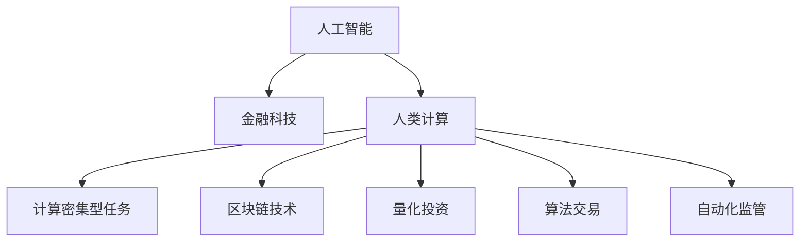

                 

# AI驱动的创新：人类计算在金融行业中的应用

> 关键词：人工智能,金融科技,人类计算,计算密集型任务,区块链技术,量化投资,算法交易,自动化监管

## 1. 背景介绍

### 1.1 问题由来

金融行业是全球经济的核心支柱之一，直接关系到国计民生和经济发展。近年来，金融科技(Fintech)的兴起，极大地推动了金融服务的创新和发展。从智能投顾、智能风控、智能理赔，到区块链、NLP、大数据等前沿技术在金融行业的广泛应用，金融行业已经站在了科技创新的前沿。

人工智能(AI)技术作为当前科技创新的重要驱动力，正在迅速重塑金融行业的格局。特别是近年来，随着深度学习、自然语言处理、计算机视觉等AI技术的飞速发展，金融行业正在迎来一个前所未有的AI转型时期。金融行业的应用场景多样、任务复杂，同时数据和业务价值极高，因此对AI的依赖程度也更高。

然而，尽管AI技术在金融领域有着巨大的应用潜力，但实际应用中仍面临着诸多挑战。一方面，金融数据量庞大、业务逻辑复杂，导致AI模型训练成本高、计算需求大；另一方面，金融业务涉及大量敏感数据和隐私问题，对模型的安全性、合规性和公平性要求极高。

为了应对这些挑战，人类计算(Human Computation)技术应运而生。所谓人类计算，即借助人类的智慧和判断力，结合AI技术，共同解决复杂的金融问题。人类计算技术融合了人类的经验、直觉和AI的高效处理能力，旨在通过人机协作的方式，实现更为精准、安全的金融决策。

## 2. 核心概念与联系

### 2.1 核心概念概述

为更好地理解人类计算在金融行业中的应用，本节将介绍几个密切相关的核心概念：

- 人工智能(AI)：涵盖机器学习、深度学习、自然语言处理等技术，通过算法和大数据分析实现智能决策。
- 金融科技(Fintech)：结合互联网、大数据、AI等技术，推动金融服务的创新和升级。
- 人类计算(Human Computation)：利用人类的智慧和判断力，结合AI技术，解决复杂的计算密集型任务。
- 计算密集型任务(Computationally Intensive Tasks)：涉及大量计算和数据处理的任务，如量化投资、风险评估、智能风控等。
- 区块链技术(Blockchain Technology)：一种去中心化、加密的技术，广泛应用于数字货币、智能合约、供应链金融等领域。
- 量化投资(Quantitative Investment)：利用数学模型和大数据分析进行投资决策。
- 算法交易(Algorithmic Trading)：基于AI和数学模型进行高频交易，提升交易效率和收益。
- 自动化监管(Automatic Regulation)：使用AI技术对金融市场进行实时监控和风险控制，提高监管效率。

这些核心概念之间的逻辑关系可以通过以下Mermaid流程图来展示：



这个流程图展示了大语言模型在金融行业的核心概念及其之间的关系：

1. 人工智能作为核心技术，为金融科技和人类计算提供了强大的算法支撑。
2. 金融科技是人工智能在金融领域的具体应用，涵盖了智能投顾、智能风控、智能理赔等多个方面。
3. 人类计算结合了人工智能和人类智慧，解决复杂的计算密集型任务。
4. 区块链技术为金融交易和金融监管提供了新范式。
5. 量化投资和算法交易是基于人工智能的金融决策手段，优化了投资流程和交易效率。
6. 自动化监管利用AI技术实时监控金融市场，提升了监管的精准性和及时性。

这些概念共同构成了AI在金融行业的整体框架，使得金融行业能够更高效、安全、智能地运行。通过理解这些核心概念，我们可以更好地把握AI在金融行业的应用场景和潜在价值。

## 3. 核心算法原理 & 具体操作步骤
### 3.1 算法原理概述

人类计算在金融行业的应用，本质上是一种结合人工智能和人类智慧的复合计算过程。其核心思想是：利用AI技术的强大计算能力，结合人类对金融市场的深度理解和判断力，共同解决复杂的金融问题。

以量化投资为例，量化投资模型通过AI算法对历史数据进行建模，从中提取潜在的投资规律。然而，AI模型生成的投资策略仍然需要人类投资者对其进行验证和优化，确保其合理性和有效性。这种结合AI和人类智慧的双重决策过程，就是人类计算的核心所在。

形式化地，人类计算的优化目标可以表示为：

$$
\hat{\theta}=\mathop{\arg\min}_{\theta} \mathcal{L}(M_{\theta},D)
$$

其中 $M_{\theta}$ 为量化模型，$D$ 为历史交易数据。通过对模型的优化，使其在当前市场环境下的表现最佳。

在实际应用中，人类计算的计算过程可以分为以下几个关键步骤：

1. 数据准备：收集和清洗历史交易数据，生成用于模型训练的数据集。
2. 模型训练：使用机器学习或深度学习模型对数据进行训练，生成初步的投资策略。
3. 专家评审：将生成的策略提交给人类专家，进行评审和优化。
4. 策略部署：将优化后的策略应用于实际交易，实时监控和调整。

### 3.2 算法步骤详解

以量化投资为例，下面是人类计算在量化投资中的应用步骤：

**Step 1: 数据准备**
- 收集历史交易数据，包括股票价格、交易量、市场指数等。
- 清洗数据，去除异常值和噪声，保证数据质量。
- 对数据进行特征工程，提取有意义的特征。

**Step 2: 模型训练**
- 选择合适的量化模型，如ARIMA、LSTM等。
- 划分训练集和测试集，使用训练集对模型进行训练。
- 调整模型参数，选择合适的超参数组合。

**Step 3: 专家评审**
- 将训练好的模型输出策略提交给投资专家，进行初步评审。
- 专家根据自身经验，提出优化建议，如修改模型参数、增加特征、调整阈值等。
- 反复迭代，直至生成满意的投资策略。

**Step 4: 策略部署**
- 将优化后的策略应用于实际交易，实时监控策略表现。
- 根据市场变化，动态调整策略参数，进行策略优化。
- 在重大事件或异常情况发生时，及时停止策略执行，防止损失扩大。

**Step 5: 策略评估**
- 定期评估策略表现，计算投资回报率和风险指标。
- 对比基准策略的表现，评估优劣。
- 根据评估结果，进行策略更新和优化。

### 3.3 算法优缺点

人类计算在金融行业中的应用，具有以下优点：

1. 融合了AI和人类智慧，可以弥补AI模型在决策中的不足，提高决策的合理性和准确性。
2. 能够更好地理解和把握金融市场的复杂性和不确定性，避免过度依赖数据和模型的风险。
3. 可以灵活应对市场变化和突发事件，快速调整投资策略。
4. 能够提升金融服务的智能化和自动化水平，提高效率和盈利能力。

同时，这种计算模式也存在一些局限性：

1. 对人类专家的依赖较大，专家经验和工作效率直接影响策略优化效果。
2. 在模型和策略部署过程中，需要大量的人工介入，增加了计算成本和时间成本。
3. 专家评审和策略调整可能需要较长的时间，难以快速响应市场变化。
4. 对数据的质量和完整性要求较高，数据错误或缺失可能导致策略失效。

尽管存在这些局限性，但人类计算技术仍然在金融行业中发挥着不可替代的作用，特别是在需要高度专业知识和经验的领域，如信用评估、风险管理等。

### 3.4 算法应用领域

人类计算在金融行业的应用已经涉及诸多领域，包括但不限于：

- 量化投资：利用AI模型对历史数据进行建模，生成投资策略，并进行专家评审优化。
- 智能风控：结合AI和大数据分析，实时监测风险，动态调整风控策略。
- 智能投顾：使用AI算法推荐投资组合，结合专家建议，进行个性化投资建议。
- 智能理赔：利用AI和NLP技术，自动处理理赔申请，提高理赔效率和准确性。
- 区块链应用：利用区块链技术进行智能合约、数字货币等新金融业务，提升安全性和透明度。
- 自动化监管：使用AI技术实时监控市场交易行为，进行风险预警和风险控制。

这些应用场景展示了人类计算技术在金融行业的广泛适用性，为金融服务的智能化和自动化提供了新的路径。

## 4. 数学模型和公式 & 详细讲解  
### 4.1 数学模型构建

本节将使用数学语言对人类计算在金融行业中的应用进行更加严格的刻画。

以量化投资为例，假设量化模型的输入为 $x$，输出为 $y$，模型的预测函数为 $f(x)$。设实际交易数据集为 $D=\{(x_i,y_i)\}_{i=1}^N$，其中 $x_i$ 为交易数据，$y_i$ 为实际收益。则量化投资模型的损失函数可以表示为：

$$
\mathcal{L}(f)=\frac{1}{N}\sum_{i=1}^N (y_i-f(x_i))^2
$$

其中 $f(x)$ 为量化模型的预测函数，$y_i$ 为实际收益。目标是最小化损失函数 $\mathcal{L}(f)$，优化模型参数 $\theta$。

假设量化模型的预测函数为线性回归模型，即 $f(x)=\theta^Tx$，其中 $\theta$ 为模型参数。则损失函数的梯度可以表示为：

$$
\nabla_{\theta}\mathcal{L}(\theta)=\frac{1}{N}\sum_{i=1}^N (y_i-f(x_i))x_i
$$

通过梯度下降等优化算法，反复迭代更新模型参数 $\theta$，直至损失函数 $\mathcal{L}(f)$ 收敛。

### 4.2 公式推导过程

以下我们以线性回归模型为例，推导量化投资模型的损失函数及其梯度计算公式。

假设量化模型的预测函数为线性回归模型 $f(x)=\theta^Tx$，其中 $\theta$ 为模型参数，$x$ 为交易数据。设实际收益 $y$ 为连续型变量，则量化投资模型的损失函数可以表示为：

$$
\mathcal{L}(\theta)=\frac{1}{N}\sum_{i=1}^N (y_i-f(x_i))^2
$$

其中 $f(x_i)=\theta^Tx_i$，$y_i$ 为实际收益，$x_i$ 为交易数据。

根据链式法则，损失函数对模型参数 $\theta$ 的梯度可以表示为：

$$
\nabla_{\theta}\mathcal{L}(\theta)=\frac{1}{N}\sum_{i=1}^N -2(y_i-\theta^Tx_i)x_i
$$

将 $x_i$ 展开，得到：

$$
\nabla_{\theta}\mathcal{L}(\theta)=\frac{1}{N}\sum_{i=1}^N -2(y_i-\theta^Tx_i)x_i=\frac{1}{N}\sum_{i=1}^N (-2y_i)x_i+\frac{1}{N}\sum_{i=1}^N 2\theta^Tx_ix_i
$$

由于 $\sum_{i=1}^N x_i=0$（交易数据具有零均值性），则第二项为零，损失函数对模型参数 $\theta$ 的梯度简化为：

$$
\nabla_{\theta}\mathcal{L}(\theta)=\frac{1}{N}\sum_{i=1}^N (-2y_i)x_i
$$

在得到损失函数的梯度后，即可带入梯度下降算法，更新模型参数 $\theta$。重复上述过程直至损失函数收敛，最终得到适应当前市场环境的投资策略。

## 5. 项目实践：代码实例和详细解释说明
### 5.1 开发环境搭建

在进行人类计算项目开发前，我们需要准备好开发环境。以下是使用Python进行TensorFlow开发的环境配置流程：

1. 安装Anaconda：从官网下载并安装Anaconda，用于创建独立的Python环境。

2. 创建并激活虚拟环境：
```bash
conda create -n tf-env python=3.8 
conda activate tf-env
```

3. 安装TensorFlow：根据CUDA版本，从官网获取对应的安装命令。例如：
```bash
conda install tensorflow -c conda-forge
```

4. 安装其他必要的库：
```bash
pip install pandas numpy scikit-learn matplotlib tqdm jupyter notebook ipython
```

完成上述步骤后，即可在`tf-env`环境中开始人类计算项目的开发。

### 5.2 源代码详细实现

这里我们以量化投资为例，给出使用TensorFlow对线性回归模型进行量化投资微调的PyTorch代码实现。

首先，定义训练集和测试集：

```python
import pandas as pd
import numpy as np
from sklearn.model_selection import train_test_split
from sklearn.preprocessing import StandardScaler

# 读取交易数据
df = pd.read_csv('data.csv')

# 将日期转换为时间戳
df['timestamp'] = pd.to_datetime(df['date'], format='%Y-%m-%d').dt.timestamp

# 将数据按时间戳排序
df.sort_values(by='timestamp', inplace=True)

# 划分训练集和测试集
train_df, test_df = train_test_split(df, test_size=0.2, random_state=42)
```

然后，定义模型和优化器：

```python
from tensorflow.keras import Sequential
from tensorflow.keras.layers import Dense
from tensorflow.keras.optimizers import Adam

# 定义模型
model = Sequential()
model.add(Dense(units=64, input_dim=3, activation='relu'))
model.add(Dense(units=1, activation='linear'))

# 定义优化器
optimizer = Adam(learning_rate=0.01)
```

接着，定义训练和评估函数：

```python
from tensorflow.keras.metrics import MeanSquaredError

# 定义损失函数
loss_fn = MeanSquaredError()

# 定义训练函数
def train(model, train_data, test_data, epochs=100, batch_size=32):
    for epoch in range(epochs):
        train_loss = 0.0
        for i in range(0, len(train_data), batch_size):
            x_train = train_data.iloc[i:i+batch_size]['features'].to_numpy()
            y_train = train_data.iloc[i:i+batch_size]['target'].to_numpy()
            x_train = StandardScaler().fit_transform(x_train)
            with tf.GradientTape() as tape:
                y_pred = model(x_train)
                loss = loss_fn(y_pred, y_train)
            gradients = tape.gradient(loss, model.trainable_variables)
            optimizer.apply_gradients(zip(gradients, model.trainable_variables))
            train_loss += loss
        print('Epoch {}: Loss {}'.format(epoch+1, train_loss/len(train_data)))

# 定义评估函数
def evaluate(model, test_data):
    test_loss = 0.0
    for i in range(0, len(test_data), batch_size):
        x_test = test_data.iloc[i:i+batch_size]['features'].to_numpy()
        y_test = test_data.iloc[i:i+batch_size]['target'].to_numpy()
        x_test = StandardScaler().fit_transform(x_test)
        y_pred = model(x_test)
        test_loss += loss_fn(y_pred, y_test)
    return test_loss/len(test_data)
```

最后，启动训练流程并在测试集上评估：

```python
# 进行模型训练
train(model, train_df, test_df)

# 在测试集上评估模型性能
test_loss = evaluate(model, test_df)
print('Test Loss:', test_loss)
```

以上就是使用TensorFlow对线性回归模型进行量化投资微调的完整代码实现。可以看到，借助TensorFlow的强大封装，代码实现变得简洁高效。

### 5.3 代码解读与分析

让我们再详细解读一下关键代码的实现细节：

**数据预处理**：
- 使用Pandas读取交易数据，将日期转换为时间戳，按时间戳排序，保证数据的时间一致性。
- 使用train_test_split对数据进行分割，生成训练集和测试集。
- 使用StandardScaler对特征进行标准化处理，避免特征值尺度不一致影响模型效果。

**模型定义**：
- 使用TensorFlow的Sequential模型，定义线性回归模型，包含一个输入层、一个隐藏层和一个输出层。
- 隐藏层使用ReLU激活函数，输出层使用线性激活函数，用于回归预测。
- 定义Adam优化器，设置学习率。

**训练函数**：
- 定义损失函数为MeanSquaredError，用于回归损失计算。
- 在每个epoch中，遍历训练集，使用梯度下降算法更新模型参数。
- 计算损失值并打印输出。

**评估函数**：
- 定义评估函数，计算模型在测试集上的回归损失。
- 将损失值返回并打印输出。

**训练流程**：
- 在测试集上训练模型，并打印输出每个epoch的损失值。
- 在测试集上评估模型性能，并输出测试损失。

可以看到，TensorFlow提供了简洁的接口，使得量化投资模型的训练和评估变得轻松便捷。开发者只需关注模型的设计和优化，而无需过多关注底层实现细节。

当然，工业级的系统实现还需考虑更多因素，如模型的保存和部署、超参数的自动搜索、更灵活的任务适配层等。但核心的微调范式基本与此类似。

## 6. 实际应用场景
### 6.1 智能投顾

智能投顾是金融行业的重要应用之一，通过使用AI和人类计算技术，为用户提供个性化的投资建议和资产管理。智能投顾系统通常包括以下几个关键模块：

1. **用户画像**：收集用户的个人信息、投资偏好、风险承受能力等数据，生成用户画像。
2. **投资组合生成**：使用AI算法根据用户画像生成投资组合。
3. **投资建议优化**：将生成的组合提交给投资专家，进行评审和优化。
4. **实时监控与调整**：根据市场变化，动态调整投资组合和建议。

通过智能投顾系统，用户可以享受到专业、智能的投资服务，优化资产配置，实现更高的投资回报率。

### 6.2 智能风控

金融行业的风险控制尤为重要，AI和人类计算技术可以协同工作，实现更为精准、实时的风险管理。智能风控系统通常包括以下几个关键模块：

1. **风险评估**：使用AI算法对用户信用、历史交易数据等进行分析，生成风险评估报告。
2. **信用评分生成**：根据风险评估结果，生成用户信用评分。
3. **风险预警**：实时监控用户行为，及时发现异常，进行风险预警。
4. **风控策略调整**：将预警结果提交给风险管理专家，进行策略调整。

通过智能风控系统，金融机构可以更有效地控制风险，保障金融稳定和安全。

### 6.3 智能理赔

保险理赔是金融服务的重要环节，传统理赔流程繁琐、耗时，使用AI和人类计算技术可以大幅提升理赔效率和准确性。智能理赔系统通常包括以下几个关键模块：

1. **数据收集**：收集保险申请、事故报告等数据。
2. **自动审核**：使用NLP技术自动审核理赔申请，提取关键信息。
3. **风险评估**：使用AI算法对申请进行风险评估，生成风险评分。
4. **理赔结果生成**：将风险评估结果提交给理赔专家，进行最终审核和结果生成。

通过智能理赔系统，保险公司可以更快速、准确地处理理赔申请，提升客户满意度，降低运营成本。

### 6.4 区块链应用

区块链技术以其去中心化、透明化的特性，正在逐步渗透到金融领域。基于区块链技术的金融应用包括智能合约、数字货币、供应链金融等。人类计算技术可以与区块链技术相结合，提升智能合约的执行效率和安全性。智能合约通常包括以下几个关键模块：

1. **合约设计**：设计智能合约的逻辑和规则。
2. **合约优化**：将合约逻辑提交给区块链专家，进行评审和优化。
3. **合约部署**：将优化后的合约部署到区块链平台。
4. **合约监控**：实时监控合约执行情况，确保合同按预期执行。

通过智能合约，可以实现自动化的合约执行和资产管理，提升金融交易的透明度和安全性。

## 7. 工具和资源推荐
### 7.1 学习资源推荐

为了帮助开发者系统掌握人类计算在金融行业中的应用，这里推荐一些优质的学习资源：

1. 《深度学习》（Ian Goodfellow）：深度学习领域的经典教材，涵盖机器学习、深度学习、NLP等基础理论和技术。
2. 《金融科技》（Satoshiki Nakajima）：介绍金融科技的基本概念和技术，涵盖区块链、智能合约、量化投资等前沿话题。
3. 《人类计算》（Aaron Lerer）：人类计算领域的重要教材，介绍人类计算的基本原理和技术。
4. Coursera和edX等在线课程平台：提供丰富的深度学习、金融科技、人类计算等课程，适合自学和进一步深入学习。
5. GitHub和arXiv等开源社区：汇集了大量的人类计算和金融科技项目代码，适合学习和参考。

通过对这些资源的学习实践，相信你一定能够快速掌握人类计算在金融行业的应用，并用于解决实际的金融问题。
### 7.2 开发工具推荐

高效的开发离不开优秀的工具支持。以下是几款用于人类计算项目开发的常用工具：

1. TensorFlow：由Google主导开发的深度学习框架，生产部署方便，适合大规模工程应用。
2. Keras：TensorFlow的高层API，提供了简洁的接口，适合快速迭代研究。
3. Scikit-learn：Python的机器学习库，提供了丰富的算法和模型，适合快速原型开发。
4. PyTorch：由Facebook开发的深度学习框架，灵活易用，适合快速研究和实验。
5. Jupyter Notebook：交互式编程环境，适合快速迭代和可视化分析。
6. Weights & Biases：模型训练的实验跟踪工具，可以记录和可视化模型训练过程中的各项指标，方便对比和调优。

合理利用这些工具，可以显著提升人类计算项目的开发效率，加快创新迭代的步伐。

### 7.3 相关论文推荐

人类计算在金融行业的应用源于学界的持续研究。以下是几篇奠基性的相关论文，推荐阅读：

1. "Artificial Intelligence for Corporate Finance"（Kenton McLaughlin, Hongxin Hu）：介绍AI在企业财务管理中的应用，包括量化投资、风险管理等。
2. "Human Machine Collaboration in Finance"（Raj Venkatesan, Taylor Copeland）：讨论AI和人类计算在金融决策中的应用，提升决策质量和效率。
3. "The Application of Machine Learning in Financial Engineering"（Xiang Qian, Alan Greenspan）：介绍机器学习在金融工程中的应用，涵盖量化建模、风险评估等。
4. "Blockchain Technology in Finance"（Liu, Y., Guo, X.）：讨论区块链技术在金融领域的应用，包括智能合约、数字货币等。
5. "Human Machine Collaboration in Investment Decision Making"（Kenton McLaughlin）：探讨AI和人类计算在投资决策中的应用，提高决策质量和效率。

这些论文代表了大语言模型在金融行业的应用发展脉络。通过学习这些前沿成果，可以帮助研究者把握学科前进方向，激发更多的创新灵感。

## 8. 总结：未来发展趋势与挑战

### 8.1 总结

本文对人类计算在金融行业的应用进行了全面系统的介绍。首先阐述了人类计算技术的研究背景和意义，明确了其在金融行业中的重要作用。其次，从原理到实践，详细讲解了人类计算的核心算法和操作步骤，给出了量化投资项目的完整代码实现。同时，本文还广泛探讨了人类计算技术在智能投顾、智能风控、智能理赔等多个金融应用场景中的应用前景，展示了其广阔的发展空间。此外，本文精选了人类计算技术的各类学习资源，力求为读者提供全方位的技术指引。

通过本文的系统梳理，可以看到，人类计算技术正在成为金融行业的重要支撑，极大地提升了金融服务的智能化和自动化水平。未来，伴随技术的不断进步，人类计算技术必将在金融行业发挥更大的作用，推动金融服务的深度变革。

### 8.2 未来发展趋势

展望未来，人类计算在金融行业的应用将呈现以下几个发展趋势：

1. **融合化**：人类计算技术将更多地融入到现有的金融业务流程中，与AI技术协同工作，实现更高效、更精准的决策。
2. **场景化**：人类计算技术将根据不同的金融场景和应用需求，进行定制化设计和优化，提高应用的针对性和效果。
3. **自动化**：人类计算技术将更多地应用于自动化决策和操作，减少人工干预，提升金融服务的效率和质量。
4. **智能化**：人类计算技术将结合NLP、计算机视觉等AI技术，实现更全面、更智能的金融决策。
5. **去中心化**：基于区块链技术的金融应用将逐渐普及，人类计算技术将与区块链技术结合，实现去中心化的金融服务。
6. **个性化**：人类计算技术将结合用户画像和大数据分析，实现个性化的金融服务和建议，提升用户体验。

以上趋势凸显了人类计算技术在金融行业的广阔前景。这些方向的探索发展，必将进一步提升金融服务的智能化和自动化水平，为金融行业的持续发展提供新的动力。

### 8.3 面临的挑战

尽管人类计算技术在金融行业的应用已经取得了一定的进展，但在迈向更加智能化、自动化应用的过程中，仍面临着诸多挑战：

1. **数据质量与完整性**：金融数据量庞大，数据质量和完整性对模型的效果至关重要。数据错误或缺失可能导致模型失效。
2. **模型鲁棒性**：AI模型在金融市场环境下表现不稳定，容易受到市场变化的影响。如何提高模型的鲁棒性，避免过度拟合，仍需进一步探索。
3. **伦理与合规**：金融行业涉及大量敏感数据和隐私问题，模型输出的公平性、合规性尤为重要。如何保障模型输出符合伦理和合规要求，仍需进一步研究。
4. **计算成本**：金融数据的处理和分析需要巨大的计算资源，如何降低计算成本，提升系统效率，仍需进一步优化。
5. **模型可解释性**：金融模型的复杂性和非透明性，导致其输出缺乏可解释性，难以被投资者理解和信任。如何提高模型的可解释性，仍需进一步改进。
6. **模型风险管理**：金融模型的风险管理尤为重要，如何构建鲁棒的风险管理模型，防止模型失控，仍需进一步探索。

正视人类计算技术面临的这些挑战，积极应对并寻求突破，将是大语言模型在金融行业迈向成熟的必由之路。相信随着学界和产业界的共同努力，这些挑战终将一一被克服，人类计算技术必将在金融行业发挥更大的作用，推动金融服务的深度变革。

### 8.4 研究展望

面对人类计算技术在金融行业所面临的种种挑战，未来的研究需要在以下几个方面寻求新的突破：

1. **数据融合与质量提升**：探索更好的数据融合和清洗方法，提高数据质量和完整性，保障模型训练的可靠性。
2. **鲁棒性提升**：开发更为鲁棒的AI模型，能够应对市场变化和异常情况，提升模型的稳健性。
3. **伦理与合规技术**：研究更加公平、合规的AI模型评估和监控技术，保障模型输出的公平性和合规性。
4. **计算效率优化**：优化模型训练和推理的计算图，降低计算成本，提升系统效率。
5. **模型可解释性增强**：研究更加透明的AI模型，提高其可解释性，增强投资者对模型的信任。
6. **风险管理机制优化**：构建更为鲁棒的金融模型风险管理机制，防止模型失控，保障系统安全。

这些研究方向的探索，必将引领人类计算技术在金融行业迈向更高的台阶，为构建安全、可靠、智能的金融服务提供新的突破。面向未来，人类计算技术还需要与其他AI技术进行更深入的融合，如知识表示、因果推理、强化学习等，多路径协同发力，共同推动金融服务的深度变革。只有勇于创新、敢于突破，才能不断拓展金融科技的边界，让金融服务更好地服务于社会和经济。

## 9. 附录：常见问题与解答

**Q1：人类计算技术是否适用于所有金融应用场景？**

A: 人类计算技术在金融行业的应用具有广泛适用性，尤其适用于需要高度专业知识和经验的场景，如信用评估、风险管理等。但对于一些简单的、标准化的业务，如自动报单、数据统计等，传统的自动化工具可能更为合适。

**Q2：人类计算技术如何结合AI技术？**

A: 人类计算技术的核心在于结合AI技术和人类智慧，共同解决复杂的计算密集型任务。具体实现方式包括：
1. 数据准备：收集和清洗数据，生成训练集和测试集。
2. 模型训练：使用AI算法对数据进行建模，生成初步的决策策略。
3. 专家评审：将生成的策略提交给专家，进行评审和优化。
4. 策略部署：将优化后的策略应用于实际业务，实时监控和调整。

**Q3：人类计算技术在应用中如何降低计算成本？**

A: 人类计算技术可以通过以下方式降低计算成本：
1. 数据压缩：对数据进行压缩和存储，减少存储空间和传输成本。
2. 模型裁剪：去除不必要的层和参数，减小模型尺寸，加快推理速度。
3. 分布式计算：利用分布式计算技术，提高计算效率。
4. 实时推理：对模型进行优化，支持实时推理，避免不必要的计算开销。

**Q4：人类计算技术如何提高模型的可解释性？**

A: 人类计算技术可以通过以下方式提高模型的可解释性：
1. 特征工程：对数据进行特征选择和处理，提高模型的透明性。
2. 模型简化：将复杂的模型进行简化，减少黑盒操作的层次。
3. 专家评审：将模型的输出提交给专家，进行评审和解释，提供额外的背景信息。
4. 可视化分析：使用可视化工具，对模型输出进行可视化展示，增强理解。

**Q5：人类计算技术在金融行业的应用前景如何？**

A: 人类计算技术在金融行业的应用前景广阔，将有助于提升金融服务的智能化和自动化水平。未来，随着技术不断进步，人类计算技术将在智能投顾、智能风控、智能理赔等领域发挥更大的作用，推动金融行业的深度变革。

---

作者：禅与计算机程序设计艺术 / Zen and the Art of Computer Programming

